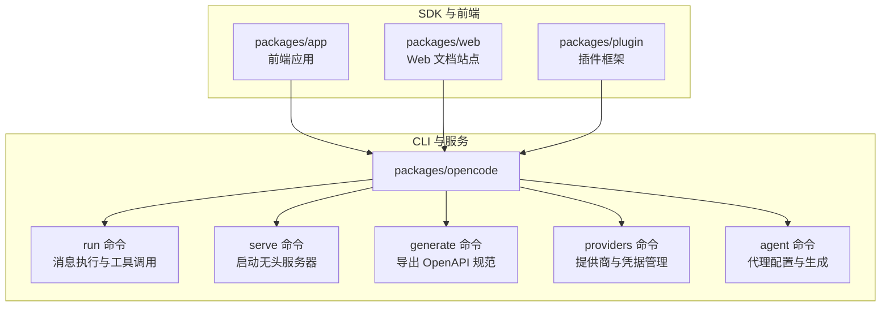
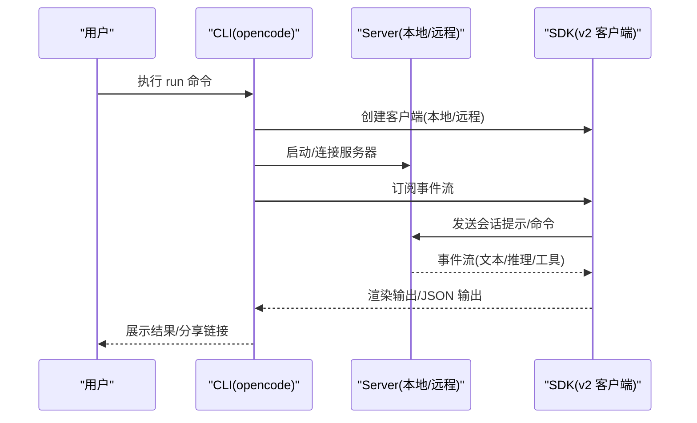
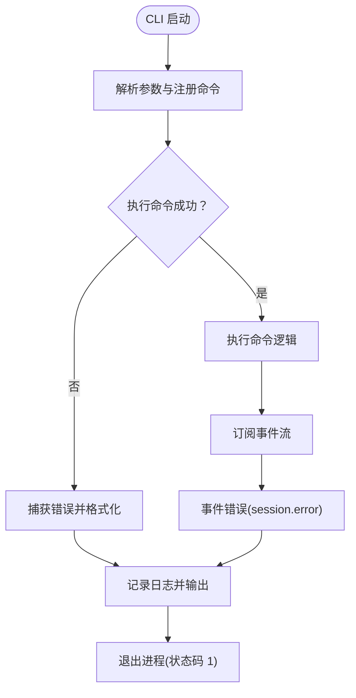
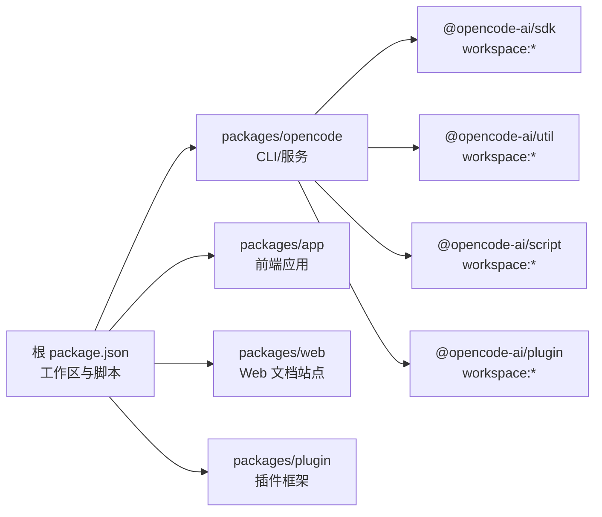

# API 参考

<cite>
**本文引用的文件**
- [README.md](file://README.md)
- [package.json](file://package.json)
- [packages/opencode/package.json](file://packages/opencode/package.json)
- [packages/opencode/src/index.ts](file://packages/opencode/src/index.ts)
- [packages/opencode/src/cli/cmd/run.ts](file://packages/opencode/src/cli/cmd/run.ts)
- [packages/opencode/src/cli/cmd/generate.ts](file://packages/opencode/src/cli/cmd/generate.ts)
- [packages/opencode/src/cli/cmd/serve.ts](file://packages/opencode/src/cli/cmd/serve.ts)
- [packages/opencode/src/cli/cmd/providers.ts](file://packages/opencode/src/cli/cmd/providers.ts)
- [packages/opencode/src/cli/cmd/agent.ts](file://packages/opencode/src/cli/cmd/agent.ts)
- [packages/app/package.json](file://packages/app/package.json)
- [packages/web/package.json](file://packages/web/package.json)
- [packages/plugin/package.json](file://packages/plugin/package.json)
</cite>

## 目录
1. [简介](#简介)
2. [项目结构](#项目结构)
3. [核心组件](#核心组件)
4. [架构总览](#架构总览)
5. [详细组件分析](#详细组件分析)
6. [依赖关系分析](#依赖关系分析)
7. [性能考量](#性能考量)
8. [故障排查指南](#故障排查指南)
9. [结论](#结论)
10. [附录](#附录)

## 简介
本文件为 OpenCode 的完整 API 参考，覆盖以下方面：
- CLI 命令接口：所有命令的语法、参数、选项与典型用法
- SDK API 接口：JavaScript/TypeScript 客户端方法、参数与返回说明（以 v2 客户端为主）
- Web API 接口：REST API 端点、HTTP 方法、请求/响应格式与认证机制
- 插件开发 API：插件接口规范、生命周期管理与扩展点
- 错误码与异常处理：错误模型、错误码参考与排障建议
- 集成模式与示例：常见使用场景的实现路径与最佳实践

## 项目结构
OpenCode 采用多包工作区组织，核心模块包括：
- 核心 CLI 与服务：packages/opencode
- Web 应用：packages/web
- 桌面应用：packages/app
- 插件框架：packages/plugin
- SDK：packages/sdk（通过 workspace:* 引用）

图表来源
- [packages/opencode/src/index.ts:64-185](file://packages/opencode/src/index.ts#L64-L185)
- [packages/opencode/src/cli/cmd/run.ts:221-305](file://packages/opencode/src/cli/cmd/run.ts#L221-L305)
- [packages/opencode/src/cli/cmd/serve.ts:9-24](file://packages/opencode/src/cli/cmd/serve.ts#L9-L24)
- [packages/opencode/src/cli/cmd/generate.ts:4-38](file://packages/opencode/src/cli/cmd/generate.ts#L4-L38)
- [packages/opencode/src/cli/cmd/providers.ts:199-206](file://packages/opencode/src/cli/cmd/providers.ts#L199-L206)
- [packages/opencode/src/cli/cmd/agent.ts:240-245](file://packages/opencode/src/cli/cmd/agent.ts#L240-L245)

章节来源
- [package.json:20-27](file://package.json#L20-L27)
- [packages/opencode/package.json:24-26](file://packages/opencode/package.json#L24-L26)
- [packages/opencode/src/index.ts:64-185](file://packages/opencode/src/index.ts#L64-L185)

## 核心组件
- CLI 入口与路由：解析参数、注册子命令、统一日志与错误处理
- 运行命令（run）：支持本地或远程服务器模式，订阅事件流，渲染工具输出与文本块
- 服务命令（serve）：启动无头服务器，监听网络配置
- OpenAPI 导出（generate）：从运行时收集 OpenAPI 规范并注入 SDK 示例
- 提供商与凭据（providers）：OAuth 与 API Key 登录流程、环境变量与配置联动
- 代理管理（agent）：生成代理配置文件、列出可用代理

章节来源
- [packages/opencode/src/index.ts:1-241](file://packages/opencode/src/index.ts#L1-L241)
- [packages/opencode/src/cli/cmd/run.ts:221-677](file://packages/opencode/src/cli/cmd/run.ts#L221-L677)
- [packages/opencode/src/cli/cmd/serve.ts:9-24](file://packages/opencode/src/cli/cmd/serve.ts#L9-L24)
- [packages/opencode/src/cli/cmd/generate.ts:4-38](file://packages/opencode/src/cli/cmd/generate.ts#L4-L38)
- [packages/opencode/src/cli/cmd/providers.ts:199-479](file://packages/opencode/src/cli/cmd/providers.ts#L199-L479)
- [packages/opencode/src/cli/cmd/agent.ts:240-245](file://packages/opencode/src/cli/cmd/agent.ts#L240-L245)

## 架构总览
OpenCode 的 CLI 作为入口，可直接启动本地服务或连接远程服务；SDK 客户端通过统一的 v2 API 与后端交互；OpenAPI 规范由运行时收集并导出，用于生成 SDK 示例。

图表来源
- [packages/opencode/src/cli/cmd/run.ts:306-677](file://packages/opencode/src/cli/cmd/run.ts#L306-L677)
- [packages/opencode/src/cli/cmd/serve.ts:13-23](file://packages/opencode/src/cli/cmd/serve.ts#L13-L23)

## 详细组件分析

### CLI 命令参考

#### 运行命令（run）
- 功能：发送消息或执行命令，支持本地/远程服务器模式，订阅事件流，渲染工具输出与文本块
- 语法
  - opencode run [message..] [options]
- 主要选项
  - --command, -c：指定命令字符串，参数作为命令参数
  - --continue, -c：继续上次会话
  - --session, -s：指定会话 ID 继续
  - --fork：在继续前分叉会话（需配合 --continue 或 --session）
  - --share：分享会话
  - --model, -m：模型标识，格式为 provider/model
  - --agent：指定代理名称
  - --format：输出格式，默认 default，可选 json
  - --file, -f：附加文件到消息（可多次）
  - --title：会话标题（为空则截断提示）
  - --attach：连接到运行中的 opencode 服务器（如 http://localhost:4096）
  - --password, -p：基本认证密码（默认取自环境变量）
  - --dir：运行目录（本地模式为本地路径；远程模式为远端路径）
  - --port：本地服务器端口（随机端口时省略）
  - --variant：模型变体（提供者特定的推理强度）
  - --thinking：显示推理块
- 行为要点
  - 支持从标准输入读取额外内容
  - 当未提供消息且未指定命令时，报错退出
  - fork 仅在继续会话时有效
  - 事件流中按类型渲染文本、推理、工具调用与错误
  - 可自动分享会话（受配置与标志控制）
- 使用示例
  - 在本地运行并指定模型与代理：opencode run --model openai/gpt-4o --agent build "修复登录页面样式"
  - 连接到远程服务器并附加文件：opencode run --attach http://localhost:4096 --password 123 --file src/index.ts "检查错误"

章节来源
- [packages/opencode/src/cli/cmd/run.ts:221-305](file://packages/opencode/src/cli/cmd/run.ts#L221-L305)
- [packages/opencode/src/cli/cmd/run.ts:306-677](file://packages/opencode/src/cli/cmd/run.ts#L306-L677)

#### 服务命令（serve）
- 功能：启动无头服务器，监听网络配置
- 语法
  - opencode serve [options]
- 主要选项
  - 网络相关选项（由网络选项混入提供）
- 行为要点
  - 若未设置服务器密码，打印安全警告
  - 阻塞等待直到手动停止
- 使用示例
  - opencode serve

章节来源
- [packages/opencode/src/cli/cmd/serve.ts:9-24](file://packages/opencode/src/cli/cmd/serve.ts#L9-L24)

#### OpenAPI 导出（generate）
- 功能：导出当前运行时的 OpenAPI 规范，并注入 SDK 调用示例
- 语法
  - opencode generate
- 行为要点
  - 读取运行时 OpenAPI 规范
  - 为每个 operationId 注入 JS 示例片段
  - 将 JSON 写入标准输出
- 使用示例
  - opencode generate > openapi.json

章节来源
- [packages/opencode/src/cli/cmd/generate.ts:4-38](file://packages/opencode/src/cli/cmd/generate.ts#L4-L38)

#### 提供商与凭据（providers）
- 子命令
  - opencode providers list|ls：列出已配置的提供商与凭据类型
  - opencode providers login [url] [--provider] [--method]：登录提供商（支持 OAuth 与 API Key）
  - opencode providers logout：登出已配置的提供商
- 行为要点
  - login 支持通过 well-known URL 自动获取令牌
  - 支持插件提供的认证方法（多步骤提示、OAuth 授权回调）
  - logout 删除指定提供商的凭据
- 使用示例
  - opencode providers login --provider openai --method api
  - opencode providers logout

章节来源
- [packages/opencode/src/cli/cmd/providers.ts:199-479](file://packages/opencode/src/cli/cmd/providers.ts#L199-L479)

#### 代理管理（agent）
- 子命令
  - opencode agent create [--path] [--description] [--mode] [--tools] [--model]：生成代理配置文件
  - opencode agent list：列出可用代理及其权限
- 行为要点
  - create 支持非交互式参数（全量提供时无需交互）
  - 支持选择工具集与代理模式（all/primary/subagent）
  - list 输出代理名称、模式与权限
- 使用示例
  - opencode agent create --description "修复登录问题" --mode primary --tools read,write,bash

章节来源
- [packages/opencode/src/cli/cmd/agent.ts:240-245](file://packages/opencode/src/cli/cmd/agent.ts#L240-L245)

#### 其他命令（概览）
- account、models、stats、export、import、github、pr、session、db、plug、acp、mcp、tui-thread、attach、web、upgrade、uninstall、debug 等命令均在 CLI 中注册，具体行为由各命令模块实现。

章节来源
- [packages/opencode/src/index.ts:150-172](file://packages/opencode/src/index.ts#L150-L172)

### SDK API 接口（JavaScript/TypeScript）

#### 客户端初始化
- 工厂函数：createOpencodeClient(options)
- 参数
  - baseUrl：服务地址（本地 http://opencode.internal 或远程 http://host:port）
  - headers：可选请求头（如 Basic 认证）
  - fetch：可替换的 fetch 实现（用于本地桥接）
- 返回
  - 客户端实例，包含会话、配置、权限等 API

章节来源
- [packages/opencode/src/cli/cmd/run.ts:663-674](file://packages/opencode/src/cli/cmd/run.ts#L663-L674)

#### 会话与事件
- 会话创建与操作
  - session.create：创建新会话（可带权限规则）
  - session.list：列出会话
  - session.fork：分叉会话
  - session.command：发送命令
  - session.prompt：发送文本/文件消息
- 事件订阅
  - event.subscribe：订阅事件流，按类型渲染文本、推理、工具调用与错误
  - 支持 JSON 格式输出（--format json）
- 权限
  - permission.reply：对权限请求进行回复（默认拒绝）

章节来源
- [packages/opencode/src/cli/cmd/run.ts:381-410](file://packages/opencode/src/cli/cmd/run.ts#L381-L410)
- [packages/opencode/src/cli/cmd/run.ts:441-558](file://packages/opencode/src/cli/cmd/run.ts#L441-L558)

#### 分享与配置
- config.get：获取配置（含分享策略）
- session.share：分享会话并返回分享链接（受配置与标志控制）

章节来源
- [packages/opencode/src/cli/cmd/run.ts:396-409](file://packages/opencode/src/cli/cmd/run.ts#L396-L409)

#### 代理与模型
- app.agents：获取可用代理列表（远程模式下校验代理有效性）
- Provider.parseModel：解析 provider/model 字符串

章节来源
- [packages/opencode/src/cli/cmd/run.ts:560-620](file://packages/opencode/src/cli/cmd/run.ts#L560-L620)
- [packages/opencode/src/cli/cmd/run.ts:644-649](file://packages/opencode/src/cli/cmd/run.ts#L644-L649)

### Web API 接口（REST）

#### OpenAPI 规范导出
- 端点：GET /openapi（由 Server.openapi 提供）
- 行为：返回当前运行时的 OpenAPI 规范，包含 operationId 与路径信息
- 使用：opencode generate 导出并注入 SDK 示例

章节来源
- [packages/opencode/src/cli/cmd/generate.ts:7-27](file://packages/opencode/src/cli/cmd/generate.ts#L7-L27)

#### 认证机制
- Basic 认证：通过 --password 或环境变量 OPENCODE_SERVER_PASSWORD 设置
- 头部：Authorization: Basic base64(username:password)

章节来源
- [packages/opencode/src/cli/cmd/run.ts:655-663](file://packages/opencode/src/cli/cmd/run.ts#L655-L663)
- [packages/opencode/src/cli/cmd/serve.ts:14-16](file://packages/opencode/src/cli/cmd/serve.ts#L14-L16)

### 插件开发 API

#### 插件接口规范
- 插件包导出
  - 默认导出：./src/index.ts
  - 工具扩展：./src/tool.ts
  - TUI 扩展：./src/tui.ts
- 依赖
  - @opencode-ai/sdk：SDK 类型与工具
  - zod：参数校验
  - 可选依赖 @opentui/core 与 @opentui/solid（用于 TUI 扩展）

章节来源
- [packages/plugin/package.json:11-15](file://packages/plugin/package.json#L11-L15)
- [packages/plugin/package.json:19-26](file://packages/plugin/package.json#L19-L26)

#### 生命周期与扩展点
- 认证钩子（auth）：支持多步骤提示、OAuth 授权回调、API Key 输入
- 工具扩展：通过 exports.tool 暴露工具能力
- TUI 扩展：通过 exports.tui 暴露 UI 组件与路由

章节来源
- [packages/opencode/src/cli/cmd/providers.ts:19-170](file://packages/opencode/src/cli/cmd/providers.ts#L19-L170)

### 错误码与异常处理

#### 错误处理流程
- CLI 全局捕获
  - 未处理的 Promise 拒绝与未捕获异常会被记录并输出
  - 根据错误类型输出格式化错误信息
- 命令级错误
  - Unknown argument、Not enough non-option arguments、Invalid values 等将显示帮助
- 事件流错误
  - session.error 事件中提取错误信息并输出
- 文件系统与权限
  - 文件不存在、目录切换失败等会触发错误并退出

图表来源
- [packages/opencode/src/index.ts:173-184](file://packages/opencode/src/index.ts#L173-L184)
- [packages/opencode/src/cli/cmd/run.ts:524-534](file://packages/opencode/src/cli/cmd/run.ts#L524-L534)

章节来源
- [packages/opencode/src/index.ts:40-50](file://packages/opencode/src/index.ts#L40-L50)
- [packages/opencode/src/index.ts:197-234](file://packages/opencode/src/index.ts#L197-L234)
- [packages/opencode/src/cli/cmd/run.ts:524-534](file://packages/opencode/src/cli/cmd/run.ts#L524-L534)

## 依赖关系分析

图表来源
- [package.json:20-27](file://package.json#L20-L27)
- [packages/opencode/package.json:103-106](file://packages/opencode/package.json#L103-L106)

章节来源
- [package.json:20-27](file://package.json#L20-L27)
- [packages/opencode/package.json:103-106](file://packages/opencode/package.json#L103-L106)

## 性能考量
- 事件流渲染：在非 TTY 环境下直接输出文本块，减少渲染开销
- 工具调用：仅在完成或错误时渲染，避免重复输出
- 本地桥接：通过自定义 fetch 将 SDK 请求转发至本地 Server，降低网络延迟
- 日志级别：本地开发默认 DEBUG，生产默认 INFO，可通过 --log-level 调整

## 故障排查指南
- 无法连接远程服务器
  - 检查 --password 与服务端密码一致
  - 确认网络可达与防火墙放行
- 会话无法继续或分叉
  - 确保提供了 --continue 或 --session
  - fork 仅在继续会话时有效
- 事件流不输出
  - 检查 --format 选项与终端 TTY 状态
  - 查看日志文件定位错误
- 凭据登录失败
  - 使用 providers login 重新登录
  - 对于 OAuth，确认授权回调与浏览器可用性

章节来源
- [packages/opencode/src/cli/cmd/run.ts:352-355](file://packages/opencode/src/cli/cmd/run.ts#L352-L355)
- [packages/opencode/src/cli/cmd/run.ts:655-663](file://packages/opencode/src/cli/cmd/run.ts#L655-L663)
- [packages/opencode/src/cli/cmd/providers.ts:273-452](file://packages/opencode/src/cli/cmd/providers.ts#L273-L452)

## 结论
本文档系统梳理了 OpenCode 的 CLI、SDK、Web API 与插件开发接口，给出了命令语法、参数选项、事件流与错误处理的参考。结合 OpenAPI 导出与 SDK 示例，开发者可快速集成与扩展 OpenCode 的能力。

## 附录

### 常见集成模式
- 本地开发：opencode serve 启动服务，opencode run --attach 连接
- 远程协作：在 CI/CD 中使用 --format json 输出事件流，结合外部系统消费
- 插件扩展：通过 @opencode-ai/plugin 的 exports.tool 与 exports.tui 暴露能力

章节来源
- [packages/opencode/src/cli/cmd/serve.ts:13-23](file://packages/opencode/src/cli/cmd/serve.ts#L13-L23)
- [packages/opencode/src/cli/cmd/run.ts:433-439](file://packages/opencode/src/cli/cmd/run.ts#L433-L439)
- [packages/plugin/package.json:11-15](file://packages/plugin/package.json#L11-L15)