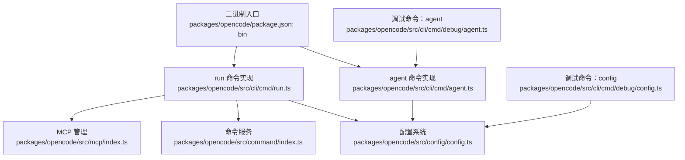
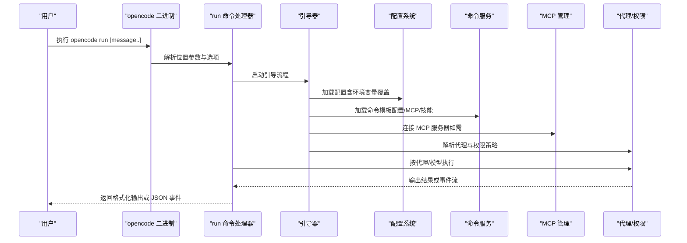
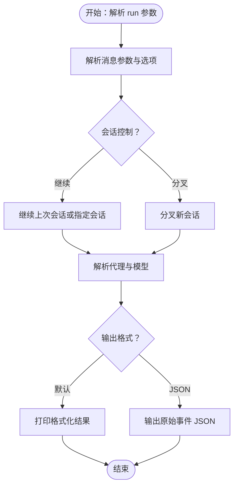
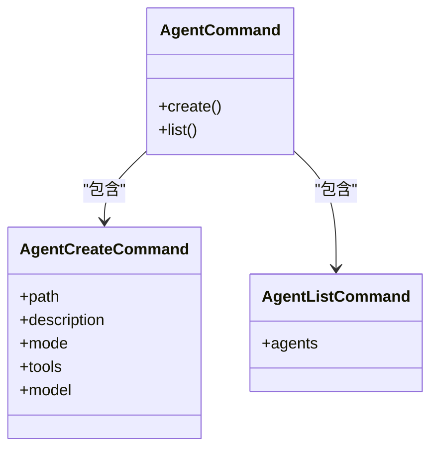
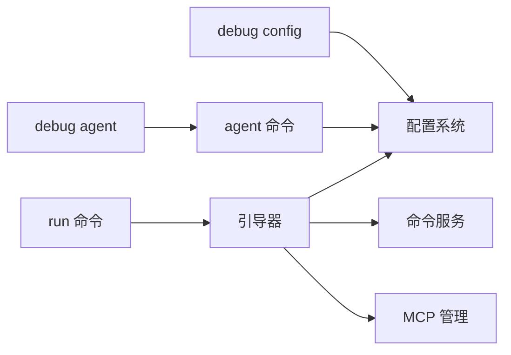

# CLI 接口

<cite>
**本文引用的文件**
- [README.md](file://README.md)
- [packages/opencode/src/cli/cmd/run.ts](file://packages/opencode/src/cli/cmd/run.ts)
- [packages/opencode/src/cli/cmd/agent.ts](file://packages/opencode/src/cli/cmd/agent.ts)
- [packages/opencode/src/cli/cmd/debug/agent.ts](file://packages/opencode/src/cli/cmd/debug/agent.ts)
- [packages/opencode/src/cli/cmd/debug/config.ts](file://packages/opencode/src/cli/cmd/debug/config.ts)
- [packages/opencode/src/command/index.ts](file://packages/opencode/src/command/index.ts)
- [packages/opencode/src/config/config.ts](file://packages/opencode/src/config/config.ts)
- [packages/opencode/src/mcp/index.ts](file://packages/opencode/src/mcp/index.ts)
- [packages/opencode/src/tool/bash.ts](file://packages/opencode/src/tool/bash.ts)
- [packages/opencode/src/permission/arity.ts](file://packages/opencode/src/permission/arity.ts)
- [packages/opencode/package.json](file://packages/opencode/package.json)
- [packages/web/src/content/docs/zh-cn/cli.mdx](file://packages/web/src/content/docs/zh-cn/cli.mdx)
- [packages/web/src/content/docs/tr/cli.mdx](file://packages/web/src/content/docs/tr/cli.mdx)
- [packages/web/src/content/docs/tr/config.mdx](file://packages/web/src/content/docs/tr/config.mdx)
- [packages/web/src/content/docs/ko/agents.mdx](file://packages/web/src/content/docs/ko/agents.mdx)
- [packages/web/src/content/docs/ru/agents.mdx](file://packages/web/src/content/docs/ru/agents.mdx)
</cite>

## 目录
1. [简介](#简介)
2. [项目结构](#项目结构)
3. [核心组件](#核心组件)
4. [架构总览](#架构总览)
5. [详细组件分析](#详细组件分析)
6. [依赖关系分析](#依赖关系分析)
7. [性能考量](#性能考量)
8. [故障排查指南](#故障排查指南)
9. [结论](#结论)
10. [附录：命令语法参考](#附录命令语法参考)

## 简介
本文件面向命令行用户，系统化梳理 OpenCode CLI 的功能与用法，重点覆盖以下内容：
- opencode run 命令的完整参数、选项与使用场景，包括代理选择、模型配置、输出格式、会话控制等
- 初始化命令（init）的配置来源与默认行为
- 代理管理命令（agent）的使用方法与权限控制
- 完整命令语法参考（必选参数、可选参数、标志位、环境变量）
- 实际使用示例与最佳实践
- 错误处理机制与调试选项

## 项目结构
OpenCode CLI 的入口位于包级二进制文件，命令实现集中在 packages/opencode/src/cli/cmd 下，配置与命令模板由配置系统与 MCP 技能加载。

图表来源
- [packages/opencode/package.json:24-26](file://packages/opencode/package.json#L24-L26)
- [packages/opencode/src/cli/cmd/run.ts:221-268](file://packages/opencode/src/cli/cmd/run.ts#L221-L268)
- [packages/opencode/src/cli/cmd/agent.ts:17-245](file://packages/opencode/src/cli/cmd/agent.ts#L17-L245)
- [packages/opencode/src/cli/cmd/debug/config.ts:6-16](file://packages/opencode/src/cli/cmd/debug/config.ts#L6-L16)
- [packages/opencode/src/cli/cmd/debug/agent.ts:15-52](file://packages/opencode/src/cli/cmd/debug/agent.ts#L15-L52)
- [packages/opencode/src/command/index.ts:14-196](file://packages/opencode/src/command/index.ts#L14-L196)
- [packages/opencode/src/config/config.ts:1442-1478](file://packages/opencode/src/config/config.ts#L1442-L1478)
- [packages/opencode/src/mcp/index.ts:475-515](file://packages/opencode/src/mcp/index.ts#L475-L515)

章节来源
- [packages/opencode/package.json:24-26](file://packages/opencode/package.json#L24-L26)
- [packages/opencode/src/cli/cmd/run.ts:221-268](file://packages/opencode/src/cli/cmd/run.ts#L221-L268)
- [packages/opencode/src/cli/cmd/agent.ts:17-245](file://packages/opencode/src/cli/cmd/agent.ts#L17-L245)
- [packages/opencode/src/cli/cmd/debug/config.ts:6-16](file://packages/opencode/src/cli/cmd/debug/config.ts#L6-L16)
- [packages/opencode/src/cli/cmd/debug/agent.ts:15-52](file://packages/opencode/src/cli/cmd/debug/agent.ts#L15-L52)
- [packages/opencode/src/command/index.ts:14-196](file://packages/opencode/src/command/index.ts#L14-L196)
- [packages/opencode/src/config/config.ts:1442-1478](file://packages/opencode/src/config/config.ts#L1442-L1478)
- [packages/opencode/src/mcp/index.ts:475-515](file://packages/opencode/src/mcp/index.ts#L475-L515)

## 核心组件
- 命令解析与执行：基于 yargs 的命令模块封装，支持位置参数与选项，并通过 Effect 运行时提供依赖注入与状态管理。
- 配置系统：按优先级合并全局、项目与自定义路径配置，支持环境变量覆盖。
- 命令模板与动态命令：从配置目录、MCP 与技能加载命令模板，统一暴露给 run 命令使用。
- 代理与权限：内置代理模式与权限策略，支持工具启用/禁用与细粒度权限控制。
- MCP 管理：自动发现与连接 MCP 服务器，聚合工具与提示词。

章节来源
- [packages/opencode/src/cli/cmd/cmd.ts:1-7](file://packages/opencode/src/cli/cmd/cmd.ts#L1-L7)
- [packages/opencode/src/config/config.ts:1442-1478](file://packages/opencode/src/config/config.ts#L1442-L1478)
- [packages/opencode/src/command/index.ts:14-196](file://packages/opencode/src/command/index.ts#L14-L196)
- [packages/opencode/src/mcp/index.ts:475-515](file://packages/opencode/src/mcp/index.ts#L475-L515)

## 架构总览
下图展示 CLI 命令在运行期的关键交互流程：以 run 命令为例，解析参数后进入引导流程，加载配置与命令模板，随后根据代理与模型策略执行任务。

图表来源
- [packages/opencode/src/cli/cmd/run.ts:221-268](file://packages/opencode/src/cli/cmd/run.ts#L221-L268)
- [packages/opencode/src/cli/cmd/debug/config.ts:6-16](file://packages/opencode/src/cli/cmd/debug/config.ts#L6-L16)
- [packages/opencode/src/command/index.ts:14-196](file://packages/opencode/src/command/index.ts#L14-L196)
- [packages/opencode/src/mcp/index.ts:475-515](file://packages/opencode/src/mcp/index.ts#L475-L515)
- [packages/opencode/src/config/config.ts:1442-1478](file://packages/opencode/src/config/config.ts#L1442-L1478)

## 详细组件分析

### opencode run 命令
- 功能概述：以非 TUI 方式直接运行一次对话或任务，适合脚本化、自动化与快速响应。
- 基本语法
  - opencode run [message..]
  - 可选参数与标志位详见“附录：命令语法参考”
- 关键能力
  - 会话控制：支持继续上次会话、指定会话 ID、分叉会话
  - 代理与模型：可指定代理与模型（provider/model）
  - 输出格式：默认格式化输出或 JSON 事件流
  - 附加模式：可连接到已运行的 serve/web 实例，避免 MCP 冷启动开销
- 使用场景
  - 快速问答与解释性任务
  - CI/CD 中的自动化调用
  - 与 serve 实例配合，降低延迟

图表来源
- [packages/opencode/src/cli/cmd/run.ts:221-268](file://packages/opencode/src/cli/cmd/run.ts#L221-L268)

章节来源
- [packages/opencode/src/cli/cmd/run.ts:221-268](file://packages/opencode/src/cli/cmd/run.ts#L221-L268)
- [packages/web/src/content/docs/zh-cn/cli.mdx:16-18](file://packages/web/src/content/docs/zh-cn/cli.mdx#L16-L18)
- [packages/web/src/content/docs/tr/cli.mdx:312-336](file://packages/web/src/content/docs/tr/cli.mdx#L312-L336)

### 初始化命令（init）
- 功能概述：引导式生成初始化命令模板，便于快速建立项目上下文与工作流。
- 行为特征
  - 默认命令名称：init
  - 模板来源：内置模板与配置目录中的命令文件
  - 提示词占位符：支持 $n 与 $ARGUMENTS 占位符
- 使用建议
  - 在项目根目录首次使用，结合 .opencode/command 或 .opencode/commands 目录扩展自定义命令
  - 通过 OPENCODE_CONFIG 与 OPENCODE_CONFIG_DIR 调整配置来源

章节来源
- [packages/opencode/src/command/index.ts:63-104](file://packages/opencode/src/command/index.ts#L63-L104)
- [packages/opencode/src/command/index.ts:53-61](file://packages/opencode/src/command/index.ts#L53-L61)
- [packages/web/src/content/docs/tr/config.mdx:112-157](file://packages/web/src/content/docs/tr/config.mdx#L112-L157)

### 代理管理命令（agent）
- 子命令
  - opencode agent create：创建新代理，支持非交互与交互两种模式
  - opencode agent list：列出可用代理及其权限配置
- 创建代理关键选项
  - --path：目标目录
  - --description：代理职责描述
  - --mode：代理模式（all/primary/subagent）
  - --tools：启用的工具列表（逗号分隔）
  - --model：指定模型（provider/model）
- 权限控制
  - 支持对 edit、bash、webfetch 等工具的权限策略：ask（请求确认）、allow（允许）、deny（禁用）
  - 支持通配符与路径匹配，实现精细授权
- 调试
  - opencode debug agent <name>：查看代理配置详情与可用工具解析结果

图表来源
- [packages/opencode/src/cli/cmd/agent.ts:17-245](file://packages/opencode/src/cli/cmd/agent.ts#L17-L245)

章节来源
- [packages/opencode/src/cli/cmd/agent.ts:17-245](file://packages/opencode/src/cli/cmd/agent.ts#L17-L245)
- [packages/opencode/src/cli/cmd/debug/agent.ts:15-52](file://packages/opencode/src/cli/cmd/debug/agent.ts#L15-L52)
- [packages/web/src/content/docs/ko/agents.mdx:363-427](file://packages/web/src/content/docs/ko/agents.mdx#L363-L427)
- [packages/web/src/content/docs/ru/agents.mdx:391-429](file://packages/web/src/content/docs/ru/agents.mdx#L391-L429)

### 配置与环境变量
- 配置加载顺序（优先级从高到低）
  - 自定义配置文件（OPENCODE_CONFIG）
  - 自定义配置目录（OPENCODE_CONFIG_DIR）
  - 全局配置
  - 项目配置（.opencode）
- 常用环境变量
  - OPENCODE_CONFIG：自定义配置文件路径
  - OPENCODE_CONFIG_DIR：自定义配置目录
  - OPENCODE_DISABLE_PROJECT_CONFIG：禁用项目配置
  - OPENCODE_CLIENT：用于 ACP 客户端标识
- 调试命令
  - opencode debug config：输出解析后的最终配置

章节来源
- [packages/opencode/src/config/config.ts:1442-1478](file://packages/opencode/src/config/config.ts#L1442-L1478)
- [packages/opencode/src/cli/cmd/debug/config.ts:6-16](file://packages/opencode/src/cli/cmd/debug/config.ts#L6-L16)
- [packages/web/src/content/docs/tr/config.mdx:112-157](file://packages/web/src/content/docs/tr/config.mdx#L112-L157)

### MCP 与工具链
- MCP 服务器管理：自动发现、连接与监控，聚合工具与提示词
- 工具执行与安全
  - bash 工具支持工作目录、超时、描述等参数
  - 权限评估与最长前缀匹配，确保最小授权与安全执行
- 最长前缀匹配算法：用于识别命令的“人类可理解”前缀，提升权限策略的准确性

章节来源
- [packages/opencode/src/mcp/index.ts:475-515](file://packages/opencode/src/mcp/index.ts#L475-L515)
- [packages/opencode/src/tool/bash.ts:448-496](file://packages/opencode/src/tool/bash.ts#L448-L496)
- [packages/opencode/src/permission/arity.ts:1-68](file://packages/opencode/src/permission/arity.ts#L1-L68)

## 依赖关系分析
- 命令层依赖配置与命令服务，命令服务再依赖 MCP 与技能服务
- run 命令在引导阶段加载配置与命令模板，随后根据代理与模型策略执行
- agent 命令依赖配置系统与 UI/提示流程，支持非交互与交互两种创建模式

图表来源
- [packages/opencode/src/cli/cmd/run.ts:221-268](file://packages/opencode/src/cli/cmd/run.ts#L221-L268)
- [packages/opencode/src/command/index.ts:14-196](file://packages/opencode/src/command/index.ts#L14-L196)
- [packages/opencode/src/config/config.ts:1442-1478](file://packages/opencode/src/config/config.ts#L1442-L1478)
- [packages/opencode/src/mcp/index.ts:475-515](file://packages/opencode/src/mcp/index.ts#L475-L515)
- [packages/opencode/src/cli/cmd/agent.ts:17-245](file://packages/opencode/src/cli/cmd/agent.ts#L17-L245)
- [packages/opencode/src/cli/cmd/debug/config.ts:6-16](file://packages/opencode/src/cli/cmd/debug/config.ts#L6-L16)
- [packages/opencode/src/cli/cmd/debug/agent.ts:15-52](file://packages/opencode/src/cli/cmd/debug/agent.ts#L15-L52)

## 性能考量
- 与 serve/web 实例配合：通过 --attach 连接到已运行实例，避免 MCP 冷启动开销，适合频繁调用场景
- 输出格式选择：JSON 事件流更利于流水线处理，但默认格式化输出更易读
- 会话复用：利用 --continue 或 --session 减少重复上下文加载

章节来源
- [packages/web/src/content/docs/tr/cli.mdx:326-336](file://packages/web/src/content/docs/tr/cli.mdx#L326-L336)
- [packages/opencode/src/cli/cmd/run.ts:221-268](file://packages/opencode/src/cli/cmd/run.ts#L221-L268)

## 故障排查指南
- 代理不存在
  - 现象：指定代理名未找到
  - 处理：使用 opencode agent list 查看可用代理，或使用 opencode debug agent <name> 获取详情
- 工具不可用或被拒绝
  - 现象：执行工具时报错或被拒绝
  - 处理：检查代理权限配置（edit、bash、webfetch），必要时调整为 ask/allow 或启用对应工具
- 配置未生效
  - 现象：期望的配置未应用
  - 处理：使用 opencode debug config 输出最终配置，核对 OPENCODE_CONFIG 与 OPENCODE_CONFIG_DIR 设置
- MCP 连接失败
  - 现象：工具缺失或提示词不可用
  - 处理：确认 MCP 服务器配置与网络连通性；检查日志与状态

章节来源
- [packages/opencode/src/cli/cmd/debug/agent.ts:15-52](file://packages/opencode/src/cli/cmd/debug/agent.ts#L15-L52)
- [packages/opencode/src/cli/cmd/debug/config.ts:6-16](file://packages/opencode/src/cli/cmd/debug/config.ts#L6-L16)
- [packages/opencode/src/mcp/index.ts:475-515](file://packages/opencode/src/mcp/index.ts#L475-L515)

## 结论
OpenCode CLI 提供了从命令行直接驱动 AI 编码代理的能力，具备灵活的代理与权限控制、可扩展的命令模板体系以及完善的配置与调试工具。通过合理选择代理、模型与输出格式，并结合会话复用与 serve 实例，可在开发与自动化场景中高效使用。

## 附录：命令语法参考
- opencode run
  - 语法：opencode run [message..]
  - 位置参数
    - message：要发送的消息（可多次传入）
  - 选项
    - --command：指定要执行的命令（使用 message 作为参数）
    - --continue, -c：继续上次会话
    - --session, -s：指定要继续的会话 ID
    - --fork：在继续前分叉会话（需与 --continue 或 --session 配合）
    - --share：共享会话
    - --model, -m：指定模型（provider/model）
    - --agent：指定代理
    - --format：输出格式（default/json，默认 default）
  - 示例
    - opencode run "解释 Go 中上下文的用法"
    - opencode run --attach http://localhost:4096 "解释 JavaScript 中 async/await 的用法"
    - opencode run --continue --format json "生成单元测试"
- opencode agent
  - 子命令
    - opencode agent create
      - 选项
        - --path：目标目录
        - --description：代理职责描述
        - --mode：代理模式（all/primary/subagent）
        - --tools：启用的工具列表（逗号分隔）
        - --model：指定模型（provider/model）
    - opencode agent list：列出可用代理及其权限
  - 示例
    - opencode agent create --path . --description "代码审查助手" --mode primary --tools edit,bash --model openai/gpt-4o
    - opencode agent list
- opencode debug
  - opencode debug config：输出解析后的最终配置
  - opencode debug agent <name>：查看代理配置详情与可用工具解析结果
- 环境变量
  - OPENCODE_CONFIG：自定义配置文件路径
  - OPENCODE_CONFIG_DIR：自定义配置目录
  - OPENCODE_DISABLE_PROJECT_CONFIG：禁用项目配置
  - OPENCODE_CLIENT：ACP 客户端标识

章节来源
- [packages/opencode/src/cli/cmd/run.ts:221-268](file://packages/opencode/src/cli/cmd/run.ts#L221-L268)
- [packages/opencode/src/cli/cmd/agent.ts:17-245](file://packages/opencode/src/cli/cmd/agent.ts#L17-L245)
- [packages/opencode/src/cli/cmd/debug/config.ts:6-16](file://packages/opencode/src/cli/cmd/debug/config.ts#L6-L16)
- [packages/opencode/src/cli/cmd/debug/agent.ts:15-52](file://packages/opencode/src/cli/cmd/debug/agent.ts#L15-L52)
- [packages/web/src/content/docs/tr/config.mdx:112-157](file://packages/web/src/content/docs/tr/config.mdx#L112-L157)