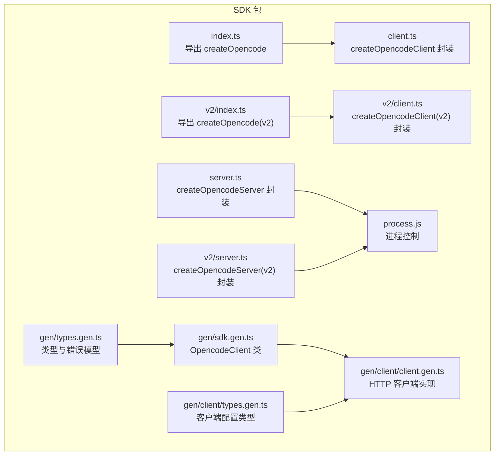
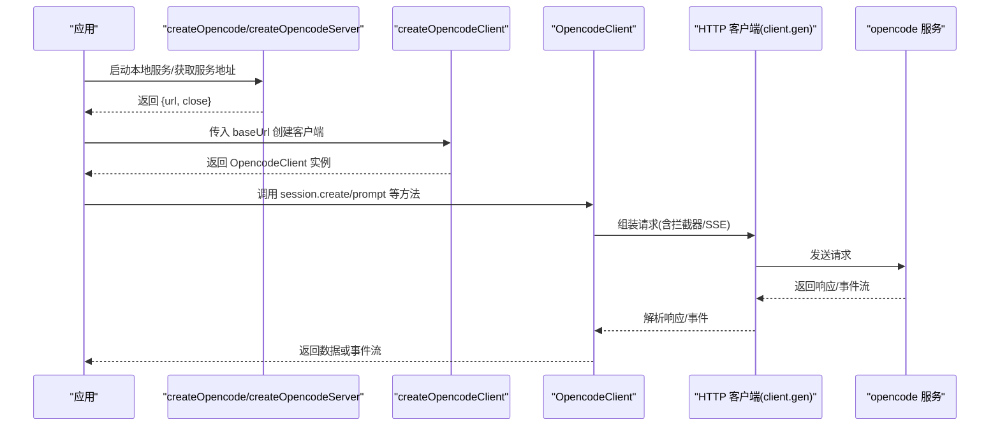
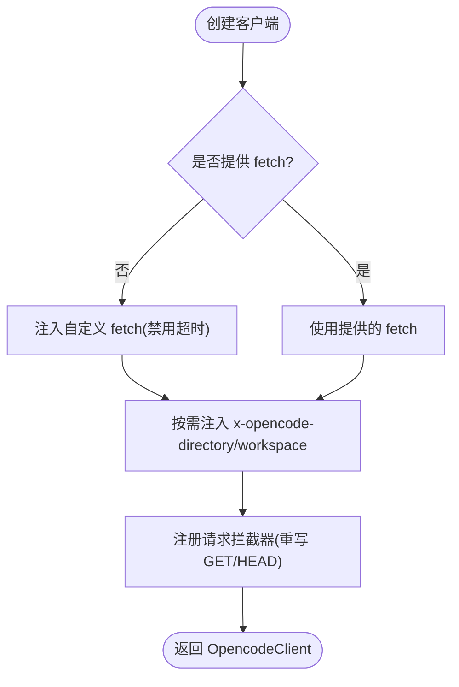
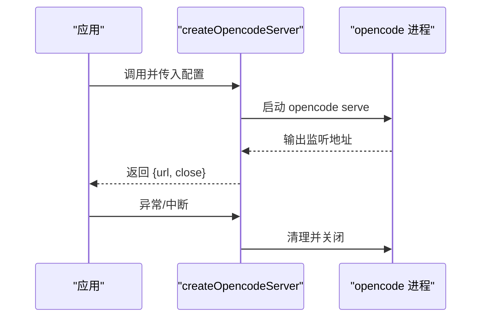
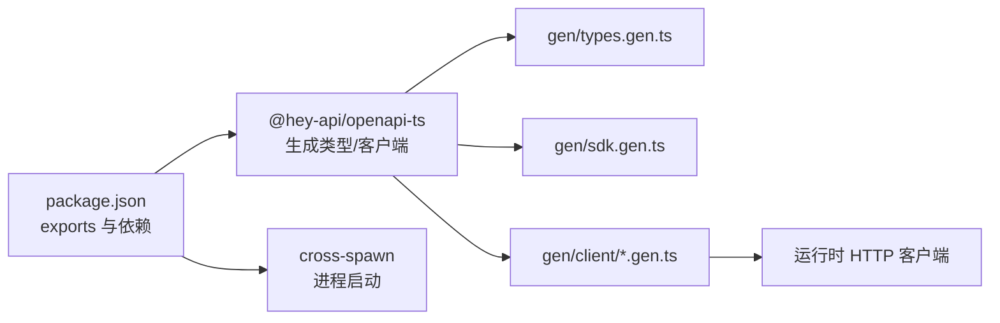

# SDK API

<cite>
**本文引用的文件**
- [packages/sdk/js/src/index.ts](file://packages/sdk/js/src/index.ts)
- [packages/sdk/js/src/client.ts](file://packages/sdk/js/src/client.ts)
- [packages/sdk/js/src/v2/index.ts](file://packages/sdk/js/src/v2/index.ts)
- [packages/sdk/js/src/v2/client.ts](file://packages/sdk/js/src/v2/client.ts)
- [packages/sdk/js/src/server.ts](file://packages/sdk/js/src/server.ts)
- [packages/sdk/js/src/v2/server.ts](file://packages/sdk/js/src/v2/server.ts)
- [packages/sdk/js/src/gen/sdk.gen.ts](file://packages/sdk/js/src/gen/sdk.gen.ts)
- [packages/sdk/js/src/gen/types.gen.ts](file://packages/sdk/js/src/gen/types.gen.ts)
- [packages/sdk/js/src/gen/client/types.gen.ts](file://packages/sdk/js/src/gen/client/types.gen.ts)
- [packages/sdk/js/src/gen/client/client.gen.ts](file://packages/sdk/js/src/gen/client/client.gen.ts)
- [packages/sdk/js/src/gen/client/utils.gen.ts](file://packages/sdk/js/src/gen/client/utils.gen.ts)
- [packages/sdk/js/src/v2/gen/client/utils.gen.ts](file://packages/sdk/js/src/v2/gen/client/utils.gen.ts)
- [packages/sdk/js/example/example.ts](file://packages/sdk/js/example/example.ts)
- [packages/sdk/js/package.json](file://packages/sdk/js/package.json)
</cite>

## 目录
1. [简介](#简介)
2. [项目结构](#项目结构)
3. [核心组件](#核心组件)
4. [架构总览](#架构总览)
5. [详细组件分析](#详细组件分析)
6. [依赖关系分析](#依赖关系分析)
7. [性能考量](#性能考量)
8. [故障排查指南](#故障排查指南)
9. [结论](#结论)
10. [附录](#附录)

## 简介
本文件为 OpenCode 官方 JavaScript/TypeScript SDK 的完整参考文档，覆盖客户端初始化、服务端启动、事件订阅与工具调用等能力。SDK 提供两类主要入口：
- v1：通过 createOpencode 创建本地服务并返回可直接使用的 OpencodeClient。
- v2：在 v1 基础上扩展工作区与目录参数，增强请求重写与拦截能力。

SDK 使用 @hey-api/openapi-ts 自动生成类型与客户端，支持 SSE 事件流、统一错误模型与可插拔拦截器，便于在浏览器或 Node.js 环境中进行类型安全的集成。

## 项目结构
SDK 模块位于 packages/sdk/js，核心文件组织如下：
- 入口与导出：index.ts、v2/index.ts
- 客户端封装：client.ts（v1）、v2/client.ts（v2）
- 服务端封装：server.ts（v1）、v2/server.ts（v2）
- 类型与客户端生成：gen/sdk.gen.ts、gen/types.gen.ts、gen/client/*.gen.ts
- 示例：example/example.ts
- 包配置：package.json

图表来源
- [packages/sdk/js/src/index.ts:1-22](file://packages/sdk/js/src/index.ts#L1-L22)
- [packages/sdk/js/src/client.ts:1-56](file://packages/sdk/js/src/client.ts#L1-L56)
- [packages/sdk/js/src/v2/index.ts:1-22](file://packages/sdk/js/src/v2/index.ts#L1-L22)
- [packages/sdk/js/src/v2/client.ts:1-82](file://packages/sdk/js/src/v2/client.ts#L1-L82)
- [packages/sdk/js/src/server.ts:1-135](file://packages/sdk/js/src/server.ts#L1-L135)
- [packages/sdk/js/src/v2/server.ts:1-135](file://packages/sdk/js/src/v2/server.ts#L1-L135)
- [packages/sdk/js/src/gen/sdk.gen.ts:1-1198](file://packages/sdk/js/src/gen/sdk.gen.ts#L1-L1198)
- [packages/sdk/js/src/gen/client/client.gen.ts:1-213](file://packages/sdk/js/src/gen/client/client.gen.ts#L1-L213)
- [packages/sdk/js/src/gen/types.gen.ts:1-800](file://packages/sdk/js/src/gen/types.gen.ts#L1-L800)
- [packages/sdk/js/src/gen/client/types.gen.ts:1-223](file://packages/sdk/js/src/gen/client/types.gen.ts#L1-L223)

章节来源
- [packages/sdk/js/src/index.ts:1-22](file://packages/sdk/js/src/index.ts#L1-L22)
- [packages/sdk/js/src/v2/index.ts:1-22](file://packages/sdk/js/src/v2/index.ts#L1-L22)
- [packages/sdk/js/src/client.ts:1-56](file://packages/sdk/js/src/client.ts#L1-L56)
- [packages/sdk/js/src/v2/client.ts:1-82](file://packages/sdk/js/src/v2/client.ts#L1-L82)
- [packages/sdk/js/src/server.ts:1-135](file://packages/sdk/js/src/server.ts#L1-L135)
- [packages/sdk/js/src/v2/server.ts:1-135](file://packages/sdk/js/src/v2/server.ts#L1-L135)
- [packages/sdk/js/src/gen/sdk.gen.ts:1-1198](file://packages/sdk/js/src/gen/sdk.gen.ts#L1-L1198)
- [packages/sdk/js/src/gen/client/client.gen.ts:1-213](file://packages/sdk/js/src/gen/client/client.gen.ts#L1-L213)
- [packages/sdk/js/src/gen/types.gen.ts:1-800](file://packages/sdk/js/src/gen/types.gen.ts#L1-L800)
- [packages/sdk/js/src/gen/client/types.gen.ts:1-223](file://packages/sdk/js/src/gen/client/types.gen.ts#L1-L223)

## 核心组件
- OpencodeClient：基于自动生成的 SDK 类，提供对全局事件、项目、会话、文件、命令、工具、MCP/LSP/格式化器、TUI 控制等 API 的类型安全访问。
- 客户端配置类型：Config、ClientOptions、RequestOptions 等，支持 baseUrl、fetch 实现、响应解析策略、SSE 参数、安全认证等。
- 服务器封装：createOpencodeServer/createOpencodeTui，负责启动本地 opencode 服务并返回可连接的 URL。
- v2 扩展：支持工作区与目录参数，自动将 x-opencode-* 请求头转换为查询参数，并在 GET/HEAD 请求中进行重写。

章节来源
- [packages/sdk/js/src/gen/sdk.gen.ts:1157-1198](file://packages/sdk/js/src/gen/sdk.gen.ts#L1157-L1198)
- [packages/sdk/js/src/gen/client/types.gen.ts:10-223](file://packages/sdk/js/src/gen/client/types.gen.ts#L10-L223)
- [packages/sdk/js/src/gen/client/client.gen.ts:20-213](file://packages/sdk/js/src/gen/client/client.gen.ts#L20-L213)
- [packages/sdk/js/src/server.ts:22-100](file://packages/sdk/js/src/server.ts#L22-L100)
- [packages/sdk/js/src/v2/server.ts:22-100](file://packages/sdk/js/src/v2/server.ts#L22-L100)
- [packages/sdk/js/src/client.ts:32-55](file://packages/sdk/js/src/client.ts#L32-L55)
- [packages/sdk/js/src/v2/client.ts:46-81](file://packages/sdk/js/src/v2/client.ts#L46-L81)

## 架构总览
SDK 的典型调用链路如下：应用通过 createOpencode 或 createOpencodeServer 获取服务地址，再用 createOpencodeClient 创建客户端；客户端经由 @hey-api/openapi-ts 生成的 HTTP 客户端发起请求，支持拦截器与 SSE 事件订阅。

图表来源
- [packages/sdk/js/src/index.ts:8-21](file://packages/sdk/js/src/index.ts#L8-L21)
- [packages/sdk/js/src/server.ts:22-100](file://packages/sdk/js/src/server.ts#L22-L100)
- [packages/sdk/js/src/client.ts:32-55](file://packages/sdk/js/src/client.ts#L32-L55)
- [packages/sdk/js/src/gen/sdk.gen.ts:431-701](file://packages/sdk/js/src/gen/sdk.gen.ts#L431-L701)
- [packages/sdk/js/src/gen/client/client.gen.ts:66-179](file://packages/sdk/js/src/gen/client/client.gen.ts#L66-L179)

## 详细组件分析

### 客户端初始化与配置
- v1 初始化
  - createOpencode(options?)：启动本地服务并返回 {client, server}，client 以 server.url 作为 baseUrl。
  - createOpencodeClient(config?)：若未提供 fetch，默认注入一个不触发超时的 fetch 包装；支持 directory 头部自动编码并注入到请求头。
- v2 初始化
  - createOpencode(options?)：同 v1。
  - createOpencodeClient(config?)：支持 directory 与 experimental_workspaceID；请求重写逻辑将 x-opencode-* 头转换为查询参数，仅对 GET/HEAD 生效。
- 客户端配置类型
  - Config：包含 baseUrl、fetch、parseAs、responseStyle、throwOnError 等。
  - RequestOptions：支持 body、path、query、security 等。
  - ClientOptions：基础选项。
- 错误与响应
  - 客户端在非 2xx 时解析错误体或文本，支持 throwOnError 抛错或返回带 error 字段的结果对象。

图表来源
- [packages/sdk/js/src/client.ts:32-55](file://packages/sdk/js/src/client.ts#L32-L55)
- [packages/sdk/js/src/v2/client.ts:46-81](file://packages/sdk/js/src/v2/client.ts#L46-L81)
- [packages/sdk/js/src/gen/client/types.gen.ts:10-52](file://packages/sdk/js/src/gen/client/types.gen.ts#L10-L52)
- [packages/sdk/js/src/gen/client/client.gen.ts:30-64](file://packages/sdk/js/src/gen/client/client.gen.ts#L30-L64)

章节来源
- [packages/sdk/js/src/index.ts:8-21](file://packages/sdk/js/src/index.ts#L8-L21)
- [packages/sdk/js/src/v2/index.ts:8-21](file://packages/sdk/js/src/v2/index.ts#L8-L21)
- [packages/sdk/js/src/client.ts:32-55](file://packages/sdk/js/src/client.ts#L32-L55)
- [packages/sdk/js/src/v2/client.ts:46-81](file://packages/sdk/js/src/v2/client.ts#L46-L81)
- [packages/sdk/js/src/gen/client/types.gen.ts:10-52](file://packages/sdk/js/src/gen/client/types.gen.ts#L10-L52)
- [packages/sdk/js/src/gen/client/client.gen.ts:30-64](file://packages/sdk/js/src/gen/client/client.gen.ts#L30-L64)

### 服务端封装
- createOpencodeServer(options?)
  - 默认主机与端口、超时时间；支持日志级别与配置注入。
  - 通过 cross-spawn 启动 opencode serve，监听标准输出解析服务地址；支持 AbortSignal 中断。
- createOpencodeTui(options?)
  - 以继承 stdio 的方式启动 TUI，支持项目、模型、会话、代理等参数。

图表来源
- [packages/sdk/js/src/server.ts:22-100](file://packages/sdk/js/src/server.ts#L22-L100)
- [packages/sdk/js/src/v2/server.ts:22-100](file://packages/sdk/js/src/v2/server.ts#L22-L100)

章节来源
- [packages/sdk/js/src/server.ts:22-100](file://packages/sdk/js/src/server.ts#L22-L100)
- [packages/sdk/js/src/v2/server.ts:22-100](file://packages/sdk/js/src/v2/server.ts#L22-L100)

### OpencodeClient 与 API 分组
OpencodeClient 将 API 按功能分组暴露，如：
- global：全局事件订阅
- project：项目列表与当前项目
- pty：伪终端生命周期
- config：配置读取与更新、提供商列表
- tool：工具 ID 与工具清单
- instance：实例处置
- path/vcs：路径与版本控制信息
- session：会话生命周期、消息、命令、shell、分享、摘要、diff、权限等
- command：命令列表
- provider：提供商列表与认证
- find/file/app/mcp/lsp/formatter/tui/auth/event：各类子功能

```mermaid
classDiagram
class OpencodeClient {
+postSessionIdPermissionsPermissionId(options)
+global
+project
+pty
+config
+tool
+instance
+path
+vcs
+session
+command
+provider
+find
+file
+app
+mcp
+lsp
+formatter
+tui
+auth
+event
}
class Global { +event(options) }
class Project { +list(options) +current(options) }
class Pty { +list(options) +create(options) +remove(options) +get(options) +update(options) +connect(options) }
class Config { +get(options) +update(options) +providers(options) }
class Tool { +ids(options) +list(options) }
class Instance { +dispose(options) }
class Path { +get(options) }
class Vcs { +get(options) }
class Session { <<many methods>> }
class Command { +list(options) }
class Provider { +list(options) +auth(options) +oauth }
class Find { +text(options) +files(options) +symbols(options) }
class File { +list(options) +read(options) +status(options) }
class App { +log(options) +agents(options) }
class Mcp { +status(options) +add(options) +connect(options) +disconnect(options) +auth }
class Lsp { +status(options) }
class Formatter { +status(options) }
class Tui { +appendPrompt(options) +openHelp(options) +openSessions(options) +openThemes(options) +openModels(options) +submitPrompt(options) +clearPrompt(options) +executeCommand(options) +showToast(options) +publish(options) +control }
class Auth { +remove(options) +start(options) +callback(options) +authenticate(options) +set(options) }
class Event { +subscribe(options) }
OpencodeClient --> Global
OpencodeClient --> Project
OpencodeClient --> Pty
OpencodeClient --> Config
OpencodeClient --> Tool
OpencodeClient --> Instance
OpencodeClient --> Path
OpencodeClient --> Vcs
OpencodeClient --> Session
OpencodeClient --> Command
OpencodeClient --> Provider
OpencodeClient --> Find
OpencodeClient --> File
OpencodeClient --> App
OpencodeClient --> Mcp
OpencodeClient --> Lsp
OpencodeClient --> Formatter
OpencodeClient --> Tui
OpencodeClient --> Auth
OpencodeClient --> Event
```

图表来源
- [packages/sdk/js/src/gen/sdk.gen.ts:233-1198](file://packages/sdk/js/src/gen/sdk.gen.ts#L233-L1198)

章节来源
- [packages/sdk/js/src/gen/sdk.gen.ts:233-1198](file://packages/sdk/js/src/gen/sdk.gen.ts#L233-L1198)

### 事件订阅与 SSE
- OpencodeClient.event.subscribe 或 OpencodeClient.global.event 支持 Server-Sent Events 订阅。
- 客户端内部通过 createSseClient 创建 SSE 客户端，支持 onSseError、onSseEvent、重试延迟与最大尝试次数等配置。

章节来源
- [packages/sdk/js/src/gen/sdk.gen.ts:233-243](file://packages/sdk/js/src/gen/sdk.gen.ts#L233-L243)
- [packages/sdk/js/src/gen/client/client.gen.ts:183-194](file://packages/sdk/js/src/gen/client/client.gen.ts#L183-L194)

### 工具执行与会话交互
- 会话相关：创建、列出、状态、删除、获取、更新、子会话、初始化、分叉、中止、取消分享、分享、diff、摘要、消息列表、发送消息、获取消息、异步提示、命令、shell、回滚/撤销回滚等。
- 工具相关：列出工具 ID 与工具清单（支持按提供商/模型筛选）。
- 权限：针对会话消息的权限请求与回复。

章节来源
- [packages/sdk/js/src/gen/sdk.gen.ts:431-701](file://packages/sdk/js/src/gen/sdk.gen.ts#L431-L701)
- [packages/sdk/js/src/gen/sdk.gen.ts:373-393](file://packages/sdk/js/src/gen/sdk.gen.ts#L373-L393)

### 类型定义与接口规范
- 通用类型：Message、Part（文本、推理、文件、工具、步骤、快照、补丁、代理、重试、压缩）、Session、Event、ProviderAuthError、ApiError、BadRequestError、NotFoundError 等。
- 错误模型：ProviderAuthError、UnknownError、MessageOutputLengthError、MessageAbortedError、ApiError（含 isRetryable、statusCode、responseHeaders、responseBody）。
- 配置与客户端：Config、ClientOptions、RequestOptions、ResolvedRequestOptions、RequestResult、Client、Options 等。

章节来源
- [packages/sdk/js/src/gen/types.gen.ts:39-141](file://packages/sdk/js/src/gen/types.gen.ts#L39-L141)
- [packages/sdk/js/src/gen/types.gen.ts:704-742](file://packages/sdk/js/src/gen/types.gen.ts#L704-L742)
- [packages/sdk/js/src/gen/client/types.gen.ts:10-223](file://packages/sdk/js/src/gen/client/types.gen.ts#L10-L223)

### 实际使用示例
- 基本集成：启动服务、创建客户端、批量创建会话并发送提示。
- 参考路径：[示例脚本:1-57](file://packages/sdk/js/example/example.ts#L1-L57)

章节来源
- [packages/sdk/js/example/example.ts:1-57](file://packages/sdk/js/example/example.ts#L1-L57)

## 依赖关系分析
- 包导出与别名：通过 package.json 的 exports 暴露主入口与 v2 子模块，便于按需引入。
- 生成器与运行时：
  - @hey-api/openapi-ts：用于生成 types.gen.ts、sdk.gen.ts、client.gen.ts 等。
  - cross-spawn：用于启动本地 opencode 服务。
- 版本与兼容性：包版本号见 package.json；v2 为 v1 的增强版，保持 API 一致性的同时新增工作区/目录参数。

图表来源
- [packages/sdk/js/package.json:11-19](file://packages/sdk/js/package.json#L11-L19)
- [packages/sdk/js/package.json:23-34](file://packages/sdk/js/package.json#L23-L34)

章节来源
- [packages/sdk/js/package.json:1-35](file://packages/sdk/js/package.json#L1-L35)

## 性能考量
- 响应解析策略：parseAs 支持 auto/json/text/stream 等，按 Content-Type 自动推断或显式指定，避免不必要的解析开销。
- SSE 重试：SSE 支持默认重试延迟与最大尝试次数配置，结合 throwOnError 与 responseStyle 控制错误处理成本。
- 请求拦截：拦截器可在请求前/响应后统一处理头部、参数与错误转换，减少重复逻辑。
- 流式响应：对于大响应体可选择 stream，避免一次性内存占用。

章节来源
- [packages/sdk/js/src/gen/client/types.gen.ts:39-51](file://packages/sdk/js/src/gen/client/types.gen.ts#L39-L51)
- [packages/sdk/js/src/gen/client/client.gen.ts:109-146](file://packages/sdk/js/src/gen/client/client.gen.ts#L109-L146)

## 故障排查指南
- 启动失败与超时
  - createOpencodeServer 在超时时间内未收到监听地址会抛出错误；检查 opencode 是否正确安装与可执行。
  - 可通过 AbortSignal 中断启动流程。
- 请求错误
  - 客户端在非 2xx 时解析错误体或文本；若 throwOnError 为 true，则直接抛出错误；否则返回包含 error 字段的结果对象。
  - 错误类型包含 ProviderAuthError、ApiError（含 isRetryable、statusCode、responseHeaders、responseBody）等。
- 重试策略
  - 服务端与 SDK 对某些错误（如 Overloaded、上下文溢出）有明确的重试提示与退避策略；注意区分不可重试错误。
- 事件订阅
  - SSE 订阅需确保服务端支持并正确返回事件流；可通过 onSseError/onSseEvent 监控异常与事件。

章节来源
- [packages/sdk/js/src/server.ts:43-91](file://packages/sdk/js/src/server.ts#L43-L91)
- [packages/sdk/js/src/gen/client/client.gen.ts:148-179](file://packages/sdk/js/src/gen/client/client.gen.ts#L148-L179)
- [packages/sdk/js/src/gen/types.gen.ts:99-110](file://packages/sdk/js/src/gen/types.gen.ts#L99-L110)

## 结论
本 SDK 以 @hey-api/openapi-ts 自动生成的类型与客户端为核心，提供统一的 JavaScript/TypeScript 接口，覆盖事件、会话、工具、文件、MCP/LSP/格式化器、TUI 等全栈能力。v2 在 v1 基础上增强了工作区与目录参数，提升多项目与多工作区场景下的可用性。通过拦截器、SSE 与完善的错误模型，开发者可在浏览器与 Node.js 环境中高效构建集成方案。

## 附录

### 版本兼容性与升级指南
- 当前包版本：参见 [package.json](file://packages/sdk/js/package.json#L4)。
- v2 升级要点：
  - 从 v1 的 createOpencode 与 createOpencodeClient 迁移到 v2 版本，新增 experimental_workspaceID 参数。
  - 若使用目录参数，请确认 v2 的请求重写逻辑已满足预期（GET/HEAD 自动注入查询参数）。
  - 保持现有 API 方法不变，仅新增工作区/目录支持。
- 依赖更新：
  - 生成器与运行时依赖请参考 [package.json:23-34](file://packages/sdk/js/package.json#L23-L34)。

章节来源
- [packages/sdk/js/package.json:1-35](file://packages/sdk/js/package.json#L1-L35)
- [packages/sdk/js/src/v2/client.ts:46-81](file://packages/sdk/js/src/v2/client.ts#L46-L81)