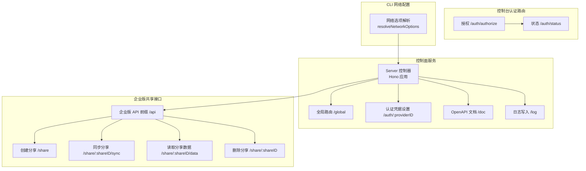
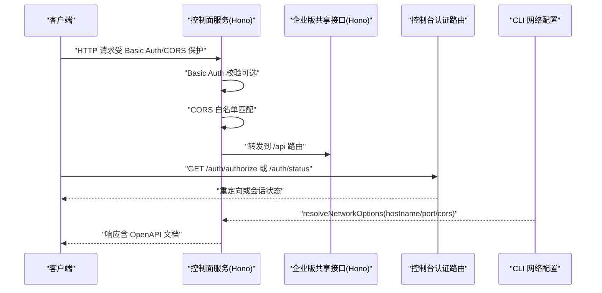
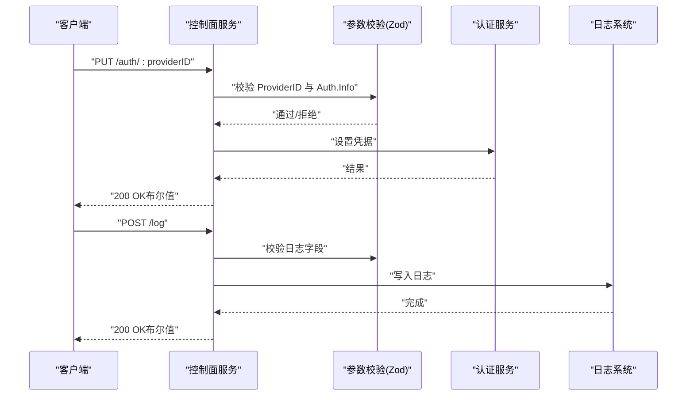
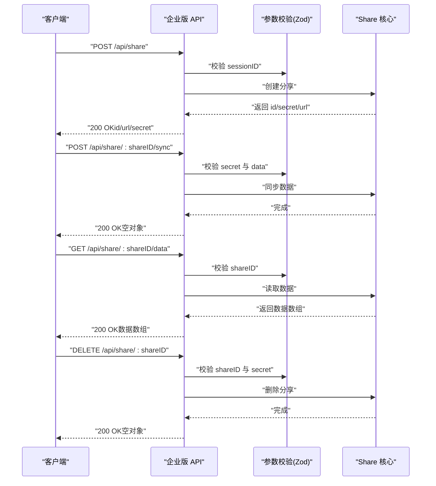
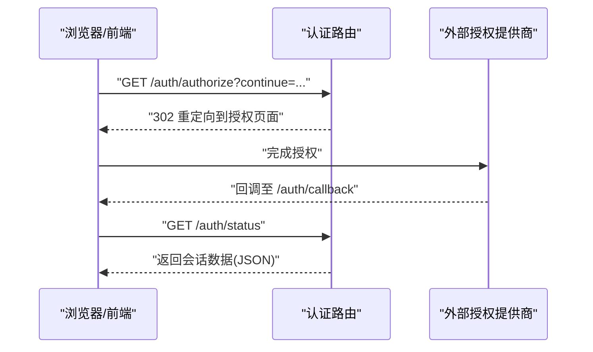
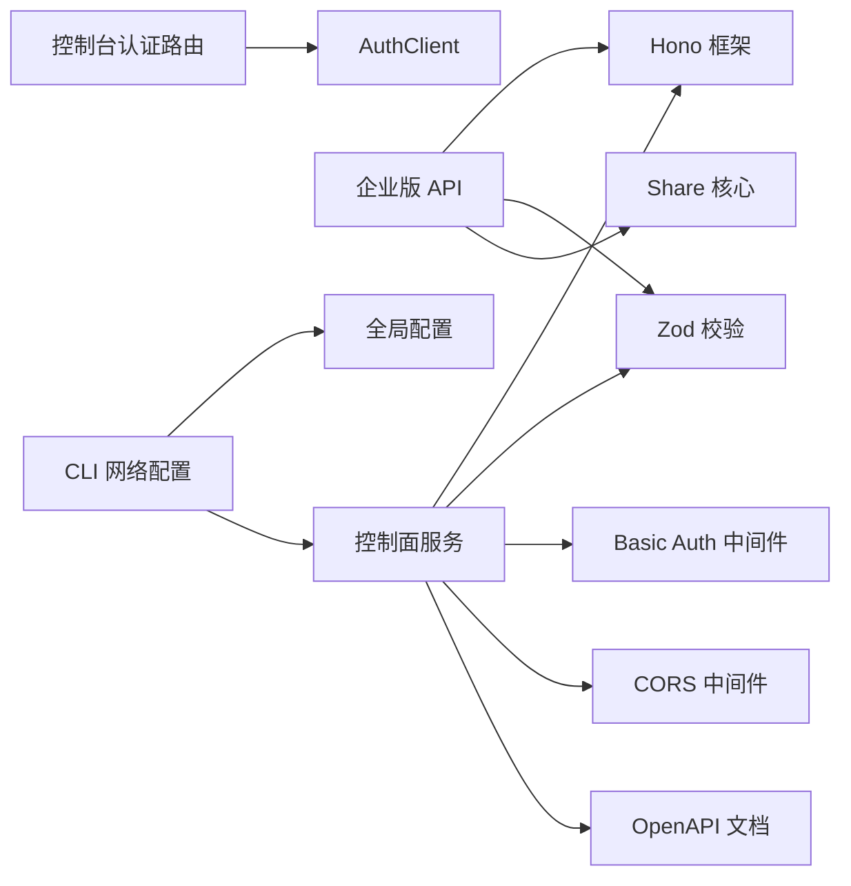
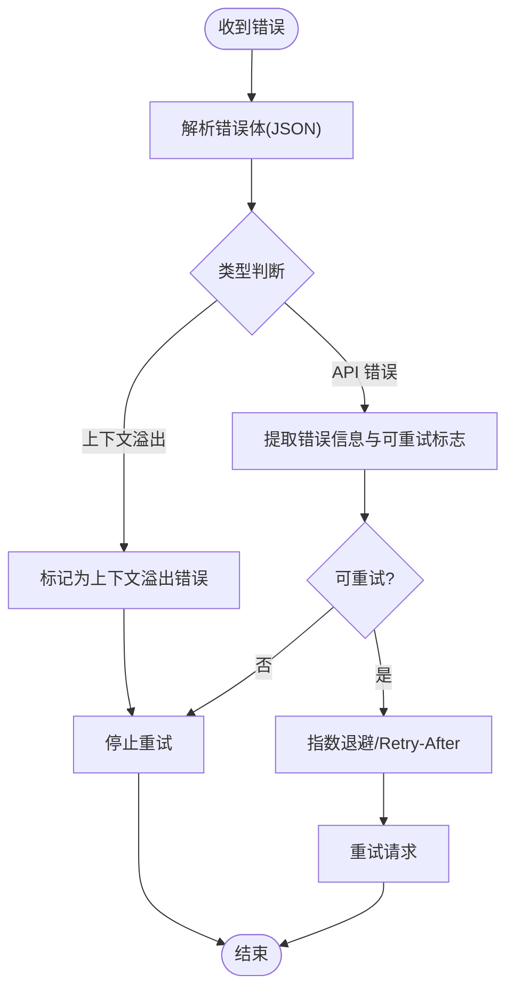

# Web API

<cite>
**本文引用的文件**
- [packages/opencode/src/server/server.ts](file://packages/opencode/src/server/server.ts)
- [packages/enterprise/src/routes/api/[...path].ts](file://packages/enterprise/src/routes/api/[...path].ts)
- [packages/console/app/src/routes/auth/status.ts](file://packages/console/app/src/routes/auth/status.ts)
- [packages/console/app/src/routes/auth/authorize.ts](file://packages/console/app/src/routes/auth/authorize.ts)
- [packages/opencode/src/cli/network.ts](file://packages/opencode/src/cli/network.ts)
- [packages/opencode/src/provider/error.ts](file://packages/opencode/src/provider/error.ts)
- [packages/opencode/src/session/retry.ts](file://packages/opencode/src/session/retry.ts)
- [packages/opencode/src/session/message-v2.ts](file://packages/opencode/src/session/message-v2.ts)
- [packages/sdk/openapi.json](file://packages/sdk/openapi.json)
</cite>

## 目录
1. [简介](#简介)
2. [项目结构](#项目结构)
3. [核心组件](#核心组件)
4. [架构总览](#架构总览)
5. [详细组件分析](#详细组件分析)
6. [依赖关系分析](#依赖关系分析)
7. [性能考量](#性能考量)
8. [故障排查指南](#故障排查指南)
9. [结论](#结论)
10. [附录](#附录)

## 简介
本文件为 OpenCode Web API 的技术文档，覆盖 REST API 接口规范与集成指南。内容包括：
- 所有 HTTP 端点（GET、POST、PUT、DELETE）的路径、请求头、请求体与响应格式
- 认证机制（Basic Auth、会话状态查询、授权重定向）
- 数据模型与 JSON Schema（请求参数校验与响应结构）
- 错误码与状态码说明
- 完整的 API 调用示例（多语言集成思路）
- CORS 配置与安全注意事项
- API 版本管理与向后兼容策略

## 项目结构
OpenCode 的 Web API 主要由以下模块构成：
- 控制面服务：基于 Hono 框架，提供全局路由、认证凭据设置/移除、日志写入、OpenAPI 文档导出等能力
- 企业版共享接口：提供分享创建、同步、读取与删除等端点
- 控制台前端认证路由：提供授权跳转与会话状态查询
- CLI 网络选项：支持监听地址、端口、mDNS 与 CORS 白名单配置
- 错误处理与重试：统一解析流式错误、上下文溢出识别与重试策略
- SDK OpenAPI 规范：提供接口契约与 JSON Schema 参考

图表来源
- [packages/opencode/src/server/server.ts:39-238](file://packages/opencode/src/server/server.ts#L39-L238)
- [packages/enterprise/src/routes/api/[...path].ts:11-139](file://packages/enterprise/src/routes/api/[...path].ts#L11-L139)
- [packages/console/app/src/routes/auth/authorize.ts:1-11](file://packages/console/app/src/routes/auth/authorize.ts#L1-L11)
- [packages/console/app/src/routes/auth/status.ts:1-8](file://packages/console/app/src/routes/auth/status.ts#L1-L8)
- [packages/opencode/src/cli/network.ts:39-60](file://packages/opencode/src/cli/network.ts#L39-L60)

章节来源
- [packages/opencode/src/server/server.ts:39-238](file://packages/opencode/src/server/server.ts#L39-L238)
- [packages/enterprise/src/routes/api/[...path].ts:11-139](file://packages/enterprise/src/routes/api/[...path].ts#L11-L139)
- [packages/console/app/src/routes/auth/authorize.ts:1-11](file://packages/console/app/src/routes/auth/authorize.ts#L1-L11)
- [packages/console/app/src/routes/auth/status.ts:1-8](file://packages/console/app/src/routes/auth/status.ts#L1-L8)
- [packages/opencode/src/cli/network.ts:39-60](file://packages/opencode/src/cli/network.ts#L39-L60)

## 核心组件
- 控制面服务（Hono 应用）
  - 提供 Basic Auth 中间件（可选），CORS 支持（白名单匹配），压缩中间件（按路径与方法跳过特定端点），OpenAPI 文档导出
  - 全局路由：认证凭据设置/移除、日志写入、OpenAPI 文档
- 企业版共享接口（Hono 应用）
  - 基础路径 /api，提供分享创建、同步、读取与删除
  - 使用 Hono OpenAPI 描述与 Zod 参数校验
- 控制台认证路由
  - 授权跳转与会话状态查询，便于前端集成 OAuth 流程
- CLI 网络配置
  - 解析监听主机、端口、mDNS 与 CORS 白名单，支持命令行与全局配置合并

章节来源
- [packages/opencode/src/server/server.ts:39-238](file://packages/opencode/src/server/server.ts#L39-L238)
- [packages/enterprise/src/routes/api/[...path].ts:11-139](file://packages/enterprise/src/routes/api/[...path].ts#L11-L139)
- [packages/console/app/src/routes/auth/authorize.ts:1-11](file://packages/console/app/src/routes/auth/authorize.ts#L1-L11)
- [packages/console/app/src/routes/auth/status.ts:1-8](file://packages/console/app/src/routes/auth/status.ts#L1-L8)
- [packages/opencode/src/cli/network.ts:39-60](file://packages/opencode/src/cli/network.ts#L39-L60)

## 架构总览
下图展示了控制面服务与企业版共享接口的交互关系，以及认证流程与 CLI 配置对服务的影响。

图表来源
- [packages/opencode/src/server/server.ts:39-95](file://packages/opencode/src/server/server.ts#L39-L95)
- [packages/enterprise/src/routes/api/[...path].ts:11-139](file://packages/enterprise/src/routes/api/[...path].ts#L11-L139)
- [packages/console/app/src/routes/auth/authorize.ts:1-11](file://packages/console/app/src/routes/auth/authorize.ts#L1-L11)
- [packages/console/app/src/routes/auth/status.ts:1-8](file://packages/console/app/src/routes/auth/status.ts#L1-L8)
- [packages/opencode/src/cli/network.ts:39-60](file://packages/opencode/src/cli/network.ts#L39-L60)

## 详细组件分析

### 控制面服务（全局路由）
- 认证凭据设置（PUT /auth/:providerID）
  - 请求头：Content-Type: application/json
  - 请求体：ProviderID（路径参数）、Auth.Info（JSON）
  - 响应：布尔值（成功/失败）
  - 校验：Zod 对 ProviderID 与 Auth.Info 进行类型校验
- 认证凭据移除（DELETE /auth/:providerID）
  - 请求头：无特殊要求
  - 请求体：无
  - 响应：布尔值
- 日志写入（POST /log）
  - 请求头：Content-Type: application/json
  - 请求体：service、level（枚举）、message、extra（可选）
  - 响应：布尔值
- OpenAPI 文档（GET /doc）
  - 响应：OpenAPI 3.1.1 文档对象
- 中间件
  - Basic Auth（可选，当配置了密码时生效）
  - CORS（白名单：本地回环、Tauri 本地协议、*.opencode.ai HTTPS、自定义域名）
  - 压缩（按路径与方法跳过特定端点）

图表来源
- [packages/opencode/src/server/server.ts:101-132](file://packages/opencode/src/server/server.ts#L101-L132)
- [packages/opencode/src/server/server.ts:185-236](file://packages/opencode/src/server/server.ts#L185-L236)

章节来源
- [packages/opencode/src/server/server.ts:39-238](file://packages/opencode/src/server/server.ts#L39-L238)

### 企业版共享接口（/api 前缀）
- 创建分享（POST /api/share）
  - 请求头：Content-Type: application/json
  - 请求体：sessionID（字符串）
  - 响应：id、url、secret（字符串）
  - 校验：Zod 对 sessionID 进行校验
- 同步分享（POST /api/share/:shareID/sync）
  - 请求头：Content-Type: application/json
  - 请求体：secret（字符串）、data（数组，元素为 Share.Data）
  - 响应：空对象
  - 校验：Zod 对参数与数据结构进行校验
- 读取分享数据（GET /api/share/:shareID/data）
  - 请求头：无特殊要求
  - 请求体：无
  - 响应：Share.Data 数组
  - 校验：Zod 对 shareID 进行校验；设置缓存头
- 删除分享（DELETE /api/share/:shareID）
  - 请求头：Content-Type: application/json
  - 请求体：secret（字符串）
  - 响应：空对象
  - 校验：Zod 对参数与 secret 进行校验

图表来源
- [packages/enterprise/src/routes/api/[...path].ts:27-139](file://packages/enterprise/src/routes/api/[...path].ts#L27-L139)

章节来源
- [packages/enterprise/src/routes/api/[...path].ts:11-139](file://packages/enterprise/src/routes/api/[...path].ts#L11-L139)

### 控制台认证路由
- 授权（GET /auth/authorize）
  - 查询参数：continue（可选）
  - 响应：302 重定向至授权 URL
- 会话状态（GET /auth/status）
  - 响应：当前会话数据（JSON）

图表来源
- [packages/console/app/src/routes/auth/authorize.ts:1-11](file://packages/console/app/src/routes/auth/authorize.ts#L1-L11)
- [packages/console/app/src/routes/auth/status.ts:1-8](file://packages/console/app/src/routes/auth/status.ts#L1-L8)

章节来源
- [packages/console/app/src/routes/auth/authorize.ts:1-11](file://packages/console/app/src/routes/auth/authorize.ts#L1-L11)
- [packages/console/app/src/routes/auth/status.ts:1-8](file://packages/console/app/src/routes/auth/status.ts#L1-L8)

### CLI 网络配置
- 选项
  - --port、--hostname、--mdns、--mdns-domain、--cors（可多次传入）
- 行为
  - 合并全局配置与命令行参数，计算最终 hostname、port、cors 白名单
  - 当启用 mDNS 且 hostname 非回环时发布服务

章节来源
- [packages/opencode/src/cli/network.ts:39-60](file://packages/opencode/src/cli/network.ts#L39-L60)

## 依赖关系分析
- 控制面服务依赖
  - Hono（路由、中间件、OpenAPI）
  - Zod（参数校验）
  - 基本认证与 CORS 中间件
  - 自定义错误处理器与日志系统
- 企业版接口依赖
  - Hono OpenAPI 描述与 Zod 校验
  - Share 核心模块（创建、同步、读取、删除）
- 认证路由依赖
  - 控制台上下文中的 AuthClient
- CLI 依赖
  - yargs（参数解析）
  - 全局配置（Config）

图表来源
- [packages/opencode/src/server/server.ts:1-20](file://packages/opencode/src/server/server.ts#L1-L20)
- [packages/enterprise/src/routes/api/[...path].ts:1-L8](file://packages/enterprise/src/routes/api/[...path].ts#L1-L8)
- [packages/console/app/src/routes/auth/authorize.ts:1-3](file://packages/console/app/src/routes/auth/authorize.ts#L1-L3)
- [packages/opencode/src/cli/network.ts:1-10](file://packages/opencode/src/cli/network.ts#L1-L10)

章节来源
- [packages/opencode/src/server/server.ts:1-20](file://packages/opencode/src/server/server.ts#L1-L20)
- [packages/enterprise/src/routes/api/[...path].ts:1-L8](file://packages/enterprise/src/routes/api/[...path].ts#L1-L8)
- [packages/console/app/src/routes/auth/authorize.ts:1-3](file://packages/console/app/src/routes/auth/authorize.ts#L1-L3)
- [packages/opencode/src/cli/network.ts:1-10](file://packages/opencode/src/cli/network.ts#L1-L10)

## 性能考量
- 压缩策略
  - 默认启用 gzip/deflate 压缩，但对特定端点（如事件推送、消息流）与方法（POST 到消息/异步提示）跳过压缩以减少 CPU 开销
- 压缩跳过规则
  - 路径匹配：/event、/global/event、/global/sync-event
  - 方法+路径正则：POST 到 /session/[^/]+/(message|prompt_async)
- 建议
  - 大体积响应优先考虑分页或流式输出
  - 对频繁调用的端点使用缓存头（如读取分享数据已设置缓存头）

章节来源
- [packages/opencode/src/server/server.ts:29-35](file://packages/opencode/src/server/server.ts#L29-L35)
- [packages/enterprise/src/routes/api/[...path].ts:108-L113](file://packages/enterprise/src/routes/api/[...path].ts#L108-L113)

## 故障排查指南
- 错误解析与分类
  - 统一解析流式错误，识别“上下文溢出”与“API 错误”
  - 对于 HTML 类错误响应（网关/代理），提供更友好的提示
- 重试策略
  - 基于 Retry-After 头或 HTTP 日期解析退避延迟
  - 指数退避上限控制，避免无限重试
  - 上下文溢出错误不建议重试
- 常见问题定位
  - 401/403：检查鉴权令牌是否缺失或过期，确认代理/网关未拦截
  - 429：遵循 Retry-After 或等待后重试
  - 上下文溢出：缩短输入或拆分请求

图表来源
- [packages/opencode/src/provider/error.ts:61-124](file://packages/opencode/src/provider/error.ts#L61-L124)
- [packages/opencode/src/session/retry.ts:30-66](file://packages/opencode/src/session/retry.ts#L30-L66)
- [packages/opencode/src/session/message-v2.ts:963-988](file://packages/opencode/src/session/message-v2.ts#L963-L988)

章节来源
- [packages/opencode/src/provider/error.ts:61-124](file://packages/opencode/src/provider/error.ts#L61-L124)
- [packages/opencode/src/session/retry.ts:30-66](file://packages/opencode/src/session/retry.ts#L30-L66)
- [packages/opencode/src/session/message-v2.ts:963-988](file://packages/opencode/src/session/message-v2.ts#L963-L988)

## 结论
本文档提供了 OpenCode Web API 的完整接口规范与集成指南，涵盖控制面服务、企业版共享接口、认证路由与 CLI 配置，并结合错误处理与性能优化建议，帮助开发者在多语言环境中高效集成。

## 附录

### 接口清单与规范

- 控制面服务（基础路径：/）
  - PUT /auth/:providerID
    - 请求头：Content-Type: application/json
    - 请求体：ProviderID（路径参数）、Auth.Info（JSON）
    - 响应：布尔值
    - 校验：Zod
  - DELETE /auth/:providerID
    - 请求头：无
    - 请求体：无
    - 响应：布尔值
  - POST /log
    - 请求头：Content-Type: application/json
    - 请求体：service、level（枚举）、message、extra（可选）
    - 响应：布尔值
  - GET /doc
    - 响应：OpenAPI 3.1.1 文档对象

- 企业版共享接口（基础路径：/api）
  - POST /share
    - 请求头：Content-Type: application/json
    - 请求体：sessionID（字符串）
    - 响应：id、url、secret（字符串）
  - POST /share/:shareID/sync
    - 请求头：Content-Type: application/json
    - 请求体：secret（字符串）、data（数组，元素为 Share.Data）
    - 响应：空对象
  - GET /share/:shareID/data
    - 请求头：无
    - 请求体：无
    - 响应：Share.Data 数组
  - DELETE /share/:shareID
    - 请求头：Content-Type: application/json
    - 请求体：secret（字符串）
    - 响应：空对象

- 控制台认证路由
  - GET /auth/authorize
    - 查询参数：continue（可选）
    - 响应：302 重定向
  - GET /auth/status
    - 响应：会话数据（JSON）

章节来源
- [packages/opencode/src/server/server.ts:101-132](file://packages/opencode/src/server/server.ts#L101-L132)
- [packages/opencode/src/server/server.ts:185-236](file://packages/opencode/src/server/server.ts#L185-L236)
- [packages/enterprise/src/routes/api/[...path].ts:27-139](file://packages/enterprise/src/routes/api/[...path].ts#L27-L139)
- [packages/console/app/src/routes/auth/authorize.ts:1-11](file://packages/console/app/src/routes/auth/authorize.ts#L1-L11)
- [packages/console/app/src/routes/auth/status.ts:1-8](file://packages/console/app/src/routes/auth/status.ts#L1-L8)

### 认证机制
- Basic Auth（可选）
  - 当配置了服务器密码时生效，默认用户名为固定值
- 会话管理
  - 控制台认证路由提供授权与状态查询，便于前端实现 OAuth 流程
- 权限控制
  - 仅在启用密码时强制 Basic Auth；CORS 白名单限制跨域来源

章节来源
- [packages/opencode/src/server/server.ts:43-51](file://packages/opencode/src/server/server.ts#L43-L51)
- [packages/console/app/src/routes/auth/authorize.ts:1-11](file://packages/console/app/src/routes/auth/authorize.ts#L1-L11)
- [packages/console/app/src/routes/auth/status.ts:1-8](file://packages/console/app/src/routes/auth/status.ts#L1-L8)

### 数据模型与 JSON Schema
- 控制面服务
  - Auth.Info：用于设置认证凭据的 JSON 结构（具体字段由 Zod 定义）
  - 日志请求体：service、level、message、extra（可选）
- 企业版共享接口
  - Share：包含 id、url、secret 等字段
  - Share.Data：数组元素的数据结构（具体字段由 Zod 定义）
- SDK OpenAPI
  - 提供接口契约与 JSON Schema 参考，可用于生成客户端 SDK

章节来源
- [packages/opencode/src/server/server.ts:119-125](file://packages/opencode/src/server/server.ts#L119-L125)
- [packages/enterprise/src/routes/api/[...path].ts:37-L44](file://packages/enterprise/src/routes/api/[...path].ts#L37-L44)
- [packages/enterprise/src/routes/api/[...path].ts:81-L88](file://packages/enterprise/src/routes/api/[...path].ts#L81-L88)
- [packages/enterprise/src/routes/api/[...path].ts:102-L102](file://packages/enterprise/src/routes/api/[...path].ts#L102-L102)
- [packages/sdk/openapi.json:204-253](file://packages/sdk/openapi.json#L204-L253)

### 错误码与状态码说明
- 通用错误
  - 400：请求参数无效（由 Zod 校验失败触发）
  - 401：未授权（鉴权失败或令牌缺失/过期）
  - 403：禁止访问（被网关/代理拦截或权限不足）
  - 429：请求过于频繁（遵循 Retry-After）
  - 5xx：服务器内部错误
- 特定错误类型
  - 上下文溢出：请求体过大或上下文超限，不建议重试
  - API 错误：来自上游提供方的错误，可能可重试

章节来源
- [packages/opencode/src/server/server.ts:107-117](file://packages/opencode/src/server/server.ts#L107-L117)
- [packages/opencode/src/server/server.ts:139-149](file://packages/opencode/src/server/server.ts#L139-L149)
- [packages/opencode/src/provider/error.ts:61-88](file://packages/opencode/src/provider/error.ts#L61-L88)
- [packages/opencode/src/session/retry.ts:51-66](file://packages/opencode/src/session/retry.ts#L51-L66)

### CORS 配置与安全
- CORS 白名单
  - 本地回环：http://localhost:port、http://127.0.0.1:port
  - Tauri 本地协议：tauri://localhost、http://tauri.localhost、https://tauri.localhost
  - *.opencode.ai（HTTPS）
  - 自定义域名（通过 CLI --cors 或全局配置）
- 安全建议
  - 生产环境务必启用 Basic Auth 并限制 CORS 白名单
  - 使用 HTTPS 与最小权限原则
  - 对敏感端点增加速率限制与审计日志

章节来源
- [packages/opencode/src/server/server.ts:69-95](file://packages/opencode/src/server/server.ts#L69-L95)
- [packages/opencode/src/cli/network.ts:25-30](file://packages/opencode/src/cli/network.ts#L25-L30)

### API 版本管理与兼容性
- OpenAPI 版本
  - 控制面服务文档版本：1.0.0
  - 企业版 API 文档版本：1.0.0
- 兼容性建议
  - 保持路径稳定，新增端点采用新路径或子资源
  - 字段扩展使用可选属性，避免破坏现有客户端
  - 通过文档与变更日志同步版本信息

章节来源
- [packages/opencode/src/server/server.ts:244-262](file://packages/opencode/src/server/server.ts#L244-L262)
- [packages/enterprise/src/routes/api/[...path].ts:15-L26](file://packages/enterprise/src/routes/api/[...path].ts#L15-L26)

### 多语言集成示例（思路）
- Python
  - 使用 requests 发送 HTTP 请求，设置 Content-Type: application/json
  - 对于 Basic Auth，使用 HTTPBasicAuth 或在 headers 中添加 Authorization
- JavaScript/Node.js
  - 使用 fetch 或 axios，注意处理 CORS 与错误响应
  - 对于 /api/share/:shareID/data，利用缓存头提升性能
- Go
  - 使用 net/http 发送请求，使用 encoding/json 编解码
  - 对 429 场景实现指数退避重试
- Java
  - 使用 HttpClient 或 OkHttp，设置正确的请求头与超时
  - 对于企业版接口，先 POST /api/share 获取 id/secret，再调用其他端点

[本节为通用集成指导，不直接分析具体源码文件]