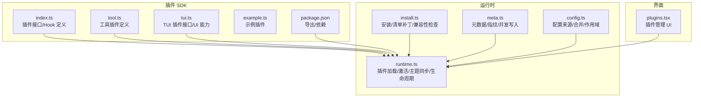
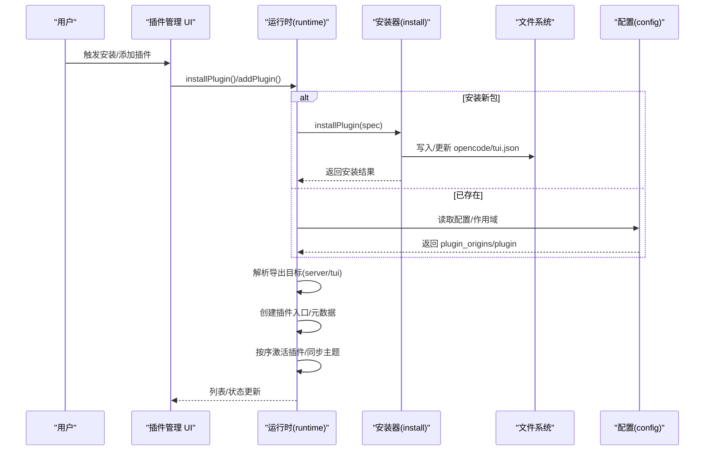
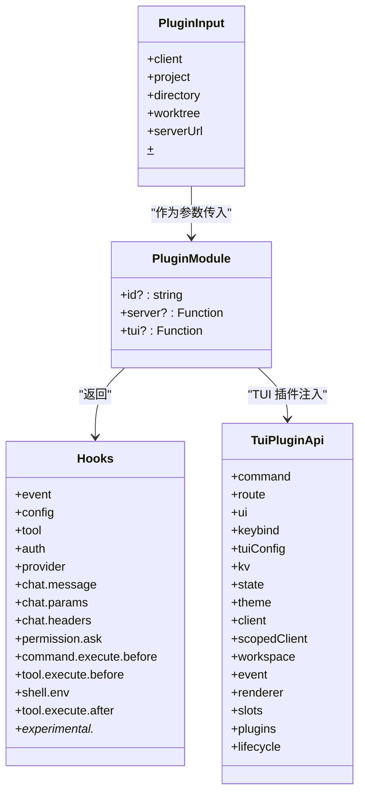
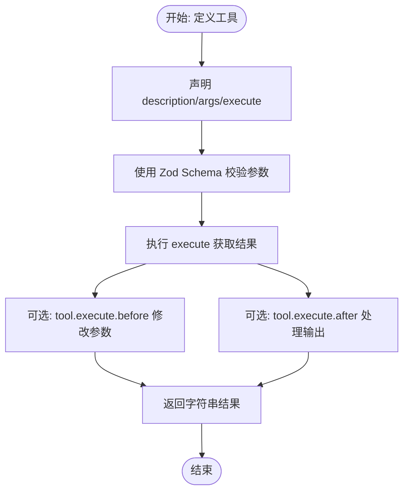
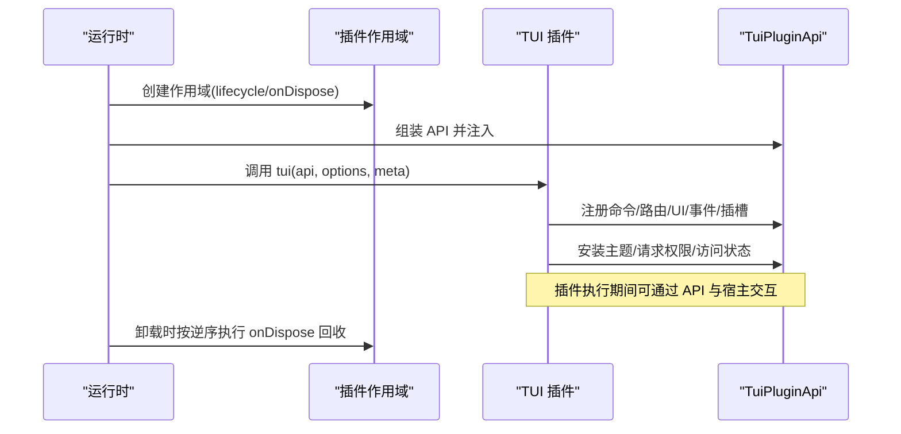
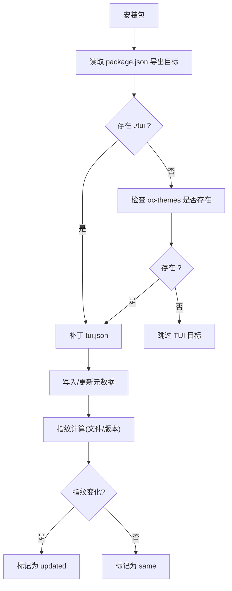
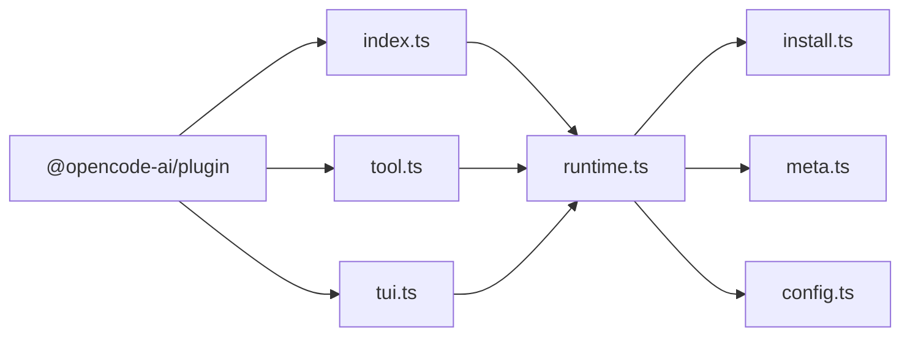

# 插件接口

<cite>
**本文引用的文件**
- [packages/plugin/src/index.ts](file://packages/plugin/src/index.ts)
- [packages/plugin/src/tool.ts](file://packages/plugin/src/tool.ts)
- [packages/plugin/src/tui.ts](file://packages/plugin/src/tui.ts)
- [packages/plugin/src/example.ts](file://packages/plugin/src/example.ts)
- [packages/plugin/package.json](file://packages/plugin/package.json)
- [packages/opencode/src/cli/cmd/tui/plugin/runtime.ts](file://packages/opencode/src/cli/cmd/tui/plugin/runtime.ts)
- [packages/opencode/src/plugin/install.ts](file://packages/opencode/src/plugin/install.ts)
- [packages/opencode/src/plugin/meta.ts](file://packages/opencode/src/plugin/meta.ts)
- [packages/opencode/src/config/config.ts](file://packages/opencode/src/config/config.ts)
- [packages/opencode/src/cli/cmd/tui/feature-plugins/system/plugins.tsx](file://packages/opencode/src/cli/cmd/tui/feature-plugins/system/plugins.tsx)
- [packages/opencode/test/plugin/meta.test.ts](file://packages/opencode/test/plugin/meta.test.ts)
- [.opencode/opencode.jsonc](file://.opencode/opencode.jsonc)
</cite>

## 目录
1. [简介](#简介)
2. [项目结构](#项目结构)
3. [核心组件](#核心组件)
4. [架构总览](#架构总览)
5. [详细组件分析](#详细组件分析)
6. [依赖关系分析](#依赖关系分析)
7. [性能考量](#性能考量)
8. [故障排查指南](#故障排查指南)
9. [结论](#结论)
10. [附录](#附录)

## 简介
本文件系统化梳理插件开发 API，覆盖插件系统的架构与扩展机制，明确插件接口规范（生命周期、注册机制、依赖管理）、工具插件开发流程（接口定义、参数传递、结果处理）、代理插件（TUI 插件）实现方法（接口、权限控制、状态管理）、插件配置与元数据规范（清单、版本管理、兼容性检查），并提供可操作的开发示例、安全与沙箱建议、测试与调试指南，帮助开发者快速上手并正确实现扩展功能。

## 项目结构
围绕插件能力的关键目录与文件：
- 插件 SDK 定义：packages/plugin
  - 核心接口与钩子：index.ts
  - 工具插件定义：tool.ts
  - TUI 插件接口与 UI 能力：tui.ts
  - 示例插件：example.ts
  - 包导出与依赖：package.json
- 运行时与加载器：packages/opencode/src/cli/cmd/tui/plugin/runtime.ts
- 插件安装与配置补丁：packages/opencode/src/plugin/install.ts
- 元数据与指纹：packages/opencode/src/plugin/meta.ts
- 配置来源与合并：packages/opencode/src/config/config.ts
- 插件管理 UI：packages/opencode/src/cli/cmd/tui/feature-plugins/system/plugins.tsx
- 测试用例：packages/opencode/test/plugin/meta.test.ts
- 默认配置示例：.opencode/opencode.jsonc

图表来源
- [packages/plugin/src/index.ts:1-277](file://packages/plugin/src/index.ts#L1-L277)
- [packages/plugin/src/tool.ts:1-39](file://packages/plugin/src/tool.ts#L1-L39)
- [packages/plugin/src/tui.ts:1-509](file://packages/plugin/src/tui.ts#L1-L509)
- [packages/opencode/src/cli/cmd/tui/plugin/runtime.ts:1-1034](file://packages/opencode/src/cli/cmd/tui/plugin/runtime.ts#L1-L1034)
- [packages/opencode/src/plugin/install.ts:1-440](file://packages/opencode/src/plugin/install.ts#L1-L440)
- [packages/opencode/src/plugin/meta.ts:1-189](file://packages/opencode/src/plugin/meta.ts#L1-L189)
- [packages/opencode/src/config/config.ts:1259-1285](file://packages/opencode/src/config/config.ts#L1259-L1285)
- [packages/opencode/src/cli/cmd/tui/feature-plugins/system/plugins.tsx:80-172](file://packages/opencode/src/cli/cmd/tui/feature-plugins/system/plugins.tsx#L80-L172)

章节来源
- [packages/plugin/src/index.ts:1-277](file://packages/plugin/src/index.ts#L1-L277)
- [packages/plugin/src/tool.ts:1-39](file://packages/plugin/src/tool.ts#L1-L39)
- [packages/plugin/src/tui.ts:1-509](file://packages/plugin/src/tui.ts#L1-L509)
- [packages/plugin/src/example.ts:1-19](file://packages/plugin/src/example.ts#L1-L19)
- [packages/plugin/package.json:1-44](file://packages/plugin/package.json#L1-L44)

## 核心组件
- 插件接口与 Hook
  - 插件函数签名：接收输入上下文与可选选项，返回一组 Hook
  - 支持事件、配置、工具、认证、模型提供者、聊天钩子、命令执行、Shell 环境、工具执行前后等钩子
- 工具插件
  - 使用工具定义器声明描述、参数 Schema 与执行函数；通过 Zod Schema 进行参数校验
- TUI 插件
  - 提供命令、路由、UI 对话框、主题安装、事件总线、插槽注册、工作区、键位绑定、状态访问、客户端访问等能力
  - 生命周期与资源回收：AbortController + onDispose 回收队列，带超时保护
- 插件运行时
  - 解析外部插件、安装缺失包、读取清单、补丁配置、初始化主题、按序激活、状态持久化、卸载清理
- 插件安装与清单
  - 从 package.json 读取导出目标（server/tui），生成清单条目，写入 opencode/tui.json
- 元数据与指纹
  - 记录首次/最近加载时间、加载次数、指纹（文件变更或 NPM 版本变化触发更新）
- 配置来源与作用域
  - 合并多级配置，自动推断本地/全局作用域，支持去重与顺序确定性

章节来源
- [packages/plugin/src/index.ts:42-277](file://packages/plugin/src/index.ts#L42-L277)
- [packages/plugin/src/tool.ts:29-39](file://packages/plugin/src/tool.ts#L29-L39)
- [packages/plugin/src/tui.ts:454-509](file://packages/plugin/src/tui.ts#L454-L509)
- [packages/opencode/src/cli/cmd/tui/plugin/runtime.ts:434-482](file://packages/opencode/src/cli/cmd/tui/plugin/runtime.ts#L434-L482)
- [packages/opencode/src/plugin/install.ts:128-166](file://packages/opencode/src/plugin/install.ts#L128-L166)
- [packages/opencode/src/plugin/meta.ts:109-141](file://packages/opencode/src/plugin/meta.ts#L109-L141)
- [packages/opencode/src/config/config.ts:1259-1285](file://packages/opencode/src/config/config.ts#L1259-L1285)

## 架构总览
下图展示插件系统从“配置解析”到“插件加载与激活”的端到端流程。

图表来源
- [packages/opencode/src/cli/cmd/tui/plugin/runtime.ts:832-923](file://packages/opencode/src/cli/cmd/tui/plugin/runtime.ts#L832-L923)
- [packages/opencode/src/plugin/install.ts:259-439](file://packages/opencode/src/plugin/install.ts#L259-L439)
- [packages/opencode/src/config/config.ts:1259-1285](file://packages/opencode/src/config/config.ts#L1259-L1285)

## 详细组件分析

### 插件接口规范与生命周期
- 接口类型
  - 插件模块：包含 id 与 server 或 tui 函数
  - 插件输入：包含客户端、项目、目录、工作树、服务端 URL、Bun Shell 等
  - 插件选项：任意键值对
- 生命周期
  - 运行时为每个插件创建独立作用域（含 AbortSignal），在激活时注入 API，并在卸载时按逆序回收
  - 提供 onDispose 注册回调，统一由运行时在超时前完成清理
- 注册机制
  - 命令注册、路由注册、事件监听、插槽注册均通过作用域跟踪，避免泄漏
- 依赖管理
  - 通过配置来源与作用域推断决定本地/全局加载
  - 安装阶段读取清单导出目标，自动补丁配置文件

图表来源
- [packages/plugin/src/index.ts:42-277](file://packages/plugin/src/index.ts#L42-L277)
- [packages/plugin/src/tui.ts:454-509](file://packages/plugin/src/tui.ts#L454-L509)

章节来源
- [packages/plugin/src/index.ts:42-277](file://packages/plugin/src/index.ts#L42-L277)
- [packages/opencode/src/cli/cmd/tui/plugin/runtime.ts:312-390](file://packages/opencode/src/cli/cmd/tui/plugin/runtime.ts#L312-L390)

### 工具插件开发流程
- 接口定义
  - 使用工具定义器声明 description、args（Zod Schema）、execute(args, context)
  - 上下文包含会话、消息、工作区、中止信号、metadata、ask 等
- 参数传递与校验
  - 通过 Zod Schema 自动校验参数类型与约束
- 结果处理
  - execute 返回字符串结果；可在执行前后使用 Hook 处理参数与输出
- 开发示例
  - 参考示例插件，定义一个自定义工具并挂载到插件的 tool 字典

图表来源
- [packages/plugin/src/tool.ts:29-39](file://packages/plugin/src/tool.ts#L29-L39)
- [packages/plugin/src/index.ts:226-241](file://packages/plugin/src/index.ts#L226-L241)
- [packages/plugin/src/example.ts:4-18](file://packages/plugin/src/example.ts#L4-L18)

章节来源
- [packages/plugin/src/tool.ts:1-39](file://packages/plugin/src/tool.ts#L1-L39)
- [packages/plugin/src/example.ts:1-19](file://packages/plugin/src/example.ts#L1-L19)

### 代理插件（TUI 插件）实现方法
- 插件接口
  - 导出 tui 函数，接收 api、options、meta 三参
  - 通过 api 注册命令、路由、对话框、主题安装、事件监听、插槽、工作区切换等
- 权限控制
  - 通过 ask(context.metadata) 请求权限，结合权限提示与模式匹配
- 状态管理
  - 通过 api.kv 持久化启用状态，通过 api.state 访问会话、文件、LSP、MCP 等状态
  - 通过 api.plugins.list/activate/deactivate/add/install 管理插件生命周期
- 主题与 UI
  - 通过 api.theme.install 安装主题；通过 api.ui.Dialog/Prompt/Slot 等构建 UI
- 生命周期
  - 运行时创建作用域，注入 API，调用插件初始化；卸载时统一回收

图表来源
- [packages/plugin/src/tui.ts:454-509](file://packages/plugin/src/tui.ts#L454-L509)
- [packages/opencode/src/cli/cmd/tui/plugin/runtime.ts:484-570](file://packages/opencode/src/cli/cmd/tui/plugin/runtime.ts#L484-L570)
- [packages/opencode/src/cli/cmd/tui/plugin/runtime.ts:312-390](file://packages/opencode/src/cli/cmd/tui/plugin/runtime.ts#L312-L390)

章节来源
- [packages/plugin/src/tui.ts:1-509](file://packages/plugin/src/tui.ts#L1-L509)
- [packages/opencode/src/cli/cmd/tui/plugin/runtime.ts:434-482](file://packages/opencode/src/cli/cmd/tui/plugin/runtime.ts#L434-L482)

### 插件配置与元数据规范
- 清单与导出
  - 通过 package.json 的 exports 字段暴露 ./server 与 ./tui 目标；若存在 oc-themes，则自动视为 TUI 目标
- 安装与补丁
  - 安装后读取清单，自动补丁 opencode/tui.json（本地/全局），支持强制替换与去重
- 版本管理与兼容性
  - 文件型插件以文件修改时间作为指纹；NPM 包以 requested/version 作为指纹；指纹变化触发“已更新”
- 元数据存储
  - 使用锁文件并发写入，记录首次/最近加载时间、加载次数、指纹、主题映射等

图表来源
- [packages/opencode/src/plugin/install.ts:128-166](file://packages/opencode/src/plugin/install.ts#L128-L166)
- [packages/opencode/src/plugin/install.ts:421-439](file://packages/opencode/src/plugin/install.ts#L421-L439)
- [packages/opencode/src/plugin/meta.ts:109-141](file://packages/opencode/src/plugin/meta.ts#L109-L141)

章节来源
- [packages/opencode/src/plugin/install.ts:1-440](file://packages/opencode/src/plugin/install.ts#L1-L440)
- [packages/opencode/src/plugin/meta.ts:1-189](file://packages/opencode/src/plugin/meta.ts#L1-189)

### 插件开发示例
- 工具插件示例
  - 在插件的 tool 字典中注册自定义工具，使用 Zod Schema 定义参数，返回字符串结果
- TUI 插件示例
  - 在插件中注册命令、路由、对话框、插槽，访问主题与状态，安装主题，请求权限

章节来源
- [packages/plugin/src/example.ts:4-18](file://packages/plugin/src/example.ts#L4-L18)

### 安全考虑与沙箱机制
- 运行时沙箱
  - 每个插件在独立作用域内运行，使用 AbortController 控制中断，onDispose 统一回收
  - 主题安装通过锁文件与原子写入，避免并发冲突
- 权限与提示
  - 工具执行前可通过 ask 请求权限，结合 patterns/always 控制访问范围
- 配置来源与作用域
  - 自动区分本地/全局作用域，减少误用风险

章节来源
- [packages/opencode/src/cli/cmd/tui/plugin/runtime.ts:312-390](file://packages/opencode/src/cli/cmd/tui/plugin/runtime.ts#L312-L390)
- [packages/opencode/src/plugin/meta.ts:143-160](file://packages/opencode/src/plugin/meta.ts#L143-L160)
- [packages/opencode/src/config/config.ts:1259-1285](file://packages/opencode/src/config/config.ts#L1259-L1285)

### 插件测试与调试指南
- 元数据并发测试
  - 多进程并发 touch 元数据，验证锁与序列化一致性
- 插件加载测试
  - 通过临时文件与标记文件验证插件是否被正确加载与执行
- 调试建议
  - 使用运行时日志与错误上报定位加载失败、兼容性问题与主题安装异常
  - 通过 UI 插件管理面板查看状态、启用/禁用与重新加载

章节来源
- [packages/opencode/test/plugin/meta.test.ts:1-137](file://packages/opencode/test/plugin/meta.test.ts#L1-L137)
- [packages/opencode/src/cli/cmd/tui/feature-plugins/system/plugins.tsx:80-172](file://packages/opencode/src/cli/cmd/tui/feature-plugins/system/plugins.tsx#L80-L172)

## 依赖关系分析
- 插件 SDK 依赖
  - 依赖 @opencode-ai/sdk 与 zod；对 @opentui/core/@opentui/solid 为 peer 且可选
- 运行时依赖
  - 通过 PluginLoader、PluginMeta、TuiConfig、ConfigPaths 等模块协作
- 配置来源
  - 多源配置合并，自动推断作用域（本地/全局），支持去重与顺序稳定

图表来源
- [packages/plugin/package.json:19-42](file://packages/plugin/package.json#L19-L42)
- [packages/opencode/src/cli/cmd/tui/plugin/runtime.ts:1-42](file://packages/opencode/src/cli/cmd/tui/plugin/runtime.ts#L1-L42)

章节来源
- [packages/plugin/package.json:1-44](file://packages/plugin/package.json#L1-L44)
- [packages/opencode/src/config/config.ts:1259-1285](file://packages/opencode/src/config/config.ts#L1259-L1285)

## 性能考量
- 加载顺序与确定性
  - 插件激活按序进行，保证命令注册顺序、路由覆盖与 Hook 链的稳定性
- 资源回收
  - 统一超时回收，避免长时间阻塞卸载
- 并发与锁
  - 元数据与主题安装采用文件锁，避免竞态与重复写入
- 配置补丁
  - 使用 JSONC 原子编辑，减少磁盘争用

章节来源
- [packages/opencode/src/cli/cmd/tui/plugin/runtime.ts:1020-1027](file://packages/opencode/src/cli/cmd/tui/plugin/runtime.ts#L1020-L1027)
- [packages/opencode/src/plugin/meta.ts:143-160](file://packages/opencode/src/plugin/meta.ts#L143-L160)
- [packages/opencode/src/plugin/install.ts:168-179](file://packages/opencode/src/plugin/install.ts#L168-L179)

## 故障排查指南
- 安装失败
  - 检查网络/鉴权与 NPM 仓库；根据返回信息判断缺失依赖或解析失败
- 兼容性问题
  - 查看运行时报告的兼容性阶段错误；确认导出目标与清单
- 主题安装失败
  - 检查主题 JSON 格式与目标路径；确认锁文件与并发写入
- 插件未生效
  - 确认插件 ID 唯一、启用状态、作用域（本地/全局）与配置补丁是否成功
- 日志与诊断
  - 关注运行时日志与错误对象中的堆栈与原因字段

章节来源
- [packages/opencode/src/cli/cmd/tui/plugin/runtime.ts:672-696](file://packages/opencode/src/cli/cmd/tui/plugin/runtime.ts#L672-L696)
- [packages/opencode/src/plugin/install.ts:832-923](file://packages/opencode/src/plugin/install.ts#L832-L923)

## 结论
该插件系统通过清晰的接口分层（Server/TUI）、完善的生命周期管理（作用域/回收/状态持久化）、严谨的安装与清单补丁流程以及元数据指纹机制，为开发者提供了可扩展、可维护、可诊断的插件生态。配合 UI 管理与权限控制，既能满足工具扩展需求，也能支撑丰富的 TUI 交互场景。

## 附录
- 默认配置示例
  - .opencode/opencode.jsonc 展示了 provider、permission、tools 等默认项，可作为插件行为参考

章节来源
- [.opencode/opencode.jsonc:1-19](file://.opencode/opencode.jsonc#L1-L19)