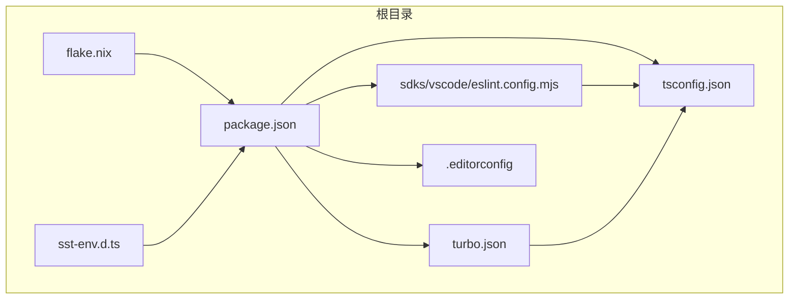
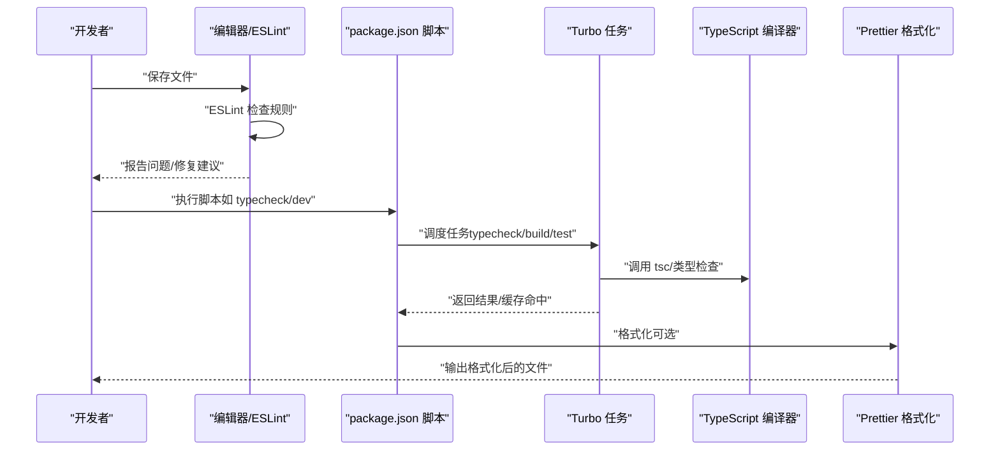
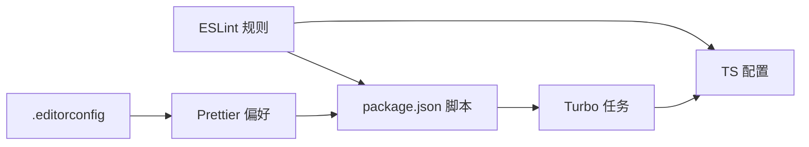

# 代码规范与风格

<cite>
**本文引用的文件**
- [tsconfig.json](file://tsconfig.json)
- [.editorconfig](file://.editorconfig)
- [package.json](file://package.json)
- [turbo.json](file://turbo.json)
- [sdks/vscode/eslint.config.mjs](file://sdks/vscode/eslint.config.mjs)
- [sst-env.d.ts](file://sst-env.d.ts)
- [flake.nix](file://flake.nix)
</cite>

## 目录
1. [简介](#简介)
2. [项目结构](#项目结构)
3. [核心组件](#核心组件)
4. [架构总览](#架构总览)
5. [详细组件分析](#详细组件分析)
6. [依赖分析](#依赖分析)
7. [性能考虑](#性能考虑)
8. [故障排查指南](#故障排查指南)
9. [结论](#结论)
10. [附录](#附录)

## 简介
本指南面向 OpenCode 项目全体开发者，旨在统一 TypeScript 编码风格与最佳实践，明确类型系统使用、错误处理模式、变量命名与声明、代码组织原则、格式化与编辑器配置，并通过“示例路径”帮助快速定位实现位置，便于团队协作与长期维护。

## 项目结构
OpenCode 采用多包工作区（monorepo）结构，结合 Bun 作为运行时与构建工具链，TypeScript 提供静态类型保障，ESLint/Prettier 负责代码质量与格式化，Turbo 支持任务编排与缓存。关键配置文件如下：
- tsconfig.json：继承 @tsconfig/bun，确保一致的编译选项。
- .editorconfig：统一缩进、换行、行宽等基础格式。
- package.json：定义工作区、脚本、依赖与 Prettier 默认偏好。
- turbo.json：定义类型检查、测试等任务的依赖与输出。
- sdks/vscode/eslint.config.mjs：ESLint 规则集，覆盖命名约定、强制大括号、严格相等、禁止字面量抛出、分号等。
- sst-env.d.ts：SST 环境资源类型声明，用于类型安全访问环境变量与资源。
- flake.nix：Nix 开发环境，提供一致的开发工具链（bun、nodejs、pkg-config、openssl 等）。

图表来源
- [package.json:1-124](file://package.json#L1-L124)
- [tsconfig.json:1-6](file://tsconfig.json#L1-L6)
- [.editorconfig:1-10](file://.editorconfig#L1-L10)
- [turbo.json:1-32](file://turbo.json#L1-L32)
- [sdks/vscode/eslint.config.mjs:1-35](file://sdks/vscode/eslint.config.mjs#L1-L35)
- [sst-env.d.ts:1-315](file://sst-env.d.ts#L1-L315)
- [flake.nix:1-77](file://flake.nix#L1-L77)

章节来源
- [package.json:1-124](file://package.json#L1-L124)
- [tsconfig.json:1-6](file://tsconfig.json#L1-L6)
- [.editorconfig:1-10](file://.editorconfig#L1-L10)
- [turbo.json:1-32](file://turbo.json#L1-L32)
- [sdks/vscode/eslint.config.mjs:1-35](file://sdks/vscode/eslint.config.mjs#L1-L35)
- [sst-env.d.ts:1-315](file://sst-env.d.ts#L1-L315)
- [flake.nix:1-77](file://flake.nix#L1-L77)

## 核心组件
- 类型系统与编译配置
  - 继承 @tsconfig/bun，确保跨包一致的 TS 行为；建议在各包内按需补充本地 compilerOptions，避免全局污染。
  - 参考路径：[tsconfig.json:1-6](file://tsconfig.json#L1-L6)
- 代码质量与格式化
  - ESLint：启用命名约定、强制大括号、严格相等、禁止字面量抛出、分号等规则，提升一致性与可读性。
  - Prettier：根目录 package.json 中提供 printWidth 与 semicolon 偏好，建议与编辑器集成自动格式化。
  - 参考路径：
    - [sdks/vscode/eslint.config.mjs:1-35](file://sdks/vscode/eslint.config.mjs#L1-L35)
    - [package.json:100-103](file://package.json#L100-L103)
- 工作区与任务编排
  - package.json 定义工作区与常用脚本；turbo.json 定义 typecheck、build、test 等任务依赖与输出，加速 CI/CD。
  - 参考路径：
    - [package.json:20-75](file://package.json#L20-L75)
    - [turbo.json:1-32](file://turbo.json#L1-L32)
- 环境类型声明
  - sst-env.d.ts 自动生成并声明 SST 资源类型，确保对环境变量与资源的类型安全访问。
  - 参考路径：[sst-env.d.ts:1-315](file://sst-env.d.ts#L1-L315)
- 开发环境一致性
  - flake.nix 提供统一的开发工具链，减少“在我机器上能跑”的差异。
  - 参考路径：[flake.nix:21-31](file://flake.nix#L21-L31)

章节来源
- [tsconfig.json:1-6](file://tsconfig.json#L1-L6)
- [sdks/vscode/eslint.config.mjs:1-35](file://sdks/vscode/eslint.config.mjs#L1-L35)
- [package.json:100-103](file://package.json#L100-L103)
- [package.json:20-75](file://package.json#L20-L75)
- [turbo.json:1-32](file://turbo.json#L1-L32)
- [sst-env.d.ts:1-315](file://sst-env.d.ts#L1-L315)
- [flake.nix:21-31](file://flake.nix#L21-L31)

## 架构总览
下图展示从“编辑器/终端”到“类型检查与构建”的端到端流程，体现配置文件之间的耦合关系与职责边界。

图表来源
- [package.json:8-18](file://package.json#L8-L18)
- [turbo.json:5-30](file://turbo.json#L5-L30)
- [sdks/vscode/eslint.config.mjs:19-32](file://sdks/vscode/eslint.config.mjs#L19-L32)
- [package.json:100-103](file://package.json#L100-L103)

章节来源
- [package.json:8-18](file://package.json#L8-L18)
- [turbo.json:5-30](file://turbo.json#L5-L30)
- [sdks/vscode/eslint.config.mjs:19-32](file://sdks/vscode/eslint.config.mjs#L19-L32)
- [package.json:100-103](file://package.json#L100-L103)

## 详细组件分析

### TypeScript 编码规范
- 函数设计原则
  - 单一职责：每个函数只做一件事，便于测试与复用。
  - 输入输出明确：优先使用参数与返回值表达意图，避免隐式状态。
  - 尽量无副作用：纯函数优先，必要时通过显式上下文或不可变数据结构传递状态。
  - 参考路径：[tsconfig.json:1-6](file://tsconfig.json#L1-L6)
- 解构使用
  - 合理使用解构以提升可读性，但避免深层嵌套解构导致可读性下降。
  - 对外暴露的公共接口尽量保持扁平结构，减少不必要的解构。
  - 参考路径：[sdks/vscode/eslint.config.mjs:20-26](file://sdks/vscode/eslint.config.mjs#L20-L26)
- 控制流优化
  - 使用明确的条件分支与早返回，减少嵌套层级。
  - 对于复杂逻辑，拆分为多个小函数，提升可读性与可测试性。
  - 参考路径：[sdks/vscode/eslint.config.mjs:28-32](file://sdks/vscode/eslint.config.mjs#L28-L32)

章节来源
- [tsconfig.json:1-6](file://tsconfig.json#L1-L6)
- [sdks/vscode/eslint.config.mjs:20-26](file://sdks/vscode/eslint.config.mjs#L20-L26)
- [sdks/vscode/eslint.config.mjs:28-32](file://sdks/vscode/eslint.config.mjs#L28-L32)

### 错误处理模式
- 推荐使用 .catch() 处理 Promise 链中的错误，避免在同步代码中滥用 try/catch。
- 对于需要捕获异常的异步操作，优先使用 .catch() 并在上层进行统一处理或转换为业务错误类型。
- 对于可能抛出的异常，确保有明确的错误类型与上下文信息，便于日志与监控。
- 参考路径：[sdks/vscode/eslint.config.mjs](file://sdks/vscode/eslint.config.mjs#L30)

章节来源
- [sdks/vscode/eslint.config.mjs](file://sdks/vscode/eslint.config.mjs#L30)

### 类型系统使用规范
- 强类型优先：优先使用具体类型而非 any/unknown，确保编译期安全。
- 明确边界：对外接口（API、事件、消息）使用 Zod 或类似工具进行运行时校验与转换。
- 环境类型：通过 sst-env.d.ts 获取 SST 资源类型，避免魔法字符串与类型漂移。
- 参考路径：
  - [sst-env.d.ts:1-315](file://sst-env.d.ts#L1-L315)
  - [tsconfig.json:1-6](file://tsconfig.json#L1-L6)

章节来源
- [sst-env.d.ts:1-315](file://sst-env.d.ts#L1-L315)
- [tsconfig.json:1-6](file://tsconfig.json#L1-L6)

### 变量命名与声明规范
- 命名约定：遵循 camelCase/PascalCase 的导入命名约定，保持一致性。
- 不可变模式：优先使用 const 声明常量与不可变引用，let 仅在必须重新赋值时使用。
- 避免全局可变状态：通过参数与返回值传递状态，减少副作用。
- 参考路径：
  - [sdks/vscode/eslint.config.mjs:20-26](file://sdks/vscode/eslint.config.mjs#L20-L26)

章节来源
- [sdks/vscode/eslint.config.mjs:20-26](file://sdks/vscode/eslint.config.mjs#L20-L26)

### 代码组织原则
- 单一职责函数：每个函数聚焦一个功能点，便于测试与复用。
- 避免不必要解构：仅在能显著提升可读性时使用解构，避免过度拆分导致维护成本上升。
- 模块化与分层：按功能域划分模块，清晰的导出/导入边界，减少循环依赖。
- 参考路径：
  - [sdks/vscode/eslint.config.mjs:20-26](file://sdks/vscode/eslint.config.mjs#L20-L26)

章节来源
- [sdks/vscode/eslint.config.mjs:20-26](file://sdks/vscode/eslint.config.mjs#L20-L26)

### 代码格式化配置与编辑器设置建议
- 缩进与换行
  - 缩进：空格 2；换行符：LF；结尾换行：开启。
  - 参考路径：[.editorconfig:3-9](file://.editorconfig#L3-L9)
- 行宽与分号
  - 行宽：80（基础）；Prettier printWidth：120（根目录偏好）；分号：关闭（semi=false）。
  - 参考路径：
    - [.editorconfig](file://.editorconfig#L9)
    - [package.json:100-103](file://package.json#L100-L103)
- ESLint 集成
  - 在编辑器中启用 ESLint，确保保存时自动修复可修复问题；对命名约定、强制大括号、严格相等、禁止字面量抛出、分号等规则进行实时提示。
  - 参考路径：[sdks/vscode/eslint.config.mjs:19-32](file://sdks/vscode/eslint.config.mjs#L19-L32)

章节来源
- [.editorconfig:3-9](file://.editorconfig#L3-L9)
- [package.json:100-103](file://package.json#L100-L103)
- [sdks/vscode/eslint.config.mjs:19-32](file://sdks/vscode/eslint.config.mjs#L19-L32)

### 实际示例与反例对比（示例路径）
以下示例均以“示例路径”形式给出，请在对应文件中查看具体实现与注释，以便理解规范的应用场景与边界条件。

- 函数设计与解构使用
  - 示例路径：[sdks/vscode/eslint.config.mjs:20-26](file://sdks/vscode/eslint.config.mjs#L20-L26)
- 控制流优化
  - 示例路径：[sdks/vscode/eslint.config.mjs:28-32](file://sdks/vscode/eslint.config.mjs#L28-L32)
- 错误处理模式（.catch() 优先）
  - 示例路径：[sdks/vscode/eslint.config.mjs](file://sdks/vscode/eslint.config.mjs#L30)
- 类型系统使用（强类型与环境类型）
  - 示例路径：
    - [sst-env.d.ts:1-315](file://sst-env.d.ts#L1-L315)
    - [tsconfig.json:1-6](file://tsconfig.json#L1-L6)
- 命名与声明（const/let 与导入命名）
  - 示例路径：
    - [sdks/vscode/eslint.config.mjs:20-26](file://sdks/vscode/eslint.config.mjs#L20-L26)

## 依赖分析
- 工具链与任务编排
  - package.json 定义工作区与脚本；turbo.json 定义任务依赖与输出，确保类型检查与构建的顺序与缓存。
  - 参考路径：
    - [package.json:20-75](file://package.json#L20-L75)
    - [turbo.json:5-30](file://turbo.json#L5-L30)
- 类型与质量工具
  - ESLint 规则与 TS 配置共同保证类型安全与风格一致；Prettier 与 .editorconfig 提供格式化约束。
  - 参考路径：
    - [sdks/vscode/eslint.config.mjs:1-35](file://sdks/vscode/eslint.config.mjs#L1-L35)
    - [tsconfig.json:1-6](file://tsconfig.json#L1-L6)
    - [.editorconfig:1-10](file://.editorconfig#L1-L10)
    - [package.json:100-103](file://package.json#L100-L103)

图表来源
- [sdks/vscode/eslint.config.mjs:1-35](file://sdks/vscode/eslint.config.mjs#L1-L35)
- [tsconfig.json:1-6](file://tsconfig.json#L1-L6)
- [.editorconfig:1-10](file://.editorconfig#L1-L10)
- [package.json:100-103](file://package.json#L100-L103)
- [turbo.json:5-30](file://turbo.json#L5-L30)

章节来源
- [package.json:20-75](file://package.json#L20-L75)
- [turbo.json:5-30](file://turbo.json#L5-L30)
- [sdks/vscode/eslint.config.mjs:1-35](file://sdks/vscode/eslint.config.mjs#L1-L35)
- [tsconfig.json:1-6](file://tsconfig.json#L1-L6)
- [.editorconfig:1-10](file://.editorconfig#L1-L10)
- [package.json:100-103](file://package.json#L100-L103)

## 性能考虑
- 类型检查与增量编译
  - 利用 TS 与 Turbo 的增量编译与缓存机制，缩短本地与 CI 的构建时间。
  - 参考路径：[turbo.json:5-30](file://turbo.json#L5-L30)
- 任务并行与依赖
  - 合理设置任务依赖，避免不必要的串行等待；将 typecheck 放在构建之前，确保早期发现问题。
  - 参考路径：[turbo.json:5-30](file://turbo.json#L5-L30)
- 格式化与 Lint 的开销
  - 在大型仓库中，ESLint 与 Prettier 的开销可通过缓存与增量运行降低；建议在提交前统一执行。
  - 参考路径：
    - [sdks/vscode/eslint.config.mjs:19-32](file://sdks/vscode/eslint.config.mjs#L19-L32)
    - [package.json:100-103](file://package.json#L100-L103)

## 故障排查指南
- ESLint 规则告警
  - 命名约定：检查导入命名是否符合 camelCase/PascalCase。
  - 大括号与相等：确保所有控制流块使用大括号，比较使用严格相等。
  - 字面量抛出：避免直接抛出字符串或非 Error 对象。
  - 分号：根据团队偏好关闭分号。
  - 参考路径：[sdks/vscode/eslint.config.mjs:19-32](file://sdks/vscode/eslint.config.mjs#L19-L32)
- 格式化不一致
  - 检查 .editorconfig 与 Prettier 偏好是否冲突；优先以 .editorconfig 为准，Prettier 作为补充。
  - 参考路径：
    - [.editorconfig:3-9](file://.editorconfig#L3-L9)
    - [package.json:100-103](file://package.json#L100-L103)
- 类型错误
  - 使用 sst-env.d.ts 中的类型声明访问环境资源，避免魔法字符串；逐步替换 any/unknown 为精确类型。
  - 参考路径：
    - [sst-env.d.ts:1-315](file://sst-env.d.ts#L1-L315)
    - [tsconfig.json:1-6](file://tsconfig.json#L1-L6)
- 任务失败
  - 查看 turbo.json 中的任务依赖与输出；确认 typecheck 是否先于构建执行。
  - 参考路径：[turbo.json:5-30](file://turbo.json#L5-L30)

章节来源
- [sdks/vscode/eslint.config.mjs:19-32](file://sdks/vscode/eslint.config.mjs#L19-L32)
- [.editorconfig:3-9](file://.editorconfig#L3-L9)
- [package.json:100-103](file://package.json#L100-L103)
- [sst-env.d.ts:1-315](file://sst-env.d.ts#L1-L315)
- [tsconfig.json:1-6](file://tsconfig.json#L1-L6)
- [turbo.json:5-30](file://turbo.json#L5-L30)

## 结论
通过统一的 TypeScript 配置、ESLint 规则、Prettier 偏好与 Turbo 任务编排，OpenCode 能够在多包环境下保持一致的代码质量与风格。建议团队在日常开发中严格遵循本指南，并结合示例路径快速定位实现细节，持续改进与优化。

## 附录
- 开发环境一致性
  - 使用 flake.nix 提供的开发 shell，确保 bun、nodejs、pkg-config、openssl 等工具版本一致。
  - 参考路径：[flake.nix:21-31](file://flake.nix#L21-L31)

章节来源
- [flake.nix:21-31](file://flake.nix#L21-L31)