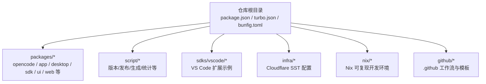
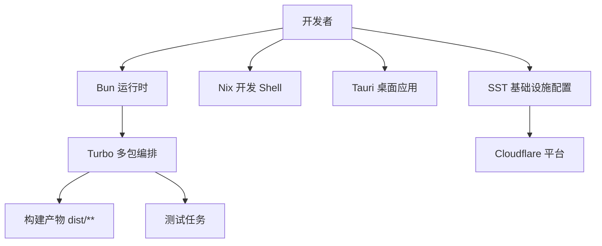
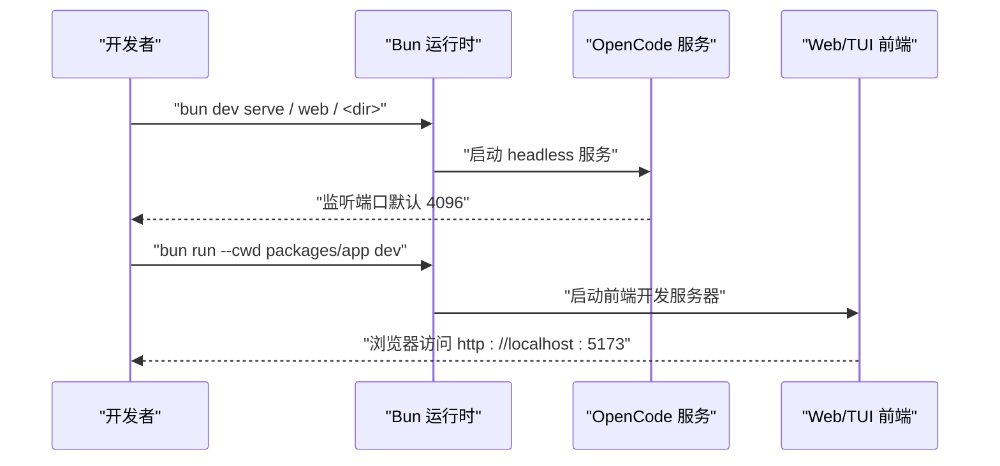
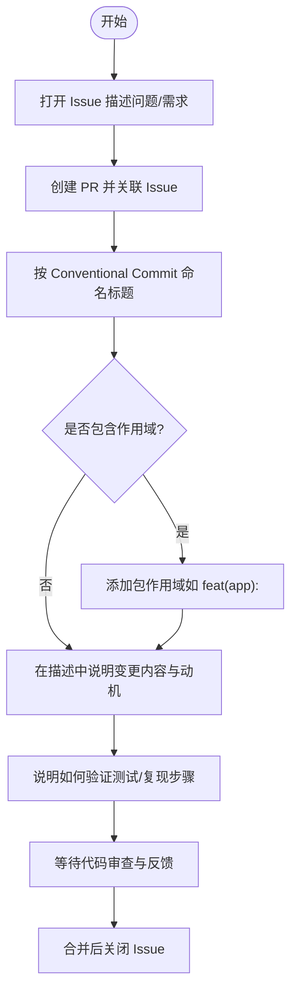
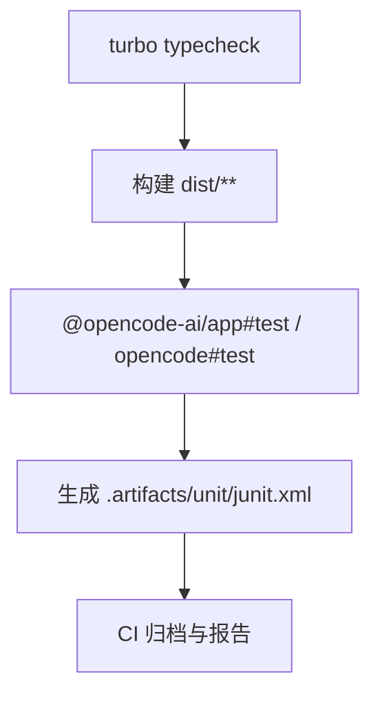
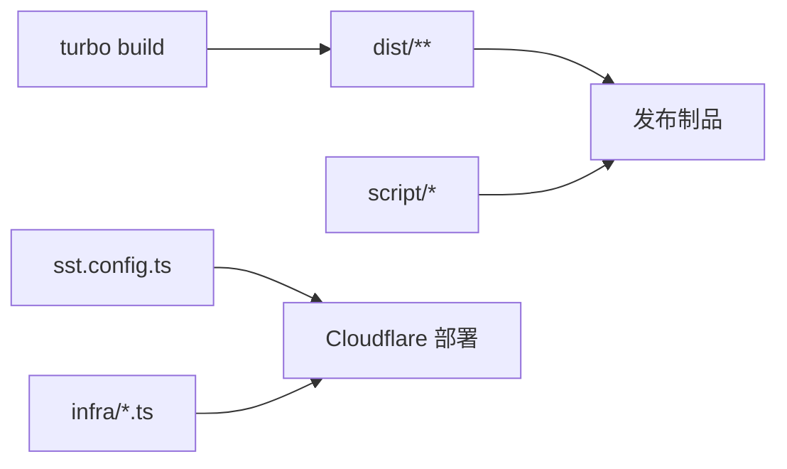
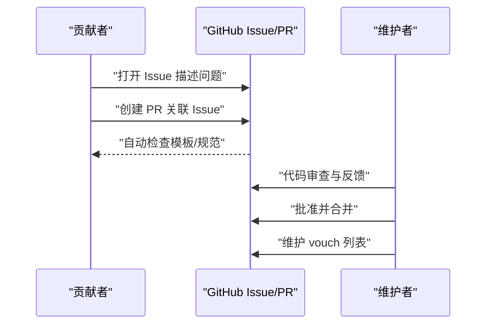
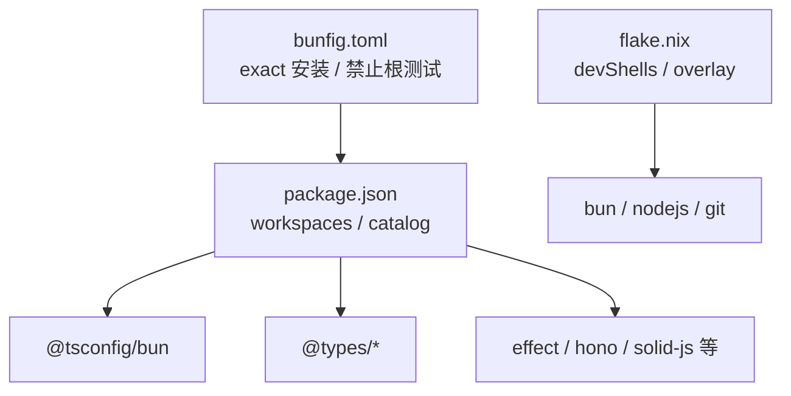

# 开发指南

<cite>
**本文引用的文件**
- [CONTRIBUTING.md](file://CONTRIBUTING.md)
- [README.md](file://README.md)
- [package.json](file://package.json)
- [turbo.json](file://turbo.json)
- [bunfig.toml](file://bunfig.toml)
- [flake.nix](file://flake.nix)
- [sst.config.ts](file://sst.config.ts)
- [tsconfig.json](file://tsconfig.json)
- [.editorconfig](file://.editorconfig)
- [.github/pull_request_template.md](file://.github/pull_request_template.md)
</cite>

## 目录
1. [简介](#简介)
2. [项目结构](#项目结构)
3. [核心组件](#核心组件)
4. [架构总览](#架构总览)
5. [详细组件分析](#详细组件分析)
6. [依赖关系分析](#依赖关系分析)
7. [性能考虑](#性能考虑)
8. [故障排查指南](#故障排查指南)
9. [结论](#结论)
10. [附录](#附录)

## 简介
本开发指南面向希望参与 OpenCode 项目的贡献者，提供从环境准备、开发流程、代码与提交规范、测试策略、构建与发布到调试与性能优化的完整说明。OpenCode 采用 Bun 作为主要运行时与包管理器，使用 Turbo 多包工作流进行统一构建与测试编排，并通过 Nix 提供可复现的开发环境。项目包含终端界面（TUI）、Web 应用、桌面应用（Tauri）以及多包 SDK/CLI 核心等模块。

## 项目结构
OpenCode 仓库采用 monorepo 结构，根目录包含工作区配置、多包构建配置、Nix 开发环境定义、云平台基础设施配置与发布相关脚本。核心包位于 packages/ 下，例如 opencode（核心 CLI/服务）、app（共享 Web 组件）、desktop（Tauri 桌面应用）、sdk（SDK 包）、ui、util、web 等；根脚本目录 script/ 提供版本、发布、变更日志等自动化任务；sdks/vscode/ 提供 VS Code 扩展开发示例。

**章节来源**
- [package.json:1-124](file://package.json#L1-L124)
- [turbo.json:1-32](file://turbo.json#L1-L32)
- [flake.nix:1-77](file://flake.nix#L1-L77)

## 核心组件
- 核心 CLI 与服务：packages/opencode，提供 headless API 服务器与 TUI 接口，支持 serve、web、attach 等命令。
- Web UI 共享组件：packages/app，基于 SolidJS，用于 Web 与桌面应用的 UI 基座。
- 桌面应用：packages/desktop，基于 Tauri 包装 Web UI，提供原生窗口体验。
- SDK 与插件：packages/sdk、packages/plugin、packages/script 等，提供对外能力与扩展点。
- 基础设施与部署：infra/* 与 sst.config.ts，使用 Cloudflare Workers/PlanetScale 等资源。
- 多包构建与测试：turbo.json 定义类型检查、构建与测试任务；bunfig.toml 控制安装与测试行为；Nix 提供可复现开发环境。

**章节来源**
- [CONTRIBUTING.md:72-156](file://CONTRIBUTING.md#L72-L156)
- [package.json:20-75](file://package.json#L20-L75)
- [turbo.json:5-31](file://turbo.json#L5-L31)
- [sst.config.ts:1-24](file://sst.config.ts#L1-L24)

## 架构总览
OpenCode 的开发与运行由以下关键要素协同：
- 运行时与包管理：Bun（版本要求见贡献指南），提供快速启动与打包能力。
- 多包工作流：Turbo 统一管理类型检查、构建与测试，支持跨包依赖与缓存。
- 可复现开发环境：Nix 提供 shell 与 overlay，内置 bun、nodejs、git 等工具。
- 云基础设施：SST 配置在 Cloudflare 平台上部署应用与控制台。
- 调试与本地化：Bun 调试选项、VSCode 示例配置、Tauri 开发模式。

**图表来源**
- [CONTRIBUTING.md:34-40](file://CONTRIBUTING.md#L34-L40)
- [turbo.json:5-31](file://turbo.json#L5-L31)
- [flake.nix:21-31](file://flake.nix#L21-L31)
- [sst.config.ts:3-23](file://sst.config.ts#L3-L23)

**章节来源**
- [CONTRIBUTING.md:34-40](file://CONTRIBUTING.md#L34-L40)
- [turbo.json:5-31](file://turbo.json#L5-L31)
- [flake.nix:21-31](file://flake.nix#L21-L31)
- [sst.config.ts:3-23](file://sst.config.ts#L3-L23)

## 详细组件分析

### 开发环境搭建与调试
- 工具安装与版本要求
  - 必需：Bun 1.3+（参见贡献指南“Developing OpenCode”段落）
  - 可选：Nix（flake.nix 提供开发 shell，包含 bun、nodejs、git 等）
- 启动开发服务器
  - 在仓库根目录执行安装与启动命令（参见贡献指南）
  - 支持 serve、web、TUI 模式，以及针对不同目录的运行方式
- 调试技巧
  - 使用 Bun 的 --inspect 系列参数手动启动并在 IDE 中附加调试
  - TUI 与服务端调试可分别独立启动或使用 spawn 模式
  - VSCode 提供示例 launch/settings 配置（参见贡献指南）

**图表来源**
- [CONTRIBUTING.md:83-122](file://CONTRIBUTING.md#L83-L122)

**章节来源**
- [CONTRIBUTING.md:34-40](file://CONTRIBUTING.md#L34-L40)
- [CONTRIBUTING.md:158-188](file://CONTRIBUTING.md#L158-L188)
- [flake.nix:21-31](file://flake.nix#L21-L31)

### 代码规范与提交规范
- 编码风格
  - EditorConfig 规定缩进、换行、字符集等基础格式
  - Prettier 通过 package.json 预设半行尾与行长
  - TypeScript 使用 @tsconfig/bun 配置（参见 tsconfig.json）
- 提交与 PR 规范
  - PR 必须关联现有 Issue，标题遵循 Conventional Commits（feat/fix/docs/chore/refactor/test）
  - UI 变更需附截图或录屏；逻辑变更需说明验证方法
  - PR 描述应简洁清晰，避免 AI 生成长文
  - 提供 Pull Request 模板（.github/pull_request_template.md）

**图表来源**
- [CONTRIBUTING.md:192-249](file://CONTRIBUTING.md#L192-L249)
- [.github/pull_request_template.md:1-30](file://.github/pull_request_template.md#L1-L30)

**章节来源**
- [.editorconfig:1-10](file://.editorconfig#L1-L10)
- [package.json:100-103](file://package.json#L100-L103)
- [tsconfig.json:1-6](file://tsconfig.json#L1-L6)
- [CONTRIBUTING.md:192-249](file://CONTRIBUTING.md#L192-L249)
- [.github/pull_request_template.md:1-30](file://.github/pull_request_template.md#L1-L30)

### 测试策略
- 类型检查与构建
  - 使用 turbo 的 typecheck 任务进行全仓类型检查
  - 构建任务定义在 turbo.json，输出目录为 dist/**
- 单元/集成测试
  - 各包可通过各自脚本运行测试（例如 @opencode-ai/app#test）
  - CI 下测试任务会生成 JUnit XML 输出以供归档
- 端到端测试
  - 仓库包含 Playwright 测试依赖（参见 package.json catalog 与 devDependencies）
  - 建议在本地先运行单包测试，再在 CI 中补充 E2E 覆盖

**图表来源**
- [turbo.json:5-31](file://turbo.json#L5-L31)
- [package.json:59,86](file://package.json#L59,L86)

**章节来源**
- [turbo.json:5-31](file://turbo.json#L5-L31)
- [package.json:59,86](file://package.json#L59,L86)

### 构建与发布流程
- 多包构建
  - 通过 turbo 统一调度各包构建，构建产物输出至 dist/**
- 版本与发布
  - 根脚本 script/ 提供版本、发布、生成、统计等工具（参见 CONTRIBUTING.md）
  - 发布工作流与 Python SDK 发布工作流位于 .github/workflows/（参见仓库根目录）
- 基础设施与部署
  - sst.config.ts 指定 Cloudflare 作为 home，配置 Stripe、PlanetScale 等提供商
  - 运行时通过 infra/*.ts 导入应用、控制台与企业版资源

**图表来源**
- [turbo.json:7-10](file://turbo.json#L7-L10)
- [CONTRIBUTING.md:56-71](file://CONTRIBUTING.md#L56-L71)
- [sst.config.ts:3-23](file://sst.config.ts#L3-L23)

**章节来源**
- [turbo.json:7-10](file://turbo.json#L7-L10)
- [CONTRIBUTING.md:56-71](file://CONTRIBUTING.md#L56-L71)
- [sst.config.ts:3-23](file://sst.config.ts#L3-L23)

### 贡献流程与信任系统
- Issue 与 PR
  - 所有 PR 必须关联现有 Issue；UI 变更需截图；逻辑变更需说明验证方法
  - PR 标题遵循 Conventional Commits；可选包作用域
- 信任与 Vouch
  - 项目使用 vouch 管理可信贡献者列表，维护于 .github/VOUCHED.td
  - 维护者可通过评论管理 vouch 列表（vouch、denounce、unvouch）

**图表来源**
- [CONTRIBUTING.md:192-249](file://CONTRIBUTING.md#L192-L249)
- [CONTRIBUTING.md:267-288](file://CONTRIBUTING.md#L267-L288)

**章节来源**
- [CONTRIBUTING.md:192-249](file://CONTRIBUTING.md#L192-L249)
- [CONTRIBUTING.md:267-288](file://CONTRIBUTING.md#L267-L288)

## 依赖关系分析
- 工作区与 Catalog
  - package.json 定义 workspaces 与 catalog，统一管理类型与依赖版本
  - 通过 @tsconfig/bun、@types/bun、effect、hono、solid-js 等生态库形成一致的技术栈
- 安装与测试约束
  - bunfig.toml 设置安装为 exact，并禁止从根目录直接运行测试
- Nix 可复现性
  - flake.nix 提供 devShells 与 overlay，确保团队成员在相同工具链下开发

**图表来源**
- [package.json:20-75](file://package.json#L20-L75)
- [package.json:113-122](file://package.json#L113-L122)
- [bunfig.toml:1-7](file://bunfig.toml#L1-L7)
- [flake.nix:21-31](file://flake.nix#L21-L31)

**章节来源**
- [package.json:20-75](file://package.json#L20-L75)
- [package.json:113-122](file://package.json#L113-L122)
- [bunfig.toml:1-7](file://bunfig.toml#L1-L7)
- [flake.nix:21-31](file://flake.nix#L21-L31)

## 性能考虑
- 使用 Bun 的快速运行与打包能力，结合 Turbo 的增量构建与缓存，提升迭代效率
- 在大型 monorepo 中合理拆分包边界，减少不必要的依赖传递
- 对于桌面应用（Tauri），注意前端资源体积与加载时间，必要时启用压缩与懒加载
- 在 CI 中优先运行类型检查与单元测试，将端到端测试放在后续阶段

## 故障排查指南
- 无法从根目录运行测试
  - 根目录的测试脚本被设计为禁止直接运行，应进入具体包执行测试
- 调试断点不生效
  - 尝试使用 --inspect-wait 或 --inspect-brk；若仍失败，使用 spawn 模式或分别调试服务端与 TUI
- Tauri 开发依赖缺失
  - 桌面应用需要 Rust 工具链与平台库，请参考贡献指南中的前置条件链接
- 云平台部署异常
  - 检查 SST 配置与环境变量（Stripe、PlanetScale 等），确认 Cloudflare 凭据正确

**章节来源**
- [bunfig.toml:4-6](file://bunfig.toml#L4-L6)
- [CONTRIBUTING.md:158-188](file://CONTRIBUTING.md#L158-L188)
- [CONTRIBUTING.md:150-152](file://CONTRIBUTING.md#L150-L152)
- [sst.config.ts:10-15](file://sst.config.ts#L10-L15)

## 结论
通过遵循本开发指南，贡献者可以快速搭建一致的开发环境，理解多包构建与测试流程，掌握调试与性能优化技巧，并按照规范完成 Issue 与 PR 的提交与审查。建议在首次贡献前通读 CONTRIBUTING.md 与 README.md，确保对项目目标与流程有充分认知。

## 附录
- 快速命令清单（来自贡献指南）
  - 安装与启动：bun install；bun dev
  - API 服务：bun dev serve（可指定端口）
  - Web 应用：bun run --cwd packages/app dev
  - 桌面应用：bun run --cwd packages/desktop tauri dev
  - 本地可执行：./packages/opencode/script/build.ts --single
- 云平台配置
  - SST 应用名称、删除策略、保护级别、home 与提供商配置见 sst.config.ts
- 文档与社区
  - 项目文档入口与社区渠道见 README.md

**章节来源**
- [CONTRIBUTING.md:34-156](file://CONTRIBUTING.md#L34-L156)
- [README.md:46-122](file://README.md#L46-L122)
- [sst.config.ts:3-23](file://sst.config.ts#L3-L23)