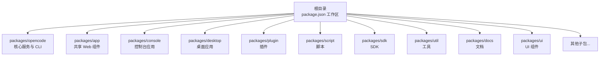
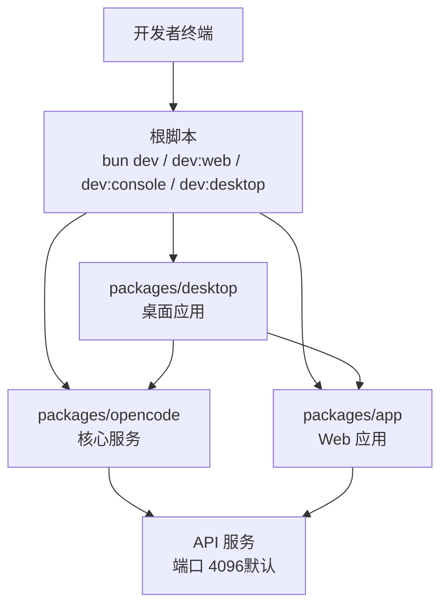
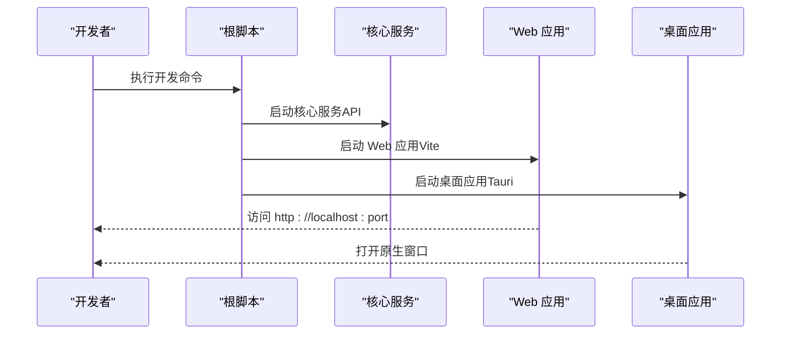
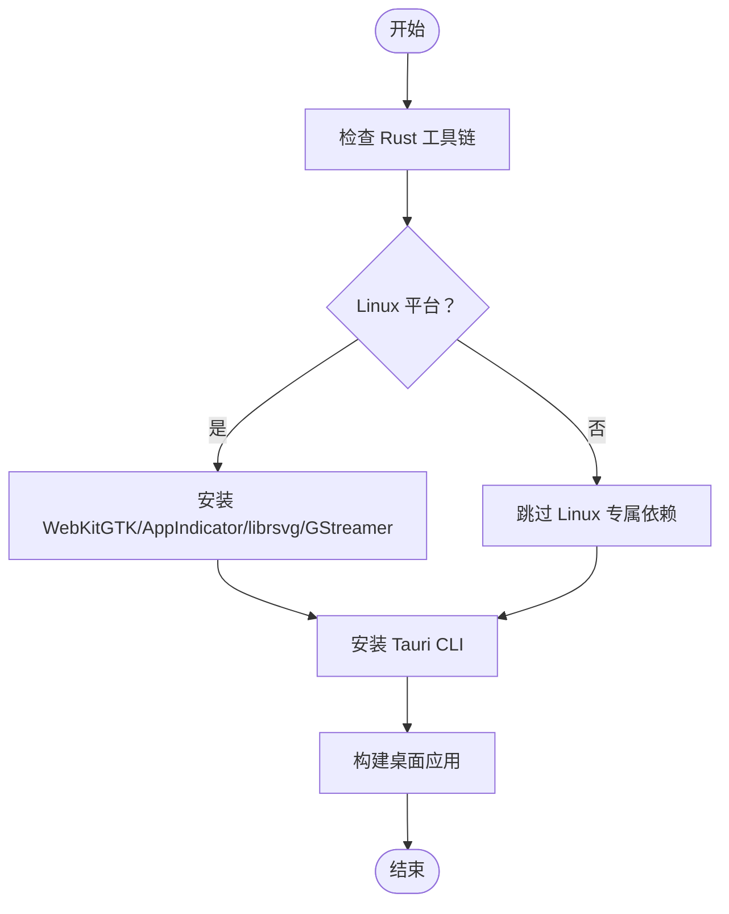
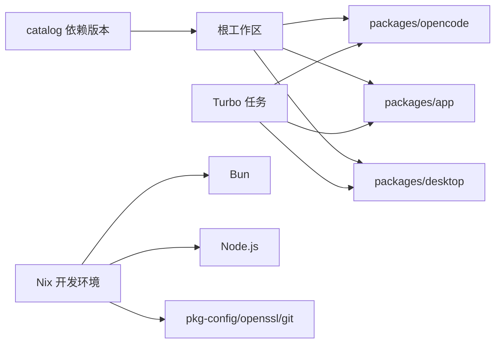

# 开发环境搭建

<cite>
**本文引用的文件**
- [README.md](file://README.md)
- [CONTRIBUTING.md](file://CONTRIBUTING.md)
- [package.json](file://package.json)
- [turbo.json](file://turbo.json)
- [bunfig.toml](file://bunfig.toml)
- [flake.nix](file://flake.nix)
- [nix/opencode.nix](file://nix/opencode.nix)
- [nix/desktop.nix](file://nix/desktop.nix)
- [packages/opencode/package.json](file://packages/opencode/package.json)
- [packages/app/package.json](file://packages/app/package.json)
- [packages/desktop/package.json](file://packages/desktop/package.json)
- [.opencode/package.json](file://.opencode/package.json)
</cite>

## 目录
1. [简介](#简介)
2. [项目结构](#项目结构)
3. [核心组件](#核心组件)
4. [架构总览](#架构总览)
5. [详细组件分析](#详细组件分析)
6. [依赖关系分析](#依赖关系分析)
7. [性能考虑](#性能考虑)
8. [故障排查指南](#故障排查指南)
9. [结论](#结论)
10. [附录](#附录)

## 简介
本指南面向希望在本地搭建 OpenCode 开发环境的开发者，覆盖从系统工具到 monorepo 依赖安装、开发服务器启动、Web 应用与桌面应用运行、以及 Tauri/Rust 工具链配置等全流程。文档同时提供环境验证步骤与常见问题的解决方案，帮助你快速完成本地开发准备。

## 项目结构
OpenCode 采用 monorepo 架构，根目录通过工作区（workspaces）统一管理多个子包，典型模块包括：
- 核心服务与 CLI：packages/opencode
- 共享 Web 组件：packages/app
- 控制台应用：packages/console
- 桌面应用：packages/desktop
- 插件与脚本：packages/plugin、packages/script
- SDK 与工具：packages/sdk、packages/util
- Nix 开发环境：nix/*.nix

图表来源
- [package.json:20-26](file://package.json#L20-L26)
- [packages/opencode/package.json:1-164](file://packages/opencode/package.json#L1-L164)
- [packages/app/package.json:1-78](file://packages/app/package.json#L1-L78)
- [packages/desktop/package.json:1-45](file://packages/desktop/package.json#L1-L45)

章节来源
- [package.json:20-26](file://package.json#L20-L26)
- [turbo.json:1-32](file://turbo.json#L1-L32)

## 核心组件
- 包管理器与版本要求
  - 必须使用 Bun 1.3+ 作为包管理器与运行时，确保与工程配置一致。
  - 根 package.json 显式声明了包管理器版本，建议按此版本安装以避免锁版本不匹配导致的问题。
- monorepo 依赖管理
  - 使用工作区（workspaces）统一管理各子包依赖，根目录提供 catalog 依赖版本锁定与 overrides。
  - Turbo 用于任务编排与缓存，支持类型检查、测试等任务的跨包执行。
- 脚本命令
  - 根目录提供多种开发脚本，如 dev、dev:web、dev:console、dev:desktop 等，分别对应不同子系统的开发模式。
  - 各子包内部也提供独立的构建、测试、预览等脚本，便于局部开发与调试。

章节来源
- [package.json:7](file://package.json#L7)
- [package.json:8-18](file://package.json#L8-L18)
- [turbo.json:5-30](file://turbo.json#L5-L30)
- [bunfig.toml:1-7](file://bunfig.toml#L1-L7)

## 架构总览
下图展示了开发时常见的启动路径与交互关系：开发者通过根脚本启动不同子系统，核心服务提供 API，Web 应用与桌面应用消费该 API 并提供用户界面。

图表来源
- [package.json:8-13](file://package.json#L8-L13)
- [CONTRIBUTING.md:97-141](file://CONTRIBUTING.md#L97-L141)

章节来源
- [package.json:8-13](file://package.json#L8-L13)
- [CONTRIBUTING.md:97-141](file://CONTRIBUTING.md#L97-L141)

## 详细组件分析

### 系统与工具要求
- Node.js
  - 项目中存在 Node.js 的 Nix 开发壳与多平台打包流程，但开发与构建主要基于 Bun。若需满足 CI 或特定场景，可参考 Nix 配置中的 Node 版本。
- Bun
  - 必须安装 Bun 1.3+，根 package.json 中明确声明了包管理器版本，建议严格遵循。
- Git
  - 项目使用 Git 进行版本控制，部分脚本与发布流程依赖 Git 提交与标签。
- Nix（可选）
  - 提供完整的开发环境封装，包含 bun、nodejs、pkg-config、openssl、git 等工具，适合在 Linux/macOS 上快速获得一致的开发体验。

章节来源
- [package.json:7](file://package.json#L7)
- [flake.nix:22-31](file://flake.nix#L22-L31)
- [CONTRIBUTING.md:34-40](file://CONTRIBUTING.md#L34-L40)

### 依赖安装与 monorepo 管理
- 安装步骤
  - 在项目根目录执行依赖安装，确保所有子包的依赖被正确解析与安装。
  - 根 package.json 中的工作区配置会自动处理子包间的依赖链接。
- 依赖版本与锁定
  - 通过 catalog 与 overrides 对关键依赖进行版本锁定，减少版本漂移带来的不兼容。
  - bun.lock 与各子包的 lock 文件共同保证安装一致性。
- 类型检查与任务编排
  - 使用 Turbo 进行类型检查与测试任务的跨包执行，提升开发效率。

章节来源
- [package.json:20-26](file://package.json#L20-L26)
- [package.json:27-75](file://package.json#L27-L75)
- [turbo.json:1-32](file://turbo.json#L1-L32)
- [bunfig.toml:1-7](file://bunfig.toml#L1-L7)

### 开发服务器启动与命令详解
- 根级开发命令
  - 启动核心服务（默认运行于 packages/opencode）：bun dev
  - 启动 Web 应用：bun run --cwd packages/app dev
  - 启动控制台应用：bun run --cwd packages/console/app dev
  - 启动桌面应用：bun run --cwd packages/desktop tauri dev
- 针对不同目录运行
  - 可直接传入目标目录或仓库路径，例如：bun dev <directory> 或 bun dev .
- API 服务器与 Web 应用
  - API 服务器默认端口为 4096，可通过参数指定端口。
  - Web 应用本地开发端口通常由 Vite 分配，启动后输出可见。
- 桌面应用
  - 桌面应用基于 Tauri，需要安装 Rust 工具链与平台依赖；启动后会同时运行 Web 开发服务器与原生窗口。

图表来源
- [package.json:8-13](file://package.json#L8-L13)
- [CONTRIBUTING.md:97-141](file://CONTRIBUTING.md#L97-L141)

章节来源
- [package.json:8-13](file://package.json#L8-L13)
- [CONTRIBUTING.md:81-141](file://CONTRIBUTING.md#L81-L141)

### 桌面应用开发环境配置（Tauri 与 Rust）
- Rust 工具链
  - 发布与构建流程中使用稳定版 Rust 工具链，开发时同样建议安装稳定版以保持一致性。
- 平台依赖
  - Linux：安装 WebKitGTK、AppIndicator、librsvg、GStreamer 等依赖。
  - macOS/Windows：根据 Tauri 官方前置条件准备相应工具与证书。
- Nix 封装
  - nix/desktop.nix 将 Rust 构建与桌面应用打包流程封装，便于在 Nix 生态中复现构建环境。

图表来源
- [.github/workflows/publish.yml:298-301](file://.github/workflows/publish.yml#L298-L301)
- [nix/desktop.nix:50-64](file://nix/desktop.nix#L50-L64)

章节来源
- [.github/workflows/publish.yml:298-301](file://.github/workflows/publish.yml#L298-L301)
- [nix/desktop.nix:26-101](file://nix/desktop.nix#L26-L101)

### 子包与脚本要点
- 核心服务（packages/opencode）
  - 提供 CLI 与核心业务逻辑，支持浏览器条件运行与构建脚本。
- Web 应用（packages/app）
  - 基于 Vite 的开发服务器，提供组件与样式资源导出。
- 桌面应用（packages/desktop）
  - 依赖 Tauri 与 Web 应用，提供原生窗口与系统集成能力。

章节来源
- [packages/opencode/package.json:1-164](file://packages/opencode/package.json#L1-L164)
- [packages/app/package.json:1-78](file://packages/app/package.json#L1-L78)
- [packages/desktop/package.json:1-45](file://packages/desktop/package.json#L1-L45)

## 依赖关系分析
- 工作区与版本锁定
  - 根 package.json 的 workspaces 与 catalog 统一管理依赖版本，避免子包间冲突。
- 任务编排
  - Turbo 的 tasks 配置定义了类型检查、测试等任务的依赖关系与输出目录，提升缓存命中率。
- Nix 封装
  - flake.nix 与 nix/*.nix 将工具链与依赖打包为可复现的开发环境，降低本地环境差异。

图表来源
- [package.json:20-75](file://package.json#L20-L75)
- [turbo.json:5-30](file://turbo.json#L5-L30)
- [flake.nix:22-31](file://flake.nix#L22-L31)

章节来源
- [package.json:20-75](file://package.json#L20-L75)
- [turbo.json:5-30](file://turbo.json#L5-L30)
- [flake.nix:22-31](file://flake.nix#L22-L31)

## 性能考虑
- 使用 Turbo 进行增量构建与缓存，减少重复任务时间。
- 在大型 monorepo 中，合理拆分任务边界，避免不必要的全量重建。
- Web 应用与桌面应用的开发服务器采用热重载机制，建议仅加载必要的依赖以缩短启动时间。

## 故障排查指南
- 包管理器版本不匹配
  - 症状：安装或运行时报错，提示版本过低。
  - 处理：升级至 Bun 1.3+，确保与根 package.json 的声明一致。
- 依赖安装异常
  - 症状：安装卡住或失败。
  - 处理：清理缓存后重试；检查网络与代理设置；确认工作区配置无误。
- Web 应用无法访问
  - 症状：浏览器无法打开本地地址。
  - 处理：确认核心服务已启动且端口未被占用；检查防火墙与安全软件。
- 桌面应用构建失败
  - 症状：Rust 工具链或平台依赖缺失导致构建中断。
  - 处理：安装稳定版 Rust；根据平台安装 WebKitGTK、AppIndicator、librsvg、GStreamer 等依赖；参考 Nix 封装以复现环境。
- 端口冲突
  - 症状：API 服务器或开发服务器启动失败。
  - 处理：修改端口或释放占用端口；确认默认端口 4096 未被占用。

章节来源
- [package.json:7](file://package.json#L7)
- [CONTRIBUTING.md:97-141](file://CONTRIBUTING.md#L97-L141)
- [.github/workflows/publish.yml:298-301](file://.github/workflows/publish.yml#L298-L301)

## 结论
通过遵循本指南，你可以快速完成 OpenCode 的开发环境搭建，并在 monorepo 架构下高效地启动核心服务、Web 应用与桌面应用。建议优先使用 Bun 1.3+ 与根工作区配置，结合 Turbo 与 Nix（可选）提升开发体验与一致性。

## 附录

### 环境验证清单
- 工具安装
  - Bun 1.3+：确认版本满足要求。
  - Git：可正常 clone 与提交。
  - Nix（可选）：可进入开发 shell。
- 依赖安装
  - 在根目录执行安装，等待安装完成。
  - 检查各子包的 lock 文件与 node_modules 是否生成。
- 服务启动
  - 核心服务：bun dev，确认端口 4096 可访问。
  - Web 应用：bun run --cwd packages/app dev，确认浏览器可打开。
  - 桌面应用：bun run --cwd packages/desktop tauri dev，确认原生窗口弹出。
- 桌面应用前置条件
  - Rust 工具链：稳定版可用。
  - 平台依赖：Linux 安装 WebKitGTK、AppIndicator、librsvg、GStreamer；macOS/Windows 安装对应工具与证书。

章节来源
- [package.json:7](file://package.json#L7)
- [CONTRIBUTING.md:34-40](file://CONTRIBUTING.md#L34-L40)
- [CONTRIBUTING.md:97-141](file://CONTRIBUTING.md#L97-L141)
- [.github/workflows/publish.yml:298-301](file://.github/workflows/publish.yml#L298-L301)