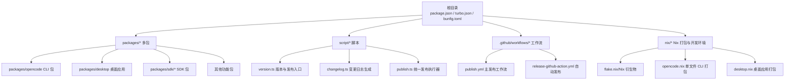
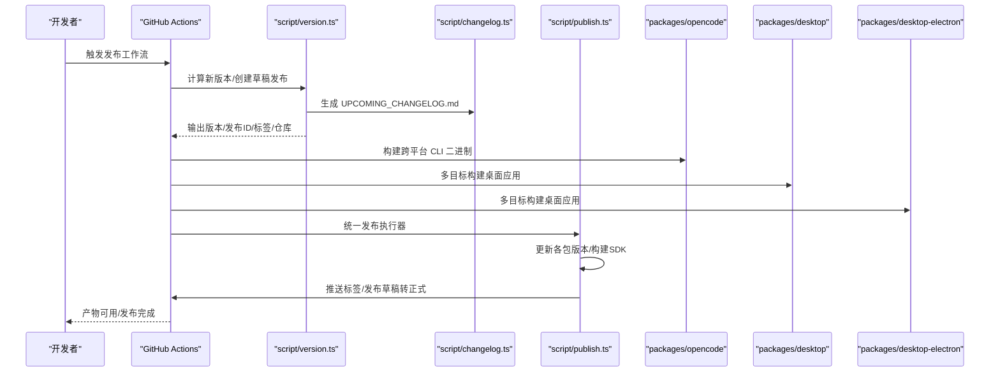
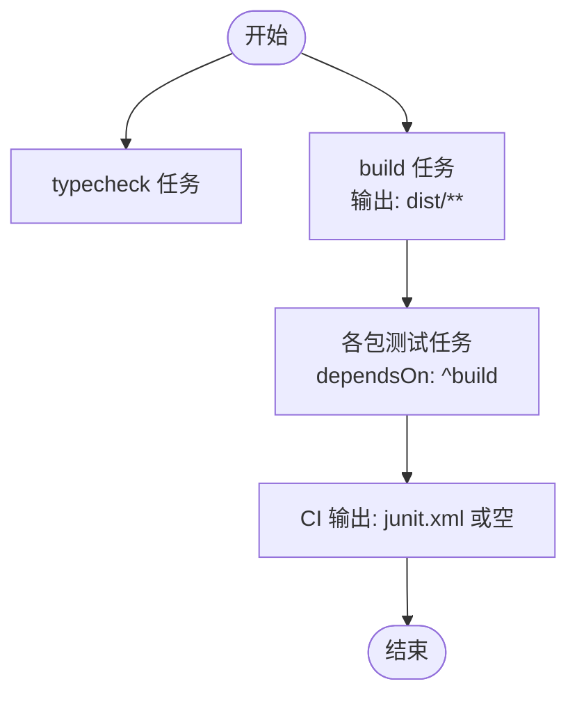
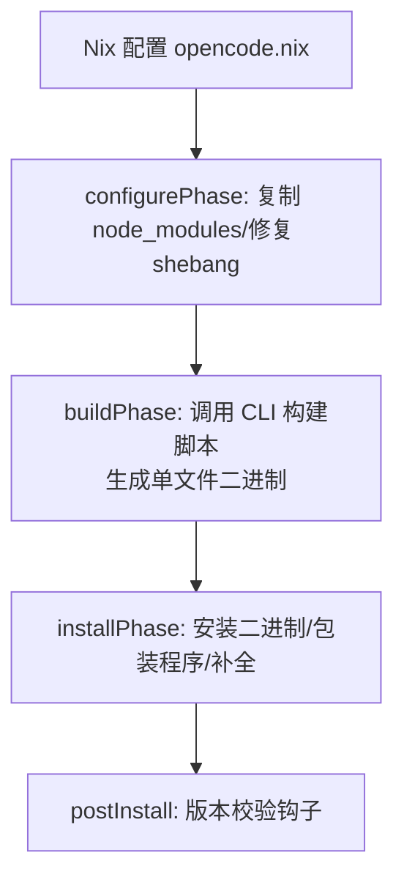
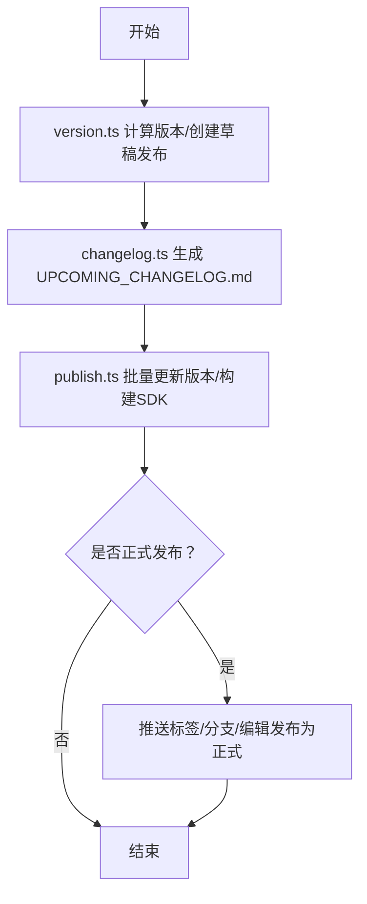
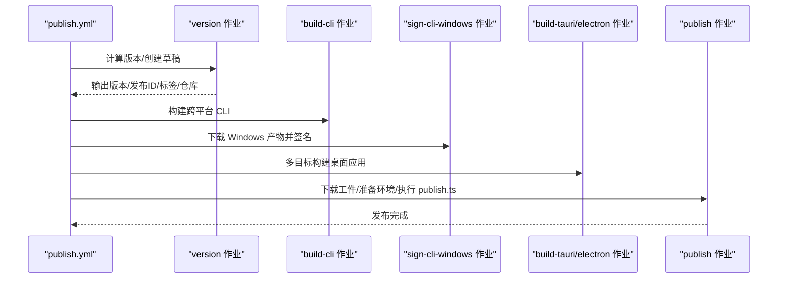
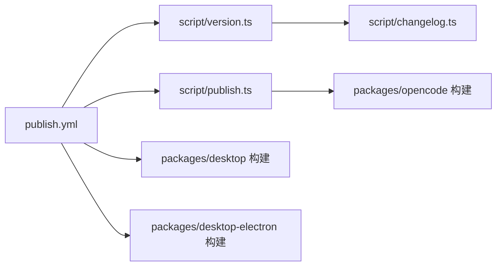

# 构建与发布流程

<cite>
**本文引用的文件**
- [turbo.json](file://turbo.json)
- [package.json](file://package.json)
- [bunfig.toml](file://bunfig.toml)
- [flake.nix](file://flake.nix)
- [flake.lock](file://flake.lock)
- [version.ts](file://script/version.ts)
- [changelog.ts](file://script/changelog.ts)
- [publish.ts](file://script/publish.ts)
- [publish.yml](file://.github/workflows/publish.yml)
- [release-github-action.yml](file://.github/workflows/release-github-action.yml)
- [opencode.nix](file://nix/opencode.nix)
- [desktop.nix](file://nix/desktop.nix)
- [packages/opencode/package.json](file://packages/opencode/package.json)
</cite>

## 目录
1. [简介](#简介)
2. [项目结构](#项目结构)
3. [核心组件](#核心组件)
4. [架构总览](#架构总览)
5. [详细组件分析](#详细组件分析)
6. [依赖关系分析](#依赖关系分析)
7. [性能考量](#性能考量)
8. [故障排查指南](#故障排查指南)
9. [结论](#结论)
10. [附录](#附录)

## 简介
本指南面向 OpenCode 项目的维护者与贡献者，系统性说明项目的构建配置与发布流水线，涵盖：
- 多包构建系统与 Turbo 配置、包间依赖管理
- 本地构建流程（含单文件可执行打包与平台特定构建）
- 版本管理策略（语义化版本与变更日志生成）
- 发布流程（GitHub Actions 工作流与自动发布）
- 构建产物验证与测试方法
- 发布前检查清单与发布后验证步骤
- 不同环境下的部署策略与回滚机制
- 实际构建与发布示例路径，便于快速上手

## 项目结构
OpenCode 采用 Monorepo 结构，根目录通过工作区管理多个包；同时使用 Turbo 进行任务编排，Nix 提供本地开发与打包能力；GitHub Actions 完成自动化发布。

图表来源
- [package.json:1-124](file://package.json#L1-L124)
- [turbo.json:1-32](file://turbo.json#L1-L32)
- [flake.nix:1-77](file://flake.nix#L1-L77)
- [publish.yml:1-630](file://.github/workflows/publish.yml#L1-L630)
- [opencode.nix:1-102](file://nix/opencode.nix#L1-L102)
- [desktop.nix:1-101](file://nix/desktop.nix#L1-L101)

章节来源
- [package.json:1-124](file://package.json#L1-L124)
- [turbo.json:1-32](file://turbo.json#L1-L32)
- [flake.nix:1-77](file://flake.nix#L1-L77)
- [flake.lock:1-28](file://flake.lock#L1-L28)

## 核心组件
- 多包与工作区：根 package.json 声明工作区与 catalog 依赖，统一管理版本与类型定义。
- Turbo 任务编排：集中定义 typecheck、build、test 等任务及其依赖与输出缓存。
- Nix 开发与打包：提供一致的本地开发环境与可复现的二进制打包。
- 发布脚本：version.ts 生成版本与变更日志、触发 GitHub Release；publish.ts 统一更新版本、构建与发布各子包；changelog.ts 生成 UPCOMING_CHANGELOG.md。
- GitHub Actions：publish.yml 完整发布流水线，覆盖 CLI、桌面应用（Tauri/Electron）、签名与上传；release-github-action.yml 用于 github 子模块的自动发布。

章节来源
- [package.json:20-75](file://package.json#L20-L75)
- [turbo.json:5-31](file://turbo.json#L5-L31)
- [version.ts:1-37](file://script/version.ts#L1-L37)
- [changelog.ts:1-77](file://script/changelog.ts#L1-L77)
- [publish.ts:1-87](file://script/publish.ts#L1-L87)
- [publish.yml:1-630](file://.github/workflows/publish.yml#L1-L630)
- [release-github-action.yml:1-30](file://.github/workflows/release-github-action.yml#L1-L30)

## 架构总览
下图展示从版本决策到多平台产物发布的端到端流程，以及关键工具与脚本之间的交互。

图表来源
- [publish.yml:34-630](file://.github/workflows/publish.yml#L34-L630)
- [version.ts:1-37](file://script/version.ts#L1-L37)
- [changelog.ts:1-77](file://script/changelog.ts#L1-L77)
- [publish.ts:1-87](file://script/publish.ts#L1-L87)

## 详细组件分析

### 多包构建系统与 Turbo 配置
- 任务定义
  - typecheck：全局类型检查
  - build：构建任务，声明输出目录 dist/** 以启用缓存
  - 各包测试任务：如 opencode#test、opencode#test:ci、@opencode-ai/app#test、@opencode-ai/app#test:ci，均在构建之后运行，并配置 CI 输出或环境透传
- 全局环境
  - globalEnv/globalPassThroughEnv 控制 CI 与开关变量传递
- 依赖关系
  - 测试任务 dependsOn 上游构建，确保产物就绪

图表来源
- [turbo.json:5-31](file://turbo.json#L5-L31)

章节来源
- [turbo.json:1-32](file://turbo.json#L1-L32)

### 包间依赖管理
- 工作区与 catalog
  - 根 package.json 的 workspaces 指定 packages/*、console/*、sdk/js、slack 等目录
  - catalog 统一约束大量依赖版本，减少冲突
- 依赖覆盖与补丁
  - overrides 与 patchedDependencies 保证兼容性与修复
- 包内依赖
  - 例如 packages/opencode/package.json 中对 workspace:* 的依赖，确保 monorepo 内部版本一致性

章节来源
- [package.json:20-75](file://package.json#L20-L75)
- [package.json:113-123](file://package.json#L113-L123)
- [packages/opencode/package.json:103-107](file://packages/opencode/package.json#L103-L107)

### 本地构建流程（单文件可执行与平台特定）
- 单文件可执行（Nix）
  - opencode.nix 在安装阶段调用 CLI 构建脚本生成单文件二进制，并通过 makeBinaryWrapper 注入必要环境与 PATH
  - 支持 shell 补全生成与版本校验钩子
- 平台特定构建（Nix）
  - desktop.nix 将 CLI 作为 sidecar 复制到桌面应用，按 Linux/macOS/Windows 目标进行打包
- 本地开发命令
  - 根 package.json 提供 dev:desktop、dev:web、dev:console 等开发入口，便于快速迭代

图表来源
- [opencode.nix:30-80](file://nix/opencode.nix#L30-L80)

章节来源
- [opencode.nix:1-102](file://nix/opencode.nix#L1-L102)
- [desktop.nix:26-101](file://nix/desktop.nix#L26-L101)
- [package.json:9-13](file://package.json#L9-L13)

### 版本管理策略与变更日志
- 版本计算与发布
  - version.ts 根据输入参数决定 bump 或自定义版本，生成发布草稿并写入 GITHUB_OUTPUT
  - 若非预览版本，会基于当前提交生成 UPCOMING_CHANGELOG.md 并写入临时文件，随后创建 GitHub Release
- 变更日志生成
  - changelog.ts 调用 opencode run changelog 命令生成 UPCOMING_CHANGELOG.md，支持 from/to、variant、quiet、print 等参数
- 发布执行
  - publish.ts 扫描所有 package.json，批量替换版本号，更新 Zed 扩展版本与下载链接，执行 SDK 构建，随后根据 release 是否存在决定是否推送到远端、打标签、编辑发布为正式等

图表来源
- [version.ts:1-37](file://script/version.ts#L1-L37)
- [changelog.ts:1-77](file://script/changelog.ts#L1-L77)
- [publish.ts:1-87](file://script/publish.ts#L1-L87)

章节来源
- [version.ts:1-37](file://script/version.ts#L1-L37)
- [changelog.ts:1-77](file://script/changelog.ts#L1-L77)
- [publish.ts:1-87](file://script/publish.ts#L1-L87)

### 发布流程（GitHub Actions）
- 触发条件
  - 推送至 ci、dev、beta、snapshot-* 分支，或手动触发
- 关键作业
  - version：计算版本、创建草稿发布、产出版本/发布ID/标签/仓库
  - build-cli：构建跨平台 CLI 二进制并上传工件
  - sign-cli-windows：下载 Windows 产物、Azure Trusted Signing 签名、校验签名、重新打包并上传签名后的资产
  - build-tauri / build-electron：多目标构建桌面应用，处理 macOS/Windows/Linux，上传工件
  - publish：下载所需工件、准备 AUR SSH、调用 publish.ts 执行统一发布
- 产物与签名
  - Windows CLI 使用 Azure Trusted Signing 签名并校验
  - 桌面应用在各平台进行代码签名与验证

图表来源
- [publish.yml:34-630](file://.github/workflows/publish.yml#L34-L630)

章节来源
- [publish.yml:1-630](file://.github/workflows/publish.yml#L1-L630)

### 发布前检查清单
- 本地验证
  - 运行类型检查与单元测试：bun turbo typecheck、各包 test
  - 本地 Nix 构建：bun run nix develop，确认单文件 CLI 与桌面应用可运行
- 版本与日志
  - 确认版本计算符合预期（major/minor/patch 或自定义版本）
  - 确认 UPCOMING_CHANGELOG.md 已生成且内容准确
- 权限与密钥
  - GitHub Token、Apple 证书、Azure 签名凭据、AUR 密钥等已配置
- 产物完整性
  - CLI 与桌面应用各平台产物齐全，签名有效

章节来源
- [turbo.json:6-14](file://turbo.json#L6-L14)
- [opencode.nix:45-80](file://nix/opencode.nix#L45-L80)
- [publish.yml:34-630](file://.github/workflows/publish.yml#L34-L630)

### 发布后验证步骤
- 校验发布状态
  - 确认 GitHub Release 已转为正式发布，标签已推送
- 校验产物
  - 下载各平台 CLI 与桌面应用，验证签名与可执行性
  - 对比版本号与变更日志
- 回归测试
  - 运行关键集成测试，确保核心功能正常

章节来源
- [publish.ts:60-74](file://script/publish.ts#L60-L74)
- [publish.yml:167-182](file://.github/workflows/publish.yml#L167-L182)
- [publish.yml:372-387](file://.github/workflows/publish.yml#L372-L387)

### 不同环境下的部署策略与回滚机制
- 开发环境
  - 使用 Nix 开发壳，一键安装依赖与工具链，确保一致性
- 预发布/测试环境
  - 使用草稿发布与预发布通道（如 beta），先在小范围验证
- 生产环境
  - 正式发布后，通过包管理器与分发渠道（如 AUR、容器镜像）分发
- 回滚
  - 基于 Git 标签与发布版本，可直接回退到上一个稳定标签
  - 如需撤销发布，可在 GitHub Releases 编辑为草稿并删除相关资产

章节来源
- [flake.nix:21-31](file://flake.nix#L21-L31)
- [publish.yml:63-68](file://.github/workflows/publish.yml#L63-L68)
- [publish.ts:60-68](file://script/publish.ts#L60-L68)

### 实际构建与发布示例（路径指引）
- 本地单文件 CLI 构建
  - 使用 Nix：bun run nix develop，进入开发环境后执行安装与构建
  - 参考路径：[nix/opencode.nix:45-53](file://nix/opencode.nix#L45-L53)
- 本地桌面应用构建
  - 使用 Nix：bun run nix develop，构建 desktop 包
  - 参考路径：[nix/desktop.nix:26-83](file://nix/desktop.nix#L26-L83)
- 类型检查与测试
  - 根目录：bun turbo typecheck
  - 参考路径：[turbo.json:6-14](file://turbo.json#L6-L14)
- 版本与发布
  - 计算版本并创建草稿：bun script/version.ts
  - 生成变更日志：bun script/changelog.ts
  - 统一发布：bun script/publish.ts
  - 参考路径：[script/version.ts:1-37](file://script/version.ts#L1-L37)，[script/changelog.ts:1-77](file://script/changelog.ts#L1-L77)，[script/publish.ts:1-87](file://script/publish.ts#L1-L87)
- GitHub Actions 发布
  - 触发工作流：.github/workflows/publish.yml
  - 参考路径：[.github/workflows/publish.yml:1-630](file://.github/workflows/publish.yml#L1-L630)

## 依赖关系分析
- 组件耦合
  - publish.yml 依赖 version.ts 与 publish.ts；version.ts 依赖 changelog.ts 与 GitHub CLI；publish.ts 依赖各子包构建脚本
- 外部依赖
  - GitHub Actions、Azure Trusted Signing、Apple 代码签名、AUR 发布等外部服务
- 潜在循环依赖
  - 无直接循环；版本与发布脚本通过工作流解耦

图表来源
- [publish.yml:34-630](file://.github/workflows/publish.yml#L34-L630)
- [version.ts:1-37](file://script/version.ts#L1-L37)
- [changelog.ts:1-77](file://script/changelog.ts#L1-L77)
- [publish.ts:1-87](file://script/publish.ts#L1-L87)

章节来源
- [publish.yml:34-630](file://.github/workflows/publish.yml#L34-L630)
- [version.ts:1-37](file://script/version.ts#L1-L37)
- [changelog.ts:1-77](file://script/changelog.ts#L1-L77)
- [publish.ts:1-87](file://script/publish.ts#L1-L87)

## 性能考量
- Turbo 缓存
  - build 任务输出 dist/**，提升增量构建效率
- 并行矩阵
  - 桌面应用构建使用矩阵并行，缩短整体时间
- 依赖缓存
  - Actions cache 与 Nix overlay 减少重复安装与编译时间
- 产物签名与验证
  - Windows CLI 使用 Azure Trusted Signing，避免本地签名环境差异导致的失败重试

章节来源
- [turbo.json:7-10](file://turbo.json#L7-L10)
- [publish.yml:224-241](file://.github/workflows/publish.yml#L224-L241)
- [publish.yml:281-296](file://.github/workflows/publish.yml#L281-L296)

## 故障排查指南
- 根目录禁止直接运行测试
  - 根 package.json 明确禁止从根目录运行测试，应使用各包内测试脚本或 Turbo 任务
  - 参考路径：[package.json:18](file://package.json#L18)
- 测试根目录限制
  - bunfig.toml 设置了测试根目录，防止误用
  - 参考路径：[bunfig.toml:4-6](file://bunfig.toml#L4-L6)
- 版本与发布失败
  - 检查 GitHub Token、Apple 证书、Azure 凭据是否正确配置
  - 查看工作流日志中的版本计算与发布草稿创建步骤
  - 参考路径：[publish.yml:55-68](file://.github/workflows/publish.yml#L55-L68)，[version.ts:58-34](file://script/version.ts#L58-L34)
- 产物签名失败
  - Windows CLI 签名校验失败时，检查 Azure 凭据与证书配置
  - 参考路径：[publish.yml:140-182](file://.github/workflows/publish.yml#L140-L182)
- Nix 构建异常
  - 确认 node_modules 衍生物与哈希更新，必要时使用 node_modules_updater 派生定位错误哈希
  - 参考路径：[flake.nix:69-73](file://flake.nix#L69-L73)

章节来源
- [package.json:18](file://package.json#L18)
- [bunfig.toml:4-6](file://bunfig.toml#L4-L6)
- [publish.yml:55-68](file://.github/workflows/publish.yml#L55-L68)
- [version.ts:58-34](file://script/version.ts#L58-L34)
- [publish.yml:140-182](file://.github/workflows/publish.yml#L140-L182)
- [flake.nix:69-73](file://flake.nix#L69-L73)

## 结论
OpenCode 的构建与发布体系以 Turbo、Nix 与 GitHub Actions 为核心，实现了跨平台、可复现、可审计的自动化流程。通过版本与变更日志脚本、统一发布执行器与严格的签名与验证机制，保障了发布质量与安全性。建议在日常开发中遵循本地 Nix 开发与 Turbo 任务，发布前严格对照检查清单，发布后进行产物验证与回归测试，确保快速迭代与稳定交付。

## 附录
- 参考路径汇总
  - 多包与工作区：[package.json:20-75](file://package.json#L20-L75)
  - Turbo 配置：[turbo.json:1-32](file://turbo.json#L1-L32)
  - Nix 开发与打包：[flake.nix:1-77](file://flake.nix#L1-L77)，[opencode.nix:1-102](file://nix/opencode.nix#L1-L102)，[desktop.nix:1-101](file://nix/desktop.nix#L1-L101)
  - 版本与发布脚本：[version.ts:1-37](file://script/version.ts#L1-L37)，[changelog.ts:1-77](file://script/changelog.ts#L1-L77)，[publish.ts:1-87](file://script/publish.ts#L1-L87)
  - 发布工作流：[publish.yml:1-630](file://.github/workflows/publish.yml#L1-L630)，[release-github-action.yml:1-30](file://.github/workflows/release-github-action.yml#L1-L30)
  - 根目录测试限制：[package.json:18](file://package.json#L18)，[bunfig.toml:4-6](file://bunfig.toml#L4-L6)