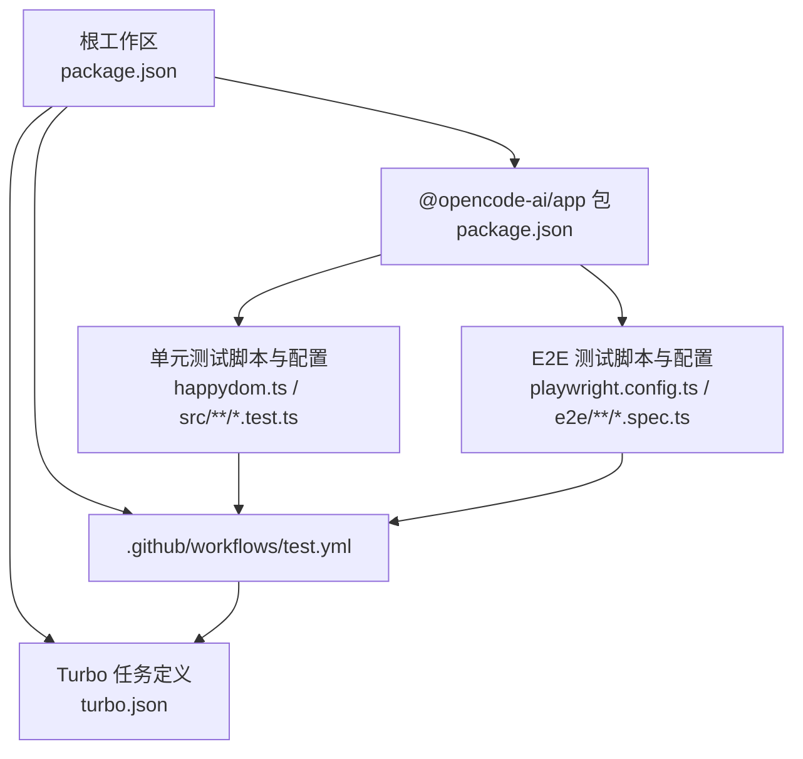
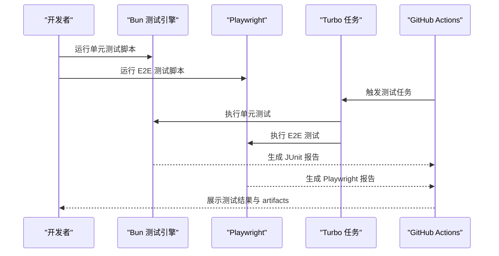
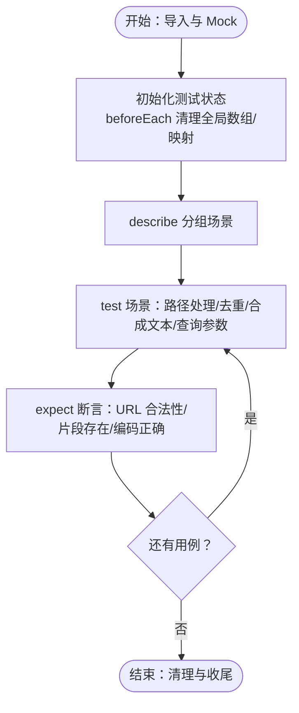
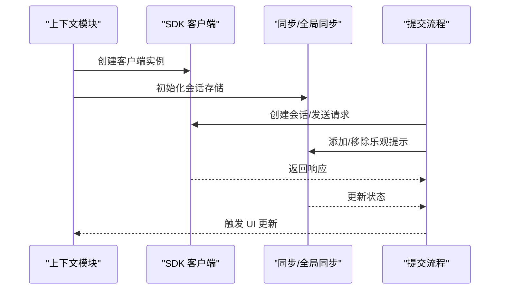
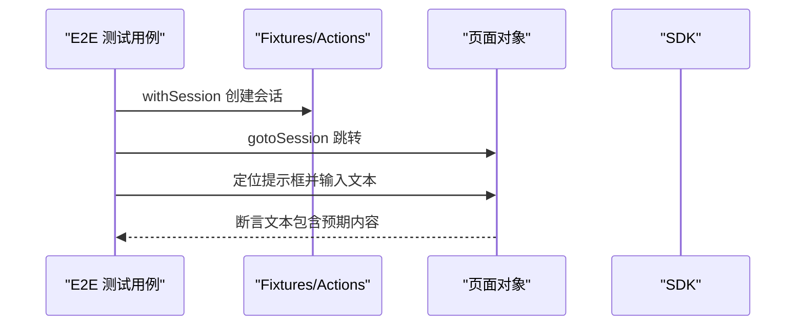
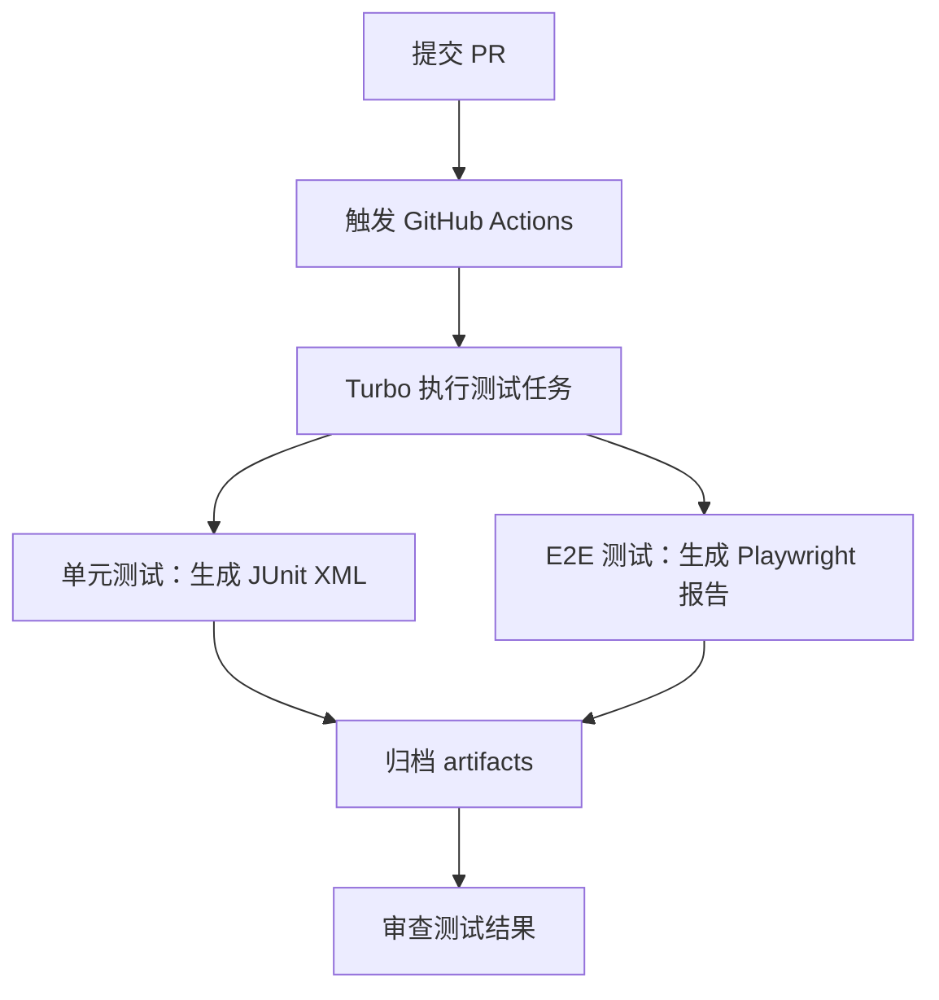
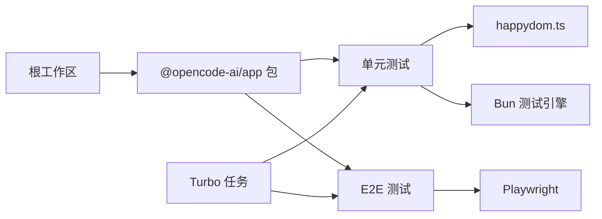

# 测试策略与实践

<cite>
**本文引用的文件**
- [package.json](file://package.json)
- [turbo.json](file://turbo.json)
- [.github/workflows/test.yml](file://.github/workflows/test.yml)
- [packages/app/package.json](file://packages/app/package.json)
- [packages/app/happydom.ts](file://packages/app/happydom.ts)
- [packages/app/playwright.config.ts](file://packages/app/playwright.config.ts)
- [packages/app/src/components/prompt-input/build-request-parts.test.ts](file://packages/app/src/components/prompt-input/build-request-parts.test.ts)
- [packages/app/src/components/prompt-input/submit.test.ts](file://packages/app/src/components/prompt-input/submit.test.ts)
- [packages/app/src/index.ts](file://packages/app/src/index.ts)
- [packages/app/e2e/app/session.spec.ts](file://packages/app/e2e/app/session.spec.ts)
</cite>

## 目录
1. [引言](#引言)
2. [项目结构](#项目结构)
3. [核心组件](#核心组件)
4. [架构总览](#架构总览)
5. [详细组件分析](#详细组件分析)
6. [依赖分析](#依赖分析)
7. [性能考虑](#性能考虑)
8. [故障排查指南](#故障排查指南)
9. [结论](#结论)
10. [附录](#附录)

## 引言
本指南系统化阐述 OpenCode 的测试体系与实践，覆盖单元测试、集成测试与端到端测试（E2E）的组织方式、编写方法与执行流程；说明测试环境搭建、测试数据准备、覆盖率要求与报告解读；并结合 CI/CD 流水线给出自动化测试的最佳实践，帮助开发者高效编写高质量测试。

## 项目结构
OpenCode 采用 Monorepo 结构，使用工作区管理多个包。测试相关能力主要分布在根级与应用包内：
- 根级 package.json 定义工作区与通用脚本，声明 Playwright 等测试依赖。
- 应用包 packages/app 提供单元测试与 E2E 测试的脚本、配置与用例。
- Turbo 构建缓存与任务编排为测试提供可重复、可扩展的执行环境。
- GitHub Actions 工作流负责流水线中的测试触发与产物归档。

图示来源
- [package.json:1-124](file://package.json#L1-L124)
- [turbo.json:1-32](file://turbo.json#L1-L32)
- [packages/app/package.json:1-78](file://packages/app/package.json#L1-L78)

章节来源
- [package.json:1-124](file://package.json#L1-L124)
- [turbo.json:1-32](file://turbo.json#L1-L32)
- [packages/app/package.json:1-78](file://packages/app/package.json#L1-L78)

## 核心组件
- 单元测试运行器：Bun 测试（bun test），通过预加载 happydom.ts 在无头浏览器环境中运行前端测试。
- E2E 测试框架：Playwright，提供跨浏览器与跨平台的端到端验证。
- 任务编排：Turbo，统一构建与测试任务的依赖关系与输出目录，支持 CI 中的 artifacts 归档。
- 工作区与依赖：根级 package.json 声明工作区与 catalog 依赖版本，确保测试工具链一致性。

章节来源
- [packages/app/package.json:17-25](file://packages/app/package.json#L17-L25)
- [packages/app/happydom.ts](file://packages/app/happydom.ts)
- [packages/app/playwright.config.ts](file://packages/app/playwright.config.ts)
- [turbo.json:11-29](file://turbo.json#L11-L29)
- [package.json:59](file://package.json#L59)

## 架构总览
下图展示从本地开发到 CI 的测试执行路径，以及各层组件之间的交互：

图示来源
- [packages/app/package.json:17-25](file://packages/app/package.json#L17-L25)
- [turbo.json:11-29](file://turbo.json#L11-L29)
- [.github/workflows/test.yml](file://.github/workflows/test.yml)

## 详细组件分析

### 单元测试：组织与编写
- 文件组织
  - 按功能模块划分测试文件，例如 prompt 输入相关逻辑位于 src/components/prompt-input/ 下，便于定位与维护。
  - 测试文件命名以 .test.ts 结尾，遵循 Bun 测试约定。
- 编写要点
  - 使用 mock 模块隔离外部依赖，模拟 SDK、上下文、路由等模块行为，确保测试稳定与可重复。
  - 使用 beforeAll/beforeEach 钩子初始化测试状态，避免跨用例污染。
  - 使用 describe/test 组织测试场景，断言覆盖关键分支与边界条件。
- 示例参考
  - 构建请求部件的测试：验证文本、文件、图片、代理等多类型输入的组合与去重逻辑，覆盖 Windows/Linux/macOS 路径差异与查询参数。
  - 提交流程测试：验证工作树选择、自动接受、乐观提示、会话提升等交互链路。
- 执行方式
  - 本地开发：使用 watch 模式快速反馈。
  - CI：生成 JUnit XML 报告，供流水线消费。

图示来源
- [packages/app/src/components/prompt-input/build-request-parts.test.ts:1-337](file://packages/app/src/components/prompt-input/build-request-parts.test.ts#L1-L337)

章节来源
- [packages/app/src/components/prompt-input/build-request-parts.test.ts:1-337](file://packages/app/src/components/prompt-input/build-request-parts.test.ts#L1-L337)
- [packages/app/src/components/prompt-input/submit.test.ts:1-347](file://packages/app/src/components/prompt-input/submit.test.ts#L1-L347)
- [packages/app/package.json:17-25](file://packages/app/package.json#L17-L25)

### 集成测试：多包环境下的协调
- 多包协作
  - 根级工作区统一管理依赖与版本，确保各包间 SDK、UI、Util 等共享模块的一致性。
  - Turbo 任务定义中，测试任务依赖构建输出，保证被测代码处于最新状态。
- 测试数据与上下文
  - 通过 mock 模块注入上下文（如模型、代理、权限、语言、平台等），在不启动真实后端的情况下完成集成验证。
  - 使用内存存储模拟会话与同步状态，确保跨模块交互的正确性。
- 最佳实践
  - 将跨包交互的关键路径纳入集成测试，例如 SDK 客户端创建、会话生命周期、乐观提示与全局同步联动。
  - 对关键业务流程进行端到端覆盖，减少仅在单元层遗漏的交互问题。

图示来源
- [packages/app/src/components/prompt-input/submit.test.ts:58-202](file://packages/app/src/components/prompt-input/submit.test.ts#L58-L202)

章节来源
- [turbo.json:11-29](file://turbo.json#L11-L29)
- [package.json:20-26](file://package.json#L20-L26)
- [packages/app/src/components/prompt-input/submit.test.ts:1-347](file://packages/app/src/components/prompt-input/submit.test.ts#L1-L347)

### 端到端测试：覆盖范围与实现
- 覆盖范围
  - 涵盖用户常见操作路径，如打开现有会话、在提示框中输入文本、切换工作区、面板与标签页操作等。
- 实现方式
  - 使用 Playwright 提供的 fixtures、selectors 与 actions，封装常用步骤（如 withSession、gotoSession）。
  - 通过 page 定位器与 expect 断言，验证 UI 行为与文本内容。
- 报告与回放
  - 支持生成 Playwright 报告并在本地 UI 中查看测试回放，便于问题定位。

图示来源
- [packages/app/e2e/app/session.spec.ts:1-17](file://packages/app/e2e/app/session.spec.ts#L1-L17)
- [packages/app/playwright.config.ts](file://packages/app/playwright.config.ts)

章节来源
- [packages/app/e2e/app/session.spec.ts:1-17](file://packages/app/e2e/app/session.spec.ts#L1-L17)
- [packages/app/package.json:21-24](file://packages/app/package.json#L21-L24)

### 测试环境搭建与数据准备
- 单元测试环境
  - 通过 happydom.ts 预加载，提供 DOM/Window 环境，满足前端组件与工具函数的运行需求。
  - 使用 Bun 测试引擎，无需额外配置即可运行。
- E2E 测试环境
  - Playwright 配置文件集中管理浏览器、超时、截图与视频等选项。
  - 可通过本地命令或流水线启动浏览器进行测试。
- 测试数据
  - 使用 mock 数据与内存存储模拟会话、上下文与附件，避免对真实后端的依赖。
  - 对于路径与编码场景，构造不同操作系统风格的路径与特殊字符，确保跨平台兼容。

章节来源
- [packages/app/happydom.ts](file://packages/app/happydom.ts)
- [packages/app/playwright.config.ts](file://packages/app/playwright.config.ts)
- [packages/app/src/components/prompt-input/build-request-parts.test.ts:1-337](file://packages/app/src/components/prompt-input/build-request-parts.test.ts#L1-L337)

### 测试覆盖率与报告解读
- 覆盖率
  - 当前仓库未显式配置覆盖率收集与阈值，请根据团队规范在 CI 中启用覆盖率统计，并设置语句/分支/函数/行覆盖率阈值。
- 报告
  - 单元测试在 CI 中生成 JUnit XML 报告，便于流水线解析与展示。
  - E2E 测试生成 Playwright 报告，支持本地查看与归档。
- 解读建议
  - 关注失败用例的断言点与调用栈，优先修复关键路径与高频路径。
  - 结合报告中的时间分布与失败趋势，识别潜在的性能瓶颈与回归风险。

章节来源
- [packages/app/package.json:18-19](file://packages/app/package.json#L18-L19)
- [turbo.json:16-29](file://turbo.json#L16-L29)

### CI/CD 中的测试自动化
- 触发与任务
  - GitHub Actions 工作流触发测试任务，Turbo 统一管理任务依赖与输出目录。
  - 根级 package.json 声明工作区与依赖版本，确保测试工具链一致。
- 输出与归档
  - 单元测试输出 JUnit XML 至 .artifacts/unit/junit.xml，供 CI 查看与归档。
  - E2E 测试生成 Playwright 报告，可在流水线中下载与分享。
- 最佳实践
  - 将测试任务加入 PR 检查项，确保每次变更均通过测试。
  - 对关键分支与发布前阶段增加 E2E 回归，降低线上风险。

图示来源
- [.github/workflows/test.yml](file://.github/workflows/test.yml)
- [turbo.json:11-29](file://turbo.json#L11-L29)
- [package.json:20-26](file://package.json#L20-L26)

章节来源
- [.github/workflows/test.yml](file://.github/workflows/test.yml)
- [turbo.json:11-29](file://turbo.json#L11-L29)
- [package.json:20-26](file://package.json#L20-L26)

## 依赖分析
- 组件耦合
  - 单元测试通过 mock 降低对外部模块的耦合，提高稳定性与可维护性。
  - E2E 测试依赖 Playwright 与页面定位器，关注选择器健壮性与页面结构变化。
- 间接依赖
  - 根级工作区统一版本，避免不同包间的依赖冲突。
  - Turbo 任务定义确保测试在构建完成后执行，减少因未构建导致的失败。
- 循环依赖
  - 测试文件通过模块导入与 mock 注入，避免直接循环依赖主业务代码。

图示来源
- [packages/app/happydom.ts](file://packages/app/happydom.ts)
- [packages/app/playwright.config.ts](file://packages/app/playwright.config.ts)
- [turbo.json:11-29](file://turbo.json#L11-L29)
- [package.json:20-26](file://package.json#L20-L26)

章节来源
- [turbo.json:11-29](file://turbo.json#L11-L29)
- [package.json:20-26](file://package.json#L20-L26)

## 性能考虑
- 测试执行效率
  - 使用 Turbo 缓存构建与测试输出，缩短重复执行时间。
  - 单元测试尽量使用内存数据与轻量 mock，避免昂贵的 I/O 或网络请求。
- 并发与隔离
  - 将独立用例拆分为小而快的测试，减少相互影响。
  - 使用 beforeEach 清理全局状态，防止用例间共享状态导致的抖动。
- 报告与可视化
  - 在 CI 中生成并归档报告，便于快速定位耗时用例与失败热点。

## 故障排查指南
- 常见问题
  - 测试失败由外部依赖变化引起：检查 mock 是否覆盖了新增接口或字段。
  - 路径与编码问题：针对 Windows/Linux/macOS 的路径差异补充用例，确保 URL 正常解析且编码正确。
  - E2E 页面元素定位不稳定：优化选择器，避免脆弱的文本匹配，优先使用稳定的数据属性或可访问名称。
- 定位手段
  - 查看 JUnit/Playwright 报告中的失败截图与日志。
  - 在本地使用 --ui 或 --watch 模式复现问题，逐步缩小范围。
- 回归预防
  - 将已知边界条件与错误场景纳入测试集，形成稳定的回归用例库。

## 结论
OpenCode 的测试体系以 Bun 单元测试与 Playwright E2E 为核心，配合 Turbo 任务编排与根级工作区管理，实现了可扩展、可重复的测试执行。通过 mock 隔离与多包协作，既能覆盖复杂业务流程，又能保持测试的稳定性与可维护性。建议在 CI 中完善覆盖率与报告归档，并持续扩充端到端场景，以保障交付质量。

## 附录
- 快速上手
  - 单元测试：在应用包内运行测试脚本，使用 watch 模式提升迭代速度。
  - E2E 测试：使用本地命令或流水线运行，查看报告并定位问题。
- 参考入口
  - 应用包测试脚本与配置：[packages/app/package.json:17-25](file://packages/app/package.json#L17-L25)，[packages/app/playwright.config.ts](file://packages/app/playwright.config.ts)
  - 根级工作区与依赖：[package.json:20-26](file://package.json#L20-L26)
  - Turbo 任务定义：[turbo.json:11-29](file://turbo.json#L11-L29)
  - 单元测试示例：[build-request-parts.test.ts:1-337](file://packages/app/src/components/prompt-input/build-request-parts.test.ts#L1-L337)，[submit.test.ts:1-347](file://packages/app/src/components/prompt-input/submit.test.ts#L1-L347)
  - E2E 示例：[session.spec.ts:1-17](file://packages/app/e2e/app/session.spec.ts#L1-L17)