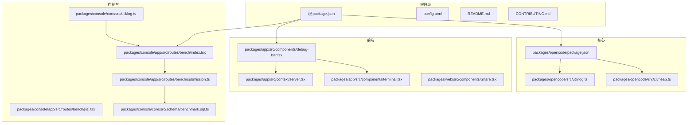
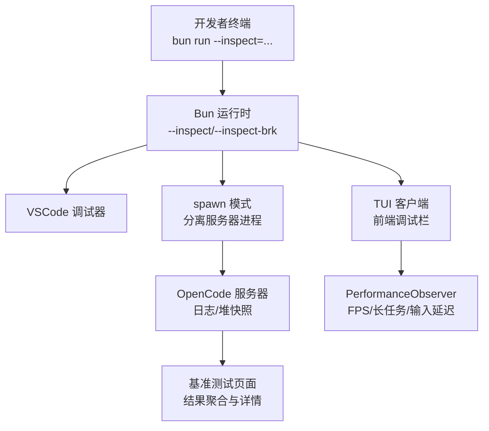
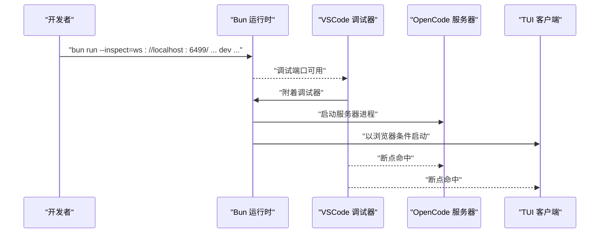
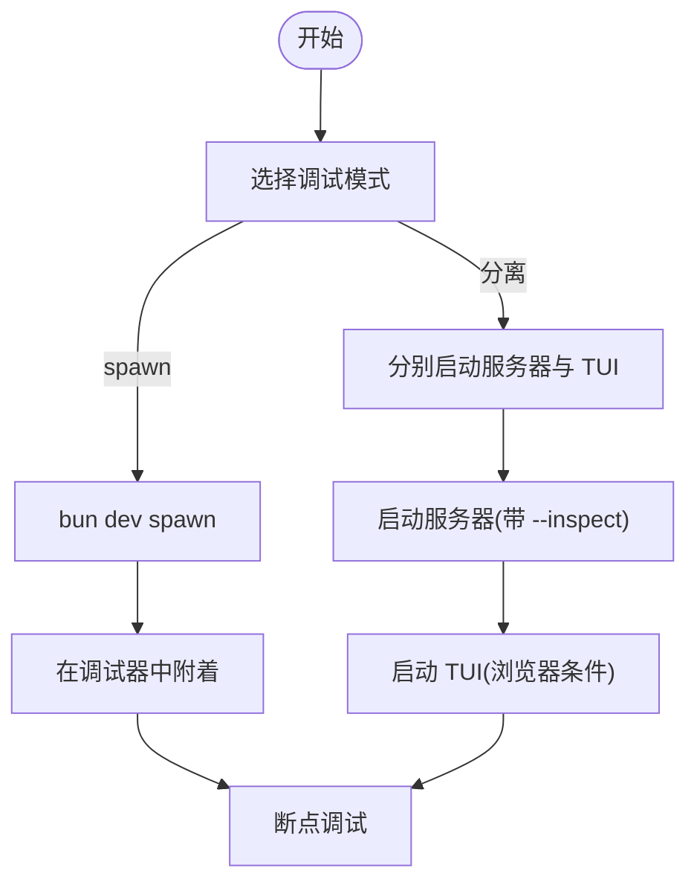
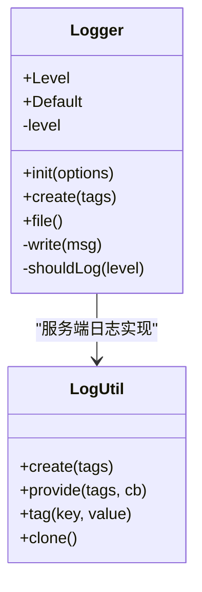
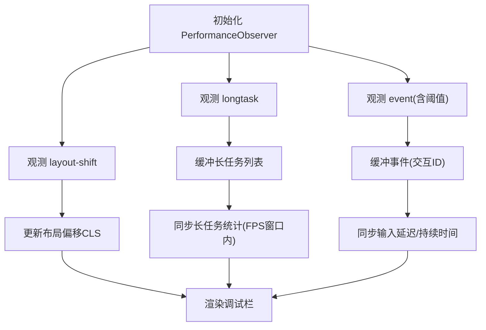
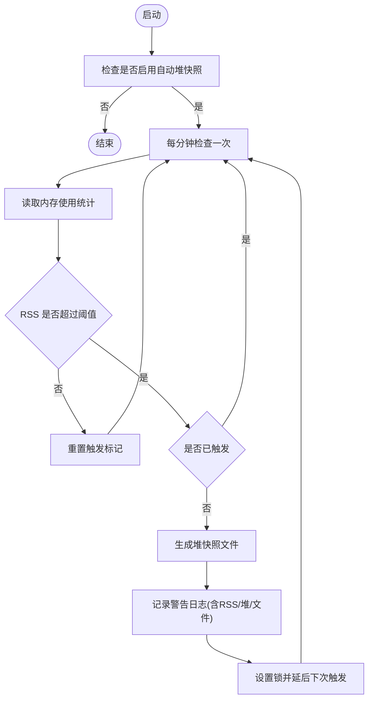
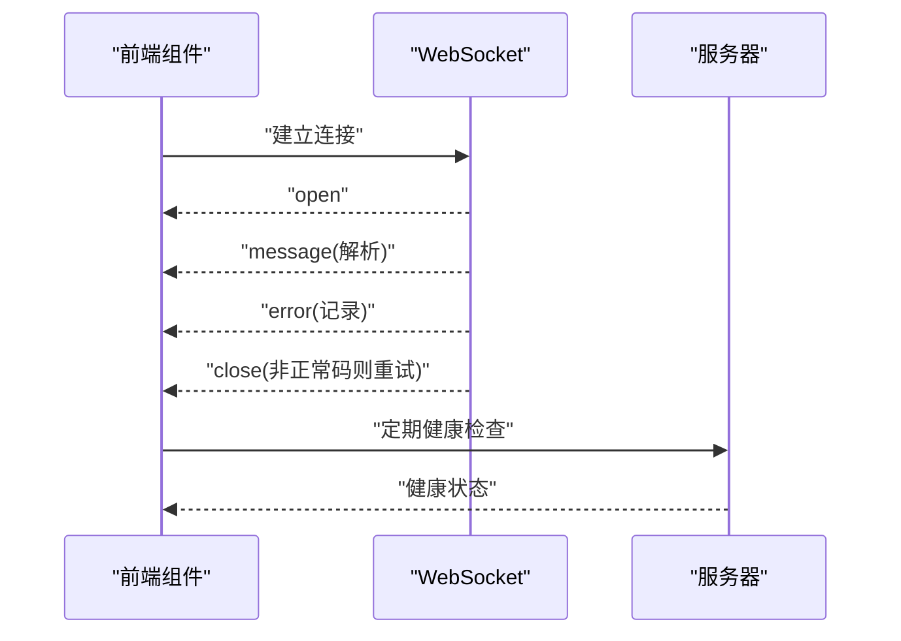
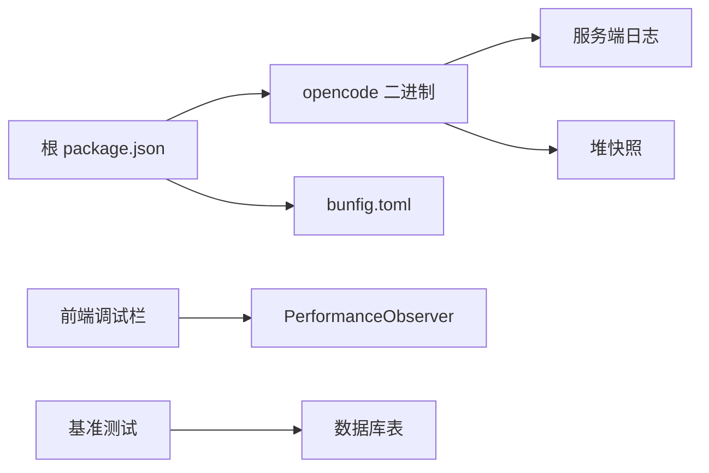

# 调试与性能分析

<cite>
**本文引用的文件**
- [README.md](file://README.md)
- [CONTRIBUTING.md](file://CONTRIBUTING.md)
- [bunfig.toml](file://bunfig.toml)
- [packages/opencode/package.json](file://packages/opencode/package.json)
- [packages/opencode/src/util/log.ts](file://packages/opencode/src/util/log.ts)
- [packages/console/core/src/util/log.ts](file://packages/console/core/src/util/log.ts)
- [packages/opencode/src/cli/heap.ts](file://packages/opencode/src/cli/heap.ts)
- [packages/app/src/components/debug-bar.tsx](file://packages/app/src/components/debug-bar.tsx)
- [packages/console/app/src/routes/bench/index.tsx](file://packages/console/app/src/routes/bench/index.tsx)
- [packages/console/app/src/routes/bench/[id].tsx](file://packages/console/app/src/routes/bench/[id].tsx)
- [packages/console/app/src/routes/bench/submission.ts](file://packages/console/app/src/routes/bench/submission.ts)
- [packages/console/core/src/schema/benchmark.sql.ts](file://packages/console/core/src/schema/benchmark.sql.ts)
- [packages/app/src/context/server.tsx](file://packages/app/src/context/server.tsx)
- [packages/app/src/components/terminal.tsx](file://packages/app/src/components/terminal.tsx)
- [packages/web/src/components/Share.tsx](file://packages/web/src/components/Share.tsx)
</cite>

## 目录
1. [简介](#简介)
2. [项目结构](#项目结构)
3. [核心组件](#核心组件)
4. [架构总览](#架构总览)
5. [详细组件分析](#详细组件分析)
6. [依赖关系分析](#依赖关系分析)
7. [性能考量](#性能考量)
8. [故障排查指南](#故障排查指南)
9. [结论](#结论)
10. [附录](#附录)

## 简介
本指南面向 OpenCode 开发者，聚焦于开发过程中的调试与性能分析实践。内容涵盖：
- 使用 Bun 调试器进行断点调试，包括 --inspect 参数配置、断点设置与断点映射问题处理
- 多进程调试策略：服务器与 TUI 分离调试、spawn 模式与独立调试流程
- 性能分析工具与指标：内存使用监控、执行时间分析、长任务检测、帧率与卡顿统计
- 日志系统与调试信息获取：服务端日志初始化、标签化日志、堆快照触发
- 常见调试场景与解决方案：启动问题、连接问题、性能瓶颈定位
- 实际调试示例与性能优化案例路径指引，帮助快速定位与解决问题

## 项目结构
OpenCode 采用多包（monorepo）组织方式，核心开发与调试涉及以下关键模块：
- packages/opencode：核心业务逻辑与服务器
- packages/app：共享 Web UI 组件（SolidJS）
- packages/console：控制台应用与基准测试数据存储
- packages/web：Web 端组件（会话分享等）
- 根目录脚本与配置：bunfig.toml、package.json、README、CONTRIBUTING

**图表来源**
- [packages/opencode/package.json:1-164](file://packages/opencode/package.json#L1-L164)
- [packages/opencode/src/util/log.ts:1-183](file://packages/opencode/src/util/log.ts#L1-L183)
- [packages/opencode/src/cli/heap.ts:1-60](file://packages/opencode/src/cli/heap.ts#L1-L60)
- [packages/app/src/components/debug-bar.tsx:1-443](file://packages/app/src/components/debug-bar.tsx#L1-L443)
- [packages/app/src/context/server.tsx:143-188](file://packages/app/src/context/server.tsx#L143-L188)
- [packages/app/src/components/terminal.tsx:537-595](file://packages/app/src/components/terminal.tsx#L537-L595)
- [packages/web/src/components/Share.tsx:113-153](file://packages/web/src/components/Share.tsx#L113-L153)
- [packages/console/app/src/routes/bench/index.tsx:1-48](file://packages/console/app/src/routes/bench/index.tsx#L1-L48)
- [packages/console/app/src/routes/bench/[id].tsx](file://packages/console/app/src/routes/bench/[id].tsx#L74-L106)
- [packages/console/app/src/routes/bench/submission.ts:1-32](file://packages/console/app/src/routes/bench/submission.ts#L1-L32)
- [packages/console/core/src/schema/benchmark.sql.ts:1-14](file://packages/console/core/src/schema/benchmark.sql.ts#L1-L14)

**章节来源**
- [README.md:1-142](file://README.md#L1-L142)
- [CONTRIBUTING.md:32-188](file://CONTRIBUTING.md#L32-L188)
- [bunfig.toml:1-7](file://bunfig.toml#L1-L7)
- [packages/opencode/package.json:1-164](file://packages/opencode/package.json#L1-L164)

## 核心组件
- Bun 调试与断点
  - 推荐使用手动终端运行并附着调试器的方式，避免断点映射错误
  - spawn 模式用于在独立进程中运行服务器以确保断点生效
  - 可通过环境变量或 BUN_OPTIONS 预设 --inspect 参数，提升调试效率
- 日志系统
  - 服务端日志：支持级别过滤、标签化输出、时间戳与增量时间记录、文件落盘与轮转
  - 控制台日志：上下文标签化日志封装，便于跨模块追踪
- 性能监控
  - 前端调试栏：基于 PerformanceObserver 的 FPS、长任务、输入延迟、布局偏移、内存占用统计
  - 基准测试：控制台页面展示平均耗时、评分、成本与任务详情
- 内存快照
  - RSS 超限时自动触发 v8 堆快照，便于定位内存泄漏与异常增长

**章节来源**
- [CONTRIBUTING.md:158-188](file://CONTRIBUTING.md#L158-L188)
- [packages/opencode/src/util/log.ts:1-183](file://packages/opencode/src/util/log.ts#L1-L183)
- [packages/console/core/src/util/log.ts:1-55](file://packages/console/core/src/util/log.ts#L1-L55)
- [packages/app/src/components/debug-bar.tsx:1-443](file://packages/app/src/components/debug-bar.tsx#L1-L443)
- [packages/console/app/src/routes/bench/index.tsx:1-48](file://packages/console/app/src/routes/bench/index.tsx#L1-L48)
- [packages/console/app/src/routes/bench/[id].tsx:74-L106](file://packages/console/app/src/routes/bench/[id].tsx#L74-L106)
- [packages/opencode/src/cli/heap.ts:1-60](file://packages/opencode/src/cli/heap.ts#L1-L60)

## 架构总览
下图展示了调试与性能分析在系统中的位置与交互：

**图表来源**
- [CONTRIBUTING.md:158-188](file://CONTRIBUTING.md#L158-L188)
- [packages/opencode/src/util/log.ts:1-183](file://packages/opencode/src/util/log.ts#L1-L183)
- [packages/opencode/src/cli/heap.ts:1-60](file://packages/opencode/src/cli/heap.ts#L1-L60)
- [packages/app/src/components/debug-bar.tsx:1-443](file://packages/app/src/components/debug-bar.tsx#L1-L443)
- [packages/console/app/src/routes/bench/index.tsx:1-48](file://packages/console/app/src/routes/bench/index.tsx#L1-L48)

## 详细组件分析

### Bun 调试器与断点设置
- 最可靠方式
  - 在终端中使用带 --inspect 的命令手动启动，然后在调试器中附着该 URL
  - 避免某些 IDE 启动配置导致断点映射错误
- spawn 模式
  - 若常规 dev 在 worker 线程中运行导致断点不生效，可改用 spawn
- 分离调试
  - 服务器与 TUI 分别调试：先启动服务器，再以浏览器条件运行 TUI
- 环境变量优化
  - 可将 --inspect 参数写入 BUN_OPTIONS 或 export，减少重复输入

**图表来源**
- [CONTRIBUTING.md:158-188](file://CONTRIBUTING.md#L158-L188)

**章节来源**
- [CONTRIBUTING.md:158-188](file://CONTRIBUTING.md#L158-L188)

### 多进程调试策略
- 服务器与 TUI 分离
  - 先启动服务器：指定端口与 inspect 地址
  - 再以浏览器条件运行 TUI，并通过 attach 连接服务器
- spawn 模式优先
  - 当 dev 在 worker 中运行导致断点无效时，使用 spawn

**图表来源**
- [CONTRIBUTING.md:167-172](file://CONTRIBUTING.md#L167-L172)

**章节来源**
- [CONTRIBUTING.md:167-172](file://CONTRIBUTING.md#L167-L172)

### 断点映射与连接问题处理
- 问题现象
  - 某些 IDE 启动配置或 JavaScript Debug Terminal 可能导致断点映射错误
- 解决方案
  - 使用手动终端命令 + 调试器附着的方式
  - 如仍失败，尝试 spawn 或分离调试

**章节来源**
- [CONTRIBUTING.md:183-187](file://CONTRIBUTING.md#L183-L187)

### 日志系统与调试信息获取
- 服务端日志
  - 支持 DEBUG/INFO/WARN/ERROR 四级过滤
  - 输出包含时间戳、相对增量时间、标签键值对
  - 可选择打印到标准错误或写入文件，自动清理旧日志
  - 提供 time 计时器，自动记录开始与完成事件
- 控制台日志
  - 基于上下文标签化封装，便于跨模块追踪

**图表来源**
- [packages/opencode/src/util/log.ts:1-183](file://packages/opencode/src/util/log.ts#L1-L183)
- [packages/console/core/src/util/log.ts:1-55](file://packages/console/core/src/util/log.ts#L1-L55)

**章节来源**
- [packages/opencode/src/util/log.ts:1-183](file://packages/opencode/src/util/log.ts#L1-L183)
- [packages/console/core/src/util/log.ts:1-55](file://packages/console/core/src/util/log.ts#L1-L55)

### 性能分析工具与指标
- 前端调试栏（DebugBar）
  - 指标：FPS、最大帧耗时、卡顿数量、长任务累计时长与数量、输入事件延迟与持续时间、布局偏移、内存占用比例
  - 通过 PerformanceObserver 观测 layout-shift、longtask、event 等条目
- 基准测试（Bench）
  - 展示模型与代理组合的平均耗时、平均评分、平均成本
  - 详情页按任务维度展示平均耗时与评分

**图表来源**
- [packages/app/src/components/debug-bar.tsx:237-296](file://packages/app/src/components/debug-bar.tsx#L237-L296)

**章节来源**
- [packages/app/src/components/debug-bar.tsx:1-443](file://packages/app/src/components/debug-bar.tsx#L1-L443)
- [packages/console/app/src/routes/bench/index.tsx:1-48](file://packages/console/app/src/routes/bench/index.tsx#L1-L48)
- [packages/console/app/src/routes/bench/[id].tsx:74-L106](file://packages/console/app/src/routes/bench/[id].tsx#L74-L106)

### 内存使用监控与堆快照
- 自动堆快照
  - 当 RSS 超过阈值时，定时检查并触发 v8 堆快照生成
  - 快照文件名包含进程 ID 与时间戳，便于定位与对比
- 日志记录
  - 记录当前 RSS 与堆使用量，以及快照文件路径
  - 失败时记录错误信息

**图表来源**
- [packages/opencode/src/cli/heap.ts:16-58](file://packages/opencode/src/cli/heap.ts#L16-L58)

**章节来源**
- [packages/opencode/src/cli/heap.ts:1-60](file://packages/opencode/src/cli/heap.ts#L1-L60)

### 连接与健康检查
- WebSocket 连接
  - 终端组件监听 open/message/error/close 事件，异常关闭时记录错误并重试
  - Web 组件解析消息键空间，区分会话信息、消息与部分更新
- 健康检查
  - 服务端连接上下文定期轮询健康状态，避免并发重复检查

**图表来源**
- [packages/app/src/components/terminal.tsx:537-595](file://packages/app/src/components/terminal.tsx#L537-L595)
- [packages/web/src/components/Share.tsx:113-153](file://packages/web/src/components/Share.tsx#L113-L153)
- [packages/app/src/context/server.tsx:143-188](file://packages/app/src/context/server.tsx#L143-L188)

**章节来源**
- [packages/app/src/components/terminal.tsx:537-595](file://packages/app/src/components/terminal.tsx#L537-L595)
- [packages/web/src/components/Share.tsx:113-153](file://packages/web/src/components/Share.tsx#L113-L153)
- [packages/app/src/context/server.tsx:143-188](file://packages/app/src/context/server.tsx#L143-L188)

## 依赖关系分析
- 包管理与脚本
  - 根 package.json 提供统一脚本入口，opencode 包导出二进制入口
- 调试配置
  - bunfig.toml 设置安装行为与测试根目录，影响开发体验
- 日志与性能
  - 服务端日志与控制台日志分别服务于不同模块；前端调试栏与基准测试页面为性能观测提供可视化入口

**图表来源**
- [packages/opencode/package.json:24-26](file://packages/opencode/package.json#L24-L26)
- [bunfig.toml:1-7](file://bunfig.toml#L1-L7)
- [packages/opencode/src/util/log.ts:1-183](file://packages/opencode/src/util/log.ts#L1-L183)
- [packages/opencode/src/cli/heap.ts:1-60](file://packages/opencode/src/cli/heap.ts#L1-L60)
- [packages/app/src/components/debug-bar.tsx:1-443](file://packages/app/src/components/debug-bar.tsx#L1-L443)
- [packages/console/core/src/schema/benchmark.sql.ts:1-14](file://packages/console/core/src/schema/benchmark.sql.ts#L1-L14)

**章节来源**
- [packages/opencode/package.json:1-164](file://packages/opencode/package.json#L1-L164)
- [bunfig.toml:1-7](file://bunfig.toml#L1-L7)

## 性能考量
- 前端性能
  - 使用 PerformanceObserver 监控长任务与输入事件，结合 FPS 与卡顿统计识别 UI 卡顿瓶颈
  - 布局偏移（CLS）与内存占用比例有助于发现渲染与内存问题
- 服务端性能
  - 利用日志计时器记录关键操作的耗时，辅助定位慢点
  - RSS 超限时自动堆快照，便于深入分析内存增长与泄漏
- 基准测试
  - 通过控制台页面汇总平均耗时、评分与成本，形成可复现的性能基线

**章节来源**
- [packages/app/src/components/debug-bar.tsx:1-443](file://packages/app/src/components/debug-bar.tsx#L1-L443)
- [packages/opencode/src/util/log.ts:157-173](file://packages/opencode/src/util/log.ts#L157-L173)
- [packages/opencode/src/cli/heap.ts:16-58](file://packages/opencode/src/cli/heap.ts#L16-L58)
- [packages/console/app/src/routes/bench/index.tsx:1-48](file://packages/console/app/src/routes/bench/index.tsx#L1-L48)

## 故障排查指南
- 启动问题
  - 确认 Bun 版本满足要求，使用根目录安装依赖后执行 dev
  - 若 dev 在 worker 中运行导致断点无效，改用 spawn
- 连接问题
  - 终端组件与 Web 组件均记录 WebSocket 错误与异常关闭原因
  - 健康检查轮询避免并发重复请求，关注非 1000 关闭码
- 性能瓶颈
  - 使用前端调试栏观察 FPS、长任务、输入延迟与内存占用
  - 通过基准测试页面对比不同模型/代理组合的平均耗时与评分
  - 服务端日志记录关键操作耗时，必要时开启更细粒度日志级别

**章节来源**
- [CONTRIBUTING.md:32-95](file://CONTRIBUTING.md#L32-L95)
- [packages/app/src/components/terminal.tsx:537-595](file://packages/app/src/components/terminal.tsx#L537-L595)
- [packages/web/src/components/Share.tsx:113-153](file://packages/web/src/components/Share.tsx#L113-L153)
- [packages/app/src/context/server.tsx:143-188](file://packages/app/src/context/server.tsx#L143-L188)
- [packages/console/app/src/routes/bench/index.tsx:1-48](file://packages/console/app/src/routes/bench/index.tsx#L1-L48)

## 结论
通过规范的 Bun 调试流程、完善的日志体系与前端性能观测工具，开发者可以高效定位与解决 OpenCode 开发过程中的断点映射、连接与性能问题。配合自动堆快照与基准测试页面，能够形成从问题发现到验证修复的闭环。

## 附录
- 实际调试示例与性能优化案例路径
  - Bun 调试与断点设置：参见 [CONTRIBUTING.md:158-188](file://CONTRIBUTING.md#L158-L188)
  - 服务端日志初始化与计时：参见 [packages/opencode/src/util/log.ts:60-78](file://packages/opencode/src/util/log.ts#L60-L78)、[packages/opencode/src/util/log.ts:157-173](file://packages/opencode/src/util/log.ts#L157-L173)
  - 前端调试栏指标采集：参见 [packages/app/src/components/debug-bar.tsx:237-296](file://packages/app/src/components/debug-bar.tsx#L237-L296)
  - 基准测试数据结构：参见 [packages/console/core/src/schema/benchmark.sql.ts:1-14](file://packages/console/core/src/schema/benchmark.sql.ts#L1-L14)
  - 自动堆快照触发：参见 [packages/opencode/src/cli/heap.ts:16-58](file://packages/opencode/src/cli/heap.ts#L16-L58)