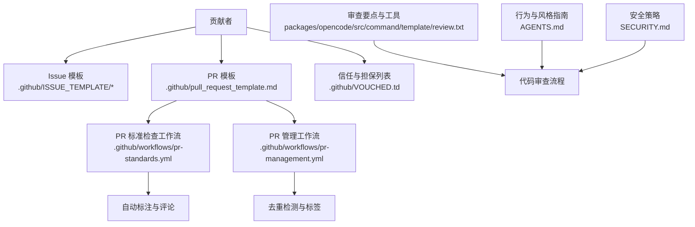
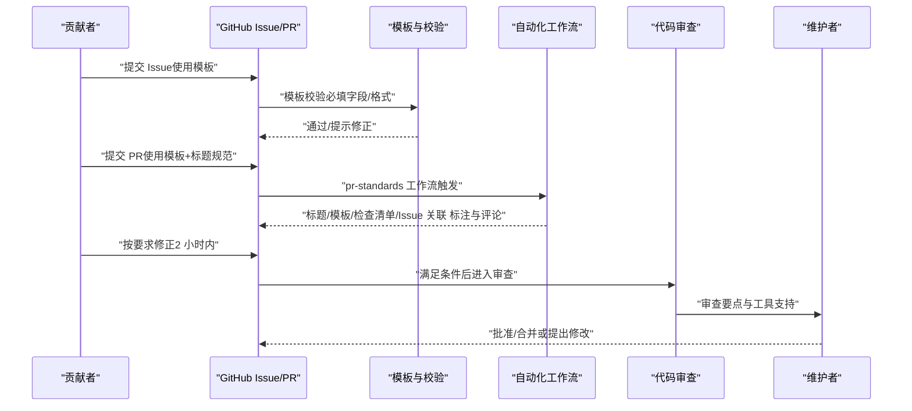
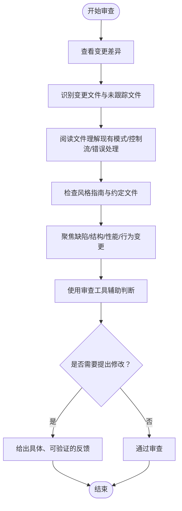
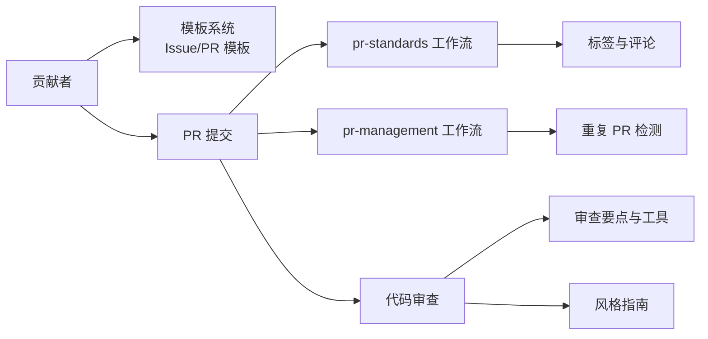

# 贡献流程与协作

<cite>
**本文引用的文件**
- [CONTRIBUTING.md](file://CONTRIBUTING.md)
- [.github/pull_request_template.md](file://.github/pull_request_template.md)
- [.github/ISSUE_TEMPLATE/bug-report.yml](file://.github/ISSUE_TEMPLATE/bug-report.yml)
- [.github/ISSUE_TEMPLATE/feature-request.yml](file://.github/ISSUE_TEMPLATE/feature-request.yml)
- [.github/ISSUE_TEMPLATE/question.yml](file://.github/ISSUE_TEMPLATE/question.yml)
- [.github/ISSUE_TEMPLATE/config.yml](file://.github/ISSUE_TEMPLATE/config.yml)
- [.github/VOUCHED.td](file://.github/VOUCHED.td)
- [.github/workflows/pr-standards.yml](file://.github/workflows/pr-standards.yml)
- [.github/workflows/pr-management.yml](file://.github/workflows/pr-management.yml)
- [packages/opencode/src/command/template/review.txt](file://packages/opencode/src/command/template/review.txt)
- [AGENTS.md](file://AGENTS.md)
- [SECURITY.md](file://SECURITY.md)
- [README.md](file://README.md)
</cite>

## 目录
1. 引言
2. 项目结构
3. 核心组件
4. 架构总览
5. 详细组件分析
6. 依赖分析
7. 性能考虑
8. 故障排查指南
9. 结论
10. 附录

## 引言
本指南面向希望参与 OpenCode 开源协作的贡献者，系统化阐述从问题提交到合并的全流程规范，涵盖 Issue 模板与描述要求、Pull Request 创建与管理、代码审查标准与流程、信任与担保（vouch）机制、功能请求的设计前置流程、社区行为准则与沟通规范，并提供可操作的最佳实践与示例路径，帮助新贡献者快速融入社区。

## 项目结构
OpenCode 的贡献相关机制主要分布在以下位置：
- 贡献与开发指南：根目录 CONTRIBUTING.md
- PR 模板：.github/pull_request_template.md
- Issue 模板：.github/ISSUE_TEMPLATE 下的 bug-report.yml、feature-request.yml、question.yml 及 config.yml
- 信任与担保列表：.github/VOUCHED.td
- 自动化校验与管理：.github/workflows 下的 pr-standards.yml、pr-management.yml
- 审查要点与工具：packages/opencode/src/command/template/review.txt
- 行为与安全：AGENTS.md、SECURITY.md
- 社区入口与链接：README.md

图表来源
- [.github/ISSUE_TEMPLATE/bug-report.yml:1-68](file://.github/ISSUE_TEMPLATE/bug-report.yml#L1-L68)
- [.github/ISSUE_TEMPLATE/feature-request.yml:1-21](file://.github/ISSUE_TEMPLATE/feature-request.yml#L1-L21)
- [.github/ISSUE_TEMPLATE/question.yml:1-12](file://.github/ISSUE_TEMPLATE/question.yml#L1-L12)
- [.github/ISSUE_TEMPLATE/config.yml:1-6](file://.github/ISSUE_TEMPLATE/config.yml#L1-L6)
- [.github/pull_request_template.md:1-30](file://.github/pull_request_template.md#L1-L30)
- [.github/workflows/pr-standards.yml:1-352](file://.github/workflows/pr-standards.yml#L1-L352)
- [.github/workflows/pr-management.yml:1-96](file://.github/workflows/pr-management.yml#L1-L96)
- [.github/VOUCHED.td:1-32](file://.github/VOUCHED.td#L1-L32)
- [packages/opencode/src/command/template/review.txt:36-88](file://packages/opencode/src/command/template/review.txt#L36-L88)
- [AGENTS.md:1-129](file://AGENTS.md#L1-L129)
- [SECURITY.md:1-48](file://SECURITY.md#L1-L48)

章节来源
- [README.md:119-122](file://README.md#L119-L122)

## 核心组件
- Issue 模板与描述要求：必须使用模板，禁止空白 Issue；模板覆盖缺陷报告、功能请求、提问三类，分别对必填字段进行约束。
- PR 模板与标题规范：PR 必须遵循 Conventional Commits 格式，且需关联现有 Issue；模板强制包含“变更类型”“做了什么”“如何验证”“截图/录屏”“检查清单”等模块。
- 自动化校验与管理：通过 GitHub Actions 对 PR 标题、Issue 关联、模板完整性、检查清单等进行自动检查与标注，必要时给出 2 小时整改期。
- 信任与担保（vouch）系统：基于 vouch 列表管理受信任贡献者与被禁用户，维护社区协作质量与安全。
- 审查要点与工具：提供结构化审查清单、关注点与辅助工具，确保审查聚焦于逻辑错误、结构适配性、性能与行为变更。
- 行为与安全：明确 AI 生成内容不接受、威胁模型与安全披露流程，保障社区健康与项目安全。

章节来源
- [CONTRIBUTING.md:294-312](file://CONTRIBUTING.md#L294-L312)
- [.github/pull_request_template.md:1-30](file://.github/pull_request_template.md#L1-L30)
- [.github/workflows/pr-standards.yml:86-153](file://.github/workflows/pr-standards.yml#L86-L153)
- [.github/VOUCHED.td:1-32](file://.github/VOUCHED.td#L1-L32)
- [packages/opencode/src/command/template/review.txt:36-88](file://packages/opencode/src/command/template/review.txt#L36-L88)
- [SECURITY.md:1-48](file://SECURITY.md#L1-L48)

## 架构总览
下图展示贡献流程的关键参与者与自动化检查节点：

图表来源
- [.github/ISSUE_TEMPLATE/config.yml:1-6](file://.github/ISSUE_TEMPLATE/config.yml#L1-L6)
- [.github/pull_request_template.md:1-30](file://.github/pull_request_template.md#L1-L30)
- [.github/workflows/pr-standards.yml:1-352](file://.github/workflows/pr-standards.yml#L1-L352)
- [packages/opencode/src/command/template/review.txt:36-88](file://packages/opencode/src/command/template/review.txt#L36-L88)

## 详细组件分析

### Issue 提交流程与模板使用
- 模板类别与用途
  - 缺陷报告：用于报告需要修复的问题，模板包含描述、插件、版本、复现步骤、截图/分享链接、操作系统、终端等字段。
  - 功能请求：用于建议增强或新特性，模板要求验证“未被提议过”，并提供详细增强描述。
  - 提问：用于一般咨询，模板要求填写具体问题。
  - 模板配置：禁止空白 Issue，开启模板后由机器人自动校验。
- 描述要求
  - 必须使用模板，不得留空；模板中带“required: true”的字段必须填写。
  - 自动检查会识别缺失字段、占位符文本、AI 生成长文、无意义内容等，不符合要求的 Issue 将在 2 小时内被关闭。
- 与 PR 的关系
  - PR 必须关联现有 Issue；对于文档/重构/特性类 PR，标题允许跳过 Issue 关联检查，但仍需遵循其他规范。

章节来源
- [.github/ISSUE_TEMPLATE/bug-report.yml:1-68](file://.github/ISSUE_TEMPLATE/bug-report.yml#L1-L68)
- [.github/ISSUE_TEMPLATE/feature-request.yml:1-21](file://.github/ISSUE_TEMPLATE/feature-request.yml#L1-L21)
- [.github/ISSUE_TEMPLATE/question.yml:1-12](file://.github/ISSUE_TEMPLATE/question.yml#L1-L12)
- [.github/ISSUE_TEMPLATE/config.yml:1-6](file://.github/ISSUE_TEMPLATE/config.yml#L1-L6)
- [CONTRIBUTING.md:294-312](file://CONTRIBUTING.md#L294-L312)

### Pull Request 创建与管理流程
- 标题规范（Conventional Commits）
  - 类型前缀：feat、fix、docs、chore、refactor、test，可选作用域（如 app、desktop、opencode）。
  - 示例：feat(app): 添加深色模式支持；fix(desktop): 修复启动崩溃；chore: 升级依赖版本。
- 描述与模板
  - 使用统一 PR 模板，必须包含：Issue 链接、变更类型、做了什么、如何验证、截图/录屏、检查清单。
  - 模板强制字段与检查清单项将由 pr-standards 工作流自动校验。
- 自动化检查与标签
  - pr-standards：校验标题格式、是否关联 Issue、模板完整性、检查清单、占位符与空内容等；不符合将打上 needs:* 标签并评论指导修正；2 小时内未修正将自动关闭。
  - pr-management：检测重复 PR、为“CONTRIBUTOR”身份的作者添加标签、安装运行环境以执行脚本。
- 合并与后续
  - 通过检查后进入审查阶段；审查要点见“代码审查的标准与流程”。

章节来源
- [CONTRIBUTING.md:190-262](file://CONTRIBUTING.md#L190-L262)
- [.github/pull_request_template.md:1-30](file://.github/pull_request_template.md#L1-L30)
- [.github/workflows/pr-standards.yml:86-153](file://.github/workflows/pr-standards.yml#L86-L153)
- [.github/workflows/pr-standards.yml:155-352](file://.github/workflows/pr-standards.yml#L155-L352)
- [.github/workflows/pr-management.yml:1-96](file://.github/workflows/pr-management.yml#L1-L96)

### 代码审查的标准与流程
- 审查关注点
  - 缺陷优先：逻辑错误、边界条件、异常处理、安全性（注入、鉴权绕过、数据暴露）。
  - 结构适配：是否符合现有模式与约定；是否存在可复用抽象未使用；嵌套过深等问题。
  - 性能：明显问题才标记（如 O(n²)、N+1 查询、热路径阻塞 I/O）。
  - 行为变更：引入行为变化需特别指出（尤其是可能非预期）。
- 审查原则
  - 确信后再标记；仅审查变更部分；避免教条式风格问题；必要时借助工具探索既有实现与最佳实践。
- 审查工具
  - 探索代理：查找既有模式与先例。
  - Exa Code 上下文：验证库/API 正确使用。
  - Exa Web 搜索：研究最佳实践。

图表来源
- [packages/opencode/src/command/template/review.txt:36-88](file://packages/opencode/src/command/template/review.txt#L36-L88)

章节来源
- [packages/opencode/src/command/template/review.txt:36-88](file://packages/opencode/src/command/template/review.txt#L36-L88)

### 信任与担保系统（vouch）
- 机制说明
  - vouched 用户：受信任的贡献者，享有更顺畅的协作体验。
  - denounce 用户：明确封禁，其 Issue/PR 将被自动关闭；若被误封，可通过 Discord 联系维护者申请解封。
  - 其他用户：正常参与即可，无需 vouch。
- 维护者操作
  - 在任意 Issue/PR 评论中使用 vouch、vouch @username、denounce、denounce @username、denounce @username <原因>、unvouch/unvouch @username 等命令，系统将自动提交至 vouch 列表文件。
- 政策说明
  - 封禁适用于反复提交低质量 AI 生成贡献、垃圾信息或恶意行为；不应用于分歧或善意错误。

章节来源
- [CONTRIBUTING.md:267-293](file://CONTRIBUTING.md#L267-L293)
- [.github/VOUCHED.td:1-32](file://.github/VOUCHED.td#L1-L32)

### 功能请求的正确流程
- 设计前置：新增功能必须先进行设计讨论，开 Issue 描述问题、可选方案与为何属于 OpenCode。
- 决策流程：核心团队评估后决定是否推进；请等待审批后再直接开功能 PR，避免浪费双方时间。

章节来源
- [CONTRIBUTING.md:263-266](file://CONTRIBUTING.md#L263-L266)

### 社区行为准则与沟通规范
- AI 生成内容：Issue/PR 中禁止长篇 AI 生成内容，否则可能被忽略或关闭。
- 安全披露：严禁提交 AI 自动生成的安全报告；负责任地通过安全通道披露漏洞，遵守响应时限与升级流程。
- 沟通渠道：模板中提供 Discord 社区链接，便于快速问答与实时讨论；同时 Issue 可被搜索，帮助他人解决同类问题。

章节来源
- [CONTRIBUTING.md:216-223](file://CONTRIBUTING.md#L216-L223)
- [SECURITY.md:1-48](file://SECURITY.md#L1-L48)
- [.github/ISSUE_TEMPLATE/config.yml:2-6](file://.github/ISSUE_TEMPLATE/config.yml#L2-L6)

### 实际贡献示例与最佳实践
- 示例路径（以路径代替代码片段）
  - PR 标题规范参考：[CONTRIBUTING.md:224-249](file://CONTRIBUTING.md#L224-L249)
  - PR 模板字段与要求：[.github/pull_request_template.md:1-30](file://.github/pull_request_template.md#L1-L30)
  - Issue 模板字段与要求：
    - 缺陷报告：[.github/ISSUE_TEMPLATE/bug-report.yml:1-68](file://.github/ISSUE_TEMPLATE/bug-report.yml#L1-L68)
    - 功能请求：[.github/ISSUE_TEMPLATE/feature-request.yml:1-21](file://.github/ISSUE_TEMPLATE/feature-request.yml#L1-L21)
    - 提问：[.github/ISSUE_TEMPLATE/question.yml:1-12](file://.github/ISSUE_TEMPLATE/question.yml#L1-L12)
  - 审查要点与工具：[packages/opencode/src/command/template/review.txt:36-88](file://packages/opencode/src/command/template/review.txt#L36-L88)
  - 代码风格与命名：[AGENTS.md:7-129](file://AGENTS.md#L7-L129)

## 依赖分析
- 贡献者与模板系统：贡献者依赖模板完成高质量 Issue/PR；模板字段与必填项由 Issue/PR 模板定义。
- 自动化工作流：pr-standards 与 pr-management 依赖 GitHub Actions 与仓库内容（模板、TEAM_MEMBERS、VOUCHED 列表），对 PR 进行合规性检查与管理。
- 审查流程：审查依赖审查模板与工具，结合项目风格指南与现有实现进行判断。

图表来源
- [.github/ISSUE_TEMPLATE/bug-report.yml:1-68](file://.github/ISSUE_TEMPLATE/bug-report.yml#L1-L68)
- [.github/ISSUE_TEMPLATE/feature-request.yml:1-21](file://.github/ISSUE_TEMPLATE/feature-request.yml#L1-L21)
- [.github/ISSUE_TEMPLATE/question.yml:1-12](file://.github/ISSUE_TEMPLATE/question.yml#L1-L12)
- [.github/pull_request_template.md:1-30](file://.github/pull_request_template.md#L1-L30)
- [.github/workflows/pr-standards.yml:1-352](file://.github/workflows/pr-standards.yml#L1-L352)
- [.github/workflows/pr-management.yml:1-96](file://.github/workflows/pr-management.yml#L1-L96)
- [packages/opencode/src/command/template/review.txt:36-88](file://packages/opencode/src/command/template/review.txt#L36-L88)
- [AGENTS.md:1-129](file://AGENTS.md#L1-L129)

## 性能考虑
- 自动化检查的效率：通过工作流在 PR 打开/更新时即时校验，减少人工重复劳动，提升审查效率。
- 审查聚焦：审查要点与工具帮助审查者快速定位问题，避免在非关键细节上消耗过多时间。
- 文档与模板：清晰的模板与规范减少沟通成本，降低返工概率。

## 故障排查指南
- PR 被打上 needs:* 标签
  - 标题不符合 Conventional Commits：根据提示修正标题格式。
  - 未关联 Issue：在 PR 描述中添加 Fixes/Closes #编号。
  - 模板字段缺失或为空：补齐“做了什么”“如何验证”“检查清单”等模块。
  - 检查清单未勾选足够项：至少勾选测试本地与未包含无关改动两项。
  - 未在 2 小时内修正：PR 可能被自动关闭。
- Issue 被自动关闭
  - 未使用模板或字段为空：按模板补充完整信息。
  - 被标记为 AI 生成长文或无意义内容：简化描述，突出重点。
- vouch 相关问题
  - 被封禁：联系维护者在 Discord 申请解封。
  - 误封：提供申诉材料，等待维护者复核。

章节来源
- [.github/workflows/pr-standards.yml:86-153](file://.github/workflows/pr-standards.yml#L86-L153)
- [.github/workflows/pr-standards.yml:155-352](file://.github/workflows/pr-standards.yml#L155-L352)
- [CONTRIBUTING.md:294-312](file://CONTRIBUTING.md#L294-L312)
- [CONTRIBUTING.md:267-293](file://CONTRIBUTING.md#L267-L293)

## 结论
OpenCode 的贡献流程以模板与自动化为核心，辅以 vouch 信任体系与严格的审查标准，确保高质量协作与社区健康。遵循 Issue/PR 模板、标题规范与审查要点，配合 Discord 等沟通渠道，新贡献者可高效融入并持续贡献价值。

## 附录
- 社区入口与文档：参阅 README 中的贡献与文档链接。
- 安全披露：参阅 SECURITY.md 中的披露流程与联系方式。

章节来源
- [README.md:119-122](file://README.md#L119-L122)
- [SECURITY.md:37-48](file://SECURITY.md#L37-L48)