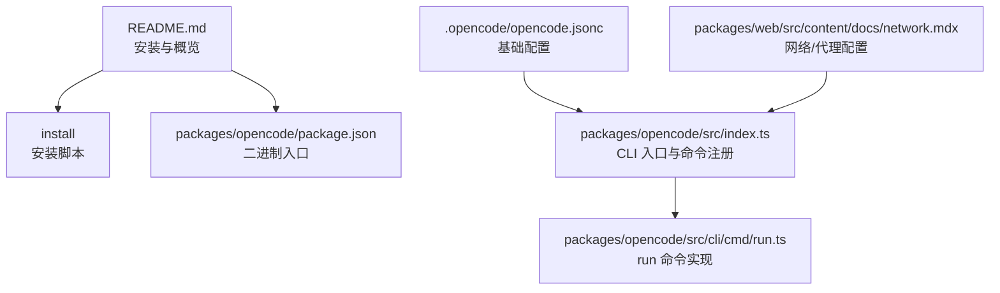
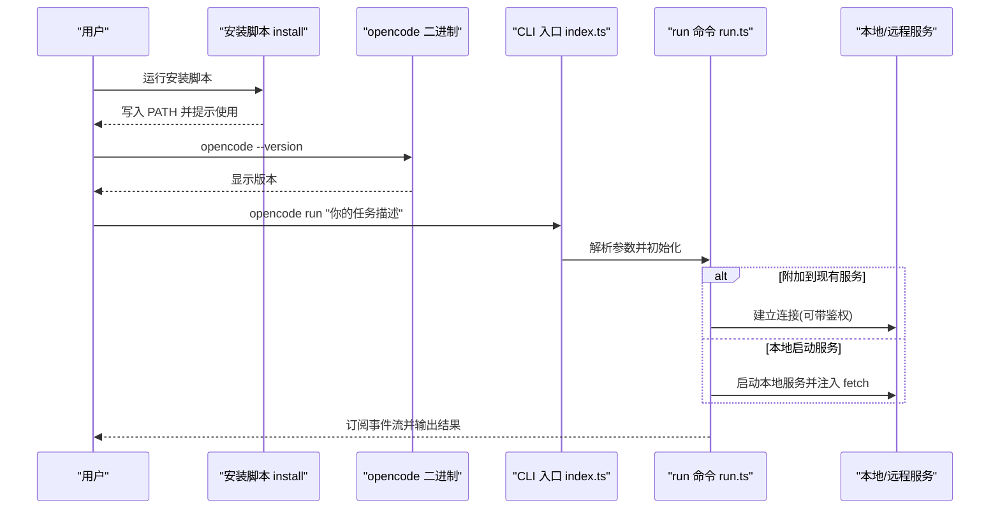
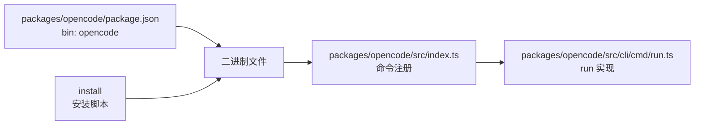

# 快速开始

<cite>
**本文引用的文件**
- [README.md](file://README.md)
- [install](file://install)
- [packages/opencode/package.json](file://packages/opencode/package.json)
- [packages/opencode/src/index.ts](file://packages/opencode/src/index.ts)
- [.opencode/opencode.jsonc](file://.opencode/opencode.jsonc)
- [packages/web/src/content/docs/network.mdx](file://packages/web/src/content/docs/network.mdx)
- [packages/web/src/content/docs/zh-cn/cli.mdx](file://packages/web/src/content/docs/zh-cn/cli.mdx)
- [packages/web/src/content/docs/zh-cn/providers.mdx](file://packages/web/src/content/docs/zh-cn/providers.mdx)
- [packages/opencode/src/cli/cmd/run.ts](file://packages/opencode/src/cli/cmd/run.ts)
</cite>

## 目录
1. [简介](#简介)
2. [项目结构](#项目结构)
3. [核心组件](#核心组件)
4. [架构总览](#架构总览)
5. [详细组件分析](#详细组件分析)
6. [依赖分析](#依赖分析)
7. [性能考虑](#性能考虑)
8. [故障排除指南](#故障排除指南)
9. [结论](#结论)
10. [附录](#附录)

## 简介
本指南面向首次接触 OpenCode 的用户，帮助你在 10 分钟内完成安装、基础配置与一次成功的 AI 编程任务。内容覆盖多种安装方式（curl 脚本、包管理器、桌面应用）、环境变量与代理配置、核心命令 opencode run 的使用方法，并提供常见问题排查建议。

## 项目结构
OpenCode 是一个多包工作区项目，核心 CLI 工具位于 packages/opencode 中；根目录提供统一的安装脚本与文档。桌面应用与 Web 界面由其他包提供，但本快速开始聚焦 CLI 与基础配置。

图表来源
- [README.md:46-84](file://README.md#L46-L84)
- [install:1-461](file://install#L1-L461)
- [packages/opencode/package.json:24-26](file://packages/opencode/package.json#L24-L26)
- [packages/opencode/src/index.ts:64-186](file://packages/opencode/src/index.ts#L64-L186)
- [.opencode/opencode.jsonc:1-19](file://.opencode/opencode.jsonc#L1-L19)
- [packages/web/src/content/docs/network.mdx:1-57](file://packages/web/src/content/docs/network.mdx#L1-L57)

章节来源
- [README.md:46-84](file://README.md#L46-L84)
- [packages/opencode/package.json:24-26](file://packages/opencode/package.json#L24-L26)

## 核心组件
- 安装脚本：支持自动检测系统架构、下载对应二进制、写入 PATH 并输出使用提示。
- CLI 入口：通过 yargs 注册子命令，解析参数，初始化日志与数据库迁移。
- 运行命令（run）：支持直接执行一次性任务、附加到本地/远程服务、文件附件、权限规则与输出格式控制。
- 配置文件：opencode.jsonc 提供 provider、权限、工具开关等基础配置项。
- 网络配置：支持代理与自定义证书，满足企业网络环境。

章节来源
- [install:1-461](file://install#L1-L461)
- [packages/opencode/src/index.ts:64-186](file://packages/opencode/src/index.ts#L64-L186)
- [packages/opencode/src/cli/cmd/run.ts:221-677](file://packages/opencode/src/cli/cmd/run.ts#L221-L677)
- [.opencode/opencode.jsonc:1-19](file://.opencode/opencode.jsonc#L1-L19)
- [packages/web/src/content/docs/network.mdx:1-57](file://packages/web/src/content/docs/network.mdx#L1-L57)

## 架构总览
下图展示从安装到首次运行的核心流程：安装脚本下载二进制并写入 PATH；CLI 入口解析参数并加载配置；run 命令根据参数决定是本地启动服务还是连接已有服务，随后订阅事件流并渲染输出。

图表来源
- [install:327-359](file://install#L327-L359)
- [packages/opencode/src/index.ts:64-186](file://packages/opencode/src/index.ts#L64-L186)
- [packages/opencode/src/cli/cmd/run.ts:655-677](file://packages/opencode/src/cli/cmd/run.ts#L655-L677)

## 详细组件分析

### 安装方式与路径选择
- curl 脚本安装：一键下载对应平台二进制，自动处理架构与压缩格式差异。
- 包管理器安装：支持 npm/bun/pnpm/yarn、Homebrew、Scoop、Chocolatey、pacman、paru、mise、Nix 等。
- 桌面应用：提供 macOS/Windows/Linux 多平台安装包，亦可通过包管理器安装桌面版。

章节来源
- [README.md:48-84](file://README.md#L48-L84)
- [install:103-110](file://install#L103-L110)
- [install:171-181](file://install#L171-L181)

### 安装脚本行为与 PATH 注入
- 自动识别 OS/架构，必要时附加 baseline/musl 后缀。
- 支持指定安装目录优先级：OPENCODE_INSTALL_DIR > XDG_BIN_DIR > $HOME/bin > 默认 ~/.opencode/bin。
- 在交互式 shell 中尝试写入 .bashrc/.zshrc 等配置文件，或提示手动添加 PATH。

章节来源
- [install:68-99](file://install#L68-L99)
- [install:362-439](file://install#L362-L439)

### CLI 入口与命令注册
- 使用 yargs 注册子命令，包含 run、serve、web、session、stats、providers、models 等。
- 初始化日志级别、数据库迁移标记与进度条显示。
- 支持 --pure、--print-logs、--log-level 等全局选项。

章节来源
- [packages/opencode/src/index.ts:64-186](file://packages/opencode/src/index.ts#L64-L186)
- [packages/opencode/package.json:24-26](file://packages/opencode/package.json#L24-L26)

### 运行命令（opencode run）详解
- 基本用法：接收消息参数，可附加文件、切换目录、选择模型与代理 agent。
- 会话控制：支持继续上次会话、指定会话 ID、分叉会话；可自动分享会话链接。
- 输出格式：默认美化输出或 JSON 流；可显示思考过程（--thinking）。
- 附加模式：可连接本地/远程服务（例如 opencode serve/web），支持 Basic 认证。
- 权限规则：内置默认规则，拒绝部分高风险操作，必要时自动拒绝权限请求。

图表来源
- [packages/opencode/src/cli/cmd/run.ts:306-677](file://packages/opencode/src/cli/cmd/run.ts#L306-L677)

章节来源
- [packages/opencode/src/cli/cmd/run.ts:221-677](file://packages/opencode/src/cli/cmd/run.ts#L221-L677)

### 基础配置（opencode.jsonc）
- provider：定义模型提供商与选项，支持 baseURL、apiKey、headers 等。
- permission：可对特定路径设置编辑/计划等权限策略。
- tools：开启/关闭 GitHub 等工具。
- mcp：MCP 相关配置占位。

章节来源
- [.opencode/opencode.jsonc:1-19](file://.opencode/opencode.jsonc#L1-L19)

### 网络与代理配置
- 支持 HTTPS_PROXY/HTTP_PROXY/NO_PROXY；TUI 与本地服务通信需绕过代理。
- 支持自定义证书 NODE_EXTRA_CA_CERTS。
- serve/web 命令支持端口与主机名配置，也可启用 mDNS/CORS。

章节来源
- [packages/web/src/content/docs/network.mdx:14-57](file://packages/web/src/content/docs/network.mdx#L14-L57)
- [packages/web/src/content/docs/zh-cn/cli.mdx:355-373](file://packages/web/src/content/docs/zh-cn/cli.mdx#L355-L373)

### 模型与提供商配置
- 通过 providers.mdx 文档了解如何配置提供商与模型，包括 baseURL、apiKey、headers、上下文限制等。
- 支持从 models.dev 拉取模型元数据，或在本地配置自定义模型。

章节来源
- [packages/web/src/content/docs/zh-cn/providers.mdx:1857-1897](file://packages/web/src/content/docs/zh-cn/providers.mdx#L1857-L1897)

## 依赖分析
- CLI 二进制入口：packages/opencode/package.json 的 bin 字段指向 ./bin/opencode。
- CLI 入口文件：packages/opencode/src/index.ts 注册命令并初始化运行时。
- 运行命令：packages/opencode/src/cli/cmd/run.ts 实现 run 子命令逻辑。
- 安装脚本：install 负责下载与安装二进制、注入 PATH。

图表来源
- [packages/opencode/package.json:24-26](file://packages/opencode/package.json#L24-L26)
- [packages/opencode/src/index.ts:64-186](file://packages/opencode/src/index.ts#L64-L186)
- [packages/opencode/src/cli/cmd/run.ts:221-677](file://packages/opencode/src/cli/cmd/run.ts#L221-L677)
- [install:327-359](file://install#L327-L359)

章节来源
- [packages/opencode/package.json:24-26](file://packages/opencode/package.json#L24-L26)
- [packages/opencode/src/index.ts:64-186](file://packages/opencode/src/index.ts#L64-L186)
- [packages/opencode/src/cli/cmd/run.ts:221-677](file://packages/opencode/src/cli/cmd/run.ts#L221-L677)
- [install:327-359](file://install#L327-L359)

## 性能考虑
- 首次运行可能触发数据库迁移，需要等待片刻；后续会话复用已建立的服务可减少冷启动时间。
- 使用 --attach 连接到本地/远程服务可避免重复启动，提升响应速度。
- 在企业网络中正确配置代理与证书，避免因网络问题导致的超时或失败。

## 故障排除指南
- 安装后无法找到命令：确认安装脚本是否成功写入 PATH，或手动将安装目录加入 PATH。
- 代理导致本地服务无法访问：按网络文档要求设置 NO_PROXY 绕过本地回环地址。
- 会话权限被拒绝：run 命令默认拒绝高风险权限，可在配置中调整 permission 规则。
- 模型不可用：检查 provider 配置中的 baseURL、apiKey、headers 是否正确，或参考提供商文档进行配置。

章节来源
- [install:362-439](file://install#L362-L439)
- [packages/web/src/content/docs/network.mdx:21-27](file://packages/web/src/content/docs/network.mdx#L21-L27)
- [packages/opencode/src/cli/cmd/run.ts:357-373](file://packages/opencode/src/cli/cmd/run.ts#L357-L373)
- [packages/web/src/content/docs/zh-cn/providers.mdx:1857-1897](file://packages/web/src/content/docs/zh-cn/providers.mdx#L1857-L1897)

## 结论
按照本指南，你可以在 10 分钟内完成安装、基础配置与一次成功的 AI 编程任务。建议先用 opencode run 执行简单任务验证环境，再逐步探索 serve/web 与更丰富的配置项。

## 附录
- 快速开始步骤
  1) 选择一种安装方式并完成安装。
  2) 在项目目录中运行 opencode run "你的第一个任务"。
  3) 如需后台服务，先运行 opencode serve，再用 opencode run --attach 连接。
  4) 如遇网络问题，参考代理与证书配置。
- 常用命令
  - opencode run：一次性任务执行。
  - opencode serve：启动无头服务。
  - opencode models --refresh：刷新模型列表。
  - opencode session list：列出会话。
  - opencode stats：查看用量统计。

章节来源
- [README.md:48-84](file://README.md#L48-L84)
- [packages/web/src/content/docs/zh-cn/cli.mdx:353-411](file://packages/web/src/content/docs/zh-cn/cli.mdx#L353-L411)
- [packages/opencode/src/cli/cmd/run.ts:316-334](file://packages/opencode/src/cli/cmd/run.ts#L316-L334)