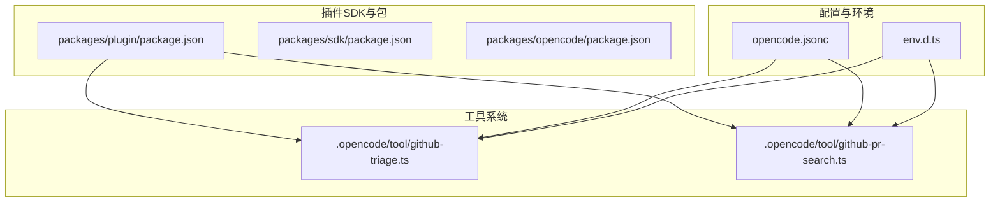
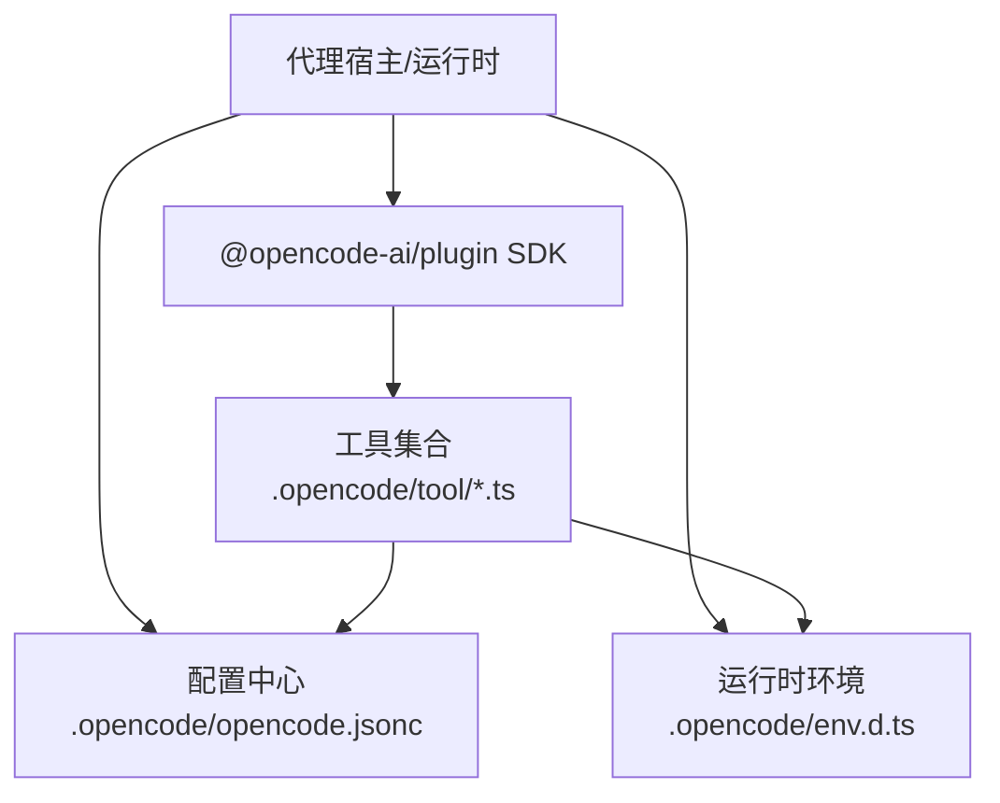
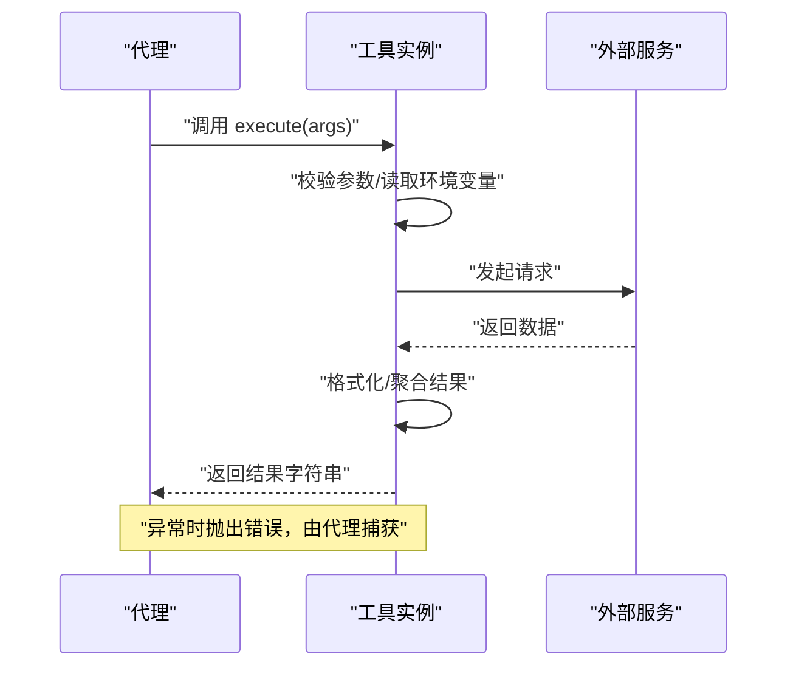
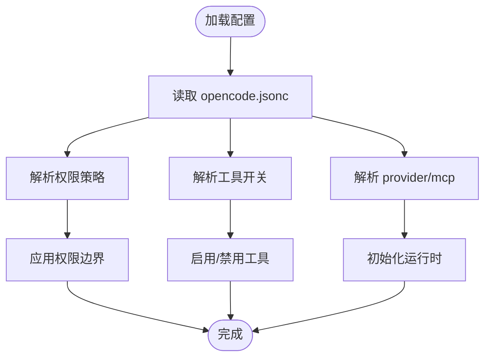
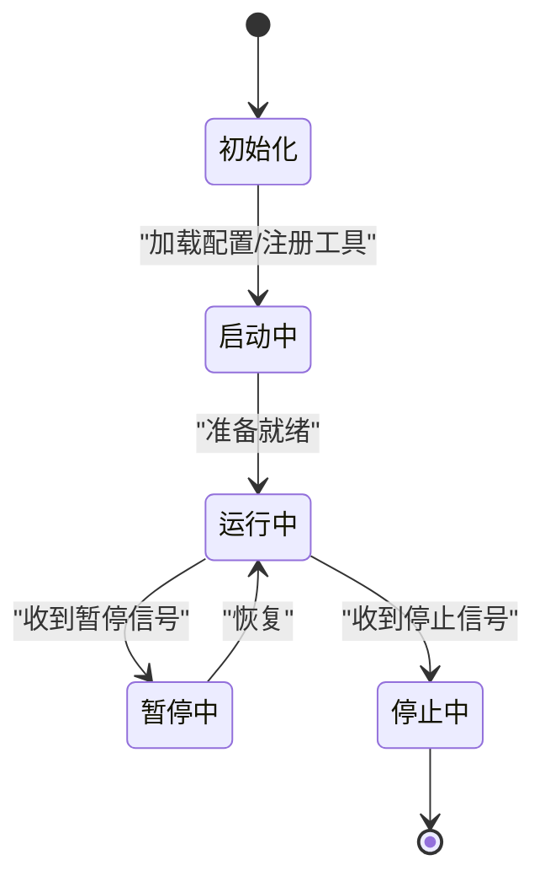
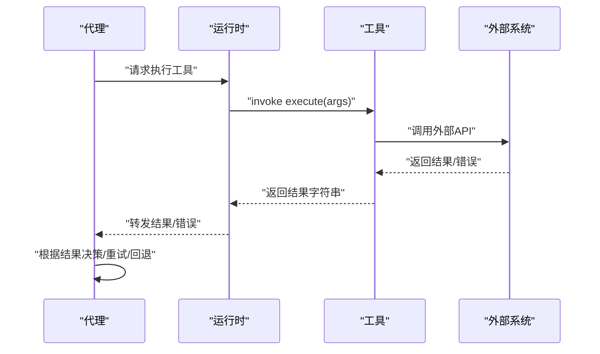
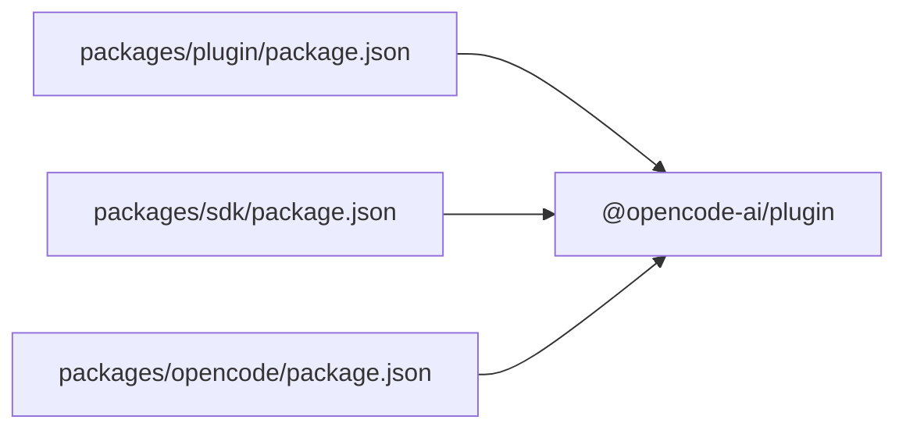

# 代理插件开发

<cite>
**本文引用的文件**
- [README.md](file://README.md)
- [AGENTS.md](file://AGENTS.md)
- [.opencode/opencode.jsonc](file://.opencode/opencode.jsonc)
- [.opencode/package.json](file://.opencode/package.json)
- [.opencode/env.d.ts](file://.opencode/env.d.ts)
- [.opencode/tool/github-triage.ts](file://.opencode/tool/github-triage.ts)
- [.opencode/tool/github-pr-search.ts](file://.opencode/tool/github-pr-search.ts)
- [packages/opencode/package.json](file://packages/opencode/package.json)
- [packages/plugin/package.json](file://packages/plugin/package.json)
- [packages/sdk/package.json](file://packages/sdk/package.json)
</cite>

## 目录
1. [简介](#简介)
2. [项目结构](#项目结构)
3. [核心组件](#核心组件)
4. [架构总览](#架构总览)
5. [详细组件分析](#详细组件分析)
6. [依赖分析](#依赖分析)
7. [性能考虑](#性能考虑)
8. [故障排查指南](#故障排查指南)
9. [结论](#结论)
10. [附录](#附录)

## 简介
本指南面向希望在 OpenCode 生态中开发“代理插件”的开发者，系统讲解代理插件的架构设计、接口规范、状态管理与权限控制机制，并提供从零到一的开发流程、生命周期管理、与工具系统的集成方式、测试与性能优化建议。文档基于仓库中现有的插件 SDK、工具示例与配置文件进行归纳总结，帮助读者快速上手并构建可维护、可扩展的代理插件。

## 项目结构
OpenCode 的代理插件能力由“插件 SDK”与“工具系统”共同支撑，核心位置如下：
- 插件 SDK：位于 packages 目录下的插件与 SDK 包，提供插件开发所需的类型、工具函数与运行时约定。
- 工具系统：位于 .opencode/tool 下，提供具体工具（如 GitHub 搜索、问题分流）的实现范式，展示如何通过 tool() 构造器声明工具、参数与执行逻辑。
- 配置中心：.opencode/opencode.jsonc 提供 provider、权限、工具开关等全局配置入口。
- 运行时环境：.opencode/env.d.ts 声明环境变量与资源导入约定，确保插件在统一环境下运行。

图表来源
- [.opencode/tool/github-triage.ts:1-117](file://.opencode/tool/github-triage.ts#L1-L117)
- [.opencode/tool/github-pr-search.ts:1-65](file://.opencode/tool/github-pr-search.ts#L1-L65)
- [.opencode/opencode.jsonc:1-19](file://.opencode/opencode.jsonc#L1-L19)
- [.opencode/env.d.ts:1-5](file://.opencode/env.d.ts#L1-L5)
- [packages/plugin/package.json](file://packages/plugin/package.json)
- [packages/sdk/package.json](file://packages/sdk/package.json)
- [packages/opencode/package.json](file://packages/opencode/package.json)

章节来源
- [.opencode/opencode.jsonc:1-19](file://.opencode/opencode.jsonc#L1-L19)
- [.opencode/package.json:1-5](file://.opencode/package.json#L1-L5)
- [.opencode/env.d.ts:1-5](file://.opencode/env.d.ts#L1-L5)

## 核心组件
- 插件 SDK（packages/plugin 与 packages/sdk）
  - 提供插件开发所需的基础能力与类型约束，确保插件在统一的运行时与接口下工作。
  - 通过包管理器安装与版本化，便于在不同环境中复现与升级。
- 工具系统（.opencode/tool）
  - 以工具为最小可组合单元，每个工具通过 tool() 构造器声明：描述、参数模式、执行函数与返回值。
  - 工具示例展示了参数校验、外部 API 调用、错误处理与结果格式化等通用模式。
- 配置中心（.opencode/opencode.jsonc）
  - 定义 provider、权限策略、工具开关与 MCP 集成点，作为插件运行期的“白名单与开关”。
- 运行时环境（.opencode/env.d.ts）
  - 统一环境变量与资源导入约定，保证插件在不同平台与部署形态下的一致性。

章节来源
- [.opencode/tool/github-triage.ts:1-117](file://.opencode/tool/github-triage.ts#L1-L117)
- [.opencode/tool/github-pr-search.ts:1-65](file://.opencode/tool/github-pr-search.ts#L1-L65)
- [.opencode/opencode.jsonc:1-19](file://.opencode/opencode.jsonc#L1-L19)
- [.opencode/env.d.ts:1-5](file://.opencode/env.d.ts#L1-L5)

## 架构总览
OpenCode 的代理插件采用“工具即能力”的模块化架构：插件通过 SDK 注册工具，工具在运行时被调度执行；配置中心决定可用工具与权限边界；插件生命周期由宿主管理，插件负责状态持久化与错误恢复。

图表来源
- [.opencode/tool/github-triage.ts:1-117](file://.opencode/tool/github-triage.ts#L1-L117)
- [.opencode/tool/github-pr-search.ts:1-65](file://.opencode/tool/github-pr-search.ts#L1-L65)
- [.opencode/opencode.jsonc:1-19](file://.opencode/opencode.jsonc#L1-L19)
- [.opencode/env.d.ts:1-5](file://.opencode/env.d.ts#L1-L5)

## 详细组件分析

### 工具构造器与接口规范
- 工具声明
  - 使用 tool() 构造器声明工具：提供 description、args（参数模式）、execute（执行函数）与返回值约定。
  - 参数模式使用 schema（如枚举、数组、默认值）进行强类型约束，减少运行期错误。
- 执行流程
  - 读取必要环境变量（如 GITHUB_TOKEN），对输入参数进行校验与归一化。
  - 调用外部服务（如 GitHub API），对响应进行格式化与聚合。
  - 返回人类可读或 LLM 友好的结果字符串。
- 错误处理
  - 对外部请求失败、参数不合法、业务规则不满足等情况抛出明确错误，便于上层统一捕获与提示。

图表来源
- [.opencode/tool/github-triage.ts:40-116](file://.opencode/tool/github-triage.ts#L40-L116)
- [.opencode/tool/github-pr-search.ts:24-64](file://.opencode/tool/github-pr-search.ts#L24-L64)

章节来源
- [.opencode/tool/github-triage.ts:1-117](file://.opencode/tool/github-triage.ts#L1-L117)
- [.opencode/tool/github-pr-search.ts:1-65](file://.opencode/tool/github-pr-search.ts#L1-L65)

### 权限控制与配置管理
- 权限策略
  - 在配置中心通过 permission 字段定义路径级权限（如 deny/allow），限制插件对特定资源的访问。
- 工具开关
  - 通过 tools 字段启用/禁用具体工具，避免不必要的外部调用与风险暴露。
- Provider 与 MCP
  - provider 与 mcp 字段用于选择推理后端与 MCP 集成点，影响工具的可用性与执行上下文。

图表来源
- [.opencode/opencode.jsonc:1-19](file://.opencode/opencode.jsonc#L1-L19)

章节来源
- [.opencode/opencode.jsonc:1-19](file://.opencode/opencode.jsonc#L1-L19)

### 生命周期管理（启动/运行/暂停/停止）
- 启动阶段
  - 读取配置、注册工具、建立外部连接（如 API 凭证）、初始化缓存或会话。
- 运行阶段
  - 接收代理指令，调度工具执行，处理中间状态与结果。
- 暂停/停止阶段
  - 释放资源、保存状态、清理会话；支持幂等重启与断点续跑。

[本节为概念性说明，无需图表来源]

### 与工具系统的集成方式
- 工具调用
  - 代理通过 SDK 将工具注册到运行时，按需调用 execute(args)，传入参数对象。
- 结果处理
  - 工具返回字符串或结构化文本，代理负责进一步解析、可视化或继续推理。
- 错误恢复
  - 对工具异常进行分类与重试策略（如指数退避），记录日志并回退到安全路径。

图表来源
- [.opencode/tool/github-triage.ts:57-116](file://.opencode/tool/github-triage.ts#L57-L116)
- [.opencode/tool/github-pr-search.ts:40-64](file://.opencode/tool/github-pr-search.ts#L40-L64)

### 开发流程与最佳实践
- 继承与扩展
  - 使用 SDK 提供的基类或构造器模式，封装工具的公共行为（认证、重试、日志）。
- 方法重写
  - 仅重写必要的钩子（如 beforeExecute、afterExecute），保持单一职责。
- 配置管理
  - 将敏感信息放入环境变量，参数模式化，避免硬编码。
- 测试与验证
  - 编写针对 execute 的端到端测试，覆盖正常路径、边界条件与错误分支。

章节来源
- [AGENTS.md:1-129](file://AGENTS.md#L1-L129)

### 实际示例：自定义工具实现与配置
- 示例目标
  - 实现一个“查询 Issue 列表”的工具，支持关键词过滤、分页与标签筛选。
- 关键步骤
  - 定义参数模式（query、limit、offset、labels）。
  - 在 execute 中拼装查询参数并调用外部 API。
  - 格式化返回结果，确保 LLM 友好。
  - 在配置中心开启该工具并设置权限范围。
- 参考实现路径
  - 可参考现有工具的参数定义与执行逻辑，遵循相同的模式与错误处理风格。

章节来源
- [.opencode/tool/github-pr-search.ts:24-64](file://.opencode/tool/github-pr-search.ts#L24-L64)
- [.opencode/opencode.jsonc:14-18](file://.opencode/opencode.jsonc#L14-L18)

## 依赖分析
- 插件 SDK 版本与依赖
  - .opencode/package.json 明确了 @opencode-ai/plugin 的版本，确保插件在一致的 API 下开发与发布。
- 包依赖关系
  - packages/opencode、packages/plugin、packages/sdk 分别承担运行时、插件框架与 SDK 的职责，形成清晰的分层。

图表来源
- [.opencode/package.json:1-5](file://.opencode/package.json#L1-L5)
- [packages/plugin/package.json](file://packages/plugin/package.json)
- [packages/sdk/package.json](file://packages/sdk/package.json)
- [packages/opencode/package.json](file://packages/opencode/package.json)

章节来源
- [.opencode/package.json:1-5](file://.opencode/package.json#L1-L5)
- [packages/plugin/package.json](file://packages/plugin/package.json)
- [packages/sdk/package.json](file://packages/sdk/package.json)
- [packages/opencode/package.json](file://packages/opencode/package.json)

## 性能考虑
- 外部调用优化
  - 合理设置超时与重试，避免阻塞代理主线程。
  - 对高频查询使用缓存与去重策略，降低外部 API 压力。
- 参数与结果
  - 控制返回文本长度，优先摘要与链接，减少上下文开销。
- 并发与批处理
  - 在工具内部对可并行操作进行并发控制，避免触发外部速率限制。
- 日志与可观测性
  - 记录关键指标（耗时、成功率、错误码），便于定位瓶颈。

[本节提供通用指导，无需章节来源]

## 故障排查指南
- 常见问题
  - 环境变量缺失：检查 GITHUB_TOKEN 等必需变量是否注入。
  - 权限不足：确认配置中心 permission 是否拒绝了相关路径或工具。
  - 工具未启用：检查 tools 中对应工具是否为 true。
- 排查步骤
  - 先在本地最小化复现（关闭其他工具），再逐步放量。
  - 查看工具执行日志与外部 API 响应码，定位失败环节。
  - 对异常进行分类（网络/鉴权/参数/业务），分别制定重试与降级策略。

章节来源
- [.opencode/tool/github-triage.ts:24-38](file://.opencode/tool/github-triage.ts#L24-L38)
- [.opencode/tool/github-pr-search.ts:3-17](file://.opencode/tool/github-pr-search.ts#L3-L17)
- [.opencode/opencode.jsonc:8-18](file://.opencode/opencode.jsonc#L8-L18)

## 结论
通过 SDK、工具系统与配置中心的协同，OpenCode 为代理插件提供了清晰的开发范式与运行保障。遵循本文档的接口规范、权限控制与生命周期管理建议，结合工具示例与测试实践，可以高效构建稳定、可维护的代理插件，并在复杂场景中实现高可用与高性能。

[本节为总结性内容，无需章节来源]

## 附录
- 快速开始清单
  - 安装 SDK 依赖，编写工具实现，定义参数模式与执行逻辑。
  - 在配置中心启用工具并设置权限，注入环境变量。
  - 编写端到端测试，覆盖正常与异常路径。
  - 上线前进行性能压测与日志审计。

章节来源
- [README.md:1-142](file://README.md#L1-L142)
- [.opencode/opencode.jsonc:1-19](file://.opencode/opencode.jsonc#L1-L19)
- [.opencode/package.json:1-5](file://.opencode/package.json#L1-L5)