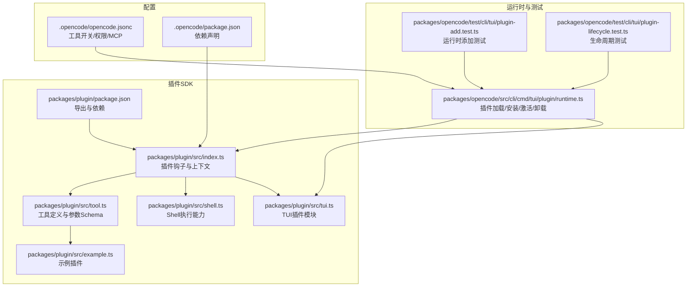
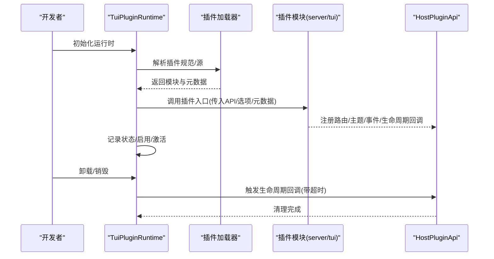
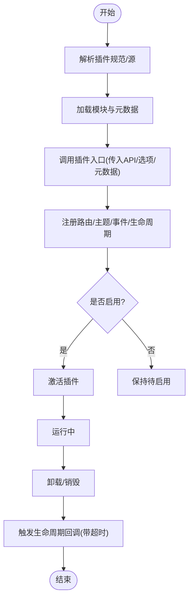
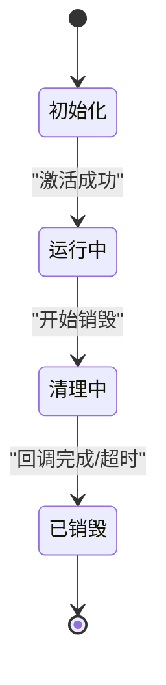
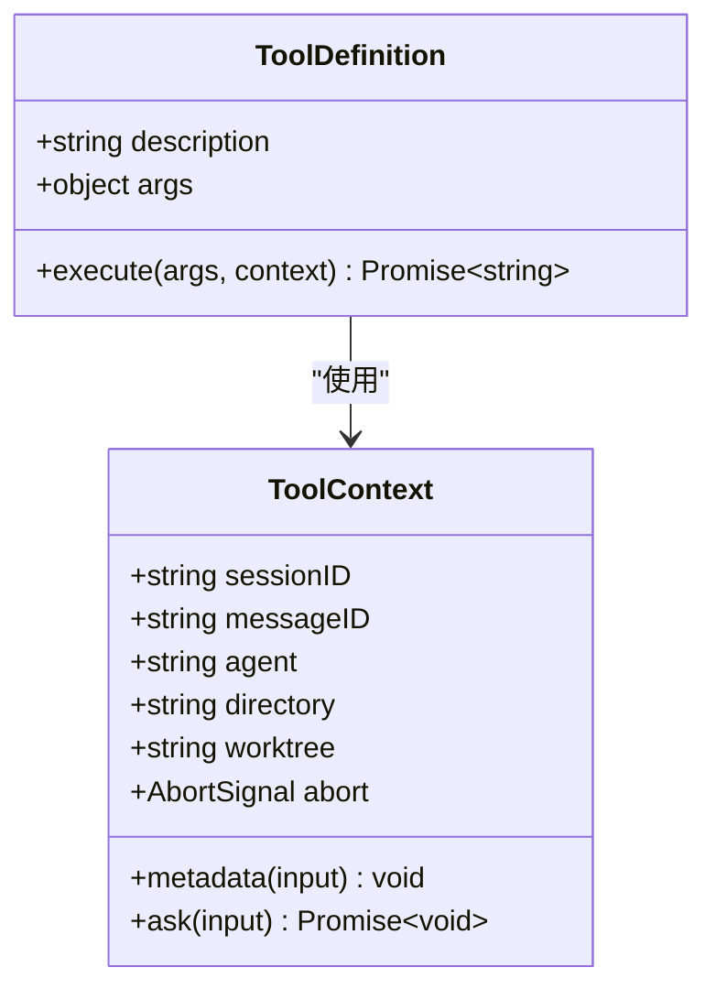
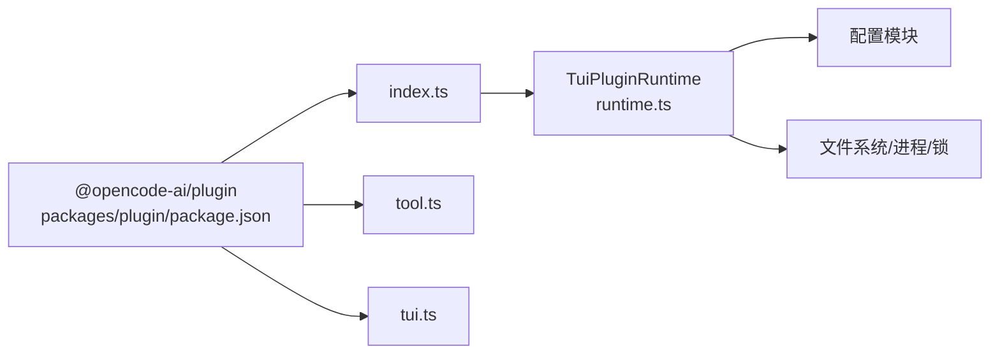

# 工具插件开发

<cite>
**本文引用的文件**
- [packages/plugin/src/index.ts](file://packages/plugin/src/index.ts)
- [packages/plugin/src/tool.ts](file://packages/plugin/src/tool.ts)
- [packages/plugin/src/example.ts](file://packages/plugin/src/example.ts)
- [packages/plugin/src/shell.ts](file://packages/plugin/src/shell.ts)
- [packages/plugin/src/tui.ts](file://packages/plugin/src/tui.ts)
- [packages/plugin/package.json](file://packages/plugin/package.json)
- [packages/opencode/src/cli/cmd/tui/plugin/runtime.ts](file://packages/opencode/src/cli/cmd/tui/plugin/runtime.ts)
- [packages/opencode/test/cli/tui/plugin-add.test.ts](file://packages/opencode/test/cli/tui/plugin-add.test.ts)
- [packages/opencode/test/cli/tui/plugin-lifecycle.test.ts](file://packages/opencode/test/cli/tui/plugin-lifecycle.test.ts)
- [.opencode/opencode.jsonc](file://.opencode/opencode.jsonc)
- [.opencode/package.json](file://.opencode/package.json)
</cite>

## 目录
1. [简介](#简介)
2. [项目结构](#项目结构)
3. [核心组件](#核心组件)
4. [架构总览](#架构总览)
5. [详细组件分析](#详细组件分析)
6. [依赖关系分析](#依赖关系分析)
7. [性能考虑](#性能考虑)
8. [故障排查指南](#故障排查指南)
9. [结论](#结论)
10. [附录](#附录)

## 简介
本指南面向希望在本项目中开发“工具插件”的开发者，系统阐述工具插件的接口规范、实现要求、注册与生命周期管理、测试策略以及打包分发与版本管理实践。内容基于仓库中的插件 SDK、TUI 插件运行时与相关测试用例进行归纳总结，帮助你从零开始构建稳定、可维护且可扩展的工具插件。

## 项目结构
围绕工具插件开发的关键目录与文件如下：
- 插件 SDK 定义：packages/plugin
  - 核心类型与钩子定义：packages/plugin/src/index.ts
  - 工具函数定义与参数校验：packages/plugin/src/tool.ts
  - 示例插件：packages/plugin/src/example.ts
  - Shell 执行能力：packages/plugin/src/shell.ts
  - TUI 插件模块定义：packages/plugin/src/tui.ts
  - 包配置：packages/plugin/package.json
- 运行时与测试
  - TUI 插件运行时（加载/安装/激活/卸载）：packages/opencode/src/cli/cmd/tui/plugin/runtime.ts
  - 插件添加与运行时加载测试：packages/opencode/test/cli/tui/plugin-add.test.ts
  - 插件生命周期与清理测试：packages/opencode/test/cli/tui/plugin-lifecycle.test.ts
- 配置
  - 本地配置（工具开关、权限等）：.opencode/opencode.jsonc
  - 本地依赖声明：.opencode/package.json

图表来源
- [packages/plugin/src/index.ts:1-277](file://packages/plugin/src/index.ts#L1-L277)
- [packages/plugin/src/tool.ts:1-39](file://packages/plugin/src/tool.ts#L1-L39)
- [packages/plugin/src/example.ts:1-19](file://packages/plugin/src/example.ts#L1-L19)
- [packages/plugin/src/shell.ts:1-137](file://packages/plugin/src/shell.ts#L1-L137)
- [packages/plugin/src/tui.ts:502-508](file://packages/plugin/src/tui.ts#L502-L508)
- [packages/plugin/package.json:1-44](file://packages/plugin/package.json#L1-L44)
- [packages/opencode/src/cli/cmd/tui/plugin/runtime.ts:1-200](file://packages/opencode/src/cli/cmd/tui/plugin/runtime.ts#L1-L200)
- [packages/opencode/test/cli/tui/plugin-add.test.ts:1-108](file://packages/opencode/test/cli/tui/plugin-add.test.ts#L1-L108)
- [packages/opencode/test/cli/tui/plugin-lifecycle.test.ts:1-225](file://packages/opencode/test/cli/tui/plugin-lifecycle.test.ts#L1-L225)
- [.opencode/opencode.jsonc:1-19](file://.opencode/opencode.jsonc#L1-L19)
- [.opencode/package.json:1-5](file://.opencode/package.json#L1-L5)

章节来源
- [packages/plugin/src/index.ts:1-277](file://packages/plugin/src/index.ts#L1-L277)
- [packages/plugin/src/tool.ts:1-39](file://packages/plugin/src/tool.ts#L1-L39)
- [packages/plugin/src/example.ts:1-19](file://packages/plugin/src/example.ts#L1-L19)
- [packages/plugin/src/shell.ts:1-137](file://packages/plugin/src/shell.ts#L1-L137)
- [packages/plugin/src/tui.ts:502-508](file://packages/plugin/src/tui.ts#L502-L508)
- [packages/plugin/package.json:1-44](file://packages/plugin/package.json#L1-L44)
- [packages/opencode/src/cli/cmd/tui/plugin/runtime.ts:1-200](file://packages/opencode/src/cli/cmd/tui/plugin/runtime.ts#L1-L200)
- [packages/opencode/test/cli/tui/plugin-add.test.ts:1-108](file://packages/opencode/test/cli/tui/plugin-add.test.ts#L1-L108)
- [packages/opencode/test/cli/tui/plugin-lifecycle.test.ts:1-225](file://packages/opencode/test/cli/tui/plugin-lifecycle.test.ts#L1-L225)
- [.opencode/opencode.jsonc:1-19](file://.opencode/opencode.jsonc#L1-L19)
- [.opencode/package.json:1-5](file://.opencode/package.json#L1-L5)

## 核心组件
- 插件接口与钩子
  - 插件函数签名：接收输入上下文与可选选项，返回钩子集合；支持事件、配置、工具、认证、Provider、聊天参数/头、权限请求、命令执行前后、Shell 环境、工具执行前后、实验性扩展等钩子。
  - 上下文包含客户端、项目信息、工作目录、工作树根、服务端地址、Shell 能力等。
- 工具定义
  - 使用工具工厂函数定义工具，提供描述、参数 Schema（基于 zod）、执行函数与上下文。
  - 工具上下文包含会话/消息/代理信息、项目路径、工作树根、AbortSignal、metadata 回调、ask 权限申请等。
- Shell 能力
  - 提供模板字符串形式的 Shell 表达式、brace 展开、转义、环境变量与工作目录设置、异常控制、输出读取（文本/JSON/二进制/Blob）等。
- TUI 插件模块
  - TUI 插件模块以异步函数形式暴露，接收 API、选项与元数据，用于 UI 注册、事件监听、生命周期回调等。
- 示例插件
  - 展示如何通过工具工厂定义一个简单工具，并在插件中导出。

章节来源
- [packages/plugin/src/index.ts:21-277](file://packages/plugin/src/index.ts#L21-L277)
- [packages/plugin/src/tool.ts:1-39](file://packages/plugin/src/tool.ts#L1-L39)
- [packages/plugin/src/shell.ts:1-137](file://packages/plugin/src/shell.ts#L1-L137)
- [packages/plugin/src/tui.ts:502-508](file://packages/plugin/src/tui.ts#L502-L508)
- [packages/plugin/src/example.ts:1-19](file://packages/plugin/src/example.ts#L1-L19)

## 架构总览
工具插件的运行时由 TUI 插件运行时负责加载、安装、激活与卸载。插件通过导出模块（server 或 tui）被发现并初始化，随后根据配置启用或禁用，并在生命周期结束时进行清理。

图表来源
- [packages/opencode/src/cli/cmd/tui/plugin/runtime.ts:533-964](file://packages/opencode/src/cli/cmd/tui/plugin/runtime.ts#L533-L964)
- [packages/plugin/src/tui.ts:502-508](file://packages/plugin/src/tui.ts#L502-L508)

章节来源
- [packages/opencode/src/cli/cmd/tui/plugin/runtime.ts:533-964](file://packages/opencode/src/cli/cmd/tui/plugin/runtime.ts#L533-L964)
- [packages/plugin/src/tui.ts:502-508](file://packages/plugin/src/tui.ts#L502-L508)

## 详细组件分析

### 接口规范与实现要求
- 插件函数签名
  - 输入：插件输入上下文（客户端、项目、目录、工作树、服务端地址、Shell）
  - 输出：钩子对象，包含事件、配置、工具、认证、Provider、聊天参数/头、权限请求、命令/工具执行前后、Shell 环境、实验性扩展等钩子。
- 工具函数签名
  - 工具定义需提供描述、参数 Schema（使用工具 Schema）、执行函数（接收解析后的参数与工具上下文，返回字符串结果）。
  - 参数校验：通过 zod Schema 定义，确保 LLM 与运行时之间的参数一致性。
- 返回值格式
  - 工具执行返回字符串；工具执行后钩子可修改标题、输出与元数据。
  - Shell 执行返回缓冲区与退出码，支持多种输出读取方式。
- 权限与安全
  - 通过 ask 与 permission.ask 钩子进行权限申请与决策。
  - 配置中可声明工具开关与权限策略。

章节来源
- [packages/plugin/src/index.ts:21-277](file://packages/plugin/src/index.ts#L21-L277)
- [packages/plugin/src/tool.ts:1-39](file://packages/plugin/src/tool.ts#L1-L39)
- [packages/plugin/src/shell.ts:105-137](file://packages/plugin/src/shell.ts#L105-L137)
- [.opencode/opencode.jsonc:8-18](file://.opencode/opencode.jsonc#L8-L18)

### 注册机制：发现、加载与初始化
- 发现与加载
  - 运行时根据插件规范解析源（文件/目录/包名），加载模块并提取元数据与 ID。
  - 对于文件插件，若依赖未就绪，运行时会等待并重试。
- 初始化
  - 将插件模块注入 HostPluginApi，调用插件入口函数，完成 UI 路由注册、主题安装、事件订阅、生命周期回调注册等。
- 启用与激活
  - 根据配置映射启用状态；激活时执行插件初始化逻辑。
- 卸载与安装
  - 支持按规范安装外部模块插件；卸载时触发生命周期清理，带超时保护。

图表来源
- [packages/opencode/src/cli/cmd/tui/plugin/runtime.ts:832-923](file://packages/opencode/src/cli/cmd/tui/plugin/runtime.ts#L832-L923)
- [packages/opencode/src/cli/cmd/tui/plugin/runtime.ts:925-964](file://packages/opencode/src/cli/cmd/tui/plugin/runtime.ts#L925-L964)

章节来源
- [packages/opencode/src/cli/cmd/tui/plugin/runtime.ts:832-923](file://packages/opencode/src/cli/cmd/tui/plugin/runtime.ts#L832-L923)
- [packages/opencode/src/cli/cmd/tui/plugin/runtime.ts:925-964](file://packages/opencode/src/cli/cmd/tui/plugin/runtime.ts#L925-L964)

### 生命周期管理
- 生命周期回调
  - 插件可通过 API 注册 onDispose 回调，在插件销毁前执行清理任务。
  - 运行时在销毁过程中会触发回调，并在超时后强制结束，保证稳定性。
- 中断信号
  - 生命周期信号可用于检测中断状态，确保清理流程可响应取消。
- 测试要点
  - 生命周期测试覆盖了回调执行顺序、中断信号状态、超时清理等场景。

图表来源
- [packages/opencode/test/cli/tui/plugin-lifecycle.test.ts:12-225](file://packages/opencode/test/cli/tui/plugin-lifecycle.test.ts#L12-L225)
- [packages/opencode/src/cli/cmd/tui/plugin/runtime.ts:110-130](file://packages/opencode/src/cli/cmd/tui/plugin/runtime.ts#L110-L130)

章节来源
- [packages/opencode/test/cli/tui/plugin-lifecycle.test.ts:12-225](file://packages/opencode/test/cli/tui/plugin-lifecycle.test.ts#L12-L225)
- [packages/opencode/src/cli/cmd/tui/plugin/runtime.ts:110-130](file://packages/opencode/src/cli/cmd/tui/plugin/runtime.ts#L110-L130)

### 开发示例：文件操作、代码搜索与编辑工具
- 文件操作工具
  - 基于 Shell 能力执行文件读写、路径规范化、输出渲染等。
- 代码搜索工具
  - 可通过工具定义与参数 Schema 描述查询语句、范围与过滤条件。
- 编辑工具
  - 结合工具执行前后钩子，生成差异展示与元数据反馈。
- 示例参考
  - 示例插件展示了如何定义一个最小可用工具并在插件中导出。

章节来源
- [packages/plugin/src/example.ts:1-19](file://packages/plugin/src/example.ts#L1-L19)
- [packages/plugin/src/shell.ts:1-137](file://packages/plugin/src/shell.ts#L1-L137)

### 类图：工具定义与上下文

图表来源
- [packages/plugin/src/tool.ts:3-39](file://packages/plugin/src/tool.ts#L3-L39)

## 依赖关系分析
- 插件 SDK 导出
  - 主入口导出插件类型与钩子；工具模块导出工具定义；TUI 模块导出 TUI 插件类型。
- 外部依赖
  - SDK 依赖 zod 用于参数校验；可选依赖 OpentUI 组件库用于 UI 扩展。
- 运行时依赖
  - 运行时依赖配置、文件系统、进程、锁等基础设施模块。

图表来源
- [packages/plugin/package.json:11-15](file://packages/plugin/package.json#L11-L15)
- [packages/plugin/src/index.ts:1-20](file://packages/plugin/src/index.ts#L1-L20)
- [packages/opencode/src/cli/cmd/tui/plugin/runtime.ts:1-42](file://packages/opencode/src/cli/cmd/tui/plugin/runtime.ts#L1-L42)

章节来源
- [packages/plugin/package.json:11-15](file://packages/plugin/package.json#L11-L15)
- [packages/plugin/src/index.ts:1-20](file://packages/plugin/src/index.ts#L1-L20)
- [packages/opencode/src/cli/cmd/tui/plugin/runtime.ts:1-42](file://packages/opencode/src/cli/cmd/tui/plugin/runtime.ts#L1-L42)

## 性能考虑
- 输出读取优化
  - Shell 输出支持多格式读取，建议在不需要实时输出时使用静默模式减少 I/O。
- 参数校验
  - 使用 zod Schema 在工具定义阶段进行严格校验，避免运行时错误导致的重复尝试。
- 生命周期清理
  - 设置合理的清理超时，防止长时间阻塞导致资源泄漏。
- 并发与事件
  - 在事件钩子中避免阻塞操作，必要时使用异步处理与流式订阅。

## 故障排查指南
- 插件添加失败
  - 检查插件规范与源路径是否正确；确认依赖是否已就绪并允许重试。
- 激活失败
  - 查看运行时日志与错误信息，定位插件入口执行问题。
- 清理超时
  - 确认 onDispose 回调是否包含长时间阻塞操作；为关键清理步骤设置超时。
- 权限拒绝
  - 通过 permission.ask 钩子与配置项检查权限策略，确保工具所需的权限已授予。

章节来源
- [packages/opencode/test/cli/tui/plugin-add.test.ts:11-108](file://packages/opencode/test/cli/tui/plugin-add.test.ts#L11-L108)
- [packages/opencode/test/cli/tui/plugin-lifecycle.test.ts:12-225](file://packages/opencode/test/cli/tui/plugin-lifecycle.test.ts#L12-L225)
- [packages/opencode/src/cli/cmd/tui/plugin/runtime.ts:90-106](file://packages/opencode/src/cli/cmd/tui/plugin/runtime.ts#L90-L106)

## 结论
本指南基于仓库中的插件 SDK 与运行时实现，给出了工具插件的接口规范、注册与生命周期管理、测试策略与故障排查方法。遵循本文档可帮助你在本项目中高效、稳定地开发工具插件，并通过测试与配置保障其在不同环境下的可用性与安全性。

## 附录

### 开发最佳实践
- 使用 zod Schema 明确工具参数类型与约束，便于 LLM 正确调用。
- 在工具执行前后钩子中统一输出格式与元数据，提升可观测性。
- 将耗时操作异步化，避免阻塞事件循环与生命周期清理。
- 通过配置文件控制工具开关与权限，便于运维与审计。

### 测试策略
- 单元测试
  - 针对工具定义与参数校验编写测试，覆盖边界条件与错误输入。
- 集成测试
  - 使用运行时测试用例验证插件添加、激活、生命周期清理等流程。
- 性能测试
  - 针对 Shell 执行与工具链路进行基准测试，识别瓶颈并优化。

章节来源
- [packages/opencode/test/cli/tui/plugin-add.test.ts:11-108](file://packages/opencode/test/cli/tui/plugin-add.test.ts#L11-L108)
- [packages/opencode/test/cli/tui/plugin-lifecycle.test.ts:12-225](file://packages/opencode/test/cli/tui/plugin-lifecycle.test.ts#L12-L225)

### 打包、分发与版本管理
- 包导出
  - 通过包配置导出主入口与子模块（如工具、TUI），确保消费者按需引入。
- 版本管理
  - 使用语义化版本管理插件版本，发布前进行类型检查与构建。
- 分发
  - 通过包管理器分发插件；在配置中声明依赖与可选 UI 依赖，降低接入成本。

章节来源
- [packages/plugin/package.json:11-15](file://packages/plugin/package.json#L11-L15)
- [packages/plugin/package.json:19-44](file://packages/plugin/package.json#L19-L44)