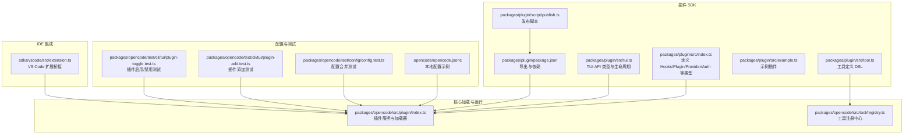
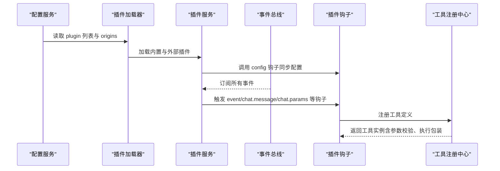
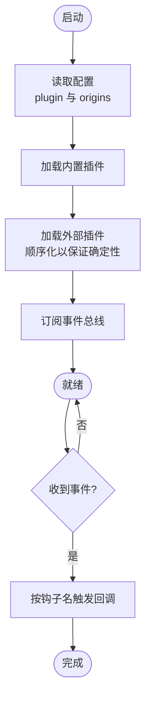
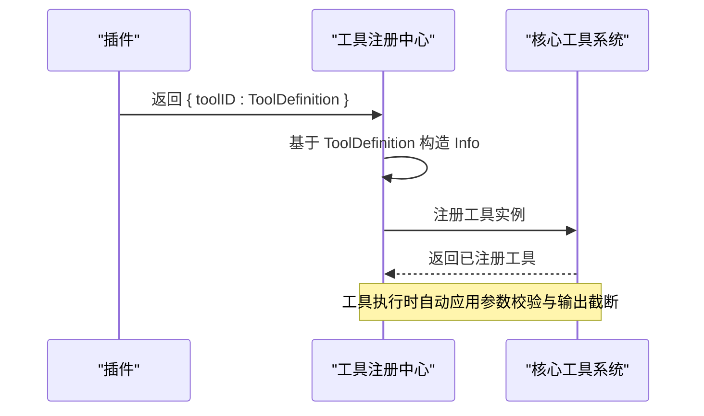
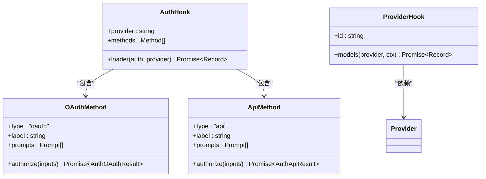
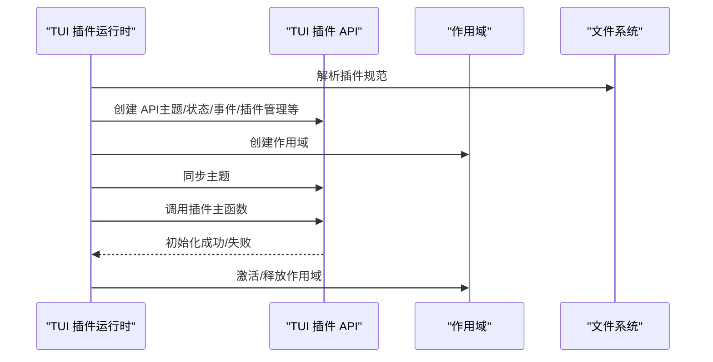
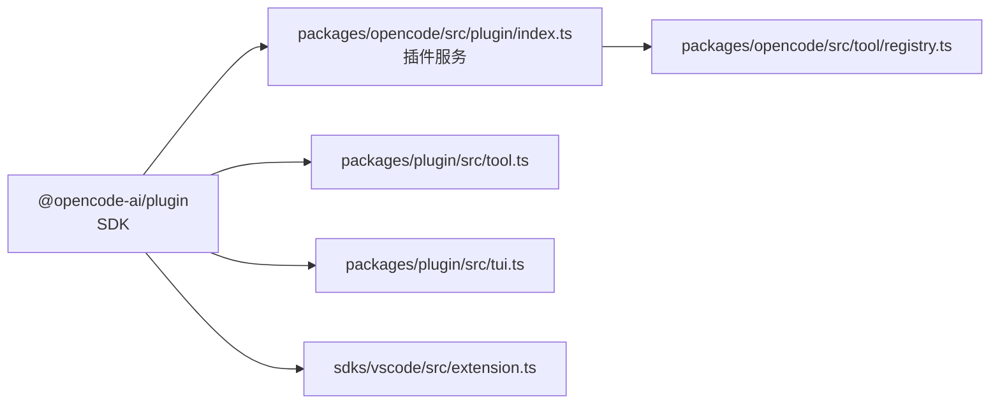

# 扩展开发

<cite>
**本文引用的文件**
- [packages/plugin/src/index.ts](file://packages/plugin/src/index.ts)
- [packages/plugin/src/tool.ts](file://packages/plugin/src/tool.ts)
- [packages/plugin/src/tui.ts](file://packages/plugin/src/tui.ts)
- [packages/plugin/src/example.ts](file://packages/plugin/src/example.ts)
- [packages/plugin/package.json](file://packages/plugin/package.json)
- [packages/plugin/script/publish.ts](file://packages/plugin/script/publish.ts)
- [.opencode/opencode.jsonc](file://.opencode/opencode.jsonc)
- [packages/opencode/src/plugin/index.ts](file://packages/opencode/src/plugin/index.ts)
- [packages/opencode/src/tool/registry.ts](file://packages/opencode/src/tool/registry.ts)
- [sdks/vscode/src/extension.ts](file://sdks/vscode/src/extension.ts)
- [packages/opencode/test/config/config.test.ts](file://packages/opencode/test/config/config.test.ts)
- [packages/opencode/test/cli/tui/plugin-add.test.ts](file://packages/opencode/test/cli/tui/plugin-add.test.ts)
- [packages/opencode/test/cli/tui/plugin-toggle.test.ts](file://packages/opencode/test/cli/tui/plugin-toggle.test.ts)
</cite>

## 目录
1. [简介](#简介)
2. [项目结构](#项目结构)
3. [核心组件](#核心组件)
4. [架构总览](#架构总览)
5. [组件详解](#组件详解)
6. [依赖关系分析](#依赖关系分析)
7. [性能与可维护性](#性能与可维护性)
8. [故障排查指南](#故障排查指南)
9. [结论](#结论)
10. [附录](#附录)

## 简介
本指南面向希望基于 OpenCode 开发扩展（插件）的开发者，覆盖插件架构设计、接口规范、生命周期与依赖注入、工具插件、代理/认证插件、模型提供商适配插件的开发流程，并提供打包、分发、版本管理、测试与调试的最佳实践，以及社区插件推荐与集成建议。

## 项目结构
OpenCode 将“插件”抽象为两类运行时：
- 服务端插件（server-side）：通过钩子接入核心事件流，参与配置、消息、权限、工具执行等流程。
- TUI 插件（tui-side）：在终端 UI 中注册命令、路由、对话框、主题与插槽，扩展交互体验。

插件生态由以下模块构成：
- 插件 SDK：定义插件接口、钩子类型、工具定义与 TUI API。
- 核心加载器：负责解析配置、安装/加载外部插件、顺序化初始化、事件订阅与错误上报。
- 工具注册中心：将插件提供的工具定义转换为核心可用的工具实例。
- VS Code SDK：作为 IDE 集成示例，演示如何桥接 OpenCode 终端与编辑器。

图表来源
- [packages/plugin/src/index.ts:1-277](file://packages/plugin/src/index.ts#L1-L277)
- [packages/plugin/src/tool.ts:1-39](file://packages/plugin/src/tool.ts#L1-L39)
- [packages/plugin/src/tui.ts:1-509](file://packages/plugin/src/tui.ts#L1-L509)
- [packages/plugin/src/example.ts:1-19](file://packages/plugin/src/example.ts#L1-L19)
- [packages/plugin/package.json:1-44](file://packages/plugin/package.json#L1-L44)
- [packages/plugin/script/publish.ts:1-23](file://packages/plugin/script/publish.ts#L1-L23)
- [.opencode/opencode.jsonc:1-19](file://.opencode/opencode.jsonc#L1-L19)
- [packages/opencode/src/plugin/index.ts:1-282](file://packages/opencode/src/plugin/index.ts#L1-L282)
- [packages/opencode/src/tool/registry.ts:74-96](file://packages/opencode/src/tool/registry.ts#L74-L96)
- [sdks/vscode/src/extension.ts:1-138](file://sdks/vscode/src/extension.ts#L1-L138)
- [packages/opencode/test/config/config.test.ts:988-1023](file://packages/opencode/test/config/config.test.ts#L988-L1023)
- [packages/opencode/test/cli/tui/plugin-add.test.ts:74-107](file://packages/opencode/test/cli/tui/plugin-add.test.ts#L74-L107)
- [packages/opencode/test/cli/tui/plugin-toggle.test.ts:112-159](file://packages/opencode/test/cli/tui/plugin-toggle.test.ts#L112-L159)

章节来源
- [packages/plugin/src/index.ts:1-277](file://packages/plugin/src/index.ts#L1-L277)
- [packages/plugin/src/tool.ts:1-39](file://packages/plugin/src/tool.ts#L1-L39)
- [packages/plugin/src/tui.ts:1-509](file://packages/plugin/src/tui.ts#L1-L509)
- [packages/plugin/src/example.ts:1-19](file://packages/plugin/src/example.ts#L1-L19)
- [packages/plugin/package.json:1-44](file://packages/plugin/package.json#L1-L44)
- [packages/plugin/script/publish.ts:1-23](file://packages/plugin/script/publish.ts#L1-L23)
- [.opencode/opencode.jsonc:1-19](file://.opencode/opencode.jsonc#L1-L19)
- [packages/opencode/src/plugin/index.ts:1-282](file://packages/opencode/src/plugin/index.ts#L1-L282)
- [packages/opencode/src/tool/registry.ts:74-96](file://packages/opencode/src/tool/registry.ts#L74-L96)
- [sdks/vscode/src/extension.ts:1-138](file://sdks/vscode/src/extension.ts#L1-L138)
- [packages/opencode/test/config/config.test.ts:988-1023](file://packages/opencode/test/config/config.test.ts#L988-L1023)
- [packages/opencode/test/cli/tui/plugin-add.test.ts:74-107](file://packages/opencode/test/cli/tui/plugin-add.test.ts#L74-L107)
- [packages/opencode/test/cli/tui/plugin-toggle.test.ts:112-159](file://packages/opencode/test/cli/tui/plugin-toggle.test.ts#L112-L159)

## 核心组件
- 插件接口与钩子（Hooks）
  - 服务端钩子涵盖事件、配置、工具、认证、模型提供者、聊天参数与头部、权限请求、命令与工具执行前后、Shell 环境变量、实验性消息与系统提示词变换、会话压缩定制、文本补全、工具定义调整等。
  - 定义了插件输入上下文（客户端、项目路径、工作树、服务器 URL、Bun Shell）与插件选项类型。
- 工具定义 DSL
  - 提供工具描述、参数 Schema（使用 Zod）、执行函数签名与上下文（会话、消息、代理、目录、工作树、中止信号、元数据回调、权限询问）。
- TUI 插件 API
  - 包含命令注册、路由导航、对话框、插槽系统、主题、键位绑定、状态读取、事件总线、插件安装与启停、生命周期钩子等。
- 插件加载与触发
  - 核心服务负责加载内置与外部插件、顺序化初始化、订阅事件总线、按钩子名触发回调、暴露列表与初始化入口。

章节来源
- [packages/plugin/src/index.ts:189-277](file://packages/plugin/src/index.ts#L189-L277)
- [packages/plugin/src/tool.ts:1-39](file://packages/plugin/src/tool.ts#L1-L39)
- [packages/plugin/src/tui.ts:298-509](file://packages/plugin/src/tui.ts#L298-L509)
- [packages/opencode/src/plugin/index.ts:20-92](file://packages/opencode/src/plugin/index.ts#L20-L92)

## 架构总览
下图展示了从配置到插件加载、事件触发与工具执行的关键路径。

图表来源
- [packages/opencode/src/plugin/index.ts:94-233](file://packages/opencode/src/plugin/index.ts#L94-L233)
- [packages/opencode/src/tool/registry.ts:74-96](file://packages/opencode/src/tool/registry.ts#L74-L96)

章节来源
- [packages/opencode/src/plugin/index.ts:94-233](file://packages/opencode/src/plugin/index.ts#L94-L233)
- [packages/opencode/src/tool/registry.ts:74-96](file://packages/opencode/src/tool/registry.ts#L74-L96)

## 组件详解

### 插件接口与生命周期
- 插件类型与输入
  - 插件是一个异步工厂函数，接收插件输入上下文与可选选项，返回钩子对象。
  - 插件输入包含客户端、项目信息、工作树、目录、服务器 URL 与 Shell 工具。
- 生命周期
  - 初始化阶段：加载内置插件、解析配置中的插件源、顺序化加载外部插件、注册事件订阅。
  - 运行阶段：根据钩子名触发回调；支持配置变更通知；支持工具注册与执行。
  - 错误处理：对安装、兼容性、入口解析与加载失败进行分级日志与错误广播。

图表来源
- [packages/opencode/src/plugin/index.ts:100-233](file://packages/opencode/src/plugin/index.ts#L100-L233)

章节来源
- [packages/plugin/src/index.ts:27-42](file://packages/plugin/src/index.ts#L27-L42)
- [packages/opencode/src/plugin/index.ts:94-233](file://packages/opencode/src/plugin/index.ts#L94-L233)

### 工具插件开发
- 工具定义
  - 使用工具 DSL 定义描述、参数 Schema（Zod 对象）与执行函数。
  - 执行上下文提供会话、消息、代理、目录、工作树、中止信号与元数据回调。
- 注册与执行
  - 插件返回的工具集合会被注册中心转换为核心工具实例，包含参数校验与输出截断处理。
  - 工具执行前/后钩子可用于修改参数或处理输出标题、内容与元数据。

图表来源
- [packages/plugin/src/tool.ts:29-39](file://packages/plugin/src/tool.ts#L29-L39)
- [packages/opencode/src/tool/registry.ts:74-96](file://packages/opencode/src/tool/registry.ts#L74-L96)

章节来源
- [packages/plugin/src/tool.ts:1-39](file://packages/plugin/src/tool.ts#L1-L39)
- [packages/opencode/src/tool/registry.ts:74-96](file://packages/opencode/src/tool/registry.ts#L74-L96)
- [packages/plugin/src/example.ts:4-18](file://packages/plugin/src/example.ts#L4-L18)

### 代理/认证插件开发
- 认证钩子
  - 支持 OAuth 与 API 两种授权方式，可定义动态提示问题（文本/选择），并提供条件显示规则。
  - OAuth 结果包含自动回调与授权码回调两种模式，返回访问令牌、刷新令牌、过期时间、企业地址等。
- 模型提供者钩子
  - 可根据当前认证上下文返回可用模型映射，用于 LLM 参数与头部钩子的适配。

图表来源
- [packages/plugin/src/index.ts:56-130](file://packages/plugin/src/index.ts#L56-L130)
- [packages/plugin/src/index.ts:181-184](file://packages/plugin/src/index.ts#L181-L184)

章节来源
- [packages/plugin/src/index.ts:56-130](file://packages/plugin/src/index.ts#L56-L130)
- [packages/plugin/src/index.ts:181-184](file://packages/plugin/src/index.ts#L181-L184)

### 模型提供商插件开发
- 适配流程
  - 在 Provider 钩子中返回模型映射，结合 chat.params 与 chat.headers 钩子对温度、采样参数与请求头进行定制。
  - 可通过权限钩子与 ask 输入控制敏感操作的权限申请与模式匹配。
- 实践要点
  - 明确 providerID 与 modelID 的命名规范，确保与配置一致。
  - 在 headers 钩子中设置鉴权头与自定义字段，避免硬编码凭据。

章节来源
- [packages/plugin/src/index.ts:190-277](file://packages/plugin/src/index.ts#L190-L277)

### TUI 插件开发
- API 能力
  - 命令注册与触发、路由注册与导航、对话框栈、插槽系统（app/home/session 等）、主题切换与安装、键位绑定、状态读取、事件总线、插件安装与启停、生命周期钩子。
- 生命周期
  - 插件初始化时先同步主题，再执行插件主逻辑；启用/禁用时分别激活或释放作用域；新增插件时顺序安装与激活。
- 示例
  - 可参考示例插件在服务端导出 server 字段，或在 TUI 端导出 tui 字段。

图表来源
- [packages/plugin/src/tui.ts:454-509](file://packages/plugin/src/tui.ts#L454-L509)
- [packages/opencode/src/plugin/index.ts:100-233](file://packages/opencode/src/plugin/index.ts#L100-L233)

章节来源
- [packages/plugin/src/tui.ts:298-509](file://packages/plugin/src/tui.ts#L298-L509)
- [packages/opencode/src/plugin/index.ts:100-233](file://packages/opencode/src/plugin/index.ts#L100-L233)

## 依赖关系分析
- 插件 SDK 与核心
  - 插件 SDK 定义类型与工具 DSL；核心插件服务负责加载、事件触发与工具注册。
- 外部依赖
  - 插件 SDK 依赖 SDK v2 与 Zod；TUI 插件可选依赖 @opentui。
- 发布与导出
  - package.json 定义多入口导出（默认、tool、tui），发布脚本在构建后修正 exports 并发布。

图表来源
- [packages/plugin/package.json:11-18](file://packages/plugin/package.json#L11-L18)
- [packages/plugin/src/index.ts:1-20](file://packages/plugin/src/index.ts#L1-L20)
- [packages/opencode/src/plugin/index.ts:1-18](file://packages/opencode/src/plugin/index.ts#L1-L18)
- [packages/opencode/src/tool/registry.ts:74-96](file://packages/opencode/src/tool/registry.ts#L74-L96)
- [sdks/vscode/src/extension.ts:1-138](file://sdks/vscode/src/extension.ts#L1-L138)

章节来源
- [packages/plugin/package.json:1-44](file://packages/plugin/package.json#L1-L44)
- [packages/plugin/src/index.ts:1-20](file://packages/plugin/src/index.ts#L1-L20)
- [packages/opencode/src/plugin/index.ts:1-18](file://packages/opencode/src/plugin/index.ts#L1-L18)
- [packages/opencode/src/tool/registry.ts:74-96](file://packages/opencode/src/tool/registry.ts#L74-L96)
- [sdks/vscode/src/extension.ts:1-138](file://sdks/vscode/src/extension.ts#L1-L138)

## 性能与可维护性
- 初始化顺序化
  - 外部插件加载采用顺序化策略，确保钩子注册与执行顺序稳定，降低竞态风险。
- 事件驱动
  - 通过事件总线统一派发与订阅，减少耦合，便于扩展新钩子。
- 输出截断
  - 工具输出在注册阶段即纳入截断处理，避免超长输出影响性能与稳定性。
- 最佳实践
  - 将敏感配置放入环境变量或安全存储；在钩子中尽量使用上下文提供的路径信息，避免依赖进程当前目录。
  - 对复杂工具拆分为多个小工具并通过系统提示词组合，提升可控性。

章节来源
- [packages/opencode/src/plugin/index.ts:189-207](file://packages/opencode/src/plugin/index.ts#L189-L207)
- [packages/opencode/src/tool/registry.ts:74-96](file://packages/opencode/src/tool/registry.ts#L74-L96)

## 故障排查指南
- 插件加载失败
  - 安装阶段：检查包名、版本与网络；查看日志中的“安装失败”提示。
  - 兼容性阶段：确认插件与 SDK 版本兼容；查看“跳过插件”警告。
  - 入口解析阶段：确认插件导出包含 server 或兼容旧式导出。
- 插件未生效
  - 确认配置中 plugin 或 plugin_origins 是否正确；验证插件是否被合并而非覆盖。
  - TUI 插件需确认启用状态与作用域是否释放。
- 权限与认证
  - 检查权限钩子返回值与 ask 输入的模式匹配；确认认证方法的提示问题与条件规则。
- 调试技巧
  - 使用 CLI 调试命令查看工具可用性与参数解析；在 VS Code 中通过终端桥接观察交互行为。
  - 在测试中模拟配置等待与插件添加/切换流程，验证初始化与启停逻辑。

章节来源
- [packages/opencode/src/plugin/index.ts:150-182](file://packages/opencode/src/plugin/index.ts#L150-L182)
- [packages/opencode/test/config/config.test.ts:988-1023](file://packages/opencode/test/config/config.test.ts#L988-L1023)
- [packages/opencode/test/cli/tui/plugin-add.test.ts:74-107](file://packages/opencode/test/cli/tui/plugin-add.test.ts#L74-L107)
- [packages/opencode/test/cli/tui/plugin-toggle.test.ts:112-159](file://packages/opencode/test/cli/tui/plugin-toggle.test.ts#L112-L159)
- [sdks/vscode/src/extension.ts:45-91](file://sdks/vscode/src/extension.ts#L45-L91)

## 结论
OpenCode 的插件体系以清晰的接口与钩子为核心，结合顺序化的加载与事件驱动的运行时，为工具、认证与 TUI 交互提供了高扩展能力。遵循本文档的接口规范、生命周期管理与最佳实践，可快速构建稳定、可维护且可复用的扩展。

## 附录

### 开发示例与模板
- 服务端工具插件示例
  - 参考示例插件导出 server 字段并返回工具集合。
- TUI 插件示例
  - 参考 TUI 插件 API，在初始化时注册命令、路由与插槽。

章节来源
- [packages/plugin/src/example.ts:4-18](file://packages/plugin/src/example.ts#L4-L18)
- [packages/plugin/src/tui.ts:454-509](file://packages/plugin/src/tui.ts#L454-L509)

### 插件打包、分发与版本管理
- 构建与导出
  - 使用 TypeScript 编译生成 dist；发布脚本在构建后修正 package.json 的 exports 字段，随后打包并发布。
- 版本标签
  - 发布脚本根据通道参数设置 npm tag，便于灰度与回滚。
- 依赖与导出
  - package.json 定义主入口与多入口导出，确保工具与 TUI 两套 API 可独立消费。

章节来源
- [packages/plugin/package.json:11-18](file://packages/plugin/package.json#L11-L18)
- [packages/plugin/script/publish.ts:9-22](file://packages/plugin/script/publish.ts#L9-L22)

### 配置与集成要点
- 本地配置示例
  - .opencode/opencode.jsonc 展示了 provider、permission、tools 等配置项，可作为插件适配的参考。
- 配置合并
  - 测试用例验证全局与本地插件配置的合并行为，确保不互相覆盖。
- VS Code 集成
  - 通过命令打开终端并传递端口与调用方标识，实现与 OpenCode 终端的桥接。

章节来源
- [.opencode/opencode.jsonc:1-19](file://.opencode/opencode.jsonc#L1-L19)
- [packages/opencode/test/config/config.test.ts:988-1023](file://packages/opencode/test/config/config.test.ts#L988-L1023)
- [sdks/vscode/src/extension.ts:45-91](file://sdks/vscode/src/extension.ts#L45-L91)