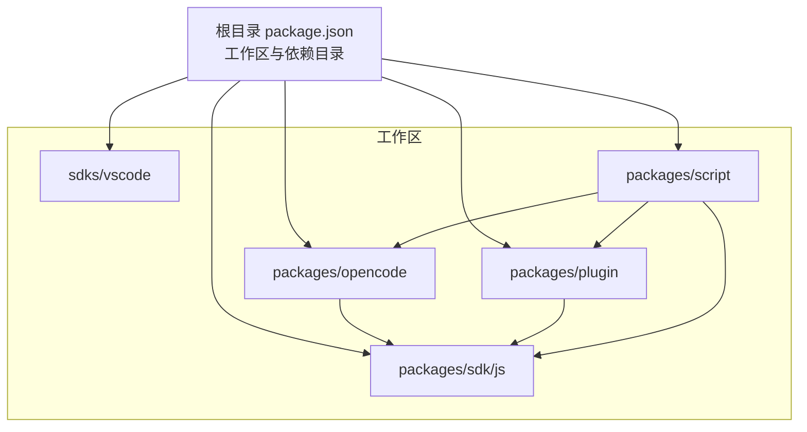
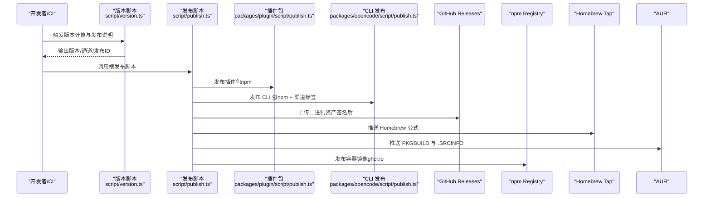
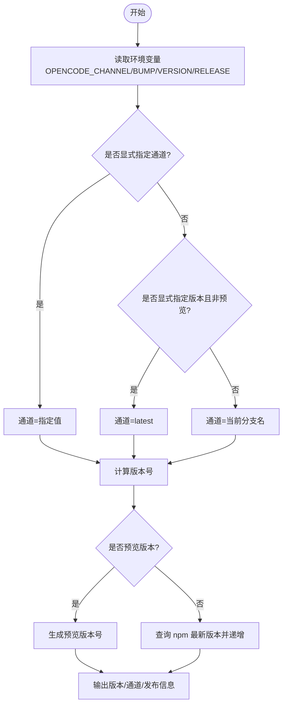
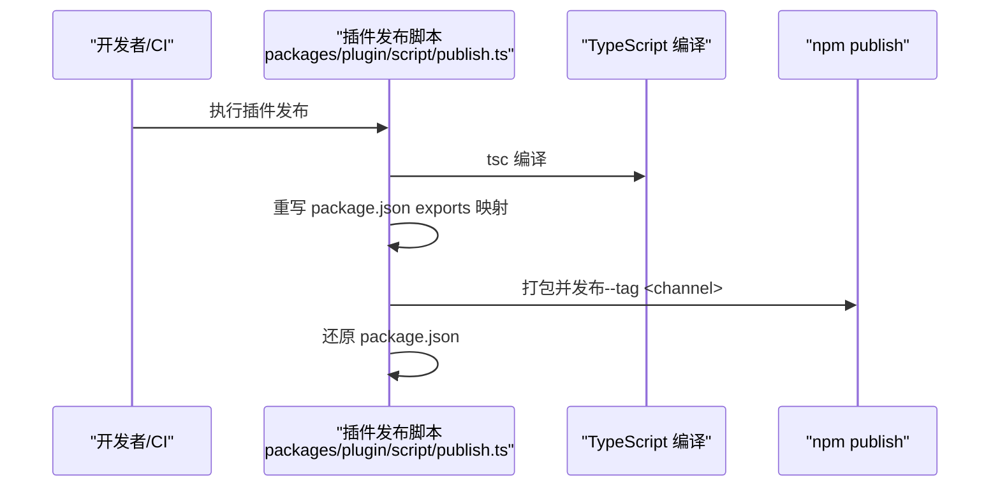
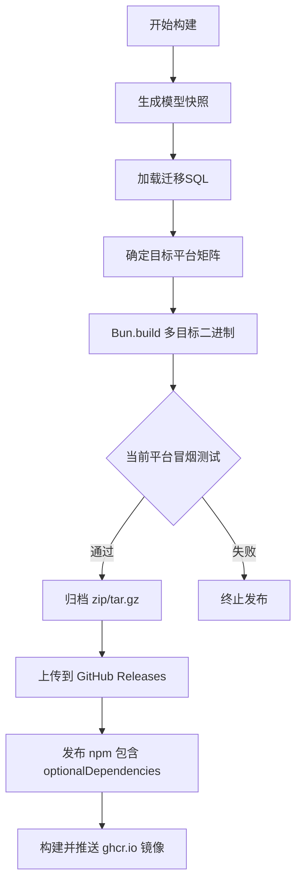
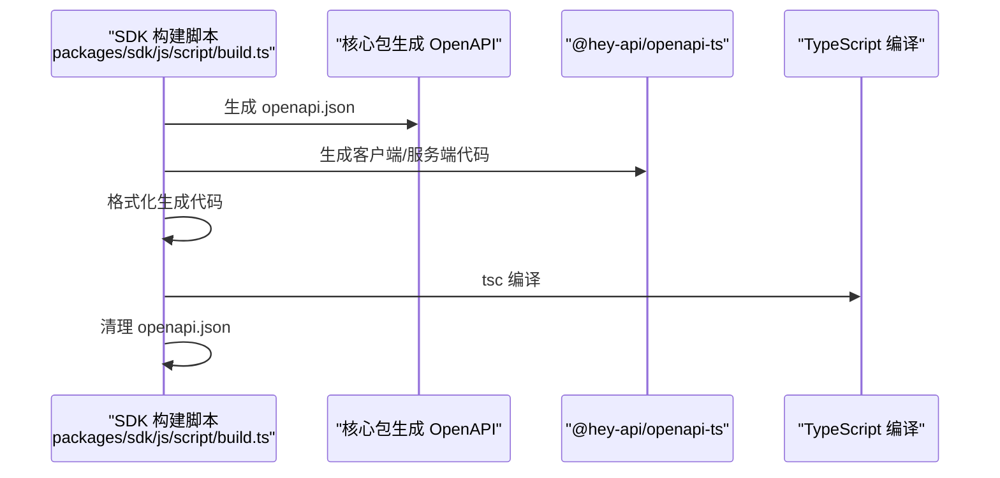
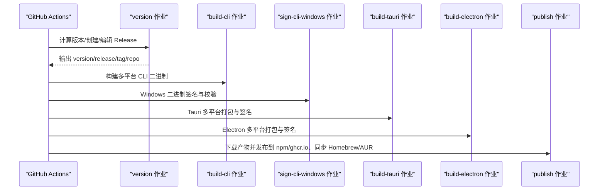
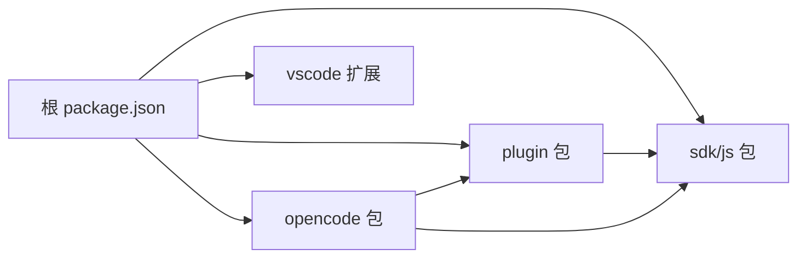

# 插件分发与发布

<cite>
**本文引用的文件**
- [README.md](file://README.md)
- [package.json](file://package.json)
- [script/publish.ts](file://script/publish.ts)
- [script/version.ts](file://script/version.ts)
- [CONTRIBUTING.md](file://CONTRIBUTING.md)
- [SECURITY.md](file://SECURITY.md)
- [packages/plugin/package.json](file://packages/plugin/package.json)
- [packages/plugin/script/publish.ts](file://packages/plugin/script/publish.ts)
- [packages/sdk/js/package.json](file://packages/sdk/js/package.json)
- [packages/sdk/js/script/build.ts](file://packages/sdk/js/script/build.ts)
- [packages/opencode/package.json](file://packages/opencode/package.json)
- [packages/opencode/script/build.ts](file://packages/opencode/script/build.ts)
- [packages/opencode/script/publish.ts](file://packages/opencode/script/publish.ts)
- [sdks/vscode/package.json](file://sdks/vscode/package.json)
- [.github/workflows/publish.yml](file://.github/workflows/publish.yml)
- [packages/script/package.json](file://packages/script/package.json)
- [packages/script/src/index.ts](file://packages/script/src/index.ts)
</cite>

## 目录
1. [简介](#简介)
2. [项目结构](#项目结构)
3. [核心组件](#核心组件)
4. [架构总览](#架构总览)
5. [详细组件分析](#详细组件分析)
6. [依赖关系分析](#依赖关系分析)
7. [性能考量](#性能考量)
8. [故障排查指南](#故障排查指南)
9. [结论](#结论)
10. [附录](#附录)

## 简介
本指南面向插件开发者与发布运维人员，系统性阐述 OpenCode 生态中“插件”的分发与发布流程，覆盖以下主题：
- 插件打包流程：代码编译、依赖处理、产物组织与发布
- 版本管理策略：语义化版本控制、通道（channel）与预发布版本、升级路径设计
- 发布渠道：npm 发布、私有仓库、企业内部分发、包管理器（Homebrew、AUR）
- 元数据管理：package.json 配置要点、README 编写与许可证声明
- 安全考虑：代码签名、依赖审计与安全扫描
- 更新机制：自动更新、手动更新与回滚策略
- 生态维护与社区贡献流程

## 项目结构
OpenCode 采用多包工作区（monorepo）组织，核心与插件相关的关键目录如下：
- packages/opencode：CLI 与服务端核心
- packages/plugin：插件 SDK 与工具集
- packages/sdk/js：JS/TS SDK 及其 OpenAPI 生成流程
- sdks/vscode：VS Code 扩展元数据与打包脚本
- script：根级发布与版本脚本
- .github/workflows：CI/CD 发布流水线
- packages/script：跨包共享的脚本工具（版本与通道逻辑）

图表来源
- [package.json:20-27](file://package.json#L20-L27)
- [packages/opencode/package.json:1-164](file://packages/opencode/package.json#L1-L164)
- [packages/plugin/package.json:1-44](file://packages/plugin/package.json#L1-L44)
- [packages/sdk/js/package.json:1-35](file://packages/sdk/js/package.json#L1-L35)
- [sdks/vscode/package.json:1-109](file://sdks/vscode/package.json#L1-L109)
- [packages/script/package.json:1-16](file://packages/script/package.json#L1-L16)

章节来源
- [package.json:20-27](file://package.json#L20-L27)
- [README.md:46-62](file://README.md#L46-L62)

## 核心组件
- 版本与通道系统：由共享脚本模块统一计算版本号、通道与预发布标识，并在 CI 中传递给各包的构建与发布脚本。
- 插件包（@opencode-ai/plugin）：定义导出入口、依赖与 peerDependencies，用于插件作者开发与发布。
- SDK 包（@opencode-ai/sdk）：包含客户端/服务端导出与 OpenAPI 生成流程，支撑上层应用与插件调用。
- CLI 包（opencode）：负责多平台二进制打包、签名、归档与发布到 GitHub Releases。
- VS Code 扩展：通过 package.json 声明命令、图标、键位绑定等元数据，使用 esbuild 打包。

章节来源
- [packages/script/src/index.ts:20-78](file://packages/script/src/index.ts#L20-L78)
- [packages/plugin/package.json:1-44](file://packages/plugin/package.json#L1-L44)
- [packages/sdk/js/package.json:1-35](file://packages/sdk/js/package.json#L1-L35)
- [packages/opencode/package.json:1-164](file://packages/opencode/package.json#L1-L164)
- [sdks/vscode/package.json:1-109](file://sdks/vscode/package.json#L1-L109)

## 架构总览
下图展示从版本计算到多渠道发布的整体流程，包括 npm、GitHub Releases、Homebrew、AUR 与容器镜像发布。

图表来源
- [script/version.ts:1-37](file://script/version.ts#L1-L37)
- [script/publish.ts:1-87](file://script/publish.ts#L1-L87)
- [packages/plugin/script/publish.ts:1-23](file://packages/plugin/script/publish.ts#L1-L23)
- [packages/opencode/script/publish.ts:1-182](file://packages/opencode/script/publish.ts#L1-L182)
- [.github/workflows/publish.yml:543-630](file://.github/workflows/publish.yml#L543-L630)

## 详细组件分析

### 组件 A：版本与通道系统
- 作用：统一计算版本号、通道（latest/beta/分支名）、是否预览版本；为 CI 提供发布说明与标签。
- 关键点：
  - 通道优先级：显式指定 > 分支名 > 预览版本（以时间戳后缀）
  - 预览版本格式：0.0.0-<channel>-<yyyymmddhhmm>
  - 正式版本：基于 npm 上次发布版本进行主/次/补丁递增
  - 产出：输出 version、release、tag、repo 等环境变量供后续步骤使用

图表来源
- [packages/script/src/index.ts:20-78](file://packages/script/src/index.ts#L20-L78)

章节来源
- [packages/script/src/index.ts:20-78](file://packages/script/src/index.ts#L20-L78)
- [script/version.ts:1-37](file://script/version.ts#L1-L37)

### 组件 B：插件包发布（npm）
- 流程概览：
  - 编译 TypeScript 源码
  - 动态调整 package.json 的 exports 字段，映射到 dist 导出
  - 打包为 .tgz 并按 channel 标签发布到 npm
  - 还原 package.json

图表来源
- [packages/plugin/script/publish.ts:1-23](file://packages/plugin/script/publish.ts#L1-L23)

章节来源
- [packages/plugin/script/publish.ts:1-23](file://packages/plugin/script/publish.ts#L1-L23)
- [packages/plugin/package.json:1-44](file://packages/plugin/package.json#L1-L44)

### 组件 C：CLI 与多平台二进制发布
- 构建阶段：
  - 生成模型快照与迁移 SQL 列表
  - 针对多平台目标（Linux/macOS/Windows + arm64/x64 + glibc/musl/无AVX2）构建二进制
  - 可选嵌入 Web UI 文件映射
  - 本地冒烟测试（仅当前平台）
- 发布阶段：
  - 归档二进制（zip/tar.gz）
  - 上传到 GitHub Releases
  - 发布 npm 包（含可选二进制依赖）与容器镜像（ghcr.io）

图表来源
- [packages/opencode/script/build.ts:1-277](file://packages/opencode/script/build.ts#L1-L277)
- [packages/opencode/script/publish.ts:1-182](file://packages/opencode/script/publish.ts#L1-L182)

章节来源
- [packages/opencode/script/build.ts:1-277](file://packages/opencode/script/build.ts#L1-L277)
- [packages/opencode/script/publish.ts:1-182](file://packages/opencode/script/publish.ts#L1-L182)

### 组件 D：SDK 包（OpenAPI 生成与构建）
- 流程概览：
  - 从核心包生成 OpenAPI JSON
  - 使用 @hey-api/openapi-ts 生成客户端/服务端代码
  - 格式化生成代码并执行 tsc 编译
  - 清理临时文件

图表来源
- [packages/sdk/js/script/build.ts:1-46](file://packages/sdk/js/script/build.ts#L1-L46)

章节来源
- [packages/sdk/js/script/build.ts:1-46](file://packages/sdk/js/script/build.ts#L1-L46)
- [packages/sdk/js/package.json:1-35](file://packages/sdk/js/package.json#L1-L35)

### 组件 E：VS Code 扩展元数据与打包
- 元数据要点：名称、显示名、描述、版本、发布者、图标、引擎要求、激活事件、命令、菜单、键位绑定
- 打包流程：类型检查、ESLint、esbuild 打包，支持生产模式与监听模式

章节来源
- [sdks/vscode/package.json:1-109](file://sdks/vscode/package.json#L1-L109)

### 组件 F：根发布脚本与 CI 工作流
- 根发布脚本：
  - 扫描所有 package.json，统一替换版本号
  - 更新 Zed 扩展版本与下载链接
  - 重新安装依赖并执行 SDK 构建
  - 条件提交/打标签/推送到远端
  - 调用各子包发布脚本（CLI、SDK、插件）
- CI 工作流：
  - 版本作业：计算版本、创建/编辑 GitHub Release、产出 release/tag/repo
  - CLI 构建与签名（Windows 使用 Azure Trusted Signing）
  - Tauri/Electron 多平台打包与签名验证
  - 发布作业：下载产物、Homebrew/AUR 同步、npm 与 ghcr.io 发布

图表来源
- [.github/workflows/publish.yml:1-630](file://.github/workflows/publish.yml#L1-L630)
- [script/publish.ts:1-87](file://script/publish.ts#L1-L87)

章节来源
- [script/publish.ts:1-87](file://script/publish.ts#L1-L87)
- [.github/workflows/publish.yml:1-630](file://.github/workflows/publish.yml#L1-L630)

## 依赖关系分析
- 工作区与依赖：
  - 根 package.json 定义工作区包集合与 catalog 依赖版本约束
  - 插件包依赖 SDK 与 zod，声明可选 UI 依赖（peerDependencies）
  - CLI 包依赖众多 AI Provider 与运行时库，同时作为可选二进制的宿主包
- 版本与通道：
  - 所有包共享同一版本号（由根发布脚本批量更新）
  - 通道（channel）决定 npm 标签与 Homebrew/AUR 公式内容

图表来源
- [package.json:20-27](file://package.json#L20-L27)
- [packages/plugin/package.json:19-42](file://packages/plugin/package.json#L19-L42)
- [packages/opencode/package.json:70-163](file://packages/opencode/package.json#L70-L163)

章节来源
- [package.json:20-27](file://package.json#L20-L27)
- [packages/plugin/package.json:1-44](file://packages/plugin/package.json#L1-L44)
- [packages/opencode/package.json:1-164](file://packages/opencode/package.json#L1-L164)

## 性能考量
- 构建性能：
  - 多平台并行构建：CI 中矩阵并行，减少总耗时
  - 选择性构建：单机构建时仅针对当前平台目标，避免不必要的交叉编译
  - 依赖缓存：Tauri/Rust 缓存、APT 包缓存、Bun 依赖缓存
- 发布效率：
  - 产物复用：下载前序作业产物，避免重复构建
  - 批量发布：根发布脚本统一更新版本，减少分散修改

## 故障排查指南
- 版本/通道问题
  - 现象：预览版本号不符合预期或未正确标注
  - 排查：确认 OPENCODE_CHANNEL/BUMP/VERSION 环境变量；核对脚本中的通道判定逻辑
- 发布失败
  - 现象：npm 发布被拒绝或权限不足
  - 排查：确保 NPM_TOKEN 或作用域权限已配置；检查 --tag 与预发布标识
- 签名失败（Windows）
  - 现象：Authenticode 签名无效
  - 排查：Azure 登录状态、证书配置、签名文件列表与校验脚本输出
- Homebrew/AUR 同步失败
  - 现象：推送失败或公式未更新
  - 排查：GITHUB_TOKEN、SSH 密钥、网络连通性；查看推送日志中的错误信息
- 依赖冲突
  - 现象：构建报错或运行时异常
  - 排查：核对 peerDependencies 与 optionalDependencies；使用 catalog 锁定版本

章节来源
- [packages/script/src/index.ts:20-78](file://packages/script/src/index.ts#L20-L78)
- [.github/workflows/publish.yml:112-211](file://.github/workflows/publish.yml#L112-L211)
- [packages/opencode/script/publish.ts:59-182](file://packages/opencode/script/publish.ts#L59-L182)

## 结论
本指南梳理了 OpenCode 生态中插件与核心产品的分发与发布体系：通过统一的版本与通道系统、严谨的 CI 工作流、多渠道发布（npm、GitHub Releases、Homebrew、AUR、容器镜像），实现稳定、可追溯、可审计的发布过程。建议在实际落地时：
- 明确版本策略与通道命名规范
- 强化安全基线（签名、审计、扫描）
- 自动化与可观察性并重，完善回滚与应急流程

## 附录

### 插件打包与发布清单
- 代码编译
  - 插件：tsc 编译
  - SDK：OpenAPI 生成 + tsc 编译
  - CLI：Bun.build 多平台二进制
- 依赖处理
  - 使用 catalog 锁定版本，避免漂移
  - peerDependencies 与 optionalDependencies 明确边界
- 文件组织
  - exports 映射至 dist
  - files 仅包含 dist
- 发布渠道
  - npm：按 channel 标签发布
  - GitHub Releases：上传签名后的二进制
  - Homebrew/AUR：同步公式与校验和
  - ghcr.io：容器镜像多架构构建与推送

章节来源
- [packages/plugin/package.json:1-44](file://packages/plugin/package.json#L1-L44)
- [packages/sdk/js/package.json:1-35](file://packages/sdk/js/package.json#L1-L35)
- [packages/opencode/package.json:1-164](file://packages/opencode/package.json#L1-L164)
- [packages/opencode/script/build.ts:1-277](file://packages/opencode/script/build.ts#L1-L277)
- [packages/opencode/script/publish.ts:1-182](file://packages/opencode/script/publish.ts#L1-L182)

### 版本管理策略
- 语义化版本：主/次/补丁三段式
- 通道与预发布：
  - latest：正式发布
  - beta/分支名：预发布通道
  - 预览版本：0.0.0-<channel>-<时间戳>
- 升级路径：
  - 通过 npm dist-tag 控制通道可见性
  - CLI 二进制 optionalDependencies 支持按平台自动选择

章节来源
- [packages/script/src/index.ts:20-78](file://packages/script/src/index.ts#L20-L78)
- [packages/opencode/script/publish.ts:26-50](file://packages/opencode/script/publish.ts#L26-L50)

### 元数据管理
- package.json 配置要点
  - name、version、license、type、exports、files、dependencies/peerDependencies
  - scripts：typecheck、build 等
- README 编写与许可证
  - README.md 展示安装与使用方式
  - license 字段与根 LICENSE 保持一致

章节来源
- [packages/plugin/package.json:1-44](file://packages/plugin/package.json#L1-L44)
- [packages/sdk/js/package.json:1-35](file://packages/sdk/js/package.json#L1-L35)
- [README.md:1-142](file://README.md#L1-L142)
- [package.json:99-99](file://package.json#L99-L99)

### 安全考虑
- 代码签名
  - Windows：Azure Trusted Signing
  - macOS：Apple 证书与 API Key
- 依赖审计与安全扫描
  - 建议在 CI 中集成依赖扫描与漏洞检测
- 安全披露
  - 遵循安全政策与披露流程

章节来源
- [.github/workflows/publish.yml:112-211](file://.github/workflows/publish.yml#L112-L211)
- [SECURITY.md:1-48](file://SECURITY.md#L1-L48)

### 更新机制
- 自动更新
  - CLI：通过 optionalDependencies 与 dist 目录中的平台二进制实现
  - 桌面应用：Tauri/Electron 的内置更新器（latest.yml）
- 手动更新
  - 用户可直接安装指定版本或通道
- 回滚策略
  - 通过 npm dist-tag 切换默认版本
  - 保留历史版本资产于 Releases

章节来源
- [packages/opencode/script/publish.ts:59-182](file://packages/opencode/script/publish.ts#L59-L182)
- [.github/workflows/publish.yml:388-542](file://.github/workflows/publish.yml#L388-L542)

### 生态维护与社区贡献
- 贡献流程
  - 遵循贡献指南与 PR 规范
  - 使用 issue 模板与常规提交规范
- 信任与审查
  - 维护 vouch 列表，保障贡献质量
- 安全响应
  - 严格审核安全报告，建立应急流程

章节来源
- [CONTRIBUTING.md:1-312](file://CONTRIBUTING.md#L1-L312)
- [SECURITY.md:1-48](file://SECURITY.md#L1-L48)