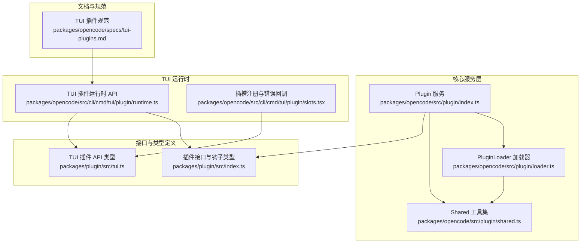
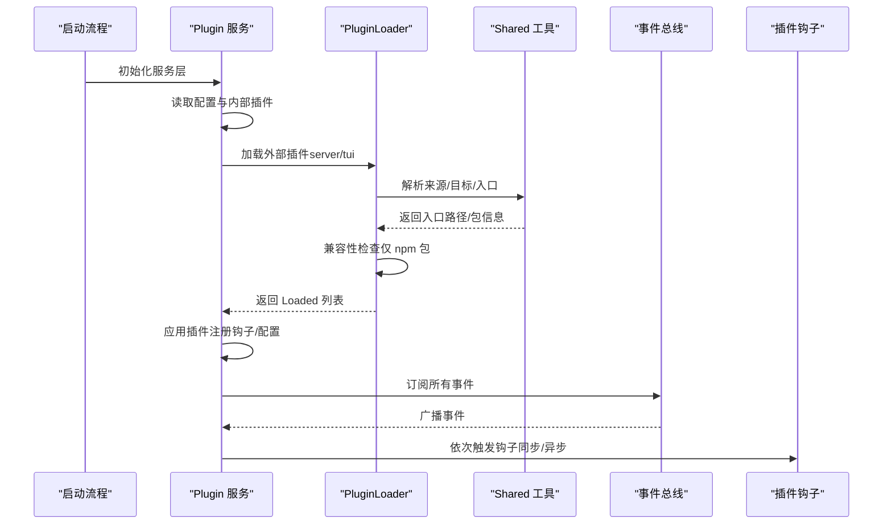
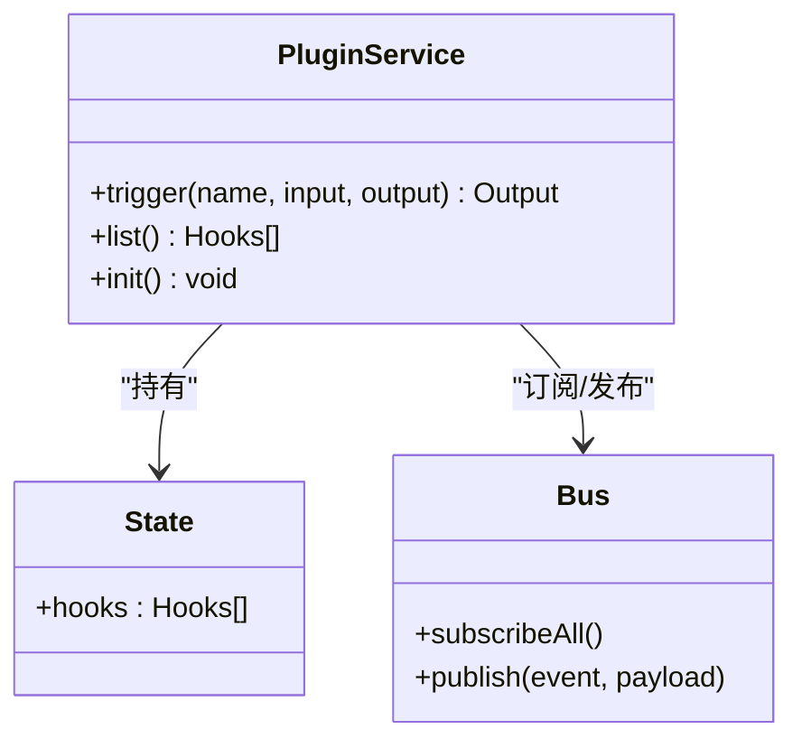
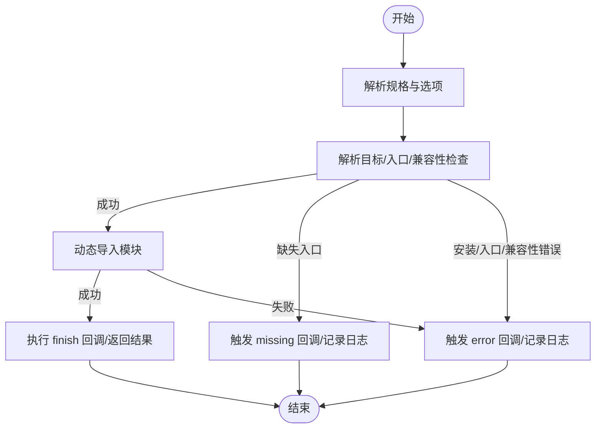
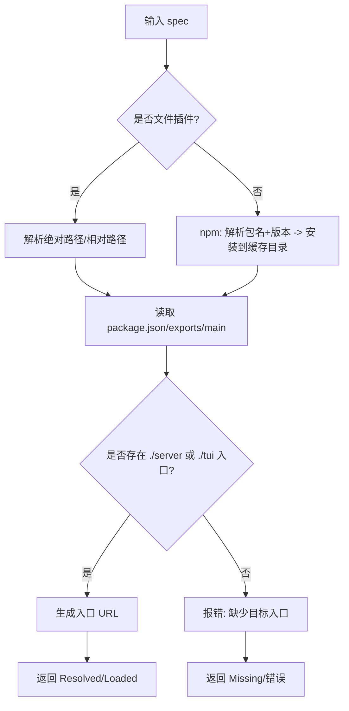
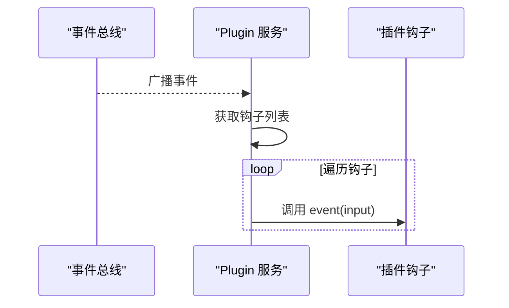
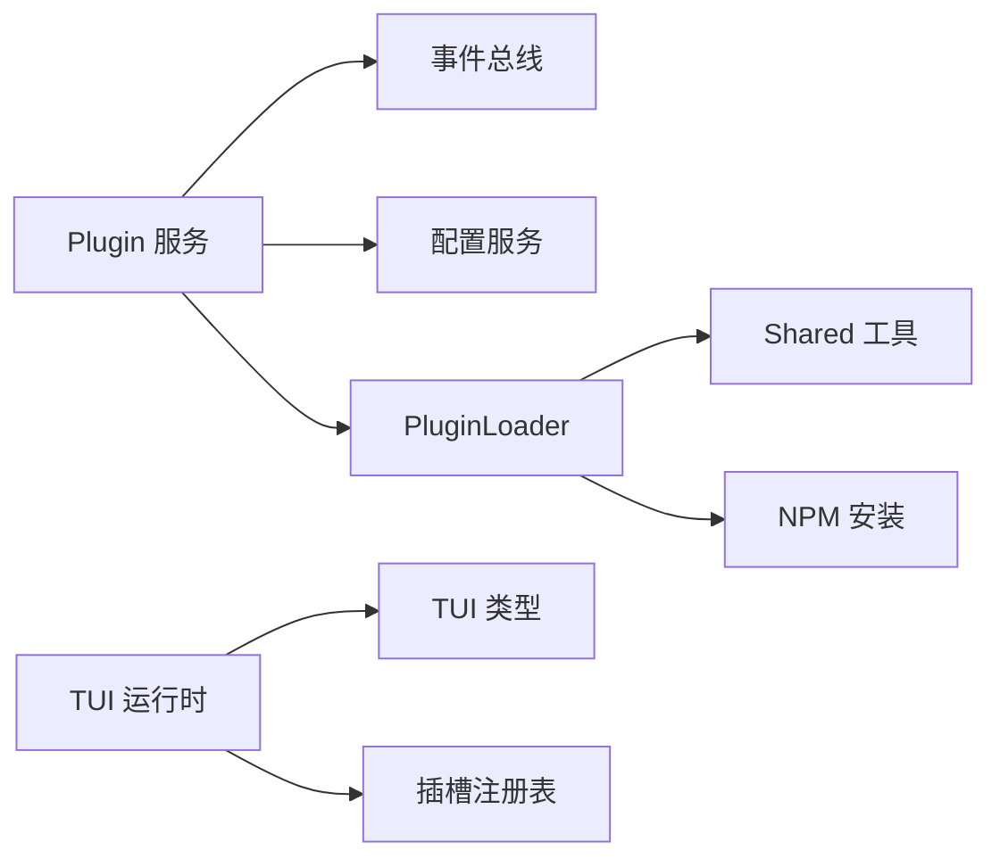

# 插件架构设计

<cite>
**本文引用的文件**   
- [packages/opencode/src/plugin/index.ts](file://packages/opencode/src/plugin/index.ts)
- [packages/opencode/src/plugin/loader.ts](file://packages/opencode/src/plugin/loader.ts)
- [packages/opencode/src/plugin/shared.ts](file://packages/opencode/src/plugin/shared.ts)
- [packages/plugin/src/index.ts](file://packages/plugin/src/index.ts)
- [packages/plugin/src/tui.ts](file://packages/plugin/src/tui.ts)
- [packages/opencode/specs/tui-plugins.md](file://packages/opencode/specs/tui-plugins.md)
- [packages/opencode/src/cli/cmd/tui/plugin/runtime.ts](file://packages/opencode/src/cli/cmd/tui/plugin/runtime.ts)
- [packages/opencode/src/cli/cmd/tui/plugin/slots.tsx](file://packages/opencode/src/cli/cmd/tui/plugin/slots.tsx)
- [packages/opencode/test/plugin/loader-shared.test.ts](file://packages/opencode/test/plugin/loader-shared.test.ts)
- [packages/opencode/test/plugin/trigger.test.ts](file://packages/opencode/test/plugin/trigger.test.ts)
</cite>

## 目录
1. [简介](#简介)
2. [项目结构](#项目结构)
3. [核心组件](#核心组件)
4. [架构总览](#架构总览)
5. [详细组件分析](#详细组件分析)
6. [依赖关系分析](#依赖关系分析)
7. [性能考量](#性能考量)
8. [故障排查指南](#故障排查指南)
9. [结论](#结论)
10. [附录](#附录)

## 简介
本文件系统化阐述 OpenCode 插件架构的设计理念与实现细节，覆盖以下主题：
- 插件接口规范与生命周期管理
- 依赖注入与运行时服务层
- 插件加载器（外部插件解析、兼容性检查、错误处理）
- 插件钩子系统（事件触发、插件间通信、状态管理）
- 内部插件与外部插件差异、加载顺序与初始化流程
- 最佳实践与设计模式

目标是帮助开发者正确设计与实现 OpenCode 插件，确保可维护性、可扩展性与稳定性。

## 项目结构
OpenCode 的插件体系由“核心服务层”“加载器层”“共享工具层”“接口定义层”“TUI 插件 API 层”等组成，围绕 Effect 服务模型与事件总线构建，支持服务器端与 TUI 双端插件。



图表来源
- [packages/opencode/src/plugin/index.ts:1-282](file://packages/opencode/src/plugin/index.ts#L1-L282)
- [packages/opencode/src/plugin/loader.ts:1-175](file://packages/opencode/src/plugin/loader.ts#L1-L175)
- [packages/opencode/src/plugin/shared.ts:1-308](file://packages/opencode/src/plugin/shared.ts#L1-L308)
- [packages/plugin/src/index.ts:1-277](file://packages/plugin/src/index.ts#L1-L277)
- [packages/plugin/src/tui.ts:1-509](file://packages/plugin/src/tui.ts#L1-L509)
- [packages/opencode/specs/tui-plugins.md:1-437](file://packages/opencode/specs/tui-plugins.md#L1-L437)
- [packages/opencode/src/cli/cmd/tui/plugin/runtime.ts:484-630](file://packages/opencode/src/cli/cmd/tui/plugin/runtime.ts#L484-L630)
- [packages/opencode/src/cli/cmd/tui/plugin/slots.tsx:33-60](file://packages/opencode/src/cli/cmd/tui/plugin/slots.tsx#L33-L60)

章节来源
- [packages/opencode/src/plugin/index.ts:1-282](file://packages/opencode/src/plugin/index.ts#L1-L282)
- [packages/opencode/src/plugin/loader.ts:1-175](file://packages/opencode/src/plugin/loader.ts#L1-L175)
- [packages/opencode/src/plugin/shared.ts:1-308](file://packages/opencode/src/plugin/shared.ts#L1-L308)
- [packages/plugin/src/index.ts:1-277](file://packages/plugin/src/index.ts#L1-L277)
- [packages/plugin/src/tui.ts:1-509](file://packages/plugin/src/tui.ts#L1-L509)
- [packages/opencode/specs/tui-plugins.md:1-437](file://packages/opencode/specs/tui-plugins.md#L1-L437)
- [packages/opencode/src/cli/cmd/tui/plugin/runtime.ts:484-630](file://packages/opencode/src/cli/cmd/tui/plugin/runtime.ts#L484-L630)
- [packages/opencode/src/cli/cmd/tui/plugin/slots.tsx:33-60](file://packages/opencode/src/cli/cmd/tui/plugin/slots.tsx#L33-L60)

## 核心组件
- 插件服务（Plugin Service）：负责加载内部与外部插件、注册钩子、订阅事件总线、触发钩子、暴露列表与初始化入口。
- 插件加载器（PluginLoader）：统一解析插件来源（文件/包）、定位目标入口（server/tui）、执行兼容性检查、导入模块并产出 Loaded 结果。
- 共享工具集（Shared）：提供插件规范解析、包元数据读取、入口解析、兼容性校验、ID 解析、v0/v1 模块读取等通用能力。
- 接口与钩子类型（packages/plugin/src/index.ts）：定义插件输入上下文、插件选项、配置结构、钩子签名（事件、配置、工具、鉴权、提供者、聊天参数/头、权限、命令/工具执行前后、Shell 环境、实验性钩子等）。
- TUI 插件 API（packages/plugin/src/tui.ts）：定义 TUI 插件 API 的类型与能力边界（命令、路由、对话框、键位绑定、主题、插槽、事件、状态、客户端、工作区、插件控制、生命周期等）。
- TUI 运行时（runtime.ts）：在 TUI 中为插件构造 API 对象，注册命令、路由、主题安装、事件监听、插槽注册，并管理插件生命周期与作用域。
- 规范文档（tui-plugins.md）：明确 TUI 插件配置、包结构、安装与版本兼容、运行时行为、内置插件与插件管理器等。

章节来源
- [packages/opencode/src/plugin/index.ts:20-282](file://packages/opencode/src/plugin/index.ts#L20-L282)
- [packages/opencode/src/plugin/loader.ts:14-175](file://packages/opencode/src/plugin/loader.ts#L14-L175)
- [packages/opencode/src/plugin/shared.ts:15-308](file://packages/opencode/src/plugin/shared.ts#L15-L308)
- [packages/plugin/src/index.ts:27-277](file://packages/plugin/src/index.ts#L27-L277)
- [packages/plugin/src/tui.ts:454-509](file://packages/plugin/src/tui.ts#L454-L509)
- [packages/opencode/specs/tui-plugins.md:1-437](file://packages/opencode/specs/tui-plugins.md#L1-L437)

## 架构总览
OpenCode 插件系统采用“服务层 + 加载器 + 钩子分发”的三层架构：
- 服务层：以 Effect 服务形式提供插件能力，包含实例状态、事件订阅、钩子触发、插件列表与初始化。
- 加载器：按来源与目标解析入口，执行兼容性检查，导入模块，产出统一 Loaded 结果。
- 钩子系统：通过事件总线广播事件，按顺序调用各插件钩子，支持同步/异步钩子与输出修改。



图表来源
- [packages/opencode/src/plugin/index.ts:94-264](file://packages/opencode/src/plugin/index.ts#L94-L264)
- [packages/opencode/src/plugin/loader.ts:152-175](file://packages/opencode/src/plugin/loader.ts#L152-L175)
- [packages/opencode/src/plugin/shared.ts:193-220](file://packages/opencode/src/plugin/shared.ts#L193-L220)

## 详细组件分析

### 插件服务（Plugin Service）
- 职责
  - 维护插件钩子集合与实例状态
  - 订阅事件总线，向所有钩子广播事件
  - 提供触发钩子（按名称与输入输出参数）、列出钩子、初始化服务
  - 支持内部插件与外部插件的加载与错误上报
- 生命周期
  - 初始化阶段：加载内部插件、等待配置依赖、加载外部插件、应用插件、通知当前配置、订阅事件
  - 运行阶段：事件驱动触发钩子，保证顺序与隔离
- 关键点
  - 钩子触发使用 Effect.promise 包装，确保同步/异步钩子一致处理
  - 错误通过会话事件发布，便于上层感知



图表来源
- [packages/opencode/src/plugin/index.ts:32-46](file://packages/opencode/src/plugin/index.ts#L32-L46)
- [packages/opencode/src/plugin/index.ts:23-25](file://packages/opencode/src/plugin/index.ts#L23-L25)
- [packages/opencode/src/plugin/index.ts:219-229](file://packages/opencode/src/plugin/index.ts#L219-L229)

章节来源
- [packages/opencode/src/plugin/index.ts:20-282](file://packages/opencode/src/plugin/index.ts#L20-L282)

### 插件加载器（PluginLoader）
- 职责
  - 将配置项转换为候选（Candidate），逐个尝试解析、加载与完成回调
  - 处理“缺失入口”“安装失败”“入口解析失败”“兼容性不满足”“导入失败”等多阶段错误
  - 支持文件插件与 npm 包插件的不同解析策略
- 流程
  - plan：解析插件规格与选项
  - resolve：解析目标、生成入口、检查兼容性（npm）
  - load：动态导入模块
  - attempt：组合上述步骤并报告错误
  - loadExternal：并发解析多个插件，必要时重试（文件插件等待依赖）



图表来源
- [packages/opencode/src/plugin/loader.ts:110-141](file://packages/opencode/src/plugin/loader.ts#L110-L141)
- [packages/opencode/src/plugin/loader.ts:152-175](file://packages/opencode/src/plugin/loader.ts#L152-L175)

章节来源
- [packages/opencode/src/plugin/loader.ts:14-175](file://packages/opencode/src/plugin/loader.ts#L14-L175)

### 共享工具集（Shared）
- 功能
  - 插件来源识别（文件/包）
  - 规格解析（包名与版本）
  - 目标解析（文件路径或 npm 安装目录）
  - 入口解析（根据 exports/main 或目录 index 文件）
  - 兼容性检查（基于 package.json engines.opencode）
  - v0/v1 模块读取（默认导出对象、server/tui 校验、id 校验）
  - 主题读取（oc-themes）
- 设计要点
  - 严格限制入口解析范围，防止越界
  - npm 包与文件插件差异化处理，避免相互混淆
  - 兼容性检查仅对 npm 包生效，文件插件跳过



图表来源
- [packages/opencode/src/plugin/shared.ts:193-220](file://packages/opencode/src/plugin/shared.ts#L193-L220)
- [packages/opencode/src/plugin/shared.ts:256-288](file://packages/opencode/src/plugin/shared.ts#L256-L288)
- [packages/opencode/src/plugin/shared.ts:180-191](file://packages/opencode/src/plugin/shared.ts#L180-L191)

章节来源
- [packages/opencode/src/plugin/shared.ts:15-308](file://packages/opencode/src/plugin/shared.ts#L15-L308)

### 钩子系统与事件总线
- 事件总线
  - 插件服务在初始化后订阅所有事件，遍历已注册钩子调用 event 钩子
- 触发机制
  - trigger(name, input, output) 仅在 name 存在时触发，按注册顺序调用每个钩子
  - 同步/异步钩子均被 Effect.promise 包裹，保证一致性
- 输出修改
  - 多个钩子可链式修改同一输出对象，遵循注册顺序
- 测试验证
  - 单测覆盖同步钩子与异步钩子的行为，确保不会崩溃且顺序正确



图表来源
- [packages/opencode/src/plugin/index.ts:219-229](file://packages/opencode/src/plugin/index.ts#L219-L229)

章节来源
- [packages/opencode/src/plugin/index.ts:235-248](file://packages/opencode/src/plugin/index.ts#L235-L248)
- [packages/opencode/test/plugin/trigger.test.ts:44-111](file://packages/opencode/test/plugin/trigger.test.ts#L44-L111)

### TUI 插件 API 与运行时
- API 能力
  - 命令注册与触发、路由注册与导航、对话框与提示、键位绑定、主题安装与切换、插槽注册、事件订阅、状态与客户端访问、插件控制（启用/禁用/添加/安装）、生命周期清理
- 运行时构造
  - 为插件构造 api 对象，包装 host 能力，注入插件自身 load 信息与主题安装器
  - 注册命令、路由、事件、插槽，返回插件作用域以支持清理
- 插槽系统
  - 通过 Solid 插槽注册表统一管理插槽，提供错误回调与上下文（如 theme）

```mermaid
classDiagram
class TuiPluginApi {
+command.register(cb) : () => void
+command.trigger(value) : void
+route.register(list) : () => void
+route.navigate(name, params?) : void
+theme.install(jsonPath) : void
+event.on(type, handler) : () => void
+slots.register(plugin) : string
+plugins.{list, activate, deactivate, add, install}
+lifecycle.{signal, onDispose}
}
class Runtime {
+pluginApi(runtime, plugin, scope, base) : TuiPluginApi
}
Runtime --> TuiPluginApi : "构造并注入"
```

图表来源
- [packages/opencode/src/cli/cmd/tui/plugin/runtime.ts:484-531](file://packages/opencode/src/cli/cmd/tui/plugin/runtime.ts#L484-L531)
- [packages/opencode/src/cli/cmd/tui/plugin/runtime.ts:595-630](file://packages/opencode/src/cli/cmd/tui/plugin/runtime.ts#L595-L630)
- [packages/opencode/src/cli/cmd/tui/plugin/slots.tsx:33-60](file://packages/opencode/src/cli/cmd/tui/plugin/slots.tsx#L33-L60)
- [packages/plugin/src/tui.ts:454-509](file://packages/plugin/src/tui.ts#L454-L509)

章节来源
- [packages/opencode/src/cli/cmd/tui/plugin/runtime.ts:484-630](file://packages/opencode/src/cli/cmd/tui/plugin/runtime.ts#L484-L630)
- [packages/opencode/src/cli/cmd/tui/plugin/slots.tsx:33-60](file://packages/opencode/src/cli/cmd/tui/plugin/slots.tsx#L33-L60)
- [packages/plugin/src/tui.ts:1-509](file://packages/plugin/src/tui.ts#L1-L509)

### 内部插件与外部插件
- 内部插件
  - 直接导入，无需安装，优先加载；用于内置能力（如鉴权插件）
  - 初始化失败会被记录但不影响其他插件加载
- 外部插件
  - 来自配置（server/tui），支持文件与 npm 两种来源
  - npm 包需满足 engines.opencode 版本范围
  - 通过 PluginLoader 并发解析，必要时等待依赖后重试
- 加载顺序与初始化
  - 服务器端：内部插件先于外部插件；外部插件按配置顺序加载，逐个应用
  - TUI：内部插件先于外部插件；外部插件激活顺序保持确定性，主题自动同步在运行前完成

章节来源
- [packages/opencode/src/plugin/index.ts:48-142](file://packages/opencode/src/plugin/index.ts#L48-L142)
- [packages/opencode/specs/tui-plugins.md:374-399](file://packages/opencode/specs/tui-plugins.md#L374-L399)

## 依赖关系分析
- 服务层依赖
  - 事件总线：用于订阅/发布事件
  - 配置服务：读取插件配置与依赖等待
  - 服务器客户端：提供本地/远程访问能力
- 加载器依赖
  - 共享工具：解析入口、兼容性检查、包元数据读取
  - NPM：安装 npm 包
- 运行时依赖
  - TUI API 类型：约束插件可用能力
  - 插槽注册表：统一插槽渲染与错误处理



图表来源
- [packages/opencode/src/plugin/index.ts:94-115](file://packages/opencode/src/plugin/index.ts#L94-L115)
- [packages/opencode/src/plugin/loader.ts:1-12](file://packages/opencode/src/plugin/loader.ts#L1-L12)
- [packages/opencode/src/cli/cmd/tui/plugin/runtime.ts:484-531](file://packages/opencode/src/cli/cmd/tui/plugin/runtime.ts#L484-L531)

章节来源
- [packages/opencode/src/plugin/index.ts:94-115](file://packages/opencode/src/plugin/index.ts#L94-L115)
- [packages/opencode/src/plugin/loader.ts:1-12](file://packages/opencode/src/plugin/loader.ts#L1-L12)

## 性能考量
- 并发与顺序
  - 外部插件解析并发进行，但应用阶段（服务器端）保持顺序，确保钩子注册与执行顺序稳定
  - TUI 插件激活顺序也保持确定性，避免副作用交错
- 导入与兼容性
  - npm 包兼容性检查仅在包级别执行一次，避免重复开销
  - 文件插件跳过兼容性检查，减少不必要的 IO
- 错误短路
  - 解析/安装/兼容性阶段出现错误立即短路，避免无效导入
- 清理与资源回收
  - 插件生命周期提供 onDispose 注册，确保资源释放与回滚

[本节为通用指导，不直接分析具体文件]

## 故障排查指南
- 常见问题与定位
  - “缺少 server/tui 入口”：检查 package.json exports 或入口文件是否存在
  - “版本不兼容”：核对 engines.opencode 与当前版本范围
  - “导入失败”：确认入口路径有效、模块默认导出符合规范
  - “插件未加载”：查看日志中的 start/missing/error 报告，定位阶段
- 上报与展示
  - 服务层将错误转化为会话事件，便于前端或日志系统捕获
- 单测参考
  - 加载器测试覆盖了 missing/finish 场景与入口解析
  - 钩子触发测试覆盖同步/异步钩子行为

章节来源
- [packages/opencode/src/plugin/index.ts:149-182](file://packages/opencode/src/plugin/index.ts#L149-L182)
- [packages/opencode/test/plugin/loader-shared.test.ts:897-985](file://packages/opencode/test/plugin/loader-shared.test.ts#L897-L985)
- [packages/opencode/test/plugin/trigger.test.ts:44-111](file://packages/opencode/test/plugin/trigger.test.ts#L44-L111)

## 结论
OpenCode 插件架构以 Effect 服务为核心，结合严格的入口解析、兼容性检查与事件驱动的钩子系统，实现了高内聚、低耦合、可扩展的插件生态。服务器端与 TUI 双端插件共享统一的接口与生命周期管理，既保证了运行时的一致性，也为开发者提供了清晰的扩展点与最佳实践路径。

[本节为总结性内容，不直接分析具体文件]

## 附录

### 插件接口规范与钩子清单
- 输入上下文：客户端、项目、工作树、目录、服务器 URL、Shell 工具
- 钩子类别：事件、配置、工具、鉴权、提供者、聊天消息/参数/头、权限请求、命令/工具执行前后、Shell 环境、实验性钩子（消息/系统/会话压缩/文本补全/工具定义）
- TUI 插件模块：默认导出 { id?, tui }，不可同时包含 server

章节来源
- [packages/plugin/src/index.ts:27-277](file://packages/plugin/src/index.ts#L27-L277)
- [packages/plugin/src/tui.ts:504-509](file://packages/plugin/src/tui.ts#L504-L509)

### TUI 插件配置与安装
- 配置项：plugin、plugin_enabled、theme 等
- 安装流程：安装 → 读取清单 → 写入配置，保留 JSONC 注释
- 兼容性：通过 engines.opencode 校验版本范围
- 运行时：内部插件优先，外部插件按配置加载，主题自动同步

章节来源
- [packages/opencode/specs/tui-plugins.md:15-437](file://packages/opencode/specs/tui-plugins.md#L15-L437)