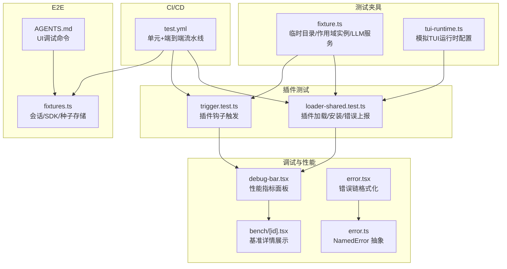
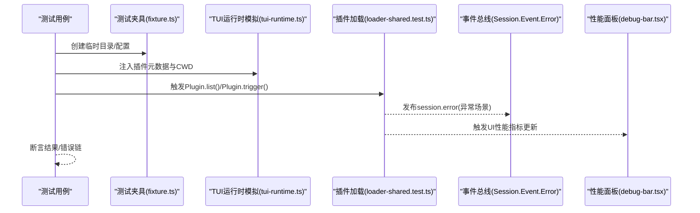
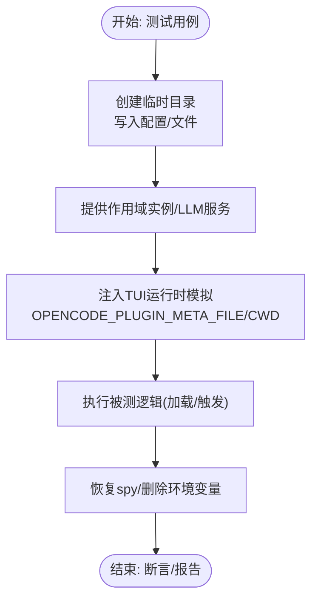
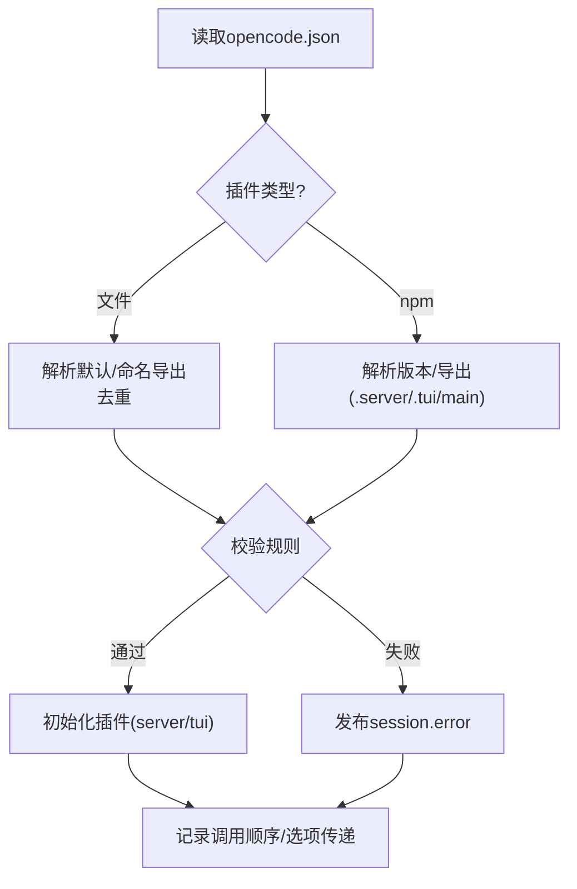
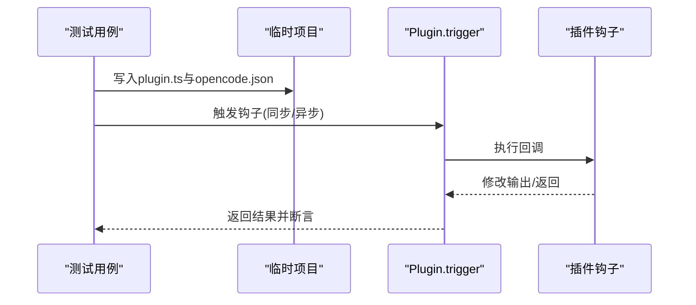
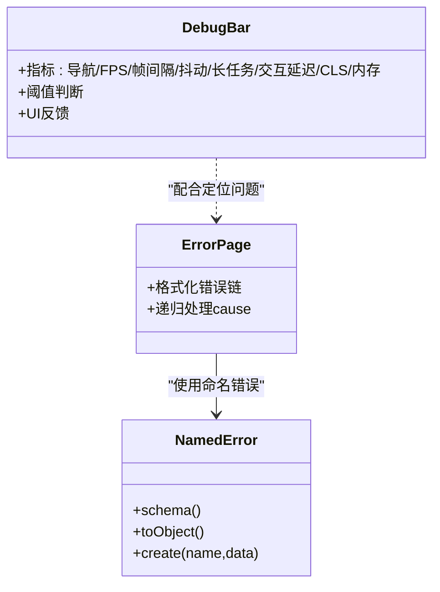
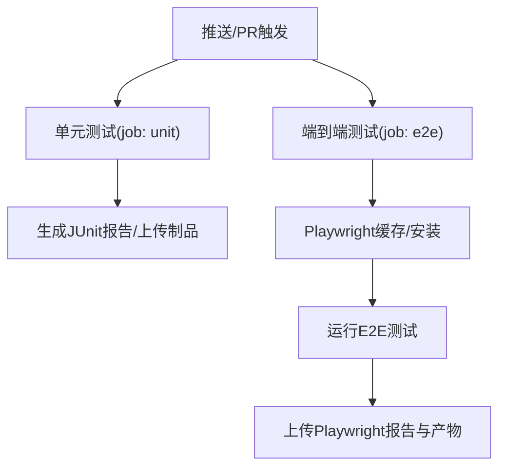
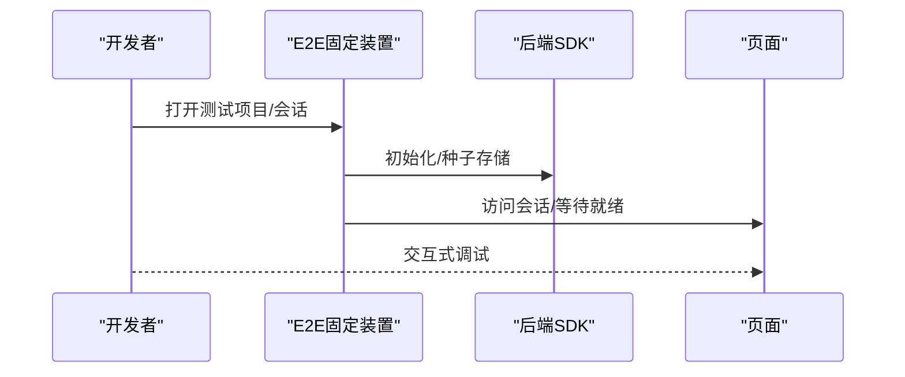
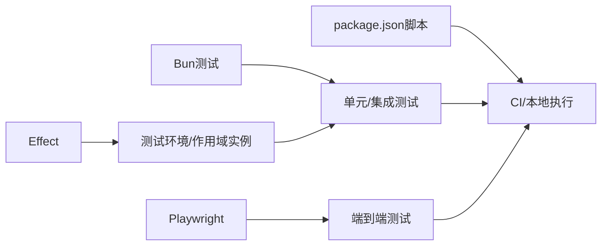
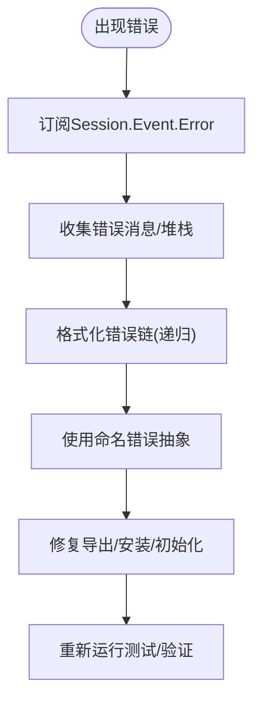

# 插件测试与调试

<cite>
**本文引用的文件**
- [packages/opencode/test/fixture/fixture.ts](file://packages/opencode/test/fixture/fixture.ts)
- [packages/opencode/test/fixture/tui-runtime.ts](file://packages/opencode/test/fixture/tui-runtime.ts)
- [packages/opencode/test/plugin/loader-shared.test.ts](file://packages/opencode/test/plugin/loader-shared.test.ts)
- [packages/opencode/test/plugin/trigger.test.ts](file://packages/opencode/test/plugin/trigger.test.ts)
- [packages/opencode/test/lib/effect.ts](file://packages/opencode/test/lib/effect.ts)
- [packages/opencode/test/fake/provider.ts](file://packages/opencode/test/fake/provider.ts)
- [.github/workflows/test.yml](file://.github/workflows/test.yml)
- [packages/app/src/components/debug-bar.tsx](file://packages/app/src/components/debug-bar.tsx)
- [packages/console/app/src/routes/bench/[id].tsx](file://packages/console/app/src/routes/bench/[id].tsx)
- [packages/app/src/pages/error.tsx](file://packages/app/src/pages/error.tsx)
- [packages/util/src/error.ts](file://packages/util/src/error.ts)
- [packages/app/e2e/fixtures.ts](file://packages/app/e2e/fixtures.ts)
- [packages/app/e2e/AGENTS.md](file://packages/app/e2e/AGENTS.md)
- [package.json](file://package.json)
</cite>

## 目录
1. [引言](#引言)
2. [项目结构](#项目结构)
3. [核心组件](#核心组件)
4. [架构总览](#架构总览)
5. [详细组件分析](#详细组件分析)
6. [依赖分析](#依赖分析)
7. [性能考虑](#性能考虑)
8. [故障排查指南](#故障排查指南)
9. [结论](#结论)
10. [附录](#附录)

## 引言
本指南聚焦于插件测试与调试的系统性方法，覆盖单元测试、集成测试与端到端测试的设计与实施；涵盖日志记录、断点调试与性能分析；提供测试环境搭建（测试数据、模拟对象、工具）；总结错误诊断（常见错误类型、定位与修复策略）；并给出测试自动化（CI/CD 集成、持续测试实践）与性能测试优化（内存、执行时间、资源消耗）建议。内容基于仓库中的测试夹具、测试用例、调试组件与 CI 工作流进行提炼。

## 项目结构
围绕插件测试与调试的关键目录与文件：
- 测试夹具与辅助：用于快速构建临时项目、注入环境变量、模拟运行时等
- 插件加载与触发测试：验证插件解析、安装、初始化、错误上报与钩子触发
- 调试与性能观测：前端调试栏、基准页面、错误格式化与命名错误抽象
- CI/CD：GitHub Actions 中的单元与端到端测试流水线
- E2E 固定装置：会话导航、SDK 初始化、种子存储等

**图表来源**
- [packages/opencode/test/fixture/fixture.ts:1-173](file://packages/opencode/test/fixture/fixture.ts#L1-L173)
- [packages/opencode/test/fixture/tui-runtime.ts:1-28](file://packages/opencode/test/fixture/tui-runtime.ts#L1-L28)
- [packages/opencode/test/plugin/loader-shared.test.ts:1-800](file://packages/opencode/test/plugin/loader-shared.test.ts#L1-L800)
- [packages/opencode/test/plugin/trigger.test.ts:1-112](file://packages/opencode/test/plugin/trigger.test.ts#L1-L112)
- [packages/app/src/components/debug-bar.tsx:1-430](file://packages/app/src/components/debug-bar.tsx#L1-L430)
- [packages/console/app/src/routes/bench/[id].tsx:74-252](file://packages/console/app/src/routes/bench/[id].tsx#L74-L252)
- [packages/app/src/pages/error.tsx:77-219](file://packages/app/src/pages/error.tsx#L77-L219)
- [packages/util/src/error.ts:1-54](file://packages/util/src/error.ts#L1-L54)
- [packages/app/e2e/fixtures.ts:336-375](file://packages/app/e2e/fixtures.ts#L336-L375)
- [packages/app/e2e/AGENTS.md:217-226](file://packages/app/e2e/AGENTS.md#L217-L226)
- [.github/workflows/test.yml:1-148](file://.github/workflows/test.yml#L1-L148)

**章节来源**
- [packages/opencode/test/fixture/fixture.ts:1-173](file://packages/opencode/test/fixture/fixture.ts#L1-L173)
- [packages/opencode/test/fixture/tui-runtime.ts:1-28](file://packages/opencode/test/fixture/tui-runtime.ts#L1-L28)
- [packages/opencode/test/plugin/loader-shared.test.ts:1-800](file://packages/opencode/test/plugin/loader-shared.test.ts#L1-L800)
- [packages/opencode/test/plugin/trigger.test.ts:1-112](file://packages/opencode/test/plugin/trigger.test.ts#L1-L112)
- [packages/app/src/components/debug-bar.tsx:1-430](file://packages/app/src/components/debug-bar.tsx#L1-L430)
- [packages/console/app/src/routes/bench/[id].tsx:74-252](file://packages/console/app/src/routes/bench/[id].tsx#L74-L252)
- [packages/app/src/pages/error.tsx:77-219](file://packages/app/src/pages/error.tsx#L77-L219)
- [packages/util/src/error.ts:1-54](file://packages/util/src/error.ts#L1-L54)
- [packages/app/e2e/fixtures.ts:336-375](file://packages/app/e2e/fixtures.ts#L336-L375)
- [packages/app/e2e/AGENTS.md:217-226](file://packages/app/e2e/AGENTS.md#L217-L226)
- [.github/workflows/test.yml:1-148](file://.github/workflows/test.yml#L1-L148)

## 核心组件
- 测试夹具与环境
  - 临时目录与清理：提供可异步释放的临时目录，支持 git 初始化、写入配置、清理与守护进程停止
  - 作用域实例：在 Effect 环境下提供实例生命周期管理，确保测试隔离与资源回收
  - LLM 测试服务器：为需要模型调用的测试提供可控的本地服务
  - TUI 运行时模拟：注入插件元数据与配置，模拟 TUI 环境下的插件解析
- 插件测试
  - 加载与安装：验证文件/包形式插件、导出解析、版本解析、安全边界检查、错误事件发布
  - 触发机制：验证同步/异步钩子的触发顺序与结果
- 调试与性能
  - 性能面板：导航耗时、FPS、帧间隔、抖动、长任务、交互延迟、CLS、内存占比等
  - 基准详情：平均耗时、评分、成本、运行明细
  - 错误链格式化：递归格式化错误链，便于定位根因
  - 命名错误抽象：统一错误结构，便于序列化与传输
- CI/CD
  - 单元测试：跨平台矩阵、缓存、报告上传
  - 端到端测试：Playwright 安装与缓存、浏览器安装、报告与产物上传
- E2E 固定装置
  - 项目创建、SDK 初始化、种子存储、会话等待与路径跟踪

**章节来源**
- [packages/opencode/test/fixture/fixture.ts:1-173](file://packages/opencode/test/fixture/fixture.ts#L1-L173)
- [packages/opencode/test/fixture/tui-runtime.ts:1-28](file://packages/opencode/test/fixture/tui-runtime.ts#L1-L28)
- [packages/opencode/test/plugin/loader-shared.test.ts:1-800](file://packages/opencode/test/plugin/loader-shared.test.ts#L1-L800)
- [packages/opencode/test/plugin/trigger.test.ts:1-112](file://packages/opencode/test/plugin/trigger.test.ts#L1-L112)
- [packages/app/src/components/debug-bar.tsx:1-430](file://packages/app/src/components/debug-bar.tsx#L1-L430)
- [packages/console/app/src/routes/bench/[id].tsx:74-252](file://packages/console/app/src/routes/bench/[id].tsx#L74-L252)
- [packages/app/src/pages/error.tsx:77-219](file://packages/app/src/pages/error.tsx#L77-L219)
- [packages/util/src/error.ts:1-54](file://packages/util/src/error.ts#L1-L54)
- [packages/app/e2e/fixtures.ts:336-375](file://packages/app/e2e/fixtures.ts#L336-L375)
- [.github/workflows/test.yml:1-148](file://.github/workflows/test.yml#L1-L148)

## 架构总览
下图展示了从测试夹具到插件加载、错误上报、性能观测与 CI 的整体流程。

**图表来源**
- [packages/opencode/test/fixture/fixture.ts:1-173](file://packages/opencode/test/fixture/fixture.ts#L1-L173)
- [packages/opencode/test/fixture/tui-runtime.ts:1-28](file://packages/opencode/test/fixture/tui-runtime.ts#L1-L28)
- [packages/opencode/test/plugin/loader-shared.test.ts:1-800](file://packages/opencode/test/plugin/loader-shared.test.ts#L1-L800)
- [packages/app/src/components/debug-bar.tsx:1-430](file://packages/app/src/components/debug-bar.tsx#L1-L430)

## 详细组件分析

### 测试夹具与环境
- 临时目录与清理
  - 提供异步可释放的临时目录，支持 git 初始化、写入 opencode.json 配置、清理与守护进程停止
  - 作用域实例：在 Effect 环境下提供实例生命周期管理，确保测试隔离与资源回收
  - LLM 测试服务器：为需要模型调用的测试提供可控的本地服务
- TUI 运行时模拟
  - 注入 OPENCODE_PLUGIN_META_FILE，模拟 TuiConfig.get/waitForDependencies 返回值，并替换 process.cwd
  - 返回恢复函数，确保测试后清理

**图表来源**
- [packages/opencode/test/fixture/fixture.ts:1-173](file://packages/opencode/test/fixture/fixture.ts#L1-L173)
- [packages/opencode/test/fixture/tui-runtime.ts:1-28](file://packages/opencode/test/fixture/tui-runtime.ts#L1-L28)

**章节来源**
- [packages/opencode/test/fixture/fixture.ts:1-173](file://packages/opencode/test/fixture/fixture.ts#L1-L173)
- [packages/opencode/test/fixture/tui-runtime.ts:1-28](file://packages/opencode/test/fixture/tui-runtime.ts#L1-L28)

### 插件加载与错误上报
- 加载策略
  - 支持文件协议插件函数导出、默认与命名导出去重、v1 server 插件优先、npm 包解析与导出解析
  - 安全边界：拒绝同时导出 server 与 tui、拒绝解析到插件目录外的导出、跳过历史认证插件
- 错误上报
  - 安装失败、初始化抛错、无效导出、导入失败均通过 Session.Event.Error 发布
  - 测试中订阅该事件收集错误消息，断言错误内容与传播

**图表来源**
- [packages/opencode/test/plugin/loader-shared.test.ts:1-800](file://packages/opencode/test/plugin/loader-shared.test.ts#L1-L800)

**章节来源**
- [packages/opencode/test/plugin/loader-shared.test.ts:1-800](file://packages/opencode/test/plugin/loader-shared.test.ts#L1-L800)

### 插件钩子触发
- 同步钩子：直接修改输出对象
- 异步钩子：等待 Promise 完成后再返回
- 通过 Plugin.trigger 调用，结合临时项目与 opencode.json 配置进行验证

**图表来源**
- [packages/opencode/test/plugin/trigger.test.ts:1-112](file://packages/opencode/test/plugin/trigger.test.ts#L1-L112)

**章节来源**
- [packages/opencode/test/plugin/trigger.test.ts:1-112](file://packages/opencode/test/plugin/trigger.test.ts#L1-L112)

### 调试与性能观测
- 性能面板
  - 指标：导航耗时、FPS、帧间隔、抖动、长任务、交互延迟、CLS、内存占比
  - 阈值判断与视觉反馈，便于快速识别性能瓶颈
- 基准详情
  - 展示平均耗时、评分、成本、运行明细，支持按任务维度查看
- 错误链格式化
  - 递归格式化错误链，避免重复栈头，支持字符串与对象错误
- 命名错误抽象
  - 统一错误结构，便于序列化与传输

**图表来源**
- [packages/app/src/components/debug-bar.tsx:1-430](file://packages/app/src/components/debug-bar.tsx#L1-L430)
- [packages/app/src/pages/error.tsx:77-219](file://packages/app/src/pages/error.tsx#L77-L219)
- [packages/util/src/error.ts:1-54](file://packages/util/src/error.ts#L1-L54)

**章节来源**
- [packages/app/src/components/debug-bar.tsx:1-430](file://packages/app/src/components/debug-bar.tsx#L1-L430)
- [packages/console/app/src/routes/bench/[id].tsx:74-252](file://packages/console/app/src/routes/bench/[id].tsx#L74-L252)
- [packages/app/src/pages/error.tsx:77-219](file://packages/app/src/pages/error.tsx#L77-L219)
- [packages/util/src/error.ts:1-54](file://packages/util/src/error.ts#L1-L54)

### CI/CD 与测试自动化
- 单元测试
  - 并行矩阵：Linux/Windows
  - 缓存：Turbo 缓存
  - 报告：JUnit XML，上传报告与制品
- 端到端测试
  - Playwright 版本读取与缓存
  - 系统依赖安装与浏览器安装
  - 报告与产物上传

**图表来源**
- [.github/workflows/test.yml:1-148](file://.github/workflows/test.yml#L1-L148)

**章节来源**
- [.github/workflows/test.yml:1-148](file://.github/workflows/test.yml#L1-L148)

### E2E 固定装置与 UI 调试
- 固定装置
  - 创建测试项目、SDK 初始化、种子存储、会话等待、路径跟踪
- UI 调试
  - 提供交互式 UI 调试命令，便于逐步调试

**图表来源**
- [packages/app/e2e/fixtures.ts:336-375](file://packages/app/e2e/fixtures.ts#L336-L375)
- [packages/app/e2e/AGENTS.md:217-226](file://packages/app/e2e/AGENTS.md#L217-L226)

**章节来源**
- [packages/app/e2e/fixtures.ts:336-375](file://packages/app/e2e/fixtures.ts#L336-L375)
- [packages/app/e2e/AGENTS.md:217-226](file://packages/app/e2e/AGENTS.md#L217-L226)

## 依赖分析
- 测试框架与工具
  - Bun 测试：用于单元与集成测试
  - Playwright：用于端到端测试
  - Effect：用于可组合的测试环境与作用域实例
- 项目脚本
  - 根目录脚本定义了开发与测试入口，便于本地与 CI 使用

**图表来源**
- [package.json:1-124](file://package.json#L1-L124)
- [.github/workflows/test.yml:1-148](file://.github/workflows/test.yml#L1-L148)

**章节来源**
- [package.json:1-124](file://package.json#L1-L124)
- [.github/workflows/test.yml:1-148](file://.github/workflows/test.yml#L1-L148)

## 性能考虑
- 性能指标采集
  - 使用性能面板监控导航耗时、FPS、帧间隔、抖动、长任务、交互延迟、CLS、内存占比
- 基准页面
  - 展示平均耗时、评分、成本与运行明细，便于对比不同实现
- 插件初始化顺序
  - 保证按配置顺序初始化，避免并发导致的竞态与不可预期行为
- 资源回收
  - 通过作用域实例与临时目录清理，避免测试间相互影响

**章节来源**
- [packages/app/src/components/debug-bar.tsx:1-430](file://packages/app/src/components/debug-bar.tsx#L1-L430)
- [packages/console/app/src/routes/bench/[id].tsx:74-252](file://packages/console/app/src/routes/bench/[id].tsx#L74-L252)
- [packages/opencode/test/plugin/loader-shared.test.ts:743-790](file://packages/opencode/test/plugin/loader-shared.test.ts#L743-L790)
- [packages/opencode/test/fixture/fixture.ts:121-155](file://packages/opencode/test/fixture/fixture.ts#L121-L155)

## 故障排查指南
- 常见错误类型
  - 插件未导出 id 或同时导出 server 与 tui
  - 解析到插件目录外的导出
  - 安装失败、初始化抛错、无效导出、导入缺失
- 错误定位
  - 订阅 Session.Event.Error 获取错误消息
  - 使用错误链格式化工具递归查看 cause
  - 结合命名错误抽象统一错误结构
- 修复策略
  - 修正插件导出规范（id、server/tui 二选一）
  - 确保导出路径位于插件目录内
  - 修复安装依赖与初始化逻辑，补充必要字段与校验

**图表来源**
- [packages/opencode/test/plugin/loader-shared.test.ts:187-672](file://packages/opencode/test/plugin/loader-shared.test.ts#L187-L672)
- [packages/app/src/pages/error.tsx:77-219](file://packages/app/src/pages/error.tsx#L77-L219)
- [packages/util/src/error.ts:1-54](file://packages/util/src/error.ts#L1-L54)

**章节来源**
- [packages/opencode/test/plugin/loader-shared.test.ts:187-672](file://packages/opencode/test/plugin/loader-shared.test.ts#L187-L672)
- [packages/app/src/pages/error.tsx:77-219](file://packages/app/src/pages/error.tsx#L77-L219)
- [packages/util/src/error.ts:1-54](file://packages/util/src/error.ts#L1-L54)

## 结论
本指南基于仓库中的测试夹具、插件加载与触发测试、调试组件与 CI 工作流，给出了插件测试与调试的系统方法。通过临时目录与作用域实例确保测试隔离，通过错误链与命名错误抽象提升诊断效率，借助性能面板与基准页面量化性能，结合 CI/CD 实现持续测试与自动化。建议在实际工程中遵循相同模式，完善测试数据与模拟对象，建立稳定的测试环境与报告体系。

## 附录
- 测试策略清单
  - 单元测试：插件导出解析、安装与初始化、错误上报
  - 集成测试：插件加载顺序、选项传递、钩子触发
  - 端到端测试：会话导航、交互调试、报告与产物
- 调试技巧清单
  - 日志记录：事件总线与错误链
  - 断点调试：Playwright 交互式 UI
  - 性能分析：性能面板与基准页面
- 自动化清单
  - CI/CD：单元与端到端流水线、报告与制品上传
  - 持续测试：矩阵并行、缓存与超时控制