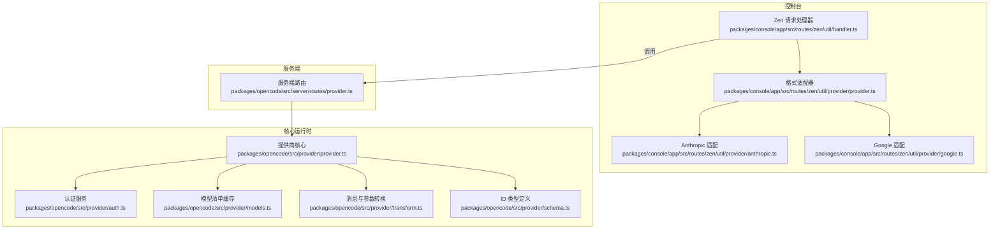
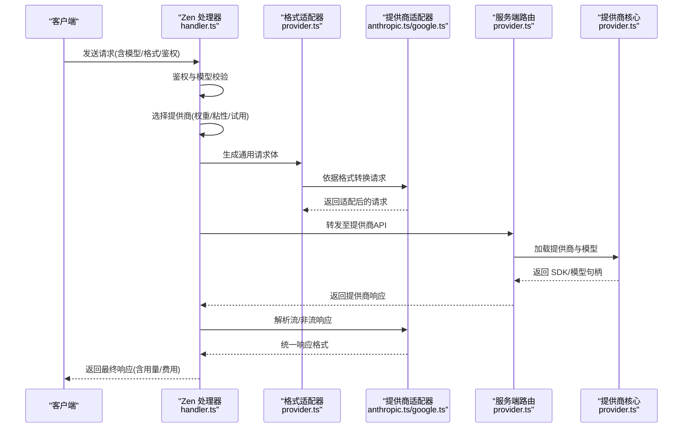
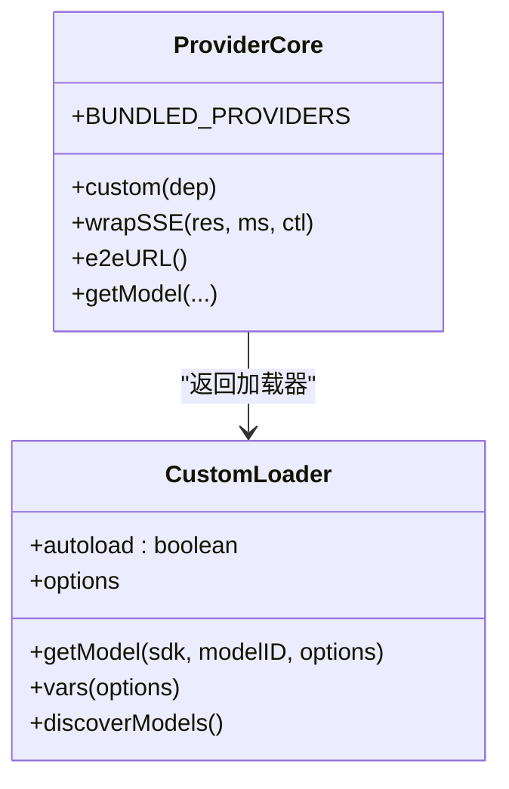
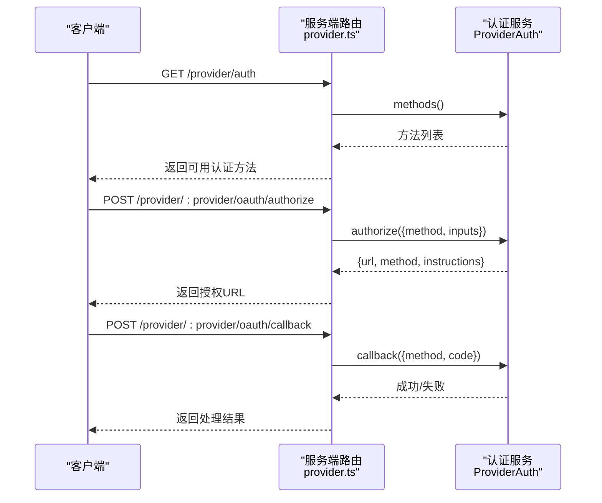
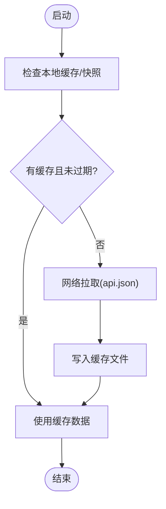
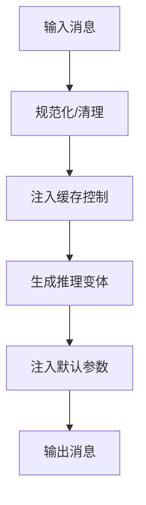
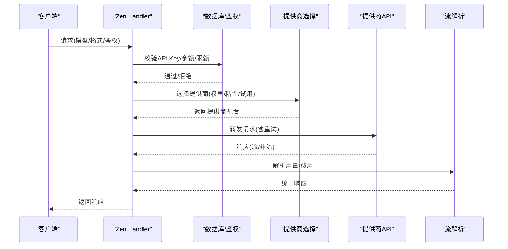
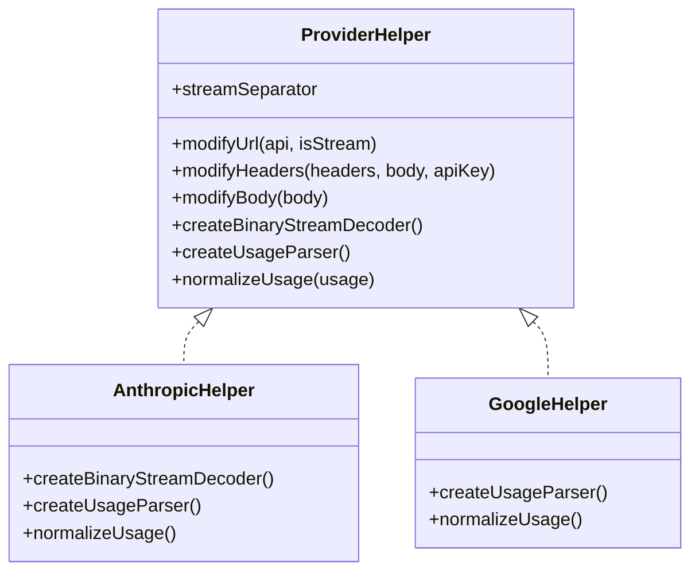
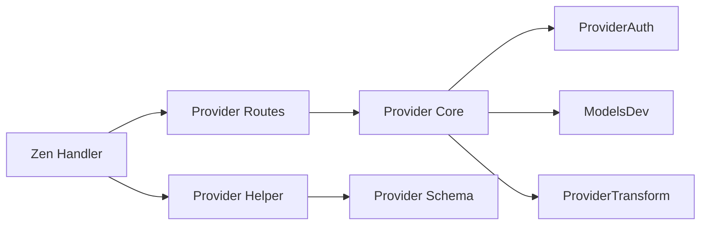

# 模型提供商集成

<cite>
**本文档引用的文件**
- [packages/opencode/src/provider/provider.ts](file://packages/opencode/src/provider/provider.ts)
- [packages/opencode/src/provider/auth.ts](file://packages/opencode/src/provider/auth.ts)
- [packages/opencode/src/provider/models.ts](file://packages/opencode/src/provider/models.ts)
- [packages/opencode/src/provider/transform.ts](file://packages/opencode/src/provider/transform.ts)
- [packages/opencode/src/provider/schema.ts](file://packages/opencode/src/provider/schema.ts)
- [packages/opencode/src/server/routes/provider.ts](file://packages/opencode/src/server/routes/provider.ts)
- [packages/console/app/src/routes/zen/util/handler.ts](file://packages/console/app/src/routes/zen/util/handler.ts)
- [packages/console/app/src/routes/zen/util/provider/provider.ts](file://packages/console/app/src/routes/zen/util/provider/provider.ts)
- [packages/console/app/src/routes/zen/util/provider/anthropic.ts](file://packages/console/app/src/routes/zen/util/provider/anthropic.ts)
- [packages/console/app/src/routes/zen/util/provider/google.ts](file://packages/console/app/src/routes/zen/util/provider/google.ts)
- [packages/sdk/js/src/v2/gen/types.gen.ts](file://packages/sdk/js/src/v2/gen/types.gen.ts)
</cite>

## 目录
1. [简介](#简介)
2. [项目结构](#项目结构)
3. [核心组件](#核心组件)
4. [架构总览](#架构总览)
5. [详细组件分析](#详细组件分析)
6. [依赖关系分析](#依赖关系分析)
7. [性能考量](#性能考量)
8. [故障排查指南](#故障排查指南)
9. [结论](#结论)
10. [附录](#附录)

## 简介
本文件系统性阐述模型提供商集成的设计与实现，覆盖以下主题：
- API 接口适配：统一多厂商格式（OpenAI、Anthropic、Google 等），支持流式与非流式响应转换。
- 认证机制：OAuth 与 API Key 的统一接入与回调处理。
- 请求处理流程：从鉴权、模型选择、负载均衡到请求转发与计费统计。
- 配置管理：API Key、请求参数、响应解析与成本计算。
- 扩展机制：新增/修改模型与提供商的通用方式。
- 开发示例与最佳实践：错误处理、重试策略、性能优化。
- 安全与隐私：敏感信息处理、最小暴露原则。

## 项目结构
该仓库采用多包结构，模型提供商集成主要分布在以下模块：
- 核心运行时与适配层：packages/opencode/src/provider/*
- 控制台路由与适配器：packages/console/app/src/routes/zen/util/provider/*
- 服务端路由：packages/opencode/src/server/routes/provider.ts
- 类型定义：packages/sdk/js/src/v2/gen/types.gen.ts

图表来源
- [packages/console/app/src/routes/zen/util/handler.ts:1-120](file://packages/console/app/src/routes/zen/util/handler.ts#L1-L120)
- [packages/console/app/src/routes/zen/util/provider/provider.ts:1-120](file://packages/console/app/src/routes/zen/util/provider/provider.ts#L1-L120)
- [packages/opencode/src/server/routes/provider.ts:16-65](file://packages/opencode/src/server/routes/provider.ts#L16-L65)
- [packages/opencode/src/provider/provider.ts:127-150](file://packages/opencode/src/provider/provider.ts#L127-L150)
- [packages/opencode/src/provider/auth.ts:114-133](file://packages/opencode/src/provider/auth.ts#L114-L133)
- [packages/opencode/src/provider/models.ts:111-131](file://packages/opencode/src/provider/models.ts#L111-L131)
- [packages/opencode/src/provider/transform.ts:20-47](file://packages/opencode/src/provider/transform.ts#L20-L47)
- [packages/opencode/src/provider/schema.ts:6-27](file://packages/opencode/src/provider/schema.ts#L6-L27)

章节来源
- [packages/opencode/src/provider/provider.ts:127-150](file://packages/opencode/src/provider/provider.ts#L127-L150)
- [packages/opencode/src/server/routes/provider.ts:16-65](file://packages/opencode/src/server/routes/provider.ts#L16-L65)
- [packages/console/app/src/routes/zen/util/handler.ts:420-492](file://packages/console/app/src/routes/zen/util/handler.ts#L420-L492)

## 核心组件
- 提供商核心（Provider）：负责加载内置/外部提供商、按环境变量与配置动态装配、模型发现与装载。
- 认证服务（ProviderAuth）：统一 OAuth 授权与回调，支持插件化方法注册。
- 模型清单（ModelsDev）：拉取/缓存/刷新模型清单，支持 TTL 与锁机制。
- 转换器（ProviderTransform）：消息规范化、缓存控制、推理变体映射、参数选项注入。
- 服务端路由（ProviderRoutes）：对外暴露提供商列表、认证方法查询与 OAuth 授权/回调接口。
- 控制台适配器（Zen Handler）：鉴权、模型校验、提供商选择、请求转发、流式解析与计费统计。
- 格式适配器（Provider Helper）：将上游输入输出转换为统一格式，或反向转换；处理 SSE/二进制事件流等差异。

章节来源
- [packages/opencode/src/provider/provider.ts:60-120](file://packages/opencode/src/provider/provider.ts#L60-L120)
- [packages/opencode/src/provider/auth.ts:11-111](file://packages/opencode/src/provider/auth.ts#L11-L111)
- [packages/opencode/src/provider/models.ts:16-93](file://packages/opencode/src/provider/models.ts#L16-L93)
- [packages/opencode/src/provider/transform.ts:20-80](file://packages/opencode/src/provider/transform.ts#L20-L80)
- [packages/opencode/src/server/routes/provider.ts:16-171](file://packages/opencode/src/server/routes/provider.ts#L16-L171)
- [packages/console/app/src/routes/zen/util/handler.ts:63-120](file://packages/console/app/src/routes/zen/util/handler.ts#L63-L120)
- [packages/console/app/src/routes/zen/util/provider/provider.ts:36-120](file://packages/console/app/src/routes/zen/util/provider/provider.ts#L36-L120)

## 架构总览
整体架构分为三层：
- 控制层：Zen Handler 负责鉴权、模型选择、请求转发与流式解析。
- 适配层：Provider Helper 将不同格式统一为内部通用格式，并处理 SSE/事件流差异。
- 运行时层：Provider 核心负责提供商加载、认证、模型发现与参数转换。

图表来源
- [packages/console/app/src/routes/zen/util/handler.ts:124-200](file://packages/console/app/src/routes/zen/util/handler.ts#L124-L200)
- [packages/console/app/src/routes/zen/util/provider/provider.ts:183-230](file://packages/console/app/src/routes/zen/util/provider/provider.ts#L183-L230)
- [packages/console/app/src/routes/zen/util/provider/anthropic.ts:19-188](file://packages/console/app/src/routes/zen/util/provider/anthropic.ts#L19-L188)
- [packages/console/app/src/routes/zen/util/provider/google.ts:29-75](file://packages/console/app/src/routes/zen/util/provider/google.ts#L29-L75)
- [packages/opencode/src/server/routes/provider.ts:41-64](file://packages/opencode/src/server/routes/provider.ts#L41-L64)
- [packages/opencode/src/provider/provider.ts:419-486](file://packages/opencode/src/provider/provider.ts#L419-L486)

## 详细组件分析

### 组件A：提供商核心（Provider）
职责与特性：
- 内置提供商注册：通过 BUNDLED_PROVIDERS 映射 npm 包到 SDK 创建函数。
- 自定义加载器：为特定提供商（如 anthropic、openai、azure、amazon-bedrock、google-vertex、openrouter、vercel、github-copilot 等）提供 options、getModel、vars、discoverModels 等定制逻辑。
- 环境变量与凭据：根据环境变量与认证服务结果决定是否启用与如何注入凭据。
- SSE 超时包装：对 SSE 流进行超时控制与中止。
- E2E URL 支持：测试场景下可替换 LLM 入口。

图表来源
- [packages/opencode/src/provider/provider.ts:127-150](file://packages/opencode/src/provider/provider.ts#L127-L150)
- [packages/opencode/src/provider/provider.ts:172-786](file://packages/opencode/src/provider/provider.ts#L172-L786)

章节来源
- [packages/opencode/src/provider/provider.ts:127-150](file://packages/opencode/src/provider/provider.ts#L127-L150)
- [packages/opencode/src/provider/provider.ts:172-786](file://packages/opencode/src/provider/provider.ts#L172-L786)

### 组件B：认证服务（ProviderAuth）
职责与特性：
- 方法注册：从插件收集提供商认证方法（OAuth/API），并以 ProviderID -> 方法数组形式暴露。
- 授权流程：发起 OAuth 授权，返回授权 URL 与交互说明。
- 回调处理：接收授权码或无码授权，写入认证存储（API Key 或 OAuth 凭据）。
- 错误类型：统一的认证错误类型，便于上层处理。

图表来源
- [packages/opencode/src/server/routes/provider.ts:83-170](file://packages/opencode/src/server/routes/provider.ts#L83-L170)
- [packages/opencode/src/provider/auth.ts:135-228](file://packages/opencode/src/provider/auth.ts#L135-L228)

章节来源
- [packages/opencode/src/provider/auth.ts:11-111](file://packages/opencode/src/provider/auth.ts#L11-L111)
- [packages/opencode/src/server/routes/provider.ts:83-170](file://packages/opencode/src/server/routes/provider.ts#L83-L170)

### 组件C：模型清单与配置（ModelsDev）
职责与特性：
- 模型清单来源：优先使用构建期快照，其次本地缓存，最后网络拉取（带 TTL 与文件锁）。
- 刷新策略：定时刷新，支持强制刷新。
- 数据结构：包含模型能力、成本、限制、头部、变体等字段。

图表来源
- [packages/opencode/src/provider/models.ts:111-162](file://packages/opencode/src/provider/models.ts#L111-L162)

章节来源
- [packages/opencode/src/provider/models.ts:16-93](file://packages/opencode/src/provider/models.ts#L16-L93)
- [packages/opencode/src/provider/models.ts:111-162](file://packages/opencode/src/provider/models.ts#L111-L162)

### 组件D：消息与参数转换（ProviderTransform）
职责与特性：
- 消息规范化：过滤空内容、清理工具调用 ID、修正消息序列。
- 缓存控制：在系统/尾部消息上注入缓存控制选项。
- 推理变体：针对不同提供商与模型，生成推理努力级别（reasoning variants）。
- 参数注入：根据模型能力与提供商要求注入默认参数（如 store=false、thinkingConfig 等）。

图表来源
- [packages/opencode/src/provider/transform.ts:49-322](file://packages/opencode/src/provider/transform.ts#L49-L322)

章节来源
- [packages/opencode/src/provider/transform.ts:49-322](file://packages/opencode/src/provider/transform.ts#L49-L322)

### 组件E：控制台请求处理（Zen Handler）
职责与特性：
- 鉴权：从请求头解析 API Key，数据库校验工作区/订阅/余额/限额。
- 模型校验：根据格式过滤可用模型，处理试用/粘性提供商。
- 提供商选择：基于权重、粘性会话、试用提供商与随机权重选择。
- 请求转发：构造目标 URL/头部/请求体，支持 429 指数退避重试。
- 流式解析：解析 SSE/事件流，提取用量并计算费用。
- 错误处理：区分鉴权/配额/模型错误，返回标准化错误响应。

图表来源
- [packages/console/app/src/routes/zen/util/handler.ts:494-616](file://packages/console/app/src/routes/zen/util/handler.ts#L494-L616)
- [packages/console/app/src/routes/zen/util/handler.ts:790-797](file://packages/console/app/src/routes/zen/util/handler.ts#L790-L797)

章节来源
- [packages/console/app/src/routes/zen/util/handler.ts:494-616](file://packages/console/app/src/routes/zen/util/handler.ts#L494-L616)
- [packages/console/app/src/routes/zen/util/handler.ts:790-797](file://packages/console/app/src/routes/zen/util/handler.ts#L790-L797)

### 组件F：格式适配器（Provider Helper）
职责与特性：
- 通用格式：定义统一的消息、工具调用、响应与块结构。
- 请求/响应/块转换：在 Anthropic/OpenAI/OA-Compatible 之间互相转换。
- 流解析：解析 SSE/事件流，提取用量并归一化为统一结构。
- URL/头部/体改写：按提供商差异调整 URL、头部与请求体。

图表来源
- [packages/console/app/src/routes/zen/util/provider/provider.ts:36-120](file://packages/console/app/src/routes/zen/util/provider/provider.ts#L36-L120)
- [packages/console/app/src/routes/zen/util/provider/anthropic.ts:19-188](file://packages/console/app/src/routes/zen/util/provider/anthropic.ts#L19-L188)
- [packages/console/app/src/routes/zen/util/provider/google.ts:29-75](file://packages/console/app/src/routes/zen/util/provider/google.ts#L29-L75)

章节来源
- [packages/console/app/src/routes/zen/util/provider/provider.ts:183-230](file://packages/console/app/src/routes/zen/util/provider/provider.ts#L183-L230)
- [packages/console/app/src/routes/zen/util/provider/anthropic.ts:19-188](file://packages/console/app/src/routes/zen/util/provider/anthropic.ts#L19-L188)
- [packages/console/app/src/routes/zen/util/provider/google.ts:29-75](file://packages/console/app/src/routes/zen/util/provider/google.ts#L29-L75)

### 组件G：模型配置与类型定义
- 模型类型：包含提供商 ID、API 信息、名称、能力、成本、限制、状态、选项、头部、发布日期、变体等字段。
- 提供商 ID 类型：通过 Schema 品牌化类型确保类型安全与静态常量。

章节来源
- [packages/sdk/js/src/v2/gen/types.gen.ts:1659-1728](file://packages/sdk/js/src/v2/gen/types.gen.ts#L1659-L1728)
- [packages/opencode/src/provider/schema.ts:6-27](file://packages/opencode/src/provider/schema.ts#L6-L27)

## 依赖关系分析
- Provider 依赖 Auth 与 ModelsDev：用于凭据注入与模型清单。
- Zen Handler 依赖 Provider Helper 与 Provider Routes：前者做格式转换，后者做提供商列表与认证。
- Provider Helper 依赖 Provider Schema：确保模型/提供商 ID 的类型安全。
- Transform 依赖 Provider 与 ModelsDev：基于模型能力与提供商 SDK 注入参数。

图表来源
- [packages/console/app/src/routes/zen/util/handler.ts:420-492](file://packages/console/app/src/routes/zen/util/handler.ts#L420-L492)
- [packages/opencode/src/server/routes/provider.ts:41-64](file://packages/opencode/src/server/routes/provider.ts#L41-L64)
- [packages/opencode/src/provider/provider.ts:419-486](file://packages/opencode/src/provider/provider.ts#L419-L486)
- [packages/opencode/src/provider/transform.ts:20-47](file://packages/opencode/src/provider/transform.ts#L20-L47)
- [packages/opencode/src/provider/schema.ts:6-27](file://packages/opencode/src/provider/schema.ts#L6-L27)

章节来源
- [packages/console/app/src/routes/zen/util/handler.ts:420-492](file://packages/console/app/src/routes/zen/util/handler.ts#L420-L492)
- [packages/opencode/src/provider/provider.ts:419-486](file://packages/opencode/src/provider/provider.ts#L419-L486)

## 性能考量
- SSE 超时与中止：wrapSSE 对 SSE 读取设置超时，避免长时间阻塞。
- 指数退避重试：对 429 错误进行最多 N 次指数退避重试，降低瞬时拥塞影响。
- 流式解析与用量提取：仅在首字节与结束时记录指标，减少日志开销。
- 缓存控制：在系统/尾部消息注入缓存控制，提升重复对话效率。
- 模型清单缓存：TTL 与文件锁避免频繁网络请求。

章节来源
- [packages/opencode/src/provider/provider.ts:69-115](file://packages/opencode/src/provider/provider.ts#L69-L115)
- [packages/console/app/src/routes/zen/util/handler.ts:790-797](file://packages/console/app/src/routes/zen/util/handler.ts#L790-L797)
- [packages/opencode/src/provider/transform.ts:192-238](file://packages/opencode/src/provider/transform.ts#L192-L238)
- [packages/opencode/src/provider/models.ts:95-101](file://packages/opencode/src/provider/models.ts#L95-L101)

## 故障排查指南
常见错误与定位：
- 鉴权失败：检查 API Key 是否存在、是否被禁用、是否为匿名允许。
- 配额/余额不足：检查工作区/用户月度限额与余额，确认订阅状态。
- 模型不可用：确认模型是否在当前格式下可用，是否被禁用或试用结束。
- 提供商不可用：检查提供商权重/粘性/试用列表，必要时切换到回退提供商。
- 429 限流：查看重试次数与等待时间，确认上游限流策略。
- SSE/事件流异常：检查二进制解码器与分隔符，确认提供商格式差异。

章节来源
- [packages/console/app/src/routes/zen/util/handler.ts:335-389](file://packages/console/app/src/routes/zen/util/handler.ts#L335-L389)
- [packages/console/app/src/routes/zen/util/handler.ts:618-777](file://packages/console/app/src/routes/zen/util/handler.ts#L618-L777)

## 结论
该模型提供商集成体系通过“格式适配 + 认证 + 转换 + 选择 + 转发”的分层设计，实现了对多家提供商的统一接入与高效运行。其关键优势在于：
- 统一的格式与消息转换，屏蔽提供商差异。
- 可插拔的认证与提供商加载机制，便于扩展新提供商。
- 完整的用量/费用统计与错误处理，保障可观测性与稳定性。
- 性能优化与重试策略，提升鲁棒性与用户体验。

## 附录

### 开发示例与最佳实践
- 新增提供商步骤
  1) 在 Provider.custom 中注册提供商加载器，定义 autoload、options、getModel、vars、discoverModels。
  2) 在 Provider.BUNDLED_PROVIDERS 中注册 npm 包与 SDK 创建函数。
  3) 在 ProviderTransform 中补充消息/参数转换规则（如缓存控制、推理变体）。
  4) 在 Console Provider Helper 中实现格式适配（modifyUrl/Headers/Body、流解析、用量归一化）。
  5) 在服务端路由中暴露提供商认证方法与 OAuth 授权/回调接口。
- 最佳实践
  - 使用 Provider Schema 的品牌化 ID，确保类型安全。
  - 在 ProviderTransform 中按模型能力注入默认参数，避免遗漏。
  - 对 SSE/事件流进行超时与解码处理，保证稳定性。
  - 对 429/网络波动进行指数退避重试，避免雪崩效应。
  - 严格控制日志与指标，避免敏感信息泄露。

章节来源
- [packages/opencode/src/provider/provider.ts:172-786](file://packages/opencode/src/provider/provider.ts#L172-L786)
- [packages/opencode/src/provider/transform.ts:20-80](file://packages/opencode/src/provider/transform.ts#L20-L80)
- [packages/console/app/src/routes/zen/util/provider/provider.ts:183-230](file://packages/console/app/src/routes/zen/util/provider/provider.ts#L183-L230)
- [packages/opencode/src/server/routes/provider.ts:83-170](file://packages/opencode/src/server/routes/provider.ts#L83-L170)

### 安全与隐私
- 凭据管理：API Key 与 OAuth 凭据通过 ProviderAuth 写入认证存储，避免明文透传。
- 最小暴露：请求头中删除敏感字段，仅保留必要头部；响应头仅保留 content-type/cache-control。
- 日志脱敏：对请求/响应进行长度截断与敏感字段过滤，避免泄露。
- 访问控制：匿名访问需满足 allowAnonymous 或管理员白名单；生产环境对 alpha 模型进行限制。

章节来源
- [packages/console/app/src/routes/zen/util/handler.ts:156-173](file://packages/console/app/src/routes/zen/util/handler.ts#L156-L173)
- [packages/console/app/src/routes/zen/util/handler.ts:214-221](file://packages/console/app/src/routes/zen/util/handler.ts#L214-L221)
- [packages/console/app/src/routes/zen/util/handler.ts:579-615](file://packages/console/app/src/routes/zen/util/handler.ts#L579-L615)