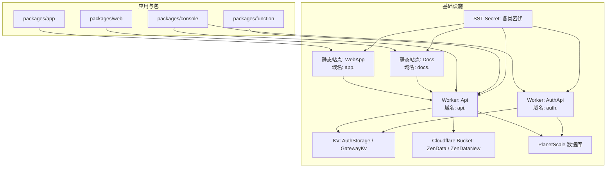
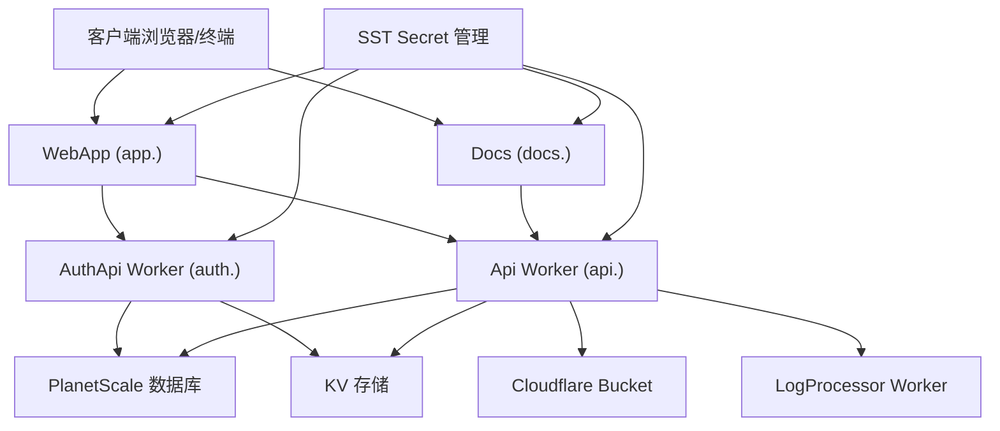
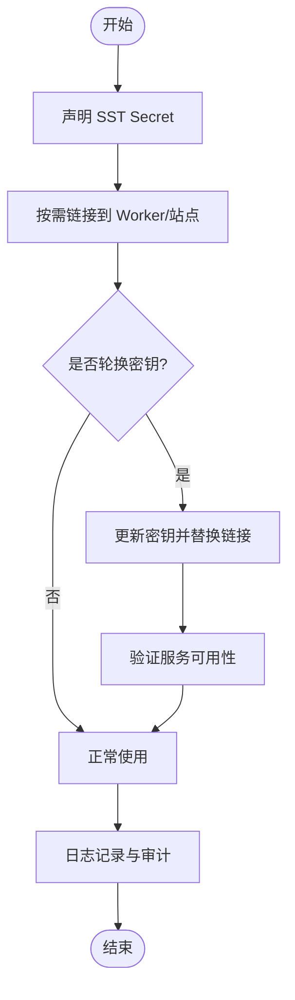
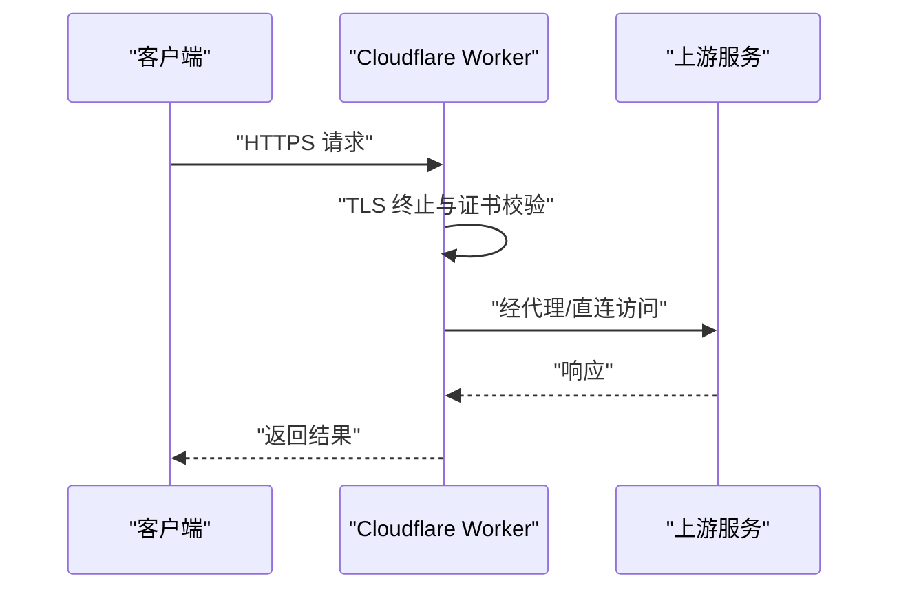
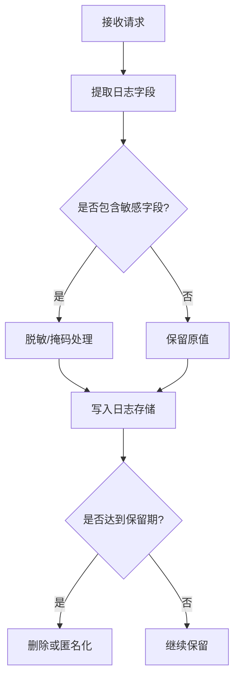
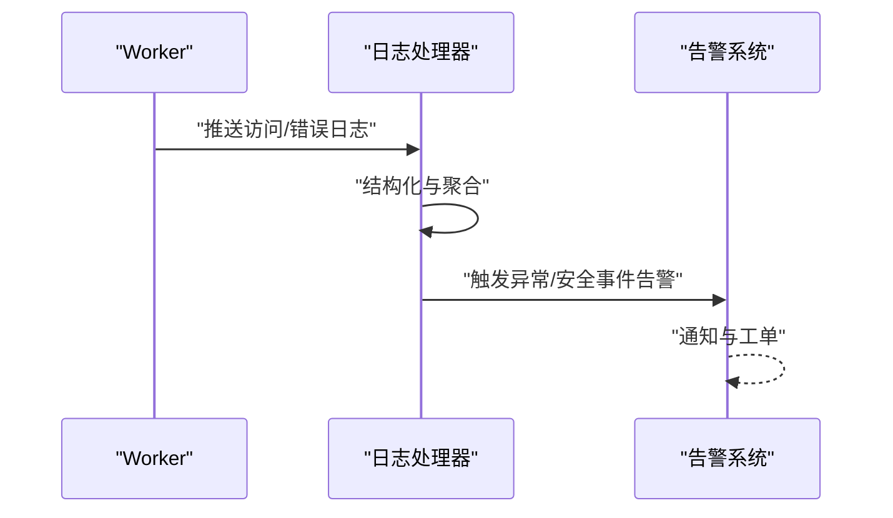
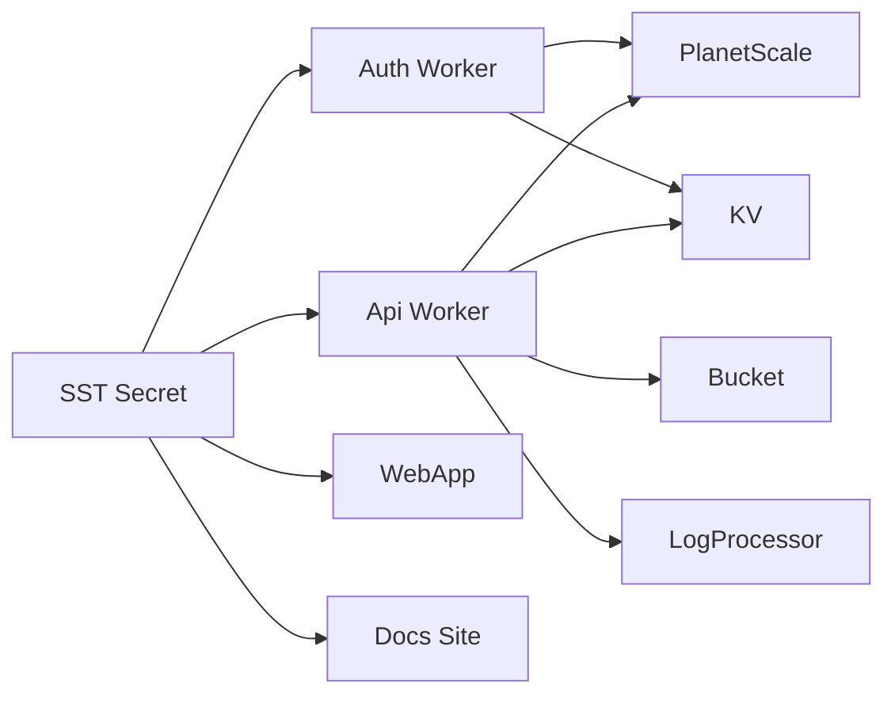

# 安全问题

<cite>
**本文引用的文件**
- [SECURITY.md](file://SECURITY.md)
- [README.md](file://README.md)
- [sst.config.ts](file://sst.config.ts)
- [infra/app.ts](file://infra/app.ts)
- [infra/console.ts](file://infra/console.ts)
- [infra/secret.ts](file://infra/secret.ts)
</cite>

## 目录
1. [简介](#简介)
2. [项目结构](#项目结构)
3. [核心组件](#核心组件)
4. [架构总览](#架构总览)
5. [详细组件分析](#详细组件分析)
6. [依赖关系分析](#依赖关系分析)
7. [性能考虑](#性能考虑)
8. [故障排查指南](#故障排查指南)
9. [结论](#结论)
10. [附录](#附录)

## 简介
本指南面向 OpenCode 的使用者与维护者，聚焦于本地运行场景下的安全问题排查与防护，涵盖权限控制（文件系统、API 访问、代理执行）、API 密钥管理与安全存储、网络连接安全（SSL 证书、代理、防火墙）、数据隐私保护（敏感数据处理、日志脱敏、数据清理）、安全审计与监控（访问日志、异常检测、安全告警），以及安全漏洞的应急响应流程与修复建议。  
根据项目安全声明，OpenCode 不对“沙箱逃逸”提供安全隔离，且服务端模式需显式启用并通过环境变量设置认证；这些要点直接影响安全设计与运维策略。

章节来源
- [SECURITY.md:11-33](file://SECURITY.md#L11-L33)

## 项目结构
OpenCode 采用多包与基础设施即代码（IaC）结合的组织方式：前端应用、控制台、函数服务、桌面端、SDK 等位于 packages 下；基础设施通过 SST（Serverless Stack Toolkit）在 infra 目录中定义，密钥与敏感配置集中于 secret.ts，并在 sst.config.ts 中统一编排。

图表来源
- [sst.config.ts:3-23](file://sst.config.ts#L3-L23)
- [infra/app.ts:13-69](file://infra/app.ts#L13-L69)
- [infra/console.ts:56-65](file://infra/console.ts#L56-L65)
- [infra/console.ts:199-260](file://infra/console.ts#L199-L260)

章节来源
- [sst.config.ts:3-23](file://sst.config.ts#L3-L23)
- [infra/app.ts:13-69](file://infra/app.ts#L13-L69)
- [infra/console.ts:56-65](file://infra/console.ts#L56-L65)
- [infra/console.ts:199-260](file://infra/console.ts#L199-L260)

## 核心组件
- 权限模型与运行模式
  - 项目明确指出不提供沙箱隔离，权限系统仅用于用户提示与确认，非安全边界；如需隔离，应在容器或虚拟机内运行。
  - 服务端模式为可选，默认未启用；启用时需设置密码以启用 HTTP 基本身份认证。
- 敏感配置与密钥管理
  - 所有外部服务密钥（如云存储、第三方平台、支付网关等）均通过 SST Secret 声明并在 Worker/站点间按需链接，避免硬编码与泄露。
  - 示例密钥类型：对象存储访问凭据、第三方平台 API 密钥、Stripe 秘钥、数据库密码等。
- 网络与域名
  - API 与认证服务通过 Cloudflare Worker 提供，域名由 SST 配置；文档与前端应用分别部署为静态站点。
- 日志与可观测性
  - 控制台应用通过 Cloudflare Worker 将日志发送至日志处理器，便于集中分析与审计。

章节来源
- [SECURITY.md:15-23](file://SECURITY.md#L15-L23)
- [infra/secret.ts:1-5](file://infra/secret.ts#L1-L5)
- [infra/app.ts:13-49](file://infra/app.ts#L13-L49)
- [infra/console.ts:56-65](file://infra/console.ts#L56-L65)
- [infra/console.ts:209-212](file://infra/console.ts#L209-L212)

## 架构总览
下图展示 OpenCode 在云端的典型运行面：前端 Web 应用与文档站点、认证与 API Worker、控制台应用、数据库与对象存储，以及密钥管理与日志处理链路。

图表来源
- [sst.config.ts:3-23](file://sst.config.ts#L3-L23)
- [infra/app.ts:13-69](file://infra/app.ts#L13-L69)
- [infra/console.ts:56-65](file://infra/console.ts#L56-L65)
- [infra/console.ts:209-212](file://infra/console.ts#L209-L212)

## 详细组件分析

### 组件一：权限控制与本地运行安全
- 文件系统权限
  - 由于不提供沙箱隔离，任何文件读写、脚本执行均由宿主系统权限决定。建议在受限账户下运行，限制可执行范围与写入路径。
- API 访问权限
  - 服务端模式默认未启用；启用时必须设置密码以启用 HTTP 基本身份认证。未设置密码将导致未认证访问风险。
- 代理执行权限
  - 代理执行能力属于高危操作，应严格限制在可信网络与受控环境中使用，并配合最小权限原则与审计日志。

章节来源
- [SECURITY.md:15-23](file://SECURITY.md#L15-L23)

### 组件二：API 密钥管理与安全存储
- 密钥集中化与最小暴露
  - 使用 SST Secret 声明密钥，仅在需要的服务之间按需链接，避免在源码或环境变量中直接暴露。
- 密钥轮换与生命周期
  - 建议定期轮换密钥，更新后立即替换链接并验证服务可用性；保留旧密钥过渡期不宜过长。
- 加密存储与传输
  - 通过 Cloudflare Worker/KV/Bucket 等托管服务提供的加密能力进行静态与传输加密；确保密钥在内存中的生命周期最短。
- 访问审计
  - 利用日志处理器与 Worker 的日志推送能力，记录密钥使用与敏感操作事件，便于审计与追踪。

图表来源
- [infra/secret.ts:1-5](file://infra/secret.ts#L1-L5)
- [infra/app.ts:20-29](file://infra/app.ts#L20-L29)
- [infra/console.ts:221-242](file://infra/console.ts#L221-L242)

章节来源
- [infra/secret.ts:1-5](file://infra/secret.ts#L1-L5)
- [infra/app.ts:20-29](file://infra/app.ts#L20-L29)
- [infra/console.ts:221-242](file://infra/console.ts#L221-L242)

### 组件三：网络连接安全
- SSL/TLS 与证书校验
  - 通过 Cloudflare Worker 提供 HTTPS 终端，自动启用 TLS；确保域名解析与证书续期由 Cloudflare 管理。
- 代理配置
  - 若需通过代理访问外部服务，应在 Worker/KV 配置中明确代理端点与凭据，并限制代理出口范围。
- 防火墙与出站策略
  - 通过 Cloudflare Workers 平台的网络策略限制出站访问，仅允许必要的上游服务地址。

图表来源
- [sst.config.ts:10-15](file://sst.config.ts#L10-L15)
- [infra/app.ts:13-19](file://infra/app.ts#L13-L19)

章节来源
- [sst.config.ts:10-15](file://sst.config.ts#L10-L15)
- [infra/app.ts:13-19](file://infra/app.ts#L13-L19)

### 组件四：数据隐私保护
- 敏感数据处理
  - 对用户输入与日志中的敏感字段进行脱敏（如令牌、邮箱、手机号等），仅在必要时临时解密。
- 日志脱敏
  - 在日志处理器中实现字段过滤与掩码，避免将敏感信息持久化到日志存储。
- 数据清理
  - 明确数据保留期限，到期后删除或匿名化处理；对临时文件与缓存目录定期清理。

图表来源
- [infra/console.ts:209-212](file://infra/console.ts#L209-L212)

章节来源
- [infra/console.ts:209-212](file://infra/console.ts#L209-L212)

### 组件五：安全审计与监控
- 访问日志
  - 启用 Cloudflare Worker 的日志推送，将访问与错误日志汇聚至日志处理器，支持结构化查询与检索。
- 异常检测
  - 基于日志统计与阈值告警（如失败率、异常 IP、异常路径），建立自动化检测规则。
- 安全告警
  - 将关键事件（如密钥轮换、异常登录、未授权访问尝试）接入告警通道，确保及时处置。

图表来源
- [sst.config.ts:31-33](file://sst.config.ts#L31-L33)
- [infra/console.ts:249-258](file://infra/console.ts#L249-L258)
- [infra/console.ts:209-212](file://infra/console.ts#L209-L212)

章节来源
- [sst.config.ts:31-33](file://sst.config.ts#L31-L33)
- [infra/console.ts:249-258](file://infra/console.ts#L249-L258)
- [infra/console.ts:209-212](file://infra/console.ts#L209-L212)

### 组件六：应急响应流程与修复建议
- 报告渠道
  - 通过 GitHub Security Advisory 的“报告漏洞”入口提交，安全团队将在合理时间内响应；若超过约定时间未收到回复，可邮件联系指定地址。
- 处置优先级
  - 按影响范围与严重性分级，优先修复涉及认证、授权、密钥与数据外泄的漏洞。
- 修复与回滚
  - 采用蓝绿/金丝雀发布策略，快速回滚；修复后进行回归测试与安全扫描。
- 事后复盘
  - 输出事件报告，完善安全基线与自动化检查项。

章节来源
- [SECURITY.md:37-47](file://SECURITY.md#L37-L47)

## 依赖关系分析
- 组件耦合
  - API 与认证 Worker 共享 KV 与数据库资源，密钥通过 SST Secret 注入；前端应用通过域名访问 API 与认证服务。
- 外部依赖
  - Cloudflare Worker/KV/Bucket、PlanetScale 数据库、Stripe、第三方 OAuth 客户端等。
- 潜在风险点
  - 密钥泄露、未授权访问、日志中敏感信息残留、代理出口未受控。

图表来源
- [sst.config.ts:3-23](file://sst.config.ts#L3-L23)
- [infra/app.ts:13-49](file://infra/app.ts#L13-L49)
- [infra/console.ts:56-65](file://infra/console.ts#L56-L65)
- [infra/console.ts:209-212](file://infra/console.ts#L209-L212)

章节来源
- [sst.config.ts:3-23](file://sst.config.ts#L3-L23)
- [infra/app.ts:13-49](file://infra/app.ts#L13-L49)
- [infra/console.ts:56-65](file://infra/console.ts#L56-L65)
- [infra/console.ts:209-212](file://infra/console.ts#L209-L212)

## 性能考虑
- 日志处理吞吐
  - 日志处理器与 Worker 的日志推送需评估峰值流量，避免成为瓶颈；可通过分片与异步处理提升吞吐。
- 密钥轮换窗口
  - 轮换密钥时尽量避开业务高峰，缩短切换窗口，减少服务中断风险。
- 网络路径优化
  - 通过 Cloudflare 边缘节点就近路由，降低延迟与丢包率；对代理出口进行路由优化。

## 故障排查指南
- 权限控制问题
  - 症状：命令执行失败、文件写入被拒绝。
  - 排查：确认运行用户权限、目标路径权限、是否处于服务端模式且已正确设置密码。
- API 访问问题
  - 症状：401/403、接口不可达。
  - 排查：检查服务端模式开关与密码配置、域名解析、Worker 部署状态、日志推送是否开启。
- 密钥相关问题
  - 症状：鉴权失败、服务不可用。
  - 排查：确认密钥是否已更新并正确链接、是否存在过期或格式错误、日志中是否出现密钥泄露痕迹。
- 网络连接问题
  - 症状：超时、证书错误、代理不通。
  - 排查：验证 TLS 证书链、Cloudflare Worker 的网络策略、代理端点可达性与凭据正确性。
- 数据隐私问题
  - 症状：日志中出现敏感信息。
  - 排查：检查日志处理器的脱敏规则、字段映射与掩码策略，确认未授权导出。

章节来源
- [SECURITY.md:15-23](file://SECURITY.md#L15-L23)
- [sst.config.ts:31-33](file://sst.config.ts#L31-L33)
- [infra/console.ts:209-212](file://infra/console.ts#L209-L212)

## 结论
OpenCode 的安全设计以“最小权限+最小暴露”为核心：通过 SST Secret 集中管理密钥、Worker/KV/Bucket 提供加密与访问控制、日志与审计保障可追溯性。本地运行场景下，务必重视服务端模式的认证配置与代理执行的权限约束，配合完善的日志脱敏与数据清理策略，构建纵深防御体系。同时，建立标准化的应急响应流程，确保漏洞从发现到修复的闭环管理。

## 附录
- 参考文档与安装说明可参阅项目根目录的 README。
- 安全报告与应急联系方式见 SECURITY 文档。

章节来源
- [README.md:100-114](file://README.md#L100-L114)
- [SECURITY.md:37-47](file://SECURITY.md#L37-L47)