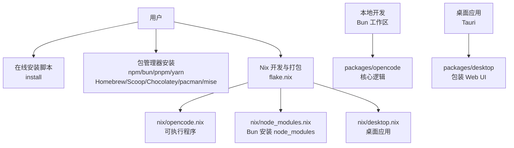
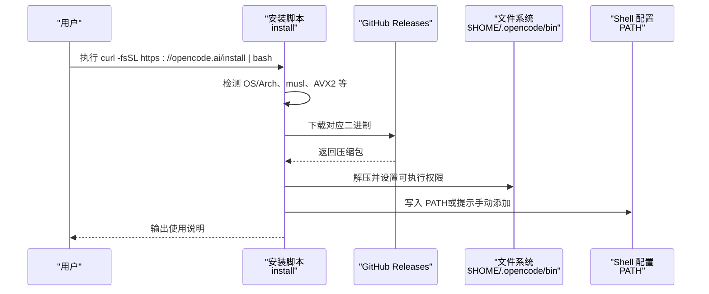
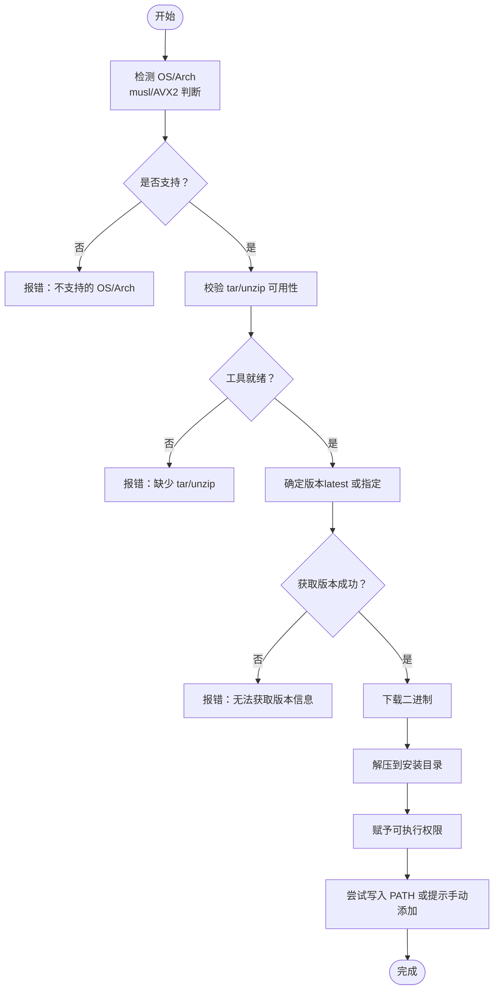
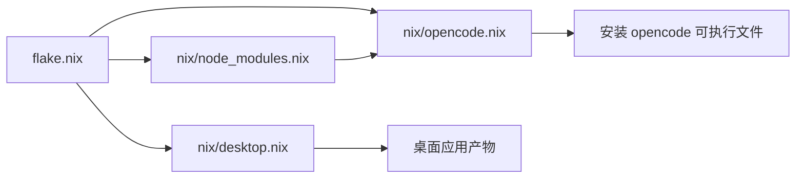
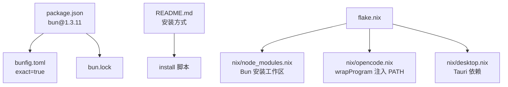

# 安装问题

<cite>
**本文引用的文件**   
- [README.md](file://README.md)
- [install](file://install)
- [flake.nix](file://flake.nix)
- [flake.lock](file://flake.lock)
- [package.json](file://package.json)
- [bunfig.toml](file://bunfig.toml)
- [bun.lock](file://bun.lock)
- [nix/opencode.nix](file://nix/opencode.nix)
- [nix/node_modules.nix](file://nix/node_modules.nix)
- [nix/desktop.nix](file://nix/desktop.nix)
- [nix/scripts/canonicalize-node-modules.ts](file://nix/scripts/canonicalize-node-modules.ts)
- [CONTRIBUTING.md](file://CONTRIBUTING.md)
</cite>

## 目录
1. [简介](#简介)
2. [项目结构](#项目结构)
3. [核心组件](#核心组件)
4. [架构总览](#架构总览)
5. [详细组件分析](#详细组件分析)
6. [依赖关系分析](#依赖关系分析)
7. [性能考量](#性能考量)
8. [故障排除指南](#故障排除指南)
9. [结论](#结论)
10. [附录](#附录)

## 简介
本指南聚焦 OpenCode 的安装问题与排障，覆盖以下主题：
- 常见安装失败场景：Node.js 版本不兼容、Bun 安装问题、Nix 包管理器配置错误等
- 面向不同操作系统（Windows、macOS、Linux）的具体安装问题与修复步骤
- 依赖包冲突的诊断与修复：TypeScript 编译错误、模块解析失败等
- 环境变量配置问题排查：PATH 设置、权限问题等
- 离线安装与代理环境下的安装指南
- 安装过程中常见错误码与对应解决步骤

## 项目结构
OpenCode 提供多条安装路径与多种构建/运行方式：
- 在线安装脚本：curl 安装、包管理器安装（npm/bun/pnpm/yarn、Homebrew、Scoop、Chocolatey、pacman、mise）
- Nix 开发与打包：flake 提供 devShell 与 packages，支持多平台
- 本地开发：Bun 作为包管理器与运行时，配合工作区与类型定义
- 桌面应用：通过 Tauri 构建，依赖额外系统库

图表来源
- [README.md:46-83](file://README.md#L46-L83)
- [install:1-461](file://install#L1-L461)
- [flake.nix:1-77](file://flake.nix#L1-L77)
- [package.json:1-124](file://package.json#L1-L124)
- [nix/opencode.nix:1-102](file://nix/opencode.nix#L1-L102)
- [nix/node_modules.nix:1-86](file://nix/node_modules.nix#L1-L86)
- [nix/desktop.nix:1-101](file://nix/desktop.nix#L1-L101)

章节来源
- [README.md:46-83](file://README.md#L46-L83)
- [install:1-461](file://install#L1-L461)
- [flake.nix:1-77](file://flake.nix#L1-L77)
- [package.json:1-124](file://package.json#L1-L124)

## 核心组件
- 在线安装脚本 install：负责检测系统架构、下载二进制、解压、写入 PATH、输出提示
- 包管理器安装：README 提供 npm/bun/pnpm/yarn、Homebrew、Scoop、Chocolatey、pacman、mise 等安装方式
- Nix 开发与打包：flake.nix 定义 devShell 与 packages；nix/*.nix 描述 opencode 与 desktop 的构建流程
- 本地开发：package.json 指定 Bun 为包管理器版本，bunfig.toml 控制安装行为；bun.lock 记录锁定依赖
- 桌面应用：nix/desktop.nix 依赖 Tauri 平台库，需满足系统前置条件

章节来源
- [install:1-461](file://install#L1-L461)
- [README.md:46-83](file://README.md#L46-L83)
- [flake.nix:1-77](file://flake.nix#L1-L77)
- [package.json:7-75](file://package.json#L7-L75)
- [bunfig.toml:1-7](file://bunfig.toml#L1-L7)
- [bun.lock:1-200](file://bun.lock#L1-L200)
- [nix/opencode.nix:1-102](file://nix/opencode.nix#L1-L102)
- [nix/desktop.nix:1-101](file://nix/desktop.nix#L1-L101)

## 架构总览
下图展示从“用户选择安装方式”到“命令可用”的关键路径与潜在断点。

图表来源
- [install:68-205](file://install#L68-L205)
- [install:327-346](file://install#L327-L346)
- [install:403-439](file://install#L403-L439)

## 详细组件分析

### 组件 A：在线安装脚本 install
- 功能要点
  - 支持指定版本、本地二进制安装、不修改 shell 配置等选项
  - 自动识别 OS/Arch，必要时附加 baseline 与 musl 后缀
  - 校验 tar/unzip 可用性（Linux 使用 tar，其他系统使用 unzip）
  - 下载并解压二进制至 $HOME/.opencode/bin，赋予可执行权限
  - 尝试自动将安装目录加入 PATH，并在 GitHub Actions 环境中写入 GITHUB_PATH
- 关键断点
  - 不支持的 OS/Arch
  - 缺少 tar 或 unzip
  - 指定版本不存在
  - 无法获取最新版本信息
  - 本地二进制路径不存在

图表来源
- [install:79-110](file://install#L79-L110)
- [install:171-181](file://install#L171-L181)
- [install:183-204](file://install#L183-L204)
- [install:327-346](file://install#L327-L346)
- [install:403-439](file://install#L403-L439)

章节来源
- [install:1-461](file://install#L1-L461)

### 组件 B：Nix 开发与打包
- flake.nix
  - 定义 devShells（含 bun、nodejs_20、pkg-config、openssl、git）
  - 定义 overlay 与 packages，调用 nix/opencode.nix 与 nix/desktop.nix
- nix/opencode.nix
  - 从 node_modules 复制源码，构建后安装可执行文件与 schema
  - 使用 wrapProgram 注入 PATH 依赖（如 ripgrep、sysctl）
  - 运行版本检查与 shell 补全安装
- nix/node_modules.nix
  - 使用 Bun 安装指定工作区（opencode、desktop、app），冻结锁文件
  - 通过脚本规范化 node_modules 与 Bun 二进制
- nix/desktop.nix
  - 依赖 Tauri 平台库，Linux 下启用 wrapGAppsHook4
  - 将 opencode 可执行文件复制为 sidecar

图表来源
- [flake.nix:21-31](file://flake.nix#L21-L31)
- [flake.nix:33-51](file://flake.nix#L33-L51)
- [nix/opencode.nix:16-73](file://nix/opencode.nix#L16-L73)
- [nix/node_modules.nix:48-64](file://nix/node_modules.nix#L48-L64)
- [nix/desktop.nix:26-64](file://nix/desktop.nix#L26-L64)

章节来源
- [flake.nix:1-77](file://flake.nix#L1-L77)
- [nix/opencode.nix:1-102](file://nix/opencode.nix#L1-L102)
- [nix/node_modules.nix:1-86](file://nix/node_modules.nix#L1-L86)
- [nix/desktop.nix:1-101](file://nix/desktop.nix#L1-L101)

### 组件 C：本地开发（Bun 工作区）
- package.json
  - 指定包管理器版本为 bun@1.3.11
  - 定义工作区与 catalog 依赖，包含 @types/bun、@types/node、typescript 等
- bunfig.toml
  - exact = true：严格锁定依赖版本
  - test.root：禁止从根目录运行测试
- bun.lock
  - 记录各工作区与依赖的锁定版本，便于复现安装

章节来源
- [package.json:7-75](file://package.json#L7-L75)
- [bunfig.toml:1-7](file://bunfig.toml#L1-L7)
- [bun.lock:1-200](file://bun.lock#L1-L200)

## 依赖关系分析
- 包管理器与运行时
  - README 提供 npm/bun/pnpm/yarn、Homebrew、Scoop、Chocolatey、pacman、mise 等安装方式
  - 本地开发要求 Bun 1.3+，且 package.json 指定 bun@1.3.11
- Nix 依赖
  - flake.nix 引入 nixpkgs，devShell 提供 bun 与 nodejs_20
  - nix/opencode.nix 依赖 ripgrep、sysctl 等工具注入 PATH
  - nix/node_modules.nix 使用 Bun 安装指定工作区，冻结锁文件
- 桌面应用依赖
  - nix/desktop.nix 依赖 Tauri 平台库，Linux 下启用 wrapGAppsHook4

图表来源
- [package.json:7-75](file://package.json#L7-L75)
- [bunfig.toml:1-7](file://bunfig.toml#L1-L7)
- [bun.lock:1-200](file://bun.lock#L1-L200)
- [README.md:46-83](file://README.md#L46-L83)
- [install:1-461](file://install#L1-L461)
- [flake.nix:21-31](file://flake.nix#L21-L31)
- [nix/node_modules.nix:48-64](file://nix/node_modules.nix#L48-L64)
- [nix/opencode.nix:61-70](file://nix/opencode.nix#L61-L70)
- [nix/desktop.nix:39-48](file://nix/desktop.nix#L39-L48)

章节来源
- [README.md:46-83](file://README.md#L46-L83)
- [package.json:7-75](file://package.json#L7-L75)
- [flake.nix:1-77](file://flake.nix#L1-L77)

## 性能考量
- 安装阶段
  - 使用 frozen-lockfile 与 no-progress 可减少网络与 I/O 开销
  - 仅安装必要工作区（opencode、desktop、app）以缩短安装时间
- 运行阶段
  - wrapProgram 注入 PATH 依赖，避免运行时动态查找开销
  - Nix 输出哈希校验确保一致性与可缓存性

章节来源
- [nix/node_modules.nix:58-60](file://nix/node_modules.nix#L58-L60)
- [nix/opencode.nix:61-70](file://nix/opencode.nix#L61-L70)
- [flake.lock:1-28](file://flake.lock#L1-L28)

## 故障排除指南

### 通用安装失败
- 症状
  - 安装脚本报错“不支持的 OS/Arch”
  - 报错“缺少 tar/unzip”
  - 指定版本不存在或无法获取最新版本
- 排查步骤
  - 确认系统与架构：脚本会根据 uname 与 CPU 特性选择目标二进制
  - 安装 tar/unzip（Linux 使用 tar，其他系统使用 unzip）
  - 若指定版本，请确认版本号存在且以 v 前缀匹配
- 相关断点
  - 不支持的 OS/Arch
  - 缺少 tar/unzip
  - 获取版本失败
  - 指定版本不存在

章节来源
- [install:106-109](file://install#L106-L109)
- [install:171-181](file://install#L171-L181)
- [install:187-190](file://install#L187-L190)
- [install:197-204](file://install#L197-L204)

### Node.js 版本不兼容
- 症状
  - 在线安装脚本默认下载预编译二进制，通常不依赖系统 Node.js
  - 若通过包管理器安装（如 npm/bun/pnpm/yarn），可能受本地 Node.js 影响
- 排查步骤
  - 使用 README 中推荐的安装方式（curl 或包管理器）
  - 如必须使用包管理器，确保本地 Node.js 与 Bun 兼容
- 相关依据
  - README 提供多条安装路径
  - 本地开发要求 Bun 1.3+

章节来源
- [README.md:46-62](file://README.md#L46-L62)
- [CONTRIBUTING.md:34-40](file://CONTRIBUTING.md#L34-L40)

### Bun 安装问题
- 症状
  - 本地开发报错与依赖安装相关
  - Nix 构建阶段因 Bun 未正确安装导致失败
- 排查步骤
  - 确保本地已安装 Bun 1.3+（本地开发要求）
  - 使用 flake.nix 的 devShell 获取一致的 Bun 与 Node.js 环境
  - 在 Nix 构建中，nix/node_modules.nix 显式使用 Bun 安装工作区
- 相关断点
  - 本地开发 Bun 版本过低
  - Nix 构建缺少 Bun

章节来源
- [CONTRIBUTING.md:34-40](file://CONTRIBUTING.md#L34-L40)
- [flake.nix:21-31](file://flake.nix#L21-L31)
- [nix/node_modules.nix:44-64](file://nix/node_modules.nix#L44-L64)

### Nix 包管理器配置错误
- 症状
  - nix build/eval 报错，无法生成 opencode 或 desktop
  - devShell 启动失败
- 排查步骤
  - 使用 flake.nix 的 devShell，确保包含 bun 与 nodejs_20
  - 检查 nix/opencode.nix 与 nix/desktop.nix 的依赖注入（wrapProgram、wrapGAppsHook4）
  - 校验 nix/node_modules.nix 的 frozen-lockfile 与工作区过滤参数
- 相关断点
  - 缺少必需工具（如 ripgrep、sysctl）
  - Linux 下缺少 wrapGAppsHook4
  - 锁文件不一致

章节来源
- [flake.nix:21-31](file://flake.nix#L21-L31)
- [nix/opencode.nix:21-28](file://nix/opencode.nix#L21-L28)
- [nix/opencode.nix:61-70](file://nix/opencode.nix#L61-L70)
- [nix/desktop.nix:39-48](file://nix/desktop.nix#L39-L48)
- [nix/node_modules.nix:58-60](file://nix/node_modules.nix#L58-L60)

### 依赖包冲突与模块解析失败
- 症状
  - TypeScript 编译错误
  - 模块解析失败（如找不到入口）
- 排查步骤
  - 使用 exact = true 与 frozen-lockfile，确保依赖版本一致
  - 在 Nix 构建中，先 canonicalize node_modules，再安装
  - 检查工作区与 catalog 依赖版本范围
- 相关断点
  - 依赖版本不一致
  - 模块入口缺失
  - canonicalize 步骤失败

章节来源
- [bunfig.toml:1-7](file://bunfig.toml#L1-L7)
- [bun.lock:1-200](file://bun.lock#L1-L200)
- [nix/node_modules.nix:61-62](file://nix/node_modules.nix#L61-L62)
- [nix/scripts/canonicalize-node-modules.ts:1-57](file://nix/scripts/canonicalize-node-modules.ts#L1-L57)

### 环境变量与权限问题
- 症状
  - opencode 命令不可用
  - PATH 未包含安装目录
- 排查步骤
  - install 脚本会尝试写入 shell 配置文件（如 .bashrc、.zshrc、fish config）
  - 若未写入，按提示手动 export PATH
  - 确认安装目录具有可执行权限
- 相关断点
  - 未找到 shell 配置文件
  - PATH 未包含安装目录
  - 权限不足

章节来源
- [install:403-439](file://install#L403-L439)
- [install:343-345](file://install#L343-L345)

### 离线安装与代理环境
- 症状
  - 无法访问 GitHub Releases
  - Nix 构建需要代理或离线缓存
- 排查步骤
  - 使用 install 的 --binary 参数指定本地二进制
  - 在 Nix 构建中，impureEnvVars 包含代理相关变量（如 GIT_PROXY_COMMAND、SOCKS_SERVER）
  - 使用 BUN_INSTALL_CACHE_DIR 缓存 Bun 安装产物
- 相关断点
  - 无法下载二进制
  - 代理配置不当
  - 缓存目录不可写

章节来源
- [install:348-352](file://install#L348-L352)
- [nix/node_modules.nix:39-42](file://nix/node_modules.nix#L39-L42)
- [nix/node_modules.nix:50-51](file://nix/node_modules.nix#L50-L51)

### 常见错误码与解决步骤
- 错误码与含义
  - “不支持的 OS/Arch”：系统或架构不受支持
  - “缺少 tar/unzip”：Linux 缺少 tar，其他系统缺 unzip
  - “无法获取版本信息”：网络或 API 失败
  - “指定版本不存在”：Release 标签不存在
  - “本地二进制不存在”：--binary 指定路径无效
- 解决步骤
  - 更换受支持的系统或架构
  - 安装 tar/unzip
  - 检查网络与 GitHub API 可达性
  - 确认版本标签格式与存在性
  - 检查 --binary 路径是否存在

章节来源
- [install:106-109](file://install#L106-L109)
- [install:171-181](file://install#L171-L181)
- [install:187-190](file://install#L187-L190)
- [install:197-204](file://install#L197-L204)
- [install:73-76](file://install#L73-L76)

## 结论
- 优先使用 README 推荐的安装方式，减少环境差异带来的问题
- 本地开发建议使用 Bun 1.3+ 与 flake.nix 的 devShell，确保依赖与工具链一致
- Nix 构建时注意 wrapProgram 注入与 Linux 平台依赖
- 安装失败时，结合 install 脚本的断点与错误提示定位问题
- 对于离线与代理环境，优先使用本地二进制与缓存策略

## 附录
- 操作系统特定安装建议
  - Windows：可使用 Scoop/Chocolatey/Homebrew（若可用）或直接下载二进制
  - macOS：推荐 Homebrew；Apple Silicon 上注意 Rosetta 检测
  - Linux：优先使用发行版包管理器；Alpine 使用 musl 分支
- 包管理器安装建议
  - npm/bun/pnpm/yarn：确保本地 Node.js 与 Bun 兼容
  - mise：跨语言工具链管理，适合多版本并存场景

章节来源
- [README.md:46-83](file://README.md#L46-L83)
- [install:95-100](file://install#L95-L100)
- [install:118-128](file://install#L118-L128)