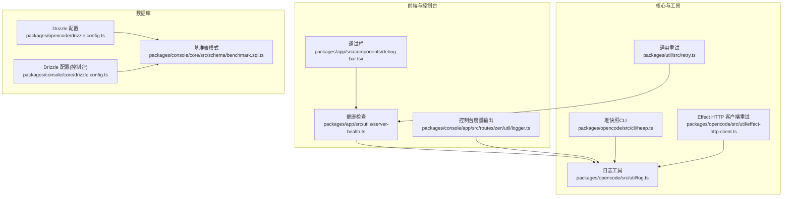
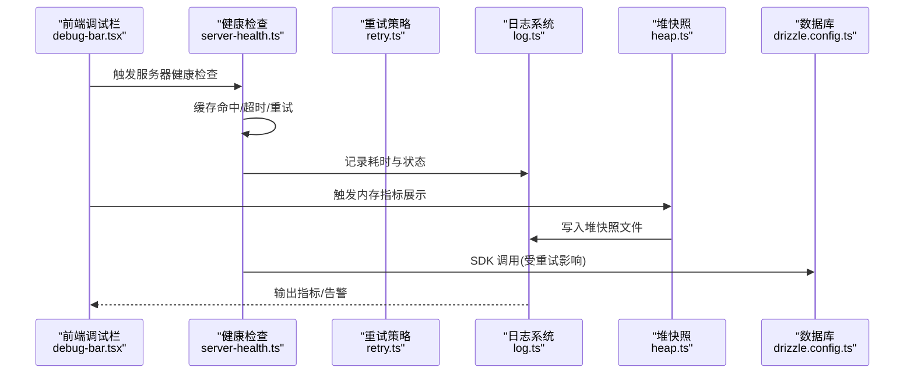
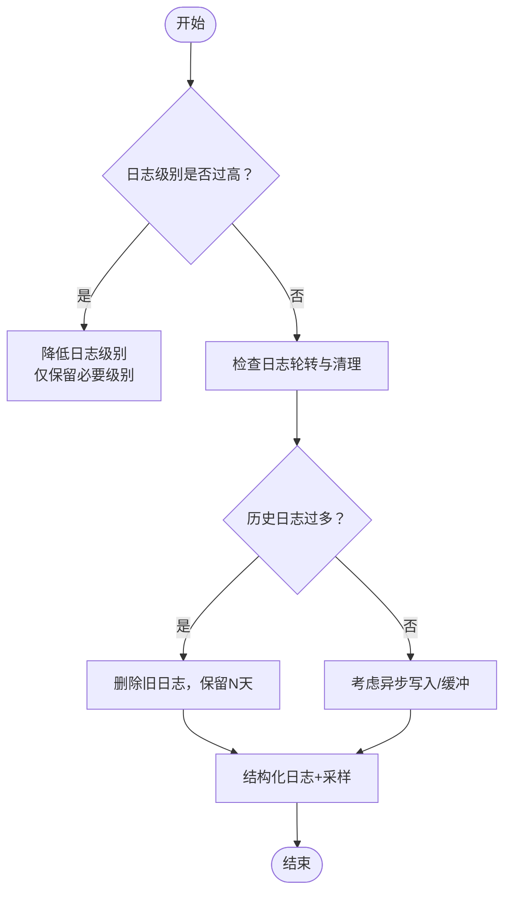
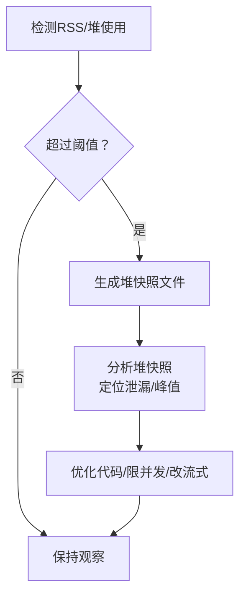
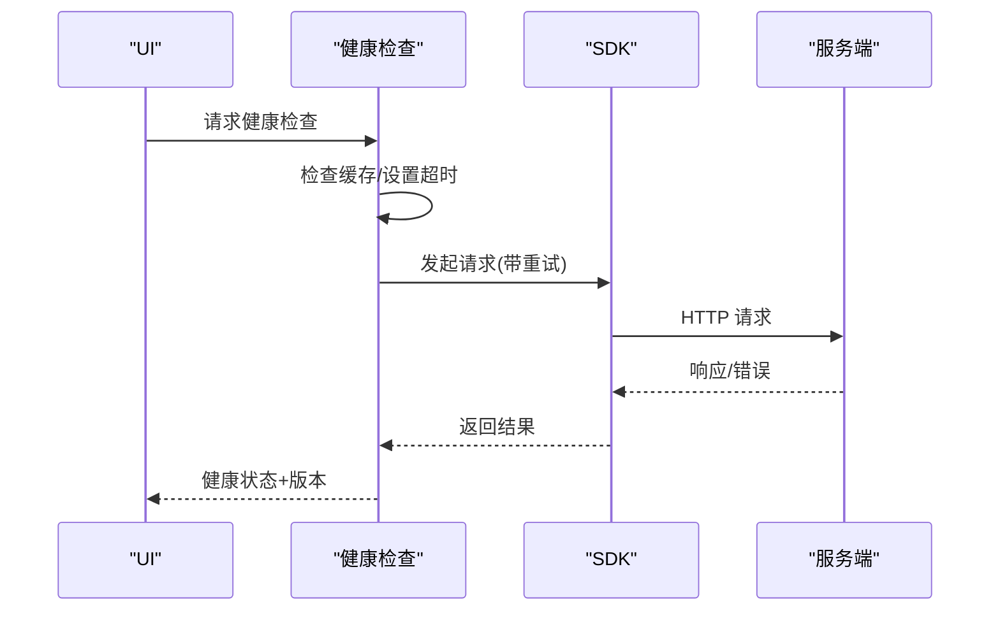
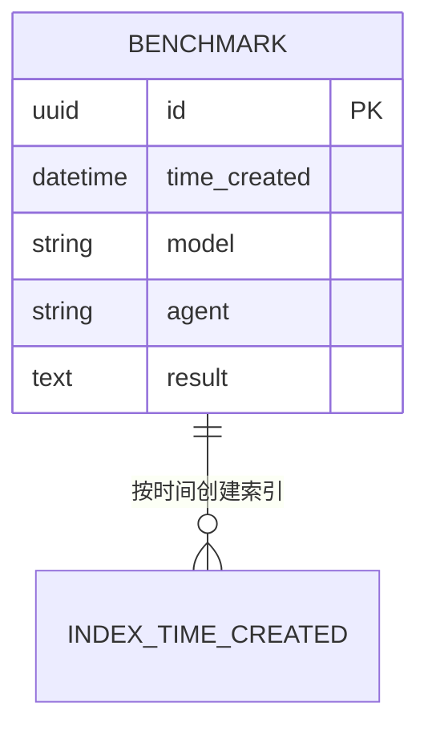
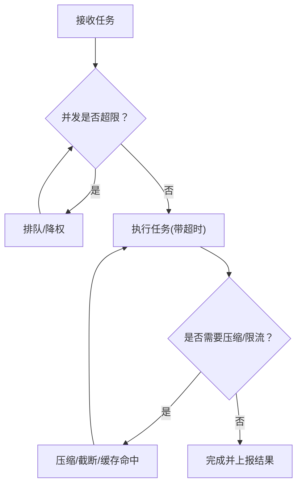
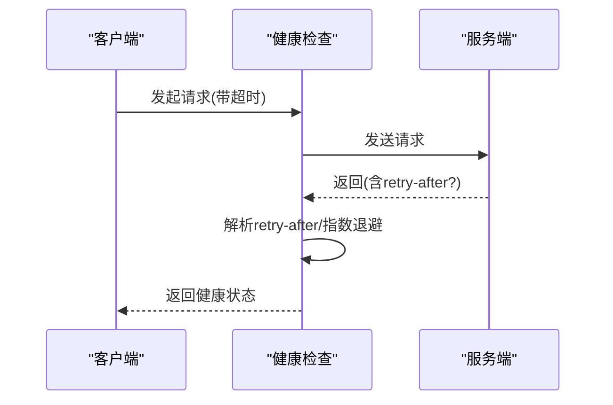
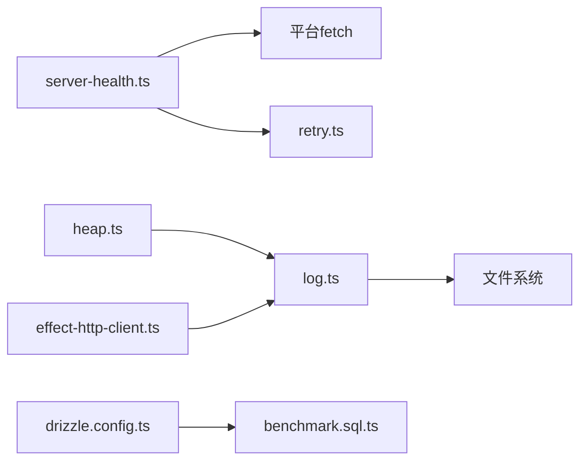

# 性能问题

<cite>
**本文引用的文件**
- [README.md](file://README.md)
- [package.json](file://package.json)
- [packages/opencode/drizzle.config.ts](file://packages/opencode/drizzle.config.ts)
- [packages/console/core/drizzle.config.ts](file://packages/console/core/drizzle.config.ts)
- [packages/opencode/src/util/log.ts](file://packages/opencode/src/util/log.ts)
- [packages/opencode/src/cli/heap.ts](file://packages/opencode/src/cli/heap.ts)
- [packages/app/src/components/debug-bar.tsx](file://packages/app/src/components/debug-bar.tsx)
- [packages/app/src/utils/server-health.ts](file://packages/app/src/utils/server-health.ts)
- [packages/util/src/retry.ts](file://packages/util/src/retry.ts)
- [packages/opencode/src/util/effect-http-client.ts](file://packages/opencode/src/util/effect-http-client.ts)
- [packages/console/app/src/routes/zen/util/logger.ts](file://packages/console/app/src/routes/zen/util/logger.ts)
- [packages/console/core/src/schema/benchmark.sql.ts](file://packages/console/core/src/schema/benchmark.sql.ts)
- [packages/opencode/test/session/retry.test.ts](file://packages/opencode/test/session/retry.test.ts)
- [packages/opencode/test/mcp/lifecycle.test.ts](file://packages/opencode/test/mcp/lifecycle.test.ts)
</cite>

## 目录
1. [简介](#简介)
2. [项目结构](#项目结构)
3. [核心组件](#核心组件)
4. [架构总览](#架构总览)
5. [详细组件分析](#详细组件分析)
6. [依赖关系分析](#依赖关系分析)
7. [性能考量](#性能考量)
8. [故障排查指南](#故障排查指南)
9. [结论](#结论)
10. [附录](#附录)

## 简介
本指南聚焦于 OpenCode 在实际运行中可能遇到的性能问题：内存使用过高、CPU 占用异常、响应时间过长，并提供系统化的诊断与优化路径。内容涵盖日志系统对性能的影响与优化（日志级别、轮转与清理）、数据库查询优化（索引、迁移与连接配置）、代理执行效率（并发控制、资源限制、任务调度）、网络请求优化（超时、重试、连接复用），以及性能监控工具与关键指标的解读。

## 项目结构
OpenCode 采用多包工作区组织，前端与控制台、后端服务、CLI 工具、数据库迁移与模式定义分布在不同包中。与性能密切相关的模块包括：
- 日志与堆快照：packages/opencode/src/util/log.ts、packages/opencode/src/cli/heap.ts
- 健康检查与网络重试：packages/app/src/utils/server-health.ts、packages/util/src/retry.ts、packages/opencode/src/util/effect-http-client.ts
- 数据库配置与模式：packages/opencode/drizzle.config.ts、packages/console/core/drizzle.config.ts、packages/console/core/src/schema/benchmark.sql.ts
- 调试面板与内存可视化：packages/app/src/components/debug-bar.tsx
- 控制台度量输出：packages/console/app/src/routes/zen/util/logger.ts

图表来源
- [packages/app/src/components/debug-bar.tsx:1-52](file://packages/app/src/components/debug-bar.tsx#L1-L52)
- [packages/app/src/utils/server-health.ts:1-114](file://packages/app/src/utils/server-health.ts#L1-L114)
- [packages/opencode/src/util/log.ts:60-182](file://packages/opencode/src/util/log.ts#L60-L182)
- [packages/opencode/src/cli/heap.ts:1-59](file://packages/opencode/src/cli/heap.ts#L1-L59)
- [packages/util/src/retry.ts:1-42](file://packages/util/src/retry.ts#L1-L42)
- [packages/opencode/src/util/effect-http-client.ts:1-12](file://packages/opencode/src/util/effect-http-client.ts#L1-L12)
- [packages/console/app/src/routes/zen/util/logger.ts:1-12](file://packages/console/app/src/routes/zen/util/logger.ts#L1-L12)
- [packages/opencode/drizzle.config.ts:1-11](file://packages/opencode/drizzle.config.ts#L1-L11)
- [packages/console/core/drizzle.config.ts:1-21](file://packages/console/core/drizzle.config.ts#L1-L21)
- [packages/console/core/src/schema/benchmark.sql.ts:1-14](file://packages/console/core/src/schema/benchmark.sql.ts#L1-L14)

章节来源
- [README.md:1-142](file://README.md#L1-L142)
- [package.json:1-124](file://package.json#L1-L124)

## 核心组件
- 日志系统与性能影响
  - 日志初始化、写入与轮转清理：[init/create/write/cleanup:60-90](file://packages/opencode/src/util/log.ts#L60-L90)
  - 指标计时器与耗时统计：[time/stop:157-173](file://packages/opencode/src/util/log.ts#L157-L173)
  - 控制台度量输出：[logger.metric:4-6](file://packages/console/app/src/routes/zen/util/logger.ts#L4-L6)
- 内存与堆快照
  - 自动堆快照触发阈值与周期：[Heap.start/run:16-58](file://packages/opencode/src/cli/heap.ts#L16-L58)
  - 前端调试栏内存指标展示：[mb/bad/状态渲染:41-443](file://packages/app/src/components/debug-bar.tsx#L41-L443)
- 健康检查与网络重试
  - 健康检查缓存、超时与重试：[checkServerHealth/useCheckServerHealth:68-113](file://packages/app/src/utils/server-health.ts#L68-L113)
  - 通用重试策略：[retry:26-41](file://packages/util/src/retry.ts#L26-L41)
  - Effect HTTP 客户端瞬态读取重试：[withTransientReadRetry:4-11](file://packages/opencode/src/util/effect-http-client.ts#L4-L11)
- 数据库配置与模式
  - SQLite 本地开发配置：[drizzle.config.ts:1-11](file://packages/opencode/drizzle.config.ts#L1-L11)
  - MySQL 控制台环境配置：[drizzle.config.ts:1-21](file://packages/console/core/drizzle.config.ts#L1-L21)
  - 基准表模式与索引：[BenchmarkTable:1-14](file://packages/console/core/src/schema/benchmark.sql.ts#L1-L14)

章节来源
- [packages/opencode/src/util/log.ts:60-182](file://packages/opencode/src/util/log.ts#L60-L182)
- [packages/console/app/src/routes/zen/util/logger.ts:1-12](file://packages/console/app/src/routes/zen/util/logger.ts#L1-L12)
- [packages/opencode/src/cli/heap.ts:1-59](file://packages/opencode/src/cli/heap.ts#L1-L59)
- [packages/app/src/components/debug-bar.tsx:1-52](file://packages/app/src/components/debug-bar.tsx#L1-L52)
- [packages/app/src/utils/server-health.ts:1-114](file://packages/app/src/utils/server-health.ts#L1-L114)
- [packages/util/src/retry.ts:1-42](file://packages/util/src/retry.ts#L1-L42)
- [packages/opencode/src/util/effect-http-client.ts:1-12](file://packages/opencode/src/util/effect-http-client.ts#L1-L12)
- [packages/opencode/drizzle.config.ts:1-11](file://packages/opencode/drizzle.config.ts#L1-L11)
- [packages/console/core/drizzle.config.ts:1-21](file://packages/console/core/drizzle.config.ts#L1-L21)
- [packages/console/core/src/schema/benchmark.sql.ts:1-14](file://packages/console/core/src/schema/benchmark.sql.ts#L1-L14)

## 架构总览
下图展示了与性能相关的关键交互：前端通过健康检查与重试策略保障网络稳定性；日志与堆快照用于定位内存与耗时问题；数据库配置与模式支撑查询优化与数据持久化。

图表来源
- [packages/app/src/components/debug-bar.tsx:1-52](file://packages/app/src/components/debug-bar.tsx#L1-L52)
- [packages/app/src/utils/server-health.ts:68-113](file://packages/app/src/utils/server-health.ts#L68-L113)
- [packages/util/src/retry.ts:26-41](file://packages/util/src/retry.ts#L26-L41)
- [packages/opencode/src/util/log.ts:60-182](file://packages/opencode/src/util/log.ts#L60-L182)
- [packages/opencode/src/cli/heap.ts:16-58](file://packages/opencode/src/cli/heap.ts#L16-L58)
- [packages/opencode/drizzle.config.ts:1-11](file://packages/opencode/drizzle.config.ts#L1-L11)

## 详细组件分析

### 日志系统与性能优化
- 性能影响
  - 文件写入阻塞：日志写入为同步回调封装，频繁写入会阻塞事件循环，导致 CPU 占用升高与延迟增加。
  - 日志文件膨胀：未清理的历史日志会占用磁盘空间，影响 I/O 吞吐。
- 优化策略
  - 降低日志级别：仅在开发阶段启用详细日志，生产默认 INFO/WARN/ERROR。
  - 合理轮转与清理：保留最近 N 天日志，删除旧文件，避免无限增长。
  - 异步写入与缓冲：将写入改为异步流或批量写入，减少主线程阻塞。
  - 结构化日志与采样：对高频事件进行采样，输出关键字段而非完整对象。
- 关键实现参考
  - 初始化与清理：[init/cleanup:60-90](file://packages/opencode/src/util/log.ts#L60-L90)
  - 写入与格式化：[write/formatError:69-97](file://packages/opencode/src/util/log.ts#L69-L97)
  - 指标计时：[time/stop:157-173](file://packages/opencode/src/util/log.ts#L157-L173)
  - 控制台度量输出：[logger.metric:4-6](file://packages/console/app/src/routes/zen/util/logger.ts#L4-L6)

图表来源
- [packages/opencode/src/util/log.ts:60-182](file://packages/opencode/src/util/log.ts#L60-L182)
- [packages/console/app/src/routes/zen/util/logger.ts:1-12](file://packages/console/app/src/routes/zen/util/logger.ts#L1-L12)

章节来源
- [packages/opencode/src/util/log.ts:60-182](file://packages/opencode/src/util/log.ts#L60-L182)
- [packages/console/app/src/routes/zen/util/logger.ts:1-12](file://packages/console/app/src/routes/zen/util/logger.ts#L1-L12)

### 内存使用过高与堆快照
- 现象
  - RSS/堆使用持续上升，最终触发 OOM 或 GC 压力增大。
- 诊断
  - 前端调试栏显示堆使用与上限比例，辅助快速定位异常。
  - CLI 自动堆快照：当 RSS 超过阈值时定期生成堆快照文件，便于离线分析。
- 优化
  - 减少大对象常驻：避免闭包捕获大型上下文，及时释放缓存。
  - 控制并发：限制同时处理的任务数，避免峰值内存堆积。
  - 使用流式处理：对大文件/大响应采用流式读取，降低峰值内存。
- 关键实现参考
  - 堆快照触发与定时器：[Heap.start/run:16-58](file://packages/opencode/src/cli/heap.ts#L16-L58)
  - 前端内存指标展示：[mb/bad/渲染:41-443](file://packages/app/src/components/debug-bar.tsx#L41-L443)

图表来源
- [packages/opencode/src/cli/heap.ts:16-58](file://packages/opencode/src/cli/heap.ts#L16-L58)
- [packages/app/src/components/debug-bar.tsx:41-443](file://packages/app/src/components/debug-bar.tsx#L41-L443)

章节来源
- [packages/opencode/src/cli/heap.ts:1-59](file://packages/opencode/src/cli/heap.ts#L1-L59)
- [packages/app/src/components/debug-bar.tsx:1-52](file://packages/app/src/components/debug-bar.tsx#L1-L52)

### 响应时间过长与健康检查
- 现象
  - 请求超时、重试频繁、UI 卡顿。
- 诊断
  - 健康检查带缓存与指数退避重试，避免抖动与放大效应。
  - 前端可显示服务器健康状态，辅助判断是单点还是全局问题。
- 优化
  - 合理设置超时与重试次数，避免无界等待。
  - 对不可达节点进行快速失败与降级。
  - 连接复用与长连接策略（如适用）。
- 关键实现参考
  - 健康检查与缓存：[checkServerHealth/useCheckServerHealth:68-113](file://packages/app/src/utils/server-health.ts#L68-L113)
  - 通用重试策略：[retry:26-41](file://packages/util/src/retry.ts#L26-L41)
  - Effect HTTP 客户端瞬态重试：[withTransientReadRetry:4-11](file://packages/opencode/src/util/effect-http-client.ts#L4-L11)

图表来源
- [packages/app/src/utils/server-health.ts:68-113](file://packages/app/src/utils/server-health.ts#L68-L113)
- [packages/util/src/retry.ts:26-41](file://packages/util/src/retry.ts#L26-L41)
- [packages/opencode/src/util/effect-http-client.ts:1-12](file://packages/opencode/src/util/effect-http-client.ts#L1-L12)

章节来源
- [packages/app/src/utils/server-health.ts:1-114](file://packages/app/src/utils/server-health.ts#L1-L114)
- [packages/util/src/retry.ts:1-42](file://packages/util/src/retry.ts#L1-L42)
- [packages/opencode/src/util/effect-http-client.ts:1-12](file://packages/opencode/src/util/effect-http-client.ts#L1-L12)

### 数据库查询优化
- 索引与模式
  - 基准表包含时间戳索引，有助于按时间范围查询。
  - SQLite 与 MySQL 双配置，开发与生产环境分离。
- 优化建议
  - 为高频查询列建立合适索引，避免全表扫描。
  - 使用分页/游标分页，限制单次返回量。
  - 查询缓存：对稳定报表类查询引入缓存层。
  - 连接池：合理设置最大连接数、空闲回收与超时。
- 关键实现参考
  - 基准表模式与索引：[BenchmarkTable:1-14](file://packages/console/core/src/schema/benchmark.sql.ts#L1-L14)
  - SQLite 配置：[drizzle.config.ts:1-11](file://packages/opencode/drizzle.config.ts#L1-L11)
  - MySQL 配置：[drizzle.config.ts:1-21](file://packages/console/core/drizzle.config.ts#L1-L21)

图表来源
- [packages/console/core/src/schema/benchmark.sql.ts:1-14](file://packages/console/core/src/schema/benchmark.sql.ts#L1-L14)

章节来源
- [packages/console/core/src/schema/benchmark.sql.ts:1-14](file://packages/console/core/src/schema/benchmark.sql.ts#L1-L14)
- [packages/opencode/drizzle.config.ts:1-11](file://packages/opencode/drizzle.config.ts#L1-L11)
- [packages/console/core/drizzle.config.ts:1-21](file://packages/console/core/drizzle.config.ts#L1-L21)

### 代理执行效率优化
- 并发控制
  - 限制同时运行的子任务数量，避免 CPU/IO 抢占。
  - 对外部调用设置超时与取消信号，防止阻塞。
- 资源限制
  - 对输入/输出 token 上限进行校验与压缩，必要时自动压缩会话。
- 任务调度
  - 将长耗时步骤拆分为多个短任务，支持断点续跑。
- 参考测试
  - 会话压缩与溢出判定：[SessionCompaction:284-318](file://packages/opencode/test/session/compaction.test.ts#L284-L318)
  - 会话重试策略与 retry-after 解析：[SessionRetry:35-71](file://packages/opencode/test/session/retry.test.ts#L35-L71)
  - MCP 传输泄漏与关闭：[MCP 生命周期:719-750](file://packages/opencode/test/mcp/lifecycle.test.ts#L719-L750)

图表来源
- [packages/opencode/test/session/compaction.test.ts:284-318](file://packages/opencode/test/session/compaction.test.ts#L284-L318)
- [packages/opencode/test/session/retry.test.ts:35-71](file://packages/opencode/test/session/retry.test.ts#L35-L71)
- [packages/opencode/test/mcp/lifecycle.test.ts:719-750](file://packages/opencode/test/mcp/lifecycle.test.ts#L719-L750)

章节来源
- [packages/opencode/test/session/compaction.test.ts:284-318](file://packages/opencode/test/session/compaction.test.ts#L284-L318)
- [packages/opencode/test/session/retry.test.ts:35-71](file://packages/opencode/test/session/retry.test.ts#L35-L71)
- [packages/opencode/test/mcp/lifecycle.test.ts:719-750](file://packages/opencode/test/mcp/lifecycle.test.ts#L719-L750)

### 网络请求优化
- 超时与重试
  - 健康检查内置超时与重试，避免长时间阻塞。
  - 支持从响应头解析 retry-after，优先于指数退避。
- 连接复用
  - 在浏览器/Node 环境中尽量复用连接，减少握手开销。
- 取消与泄漏防护
  - 对失败的远程传输进行关闭，避免连接泄漏。
- 关键实现参考
  - 健康检查超时/重试/缓存：[checkServerHealth:68-93](file://packages/app/src/utils/server-health.ts#L68-L93)
  - retry-after 解析与边界处理：[SessionRetry:35-71](file://packages/opencode/test/session/retry.test.ts#L35-L71)
  - 传输关闭与泄漏防护：[MCP 测试:719-750](file://packages/opencode/test/mcp/lifecycle.test.ts#L719-L750)

图表来源
- [packages/app/src/utils/server-health.ts:68-93](file://packages/app/src/utils/server-health.ts#L68-L93)
- [packages/opencode/test/session/retry.test.ts:35-71](file://packages/opencode/test/session/retry.test.ts#L35-L71)
- [packages/opencode/test/mcp/lifecycle.test.ts:719-750](file://packages/opencode/test/mcp/lifecycle.test.ts#L719-L750)

章节来源
- [packages/app/src/utils/server-health.ts:1-114](file://packages/app/src/utils/server-health.ts#L1-L114)
- [packages/opencode/test/session/retry.test.ts:35-71](file://packages/opencode/test/session/retry.test.ts#L35-L71)
- [packages/opencode/test/mcp/lifecycle.test.ts:719-750](file://packages/opencode/test/mcp/lifecycle.test.ts#L719-L750)

## 依赖关系分析
- 组件耦合
  - 健康检查依赖平台 fetch 实现，具备可替换性。
  - 日志系统被多处模块使用，需统一策略避免性能回退。
  - 堆快照与日志联动，便于问题复盘。
- 外部依赖
  - Drizzle 适配 SQLite/MySQL，迁移与模式定义清晰。
  - Effect HTTP 提供稳定的瞬态重试能力。

图表来源
- [packages/app/src/utils/server-health.ts:1-114](file://packages/app/src/utils/server-health.ts#L1-L114)
- [packages/util/src/retry.ts:1-42](file://packages/util/src/retry.ts#L1-L42)
- [packages/opencode/src/util/log.ts:60-182](file://packages/opencode/src/util/log.ts#L60-L182)
- [packages/opencode/src/cli/heap.ts:1-59](file://packages/opencode/src/cli/heap.ts#L1-L59)
- [packages/opencode/src/util/effect-http-client.ts:1-12](file://packages/opencode/src/util/effect-http-client.ts#L1-L12)
- [packages/opencode/drizzle.config.ts:1-11](file://packages/opencode/drizzle.config.ts#L1-L11)
- [packages/console/core/src/schema/benchmark.sql.ts:1-14](file://packages/console/core/src/schema/benchmark.sql.ts#L1-L14)

章节来源
- [package.json:1-124](file://package.json#L1-L124)

## 性能考量
- 内存
  - 监控 RSS/堆使用，结合堆快照定位泄漏与峰值。
  - 限制并发与缓存大小，避免内存堆积。
- CPU
  - 降低日志级别与频率，避免频繁 I/O。
  - 合理超时与重试，避免忙轮询。
- I/O
  - 日志轮转与清理，避免磁盘压力。
  - 数据库查询加索引与分页，避免全表扫描。
- 网络
  - 合理超时与 retry-after，避免长尾请求。
  - 连接复用与传输关闭，避免泄漏。

## 故障排查指南
- 内存飙升
  - 步骤：查看前端内存指标 → 触发堆快照 → 分析堆快照 → 定位大对象/泄漏。
  - 参考：[heap.ts:16-58](file://packages/opencode/src/cli/heap.ts#L16-L58)、[debug-bar.tsx:41-443](file://packages/app/src/components/debug-bar.tsx#L41-L443)
- 响应缓慢
  - 步骤：确认健康检查状态 → 查看日志耗时 → 检查重试策略 → 评估并发。
  - 参考：[server-health.ts:68-113](file://packages/app/src/utils/server-health.ts#L68-L113)、[log.ts:157-173](file://packages/opencode/src/util/log.ts#L157-L173)
- 日志过大
  - 步骤：检查轮转策略 → 清理旧日志 → 降低日志级别 → 异步写入。
  - 参考：[log.ts:60-90](file://packages/opencode/src/util/log.ts#L60-L90)
- 数据库慢查询
  - 步骤：确认索引是否存在 → 分页/游标分页 → 查询缓存 → 连接池优化。
  - 参考：[benchmark.sql.ts:1-14](file://packages/console/core/src/schema/benchmark.sql.ts#L1-L14)、[drizzle.config.ts:1-11](file://packages/opencode/drizzle.config.ts#L1-L11)
- 网络不稳定
  - 步骤：检查超时与 retry-after → 验证传输关闭 → 快速失败与降级。
  - 参考：[server-health.ts:68-93](file://packages/app/src/utils/server-health.ts#L68-L93)、[mcp lifecycle test:719-750](file://packages/opencode/test/mcp/lifecycle.test.ts#L719-L750)

章节来源
- [packages/opencode/src/cli/heap.ts:1-59](file://packages/opencode/src/cli/heap.ts#L1-L59)
- [packages/app/src/components/debug-bar.tsx:1-52](file://packages/app/src/components/debug-bar.tsx#L1-L52)
- [packages/app/src/utils/server-health.ts:1-114](file://packages/app/src/utils/server-health.ts#L1-L114)
- [packages/opencode/src/util/log.ts:60-182](file://packages/opencode/src/util/log.ts#L60-L182)
- [packages/console/core/src/schema/benchmark.sql.ts:1-14](file://packages/console/core/src/schema/benchmark.sql.ts#L1-L14)
- [packages/opencode/test/mcp/lifecycle.test.ts:719-750](file://packages/opencode/test/mcp/lifecycle.test.ts#L719-L750)

## 结论
通过统一的日志策略、健康检查与重试机制、合理的数据库索引与分页、以及堆快照与前端指标的配合，可以有效定位并缓解 OpenCode 的内存、CPU 与响应时间问题。建议在生产环境中以“可观测性优先”为原则，逐步完善异步日志、连接池与缓存策略，确保系统在高负载下的稳定性与可维护性。

## 附录
- 关键指标建议
  - 内存：RSS、堆使用、堆快照文件大小
  - CPU：事件循环阻塞时间、GC 次数与耗时
  - I/O：日志写入延迟、磁盘使用率
  - 网络：请求延迟 P95/P99、重试次数、超时比例
  - 数据库：查询耗时 P95/P99、索引命中率、连接池利用率
- 工具与命令
  - 生成堆快照：[heap.ts:16-58](file://packages/opencode/src/cli/heap.ts#L16-L58)
  - 启动开发：[package.json scripts:8-18](file://package.json#L8-L18)
  - 数据库迁移：[drizzle.config.ts:1-11](file://packages/opencode/drizzle.config.ts#L1-L11)