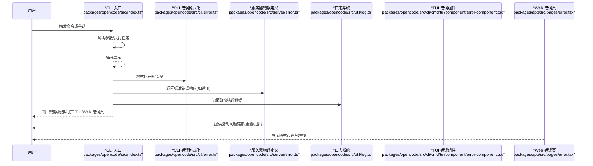
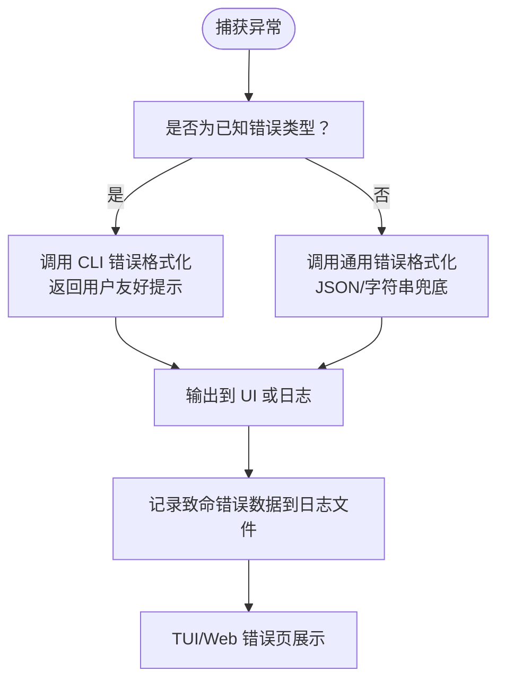
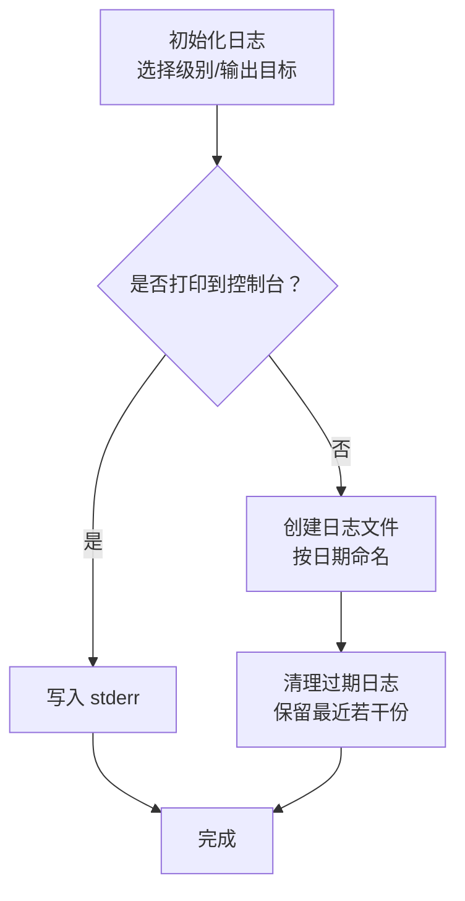
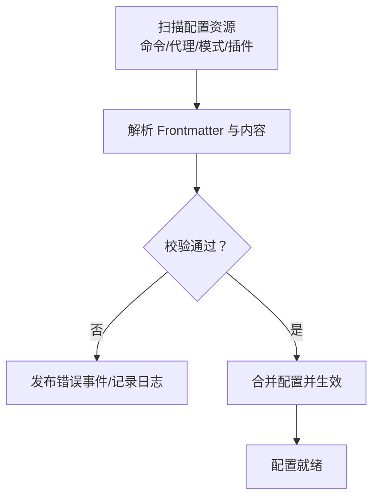
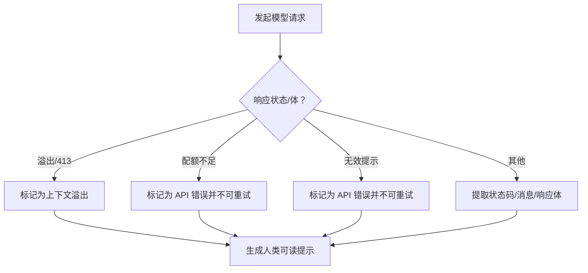
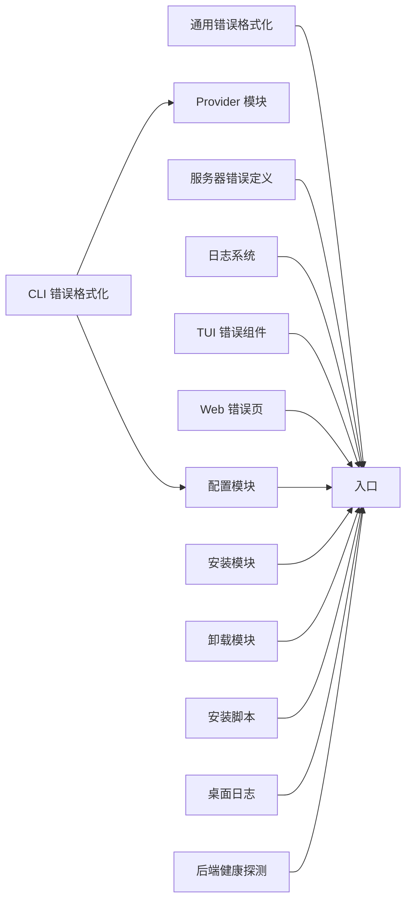

# 故障排除与常见问题

<cite>
**本文引用的文件**
- [README.md](file://README.md)
- [SECURITY.md](file://SECURITY.md)
- [CONTRIBUTING.md](file://CONTRIBUTING.md)
- [packages/opencode/src/cli/error.ts](file://packages/opencode/src/cli/error.ts)
- [packages/opencode/src/server/error.ts](file://packages/opencode/src/server/error.ts)
- [packages/opencode/src/util/error.ts](file://packages/opencode/src/util/error.ts)
- [packages/opencode/src/provider/error.ts](file://packages/opencode/src/provider/error.ts)
- [packages/opencode/src/util/log.ts](file://packages/opencode/src/util/log.ts)
- [packages/desktop/src-tauri/src/logging.rs](file://packages/desktop/src-tauri/src/logging.rs)
- [packages/opencode/src/index.ts](file://packages/opencode/src/index.ts)
- [packages/opencode/src/cli/cmd/tui/component/error-component.tsx](file://packages/opencode/src/cli/cmd/tui/component/error-component.tsx)
- [packages/opencode/src/config/config.ts](file://packages/opencode/src/config/config.ts)
- [packages/opencode/src/installation/index.ts](file://packages/opencode/src/installation/index.ts)
- [packages/opencode/src/cli/cmd/uninstall.ts](file://packages/opencode/src/cli/cmd/uninstall.ts)
- [install](file://install)
- [packages/app/e2e/backend.ts](file://packages/app/e2e/backend.ts)
- [packages/app/src/pages/error.tsx](file://packages/app/src/pages/error.tsx)
- [packages/opencode/src/provider/sdk/copilot/openai-compatible-error.ts](file://packages/opencode/src/provider/sdk/copilot/openai-compatible-error.ts)
- [packages/app/src/components/debug-bar.tsx](file://packages/app/src/components/debug-bar.tsx)
- [packages/app/src/utils/persist.ts](file://packages/app/src/utils/persist.ts)
- [packages/console/app/src/routes/zen/util/handler.ts](file://packages/console/app/src/routes/zen/util/handler.ts)
- [packages/console/app/src/routes/zen/v1/models.ts](file://packages/console/app/src/routes/zen/v1/models.ts)
</cite>

## 目录
1. [简介](#简介)
2. [项目结构](#项目结构)
3. [核心组件](#核心组件)
4. [架构总览](#架构总览)
5. [详细组件分析](#详细组件分析)
6. [依赖关系分析](#依赖关系分析)
7. [性能考虑](#性能考虑)
8. [故障排除指南](#故障排除指南)
9. [结论](#结论)
10. [附录](#附录)

## 简介
本指南面向使用 OpenCode 的用户与维护者，聚焦于“如何快速定位并解决常见问题”。内容覆盖安装失败、配置错误、模型连接问题、权限与安全问题、日志与调试方法、性能优化建议、版本兼容与升级注意事项，以及社区支持与问题反馈流程。文档以分层方式呈现，既适合初学者快速上手，也为高级用户提供深入的技术细节与可视化图示。

## 项目结构
OpenCode 采用多包（monorepo）组织，核心运行时位于 packages/opencode，包含 CLI、服务端、配置与错误处理等模块；桌面应用在 packages/desktop；Web 控制台在 packages/console；UI 组件在 packages/ui；工具库在 packages/util；SDK 在 sdks/vscode 等。安装脚本位于仓库根目录的 install 文件中。

```mermaid
graph TB
subgraph "命令行与核心"
CLI["CLI 错误格式化<br/>packages/opencode/src/cli/error.ts"]
SRVERR["服务器错误定义<br/>packages/opencode/src/server/error.ts"]
UTILERR["通用错误格式化<br/>packages/opencode/src/util/error.ts"]
PROVERR["模型提供商错误解析<br/>packages/opencode/src/provider/error.ts"]
LOG["日志系统<br/>packages/opencode/src/util/log.ts"]
end
subgraph "入口与界面"
ENTRY["程序入口与致命错误处理<br/>packages/opencode/src/index.ts"]
TUIERR["TUI 错误组件与反馈链接<br/>packages/opencode/src/cli/cmd/tui/component/error-component.tsx"]
WEBERR["Web 错误页链式格式化<br/>packages/app/src/pages/error.tsx"]
end
subgraph "配置与安装"
CFG["配置加载与校验<br/>packages/opencode/src/config/config.ts"]
INST["安装版本检测<br/>packages/opencode/src/installation/index.ts"]
UNINST["卸载摘要与清理<br/>packages/opencode/src/cli/cmd/uninstall.ts"]
SH["安装脚本 PATH 注入逻辑<br/>install"]
end
subgraph "桌面与测试"
DESKLOG["桌面日志初始化与轮转<br/>packages/desktop/src-tauri/src/logging.rs"]
E2E["后端健康探测与超时<br/>packages/app/e2e/backend.ts"]
end
CLI --> ENTRY
SRVERR --> ENTRY
UTILERR --> ENTRY
PROVERR --> ENTRY
LOG --> ENTRY
TUIERR --> ENTRY
WEBERR --> ENTRY
CFG --> ENTRY
INST --> ENTRY
UNINST --> ENTRY
SH --> ENTRY
DESKLOG --> ENTRY
E2E --> ENTRY
```

图表来源
- [packages/opencode/src/cli/error.ts:1-47](file://packages/opencode/src/cli/error.ts#L1-L47)
- [packages/opencode/src/server/error.ts:1-37](file://packages/opencode/src/server/error.ts#L1-L37)
- [packages/opencode/src/util/error.ts:1-78](file://packages/opencode/src/util/error.ts#L1-L78)
- [packages/opencode/src/provider/error.ts:1-198](file://packages/opencode/src/provider/error.ts#L1-L198)
- [packages/opencode/src/util/log.ts:1-182](file://packages/opencode/src/util/log.ts#L1-L182)
- [packages/opencode/src/index.ts:187-240](file://packages/opencode/src/index.ts#L187-L240)
- [packages/opencode/src/cli/cmd/tui/component/error-component.tsx:1-93](file://packages/opencode/src/cli/cmd/tui/component/error-component.tsx#L1-L93)
- [packages/app/src/pages/error.tsx:166-219](file://packages/app/src/pages/error.tsx#L166-L219)
- [packages/opencode/src/config/config.ts:1-800](file://packages/opencode/src/config/config.ts#L1-L800)
- [packages/opencode/src/installation/index.ts:201-221](file://packages/opencode/src/installation/index.ts#L201-L221)
- [packages/opencode/src/cli/cmd/uninstall.ts:98-128](file://packages/opencode/src/cli/cmd/uninstall.ts#L98-L128)
- [install:403-444](file://install#L403-L444)
- [packages/desktop/src-tauri/src/logging.rs:1-76](file://packages/desktop/src-tauri/src/logging.rs#L1-L76)
- [packages/app/e2e/backend.ts:1-63](file://packages/app/e2e/backend.ts#L1-L63)

章节来源
- [README.md: 安装与平台说明:46-98](file://README.md#L46-L98)
- [CONTRIBUTING.md: 开发与调试要点:158-190](file://CONTRIBUTING.md#L158-L190)

## 核心组件
- 错误格式化与提示：CLI 层对 MCP、Provider 初始化、配置错误进行专门提示；通用错误通过统一格式化输出；Web/TUI 错误页支持链式错误格式化与复制问题链接。
- 日志系统：支持级别控制、标签化、时间统计、文件落盘与自动清理；桌面端日志按日期命名并轮转。
- 配置与安装：配置加载包含命令、代理、插件、权限等；安装脚本负责 PATH 注入与版本检测；卸载流程列出将移除项。
- 模型提供商错误：针对不同提供商的溢出、配额、无效提示等错误进行解析与可重试判断，并给出人类可读提示。
- 服务器错误响应：定义标准错误响应结构，便于前端与客户端统一处理。

章节来源
- [packages/opencode/src/cli/error.ts: 错误分类与提示:8-46](file://packages/opencode/src/cli/error.ts#L8-L46)
- [packages/opencode/src/util/error.ts: 通用错误格式化:3-35](file://packages/opencode/src/util/error.ts#L3-L35)
- [packages/opencode/src/server/error.ts: 服务器错误响应定义:5-36](file://packages/opencode/src/server/error.ts#L5-L36)
- [packages/opencode/src/util/log.ts: 日志级别与文件写入:12-90](file://packages/opencode/src/util/log.ts#L12-L90)
- [packages/desktop/src-tauri/src/logging.rs: 桌面日志轮转与尾部读取:10-76](file://packages/desktop/src-tauri/src/logging.rs#L10-L76)
- [packages/opencode/src/config/config.ts: 配置加载与校验:205-280](file://packages/opencode/src/config/config.ts#L205-L280)
- [packages/opencode/src/installation/index.ts: 版本检测:204-221](file://packages/opencode/src/installation/index.ts#L204-L221)
- [install: PATH 注入逻辑:403-444](file://install#L403-L444)
- [packages/opencode/src/cli/cmd/uninstall.ts: 卸载摘要:104-128](file://packages/opencode/src/cli/cmd/uninstall.ts#L104-L128)
- [packages/opencode/src/provider/error.ts: 上下文溢出与可重试判断:173-196](file://packages/opencode/src/provider/error.ts#L173-L196)

## 架构总览
下图展示从用户触发到错误呈现的关键路径，涵盖 CLI、服务端、日志与错误页面：

图表来源
- [packages/opencode/src/index.ts:187-240](file://packages/opencode/src/index.ts#L187-L240)
- [packages/opencode/src/cli/error.ts:8-46](file://packages/opencode/src/cli/error.ts#L8-L46)
- [packages/opencode/src/server/error.ts:5-36](file://packages/opencode/src/server/error.ts#L5-L36)
- [packages/opencode/src/util/log.ts:55-78](file://packages/opencode/src/util/log.ts#L55-L78)
- [packages/opencode/src/cli/cmd/tui/component/error-component.tsx:34-62](file://packages/opencode/src/cli/cmd/tui/component/error-component.tsx#L34-L62)
- [packages/app/src/pages/error.tsx:166-219](file://packages/app/src/pages/error.tsx#L166-L219)

## 详细组件分析

### 错误处理与提示组件
- CLI 错误格式化：对 MCP 失败、模型未找到、Provider 初始化失败、配置 JSON 不合法、配置目录拼写错误、Frontmatter 错误、配置整体非法等情况给出明确指引与建议命令。
- 通用错误格式化：优先使用 Error.stack，其次尝试 JSON 序列化，最后回退为字符串，确保任何输入都能被稳定输出。
- 服务器错误响应：定义 400/404 等错误响应结构，便于前后端一致处理。
- TUI/Web 错误页：链式格式化错误链，避免重复头信息；TUI 提供一键复制问题链接并预填版本号与堆栈片段。

图表来源
- [packages/opencode/src/cli/error.ts:8-46](file://packages/opencode/src/cli/error.ts#L8-L46)
- [packages/opencode/src/util/error.ts:3-35](file://packages/opencode/src/util/error.ts#L3-L35)
- [packages/opencode/src/server/error.ts:5-36](file://packages/opencode/src/server/error.ts#L5-L36)
- [packages/opencode/src/index.ts:226-232](file://packages/opencode/src/index.ts#L226-L232)
- [packages/opencode/src/cli/cmd/tui/component/error-component.tsx:34-62](file://packages/opencode/src/cli/cmd/tui/component/error-component.tsx#L34-L62)
- [packages/app/src/pages/error.tsx:166-219](file://packages/app/src/pages/error.tsx#L166-L219)

章节来源
- [packages/opencode/src/cli/error.ts: 已知错误映射:8-46](file://packages/opencode/src/cli/error.ts#L8-L46)
- [packages/opencode/src/util/error.ts: 通用错误格式化:3-35](file://packages/opencode/src/util/error.ts#L3-L35)
- [packages/opencode/src/server/error.ts: 服务器错误结构:5-36](file://packages/opencode/src/server/error.ts#L5-L36)
- [packages/opencode/src/cli/cmd/tui/component/error-component.tsx: 复制问题链接:34-62](file://packages/opencode/src/cli/cmd/tui/component/error-component.tsx#L34-L62)
- [packages/app/src/pages/error.tsx: 链式错误格式化:166-219](file://packages/app/src/pages/error.tsx#L166-L219)

### 日志系统与调试
- 运行时日志：支持 DEBUG/INFO/WARN/ERROR 级别，可打印到 stderr 或写入文件；自动清理旧日志，保留最近若干份。
- 桌面端日志：按日期生成日志文件，支持轮转与尾部读取，便于快速定位问题。
- 调试建议：开发期推荐使用 Bun 的 --inspect 方式启动，必要时分离调试服务端与 TUI，避免断点错位。

图表来源
- [packages/opencode/src/util/log.ts:60-90](file://packages/opencode/src/util/log.ts#L60-L90)
- [packages/desktop/src-tauri/src/logging.rs:10-43](file://packages/desktop/src-tauri/src/logging.rs#L10-L43)

章节来源
- [packages/opencode/src/util/log.ts: 日志初始化与清理:60-90](file://packages/opencode/src/util/log.ts#L60-L90)
- [packages/desktop/src-tauri/src/logging.rs: 桌面日志轮转:10-76](file://packages/desktop/src-tauri/src/logging.rs#L10-L76)
- [CONTRIBUTING.md: 调试建议:158-190](file://CONTRIBUTING.md#L158-L190)

### 配置与安装
- 配置加载：扫描命令、代理、模式、插件等资源，解析 Frontmatter 并进行严格校验，错误时发布会话事件并记录日志。
- 安装脚本：根据环境变量与 XDG 规范确定安装目录优先级；在 CI 环境自动注入 PATH；若 PATH 缺失，给出手动添加建议。
- 版本检测：通过 Homebrew API 获取最新稳定版，辅助用户确认是否需要升级。
- 卸载流程：列出将删除的目录、二进制与 Shell PATH 配置，避免误删或残留。

图表来源
- [packages/opencode/src/config/config.ts:205-280](file://packages/opencode/src/config/config.ts#L205-L280)
- [install: PATH 注入与 CI 支持:403-444](file://install#L403-L444)
- [packages/opencode/src/installation/index.ts:204-221](file://packages/opencode/src/installation/index.ts#L204-L221)
- [packages/opencode/src/cli/cmd/uninstall.ts:104-128](file://packages/opencode/src/cli/cmd/uninstall.ts#L104-L128)

章节来源
- [packages/opencode/src/config/config.ts: 配置加载与校验:205-280](file://packages/opencode/src/config/config.ts#L205-L280)
- [install: PATH 注入逻辑:403-444](file://install#L403-L444)
- [packages/opencode/src/installation/index.ts: 版本检测:204-221](file://packages/opencode/src/installation/index.ts#L204-L221)
- [packages/opencode/src/cli/cmd/uninstall.ts: 卸载摘要:104-128](file://packages/opencode/src/cli/cmd/uninstall.ts#L104-L128)

### 模型连接与提供商错误
- 错误解析：识别上下文溢出、配额不足、无效提示等常见错误；对 OpenAI 类接口进行可重试判断；对网关/代理返回的 HTML 页面给出明确提示。
- 错误结构：定义统一的错误数据结构与消息提取函数，支持多种 OpenAI 兼容提供商的差异化响应。

图表来源
- [packages/opencode/src/provider/error.ts:173-196](file://packages/opencode/src/provider/error.ts#L173-L196)
- [packages/opencode/src/provider/sdk/copilot/openai-compatible-error.ts:1-28](file://packages/opencode/src/provider/sdk/copilot/openai-compatible-error.ts#L1-L28)

章节来源
- [packages/opencode/src/provider/error.ts: 错误解析与可重试判断:173-196](file://packages/opencode/src/provider/error.ts#L173-L196)
- [packages/opencode/src/provider/sdk/copilot/openai-compatible-error.ts: 错误结构与消息提取:1-28](file://packages/opencode/src/provider/sdk/copilot/openai-compatible-error.ts#L1-L28)

### 安全与权限排查
- 威胁模型：强调不沙箱化，权限系统仅为 UX 提示；启用服务端需设置密码并自行加固；某些场景超出项目边界。
- Zen 授权：API Key 校验、工作区限制、订阅状态与匿名访问策略；禁用模型列表查询。
- 权限路由：会话权限响应接口用于审批或拒绝 AI 请求的权限。

章节来源
- [SECURITY.md: 威胁模型与报告流程:9-47](file://SECURITY.md#L9-L47)
- [packages/console/app/src/routes/zen/util/handler.ts: API Key 校验与计费信息:579-616](file://packages/console/app/src/routes/zen/util/handler.ts#L579-L616)
- [packages/console/app/src/routes/zen/v1/models.ts: 禁用模型查询:43-61](file://packages/console/app/src/routes/zen/v1/models.ts#L43-L61)
- [packages/opencode/src/server/routes/session.ts:995-1031](file://packages/opencode/src/server/routes/session.ts#L995-L1031)

## 依赖关系分析
- CLI 错误格式化依赖配置与 Provider 模块，用于区分不同错误类型并生成指导性提示。
- 通用错误格式化作为底层工具被入口与 UI 共同使用，保证错误输出一致性。
- 日志系统贯穿各模块，作为统一的可观测性基础设施。
- 配置模块与安装模块相互配合，前者决定行为，后者决定可用性。

图表来源
- [packages/opencode/src/cli/error.ts:1-7](file://packages/opencode/src/cli/error.ts#L1-L7)
- [packages/opencode/src/util/error.ts:1-78](file://packages/opencode/src/util/error.ts#L1-L78)
- [packages/opencode/src/server/error.ts:1-37](file://packages/opencode/src/server/error.ts#L1-L37)
- [packages/opencode/src/util/log.ts:1-182](file://packages/opencode/src/util/log.ts#L1-L182)
- [packages/opencode/src/index.ts:187-240](file://packages/opencode/src/index.ts#L187-L240)
- [packages/opencode/src/cli/cmd/tui/component/error-component.tsx:1-93](file://packages/opencode/src/cli/cmd/tui/component/error-component.tsx#L1-L93)
- [packages/app/src/pages/error.tsx:166-219](file://packages/app/src/pages/error.tsx#L166-L219)
- [packages/opencode/src/config/config.ts:1-800](file://packages/opencode/src/config/config.ts#L1-L800)
- [packages/opencode/src/installation/index.ts:201-221](file://packages/opencode/src/installation/index.ts#L201-L221)
- [packages/opencode/src/cli/cmd/uninstall.ts:98-128](file://packages/opencode/src/cli/cmd/uninstall.ts#L98-L128)
- [install:403-444](file://install#L403-L444)
- [packages/desktop/src-tauri/src/logging.rs:1-76](file://packages/desktop/src-tauri/src/logging.rs#L1-L76)
- [packages/app/e2e/backend.ts:1-63](file://packages/app/e2e/backend.ts#L1-L63)

## 性能考虑
- 内存与存储：Web 端持久化采用容量管理与逐出策略，避免超出配额导致写入失败；调试条可观察内存占用与渲染耗时。
- 缓存与并发：配置层使用 Effect.cached 实现计算去重与并发共享，减少重复初始化成本。
- 网络与超时：E2E 后端健康探测带超时与重试，避免长时间阻塞；模型请求前可评估上下文长度，避免 413/溢出错误。

章节来源
- [packages/app/src/utils/persist.ts: 存储容量与逐出:106-159](file://packages/app/src/utils/persist.ts#L106-L159)
- [packages/opencode/specs/effect-migration.md: Effect.cached 使用:124-148](file://packages/opencode/specs/effect-migration.md#L124-L148)
- [packages/app/e2e/backend.ts: 健康探测与超时:31-45](file://packages/app/e2e/backend.ts#L31-L45)
- [packages/opencode/src/provider/error.ts: 上下文溢出检测:173-196](file://packages/opencode/src/provider/error.ts#L173-L196)

## 故障排除指南

### 安装失败
- 症状：安装脚本无法写入 PATH 或找不到二进制。
- 排查步骤：
  - 检查 OPENCODE_INSTALL_DIR/XDG_BIN_DIR/HOME/bin 是否存在且可写。
  - 若 PATH 中未包含安装目录，参考安装脚本的 PATH 注入逻辑，手动追加。
  - 在 CI 环境检查 GITHUB_PATH 是否被正确追加。
- 参考
  - [安装脚本 PATH 注入:403-444](file://install#L403-L444)
  - [README 安装说明:46-98](file://README.md#L46-L98)

章节来源
- [install: PATH 注入与 CI 支持:403-444](file://install#L403-L444)
- [README.md: 安装与平台说明:46-98](file://README.md#L46-L98)

### 配置错误
- 症状：启动时报“配置无效”“JSON(C) 不合法”“目录名拼写错误”。
- 排查步骤：
  - 根据提示定位配置文件路径，修正 JSON(C) 语法或字段拼写。
  - 若为 Frontmatter 错误，按提示修复头部字段。
  - 若为目录名拼写，按建议重命名为正确名称。
- 参考
  - [CLI 错误格式化（配置类）:23-39](file://packages/opencode/src/cli/error.ts#L23-L39)
  - [配置加载与校验:205-280](file://packages/opencode/src/config/config.ts#L205-L280)

章节来源
- [packages/opencode/src/cli/error.ts: 配置错误映射:23-39](file://packages/opencode/src/cli/error.ts#L23-L39)
- [packages/opencode/src/config/config.ts: 配置加载与校验:205-280](file://packages/opencode/src/config/config.ts#L205-L280)

### 模型连接问题
- 症状：模型未找到、上下文溢出、配额不足、无效提示、401/403 网关拦截。
- 排查步骤：
  - 使用列出模型命令核对 provider/model 名称，检查大小写与拼写。
  - 减少输入上下文长度或拆分任务，避免超过模型上下文窗口。
  - 检查账户配额与订阅状态，必要时充值或升级。
  - 若出现网关/代理拦截，确认鉴权令牌有效并重新登录。
- 参考
  - [CLI 错误格式化（模型未找到/初始化）:11-22](file://packages/opencode/src/cli/error.ts#L11-L22)
  - [Provider 错误解析与可重试判断:173-196](file://packages/opencode/src/provider/error.ts#L173-L196)
  - [OpenAI 兼容错误结构:1-28](file://packages/opencode/src/provider/sdk/copilot/openai-compatible-error.ts#L1-L28)

章节来源
- [packages/opencode/src/cli/error.ts: 模型与 Provider 错误:11-22](file://packages/opencode/src/cli/error.ts#L11-L22)
- [packages/opencode/src/provider/error.ts: 错误解析与可重试判断:173-196](file://packages/opencode/src/provider/error.ts#L173-L196)
- [packages/opencode/src/provider/sdk/copilot/openai-compatible-error.ts: 错误结构:1-28](file://packages/opencode/src/provider/sdk/copilot/openai-compatible-error.ts#L1-L28)

### 权限与安全问题
- 症状：服务端未认证、权限弹窗频繁、API Key 无效、工作区限制。
- 排查步骤：
  - 启用服务端时务必设置密码，避免明文暴露。
  - 在 Zen 接口侧检查 API Key、工作区与订阅状态，确认禁用模型列表。
  - 对外部 MCP/OAuth 进行最小权限配置，避免过度授权。
- 参考
  - [安全策略与报告流程:21-47](file://SECURITY.md#L21-L47)
  - [Zen 授权与计费信息:579-616](file://packages/console/app/src/routes/zen/util/handler.ts#L579-L616)
  - [禁用模型查询:43-61](file://packages/console/app/src/routes/zen/v1/models.ts#L43-L61)

章节来源
- [SECURITY.md: 服务器与威胁模型:21-47](file://SECURITY.md#L21-L47)
- [packages/console/app/src/routes/zen/util/handler.ts: API Key 校验:579-616](file://packages/console/app/src/routes/zen/util/handler.ts#L579-L616)
- [packages/console/app/src/routes/zen/v1/models.ts: 禁用模型查询:43-61](file://packages/console/app/src/routes/zen/v1/models.ts#L43-L61)

### 日志分析与调试
- 步骤：
  - 查看入口日志文件路径，定位最近日志。
  - 桌面端可通过尾部读取功能快速查看最近若干行。
  - Web/TUI 错误页支持复制问题链接，便于社区反馈。
  - 开发期使用 Bun --inspect 分离调试服务端与 TUI，避免断点错位。
- 参考
  - [入口致命错误记录:226-232](file://packages/opencode/src/index.ts#L226-L232)
  - [日志初始化与文件路径:52-78](file://packages/opencode/src/util/log.ts#L52-L78)
  - [桌面日志尾部读取:45-58](file://packages/desktop/src-tauri/src/logging.rs#L45-L58)
  - [TUI 错误组件复制链接:34-62](file://packages/opencode/src/cli/cmd/tui/component/error-component.tsx#L34-L62)
  - [CONTRIBUTING 调试建议:158-190](file://CONTRIBUTING.md#L158-L190)

章节来源
- [packages/opencode/src/index.ts: 致命错误记录:226-232](file://packages/opencode/src/index.ts#L226-L232)
- [packages/opencode/src/util/log.ts: 日志文件路径:52-78](file://packages/opencode/src/util/log.ts#L52-L78)
- [packages/desktop/src-tauri/src/logging.rs: 尾部读取:45-58](file://packages/desktop/src-tauri/src/logging.rs#L45-L58)
- [packages/opencode/src/cli/cmd/tui/component/error-component.tsx: 复制问题链接:34-62](file://packages/opencode/src/cli/cmd/tui/component/error-component.tsx#L34-L62)
- [CONTRIBUTING.md: 调试建议:158-190](file://CONTRIBUTING.md#L158-L190)

### 性能诊断与优化
- 内存使用：
  - 关注 Web 调试条中的内存指标，避免长时间驻留大对象。
  - 持久化写入失败时启用逐出策略，释放空间后重试。
- 网络连接：
  - 使用健康探测接口验证后端可达性与响应时间。
  - 对长请求进行分片或降采样，避免 413/溢出。
- 缓存策略：
  - 利用 Effect.cached 去重并发计算，避免重复初始化。
- 参考
  - [调试条指标与阈值:1-52](file://packages/app/src/components/debug-bar.tsx#L1-L52)
  - [持久化容量与逐出:106-159](file://packages/app/src/utils/persist.ts#L106-L159)
  - [E2E 健康探测:31-45](file://packages/app/e2e/backend.ts#L31-L45)
  - [Effect.cached 使用:124-148](file://packages/opencode/specs/effect-migration.md#L124-L148)

章节来源
- [packages/app/src/components/debug-bar.tsx: 调试条指标:1-52](file://packages/app/src/components/debug-bar.tsx#L1-L52)
- [packages/app/src/utils/persist.ts: 逐出策略:106-159](file://packages/app/src/utils/persist.ts#L106-L159)
- [packages/app/e2e/backend.ts: 健康探测:31-45](file://packages/app/e2e/backend.ts#L31-L45)
- [packages/opencode/specs/effect-migration.md: Effect.cached:124-148](file://packages/opencode/specs/effect-migration.md#L124-L148)

### 社区支持与问题反馈
- 提交问题前：
  - 使用 TUI/Web 错误页提供的“复制问题 URL”功能，自动预填版本号与堆栈片段。
  - 在 README 中查找安装与文档入口，确认是否为已知问题。
- 反馈渠道：
  - Discord 社区与 GitHub Issues。
- 参考
  - [TUI 错误组件复制链接:34-62](file://packages/opencode/src/cli/cmd/tui/component/error-component.tsx#L34-L62)
  - [README 社区入口:141-142](file://README.md#L141-L142)

章节来源
- [packages/opencode/src/cli/cmd/tui/component/error-component.tsx: 复制问题链接:34-62](file://packages/opencode/src/cli/cmd/tui/component/error-component.tsx#L34-L62)
- [README.md: 社区入口:141-142](file://README.md#L141-L142)

### 版本兼容与升级注意事项
- 升级前：
  - 使用安装脚本或包管理器确认当前版本与最新稳定版。
  - 若使用 Homebrew，可直接对比本地公式与官方 API 的稳定版本。
- 升级后：
  - 重新加载配置与插件，确保兼容性。
  - 如遇异常，先查看日志再复现问题，必要时回滚至上一稳定版本。
- 参考
  - [安装脚本 PATH 注入与 CI 支持:403-444](file://install#L403-L444)
  - [安装版本检测:204-221](file://packages/opencode/src/installation/index.ts#L204-L221)

章节来源
- [install: PATH 注入与 CI 支持:403-444](file://install#L403-L444)
- [packages/opencode/src/installation/index.ts: 版本检测:204-221](file://packages/opencode/src/installation/index.ts#L204-L221)

## 结论
通过本指南，您可以在安装、配置、模型连接、权限与安全、日志调试与性能优化等方面快速定位问题并采取针对性措施。建议在日常使用中养成查看日志、复用错误提示与利用社区反馈的习惯，以提升问题解决效率与系统稳定性。

## 附录
- 常见错误关键词速查：模型未找到、配置无效、JSON(C) 不合法、目录拼写错误、上下文溢出、配额不足、无效提示、401/403 网关拦截、服务端未认证。
- 快速定位路径：入口日志文件、桌面日志尾部、TUI/Web 错误页、健康探测接口、Zen 授权与禁用模型查询。