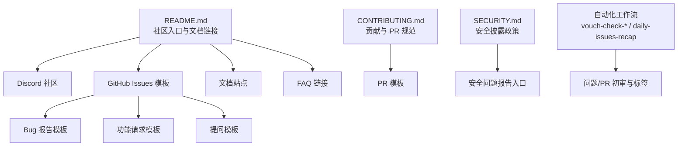
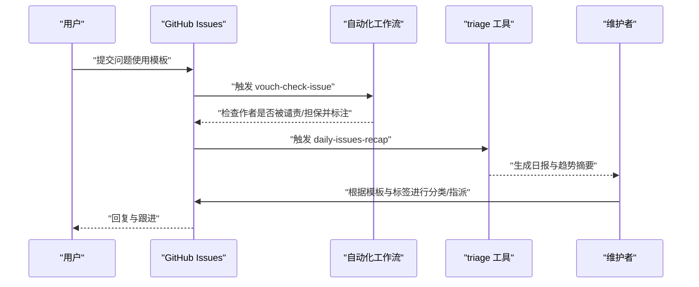
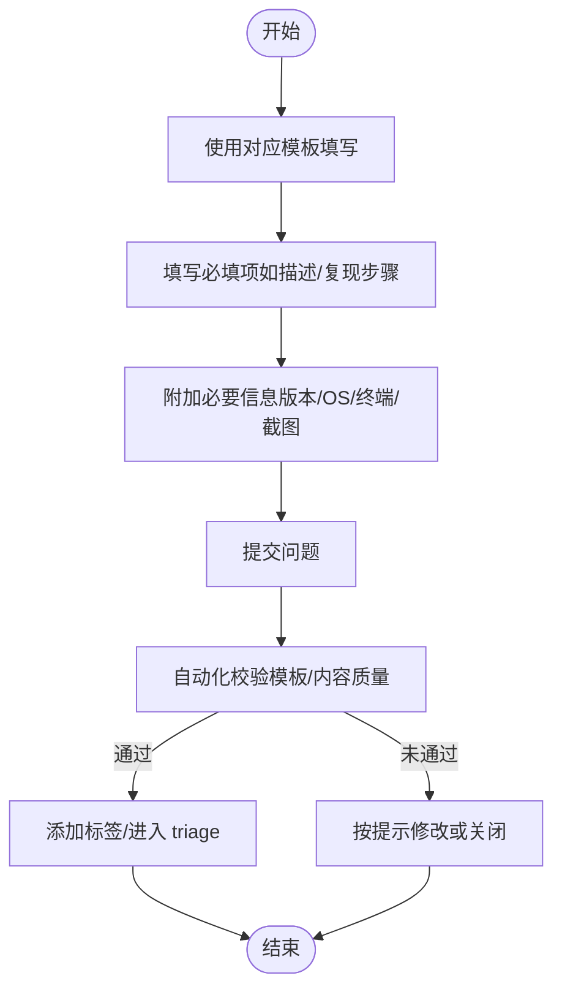
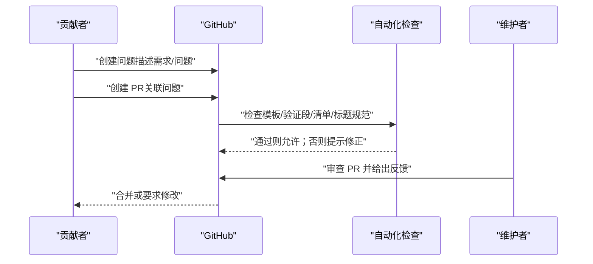
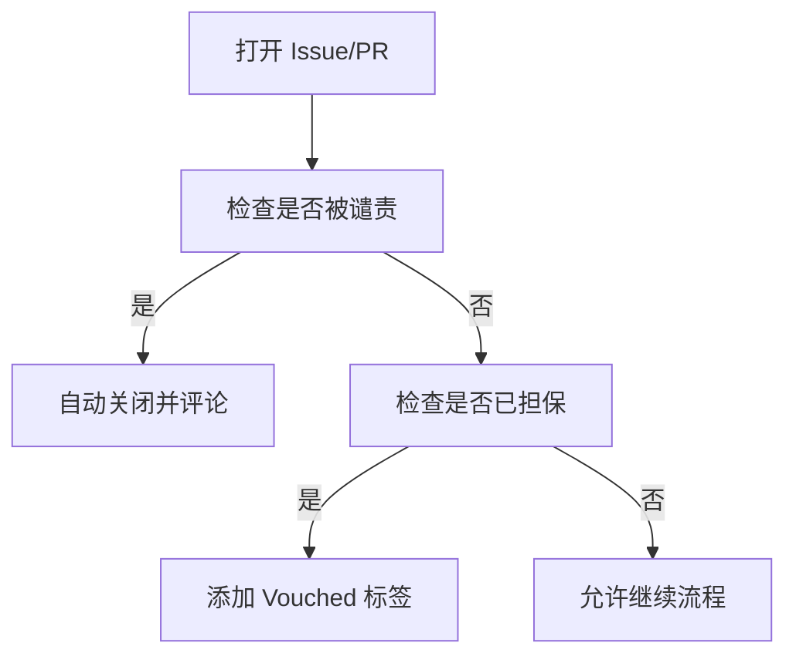
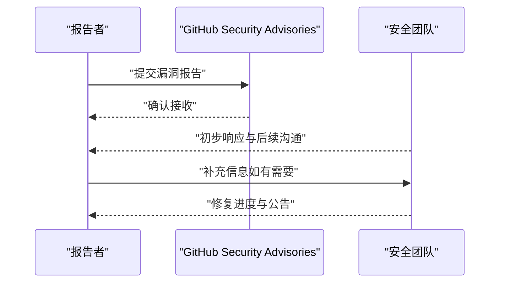
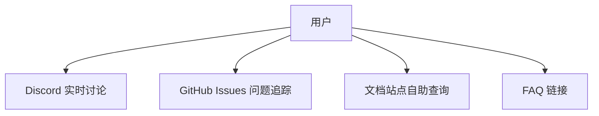
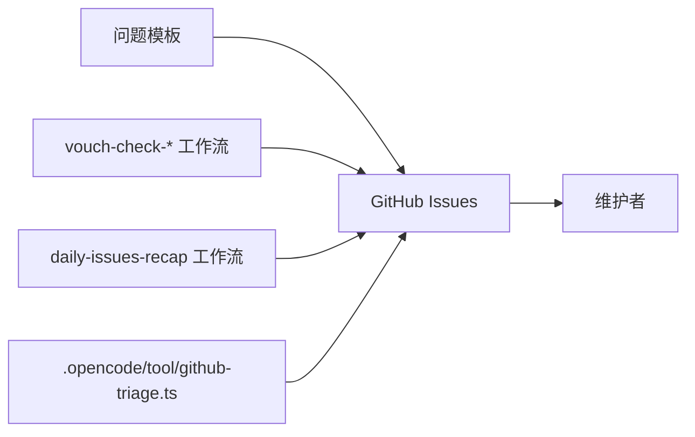

# 社区支持

<cite>
**本文引用的文件**
- [CONTRIBUTING.md](file://CONTRIBUTING.md)
- [SECURITY.md](file://SECURITY.md)
- [README.md](file://README.md)
- [.github/ISSUE_TEMPLATE/bug-report.yml](file://.github/ISSUE_TEMPLATE/bug-report.yml)
- [.github/ISSUE_TEMPLATE/feature-request.yml](file://.github/ISSUE_TEMPLATE/feature-request.yml)
- [.github/ISSUE_TEMPLATE/question.yml](file://.github/ISSUE_TEMPLATE/question.yml)
- [.github/ISSUE_TEMPLATE/config.yml](file://.github/ISSUE_TEMPLATE/config.yml)
- [.github/pull_request_template.md](file://.github/pull_request_template.md)
- [.github/VOUCHED.td](file://.github/VOUCHED.td)
- [.github/workflows/vouch-check-issue.yml](file://.github/workflows/vouch-check-issue.yml)
- [.github/workflows/vouch-check-pr.yml](file://.github/workflows/vouch-check-pr.yml)
- [.github/workflows/vouch-manage-by-issue.yml](file://.github/workflows/vouch-manage-by-issue.yml)
- [.github/workflows/daily-issues-recap.yml](file://.github/workflows/daily-issues-recap.yml)
- [.opencode/tool/github-triage.ts](file://.opencode/tool/github-triage.ts)
</cite>

## 目录
1. [简介](#简介)
2. [项目结构](#项目结构)
3. [核心组件](#核心组件)
4. [架构总览](#架构总览)
5. [详细组件分析](#详细组件分析)
6. [依赖分析](#依赖分析)
7. [性能考虑](#性能考虑)
8. [故障排查指南](#故障排查指南)
9. [结论](#结论)
10. [附录](#附录)

## 简介
本指南面向 OpenCode 社区用户与贡献者，提供从问题反馈到社区协作、从安全报告到贡献参与的完整操作说明。内容覆盖：
- 如何在 GitHub Issues 中提交 bug 报告与功能请求（模板使用、必要信息收集、可复现步骤编写）
- 社区讨论渠道的使用方法（Discussions、GitHub Discussions、社区论坛等）
- 问题分类与优先级判断标准，帮助你选择合适的反馈渠道
- 如何参与开源贡献（代码、文档、测试等）
- 安全漏洞报告流程与保密要求
- 常见问题 FAQ 链接与自助解决方案指引

## 项目结构
OpenCode 的社区支持相关机制主要由以下部分组成：
- 问题模板：用于标准化 bug 报告、功能请求与提问
- 贡献与行为准则：定义贡献流程、PR 规范、信任与担保机制
- 安全披露政策：明确安全问题的报告路径与响应流程
- 自动化工作流：对新问题与 PR 进行初步检查、标记与分配
- 社区链接：Discord、GitHub Discussions、文档站点等

**图表来源**
- [README.md:115-142](file://README.md#L115-L142)
- [.github/ISSUE_TEMPLATE/bug-report.yml:1-68](file://.github/ISSUE_TEMPLATE/bug-report.yml#L1-L68)
- [.github/ISSUE_TEMPLATE/feature-request.yml:1-21](file://.github/ISSUE_TEMPLATE/feature-request.yml#L1-L21)
- [.github/ISSUE_TEMPLATE/question.yml:1-12](file://.github/ISSUE_TEMPLATE/question.yml#L1-L12)
- [CONTRIBUTING.md:190-248](file://CONTRIBUTING.md#L190-L248)
- [SECURITY.md:37-48](file://SECURITY.md#L37-L48)
- [.github/workflows/vouch-check-issue.yml:1-116](file://.github/workflows/vouch-check-issue.yml#L1-L116)
- [.github/workflows/daily-issues-recap.yml:71-98](file://.github/workflows/daily-issues-recap.yml#L71-L98)

**章节来源**
- [README.md:115-142](file://README.md#L115-L142)
- [.github/ISSUE_TEMPLATE/bug-report.yml:1-68](file://.github/ISSUE_TEMPLATE/bug-report.yml#L1-L68)
- [.github/ISSUE_TEMPLATE/feature-request.yml:1-21](file://.github/ISSUE_TEMPLATE/feature-request.yml#L1-L21)
- [.github/ISSUE_TEMPLATE/question.yml:1-12](file://.github/ISSUE_TEMPLATE/question.yml#L1-L12)
- [CONTRIBUTING.md:190-248](file://CONTRIBUTING.md#L190-L248)
- [SECURITY.md:37-48](file://SECURITY.md#L37-L48)
- [.github/workflows/vouch-check-issue.yml:1-116](file://.github/workflows/vouch-check-issue.yml#L1-L116)
- [.github/workflows/daily-issues-recap.yml:71-98](file://.github/workflows/daily-issues-recap.yml#L71-L98)

## 核心组件
- 问题模板与要求
  - 所有问题必须使用官方模板之一：Bug 报告、功能请求、提问
  - 新建问题后会进行自动校验，未满足模板或内容质量要求的问题可能被要求修改或关闭
- 贡献与 PR 规范
  - 所有 PR 必须关联现有问题；PR 描述需清晰说明问题与修复思路
  - PR 标题遵循约定式提交规范；UI 变更建议附带截图或录屏
- 信任与担保机制（Vouch）
  - 采用 vouch 系统管理贡献者信任度；被担保用户可获得“Vouched”标签；被谴责用户会被自动关闭问题/PR
- 安全问题报告
  - 使用 GitHub Security Advisories 报告安全漏洞；不接受 AI 自动生成的安全报告
- 社区渠道
  - Discord 用于快速交流与实时讨论；Issues 亦可作为长期追踪与知识沉淀

**章节来源**
- [CONTRIBUTING.md:294-312](file://CONTRIBUTING.md#L294-L312)
- [CONTRIBUTING.md:190-248](file://CONTRIBUTING.md#L190-L248)
- [CONTRIBUTING.md:267-293](file://CONTRIBUTING.md#L267-L293)
- [SECURITY.md:1-48](file://SECURITY.md#L1-L48)
- [.github/ISSUE_TEMPLATE/config.yml:1-5](file://.github/ISSUE_TEMPLATE/config.yml#L1-L5)
- [README.md:141-142](file://README.md#L141-L142)

## 架构总览
下图展示了从用户提交问题到社区处理的关键流程，以及自动化工具如何辅助 triage 与标签管理。

**图表来源**
- [.github/workflows/vouch-check-issue.yml:1-116](file://.github/workflows/vouch-check-issue.yml#L1-L116)
- [.github/workflows/daily-issues-recap.yml:71-98](file://.github/workflows/daily-issues-recap.yml#L71-L98)
- [.opencode/tool/github-triage.ts:74-116](file://.opencode/tool/github-triage.ts#L74-L116)

## 详细组件分析

### 组件一：问题模板与信息收集
- Bug 报告模板字段建议
  - 问题描述、插件列表、OpenCode 版本、复现步骤、截图/分享链接、操作系统、终端类型
  - 复现步骤应尽量具体、可操作，便于维护者快速定位
- 功能请求模板字段建议
  - 已验证未被提出、增强描述与收益说明
- 提问模板字段建议
  - 明确的问题描述

**图表来源**
- [.github/ISSUE_TEMPLATE/bug-report.yml:1-68](file://.github/ISSUE_TEMPLATE/bug-report.yml#L1-L68)
- [.github/ISSUE_TEMPLATE/feature-request.yml:1-21](file://.github/ISSUE_TEMPLATE/feature-request.yml#L1-L21)
- [.github/ISSUE_TEMPLATE/question.yml:1-12](file://.github/ISSUE_TEMPLATE/question.yml#L1-L12)
- [CONTRIBUTING.md:294-312](file://CONTRIBUTING.md#L294-L312)

**章节来源**
- [.github/ISSUE_TEMPLATE/bug-report.yml:1-68](file://.github/ISSUE_TEMPLATE/bug-report.yml#L1-L68)
- [.github/ISSUE_TEMPLATE/feature-request.yml:1-21](file://.github/ISSUE_TEMPLATE/feature-request.yml#L1-L21)
- [.github/ISSUE_TEMPLATE/question.yml:1-12](file://.github/ISSUE_TEMPLATE/question.yml#L1-L12)
- [CONTRIBUTING.md:294-312](file://CONTRIBUTING.md#L294-L312)

### 组件二：贡献流程与 PR 规范
- Issue-First 政策：所有 PR 必须先有对应问题
- PR 描述要求：说明问题、修复方案与验证方式；UI 变更附截图/录屏
- PR 标题规范：遵循约定式提交（feat/fix/docs/chore/refactor/test 等）
- 内容质量：避免 AI 生成长篇内容；保持简洁聚焦

**图表来源**
- [CONTRIBUTING.md:190-248](file://CONTRIBUTING.md#L190-L248)
- [.github/pull_request_template.md:1-30](file://.github/pull_request_template.md#L1-L30)

**章节来源**
- [CONTRIBUTING.md:190-248](file://CONTRIBUTING.md#L190-L248)
- [.github/pull_request_template.md:1-30](file://.github/pull_request_template.md#L1-L30)

### 组件三：信任与担保机制（Vouch）
- 用户状态
  - 担保用户：受信任，PR/Issue 可获得“Vouched”标签
  - 被谴责用户：自动关闭其问题/PR
  - 其他用户：正常参与
- 维护者操作
  - 在任意问题评论中使用 vouch/denounce/unvouch 等指令管理列表
- 自动化
  - 新问题/PR 打开时自动检查作者状态并执行相应动作

**图表来源**
- [.github/workflows/vouch-check-issue.yml:1-116](file://.github/workflows/vouch-check-issue.yml#L1-L116)
- [.github/workflows/vouch-check-pr.yml:1-114](file://.github/workflows/vouch-check-pr.yml#L1-L114)
- [.github/workflows/vouch-manage-by-issue.yml:1-38](file://.github/workflows/vouch-manage-by-issue.yml#L1-L38)
- [.github/VOUCHED.td:1-32](file://.github/VOUCHED.td#L1-L32)

**章节来源**
- [CONTRIBUTING.md:267-293](file://CONTRIBUTING.md#L267-L293)
- [.github/VOUCHED.td:1-32](file://.github/VOUCHED.td#L1-L32)
- [.github/workflows/vouch-check-issue.yml:1-116](file://.github/workflows/vouch-check-issue.yml#L1-L116)
- [.github/workflows/vouch-check-pr.yml:1-114](file://.github/workflows/vouch-check-pr.yml#L1-L114)
- [.github/workflows/vouch-manage-by-issue.yml:1-38](file://.github/workflows/vouch-manage-by-issue.yml#L1-L38)

### 组件四：安全漏洞报告
- 不接受 AI 自动生成的安全报告
- 使用 GitHub Security Advisories 的 “Report a Vulnerability” 页面提交
- 若超过 6 个自然日未收到确认，可通过邮件进一步联系

**图表来源**
- [SECURITY.md:1-48](file://SECURITY.md#L1-L48)

**章节来源**
- [SECURITY.md:1-48](file://SECURITY.md#L1-L48)

### 组件五：社区讨论渠道与 FAQ
- 社区渠道
  - Discord：用于快速问答与实时讨论
  - GitHub Issues：用于 bug/功能请求/提问的长期追踪
  - 文档站点：提供配置与使用说明
- FAQ 链接
  - 主页、Zen 页面、下载页面等均提供 FAQ 链接，便于自助解决问题

**图表来源**
- [README.md:115-142](file://README.md#L115-L142)
- [.github/ISSUE_TEMPLATE/config.yml:1-5](file://.github/ISSUE_TEMPLATE/config.yml#L1-L5)

**章节来源**
- [README.md:115-142](file://README.md#L115-L142)
- [.github/ISSUE_TEMPLATE/config.yml:1-5](file://.github/ISSUE_TEMPLATE/config.yml#L1-L5)

## 依赖分析
- 模板依赖：所有问题必须使用模板，否则会被自动校验拦截
- 工作流依赖：vouch-check-* 与 daily-issues-recap 依赖 .github/VOUCHED.td 与仓库配置
- triage 依赖：.opencode/tool/github-triage.ts 依赖团队成员与标签策略

**图表来源**
- [.github/ISSUE_TEMPLATE/bug-report.yml:1-68](file://.github/ISSUE_TEMPLATE/bug-report.yml#L1-L68)
- [.github/ISSUE_TEMPLATE/feature-request.yml:1-21](file://.github/ISSUE_TEMPLATE/feature-request.yml#L1-L21)
- [.github/ISSUE_TEMPLATE/question.yml:1-12](file://.github/ISSUE_TEMPLATE/question.yml#L1-L12)
- [.github/workflows/vouch-check-issue.yml:1-116](file://.github/workflows/vouch-check-issue.yml#L1-L116)
- [.github/workflows/daily-issues-recap.yml:71-98](file://.github/workflows/daily-issues-recap.yml#L71-L98)
- [.opencode/tool/github-triage.ts:74-116](file://.opencode/tool/github-triage.ts#L74-L116)

**章节来源**
- [.github/ISSUE_TEMPLATE/bug-report.yml:1-68](file://.github/ISSUE_TEMPLATE/bug-report.yml#L1-L68)
- [.github/ISSUE_TEMPLATE/feature-request.yml:1-21](file://.github/ISSUE_TEMPLATE/feature-request.yml#L1-L21)
- [.github/ISSUE_TEMPLATE/question.yml:1-12](file://.github/ISSUE_TEMPLATE/question.yml#L1-L12)
- [.github/workflows/vouch-check-issue.yml:1-116](file://.github/workflows/vouch-check-issue.yml#L1-L116)
- [.github/workflows/daily-issues-recap.yml:71-98](file://.github/workflows/daily-issues-recap.yml#L71-L98)
- [.opencode/tool/github-triage.ts:74-116](file://.opencode/tool/github-triage.ts#L74-L116)

## 性能考虑
- 问题模板与自动化检查有助于减少无效/低质量问题，提升维护者处理效率
- 日常问题回顾与趋势分析可帮助识别热点与重复问题，优化资源分配
- 信任与担保机制降低恶意/低质内容的影响面，保障社区健康生态

## 故障排查指南
- 问题未被采纳或被关闭
  - 检查是否使用了模板且填写完整
  - 查看自动评论中的修改建议
  - 若认为误判，可联系维护者说明情况
- PR 被拒或长时间无人响应
  - 确认是否满足 PR 模板与验证要求
  - 检查标题是否符合约定式提交规范
  - 确认是否关联了现有问题
- 安全问题报告无响应
  - 确认未使用 AI 自动生成报告
  - 等待不超过 6 个自然日；超时后按安全文档提供的联系方式跟进

**章节来源**
- [CONTRIBUTING.md:294-312](file://CONTRIBUTING.md#L294-L312)
- [CONTRIBUTING.md:190-248](file://CONTRIBUTING.md#L190-L248)
- [SECURITY.md:1-48](file://SECURITY.md#L1-L48)

## 结论
通过统一的问题模板、严格的贡献与 PR 规范、完善的信任与担保机制以及清晰的安全报告流程，OpenCode 社区为用户与贡献者提供了高效、有序、安全的协作通道。建议在提交问题或贡献前，先查阅模板与规范，并利用社区渠道与 FAQ 获取自助支持。

## 附录
- 社区入口与文档链接：参见 README 中的文档与社区入口
- 问题模板与配置：参见 .github/ISSUE_TEMPLATE 下各模板与 config.yml
- 贡献与 PR 规范：参见 CONTRIBUTING.md
- 安全披露政策：参见 SECURITY.md
- 自动化工作流与 triage 工具：参见 .github/workflows 与 .opencode/tool/github-triage.ts

**章节来源**
- [README.md:115-142](file://README.md#L115-L142)
- [.github/ISSUE_TEMPLATE/config.yml:1-5](file://.github/ISSUE_TEMPLATE/config.yml#L1-L5)
- [CONTRIBUTING.md:190-248](file://CONTRIBUTING.md#L190-L248)
- [SECURITY.md:1-48](file://SECURITY.md#L1-L48)
- [.opencode/tool/github-triage.ts:74-116](file://.opencode/tool/github-triage.ts#L74-L116)