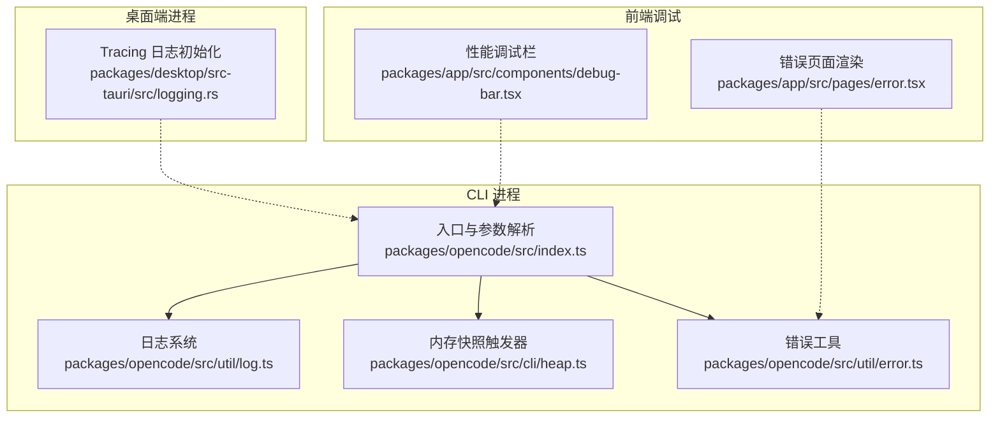
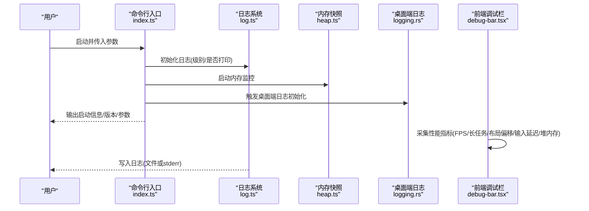
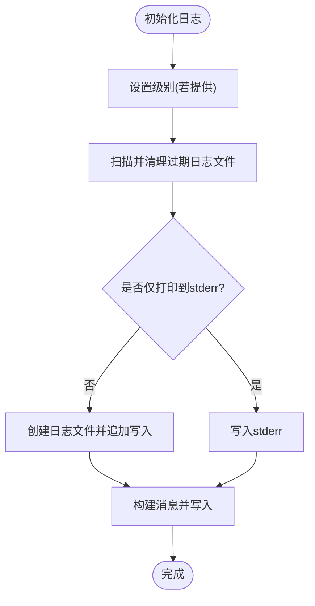
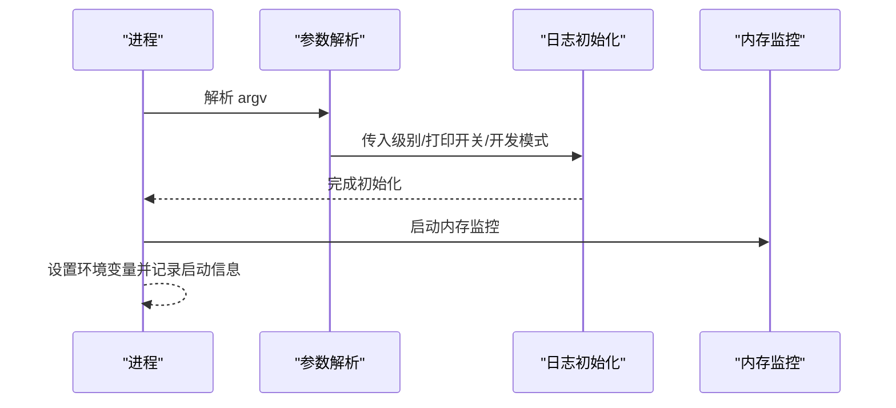
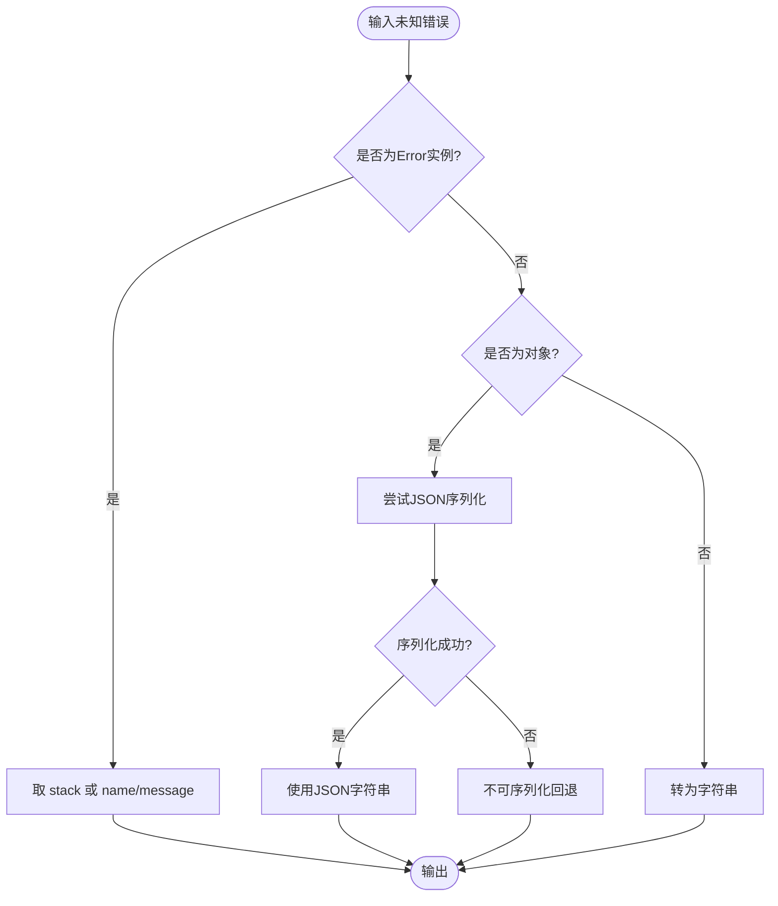
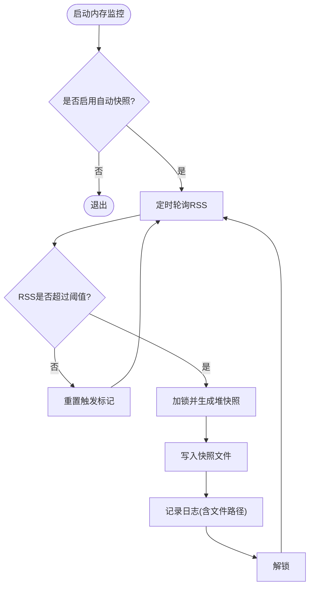
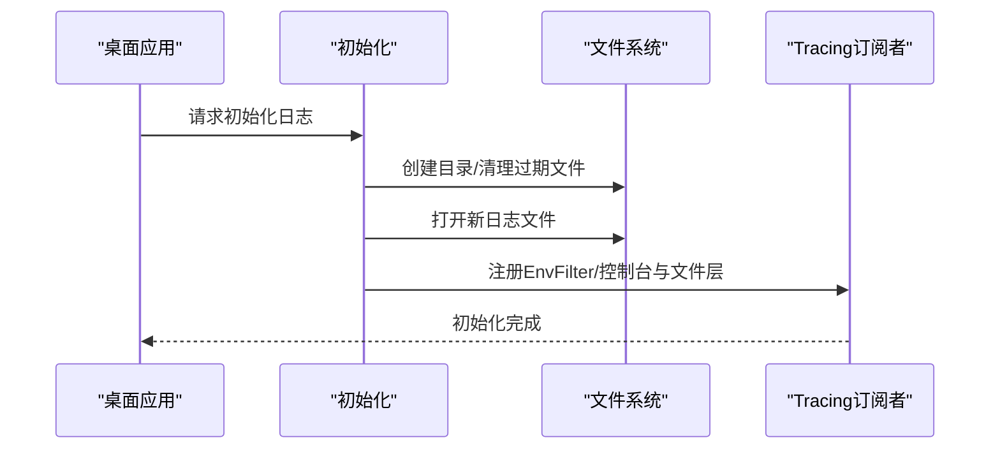
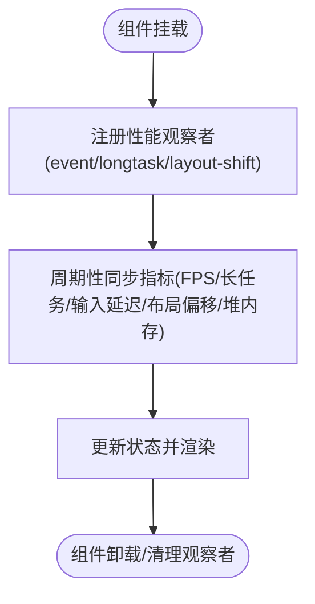
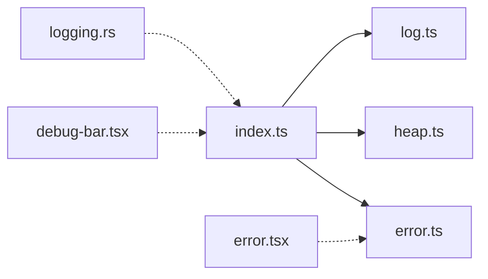

# 调试指南

<cite>
**本文引用的文件**
- [packages/opencode/src/util/log.ts](file://packages/opencode/src/util/log.ts)
- [packages/opencode/src/index.ts](file://packages/opencode/src/index.ts)
- [packages/opencode/src/util/error.ts](file://packages/opencode/src/util/error.ts)
- [packages/app/src/components/debug-bar.tsx](file://packages/app/src/components/debug-bar.tsx)
- [packages/opencode/src/cli/heap.ts](file://packages/opencode/src/cli/heap.ts)
- [packages/desktop/src-tauri/src/logging.rs](file://packages/desktop/src-tauri/src/logging.rs)
- [packages/opencode/src/flag/flag.ts](file://packages/opencode/src/flag/flag.ts)
- [packages/app/src/pages/error.tsx](file://packages/app/src/pages/error.tsx)
</cite>

## 目录
1. [简介](#简介)
2. [项目结构](#项目结构)
3. [核心组件](#核心组件)
4. [架构总览](#架构总览)
5. [详细组件分析](#详细组件分析)
6. [依赖关系分析](#依赖关系分析)
7. [性能考量](#性能考量)
8. [故障排查指南](#故障排查指南)
9. [结论](#结论)
10. [附录](#附录)

## 简介
本指南面向 OpenCode 开发者与维护者，系统化讲解如何在不同运行环境下进行调试：日志体系（级别、格式、落盘与输出）、错误追踪与异常处理（堆栈、分类、恢复）、命令行调试技巧（详细模式、调试标志、环境变量）、开发环境调试方法（断点、变量检查、调用跟踪）、性能分析工具（内存快照、CPU 帧率、长任务、布局偏移、网络观测）、以及常见问题的诊断流程。文档以仓库中实际实现为依据，辅以可视化图示帮助快速定位问题。

## 项目结构
OpenCode 采用多包（monorepo）组织方式，调试相关能力主要分布在以下模块：
- 日志与错误：packages/opencode/src/util/log.ts、packages/opencode/src/util/error.ts
- 入口与命令行：packages/opencode/src/index.ts、packages/opencode/src/cli/heap.ts
- 桌面端日志：packages/desktop/src-tauri/src/logging.rs
- 性能调试面板：packages/app/src/components/debug-bar.tsx
- 错误页面渲染：packages/app/src/pages/error.tsx
- 环境变量与标志：packages/opencode/src/flag/flag.ts

图表来源
- [packages/opencode/src/index.ts:40-109](file://packages/opencode/src/index.ts#L40-L109)
- [packages/opencode/src/util/log.ts:1-183](file://packages/opencode/src/util/log.ts#L1-L183)
- [packages/opencode/src/util/error.ts:1-78](file://packages/opencode/src/util/error.ts#L1-L78)
- [packages/opencode/src/cli/heap.ts:1-59](file://packages/opencode/src/cli/heap.ts#L1-L59)
- [packages/desktop/src-tauri/src/logging.rs:1-77](file://packages/desktop/src-tauri/src/logging.rs#L1-L77)
- [packages/app/src/components/debug-bar.tsx:1-444](file://packages/app/src/components/debug-bar.tsx#L1-L444)
- [packages/app/src/pages/error.tsx:166-219](file://packages/app/src/pages/error.tsx#L166-L219)

章节来源
- [packages/opencode/src/index.ts:40-109](file://packages/opencode/src/index.ts#L40-L109)
- [packages/opencode/src/util/log.ts:1-183](file://packages/opencode/src/util/log.ts#L1-L183)
- [packages/opencode/src/util/error.ts:1-78](file://packages/opencode/src/util/error.ts#L1-L78)
- [packages/opencode/src/cli/heap.ts:1-59](file://packages/opencode/src/cli/heap.ts#L1-L59)
- [packages/desktop/src-tauri/src/logging.rs:1-77](file://packages/desktop/src-tauri/src/logging.rs#L1-L77)
- [packages/app/src/components/debug-bar.tsx:1-444](file://packages/app/src/components/debug-bar.tsx#L1-L444)
- [packages/app/src/pages/error.tsx:166-219](file://packages/app/src/pages/error.tsx#L166-L219)

## 核心组件
- 日志系统：支持级别过滤、时间戳与相对耗时前缀、标签化输出、可选写入文件或仅打印到 stderr；提供 time 计时辅助。
- 错误工具：统一格式化错误消息、提取堆栈、序列化对象、递归拼接 cause 链。
- 命令行入口：解析 --print-logs、--log-level、--pure 等参数，初始化日志与内存快照，并记录启动上下文。
- 内存快照：基于 v8 heap 快照，当 RSS 超限自动触发，便于定位内存泄漏。
- 桌面端日志：Rust Tracing 初始化，按环境变量动态过滤级别，同时输出到 stderr 与文件。
- 前端调试栏：采集 FPS、长任务、输入延迟、布局偏移、堆内存占比等指标，辅助前端性能诊断。
- 错误页面：对错误链进行去重与格式化，支持本地化文案。

章节来源
- [packages/opencode/src/util/log.ts:1-183](file://packages/opencode/src/util/log.ts#L1-L183)
- [packages/opencode/src/util/error.ts:1-78](file://packages/opencode/src/util/error.ts#L1-L78)
- [packages/opencode/src/index.ts:40-109](file://packages/opencode/src/index.ts#L40-L109)
- [packages/opencode/src/cli/heap.ts:1-59](file://packages/opencode/src/cli/heap.ts#L1-L59)
- [packages/desktop/src-tauri/src/logging.rs:1-77](file://packages/desktop/src-tauri/src/logging.rs#L1-L77)
- [packages/app/src/components/debug-bar.tsx:1-444](file://packages/app/src/components/debug-bar.tsx#L1-L444)
- [packages/app/src/pages/error.tsx:166-219](file://packages/app/src/pages/error.tsx#L166-L219)

## 架构总览
下图展示从命令行启动到日志与错误处理的关键交互路径，以及桌面端日志初始化与前端调试栏的数据采集。

图表来源
- [packages/opencode/src/index.ts:40-109](file://packages/opencode/src/index.ts#L40-L109)
- [packages/opencode/src/util/log.ts:60-78](file://packages/opencode/src/util/log.ts#L60-L78)
- [packages/opencode/src/cli/heap.ts:16-59](file://packages/opencode/src/cli/heap.ts#L16-L59)
- [packages/desktop/src-tauri/src/logging.rs:12-43](file://packages/desktop/src-tauri/src/logging.rs#L12-L43)
- [packages/app/src/components/debug-bar.tsx:164-361](file://packages/app/src/components/debug-bar.tsx#L164-L361)

## 详细组件分析

### 日志系统（packages/opencode/src/util/log.ts）
- 级别与过滤：定义 DEBUG/INFO/WARN/ERROR 四级，按优先级阈值决定是否输出。
- 输出目标：默认写入文件（按日期命名），也可通过 --print-logs 将日志直接输出到 stderr。
- 格式化：每条日志包含 ISO 时间戳（去除毫秒）、自上次写入的相对耗时、键值标签、消息正文。
- 错误处理：支持将 Error 对象作为字段值，内部递归拼接 cause 链，避免深层异常被忽略。
- 计时辅助：提供 time 方法，自动记录“开始/完成”状态与耗时，便于性能剖析。
- 文件清理：保留最近若干份日志文件，超出数量与时间范围会自动删除旧文件。

图表来源
- [packages/opencode/src/util/log.ts:60-90](file://packages/opencode/src/util/log.ts#L60-L90)
- [packages/opencode/src/util/log.ts:111-128](file://packages/opencode/src/util/log.ts#L111-L128)
- [packages/opencode/src/util/log.ts:129-174](file://packages/opencode/src/util/log.ts#L129-L174)

章节来源
- [packages/opencode/src/util/log.ts:1-183](file://packages/opencode/src/util/log.ts#L1-L183)

### 命令行入口与调试标志（packages/opencode/src/index.ts）
- 参数解析：支持 --print-logs、--log-level、--pure 等。
- 日志初始化：根据 --log-level 或本地开发环境自动选择 DEBUG/INFO；结合 --print-logs 决定输出目标。
- 全局环境变量：设置 AGENT、OPENCODE、OPENCODE_PID 等，便于后续组件识别运行环境。
- 异常捕获：对未处理的 Promise 拒绝与未捕获异常进行统一记录，确保问题不被静默吞没。

图表来源
- [packages/opencode/src/index.ts:64-109](file://packages/opencode/src/index.ts#L64-L109)

章节来源
- [packages/opencode/src/index.ts:40-109](file://packages/opencode/src/index.ts#L40-L109)

### 错误追踪与异常处理（packages/opencode/src/util/error.ts 与 packages/app/src/pages/error.tsx）
- 错误格式化：优先返回 Error.stack；否则尝试 JSON 序列化；最后回退到字符串。
- 消息提取：优先取 message/name；对不可序列化对象回退到格式化结果。
- 数据提取：收集 type/message/stack/cause/formatted 等字段，便于统一上报与展示。
- 错误页面渲染：对错误链进行去重与拼接，支持本地化文案，提升用户可读性。

图表来源
- [packages/opencode/src/util/error.ts:3-35](file://packages/opencode/src/util/error.ts#L3-L35)
- [packages/app/src/pages/error.tsx:213-215](file://packages/app/src/pages/error.tsx#L213-L215)

章节来源
- [packages/opencode/src/util/error.ts:1-78](file://packages/opencode/src/util/error.ts#L1-L78)
- [packages/app/src/pages/error.tsx:166-219](file://packages/app/src/pages/error.tsx#L166-L219)

### 内存分析（packages/opencode/src/cli/heap.ts）
- 自动触发：当 RSS 超过阈值且未触发过时，触发一次 v8 堆快照，文件名包含 PID 与时间戳。
- 日志记录：记录快照文件路径与当前内存指标，便于关联日志与快照。
- 失败处理：写入失败时记录错误原因，不影响主流程。

图表来源
- [packages/opencode/src/cli/heap.ts:16-59](file://packages/opencode/src/cli/heap.ts#L16-L59)

章节来源
- [packages/opencode/src/cli/heap.ts:1-59](file://packages/opencode/src/cli/heap.ts#L1-L59)

### 桌面端日志（packages/desktop/src-tauri/src/logging.rs）
- 初始化：创建日志目录，清理过期日志（按天数阈值），生成带时间戳的文件名。
- 输出：同时向 stderr 与非阻塞文件写入，支持 EnvFilter 动态控制级别。
- 尾读：提供 tail 接口读取最新若干行，便于前端或外部工具查看。

图表来源
- [packages/desktop/src-tauri/src/logging.rs:12-43](file://packages/desktop/src-tauri/src/logging.rs#L12-L43)

章节来源
- [packages/desktop/src-tauri/src/logging.rs:1-77](file://packages/desktop/src-tauri/src/logging.rs#L1-L77)

### 前端性能调试栏（packages/app/src/components/debug-bar.tsx）
- 指标采集：FPS、帧最大延迟、长任务统计、输入延迟与处理时延、布局偏移、堆内存占比。
- 观察者：使用 PerformanceObserver 监控 event/longtask/layout-shift 等类型。
- 可见性感知：仅在页面可见时采集，减少后台干扰。
- UI 展示：以卡片形式展示指标，异常值高亮提示。

图表来源
- [packages/app/src/components/debug-bar.tsx:237-249](file://packages/app/src/components/debug-bar.tsx#L237-L249)
- [packages/app/src/components/debug-bar.tsx:265-274](file://packages/app/src/components/debug-bar.tsx#L265-L274)
- [packages/app/src/components/debug-bar.tsx:276-296](file://packages/app/src/components/debug-bar.tsx#L276-L296)
- [packages/app/src/components/debug-bar.tsx:329-340](file://packages/app/src/components/debug-bar.tsx#L329-L340)

章节来源
- [packages/app/src/components/debug-bar.tsx:1-444](file://packages/app/src/components/debug-bar.tsx#L1-L444)

### 环境变量与调试标志（packages/opencode/src/flag/flag.ts）
- 动态读取：部分标志在访问时才读取环境变量，允许测试或外部工具在运行时设置。
- 示例标志：如 OPENCODE_PURE、OPENCODE_CLIENT、OPENCODE_CONFIG_DIR 等，影响运行行为与配置加载。
- 建议：在调试时可通过设置这些变量快速切换行为（例如禁用插件、指定客户端类型）。

章节来源
- [packages/opencode/src/flag/flag.ts:75-155](file://packages/opencode/src/flag/flag.ts#L75-L155)

## 依赖关系分析
- 入口依赖日志系统与内存快照模块；日志系统负责落盘与输出；内存快照在满足条件时触发。
- 桌面端日志由 Rust Tracing 提供，独立于 Node 日志，二者可并行使用。
- 前端调试栏与后端日志解耦，通过各自采集与展示机制工作。
- 错误工具与错误页面共同构成错误呈现闭环，前者用于数据提取，后者用于 UI 呈现。

图表来源
- [packages/opencode/src/index.ts:40-109](file://packages/opencode/src/index.ts#L40-L109)
- [packages/opencode/src/util/log.ts:1-183](file://packages/opencode/src/util/log.ts#L1-L183)
- [packages/opencode/src/cli/heap.ts:1-59](file://packages/opencode/src/cli/heap.ts#L1-L59)
- [packages/opencode/src/util/error.ts:1-78](file://packages/opencode/src/util/error.ts#L1-L78)
- [packages/desktop/src-tauri/src/logging.rs:1-77](file://packages/desktop/src-tauri/src/logging.rs#L1-L77)
- [packages/app/src/components/debug-bar.tsx:1-444](file://packages/app/src/components/debug-bar.tsx#L1-L444)
- [packages/app/src/pages/error.tsx:166-219](file://packages/app/src/pages/error.tsx#L166-L219)

章节来源
- [packages/opencode/src/index.ts:40-109](file://packages/opencode/src/index.ts#L40-L109)
- [packages/opencode/src/util/log.ts:1-183](file://packages/opencode/src/util/log.ts#L1-L183)
- [packages/opencode/src/cli/heap.ts:1-59](file://packages/opencode/src/cli/heap.ts#L1-L59)
- [packages/opencode/src/util/error.ts:1-78](file://packages/opencode/src/util/error.ts#L1-L78)
- [packages/desktop/src-tauri/src/logging.rs:1-77](file://packages/desktop/src-tauri/src/logging.rs#L1-L77)
- [packages/app/src/components/debug-bar.tsx:1-444](file://packages/app/src/components/debug-bar.tsx#L1-L444)
- [packages/app/src/pages/error.tsx:166-219](file://packages/app/src/pages/error.tsx#L166-L219)

## 性能考量
- CPU/帧率：前端调试栏统计 FPS、最大帧延迟与“抖动”数量，辅助定位主线程卡顿。
- 长任务：通过 longtask 观察是否存在超过阈值的长时间任务，影响交互响应。
- 输入延迟：计算事件处理开始与事件发生的时间差，评估交互体验。
- 布局偏移：统计 layout-shift，关注意外的大位移导致的用户体验下降。
- 堆内存：显示已用/上限占比，结合内存快照定位泄漏或峰值过高。
- 日志开销：生产环境建议关闭 --print-logs 并降低日志级别，避免 I/O 影响。

章节来源
- [packages/app/src/components/debug-bar.tsx:1-444](file://packages/app/src/components/debug-bar.tsx#L1-L444)
- [packages/opencode/src/cli/heap.ts:1-59](file://packages/opencode/src/cli/heap.ts#L1-L59)

## 故障排查指南
- 启动阶段无日志
  - 检查是否使用了 --print-logs；若未使用，确认日志文件所在目录存在且可写。
  - 查看日志文件是否被清理策略提前删除。
  - 参考：[packages/opencode/src/util/log.ts:60-90](file://packages/opencode/src/util/log.ts#L60-L90)
- 日志级别过高/过低
  - 使用 --log-level 指定 DEBUG/INFO/WARN/ERROR；开发环境默认 DEBUG。
  - 参考：[packages/opencode/src/index.ts:72-80](file://packages/opencode/src/index.ts#L72-L80)
- 堆内存异常增长
  - 启用自动快照（默认开启），观察快照文件生成与日志记录。
  - 结合前端调试栏堆内存占比与长任务统计，定位热点。
  - 参考：[packages/opencode/src/cli/heap.ts:16-59](file://packages/opencode/src/cli/heap.ts#L16-L59)
- 桌面端日志缺失
  - 检查日志目录权限与磁盘空间；确认初始化是否成功。
  - 参考：[packages/desktop/src-tauri/src/logging.rs:12-43](file://packages/desktop/src-tauri/src/logging.rs#L12-L43)
- 错误信息不完整
  - 使用 errorFormat/errorMessage 获取更完整的堆栈与消息；必要时在日志中附加 cause 链。
  - 参考：[packages/opencode/src/util/error.ts:1-78](file://packages/opencode/src/util/error.ts#L1-L78)
- 错误页面显示重复或不一致
  - 检查错误链去重逻辑与本地化文案映射。
  - 参考：[packages/app/src/pages/error.tsx:166-219](file://packages/app/src/pages/error.tsx#L166-L219)
- 环境变量未生效
  - 确认标志在访问时才读取环境变量，可在运行时动态设置。
  - 参考：[packages/opencode/src/flag/flag.ts:94-111](file://packages/opencode/src/flag/flag.ts#L94-L111)

章节来源
- [packages/opencode/src/util/log.ts:60-90](file://packages/opencode/src/util/log.ts#L60-L90)
- [packages/opencode/src/index.ts:72-80](file://packages/opencode/src/index.ts#L72-L80)
- [packages/opencode/src/cli/heap.ts:16-59](file://packages/opencode/src/cli/heap.ts#L16-L59)
- [packages/desktop/src-tauri/src/logging.rs:12-43](file://packages/desktop/src-tauri/src/logging.rs#L12-L43)
- [packages/opencode/src/util/error.ts:1-78](file://packages/opencode/src/util/error.ts#L1-L78)
- [packages/app/src/pages/error.tsx:166-219](file://packages/app/src/pages/error.tsx#L166-L219)
- [packages/opencode/src/flag/flag.ts:94-111](file://packages/opencode/src/flag/flag.ts#L94-L111)

## 结论
OpenCode 的调试体系覆盖命令行、桌面端与前端三类运行环境，配合日志、错误工具、内存快照与性能调试栏，能够有效支撑从问题发现到根因定位的全流程。建议在开发阶段使用 DEBUG 级别与 --print-logs，生产阶段谨慎开启详细日志与自动快照，结合前端性能指标持续监控用户体验。

## 附录
- 常用命令行调试选项
  - --print-logs：将日志输出到 stderr
  - --log-level：设置日志级别（DEBUG/INFO/WARN/ERROR）
  - --pure：禁用外部插件运行
  - 参考：[packages/opencode/src/index.ts:72-84](file://packages/opencode/src/index.ts#L72-L84)
- 关键环境变量
  - OPENCODE_PURE、OPENCODE_CLIENT、OPENCODE_CONFIG_DIR 等
  - 参考：[packages/opencode/src/flag/flag.ts:75-155](file://packages/opencode/src/flag/flag.ts#L75-L155)
- 日志文件位置
  - Node 日志：按日期命名的 .log 文件；桌面端日志：带时间戳的 .log 文件
  - 参考：[packages/opencode/src/util/log.ts:64-67](file://packages/opencode/src/util/log.ts#L64-L67)、[packages/desktop/src-tauri/src/logging.rs:17-19](file://packages/desktop/src-tauri/src/logging.rs#L17-L19)