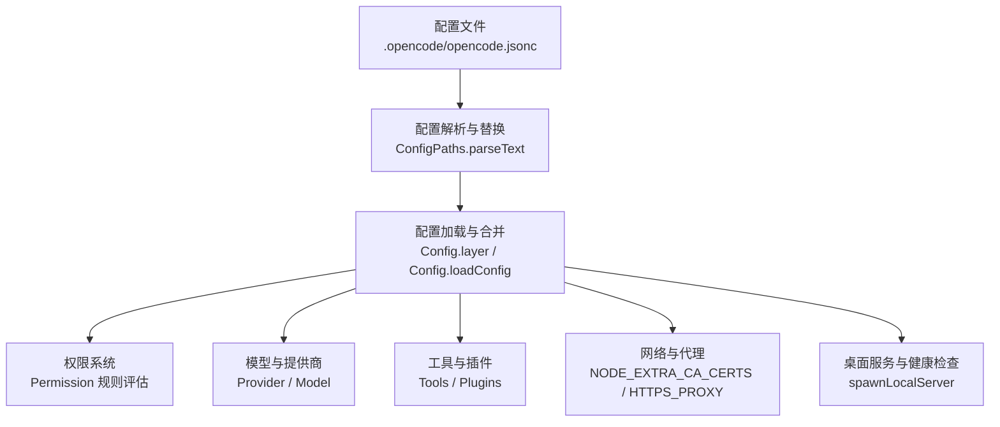
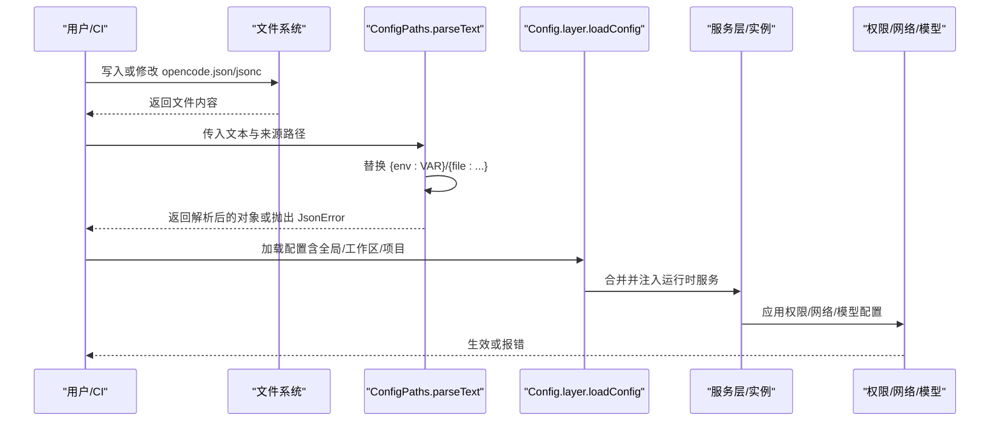
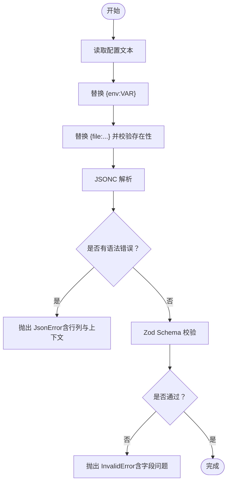
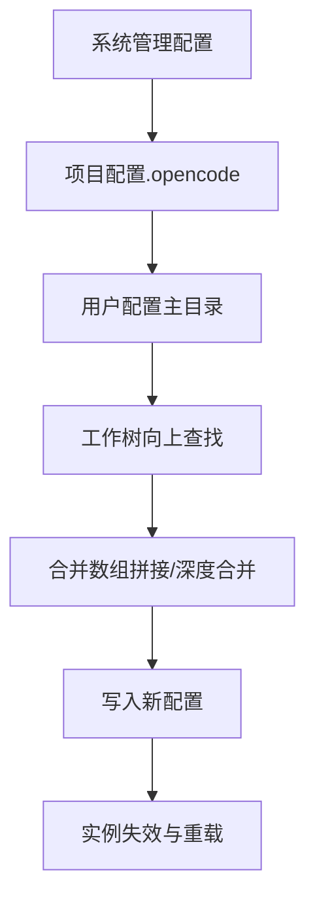
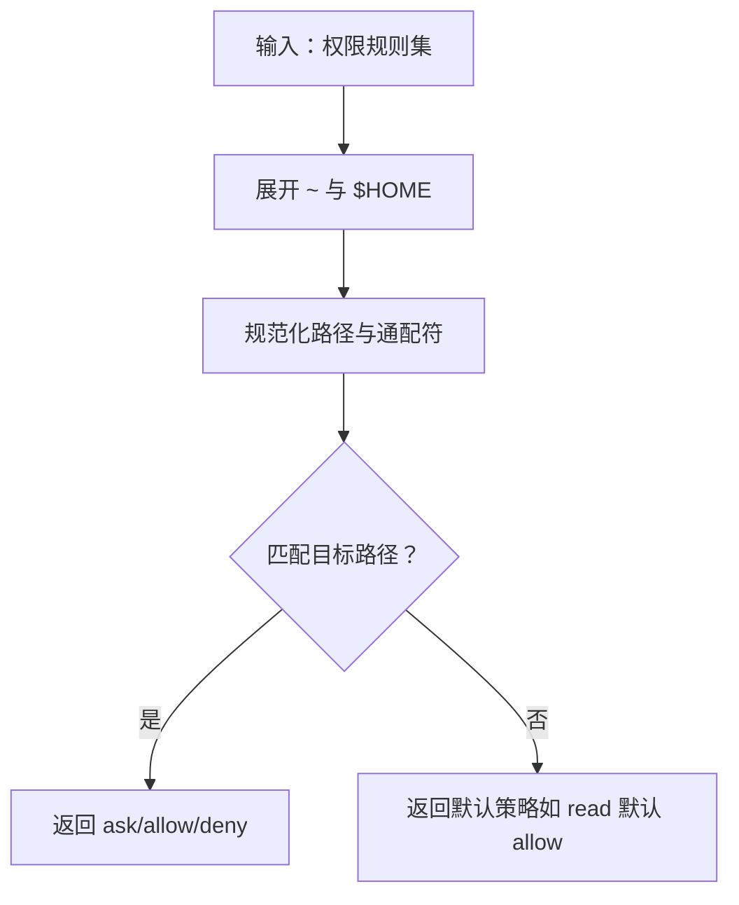
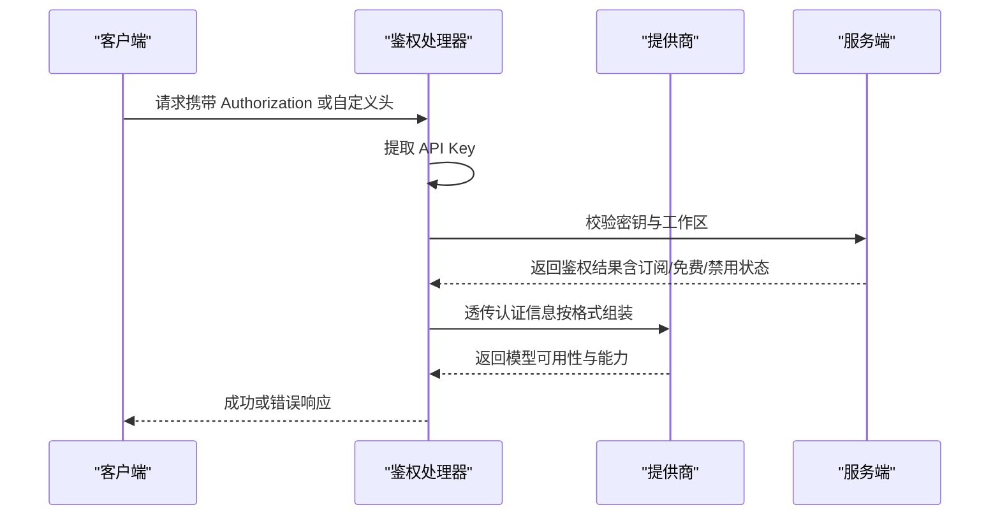
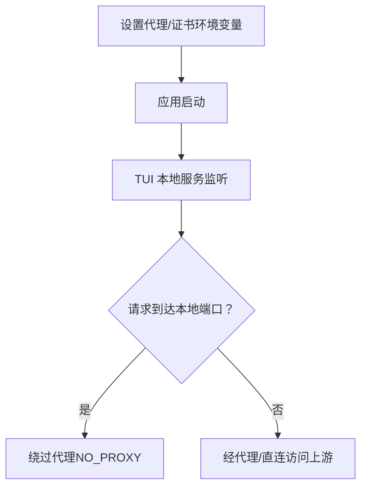
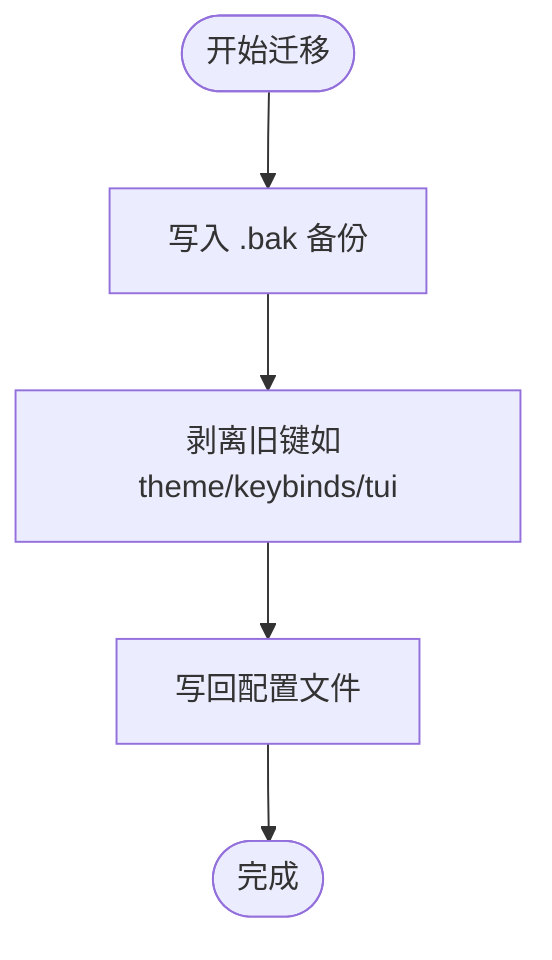
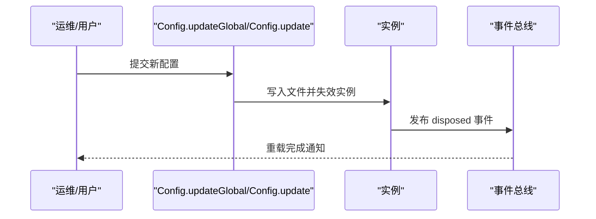
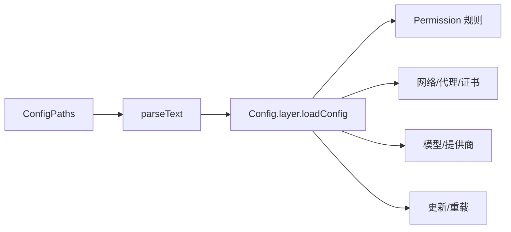

# 配置错误

<cite>
**本文引用的文件**
- [opencode.jsonc](file://.opencode/opencode.jsonc)
- [配置路径与解析](file://packages/opencode/src/config/paths.ts)
- [配置加载与合并](file://packages/opencode/src/config/config.ts)
- [网络与代理文档](file://packages/web/src/content/docs/tr/network.mdx)
- [权限规则与示例](file://packages/web/src/content/docs/tr/permissions.mdx)
- [权限单元测试（扩展路径）](file://packages/opencode/test/permission/next.test.ts)
- [外部目录权限测试](file://packages/opencode/test/tool/external-directory.test.ts)
- [TUI 迁移与备份](file://packages/opencode/src/config/tui-migrate.ts)
- [服务器启动与健康检查](file://packages/desktop-electron/src/main/server.ts)
- [项目初始化与热重载测试](file://packages/opencode/test/server/project-init-git.test.ts)
- [README（安装目录与环境变量）](file://README.md)
</cite>

## 目录
1. [简介](#简介)
2. [项目结构](#项目结构)
3. [核心组件](#核心组件)
4. [架构总览](#架构总览)
5. [详细组件分析](#详细组件分析)
6. [依赖关系分析](#依赖关系分析)
7. [性能考量](#性能考量)
8. [故障排除指南](#故障排除指南)
9. [结论](#结论)
10. [附录](#附录)

## 简介
本指南聚焦于 OpenCode 的“配置错误”问题，覆盖以下方面：
- 配置文件格式错误（JSONC 语法、字段类型不匹配）
- 参数验证失败（Schema 校验、必填项缺失）
- 环境变量与文件引用缺失（{env:…}、{file:…}）
- 全局配置与工作区配置的区别与常见错误
- 模型提供商配置问题（API 密钥、区域、认证）
- 权限配置排查（文件/目录访问、代理权限）
- 配置备份与恢复
- 配置热更新与重启要求

## 项目结构
OpenCode 的配置系统由“配置文件解析与替换”“配置加载与合并”“权限与工具链”“网络与代理”等模块组成，并通过服务层在运行时生效。

图表来源
- [配置路径与解析:136-166](file://packages/opencode/src/config/paths.ts#L136-L166)
- [配置加载与合并:1144-1174](file://packages/opencode/src/config/config.ts#L1144-L1174)
- [网络与代理文档:1-57](file://packages/web/src/content/docs/tr/network.mdx#L1-L57)
- [服务器启动与健康检查:32-43](file://packages/desktop-electron/src/main/server.ts#L32-L43)

章节来源
- [配置路径与解析:10-168](file://packages/opencode/src/config/paths.ts#L10-L168)
- [配置加载与合并:1-200](file://packages/opencode/src/config/config.ts#L1-L200)

## 核心组件
- 配置文件解析与替换：支持 JSONC 解析、注释、尾随逗号；支持 {env:VAR} 与 {file:path} 替换；对语法错误与引用缺失给出明确错误。
- 配置加载与合并：按优先级读取多处配置（系统管理、项目、用户、工作树），进行深度合并；提供全局与工作区配置更新接口。
- 权限系统：支持 read/edit/glob/grep/list/bash/task/external_directory 等权限粒度，支持 ask/allow/deny 三态策略与通配符。
- 网络与代理：支持标准代理环境变量与自定义 CA 证书；TUI 本地服务需绕过代理。
- 模型提供商：支持多种格式（如 anthropic/google/openai/others），认证失败与密钥无效会触发错误。
- 备份与迁移：提供 TUI 迁移时的备份与剥离逻辑；支持配置更新后实例失效与重载。

章节来源
- [配置路径与解析:77-166](file://packages/opencode/src/config/paths.ts#L77-L166)
- [配置加载与合并:132-180](file://packages/opencode/src/config/config.ts#L132-L180)
- [权限规则与示例:89-130](file://packages/web/src/content/docs/tr/permissions.mdx#L89-L130)
- [网络与代理文档:1-57](file://packages/web/src/content/docs/tr/network.mdx#L1-L57)

## 架构总览
下图展示从配置文件到运行时生效的关键流程。

图表来源
- [配置路径与解析:136-166](file://packages/opencode/src/config/paths.ts#L136-L166)
- [配置加载与合并:1144-1174](file://packages/opencode/src/config/config.ts#L1144-L1174)

## 详细组件分析

### 组件一：配置文件格式与参数校验
- JSONC 语法错误：解析器会定位行号与列号，并输出上下文高亮；常见问题包括尾随逗号、非法注释位置、未闭合引号等。
- 字段类型不匹配：使用 Zod Schema 校验，错误包含具体字段与期望类型；建议逐条修正。
- 环境变量与文件引用：
  - {env:VARNAME}：不存在时为空字符串（默认行为），可改为“缺失即报错”以避免静默失败。
  - {file:相对/绝对路径}：若文件不存在或不可读，会抛出 InvalidError 并提示路径。
- 建议：在 CI 中先执行“配置解析”步骤，提前暴露语法与引用错误。

图表来源
- [配置路径与解析:136-166](file://packages/opencode/src/config/paths.ts#L136-L166)
- [配置加载与合并:1094-1131](file://packages/opencode/src/config/config.ts#L1094-L1131)

章节来源
- [配置路径与解析:77-166](file://packages/opencode/src/config/paths.ts#L77-L166)
- [配置加载与合并:1094-1131](file://packages/opencode/src/config/config.ts#L1094-L1131)

### 组件二：全局配置与工作区配置
- 优先级与来源：
  - 系统管理配置（企业部署最高优先级）
  - 项目配置（.opencode 目录内）
  - 用户配置（用户主目录）
  - 工作树向上查找（worktree 边界）
  - 可通过标志禁用项目配置
- 合并与覆盖：数组字段采用拼接策略，其他键深度合并；指令列表去重合并。
- 更新与失效：
  - 支持更新全局与工作区配置
  - 更新后会失效实例并触发重载（必要时）

图表来源
- [配置加载与合并:132-180](file://packages/opencode/src/config/config.ts#L132-L180)
- [配置加载与合并:1480-1505](file://packages/opencode/src/config/config.ts#L1480-L1505)

章节来源
- [配置加载与合并:60-139](file://packages/opencode/src/config/config.ts#L60-L139)
- [配置加载与合并:1480-1505](file://packages/opencode/src/config/config.ts#L1480-L1505)

### 组件三：权限配置与排查
- 权限粒度：read/edit/glob/grep/list/bash/task/external_directory 等，支持 ask/allow/deny 三态与对象式精确控制。
- 路径展开：支持 ~ 与 $HOME 展开；外部目录访问需显式授权。
- 测试覆盖：包含混合字符串/对象值、~/$HOME 展开、空对象、合并等场景。
- 外部目录：跨工作目录访问需 external_directory 授权，且可叠加 edit 等规则。

图表来源
- [权限规则与示例:89-130](file://packages/web/src/content/docs/tr/permissions.mdx#L89-L130)
- [权限单元测试（扩展路径）:48-104](file://packages/opencode/test/permission/next.test.ts#L48-L104)
- [外部目录权限测试:180-198](file://packages/opencode/test/tool/external-directory.test.ts#L180-L198)

章节来源
- [权限规则与示例:89-130](file://packages/web/src/content/docs/tr/permissions.mdx#L89-L130)
- [权限单元测试（扩展路径）:48-104](file://packages/opencode/test/permission/next.test.ts#L48-L104)
- [外部目录权限测试:180-198](file://packages/opencode/test/tool/external-directory.test.ts#L180-L198)

### 组件四：模型提供商配置与认证
- 认证流程：从请求头提取 API Key；若为 public 且不允许匿名，则报错；校验密钥有效性与工作区支持范围。
- 区域与格式：根据提供商格式（如 anthropic/google/openai/others）进行适配；不同格式可能需要不同的头部与参数。
- 错误分类：缺少密钥、密钥无效、模型不受支持、计费状态异常等。

图表来源
- [模型提供商认证与错误处理:494-616](file://packages/console/app/src/routes/zen/util/handler.ts#L494-L616)

章节来源
- [模型提供商认证与错误处理:494-616](file://packages/console/app/src/routes/zen/util/handler.ts#L494-L616)

### 组件五：网络与代理、证书
- 代理：支持 HTTPS_PROXY/HTTP_PROXY/NO_PROXY；TUI 本地服务需加入 NO_PROXY 避免路由循环。
- 证书：通过 NODE_EXTRA_CA_CERTS 指定组织私有 CA，影响代理与直连 API。
- 桌面应用：本地服务启动后进行健康检查，确保服务就绪。

图表来源
- [网络与代理文档:10-57](file://packages/web/src/content/docs/tr/network.mdx#L10-L57)
- [服务器启动与健康检查:32-43](file://packages/desktop-electron/src/main/server.ts#L32-L43)

章节来源
- [网络与代理文档:10-57](file://packages/web/src/content/docs/tr/network.mdx#L10-L57)
- [服务器启动与健康检查:32-43](file://packages/desktop-electron/src/main/server.ts#L32-L43)

### 组件六：配置备份与恢复
- TUI 迁移备份：迁移前将原配置写入 .tui-migration.bak，再剥离旧键。
- 手动备份：建议在修改前复制 opencode.json/jsonc 到安全位置。
- 恢复：从备份文件回滚，或删除问题配置后重启服务。

图表来源
- [TUI 迁移与备份:102-135](file://packages/opencode/src/config/tui-migrate.ts#L102-L135)

章节来源
- [TUI 迁移与备份:102-135](file://packages/opencode/src/config/tui-migrate.ts#L102-L135)

### 组件七：配置热更新与重启
- 更新机制：通过更新接口写入合并后的配置，随后失效实例并触发重载。
- 行为差异：项目初始化 Git 后立即重载，确保变更即时生效。
- 建议：生产环境在维护窗口内执行更新，避免长时间停机。

图表来源
- [配置加载与合并:1480-1505](file://packages/opencode/src/config/config.ts#L1480-L1505)
- [项目初始化与热重载测试:19-29](file://packages/opencode/test/server/project-init-git.test.ts#L19-L29)

章节来源
- [配置加载与合并:1480-1505](file://packages/opencode/src/config/config.ts#L1480-L1505)
- [项目初始化与热重载测试:19-29](file://packages/opencode/test/server/project-init-git.test.ts#L19-L29)

## 依赖关系分析
- 配置解析依赖 JSONC 解析器与文件系统；错误类型分为 JsonError（语法）与 InvalidError（Schema）。
- 权限系统依赖配置中的 permission 字段与路径展开；测试覆盖了多种边界情况。
- 网络层依赖代理与证书环境变量；桌面服务依赖健康检查确保可用性。
- 更新与重载依赖实例失效与事件总线广播。

图表来源
- [配置路径与解析:136-166](file://packages/opencode/src/config/paths.ts#L136-L166)
- [配置加载与合并:1144-1174](file://packages/opencode/src/config/config.ts#L1144-L1174)

章节来源
- [配置路径与解析:136-166](file://packages/opencode/src/config/paths.ts#L136-L166)
- [配置加载与合并:1144-1174](file://packages/opencode/src/config/config.ts#L1144-L1174)

## 性能考量
- 配置解析与替换：仅在配置变更或首次加载时发生；避免在高频路径重复解析。
- 权限评估：规则集较大时建议减少通配符数量，优先使用更精确的路径模式。
- 网络访问：代理与证书加载为一次性操作；尽量避免频繁切换代理配置。
- 实例重载：批量更新后一次性重载，减少多次启动成本。

## 故障排除指南

### 一、配置文件格式错误
- 症状
  - 报错包含“JSONC 输入/错误/结束”以及行列号与上下文高亮。
  - 常见原因：尾随逗号、注释位置不当、未闭合引号、非法转义。
- 诊断步骤
  - 使用解析器输出的行列信息定位问题行。
  - 检查该行前后括号/引号是否匹配。
  - 在 CI 中增加“配置解析”阶段，尽早发现错误。
- 修复方法
  - 移除尾随逗号，修正注释位置。
  - 对包含特殊字符的字符串使用正确转义。
  - 将复杂对象拆分到独立文件并通过 {file:...} 引入。

章节来源
- [配置路径与解析:136-166](file://packages/opencode/src/config/paths.ts#L136-L166)

### 二、参数验证失败（Schema 不匹配）
- 症状
  - 报错包含字段名、期望类型与实际类型差异。
- 诊断步骤
  - 查看错误中“issues”字段，确认具体字段与类型。
  - 对照配置模式（如 Permission、Agent、Server、Provider）核对字段。
- 修复方法
  - 将字符串改为数字/布尔/数组等正确类型。
  - 为可选字段提供默认值或删除冗余字段。

章节来源
- [配置加载与合并:1094-1131](file://packages/opencode/src/config/config.ts#L1094-L1131)

### 三、环境变量与文件引用缺失
- 症状
  - {env:VAR} 未替换或为空；{file:...} 报“文件不存在”。
- 诊断步骤
  - 确认环境变量是否已导出；在相同 shell 下执行解析命令验证。
  - 检查 {file:...} 路径是否为绝对路径或相对于配置目录的相对路径。
- 修复方法
  - 在 CI 中显式设置所需环境变量。
  - 将敏感内容放入受控文件并通过 {file:...} 引入，避免硬编码。

章节来源
- [配置路径与解析:77-134](file://packages/opencode/src/config/paths.ts#L77-L134)

### 四、全局配置与工作区配置冲突
- 症状
  - 本地修改未生效或被更高优先级覆盖。
- 诊断步骤
  - 确认当前目录是否位于 .opencode 目录内；检查工作树向上查找范围。
  - 查看系统管理配置是否强制覆盖。
- 修复方法
  - 将通用配置放入用户或系统管理配置，局部差异放入项目配置。
  - 如需禁用项目配置，使用相应标志。

章节来源
- [配置加载与合并:60-139](file://packages/opencode/src/config/config.ts#L60-L139)

### 五、模型提供商配置问题
- 症状
  - 缺少 API Key、密钥无效、区域设置错误、认证失败。
- 诊断步骤
  - 检查请求头中 API Key 是否正确传递。
  - 核对工作区是否允许匿名访问与模型支持范围。
  - 确认提供商格式与头部/参数是否匹配。
- 修复方法
  - 在控制台或账户服务中更新 API Key。
  - 调整提供商配置（如区域、格式）与认证方式。

章节来源
- [模型提供商认证与错误处理:494-616](file://packages/console/app/src/routes/zen/util/handler.ts#L494-L616)

### 六、权限配置问题排查
- 症状
  - 外部目录访问被拒绝；bash 命令被拦截；编辑权限不足。
- 诊断步骤
  - 使用测试用例思路：确认 ~ 与 $HOME 是否正确展开；检查规则合并顺序。
  - 验证 external_directory 与 edit 等规则是否叠加。
- 修复方法
  - 显式添加 external_directory 授权；对特定路径使用更严格的 deny。
  - 将危险命令（如 rm -rf）加入 bash deny 列表。

章节来源
- [权限规则与示例:89-130](file://packages/web/src/content/docs/tr/permissions.mdx#L89-L130)
- [权限单元测试（扩展路径）:48-104](file://packages/opencode/test/permission/next.test.ts#L48-L104)
- [外部目录权限测试:180-198](file://packages/opencode/test/tool/external-directory.test.ts#L180-L198)

### 七、网络与代理、证书问题
- 症状
  - 无法访问上游 API；代理认证失败；HTTPS 证书不受信。
- 诊断步骤
  - 检查 HTTPS_PROXY/HTTP_PROXY/NO_PROXY 是否正确设置。
  - 确认 TUI 本地服务是否加入 NO_PROXY。
  - 验证 NODE_EXTRA_CA_CERTS 指向的证书文件。
- 修复方法
  - 按文档设置代理与证书；避免在代理 URL 中硬编码密码。

章节来源
- [网络与代理文档:10-57](file://packages/web/src/content/docs/tr/network.mdx#L10-L57)

### 八、配置备份与恢复
- 建议
  - 修改前备份：复制 opencode.json/jsonc 到安全位置。
  - 迁移时使用内置备份：迁移后保留 .tui-migration.bak。
- 恢复
  - 从备份回滚；或删除问题配置后重启服务。

章节来源
- [TUI 迁移与备份:102-135](file://packages/opencode/src/config/tui-migrate.ts#L102-L135)

### 九、配置热更新与重启
- 行为
  - 更新配置后会失效实例并触发重载；项目初始化 Git 后也会立即重载。
- 建议
  - 在维护窗口执行批量更新；观察事件总线输出确认重载完成。

章节来源
- [配置加载与合并:1480-1505](file://packages/opencode/src/config/config.ts#L1480-L1505)
- [项目初始化与热重载测试:19-29](file://packages/opencode/test/server/project-init-git.test.ts#L19-L29)

## 结论
- OpenCode 的配置系统具备完善的解析、校验与替换能力，配合严格的错误报告与测试覆盖，能够快速定位并修复配置问题。
- 权限、网络与提供商配置是常见故障点，应结合文档与测试用例进行系统化排查。
- 建议在 CI 中加入“配置解析”与“权限规则评估”步骤，降低生产风险。

## 附录
- 安装目录与环境变量参考：README 中关于安装目录优先级与环境变量的说明。

章节来源
- [README（安装目录与环境变量）:85-98](file://README.md#L85-L98)