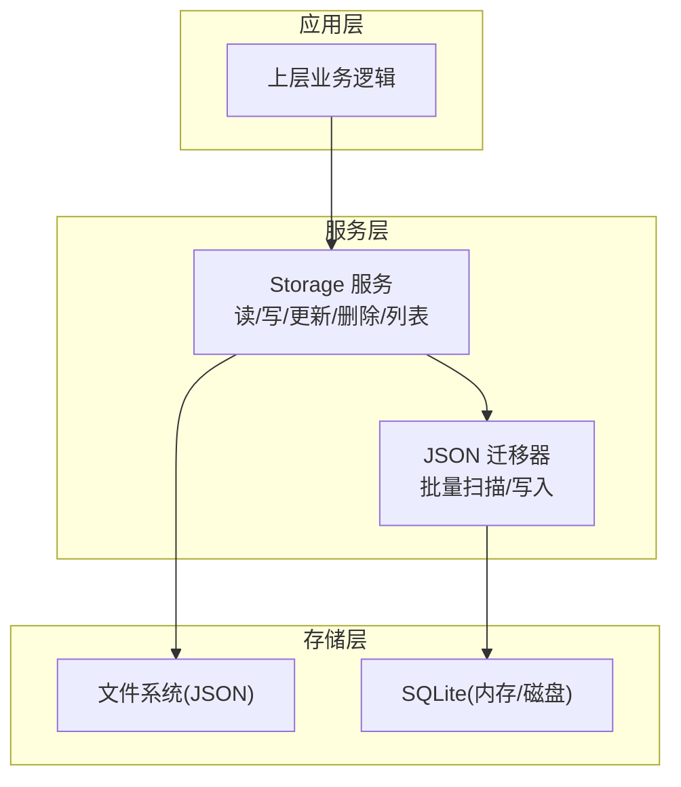
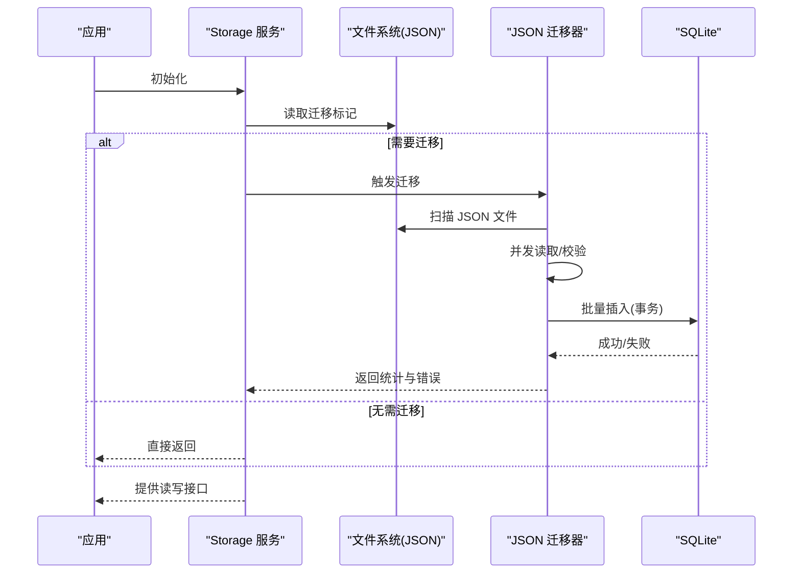
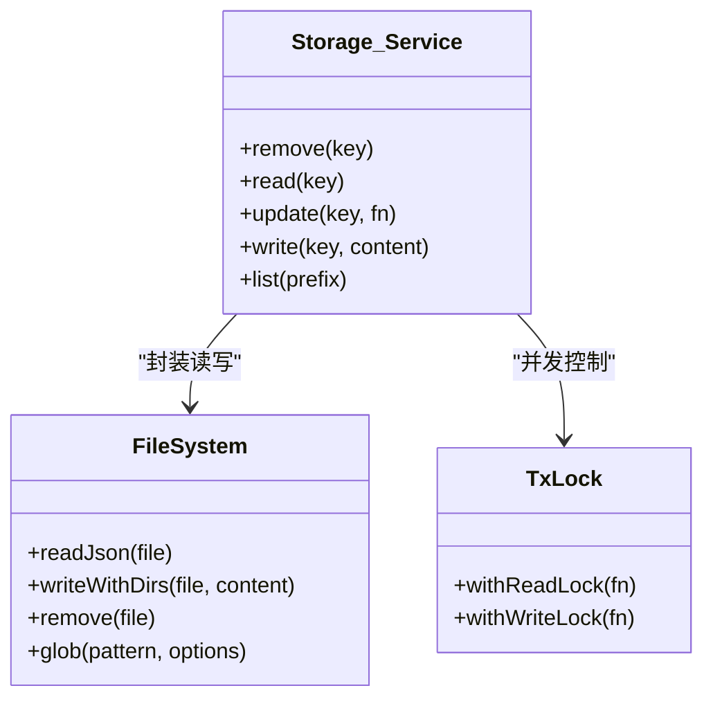
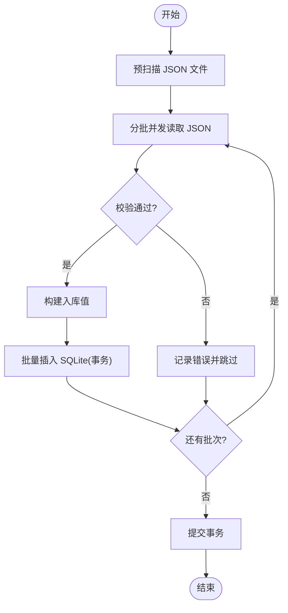
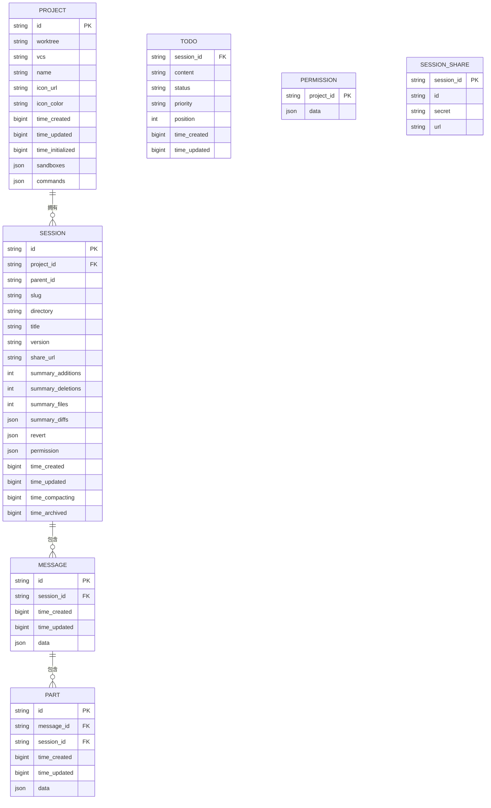
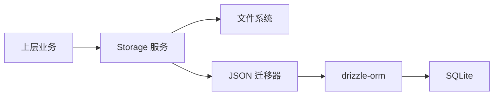
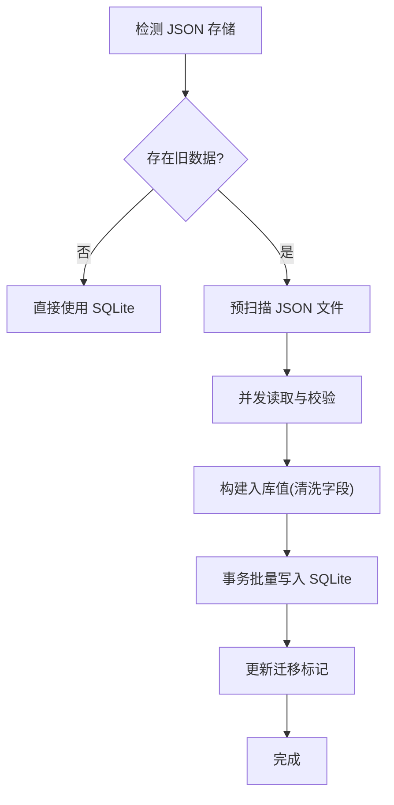

# 存储系统设计

<cite>
**本文引用的文件**
- [packages/opencode/src/storage/storage.ts](file://packages/opencode/src/storage/storage.ts)
- [packages/opencode/test/storage/storage.test.ts](file://packages/opencode/test/storage/storage.test.ts)
- [packages/opencode/src/storage/json-migration.ts](file://packages/opencode/src/storage/json-migration.ts)
- [packages/opencode/test/storage/json-migration.test.ts](file://packages/opencode/test/storage/json-migration.test.ts)
- [packages/opencode/src/project/project.sql.ts](file://packages/opencode/src/project/project.sql.ts)
- [packages/opencode/src/session/session.sql.ts](file://packages/opencode/src/session/session.sql.ts)
- [packages/opencode/src/share/share.sql.ts](file://packages/opencode/src/share/share.sql.ts)
- [packages/opencode/src/session/schema.ts](file://packages/opencode/src/session/schema.ts)
- [packages/opencode/src/project/schema.ts](file://packages/opencode/src/project/schema.ts)
</cite>

## 目录
1. [引言](#引言)
2. [项目结构](#项目结构)
3. [核心组件](#核心组件)
4. [架构总览](#架构总览)
5. [详细组件分析](#详细组件分析)
6. [依赖关系分析](#依赖关系分析)
7. [性能考量](#性能考量)
8. [故障排查指南](#故障排查指南)
9. [结论](#结论)
10. [附录](#附录)

## 引言
本设计文档面向 OpenCode 的存储系统，系统采用“双层存储”架构：以 JSON 文件作为本地持久化与兼容性基础，同时通过 SQLite 数据库存储核心业务数据，并在启动时执行从 JSON 到 SQLite 的迁移。本文档将详细阐述：
- SQLite 数据库设计理念与表结构（项目、会话、消息、部件、待办、权限、分享等）
- JSON 迁移机制的实现原理（版本管理、并发扫描、批量写入、冲突处理）
- 缓存与并发控制策略（读写锁、事务隔离）
- 数据访问模式与查询优化策略
- 数据备份、恢复与性能监控最佳实践

## 项目结构
OpenCode 存储系统位于 packages/opencode/src/storage 下，核心文件包括：
- storage.ts：通用键值存储服务，负责 JSON 文件的读写、列表与迁移触发
- json-migration.ts：JSON 到 SQLite 的迁移器，负责批量读取、校验与写入
- schema.sql.ts 与 session.sql.ts：SQLite 表定义与 drizzle 映射
- 测试文件：验证迁移行为、并发一致性与错误处理

图表来源
- [packages/opencode/src/storage/storage.ts:219-328](file://packages/opencode/src/storage/storage.ts#L219-L328)
- [packages/opencode/src/storage/json-migration.ts:26-424](file://packages/opencode/src/storage/json-migration.ts#L26-L424)

章节来源
- [packages/opencode/src/storage/storage.ts:1-354](file://packages/opencode/src/storage/storage.ts#L1-L354)
- [packages/opencode/src/storage/json-migration.ts:1-426](file://packages/opencode/src/storage/json-migration.ts#L1-L426)

## 核心组件
- Storage 服务：提供统一的键值存储接口，基于文件系统 JSON 实现；内置迁移触发与并发控制
- JSON 迁移器：扫描 JSON 存储目录，批量读取并写入 SQLite，支持进度回调与错误收集
- SQLite 模式：使用 drizzle-orm 定义项目、会话、消息、部件、待办、权限、分享等表

章节来源
- [packages/opencode/src/storage/storage.ts:57-65](file://packages/opencode/src/storage/storage.ts#L57-L65)
- [packages/opencode/src/storage/json-migration.ts:16-25](file://packages/opencode/src/storage/json-migration.ts#L16-L25)

## 架构总览
存储系统采用“先 JSON、后 SQLite”的演进路径。启动时：
- 若检测到旧版 JSON 存储，自动运行迁移步骤
- 迁移器预扫描所有目标文件，按批次读取与写入
- 使用事务包裹写入，确保一致性
- 写入 SQLite 后，保留 JSON 历史以便回溯与审计

图表来源
- [packages/opencode/src/storage/storage.ts:219-248](file://packages/opencode/src/storage/storage.ts#L219-L248)
- [packages/opencode/src/storage/json-migration.ts:26-424](file://packages/opencode/src/storage/json-migration.ts#L26-L424)

## 详细组件分析

### 组件一：Storage 服务（JSON 文件存储）
- 职责
  - 读取/写入/更新/删除 JSON 文件
  - 列出指定前缀下的所有条目
  - 对缺失资源抛出统一错误类型
  - 为同一目标文件提供可重入读写锁，保证并发安全
- 关键点
  - 键路径映射为文件路径，扩展名为 .json
  - 读取失败时转换为统一错误类型
  - 通过迁移标记决定是否执行迁移步骤
  - 使用事务可重入锁避免并发写入冲突

图表来源
- [packages/opencode/src/storage/storage.ts:57-65](file://packages/opencode/src/storage/storage.ts#L57-L65)
- [packages/opencode/src/storage/storage.ts:260-304](file://packages/opencode/src/storage/storage.ts#L260-L304)

章节来源
- [packages/opencode/src/storage/storage.ts:277-304](file://packages/opencode/src/storage/storage.ts#L277-L304)
- [packages/opencode/test/storage/storage.test.ts:75-180](file://packages/opencode/test/storage/storage.test.ts#L75-L180)

### 组件二：JSON 迁移器（从 JSON 到 SQLite）
- 设计理念
  - 以“文件名/目录结构”为权威 ID 来源，忽略 JSON 中过期字段
  - 先迁移无外键依赖的项目，再迁移有外键依赖的会话与消息
  - 使用批处理与并发读取提升吞吐，事务包裹保证一致性
- 核心流程
  - 预扫描：一次性扫描所有目标目录，减少重复 IO
  - 并发读取：对每个批次并行解析 JSON，失败项记录错误
  - 写入 SQLite：使用 onConflictDoNothing 避免重复
  - 错误处理：跳过孤儿数据，记录错误日志，不影响其他条目
- 性能优化
  - SQLite 参数优化：WAL、OFF 同步、增大缓存、内存临时存储
  - 批量大小：默认 1000 条，平衡内存与吞吐
  - 进度回调：支持外部观察迁移进度

图表来源
- [packages/opencode/src/storage/json-migration.ts:78-106](file://packages/opencode/src/storage/json-migration.ts#L78-L106)
- [packages/opencode/src/storage/json-migration.ts:151-180](file://packages/opencode/src/storage/json-migration.ts#L151-L180)
- [packages/opencode/src/storage/json-migration.ts:403-404](file://packages/opencode/src/storage/json-migration.ts#L403-L404)

章节来源
- [packages/opencode/src/storage/json-migration.ts:26-424](file://packages/opencode/src/storage/json-migration.ts#L26-L424)
- [packages/opencode/test/storage/json-migration.test.ts:111-132](file://packages/opencode/test/storage/json-migration.test.ts#L111-L132)

### 组件三：SQLite 数据模型与关系
- 表与字段概览
  - 项目表：包含工作树、版本控制信息、时间戳、沙箱与命令配置等
  - 会话表：包含父会话、标题、版本、摘要、分享链接、权限与时间戳等
  - 消息表：包含会话外键、时间戳与完整 JSON 数据
  - 部件表：包含消息外键、会话外键、时间戳与数据体
  - 待办表：按位置排序，包含内容、状态、优先级与时间戳
  - 权限表：按项目组织的规则数组
  - 分享表：包含会话分享的唯一标识、密钥与公开链接
- 关系约束
  - 项目与会话：一对多
  - 会话与消息：一对多
  - 消息与部件：一对多
  - 外键启用：确保引用完整性

图表来源
- [packages/opencode/src/project/project.sql.ts](file://packages/opencode/src/project/project.sql.ts)
- [packages/opencode/src/session/session.sql.ts](file://packages/opencode/src/session/session.sql.ts)
- [packages/opencode/src/share/share.sql.ts](file://packages/opencode/src/share/share.sql.ts)

章节来源
- [packages/opencode/src/project/project.sql.ts](file://packages/opencode/src/project/project.sql.ts)
- [packages/opencode/src/session/session.sql.ts](file://packages/opencode/src/session/session.sql.ts)
- [packages/opencode/src/share/share.sql.ts](file://packages/opencode/src/share/share.sql.ts)

### 组件四：ID 解析与数据转换策略
- ID 来源优先级
  - 文件名：项目、会话、消息、部件均以文件名作为最终 ID
  - 目录路径：会话的项目 ID 来自其所在目录名
- 字段清洗
  - 移除 JSON 中的冗余字段（如 id、sessionID、messageID），避免与文件系统权威信息冲突
- 数据类型与默认值
  - 时间戳统一使用毫秒级时间
  - 可选字段缺失时使用默认值或空集合

章节来源
- [packages/opencode/test/storage/json-migration.test.ts:134-154](file://packages/opencode/test/storage/json-migration.test.ts#L134-L154)
- [packages/opencode/test/storage/json-migration.test.ts:313-341](file://packages/opencode/test/storage/json-migration.test.ts#L313-L341)
- [packages/opencode/test/storage/json-migration.test.ts:343-379](file://packages/opencode/test/storage/json-migration.test.ts#L343-L379)

### 组件五：并发控制与缓存机制
- 并发控制
  - 读写锁：针对同一目标文件使用可重入读写锁，保证并发更新不互相阻塞
  - 事务隔离：迁移阶段使用显式事务包裹，失败回滚
- 缓存策略
  - 运行时缓存：Storage 层对初始化状态进行缓存，避免重复扫描
  - 文件系统缓存：通过文件系统层的缓存能力降低频繁 IO
  - 应用侧缓存：建议上层业务在内存中缓存热点数据（如最近会话、项目元数据）

章节来源
- [packages/opencode/src/storage/storage.ts:227-248](file://packages/opencode/src/storage/storage.ts#L227-L248)
- [packages/opencode/src/storage/storage.ts:260-269](file://packages/opencode/src/storage/storage.ts#L260-L269)

## 依赖关系分析
- Storage 服务依赖文件系统与全局路径，负责迁移触发与并发控制
- 迁移器依赖 drizzle-orm 与 SQLite，负责批量导入
- 上层业务通过统一接口访问存储，不直接依赖具体实现

图表来源
- [packages/opencode/src/storage/storage.ts:219-328](file://packages/opencode/src/storage/storage.ts#L219-L328)
- [packages/opencode/src/storage/json-migration.ts:46-47](file://packages/opencode/src/storage/json-migration.ts#L46-L47)

章节来源
- [packages/opencode/src/storage/storage.ts:1-354](file://packages/opencode/src/storage/storage.ts#L1-L354)
- [packages/opencode/src/storage/json-migration.ts:1-426](file://packages/opencode/src/storage/json-migration.ts#L1-L426)

## 性能考量
- 迁移阶段
  - 使用 WAL 模式与禁用同步可显著提升写入性能
  - 批量插入与 onConflictDoNothing 减少冲突与回滚开销
  - 并发读取与预扫描降低 IO 等待
- 查询阶段
  - 建议为常用查询字段建立索引（如会话创建时间、消息时间戳）
  - 使用分页与投影裁剪结果集大小
  - 对热点数据进行内存缓存
- I/O 优化
  - 将 SQLite 数据文件置于高性能磁盘
  - 避免频繁小文件写入，合并写操作

## 故障排查指南
- 常见问题
  - 迁移未执行：检查迁移标记文件是否存在且可读
  - 迁移卡住：确认 SQLite 是否被其他进程占用，检查事务是否超时
  - 数据不一致：查看迁移错误列表，定位失败文件
  - 并发写入异常：确认读写锁是否正确释放
- 排查步骤
  - 查看迁移日志与错误统计
  - 校验 JSON 文件格式与关键字段
  - 检查外键约束与孤儿数据
  - 验证文件系统权限与磁盘空间

章节来源
- [packages/opencode/test/storage/json-migration.test.ts:616-629](file://packages/opencode/test/storage/json-migration.test.ts#L616-L629)
- [packages/opencode/test/storage/json-migration.test.ts:631-649](file://packages/opencode/test/storage/json-migration.test.ts#L631-L649)
- [packages/opencode/test/storage/storage.test.ts:282-294](file://packages/opencode/test/storage/storage.test.ts#L282-L294)

## 结论
OpenCode 的存储系统通过“JSON 基础 + SQLite 主存储”的双轨设计，在保证向后兼容的同时，提供了高性能与可维护性的核心数据存储。迁移器以批处理与并发读取为核心，结合事务与冲突忽略策略，确保大规模数据迁移的稳定性与效率。配合读写锁与运行时缓存，系统在高并发场景下仍能保持良好的一致性与性能。

## 附录

### 数据备份与恢复最佳实践
- 备份
  - 定期复制 SQLite 数据文件（建议 WAL 模式下关闭数据库后再复制）
  - 备份 JSON 存储目录，保留历史与审计线索
- 恢复
  - 恢复 SQLite 后重新运行迁移器，确保数据一致性
  - 恢复 JSON 目录用于回溯与审计，不直接写入生产环境

### 迁移流程图（概念）

[此图为概念示意，不对应具体源码文件]