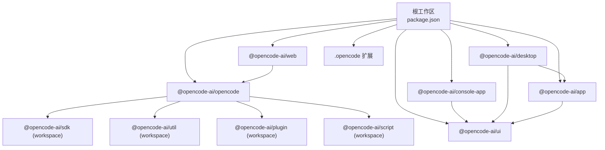
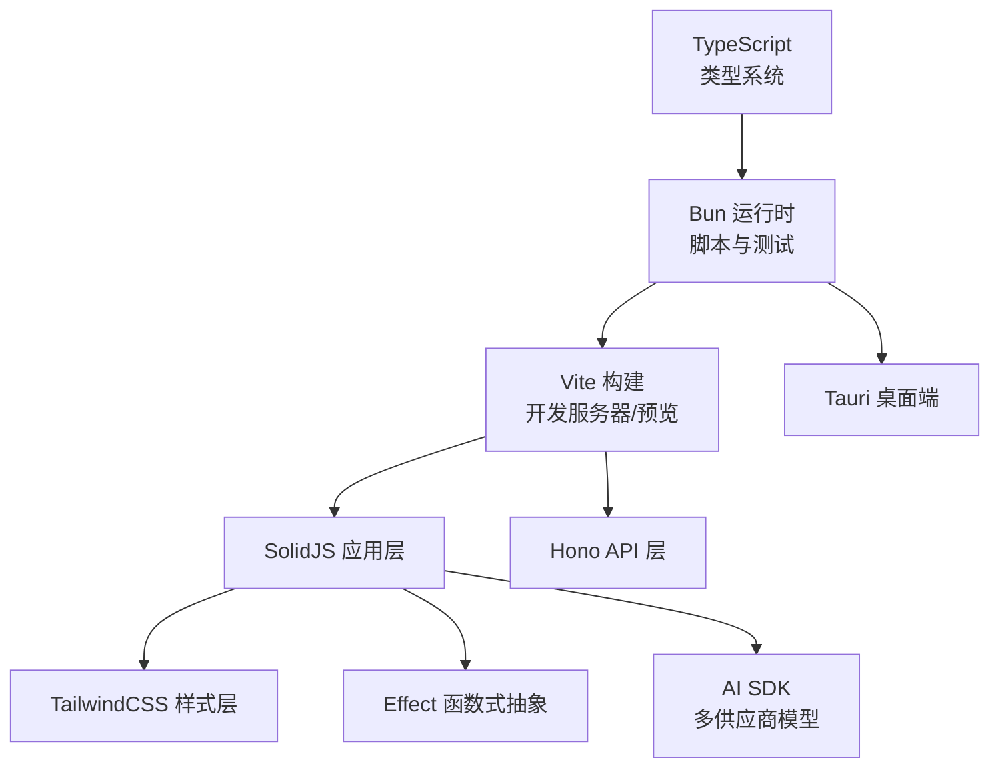
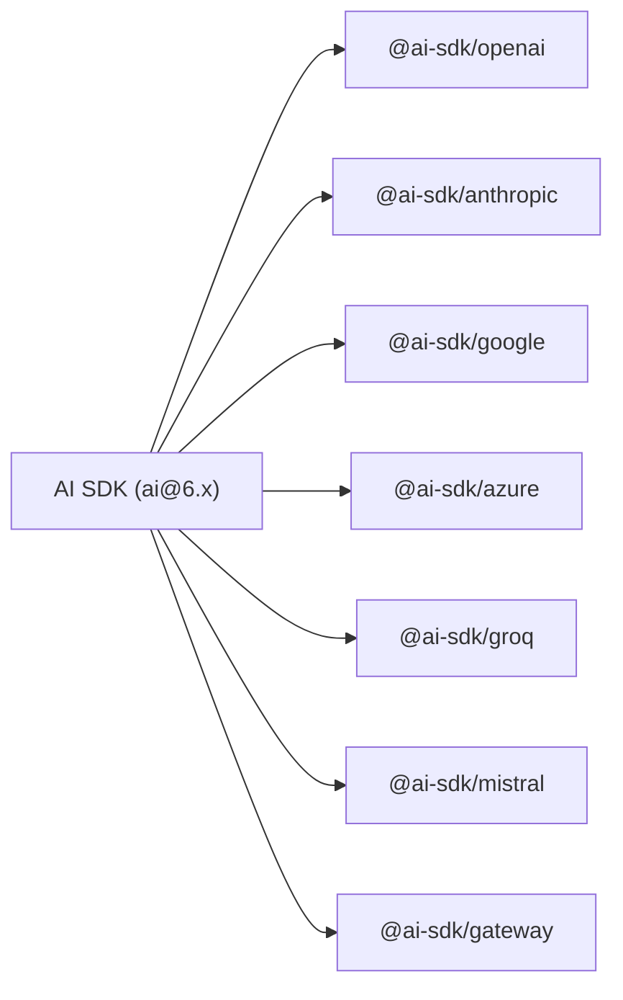
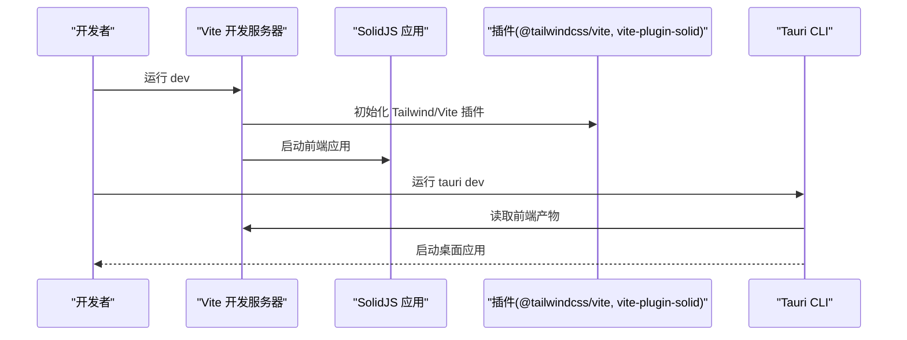
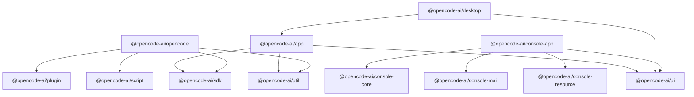

# 技术栈

<cite>
**本文引用的文件**
- [package.json](file://package.json)
- [bunfig.toml](file://bunfig.toml)
- [tsconfig.json](file://tsconfig.json)
- [turbo.json](file://turbo.json)
- [README.md](file://README.md)
- [.opencode/package.json](file://.opencode/package.json)
- [packages/opencode/package.json](file://packages/opencode/package.json)
- [packages/app/package.json](file://packages/app/package.json)
- [packages/console/app/package.json](file://packages/console/app/package.json)
- [packages/desktop/package.json](file://packages/desktop/package.json)
- [packages/ui/package.json](file://packages/ui/package.json)
- [packages/web/package.json](file://packages/web/package.json)
</cite>

## 目录
1. [简介](#简介)
2. [项目结构](#项目结构)
3. [核心组件](#核心组件)
4. [架构总览](#架构总览)
5. [详细组件分析](#详细组件分析)
6. [依赖关系分析](#依赖关系分析)
7. [性能考量](#性能考量)
8. [故障排查指南](#故障排查指南)
9. [结论](#结论)
10. [附录](#附录)

## 简介
本文件系统化梳理 OpenCode 的技术栈与选型依据，覆盖以下方面：
- TypeScript 在类型安全与开发体验上的优势
- Bun 作为运行时与构建工具的选择原因
- AI SDK、Effect 等关键依赖的作用与集成方式
- 前端框架 SolidJS 与 TailwindCSS 的使用场景
- 构建工具 Vite、Tauri 的配置与优化
- 版本兼容性、性能考量与替代方案对比
- 技术选型的决策依据与未来演进方向

## 项目结构
OpenCode 采用 Monorepo 结构，根目录通过工作区统一管理多包，核心子包包括：
- 核心 CLI 与后端能力：packages/opencode
- Web 控制台应用：packages/console/app
- 桌面应用（基于 Tauri）：packages/desktop
- 前端应用（Vite + SolidJS）：packages/app
- UI 组件库与样式：packages/ui
- 文档站点（Astro + SolidJS）：packages/web
- 其他扩展与工具：packages/* 及 .opencode

图表来源
- [package.json:20-75](file://package.json#L20-L75)
- [packages/opencode/package.json:103-107](file://packages/opencode/package.json#L103-L107)
- [packages/console/app/package.json:19-22](file://packages/console/app/package.json#L19-L22)
- [packages/desktop/package.json:16-17](file://packages/desktop/package.json#L16-L17)
- [packages/app/package.json:43-45](file://packages/app/package.json#L43-L45)
- [packages/ui/package.json:46-47](file://packages/ui/package.json#L46-L47)
- [packages/web/package.json:14-17](file://packages/web/package.json#L14-L17)

章节来源
- [package.json:20-75](file://package.json#L20-L75)
- [README.md:100-113](file://README.md#L100-L113)

## 核心组件
- 运行时与包管理：Bun（根 packageManager 为 bun@1.3.11；各包脚本广泛使用 bun run/bun test）
- 类型系统：TypeScript（根 tsconfig 使用 @tsconfig/bun；各包 devDependencies 引入 @types/* 与 @typescript/native-preview）
- 构建与缓存：Vite（桌面与前端应用）、Turbo（类型检查与任务编排）
- 前端框架：SolidJS（packages/app、packages/ui、packages/console/app、packages/web）
- 样式与主题：TailwindCSS（通过 @tailwindcss/vite 集成）
- AI 能力：AI SDK（ai@6.x），覆盖多家模型供应商
- 后端框架：Hono（用于 API 层与中间件）
- 平台抽象：Effect（effect@beta、@effect/platform-node）
- 桌面端：Tauri（packages/desktop 使用 tauri dev/build）

章节来源
- [package.json:7-18](file://package.json#L7-L18)
- [tsconfig.json:1-6](file://tsconfig.json#L1-L6)
- [packages/app/package.json:27-40](file://packages/app/package.json#L27-L40)
- [packages/desktop/package.json:7-14](file://packages/desktop/package.json#L7-L14)
- [packages/console/app/package.json:6-12](file://packages/console/app/package.json#L6-L12)
- [packages/web/package.json:6-13](file://packages/web/package.json#L6-L13)

## 架构总览
OpenCode 的技术栈围绕“统一类型系统 + 快速运行时 + 现代前端 + 多端分发”展开：
- 类型安全：TypeScript + @typescript/native-preview 提供严格类型与原生特性支持
- 运行时效率：Bun 提供极快的启动与执行速度，配合脚本与测试命令
- 前端体验：SolidJS + TailwindCSS + Vite，兼顾性能与开发体验
- AI 融合：AI SDK 抽象多家模型供应商，统一接口
- 平台抽象：Effect 提供函数式编程范式与平台能力
- 桌面端：Tauri 将 Web 前端打包为原生应用

图表来源
- [package.json:7-18](file://package.json#L7-L18)
- [packages/app/package.json:27-40](file://packages/app/package.json#L27-L40)
- [packages/desktop/package.json:7-14](file://packages/desktop/package.json#L7-L14)
- [packages/ui/package.json:32-42](file://packages/ui/package.json#L32-L42)
- [packages/opencode/package.json:74-92](file://packages/opencode/package.json#L74-L92)

## 详细组件分析

### TypeScript 与类型安全
- 根配置：继承 @tsconfig/bun，确保与 Bun 运行时一致的编译选项
- 工作区：各包通过 @typescript/native-preview 与 @types/* 提供类型增强
- 优势：
  - 编译期错误前置，降低运行时风险
  - 更佳的 IDE 支持与重构能力
  - 便于在多包间共享类型定义

章节来源
- [tsconfig.json:1-6](file://tsconfig.json#L1-L6)
- [package.json:78-86](file://package.json#L78-L86)
- [packages/app/package.json:31-37](file://packages/app/package.json#L31-L37)

### Bun：运行时与构建工具
- 根级包管理器：bun@1.3.11，保证团队一致性
- 脚本生态：dev、build、test、typecheck 等均以 bun 为核心
- 依赖锁定策略：install.exact=true，减少版本漂移
- 作用：
  - 快速启动与热重载
  - 统一的包管理与脚本执行
  - 与 TypeScript 协同良好

章节来源
- [package.json:7-18](file://package.json#L7-L18)
- [bunfig.toml:1-7](file://bunfig.toml#L1-L7)

### AI SDK 与多模型供应商集成
- 核心库：ai@6.x，提供统一的对话与流式响应接口
- 供应商适配：通过 @ai-sdk/* 生态接入多家模型（如 OpenAI、Anthropic、Google 等）
- 集成方式：
  - 在 opencode 包中集中引入多供应商 Provider
  - 通过环境变量或配置切换模型与供应商
  - 利用 AI SDK 的流式与 JSON 模式提升交互体验

图表来源
- [packages/opencode/package.json:74-92](file://packages/opencode/package.json#L74-L92)
- [package.json:50](file://package.json#L50)

章节来源
- [packages/opencode/package.json:74-92](file://packages/opencode/package.json#L74-L92)
- [package.json:50](file://package.json#L50)

### Effect：函数式抽象与平台能力
- 核心库：effect@beta，提供资源安全、并发与错误处理的函数式范式
- 平台抽象：@effect/platform-node，封装 Node 平台能力
- 集成点：
  - 在 opencode 包中作为依赖，用于构建可组合的系统模块
  - 与 AI SDK、Hono 等协作，提供稳定、可测试的运行时行为

章节来源
- [package.json:49](file://package.json#L49)
- [packages/opencode/package.json:95](file://packages/opencode/package.json#L95)

### 前端框架：SolidJS 与 TailwindCSS
- SolidJS：在 packages/app、packages/ui、packages/console/app、packages/web 中广泛使用，强调响应式与细粒度更新
- TailwindCSS：通过 @tailwindcss/vite 集成，实现原子化样式与主题定制
- 优化点：
  - 组件库与 UI 主题统一导出，便于复用
  - 与 Vite 协同，提供快速热更新与按需构建

章节来源
- [packages/app/package.json:47-75](file://packages/app/package.json#L47-L75)
- [packages/ui/package.json:32-42](file://packages/ui/package.json#L32-L42)
- [packages/console/app/package.json:27](file://packages/console/app/package.json#L27)
- [packages/web/package.json:17](file://packages/web/package.json#L17)

### 构建工具：Vite 与 Tauri
- Vite：
  - packages/app、packages/ui、packages/console/app、packages/desktop 使用 vite dev/build
  - 与 @tailwindcss/vite、vite-plugin-solid 协同
- Tauri：
  - packages/desktop 通过 tauri dev/build，结合 @tauri-apps/* 插件生态
  - 与 SolidJS 前端无缝衔接，实现跨平台桌面应用

图表来源
- [packages/app/package.json:11-16](file://packages/app/package.json#L11-L16)
- [packages/desktop/package.json:7-14](file://packages/desktop/package.json#L7-L14)
- [packages/ui/package.json:32-42](file://packages/ui/package.json#L32-L42)

章节来源
- [packages/app/package.json:11-16](file://packages/app/package.json#L11-L16)
- [packages/desktop/package.json:7-14](file://packages/desktop/package.json#L7-L14)
- [packages/ui/package.json:32-42](file://packages/ui/package.json#L32-L42)

### 任务编排与类型检查：Turbo
- 任务定义：typecheck、build、test 等任务在 turbo.json 中声明
- 依赖链：test 依赖于 ^build，确保先构建再测试
- 输出缓存：build 任务输出 dist/**，提高增量构建效率

章节来源
- [turbo.json:5-30](file://turbo.json#L5-L30)

### 版本兼容性与替代方案
- TypeScript：使用 @typescript/native-preview 与 @tsconfig/bun，确保与 Bun 运行时一致
- Bun：根级指定版本，避免不同机器差异
- Vite：与 SolidJS 生态匹配良好，替代方案如 Rollup/webpack 在此场景下复杂度更高
- Tauri：替代方案如 Electron 在体积与性能上存在权衡
- AI SDK：替代方案如直接调用各供应商 SDK，会增加适配成本与维护复杂度

章节来源
- [package.json:60-73](file://package.json#L60-L73)
- [package.json:78-86](file://package.json#L78-L86)
- [packages/desktop/package.json:38-42](file://packages/desktop/package.json#L38-L42)

## 依赖关系分析
- 工作区依赖：
  - opencode 依赖 @opencode-ai/sdk、@opencode-ai/util、@opencode-ai/plugin、@opencode-ai/script
  - console-app 依赖 @opencode-ai/ui、@opencode-ai/console-* 系列
  - desktop 依赖 @opencode-ai/app 与 @opencode-ai/ui
  - app 依赖 @opencode-ai/ui、@opencode-ai/util、@opencode-ai/sdk
- 第三方依赖：
  - AI SDK 与多供应商 Provider
  - Effect 与 @effect/platform-node
  - SolidJS 生态与 TailwindCSS

图表来源
- [packages/opencode/package.json:103-107](file://packages/opencode/package.json#L103-L107)
- [packages/console/app/package.json:19-22](file://packages/console/app/package.json#L19-L22)
- [packages/desktop/package.json:16-17](file://packages/desktop/package.json#L16-L17)
- [packages/app/package.json:43-45](file://packages/app/package.json#L43-L45)

章节来源
- [packages/opencode/package.json:103-107](file://packages/opencode/package.json#L103-L107)
- [packages/console/app/package.json:19-22](file://packages/console/app/package.json#L19-L22)
- [packages/desktop/package.json:16-17](file://packages/desktop/package.json#L16-L17)
- [packages/app/package.json:43-45](file://packages/app/package.json#L43-L45)

## 性能考量
- Bun 启动与执行速度快，适合本地开发与脚本执行
- SolidJS 的细粒度响应与最小重渲染，降低前端性能开销
- Vite 的按需加载与 HMR，缩短开发等待时间
- Effect 的资源安全与不可变数据结构，有助于减少副作用导致的性能问题
- Tauri 相比 Electron 在内存占用与启动速度上有一定优势

## 故障排查指南
- 类型检查失败：优先在对应包内执行 typecheck，确认 tsconfig 与 @types/* 是否齐全
- 构建失败：检查 turbo.json 中 dependsOn 与输出目录是否正确
- Vite 热更新异常：清理 node_modules/.vite 缓存，重新安装依赖
- Tauri 开发问题：确认 @tauri-apps/cli 版本与系统依赖，查看 CLI 输出日志
- AI SDK 认证失败：核对供应商密钥与环境变量，确认网络可达性

章节来源
- [turbo.json:5-30](file://turbo.json#L5-L30)
- [packages/app/package.json:11-16](file://packages/app/package.json#L11-L16)
- [packages/desktop/package.json:7-14](file://packages/desktop/package.json#L7-L14)
- [package.json:78-86](file://package.json#L78-L86)

## 结论
OpenCode 的技术栈以“高性能运行时 + 统一类型系统 + 现代前端 + 多端分发”为核心，Bun、TypeScript、SolidJS、AI SDK、Effect、Vite 与 Tauri 形成了高内聚、低耦合的体系。该选型在开发体验、构建效率与运行性能之间取得平衡，并为未来扩展与演进提供了清晰路径。

## 附录
- 安装与运行：参考根 README 的安装与桌面应用说明
- 工作区清单：根 package.json 的 workspaces 字段列出所有包
- 版本策略：通过 catalog 与 exact 依赖策略控制版本一致性

章节来源
- [README.md:46-98](file://README.md#L46-L98)
- [package.json:20-75](file://package.json#L20-L75)
- [bunfig.toml:1-7](file://bunfig.toml#L1-L7)