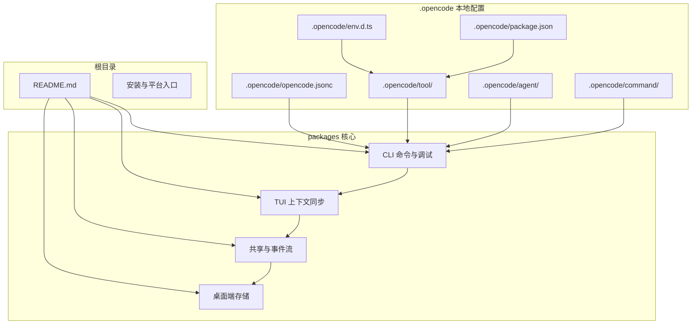
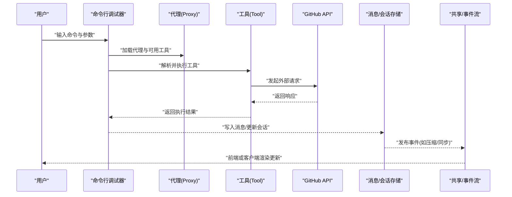
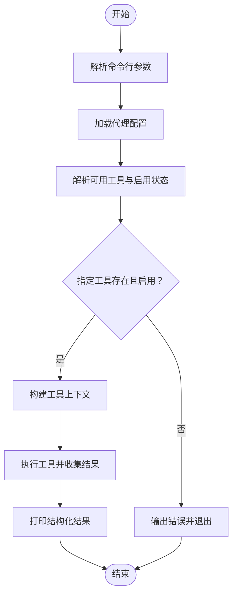
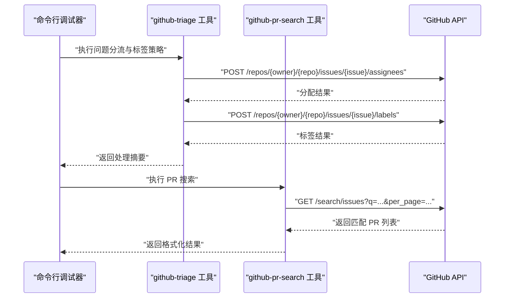
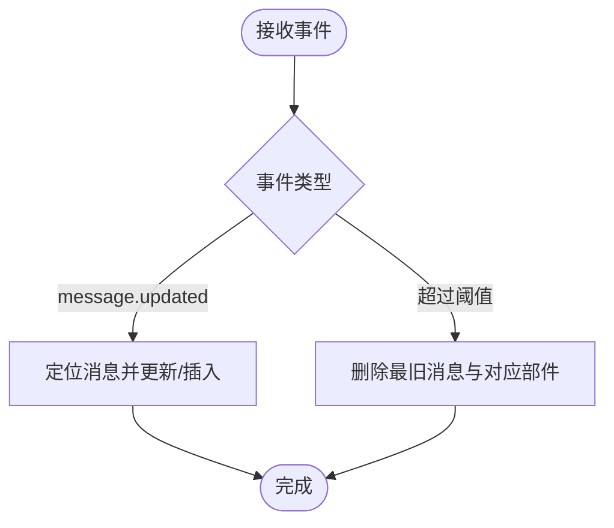
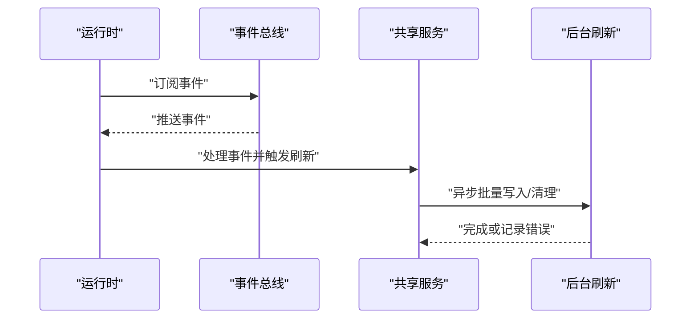
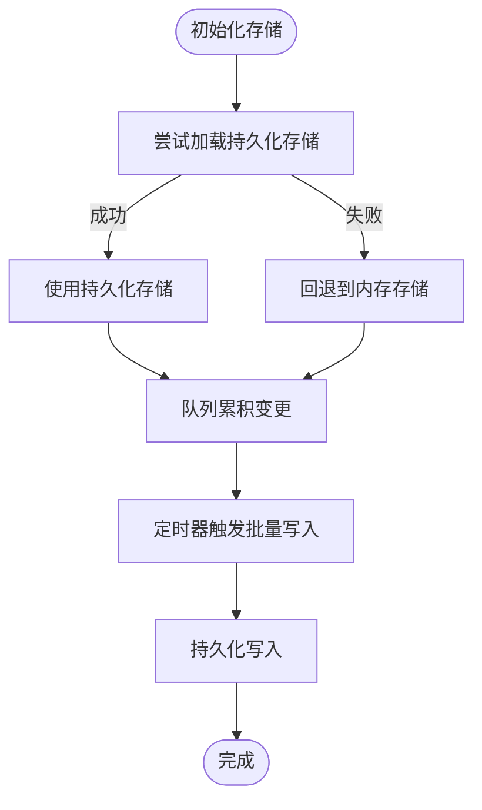
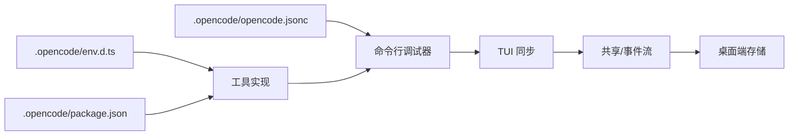

# 数据流架构

<cite>
**本文引用的文件**
- [README.md](file://README.md)
- [.opencode/opencode.jsonc](file://.opencode/opencode.jsonc)
- [.opencode/env.d.ts](file://.opencode/env.d.ts)
- [.opencode/package.json](file://.opencode/package.json)
- [.opencode/tool/github-triage.ts](file://.opencode/tool/github-triage.ts)
- [.opencode/tool/github-pr-search.ts](file://.opencode/tool/github-pr-search.ts)
- [packages/opencode/src/cli/cmd/debug/agent.ts](file://packages/opencode/src/cli/cmd/debug/agent.ts)
- [packages/opencode/src/cli/cmd/tui/context/sync.tsx](file://packages/opencode/src/cli/cmd/tui/context/sync.tsx)
- [packages/opencode/test/session/messages-pagination.test.ts](file://packages/opencode/test/session/messages-pagination.test.ts)
- [packages/opencode/test/session/compaction.test.ts](file://packages/opencode/test/session/compaction.test.ts)
- [packages/desktop/src/index.tsx](file://packages/desktop/src/index.tsx)
- [packages/opencode/src/share/share-next.ts](file://packages/opencode/src/share/share-next.ts)
</cite>

## 目录
1. [简介](#简介)
2. [项目结构](#项目结构)
3. [核心组件](#核心组件)
4. [架构总览](#架构总览)
5. [详细组件分析](#详细组件分析)
6. [依赖关系分析](#依赖关系分析)
7. [性能考量](#性能考量)
8. [故障排查指南](#故障排查指南)
9. [结论](#结论)
10. [附录](#附录)

## 简介
本文件面向 OpenCode 的数据流与运行时架构，聚焦“从用户输入到最终输出”的完整链路：命令解析、代理调度、工具执行、消息传递与会话管理、状态维护与错误传播、同步与异步处理模式、缓存策略与数据持久化，并通过数据流图与时序图展示典型场景。目标是帮助开发者与使用者理解系统如何组织数据、如何在组件间传递、以及如何优化性能与稳定性。

## 项目结构
OpenCode 采用多包（monorepo）与本地配置目录（.opencode）相结合的组织方式：
- 根目录提供安装、平台与基础设施入口（如 CLI、桌面端、Web 端、SDK 等）
- .opencode 目录存放本地代理、命令、工具与主题等可扩展能力
- packages 下包含核心业务包（如 opencode 核心、console、desktop、web 等）

图表来源
- [README.md:1-142](file://README.md#L1-L142)
- [.opencode/opencode.jsonc:1-19](file://.opencode/opencode.jsonc#L1-L19)
- [.opencode/env.d.ts:1-5](file://.opencode/env.d.ts#L1-L5)
- [.opencode/package.json:1-5](file://.opencode/package.json#L1-L5)

章节来源
- [README.md:100-114](file://README.md#L100-L114)
- [.opencode/opencode.jsonc:1-19](file://.opencode/opencode.jsonc#L1-L19)

## 核心组件
- 本地工具（Tool）：封装外部服务调用与业务逻辑，统一以工具接口暴露，支持参数校验与执行结果返回
- 代理（Agent）：定义可用工具集合与权限策略，驱动工具执行
- 命令行调试（Debug Agent）：提供命令行入口，解析参数、加载代理、解析工具、执行并输出结果
- 消息与会话（Message/Session）：承载对话历史、分页与流式遍历，支撑上下文同步与压缩
- 事件总线与共享（Bus/Share）：跨组件事件订阅、状态聚合与后台刷新
- 存储与缓存（Desktop Store）：内存与持久化存储抽象、批量写入与页面可见性优化

章节来源
- [.opencode/tool/github-triage.ts:40-117](file://.opencode/tool/github-triage.ts#L40-L117)
- [.opencode/tool/github-pr-search.ts:24-65](file://.opencode/tool/github-pr-search.ts#L24-L65)
- [packages/opencode/src/cli/cmd/debug/agent.ts:15-61](file://packages/opencode/src/cli/cmd/debug/agent.ts#L15-L61)
- [packages/opencode/src/cli/cmd/tui/context/sync.tsx:237-276](file://packages/opencode/src/cli/cmd/tui/context/sync.tsx#L237-L276)
- [packages/opencode/test/session/messages-pagination.test.ts:310-357](file://packages/opencode/test/session/messages-pagination.test.ts#L310-L357)
- [packages/opencode/test/session/compaction.test.ts:546-578](file://packages/opencode/test/session/compaction.test.ts#L546-L578)
- [packages/opencode/src/share/share-next.ts:132-174](file://packages/opencode/src/share/share-next.ts#L132-L174)
- [packages/desktop/src/index.tsx:161-207](file://packages/desktop/src/index.tsx#L161-L207)

## 架构总览
下图展示了从用户输入到工具执行再到消息更新与持久化的整体数据流：

图表来源
- [packages/opencode/src/cli/cmd/debug/agent.ts:33-61](file://packages/opencode/src/cli/cmd/debug/agent.ts#L33-L61)
- [.opencode/tool/github-triage.ts:57-117](file://.opencode/tool/github-triage.ts#L57-L117)
- [.opencode/tool/github-pr-search.ts:40-65](file://.opencode/tool/github-pr-search.ts#L40-L65)
- [packages/opencode/src/cli/cmd/tui/context/sync.tsx:237-276](file://packages/opencode/src/cli/cmd/tui/context/sync.tsx#L237-L276)
- [packages/opencode/src/share/share-next.ts:132-174](file://packages/opencode/src/share/share-next.ts#L132-L174)

## 详细组件分析

### 命令解析与代理调度
- 参数解析：命令行调试器负责解析代理名、工具 ID 与参数字符串，构造工具上下文并执行
- 工具解析：根据代理可用工具列表与启用状态，解析目标工具并校验参数
- 执行结果：将工具执行结果以结构化 JSON 输出，便于后续处理或展示

图表来源
- [packages/opencode/src/cli/cmd/debug/agent.ts:15-61](file://packages/opencode/src/cli/cmd/debug/agent.ts#L15-L61)

章节来源
- [packages/opencode/src/cli/cmd/debug/agent.ts:15-61](file://packages/opencode/src/cli/cmd/debug/agent.ts#L15-L61)

### 工具执行与外部服务集成
- GitHub 问题分流与标签策略：根据标题/正文关键词与团队规则，动态选择负责人与标签，必要时抛出错误
- PR 搜索工具：基于查询词搜索 PR 列表，返回格式化结果
- 统一错误传播：工具内部对非 OK 响应抛出异常，由上层捕获并输出

图表来源
- [.opencode/tool/github-triage.ts:57-117](file://.opencode/tool/github-triage.ts#L57-L117)
- [.opencode/tool/github-pr-search.ts:40-65](file://.opencode/tool/github-pr-search.ts#L40-L65)

章节来源
- [.opencode/tool/github-triage.ts:40-117](file://.opencode/tool/github-triage.ts#L40-L117)
- [.opencode/tool/github-pr-search.ts:24-65](file://.opencode/tool/github-pr-search.ts#L24-L65)

### 消息传递与会话管理
- 消息更新：按会话维度维护消息列表，支持插入、替换与滚动清理
- 分页与流式遍历：提供分页查询与从新到旧的流式遍历能力
- 会话压缩：在继续流程中触发压缩事件，减少冗余消息占用

图表来源
- [packages/opencode/src/cli/cmd/tui/context/sync.tsx:237-276](file://packages/opencode/src/cli/cmd/tui/context/sync.tsx#L237-L276)
- [packages/opencode/test/session/messages-pagination.test.ts:310-357](file://packages/opencode/test/session/messages-pagination.test.ts#L310-L357)
- [packages/opencode/test/session/compaction.test.ts:546-578](file://packages/opencode/test/session/compaction.test.ts#L546-L578)

章节来源
- [packages/opencode/src/cli/cmd/tui/context/sync.tsx:237-276](file://packages/opencode/src/cli/cmd/tui/context/sync.tsx#L237-L276)
- [packages/opencode/test/session/messages-pagination.test.ts:310-357](file://packages/opencode/test/session/messages-pagination.test.ts#L310-L357)
- [packages/opencode/test/session/compaction.test.ts:546-578](file://packages/opencode/test/session/compaction.test.ts#L546-L578)

### 同步与异步处理模式
- 同步：命令行调试器在单次调用内完成代理加载、工具解析与执行
- 异步：事件总线与共享模块通过订阅回调实现后台刷新与错误捕获，避免阻塞主线程

图表来源
- [packages/opencode/src/share/share-next.ts:132-174](file://packages/opencode/src/share/share-next.ts#L132-L174)

章节来源
- [packages/opencode/src/share/share-next.ts:132-174](file://packages/opencode/src/share/share-next.ts#L132-L174)

### 缓存策略与数据持久化
- 内存优先：桌面端存储以内存 Map 为默认后端，具备快速读写与自动清理能力
- 备用与回退：当持久化加载失败时回退到内存缓存，保证可用性
- 批量写入与节流：通过队列与定时器合并写入，降低频繁 IO；页面不可见时延迟刷新
- 清理与释放：作用域关闭时清空队列，避免内存泄漏

图表来源
- [packages/desktop/src/index.tsx:161-207](file://packages/desktop/src/index.tsx#L161-L207)

章节来源
- [packages/desktop/src/index.tsx:161-207](file://packages/desktop/src/index.tsx#L161-L207)

## 依赖关系分析
- 配置与环境：.opencode 配置文件决定工具启用状态与权限策略；环境声明用于静态资源导入
- 工具依赖：工具通过插件框架注册，统一参数校验与执行协议
- 运行时依赖：CLI 调试器依赖代理与工具；TUI 同步依赖消息存储；共享模块依赖事件总线

图表来源
- [.opencode/opencode.jsonc:1-19](file://.opencode/opencode.jsonc#L1-L19)
- [.opencode/env.d.ts:1-5](file://.opencode/env.d.ts#L1-L5)
- [.opencode/package.json:1-5](file://.opencode/package.json#L1-L5)
- [packages/opencode/src/cli/cmd/debug/agent.ts:15-61](file://packages/opencode/src/cli/cmd/debug/agent.ts#L15-L61)
- [packages/opencode/src/cli/cmd/tui/context/sync.tsx:237-276](file://packages/opencode/src/cli/cmd/tui/context/sync.tsx#L237-L276)
- [packages/opencode/src/share/share-next.ts:132-174](file://packages/opencode/src/share/share-next.ts#L132-L174)
- [packages/desktop/src/index.tsx:161-207](file://packages/desktop/src/index.tsx#L161-L207)

章节来源
- [.opencode/opencode.jsonc:1-19](file://.opencode/opencode.jsonc#L1-L19)
- [.opencode/env.d.ts:1-5](file://.opencode/env.d.ts#L1-L5)
- [.opencode/package.json:1-5](file://.opencode/package.json#L1-L5)

## 性能考量
- 工具调用开销控制
  - 合理设置分页与偏移，避免一次性拉取过多数据
  - 对外部 API 请求进行幂等与去重，减少重复调用
- 消息存储与同步
  - 控制消息列表长度，及时清理最旧条目，避免内存膨胀
  - 使用流式遍历与分页接口，降低一次性加载压力
- 异步刷新与批处理
  - 将多次小写入合并为批量写入，降低磁盘 IO
  - 在页面不可见或后台时延后刷新，节省资源
- 错误与可观测性
  - 对工具执行与持久化写入增加错误捕获与日志记录，便于定位瓶颈

## 故障排查指南
- 工具未找到或禁用
  - 确认代理配置中的工具启用状态与 ID 是否正确
  - 参考命令行调试器的错误输出定位问题
- 外部服务错误
  - 工具内部对非 OK 响应抛出异常，检查凭据与网络连通性
- 消息同步异常
  - 检查消息更新事件是否被正确订阅与处理
  - 关注滚动清理逻辑是否过早删除关键消息
- 共享/事件流异常
  - 查看事件订阅回调中的错误日志，确认后台刷新是否成功

章节来源
- [packages/opencode/src/cli/cmd/debug/agent.ts:33-61](file://packages/opencode/src/cli/cmd/debug/agent.ts#L33-L61)
- [.opencode/tool/github-triage.ts:34-38](file://.opencode/tool/github-triage.ts#L34-L38)
- [packages/opencode/src/cli/cmd/tui/context/sync.tsx:237-276](file://packages/opencode/src/cli/cmd/tui/context/sync.tsx#L237-L276)
- [packages/opencode/src/share/share-next.ts:132-174](file://packages/opencode/src/share/share-next.ts#L132-L174)

## 结论
OpenCode 的数据流以“命令行调试器—代理—工具”为主线，结合“消息/会话—事件总线—共享服务—存储”的副线，形成清晰的同步与异步协同机制。通过参数校验、事件驱动与批处理写入，系统在保证易用性的同时兼顾性能与稳定性。建议在实际部署中关注工具调用频率、消息列表长度与后台刷新策略，以获得更佳体验。

## 附录
- 相关文件路径与用途概览
  - .opencode 配置与工具：用于定义本地能力与权限
  - CLI 调试器：命令行入口，串联代理与工具
  - TUI 同步：消息更新与滚动清理
  - 共享/事件流：后台刷新与错误捕获
  - 桌面端存储：内存与持久化双栈，批量写入与页面可见性优化