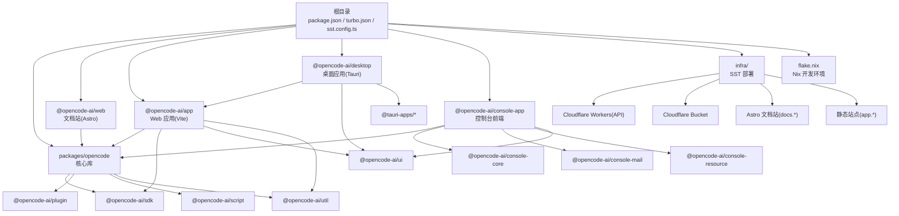
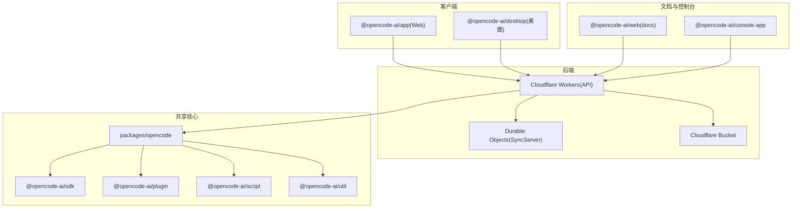
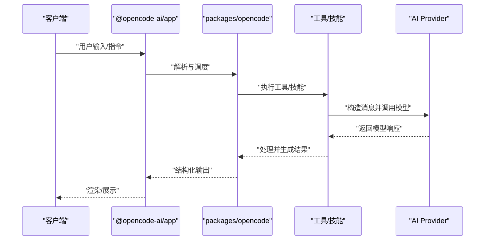
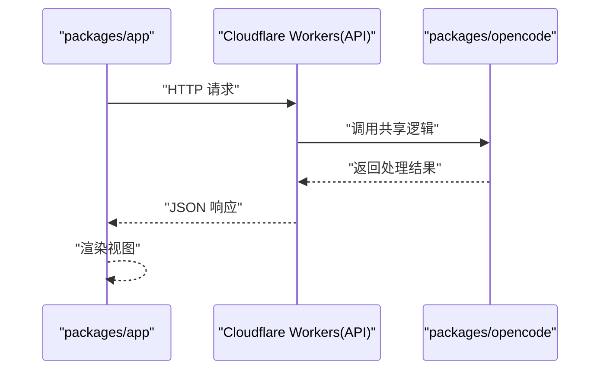
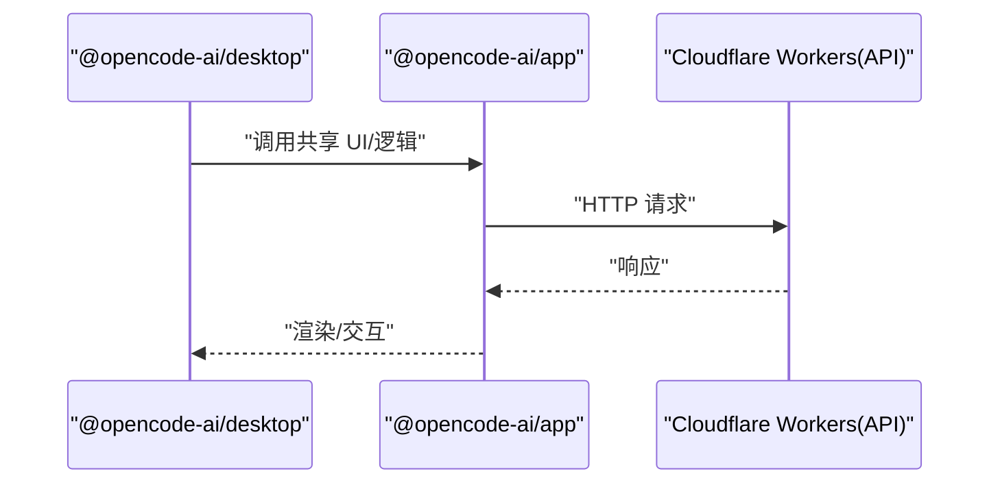
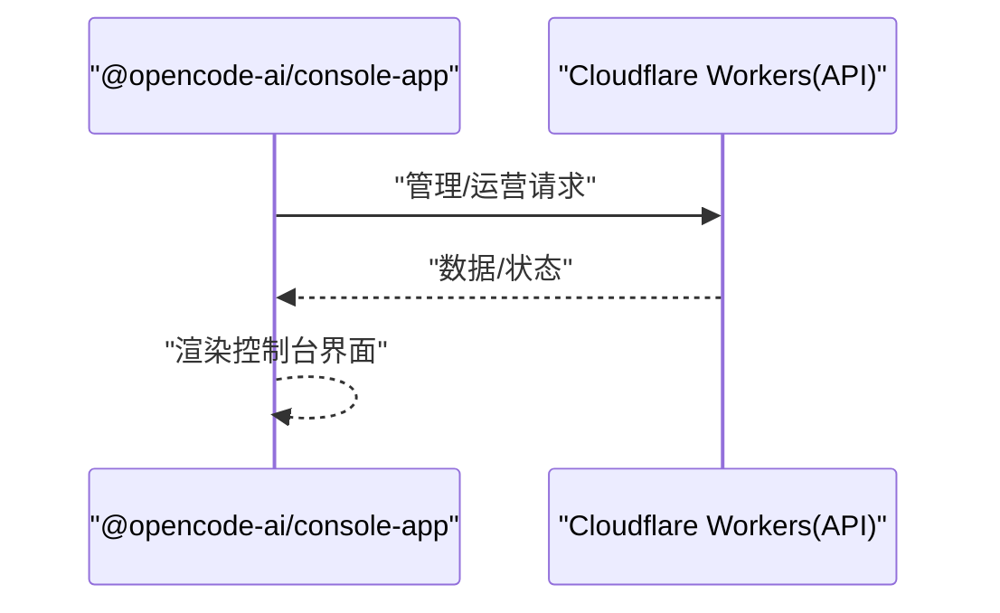
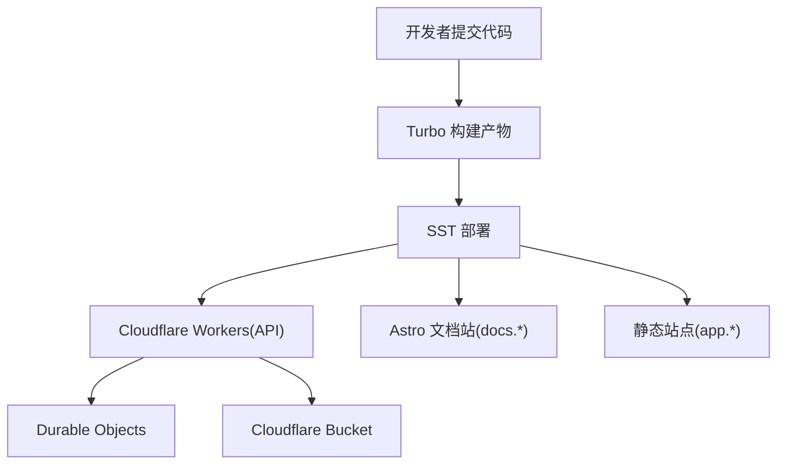
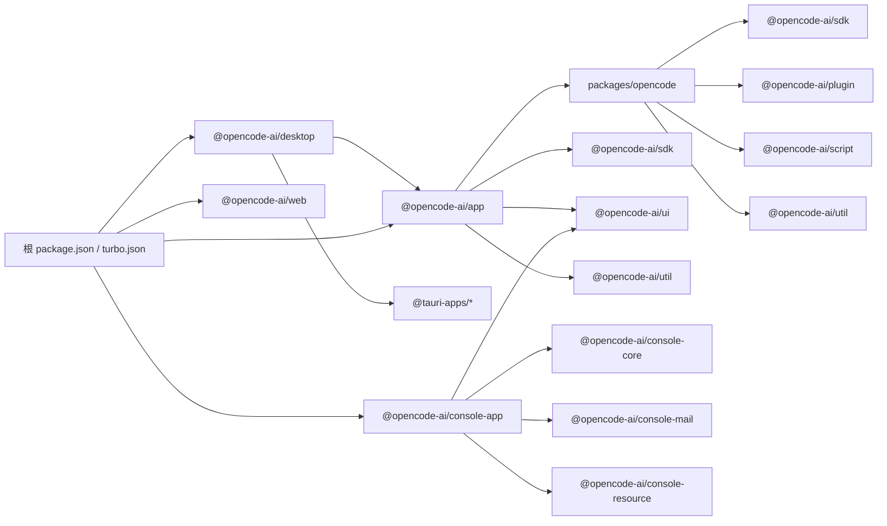
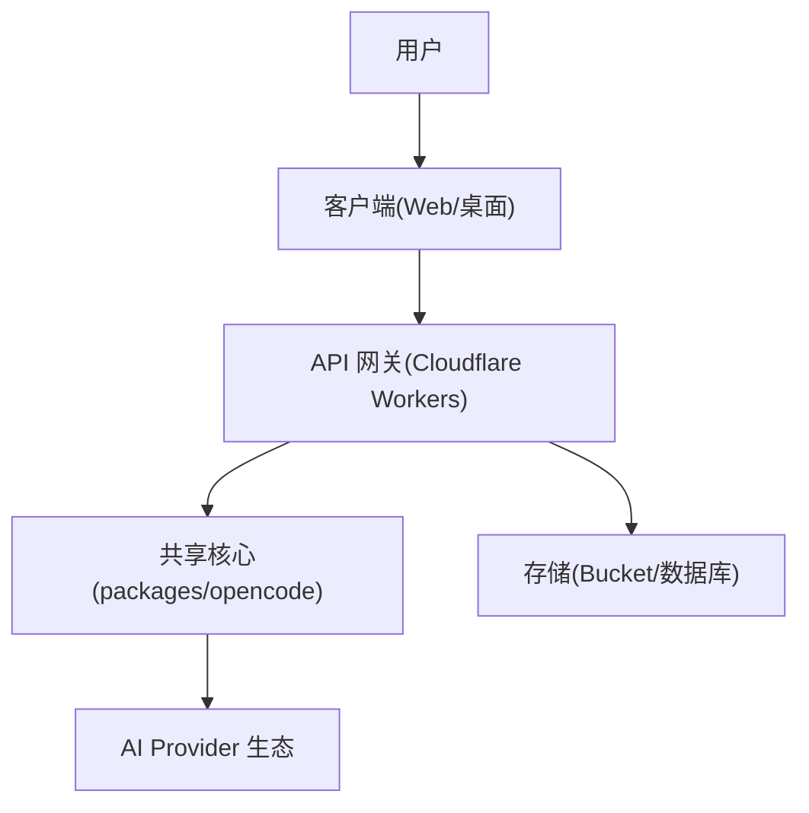

# 整体架构

<cite>
**本文引用的文件**
- [README.md](file://README.md)
- [package.json](file://package.json)
- [turbo.json](file://turbo.json)
- [tsconfig.json](file://tsconfig.json)
- [sst.config.ts](file://sst.config.ts)
- [flake.nix](file://flake.nix)
- [.opencode/package.json](file://.opencode/package.json)
- [.opencode/opencode.jsonc](file://.opencode/opencode.jsonc)
- [infra/app.ts](file://infra/app.ts)
- [packages/opencode/package.json](file://packages/opencode/package.json)
- [packages/web/package.json](file://packages/web/package.json)
- [packages/app/package.json](file://packages/app/package.json)
- [packages/desktop/package.json](file://packages/desktop/package.json)
- [packages/console/app/package.json](file://packages/console/app/package.json)
</cite>

## 目录
1. [引言](#引言)
2. [项目结构](#项目结构)
3. [核心组件](#核心组件)
4. [架构总览](#架构总览)
5. [详细组件分析](#详细组件分析)
6. [依赖分析](#依赖分析)
7. [性能考量](#性能考量)
8. [故障排查指南](#故障排查指南)
9. [结论](#结论)
10. [附录](#附录)

## 引言
本文件面向 OpenCode 的整体架构与高层设计，聚焦以下目标：
- 解释 monorepo 组织方式：包依赖关系、构建配置与模块化策略
- 描述核心组件职责：CLI、Web、桌面应用的共享核心设计
- 阐述系统边界与组件交互模式：从用户输入到 AI 模型响应的完整数据流
- 总结架构决策的技术考量：为何选择 TypeScript、Bun、以及特定的 AI 框架与运行时
- 提供系统上下文图与组件分解图，说明模块间依赖与通信协议

## 项目结构
OpenCode 采用 monorepo 管理多产品线与共享能力，根目录通过统一脚本与工作区管理各子包；基础设施通过 SST 在 Cloudflare Workers 上部署 API 与静态站点；开发环境通过 Nix 提供一致的工具链。

图表来源
- [package.json:1-124](file://package.json#L1-L124)
- [turbo.json:1-32](file://turbo.json#L1-L32)
- [sst.config.ts:1-24](file://sst.config.ts#L1-L24)
- [infra/app.ts:1-69](file://infra/app.ts#L1-L69)
- [packages/opencode/package.json:1-164](file://packages/opencode/package.json#L1-L164)
- [packages/web/package.json:1-45](file://packages/web/package.json#L1-L45)
- [packages/app/package.json:1-78](file://packages/app/package.json#L1-L78)
- [packages/desktop/package.json:1-45](file://packages/desktop/package.json#L1-L45)
- [packages/console/app/package.json:1-47](file://packages/console/app/package.json#L1-L47)

章节来源
- [package.json:1-124](file://package.json#L1-L124)
- [turbo.json:1-32](file://turbo.json#L1-L32)
- [sst.config.ts:1-24](file://sst.config.ts#L1-L24)
- [infra/app.ts:1-69](file://infra/app.ts#L1-L69)
- [flake.nix:1-77](file://flake.nix#L1-L77)

## 核心组件
- 共享核心库（packages/opencode）
  - 职责：提供跨平台、跨客户端的通用能力，包括 AI Provider 抽象、工具与技能框架、文件系统与进程抽象、数据库适配（条件导出）、命令与插件机制等
  - 关键点：通过条件导出在 Bun 与 Node 之间切换实现；内置大量 AI Provider 以支持多模型生态；提供 CLI 可执行入口
- Web 应用（packages/app）
  - 职责：基于 Vite 的前端应用，承载主界面、路由、状态与 UI 组件，连接后端 API
  - 关键点：依赖 @opencode-ai/sdk 与 @opencode-ai/ui；使用 SolidJS 生态与 TailwindCSS
- 文档站（packages/web）
  - 职责：基于 Astro 的文档站点，托管官方文档与说明
  - 关键点：集成 Markdown、Shiki、Starlight 等生态
- 桌面应用（packages/desktop）
  - 职责：基于 Tauri 的桌面客户端，复用 @opencode-ai/app 与 UI 组件
  - 关键点：通过 Tauri 插件访问系统能力（剪贴板、窗口、HTTP、更新等）
- 控制台前端（packages/console/app）
  - 职责：企业与运营侧控制台前端，依赖 @opencode-ai/console-* 模块族
  - 关键点：使用 @solidjs/start、Stripe、Chart.js 等
- 基础设施（infra/）
  - 职责：通过 SST 在 Cloudflare 平台上部署 API Worker、文档站与静态站点，并绑定存储与密钥
  - 关键点：Worker 使用 Durable Objects 进行会话同步；静态站点通过 Turborepo 构建产物

章节来源
- [packages/opencode/package.json:1-164](file://packages/opencode/package.json#L1-L164)
- [packages/app/package.json:1-78](file://packages/app/package.json#L1-L78)
- [packages/web/package.json:1-45](file://packages/web/package.json#L1-L45)
- [packages/desktop/package.json:1-45](file://packages/desktop/package.json#L1-L45)
- [packages/console/app/package.json:1-47](file://packages/console/app/package.json#L1-L47)
- [infra/app.ts:1-69](file://infra/app.ts#L1-L69)

## 架构总览
OpenCode 的系统边界与交互如下：
- 用户输入路径：Web/TUI/桌面客户端发起请求
- 后端 API：Cloudflare Workers 承载业务逻辑与外部服务调用
- 存储与缓存：Cloudflare Bucket 用于静态资源与对象存储；数据库通过 ORM 与迁移工具管理
- AI 模型：通过统一的 AI Provider 抽象对接多家模型供应商
- 数据流：请求经 API Worker 处理，调用共享核心库中的工具/技能，再与模型交互，最终返回结果

图表来源
- [infra/app.ts:1-69](file://infra/app.ts#L1-L69)
- [packages/opencode/package.json:1-164](file://packages/opencode/package.json#L1-L164)
- [packages/app/package.json:1-78](file://packages/app/package.json#L1-L78)
- [packages/desktop/package.json:1-45](file://packages/desktop/package.json#L1-L45)
- [packages/web/package.json:1-45](file://packages/web/package.json#L1-L45)
- [packages/console/app/package.json:1-47](file://packages/console/app/package.json#L1-L47)

## 详细组件分析

### 共享核心库（packages/opencode）
- 设计要点
  - 条件导出：通过 imports 字段在 Bun 与 Node 间切换数据库实现，保证跨运行时一致性
  - Provider 抽象：内置多家 AI Provider，便于在不同模型与供应商间切换
  - 工具与技能：提供可组合的工具与技能框架，支撑多 Agent 场景
  - CLI：提供可执行入口，便于本地开发与自动化
- 关键流程（示例：工具调用到模型）

图表来源
- [packages/opencode/package.json:1-164](file://packages/opencode/package.json#L1-L164)
- [packages/app/package.json:1-78](file://packages/app/package.json#L1-L78)

章节来源
- [packages/opencode/package.json:1-164](file://packages/opencode/package.json#L1-L164)

### Web 应用（packages/app）
- 设计要点
  - 前端工程：Vite + SolidJS + TailwindCSS，按需加载与 SSR 支持
  - 依赖关系：依赖 @opencode-ai/sdk 与 @opencode-ai/ui，复用共享能力
  - 测试与构建：单元测试、E2E 测试、Turbo 构建流水线
- 关键流程（页面到 API）

图表来源
- [packages/app/package.json:1-78](file://packages/app/package.json#L1-L78)
- [infra/app.ts:1-69](file://infra/app.ts#L1-L69)

章节来源
- [packages/app/package.json:1-78](file://packages/app/package.json#L1-L78)

### 桌面应用（packages/desktop）
- 设计要点
  - 复用 Web 核心：直接依赖 @opencode-ai/app 与 UI 组件
  - 系统集成：通过 @tauri-apps/* 插件访问系统能力
- 关键流程（桌面到 API）

图表来源
- [packages/desktop/package.json:1-45](file://packages/desktop/package.json#L1-L45)
- [packages/app/package.json:1-78](file://packages/app/package.json#L1-L78)
- [infra/app.ts:1-69](file://infra/app.ts#L1-L69)

章节来源
- [packages/desktop/package.json:1-45](file://packages/desktop/package.json#L1-L45)

### 控制台前端（packages/console/app）
- 设计要点
  - 企业侧功能：依赖 @opencode-ai/console-* 模块族，集成支付、报表、资源管理等
  - 技术栈：@solidjs/start、Stripe、Chart.js
- 关键流程（控制台到 API）

图表来源
- [packages/console/app/package.json:1-47](file://packages/console/app/package.json#L1-L47)
- [infra/app.ts:1-69](file://infra/app.ts#L1-L69)

章节来源
- [packages/console/app/package.json:1-47](file://packages/console/app/package.json#L1-L47)

### 基础设施（SST + Cloudflare）
- 设计要点
  - API Worker：承载业务接口，绑定 Durable Objects 与存储
  - 文档站与静态站点：通过 Astro 与 Vite 构建并部署
  - 密钥与服务：通过 SST Secret 管理敏感信息，绑定 Stripe、PlanetScale 等
- 关键流程（部署与发布）

图表来源
- [sst.config.ts:1-24](file://sst.config.ts#L1-L24)
- [infra/app.ts:1-69](file://infra/app.ts#L1-L69)
- [turbo.json:1-32](file://turbo.json#L1-L32)

章节来源
- [sst.config.ts:1-24](file://sst.config.ts#L1-L24)
- [infra/app.ts:1-69](file://infra/app.ts#L1-L69)
- [turbo.json:1-32](file://turbo.json#L1-L32)

## 依赖分析
- 包依赖关系
  - packages/opencode 为根，被 @opencode-ai/sdk、@opencode-ai/plugin、@opencode-ai/script、@opencode-ai/util 等依赖
  - @opencode-ai/app 依赖 @opencode-ai/sdk、@opencode-ai/ui、@opencode-ai/util
  - @opencode-ai/desktop 依赖 @opencode-ai/app 与 Tauri 插件
  - @opencode-ai/console-app 依赖 @opencode-ai/console-core/mail/resource 与 @opencode-ai/ui
- 构建与运行时
  - 根 package.json 定义了工作区与脚本，Turbo 管理任务依赖与缓存
  - TypeScript 配置继承 @tsconfig/bun，确保 Bun 与 Node 的兼容性
  - Nix 提供一致的开发环境与二进制依赖

图表来源
- [package.json:1-124](file://package.json#L1-L124)
- [turbo.json:1-32](file://turbo.json#L1-L32)
- [packages/opencode/package.json:1-164](file://packages/opencode/package.json#L1-L164)
- [packages/app/package.json:1-78](file://packages/app/package.json#L1-L78)
- [packages/desktop/package.json:1-45](file://packages/desktop/package.json#L1-L45)
- [packages/console/app/package.json:1-47](file://packages/console/app/package.json#L1-L47)
- [packages/web/package.json:1-45](file://packages/web/package.json#L1-L45)

章节来源
- [package.json:1-124](file://package.json#L1-L124)
- [turbo.json:1-32](file://turbo.json#L1-L32)
- [packages/opencode/package.json:1-164](file://packages/opencode/package.json#L1-L164)
- [packages/app/package.json:1-78](file://packages/app/package.json#L1-L78)
- [packages/desktop/package.json:1-45](file://packages/desktop/package.json#L1-L45)
- [packages/console/app/package.json:1-47](file://packages/console/app/package.json#L1-L47)
- [packages/web/package.json:1-45](file://packages/web/package.json#L1-L45)

## 性能考量
- 构建与缓存
  - 使用 Turborepo 管理增量构建与任务依赖，减少重复编译
  - Web 与桌面应用采用 Vite 快速冷启动与热更新
- 运行时与类型系统
  - TypeScript 与 @tsconfig/bun 配置确保类型安全与 Bun 兼容
  - 条件导出在 Bun 与 Node 间切换，避免重复打包与运行时差异
- 网络与模型
  - API Worker 与 Durable Objects 降低长连接与状态同步开销
  - 多 Provider 抽象便于按需选择低延迟或高吞吐的模型

## 故障排查指南
- 常见问题定位
  - 构建失败：检查 turbo.json 中的任务依赖与输出目录是否匹配
  - 类型错误：确认 tsconfig.json 继承与版本一致
  - 部署异常：核对 SST 配置中密钥与资源绑定
- 配置参考
  - 全局配置：.opencode/opencode.jsonc
  - 运行时依赖：.opencode/package.json

章节来源
- [turbo.json:1-32](file://turbo.json#L1-L32)
- [tsconfig.json:1-6](file://tsconfig.json#L1-L6)
- [.opencode/opencode.jsonc:1-19](file://.opencode/opencode.jsonc#L1-L19)
- [.opencode/package.json:1-5](file://.opencode/package.json#L1-L5)

## 结论
OpenCode 通过 monorepo 将共享核心与多客户端解耦，借助 SST 与 Cloudflare 实现低成本、可扩展的后端与静态站点；通过 Bun、TypeScript 与 Turborepo 提升开发效率与构建性能。该架构在保持统一模型抽象与工具体系的同时，允许 Web、桌面与控制台以最小成本接入与扩展。

## 附录
- 系统上下文图（概念性）
