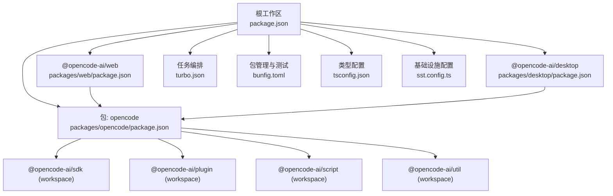
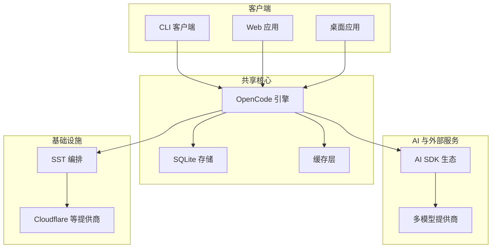
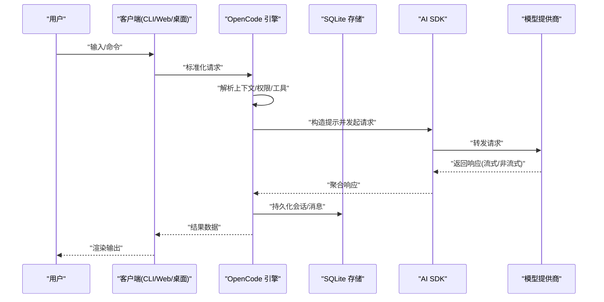
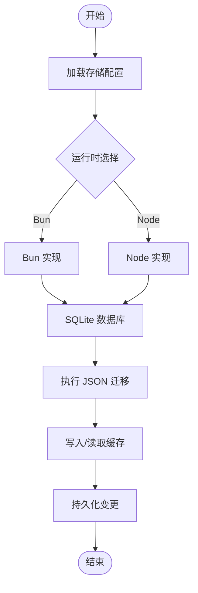
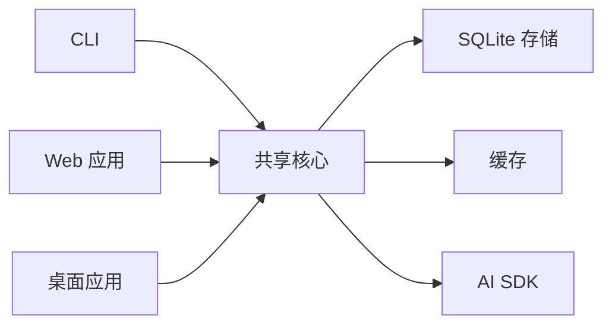
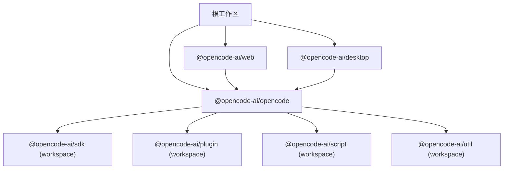

# 架构设计

<cite>
**本文引用的文件**
- [README.md](file://README.md)
- [package.json](file://package.json)
- [turbo.json](file://turbo.json)
- [bunfig.toml](file://bunfig.toml)
- [sst.config.ts](file://sst.config.ts)
- [tsconfig.json](file://tsconfig.json)
- [specs/project.md](file://specs/project.md)
- [packages/opencode/package.json](file://packages/opencode/package.json)
- [packages/web/package.json](file://packages/web/package.json)
- [packages/desktop/package.json](file://packages/desktop/package.json)
</cite>

## 目录
1. [引言](#引言)
2. [项目结构](#项目结构)
3. [核心组件](#核心组件)
4. [架构总览](#架构总览)
5. [详细组件分析](#详细组件分析)
6. [依赖分析](#依赖分析)
7. [性能考量](#性能考量)
8. [故障排查指南](#故障排查指南)
9. [结论](#结论)
10. [附录](#附录)

## 引言
本文件面向 OpenCode 的架构设计与实现，目标是为读者提供一个从高层到细节的系统蓝图：涵盖 monorepo 组织方式、包依赖与构建配置、模块化策略；解释技术栈选择（TypeScript、Bun、AI SDK、Effect 等）及其在系统中的作用；阐述数据流从用户输入到 AI 模型响应的完整链路；说明存储系统（SQLite、JSON 迁移、缓存）的设计；给出多平台部署（CLI、Web、桌面应用）的共享核心设计；并总结可扩展性、性能优化与安全设计原则。

## 项目结构
OpenCode 采用 monorepo 管理，根目录通过工作区与工具链统一管理各子包。根级脚本与工作区配置驱动开发与构建流程；Turbo 作为任务编排与缓存加速器；Bun 作为包管理与运行时；TypeScript 提供类型保障；SST 用于基础设施即代码（IaC）与云资源编排。

- 根级工作区与脚本
  - 工作区定义与 catalog 版本对齐，确保依赖一致性与可追踪性
  - 脚本覆盖开发、类型检查、测试等常见任务
- Monorepo 包分布
  - packages 目录下包含 app、web、desktop、sdk、ui、util 等核心包
  - 各包通过 workspace:* 互相引用，形成清晰的边界与复用
- 构建与缓存
  - Turbo 任务定义与输出缓存，减少重复构建
  - Bun 作为包安装器与运行时，bunfig.toml 控制安装行为
- 类型与工具链
  - tsconfig.json 基于 @tsconfig/bun，统一编译选项
  - SST 配置集中式管理应用与环境

**图表来源**
- [package.json:1-124](file://package.json#L1-L124)
- [turbo.json:1-32](file://turbo.json#L1-L32)
- [bunfig.toml:1-7](file://bunfig.toml#L1-L7)
- [tsconfig.json:1-6](file://tsconfig.json#L1-L6)
- [sst.config.ts:1-24](file://sst.config.ts#L1-L24)
- [packages/opencode/package.json:1-164](file://packages/opencode/package.json#L1-L164)
- [packages/web/package.json:1-45](file://packages/web/package.json#L1-L45)
- [packages/desktop/package.json:1-45](file://packages/desktop/package.json#L1-L45)

**章节来源**
- [package.json:1-124](file://package.json#L1-L124)
- [turbo.json:1-32](file://turbo.json#L1-L32)
- [bunfig.toml:1-7](file://bunfig.toml#L1-L7)
- [tsconfig.json:1-6](file://tsconfig.json#L1-L6)
- [sst.config.ts:1-24](file://sst.config.ts#L1-L24)

## 核心组件
- OpenCode 核心引擎（packages/opencode）
  - 提供 CLI、会话管理、消息与文件操作接口
  - 通过条件导出与多平台适配（bun/node/default）实现跨平台存储访问
  - 依赖 AI SDK 生态与 Effect 平台能力，支撑多模型接入与并发控制
- Web 前端（packages/web）
  - 基于 Astro + SolidJS 的静态站点与前端应用
  - 与后端 API 协同，提供终端友好的交互体验
- 桌面应用（packages/desktop）
  - 基于 Tauri 的原生桌面客户端，复用 app/ui 核心
  - 通过 Tauri 插件体系增强系统能力（剪贴板、窗口状态、更新等）
- SDK 与工具（packages/sdk、packages/util 等）
  - 为上层应用与插件提供统一能力抽象与工具集

**章节来源**
- [packages/opencode/package.json:1-164](file://packages/opencode/package.json#L1-L164)
- [packages/web/package.json:1-45](file://packages/web/package.json#L1-L45)
- [packages/desktop/package.json:1-45](file://packages/desktop/package.json#L1-L45)

## 架构总览
OpenCode 采用“共享核心 + 多客户端”的分层设计：
- 共享核心层：OpenCode 引擎负责会话、消息、文件、权限与 AI 模型交互
- 接口层：CLI、Web、桌面三端通过统一 API 或协议与核心交互
- 存储层：SQLite 数据库存储会话与元数据；JSON 迁移与缓存提升读写效率
- 基础设施层：SST 编排 Cloudflare 等提供商资源，支持生产部署与企业版扩展

**图表来源**
- [README.md:100-142](file://README.md#L100-L142)
- [specs/project.md:1-65](file://specs/project.md#L1-L65)
- [packages/opencode/package.json:70-158](file://packages/opencode/package.json#L70-L158)
- [sst.config.ts:1-24](file://sst.config.ts#L1-L24)

## 详细组件分析

### 数据流架构：从用户输入到 AI 响应
该流程贯穿 CLI/Web/桌面三端，核心步骤如下：
1. 用户输入进入对应客户端
2. 客户端将请求标准化并调用共享核心 API
3. 核心引擎解析上下文（项目、会话、权限），准备提示与工具
4. 通过 AI SDK 选择模型与供应商，发送请求
5. 流式或非流式接收响应，回传给客户端渲染
6. 结果持久化至 SQLite，并按需写入缓存

**图表来源**
- [specs/project.md:5-64](file://specs/project.md#L5-L64)
- [packages/opencode/package.json:70-158](file://packages/opencode/package.json#L70-L158)

**章节来源**
- [specs/project.md:1-65](file://specs/project.md#L1-L65)
- [packages/opencode/package.json:70-158](file://packages/opencode/package.json#L70-L158)

### 存储系统设计：SQLite、JSON 迁移与缓存
- 存储抽象
  - 通过条件导出在不同运行时加载不同实现，保证跨平台一致性
- 数据模型要点
  - 项目、会话、消息、文件状态、权限等实体围绕会话生命周期组织
- JSON 迁移机制
  - 利用 JSON 结构化内容与迁移脚本，确保历史数据兼容与演进
- 缓存策略
  - 对热点查询与频繁读取的数据进行缓存，降低数据库压力
  - 结合文件系统监听与增量更新，保持缓存一致性

**图表来源**
- [packages/opencode/package.json:28-37](file://packages/opencode/package.json#L28-L37)

**章节来源**
- [packages/opencode/package.json:28-37](file://packages/opencode/package.json#L28-L37)

### 多平台部署架构：CLI、Web、桌面共享核心
- CLI
  - 通过 opencode 可执行文件启动，直接调用核心引擎
- Web
  - 前端应用通过 API 与核心交互，支持本地与远程后端
- 桌面
  - Tauri 客户端封装核心能力，使用系统插件增强用户体验

**图表来源**
- [packages/opencode/package.json:24-26](file://packages/opencode/package.json#L24-L26)
- [packages/web/package.json:14-37](file://packages/web/package.json#L14-L37)
- [packages/desktop/package.json:15-35](file://packages/desktop/package.json#L15-L35)

**章节来源**
- [packages/opencode/package.json:24-26](file://packages/opencode/package.json#L24-L26)
- [packages/web/package.json:14-37](file://packages/web/package.json#L14-L37)
- [packages/desktop/package.json:15-35](file://packages/desktop/package.json#L15-L35)

### 技术栈选择与作用
- TypeScript
  - 统一类型系统，结合 @tsconfig/bun 提升开发体验与可靠性
- Bun
  - 包管理与运行时，bunfig.toml 控制安装精确性与测试隔离
- AI SDK
  - 覆盖多家模型提供商，统一抽象与流式响应处理
- Effect
  - 并发与错误处理抽象，提升系统稳定性与可观测性
- Turbo
  - 任务编排与缓存，加速构建与测试
- SST
  - 基础设施即代码，集中管理提供商与环境

**章节来源**
- [tsconfig.json:1-6](file://tsconfig.json#L1-L6)
- [bunfig.toml:1-7](file://bunfig.toml#L1-L7)
- [packages/opencode/package.json:70-158](file://packages/opencode/package.json#L70-L158)
- [turbo.json:1-32](file://turbo.json#L1-L32)
- [sst.config.ts:1-24](file://sst.config.ts#L1-L24)

## 依赖分析
- 工作区与版本管理
  - 根级 package.json 使用 catalog 对齐依赖版本，避免漂移
  - 通过 overrides 与 patchedDependencies 精准修复与锁定
- 包间依赖
  - opencode 依赖 @opencode-ai/sdk、plugin、script、util 等 workspace 包
  - web 与 desktop 分别依赖 opencode 与其他 UI/平台库
- 外部依赖
  - AI SDK 生态覆盖主流模型提供商
  - Effect 平台与 Hono 等库提供并发与网络能力

**图表来源**
- [package.json:20-75](file://package.json#L20-L75)
- [packages/opencode/package.json:103-107](file://packages/opencode/package.json#L103-L107)
- [packages/web/package.json:38-43](file://packages/web/package.json#L38-L43)
- [packages/desktop/package.json:16-35](file://packages/desktop/package.json#L16-L35)

**章节来源**
- [package.json:20-75](file://package.json#L20-L75)
- [packages/opencode/package.json:103-107](file://packages/opencode/package.json#L103-L107)
- [packages/web/package.json:38-43](file://packages/web/package.json#L38-L43)
- [packages/desktop/package.json:16-35](file://packages/desktop/package.json#L16-L35)

## 性能考量
- 构建与缓存
  - 使用 Turbo 的任务依赖与输出缓存，减少重复构建
  - Bun 的快速包安装与运行时，缩短冷启动时间
- 存储与缓存
  - SQLite 适合嵌入式场景；对高频读取引入缓存，降低磁盘 IO
  - JSON 迁移避免全量重建，提升升级效率
- 并发与响应
  - 借助 Effect 的并发模型与 AI SDK 的流式响应，提升吞吐与延迟表现
- 前端与桌面
  - Web 采用静态站点生成与按需渲染；桌面通过 Tauri 减少虚拟化开销

**章节来源**
- [turbo.json:5-30](file://turbo.json#L5-L30)
- [bunfig.toml:1-7](file://bunfig.toml#L1-L7)
- [packages/opencode/package.json:70-158](file://packages/opencode/package.json#L70-L158)

## 故障排查指南
- 开发与调试
  - 使用根级脚本进入各子包开发环境，确认工作区链接是否正确
  - 通过类型检查与单元测试定位问题范围
- 存储与迁移
  - 若出现数据不一致，优先检查 JSON 迁移脚本与缓存一致性
- 并发与错误
  - 利用 Effect 的错误处理与日志记录，定位并发异常
- 基础设施
  - 通过 SST 配置核对提供商密钥与资源状态

**章节来源**
- [package.json:8-18](file://package.json#L8-L18)
- [packages/opencode/package.json:10-22](file://packages/opencode/package.json#L10-L22)
- [packages/opencode/package.json:70-158](file://packages/opencode/package.json#L70-L158)
- [sst.config.ts:18-22](file://sst.config.ts#L18-L22)

## 结论
OpenCode 以 monorepo 为核心组织形式，通过共享引擎与多客户端形态实现跨平台一致体验。技术栈选择兼顾生态成熟度与工程效率，数据流与存储设计强调可扩展与高性能。结合 Turbo、Bun、AI SDK、Effect 与 SST，系统在开发效率、运行性能与运维可控性之间取得平衡。

## 附录
- API 规划参考：项目内 specs/project.md 提供了端到端的 API 设计思路，便于理解数据流与边界
- 安装与使用：README.md 提供多平台安装与使用指引，便于快速验证部署

**章节来源**
- [specs/project.md:1-65](file://specs/project.md#L1-L65)
- [README.md:46-142](file://README.md#L46-L142)