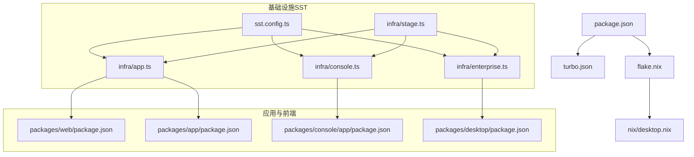
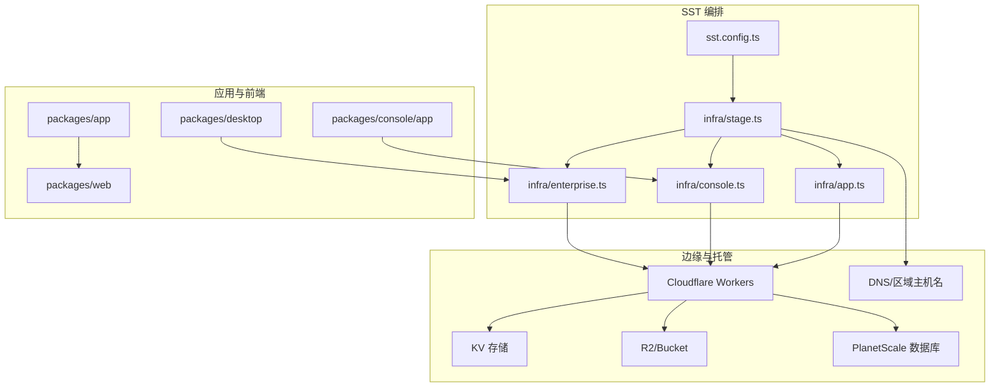
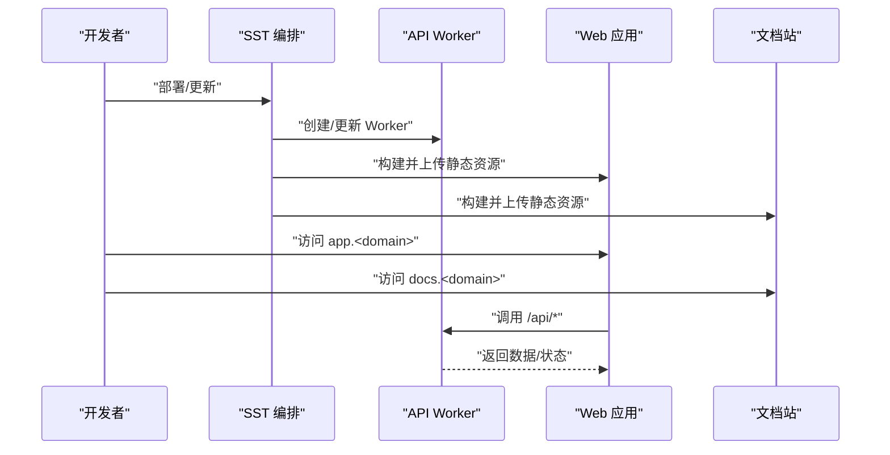
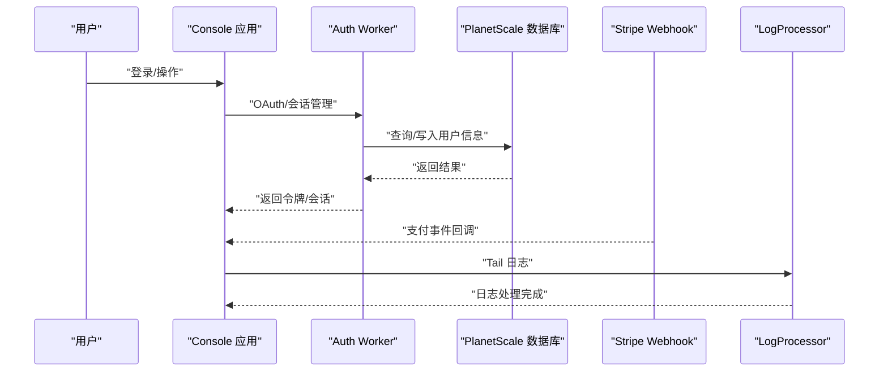
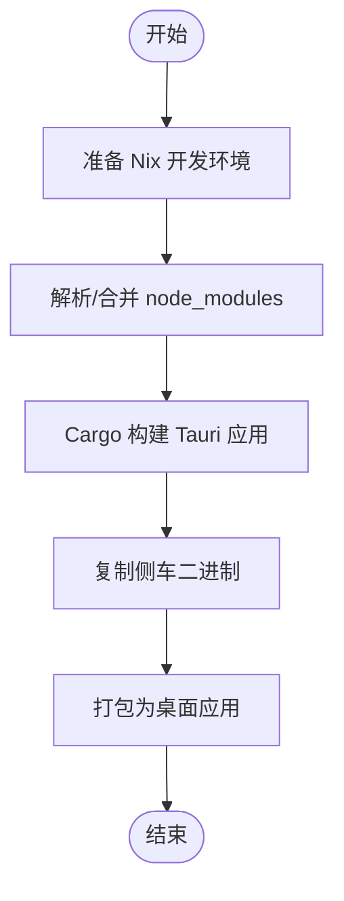
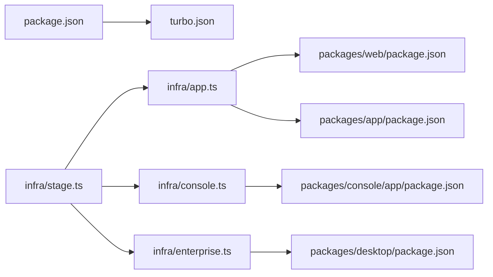
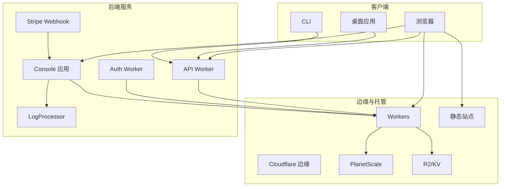

# 部署架构

<cite>
**本文引用的文件**
- [sst.config.ts](file://sst.config.ts)
- [infra/app.ts](file://infra/app.ts)
- [infra/console.ts](file://infra/console.ts)
- [infra/enterprise.ts](file://infra/enterprise.ts)
- [infra/stage.ts](file://infra/stage.ts)
- [packages/web/package.json](file://packages/web/package.json)
- [packages/app/package.json](file://packages/app/package.json)
- [packages/console/app/package.json](file://packages/console/app/package.json)
- [packages/desktop/package.json](file://packages/desktop/package.json)
- [package.json](file://package.json)
- [turbo.json](file://turbo.json)
- [flake.nix](file://flake.nix)
- [nix/desktop.nix](file://nix/desktop.nix)
</cite>

## 目录
1. [简介](#简介)
2. [项目结构](#项目结构)
3. [核心组件](#核心组件)
4. [架构总览](#架构总览)
5. [详细组件分析](#详细组件分析)
6. [依赖关系分析](#依赖关系分析)
7. [性能考量](#性能考量)
8. [故障排查指南](#故障排查指南)
9. [结论](#结论)
10. [附录](#附录)

## 简介
本文件系统性阐述 OpenCode 的多平台部署架构与实现，覆盖 CLI、Web、桌面应用三类入口的共享核心如何通过统一的基础设施与工具链支撑不同部署方式；详解云基础设施（Cloudflare Workers、SST 框架）的配置与联动；给出容器化与 Nix 打包策略；梳理 CI/CD 流程与测试策略；并提供生产环境最佳实践与监控建议。

## 项目结构
OpenCode 采用 Monorepo 架构，以工作区组织多产品与多平台模块：
- 应用层：packages/app（Web SPA）、packages/console/app（控制台）、packages/web（文档站）
- 基础设施：infra/*.ts（SST 定义）、sst.config.ts（SST 入口）
- 开发与打包：package.json（根脚本与工作区）、turbo.json（任务编排）、flake.nix/nix/desktop.nix（Nix 打包）
- 桌面端：packages/desktop（Tauri 应用）

图表来源
- [sst.config.ts:1-24](file://sst.config.ts#L1-L24)
- [infra/app.ts:1-69](file://infra/app.ts#L1-L69)
- [infra/console.ts:1-260](file://infra/console.ts#L1-L260)
- [infra/enterprise.ts:1-18](file://infra/enterprise.ts#L1-L18)
- [infra/stage.ts:1-20](file://infra/stage.ts#L1-L20)
- [packages/web/package.json:1-45](file://packages/web/package.json#L1-L45)
- [packages/app/package.json:1-78](file://packages/app/package.json#L1-L78)
- [packages/console/app/package.json:1-47](file://packages/console/app/package.json#L1-L47)
- [packages/desktop/package.json:1-45](file://packages/desktop/package.json#L1-L45)
- [package.json:1-124](file://package.json#L1-L124)
- [turbo.json:1-32](file://turbo.json#L1-L32)
- [flake.nix:1-77](file://flake.nix#L1-L77)
- [nix/desktop.nix:1-101](file://nix/desktop.nix#L1-L101)

章节来源
- [package.json:1-124](file://package.json#L1-L124)
- [turbo.json:1-32](file://turbo.json#L1-L32)
- [sst.config.ts:1-24](file://sst.config.ts#L1-L24)
- [infra/app.ts:1-69](file://infra/app.ts#L1-L69)
- [infra/console.ts:1-260](file://infra/console.ts#L1-L260)
- [infra/enterprise.ts:1-18](file://infra/enterprise.ts#L1-L18)
- [infra/stage.ts:1-20](file://infra/stage.ts#L1-L20)
- [packages/web/package.json:1-45](file://packages/web/package.json#L1-L45)
- [packages/app/package.json:1-78](file://packages/app/package.json#L1-L78)
- [packages/console/app/package.json:1-47](file://packages/console/app/package.json#L1-L47)
- [packages/desktop/package.json:1-45](file://packages/desktop/package.json#L1-L45)
- [flake.nix:1-77](file://flake.nix#L1-L77)
- [nix/desktop.nix:1-101](file://nix/desktop.nix#L1-L101)

## 核心组件
- SST 平台与应用编排
  - sst.config.ts 定义应用名、清理策略、保护级别、Home 提供商（Cloudflare），并按阶段导入基础设施定义。
  - infra/stage.ts 统一域名与区域映射，为各服务提供可复用的域与区域配置。
- Cloudflare Workers 与静态站点
  - infra/app.ts 部署 API Worker、文档站 Astro、Web 应用静态站点，并绑定 KV/Bucket/密钥等资源。
  - infra/console.ts 部署 Console 控制台（SolidStart）、Auth Worker、数据库连接、Stripe Webhook、日志处理 Worker 等。
  - infra/enterprise.ts 部署 Teams（企业版）站点，使用 R2 存储适配器。
- 多平台应用
  - packages/web：文档站，基于 Astro 与 Cloudflare 平台集成。
  - packages/app：Web 应用（SPA/Vite），作为 Cloudflare Static Site。
  - packages/console/app：控制台应用（SolidStart），与 Auth/数据库/支付等后端集成。
  - packages/desktop：桌面应用（Tauri），通过 Nix 打包并生成 Linux/AppImage 等产物。
- 工具链与任务编排
  - package.json：根级脚本与工作区声明，统一开发与构建入口。
  - turbo.json：类型检查、构建、测试任务的依赖与输出管理，支持 CI 聚合。
  - flake.nix/nix/desktop.nix：Nix 包装 Rust/Tauri 依赖，生成桌面端二进制与安装包。

章节来源
- [sst.config.ts:1-24](file://sst.config.ts#L1-L24)
- [infra/stage.ts:1-20](file://infra/stage.ts#L1-L20)
- [infra/app.ts:1-69](file://infra/app.ts#L1-L69)
- [infra/console.ts:1-260](file://infra/console.ts#L1-L260)
- [infra/enterprise.ts:1-18](file://infra/enterprise.ts#L1-L18)
- [packages/web/package.json:1-45](file://packages/web/package.json#L1-L45)
- [packages/app/package.json:1-78](file://packages/app/package.json#L1-L78)
- [packages/console/app/package.json:1-47](file://packages/console/app/package.json#L1-L47)
- [packages/desktop/package.json:1-45](file://packages/desktop/package.json#L1-L45)
- [package.json:1-124](file://package.json#L1-L124)
- [turbo.json:1-32](file://turbo.json#L1-L32)
- [flake.nix:1-77](file://flake.nix#L1-L77)
- [nix/desktop.nix:1-101](file://nix/desktop.nix#L1-L101)

## 架构总览
OpenCode 的部署架构围绕 Cloudflare Workers 与 SST 进行统一编排，形成“无服务器 + 边缘计算”的弹性后端与静态前端组合。控制台与 API 通过 Workers 提供服务，数据库由 PlanetScale 托管并通过 SST 注入连接信息；文档站与 Web 应用以静态站点形式部署在 Cloudflare 上；桌面应用通过 Nix 与 Tauri 打包，面向多平台分发。

图表来源
- [sst.config.ts:1-24](file://sst.config.ts#L1-L24)
- [infra/stage.ts:1-20](file://infra/stage.ts#L1-L20)
- [infra/app.ts:1-69](file://infra/app.ts#L1-L69)
- [infra/console.ts:1-260](file://infra/console.ts#L1-L260)
- [infra/enterprise.ts:1-18](file://infra/enterprise.ts#L1-L18)
- [packages/web/package.json:1-45](file://packages/web/package.json#L1-L45)
- [packages/app/package.json:1-78](file://packages/app/package.json#L1-L78)
- [packages/console/app/package.json:1-47](file://packages/console/app/package.json#L1-L47)
- [packages/desktop/package.json:1-45](file://packages/desktop/package.json#L1-L45)

## 详细组件分析

### Cloudflare Workers 与静态站点（API、文档站、Web 应用）
- API Worker
  - 通过 sst.cloudflare.Worker 部署，绑定存储、第三方密钥与 Durable Objects（迁移标签按阶段设置）。
  - 通过 link 将 KV/Bucket/密钥注入运行时，暴露 URL 供前端调用。
- 文档站（Astro）
  - 使用 sst.cloudflare.x.Astro 部署，注入 SST 阶段与 API 地址等环境变量。
- Web 应用（Static Site）
  - 使用 sst.cloudflare.StaticSite 部署，构建命令为“bun turbo build”，输出目录为 dist。

图表来源
- [infra/app.ts:13-69](file://infra/app.ts#L13-L69)
- [packages/web/package.json:1-45](file://packages/web/package.json#L1-L45)
- [packages/app/package.json:1-78](file://packages/app/package.json#L1-L78)

章节来源
- [infra/app.ts:1-69](file://infra/app.ts#L1-L69)
- [packages/web/package.json:1-45](file://packages/web/package.json#L1-L45)
- [packages/app/package.json:1-78](file://packages/app/package.json#L1-L78)

### 控制台与认证（Console、Auth、数据库、支付）
- 数据库
  - 通过 PlanetScale 获取或创建分支，生成密码凭据，导出可链接属性（host、db、username、password、port）。
- 认证（Auth Worker）
  - 部署于 auth.<domain>，连接数据库与 KV，注入 GitHub/Google 客户端密钥。
- 支付（Stripe）
  - 创建 Webhook 端点，注册多种事件；定义产品与价格，导出链接属性供前端使用。
- 日志处理
  - LogProcessor Worker 接收 Tail 事件并转发至 Honeycomb（密钥注入）。
- 控制台（Console）
  - SolidStart 应用，链接数据库、Auth URL、Stripe 密钥、邮件/Salesforce/存储等密钥，设置环境变量（如 Stripe 可用密钥）。

图表来源
- [infra/console.ts:56-259](file://infra/console.ts#L56-L259)

章节来源
- [infra/console.ts:1-260](file://infra/console.ts#L1-L260)

### 企业版（Teams）与存储适配
- Teams 站点部署于 shortDomain，使用 R2 作为存储适配器，通过环境变量注入账户 ID、密钥与 Bucket 名称。

章节来源
- [infra/enterprise.ts:1-18](file://infra/enterprise.ts#L1-L18)

### 桌面应用（Tauri）与 Nix 打包
- 依赖与脚本
  - packages/desktop/package.json 定义 Tauri 开发/构建脚本，依赖 @tauri-apps/* 插件生态。
- Nix 打包
  - flake.nix 定义多平台开发 Shell 与包集合；nix/desktop.nix 以 Rust 平台构建 Tauri 应用，复制 node_modules 与侧车二进制，生成 Linux/AppImage 等产物。

图表来源
- [nix/desktop.nix:26-101](file://nix/desktop.nix#L26-L101)
- [packages/desktop/package.json:1-45](file://packages/desktop/package.json#L1-L45)

章节来源
- [packages/desktop/package.json:1-45](file://packages/desktop/package.json#L1-L45)
- [flake.nix:1-77](file://flake.nix#L1-L77)
- [nix/desktop.nix:1-101](file://nix/desktop.nix#L1-L101)

### CLI、Web、桌面应用的共享核心
- 共享 SDK/UI/工具库
  - 各应用均依赖 @opencode-ai/sdk、@opencode-ai/ui、@opencode-ai/util 等工作区包，确保行为一致与能力复用。
- 配置与环境
  - Web/Console 通过 Vite/Astro/SolidStart 注入环境变量（如 API URL、Stripe 可用密钥），实现跨入口一致的后端对接。
- 测试与质量
  - 单元测试与端到端测试脚本在各自包中定义，CI 中通过 turbo 聚合执行。

章节来源
- [packages/app/package.json:41-78](file://packages/app/package.json#L41-L78)
- [packages/console/app/package.json:13-47](file://packages/console/app/package.json#L13-L47)
- [packages/web/package.json:14-45](file://packages/web/package.json#L14-L45)
- [package.json:20-75](file://package.json#L20-L75)

## 依赖关系分析
- 工作区与任务编排
  - package.json 声明工作区与 catalog 依赖，turbo.json 定义任务依赖与输出，确保构建顺序与缓存命中。
- 基础设施耦合
  - infra/app.ts 与 infra/console.ts 均依赖 infra/stage.ts 的域名与区域配置；Console 依赖 PlanetScale 与 Stripe 资源。
- 应用耦合
  - Console 应用链接 Auth/数据库/Stripe 等后端；Web/Console 通过环境变量对接 API；桌面应用与 Console 共享部分工具库。

图表来源
- [package.json:1-124](file://package.json#L1-L124)
- [turbo.json:1-32](file://turbo.json#L1-L32)
- [infra/stage.ts:1-20](file://infra/stage.ts#L1-L20)
- [infra/app.ts:1-69](file://infra/app.ts#L1-L69)
- [infra/console.ts:1-260](file://infra/console.ts#L1-L260)
- [infra/enterprise.ts:1-18](file://infra/enterprise.ts#L1-L18)
- [packages/web/package.json:1-45](file://packages/web/package.json#L1-L45)
- [packages/app/package.json:1-78](file://packages/app/package.json#L1-L78)
- [packages/console/app/package.json:1-47](file://packages/console/app/package.json#L1-L47)
- [packages/desktop/package.json:1-45](file://packages/desktop/package.json#L1-L45)

章节来源
- [package.json:1-124](file://package.json#L1-L124)
- [turbo.json:1-32](file://turbo.json#L1-L32)
- [infra/stage.ts:1-20](file://infra/stage.ts#L1-L20)
- [infra/app.ts:1-69](file://infra/app.ts#L1-L69)
- [infra/console.ts:1-260](file://infra/console.ts#L1-L260)
- [infra/enterprise.ts:1-18](file://infra/enterprise.ts#L1-L18)
- [packages/web/package.json:1-45](file://packages/web/package.json#L1-L45)
- [packages/app/package.json:1-78](file://packages/app/package.json#L1-L78)
- [packages/console/app/package.json:1-47](file://packages/console/app/package.json#L1-L47)
- [packages/desktop/package.json:1-45](file://packages/desktop/package.json#L1-L45)

## 性能考量
- 边缘计算与就近访问
  - Cloudflare Workers 与静态站点部署在边缘节点，减少网络延迟；Regional Hostname 与区域键优化路由。
- 数据库与缓存
  - PlanetScale 提供托管 MySQL，结合 KV 与 R2 实现低延迟读写与对象存储。
- 构建与缓存
  - Turbo 任务编排与输出缓存提升 CI/本地构建效率；Nix 保证依赖一致性与可重现构建。
- 日志与可观测性
  - LogProcessor 通过 Tail 消费日志并上报 Honeycomb，便于问题定位与性能分析。

章节来源
- [infra/stage.ts:9-13](file://infra/stage.ts#L9-L13)
- [infra/console.ts:209-212](file://infra/console.ts#L209-L212)
- [turbo.json:1-32](file://turbo.json#L1-L32)
- [flake.nix:21-31](file://flake.nix#L21-L31)

## 故障排查指南
- 部署失败
  - 检查 sst.config.ts 的提供商密钥（Stripe/PlanetScale）是否正确注入。
  - 确认 infra/stage.ts 的域名与区域配置是否匹配 Cloudflare Zone。
- Worker 异常
  - 查看 Workers 日志推送与 Tail 消费情况；确认 Durable Objects 迁移标签与绑定是否正确。
- 数据库连接
  - 核对 PlanetScale 分支与密码凭据；确认 SST Linkable 属性是否正确注入。
- 控制台/支付
  - 核对 Stripe Webhook 端点与事件订阅；确认 Console 环境变量（如可用密钥）是否注入。
- 桌面应用
  - 使用 Nix Shell 确认依赖；检查 nix/desktop.nix 的构建标志与侧车二进制复制步骤。

章节来源
- [sst.config.ts:10-16](file://sst.config.ts#L10-L16)
- [infra/stage.ts:1-20](file://infra/stage.ts#L1-L20)
- [infra/app.ts:30-48](file://infra/app.ts#L30-L48)
- [infra/console.ts:71-101](file://infra/console.ts#L71-L101)
- [nix/desktop.nix:78-91](file://nix/desktop.nix#L78-L91)

## 结论
OpenCode 通过 SST 与 Cloudflare 平台实现了高可用、低延迟的多入口部署：CLI 与桌面端通过 Nix 与 Tauri 保持一致的本地体验，Web 与控制台通过 Workers 与静态站点实现弹性扩展。借助 Turbo 与工作区管理，构建与测试流程高度自动化；结合 PlanetScale、KV/R2 与 Stripe/Webhook，形成从数据到支付的完整闭环。生产环境建议强化密钥轮换、Tail 日志与 Honeycomb 监控，持续优化构建缓存与依赖锁定。

## 附录
- 部署拓扑图（概念示意）

- 环境配置清单（示例）
  - 域名与区域：由 infra/stage.ts 动态生成，生产使用主域名，开发使用子域。
  - 数据库：PlanetScale 集群与分支，凭据通过 SST 注入。
  - 支付：Stripe Webhook 端点与产品/价格定义，密钥通过 Secret 管理。
  - 存储：R2 适配器用于企业版 Teams 站点。
  - 日志：Tail 消费至 LogProcessor，再上报 Honeycomb。

章节来源
- [infra/stage.ts:1-20](file://infra/stage.ts#L1-L20)
- [infra/console.ts:8-41](file://infra/console.ts#L8-L41)
- [infra/console.ts:71-151](file://infra/console.ts#L71-L151)
- [infra/enterprise.ts:4-17](file://infra/enterprise.ts#L4-L17)
- [infra/console.ts:209-212](file://infra/console.ts#L209-L212)