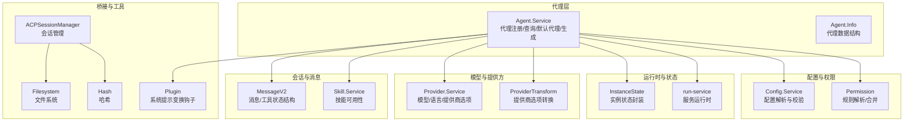
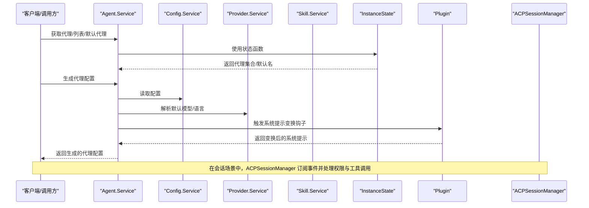
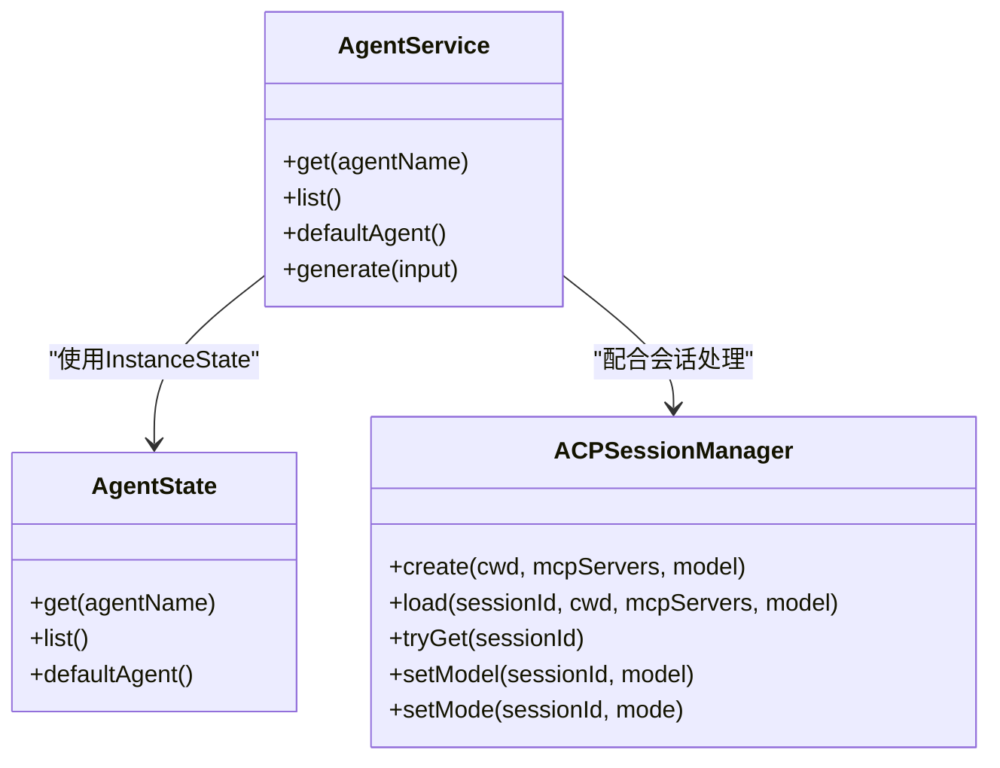
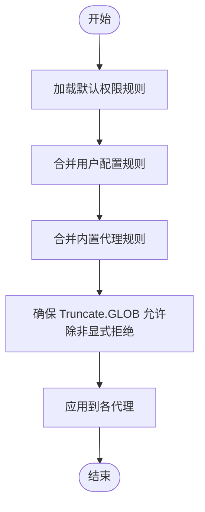
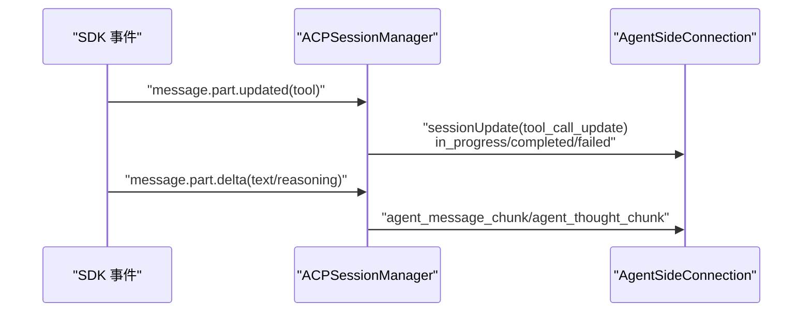
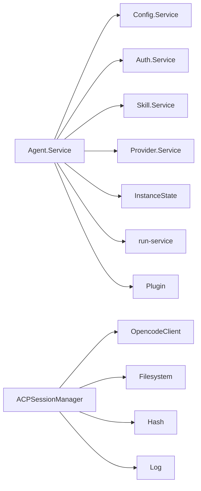

# 代理架构设计

<cite>
**本文引用的文件**
- [packages/opencode/src/agent/agent.ts](file://packages/opencode/src/agent/agent.ts)
- [packages/opencode/src/acp/agent.ts](file://packages/opencode/src/acp/agent.ts)
- [packages/opencode/src/config/config.ts](file://packages/opencode/src/config/config.ts)
- [packages/opencode/src/session/message-v2.ts](file://packages/opencode/src/session/message-v2.ts)
- [packages/opencode/src/skill/index.ts](file://packages/opencode/src/skill/index.ts)
- [packages/opencode/src/util/log.ts](file://packages/opencode/src/util/log.ts)
- [packages/opencode/src/util/filesystem.ts](file://packages/opencode/src/util/filesystem.ts)
- [packages/opencode/src/util/hash.ts](file://packages/opencode/src/util/hash.ts)
- [packages/opencode/src/provider/provider.ts](file://packages/opencode/src/provider/provider.ts)
- [packages/opencode/src/provider/transform.ts](file://packages/opencode/src/provider/transform.ts)
- [packages/opencode/src/project/instance.ts](file://packages/opencode/src/project/instance.ts)
- [packages/opencode/src/tool/truncate.ts](file://packages/opencode/src/tool/truncate.ts)
- [packages/opencode/src/auth.ts](file://packages/opencode/src/auth.ts)
- [packages/opencode/src/effect/instance-state.ts](file://packages/opencode/src/effect/instance-state.ts)
- [packages/opencode/src/effect/run-service.ts](file://packages/opencode/src/effect/run-service.ts)
- [packages/opencode/src/plugin/index.ts](file://packages/opencode/src/plugin/index.ts)
- [packages/opencode/src/session/system.ts](file://packages/opencode/src/session/system.ts)
- [packages/opencode/src/tool/truncate.ts](file://packages/opencode/src/tool/truncate.ts)
</cite>

## 目录
1. [引言](#引言)
2. [项目结构](#项目结构)
3. [核心组件](#核心组件)
4. [架构总览](#架构总览)
5. [详细组件分析](#详细组件分析)
6. [依赖关系分析](#依赖关系分析)
7. [性能考量](#性能考量)
8. [故障排查指南](#故障排查指南)
9. [结论](#结论)
10. [附录：最佳实践与示例路径](#附录最佳实践与示例路径)

## 引言
本文件面向 OpenCode 代理架构设计，聚焦 Agent.Service 的核心实现机制，涵盖代理生命周期管理、消息处理流程、状态维护策略；详解代理信息的数据结构定义（Info 类型）及其字段语义；阐述权限控制系统（Permission 模块）的工作原理、权限规则合并机制与文件访问控制策略；说明代理配置项（如 temperature、topP、mode、native 等）的作用与影响；并提供代理开发的最佳实践与可直接定位到源码的示例路径。

## 项目结构
OpenCode 的代理子系统主要由以下模块构成：
- 代理服务与配置：Agent.Service 负责代理的注册、检索、默认代理选择与动态生成；配置通过 Config 模块解析与校验。
- 权限控制：Permission 模块负责规则解析、合并与执行；ACP 代理桥接器在会话事件中进行权限请求与工具调用反馈。
- 提供商与模型：Provider 模块提供模型解析、语言映射与提供商特定选项转换。
- 会话与消息：Message-V2 定义了代理消息与工具调用的状态结构；Skill 模块提供可用技能集合。
- 运行时与状态：InstanceState 提供服务态封装；Plugin 提供实验性系统提示变换钩子。

**图表来源**
- [packages/opencode/src/agent/agent.ts:72-394](file://packages/opencode/src/agent/agent.ts#L72-L394)
- [packages/opencode/src/acp/agent.ts:126-132](file://packages/opencode/src/acp/agent.ts#L126-L132)
- [packages/opencode/src/config/config.ts:520-607](file://packages/opencode/src/config/config.ts#L520-L607)
- [packages/opencode/src/provider/provider.ts](file://packages/opencode/src/provider/provider.ts)
- [packages/opencode/src/provider/transform.ts](file://packages/opencode/src/provider/transform.ts)
- [packages/opencode/src/session/message-v2.ts:192-379](file://packages/opencode/src/session/message-v2.ts#L192-L379)
- [packages/opencode/src/skill/index.ts:274-278](file://packages/opencode/src/skill/index.ts#L274-L278)
- [packages/opencode/src/util/filesystem.ts](file://packages/opencode/src/util/filesystem.ts)
- [packages/opencode/src/util/hash.ts](file://packages/opencode/src/util/hash.ts)
- [packages/opencode/src/effect/instance-state.ts](file://packages/opencode/src/effect/instance-state.ts)
- [packages/opencode/src/effect/run-service.ts](file://packages/opencode/src/effect/run-service.ts)
- [packages/opencode/src/plugin/index.ts](file://packages/opencode/src/plugin/index.ts)

**章节来源**
- [packages/opencode/src/agent/agent.ts:26-70](file://packages/opencode/src/agent/agent.ts#L26-L70)
- [packages/opencode/src/config/config.ts:520-607](file://packages/opencode/src/config/config.ts#L520-L607)

## 核心组件
本节聚焦 Agent.Service 的核心职责与数据结构。

- 代理数据结构（Agent.Info）
  - 字段概览：名称、描述、模式（primary/subagent/all）、是否原生、是否隐藏、采样参数（temperature/topP）、颜色、权限规则、模型（providerID/modelID）、变体、系统提示、通用选项、最大步数等。
  - 校验与元数据：使用 Zod 定义并标注 ref，确保配置一致性与类型安全。
  - 参考路径：[packages/opencode/src/agent/agent.ts:27-52](file://packages/opencode/src/agent/agent.ts#L27-L52)

- 代理接口（Interface）
  - 方法：获取指定代理、列出代理、选择默认代理、生成代理配置。
  - 参考路径：[packages/opencode/src/agent/agent.ts:54-66](file://packages/opencode/src/agent/agent.ts#L54-L66)

- 代理服务（Service）
  - 基于 ServiceMap.Service 包装，提供统一的服务标识与依赖注入能力。
  - 参考路径：[packages/opencode/src/agent/agent.ts:70](file://packages/opencode/src/agent/agent.ts#L70)

- 代理层（Layer）
  - 依赖注入：Config、Auth、Skill、Provider。
  - 初始化状态：构建默认代理集（build/plan/general/explore/compaction/title/summary），并融合用户配置与权限规则。
  - 默认权限策略：基于通配符与白名单目录、敏感文件（如 .env）的访问策略、外部目录访问的 ask/allow/deny 控制。
  - 用户覆盖：支持通过配置覆盖模型、变体、提示、描述、采样参数、模式、颜色、隐藏、名称、最大步数、选项与权限。
  - 参考路径：[packages/opencode/src/agent/agent.ts:72-394](file://packages/opencode/src/agent/agent.ts#L72-L394)

- 默认代理选择（defaultAgent）
  - 规则：若配置了默认代理，必须存在且非 subagent、非 hidden；否则选择第一个可见 primary 代理。
  - 参考路径：[packages/opencode/src/agent/agent.ts:297-309](file://packages/opencode/src/agent/agent.ts#L297-L309)

- 代理生成（generate）
  - 输入：描述与可选模型。
  - 流程：解析系统提示、触发插件变换钩子、调用模型生成 JSON Schema 的代理配置。
  - 参考路径：[packages/opencode/src/agent/agent.ts:329-391](file://packages/opencode/src/agent/agent.ts#L329-L391)

**章节来源**
- [packages/opencode/src/agent/agent.ts:27-52](file://packages/opencode/src/agent/agent.ts#L27-L52)
- [packages/opencode/src/agent/agent.ts:54-66](file://packages/opencode/src/agent/agent.ts#L54-L66)
- [packages/opencode/src/agent/agent.ts:70](file://packages/opencode/src/agent/agent.ts#L70)
- [packages/opencode/src/agent/agent.ts:72-394](file://packages/opencode/src/agent/agent.ts#L72-L394)
- [packages/opencode/src/agent/agent.ts:297-309](file://packages/opencode/src/agent/agent.ts#L297-L309)
- [packages/opencode/src/agent/agent.ts:329-391](file://packages/opencode/src/agent/agent.ts#L329-L391)

## 架构总览
下图展示了代理服务从配置加载、权限合并、到消息处理与会话桥接的整体流程。

**图表来源**
- [packages/opencode/src/agent/agent.ts:319-391](file://packages/opencode/src/agent/agent.ts#L319-L391)
- [packages/opencode/src/config/config.ts:520-607](file://packages/opencode/src/config/config.ts#L520-L607)
- [packages/opencode/src/provider/provider.ts](file://packages/opencode/src/provider/provider.ts)
- [packages/opencode/src/plugin/index.ts](file://packages/opencode/src/plugin/index.ts)
- [packages/opencode/src/acp/agent.ts:126-132](file://packages/opencode/src/acp/agent.ts#L126-L132)

## 详细组件分析

### 组件一：代理服务（Agent.Service）
- 生命周期管理
  - 通过 InstanceState.make 创建有状态的 Agent.state，内部在上下文初始化时一次性构建代理集合与默认代理。
  - 通过 Effect.fnUntraced 包裹 get/list/defaultAgent，保证幂等与可追踪性。
  - 参考路径：[packages/opencode/src/agent/agent.ts:80-317](file://packages/opencode/src/agent/agent.ts#L80-L317)

- 消息处理流程（结合 ACP）
  - 事件订阅：ACPSessionManager 订阅全局事件流，按事件类型分派处理。
  - 权限请求：当需要工具调用或文件编辑时，向 ACP 请求权限，并根据用户选择回复（once/always/reject）。
  - 工具调用反馈：实时上报工具调用状态（pending/running/completed/error），并在编辑类工具完成后发送 diff。
  - 参考路径：[packages/opencode/src/acp/agent.ts:158-533](file://packages/opencode/src/acp/agent.ts#L158-L533)

- 状态维护策略
  - 会话状态：ACPSessionManager 维护每个会话的当前模型与模式。
  - 事件队列：使用 Map 保存每个会话的权限请求队列，串行化处理，避免并发冲突。
  - 参考路径：[packages/opencode/src/acp/agent.ts:134-156](file://packages/opencode/src/acp/agent.ts#L134-L156)

**图表来源**
- [packages/opencode/src/agent/agent.ts:319-391](file://packages/opencode/src/agent/agent.ts#L319-L391)
- [packages/opencode/src/acp/agent.ts:126-132](file://packages/opencode/src/acp/agent.ts#L126-L132)

**章节来源**
- [packages/opencode/src/agent/agent.ts:80-317](file://packages/opencode/src/agent/agent.ts#L80-L317)
- [packages/opencode/src/acp/agent.ts:158-533](file://packages/opencode/src/acp/agent.ts#L158-L533)

### 组件二：权限控制系统（Permission）
- 规则定义与合并
  - 规则结构：以对象形式表达，键为动作（如 read、edit、bash 等），值为 allow/ask/deny 或嵌套的路径匹配规则。
  - 合并策略：默认规则（defaults）与用户规则（user）以及各内置代理规则（如 build/plan/general/explore 等）逐层合并，后合并的规则覆盖前一层的同级键。
  - 参考路径：[packages/opencode/src/agent/agent.ts:86-103](file://packages/opencode/src/agent/agent.ts#L86-L103)，[packages/opencode/src/agent/agent.ts:112-119](file://packages/opencode/src/agent/agent.ts#L112-L119)

- 文件访问控制策略
  - 外部目录访问：默认 deny，但允许 Truncate.GLOB 与技能目录白名单；可通过用户配置显式允许特定路径。
  - 敏感文件：对 .env、*.env.*、*.env.example 等进行 ask/allow 控制。
  - 参考路径：[packages/opencode/src/agent/agent.ts:86-103](file://packages/opencode/src/agent/agent.ts#L86-L103)，[packages/opencode/src/agent/agent.ts:266-279](file://packages/opencode/src/agent/agent.ts#L266-L279)

- ACP 权限请求流程
  - 当 SDK 发出 permission.asked 事件时，ACPSessionManager 将请求转发给 ACP，并根据用户选择回复。
  - 对于 edit 类工具，若用户选择允许，会先写入预览内容，再按 diff 应用变更。
  - 参考路径：[packages/opencode/src/acp/agent.ts:184-265](file://packages/opencode/src/acp/agent.ts#L184-L265)，[packages/opencode/src/acp/agent.ts:233-247](file://packages/opencode/src/acp/agent.ts#L233-L247)

**图表来源**
- [packages/opencode/src/agent/agent.ts:86-103](file://packages/opencode/src/agent/agent.ts#L86-L103)
- [packages/opencode/src/agent/agent.ts:266-279](file://packages/opencode/src/agent/agent.ts#L266-L279)

**章节来源**
- [packages/opencode/src/agent/agent.ts:86-103](file://packages/opencode/src/agent/agent.ts#L86-L103)
- [packages/opencode/src/agent/agent.ts:112-119](file://packages/opencode/src/agent/agent.ts#L112-L119)
- [packages/opencode/src/agent/agent.ts:266-279](file://packages/opencode/src/agent/agent.ts#L266-L279)
- [packages/opencode/src/acp/agent.ts:184-265](file://packages/opencode/src/acp/agent.ts#L184-L265)
- [packages/opencode/src/acp/agent.ts:233-247](file://packages/opencode/src/acp/agent.ts#L233-L247)

### 组件三：消息与工具状态（MessageV2）
- 消息类型
  - 文本、文件、代理、压缩、子任务、重试、步骤开始/结束、工具等部分类型。
  - 工具状态包含 pending/running/completed/error 四种状态及输入/输出/元数据。
- 会话事件映射
  - message.part.updated：根据工具状态更新 ACP 会话视图（in_progress/completed/failed）。
  - message.part.delta：文本/推理片段增量推送至 ACP。
- 参考路径：[packages/opencode/src/session/message-v2.ts:192-379](file://packages/opencode/src/session/message-v2.ts#L192-L379)，[packages/opencode/src/acp/agent.ts:468-531](file://packages/opencode/src/acp/agent.ts#L468-L531)

**图表来源**
- [packages/opencode/src/acp/agent.ts:275-451](file://packages/opencode/src/acp/agent.ts#L275-L451)
- [packages/opencode/src/acp/agent.ts:468-531](file://packages/opencode/src/acp/agent.ts#L468-L531)

**章节来源**
- [packages/opencode/src/session/message-v2.ts:192-379](file://packages/opencode/src/session/message-v2.ts#L192-L379)
- [packages/opencode/src/acp/agent.ts:275-451](file://packages/opencode/src/acp/agent.ts#L275-L451)
- [packages/opencode/src/acp/agent.ts:468-531](file://packages/opencode/src/acp/agent.ts#L468-L531)

### 组件四：配置与模型（Config/Provider）
- 配置项（Agent）
  - 支持 model、variant、temperature、top_p、prompt、tools（已废弃）、disable、description、mode、hidden、options、color、steps/maxSteps（已废弃）、permission 等。
  - transform 将 tools 映射为 permission，并将 maxSteps 归并到 steps。
  - 参考路径：[packages/opencode/src/config/config.ts:520-607](file://packages/opencode/src/config/config.ts#L520-L607)

- 模型解析与提供商选项
  - Provider.defaultModel/getModel/getLanguage 提供模型解析与语言映射。
  - ProviderTransform 提供提供商特定选项转换（如 store=false）。
  - 参考路径：[packages/opencode/src/provider/provider.ts](file://packages/opencode/src/provider/provider.ts)，[packages/opencode/src/provider/transform.ts](file://packages/opencode/src/provider/transform.ts)

**章节来源**
- [packages/opencode/src/config/config.ts:520-607](file://packages/opencode/src/config/config.ts#L520-L607)
- [packages/opencode/src/provider/provider.ts](file://packages/opencode/src/provider/provider.ts)
- [packages/opencode/src/provider/transform.ts](file://packages/opencode/src/provider/transform.ts)

## 依赖关系分析
- 组件耦合
  - Agent.Service 依赖 Config、Auth、Skill、Provider、Plugin、InstanceState、run-service。
  - ACP 代理桥接器依赖 SDK、ACPSessionManager、Filesystem、Hash、Log。
- 外部依赖
  - ai 库用于 generateObject/streamObject；remeda 用于 deep merge 与排序；effect 用于服务与运行时。
- 循环依赖
  - 未发现直接循环依赖；各模块职责清晰，通过服务接口解耦。

**图表来源**
- [packages/opencode/src/agent/agent.ts:72-394](file://packages/opencode/src/agent/agent.ts#L72-L394)
- [packages/opencode/src/acp/agent.ts:126-132](file://packages/opencode/src/acp/agent.ts#L126-L132)
- [packages/opencode/src/util/log.ts](file://packages/opencode/src/util/log.ts)
- [packages/opencode/src/util/filesystem.ts](file://packages/opencode/src/util/filesystem.ts)
- [packages/opencode/src/util/hash.ts](file://packages/opencode/src/util/hash.ts)

**章节来源**
- [packages/opencode/src/agent/agent.ts:72-394](file://packages/opencode/src/agent/agent.ts#L72-L394)
- [packages/opencode/src/acp/agent.ts:126-132](file://packages/opencode/src/acp/agent.ts#L126-L132)

## 性能考量
- 代理集合构建与排序
  - 列表返回前进行排序，优先默认代理，再按名称升序；建议在配置稳定时减少频繁重建。
  - 参考路径：[packages/opencode/src/agent/agent.ts:285-295](file://packages/opencode/src/agent/agent.ts#L285-L295)
- 权限请求串行化
  - 使用 Map 串行化每个会话的权限请求，避免并发冲突带来的重复写入与状态不一致。
  - 参考路径：[packages/opencode/src/acp/agent.ts:191-264](file://packages/opencode/src/acp/agent.ts#L191-L264)
- 工具输出去重
  - Bash 输出通过哈希快照避免重复上报；编辑类工具应用 diff 前先写入预览内容。
  - 参考路径：[packages/opencode/src/acp/agent.ts:284-309](file://packages/opencode/src/acp/agent.ts#L284-L309)，[packages/opencode/src/acp/agent.ts:233-247](file://packages/opencode/src/acp/agent.ts#L233-L247)
- 生成代理配置
  - 使用 streamObject 处理 openai oauth 场景，避免阻塞；其他提供商使用 generateObject。
  - 参考路径：[packages/opencode/src/agent/agent.ts:374-390](file://packages/opencode/src/agent/agent.ts#L374-L390)

[本节为通用指导，无需具体文件分析]

## 故障排查指南
- 默认代理不可用
  - 现象：defaultAgent 抛出异常。
  - 排查：确认配置中的 default_agent 是否存在、是否为 primary、是否 hidden。
  - 参考路径：[packages/opencode/src/agent/agent.ts:297-309](file://packages/opencode/src/agent/agent.ts#L297-L309)
- 权限请求失败
  - 现象：ACP 无法收到权限请求或回复。
  - 排查：检查事件订阅是否启动、connection.requestPermission 是否成功、用户选择是否正确。
  - 参考路径：[packages/opencode/src/acp/agent.ts:184-265](file://packages/opencode/src/acp/agent.ts#L184-L265)
- 编辑工具未生效
  - 现象：修改未写入文件或 diff 不正确。
  - 排查：确认用户选择了“允许一次/总是允许”，并检查 diff 计算与写入逻辑。
  - 参考路径：[packages/opencode/src/acp/agent.ts:233-247](file://packages/opencode/src/acp/agent.ts#L233-L247)
- 模型鉴权错误
  - 现象：生成代理配置时报鉴权错误。
  - 排查：确认提供商凭据配置正确，必要时使用终端认证方式。
  - 参考路径：[packages/opencode/src/agent/agent.ts:374-390](file://packages/opencode/src/agent/agent.ts#L374-L390)，[packages/opencode/src/acp/agent.ts:612-616](file://packages/opencode/src/acp/agent.ts#L612-L616)

**章节来源**
- [packages/opencode/src/agent/agent.ts:297-309](file://packages/opencode/src/agent/agent.ts#L297-L309)
- [packages/opencode/src/acp/agent.ts:184-265](file://packages/opencode/src/acp/agent.ts#L184-L265)
- [packages/opencode/src/acp/agent.ts:233-247](file://packages/opencode/src/acp/agent.ts#L233-L247)
- [packages/opencode/src/agent/agent.ts:374-390](file://packages/opencode/src/agent/agent.ts#L374-L390)
- [packages/opencode/src/acp/agent.ts:612-616](file://packages/opencode/src/acp/agent.ts#L612-L616)

## 结论
OpenCode 的代理架构通过 Agent.Service 实现了代理的集中管理与动态生成，结合严格的权限控制与会话事件驱动的消息处理，形成了安全、可观测且可扩展的代理执行框架。配置层提供了灵活的覆盖能力，运行时层通过 Effect 与 InstanceState 确保状态一致性与可测试性。建议在实际使用中遵循权限最小化原则、合理设置采样参数与最大步数，并通过插件钩子定制系统提示以提升代理效果。

[本节为总结，无需具体文件分析]

## 附录：最佳实践与示例路径
- 自定义代理创建流程
  - 步骤：在配置中新增代理条目，设置 model/variant/prompt/description/temperature/topP/mode/hidden/color/steps/options/permission 等；通过 Agent.Service.list() 查看并验证。
  - 示例路径：[packages/opencode/src/agent/agent.ts:236-263](file://packages/opencode/src/agent/agent.ts#L236-L263)，[packages/opencode/src/config/config.ts:520-607](file://packages/opencode/src/config/config.ts#L520-L607)
- 提示词工程
  - 使用 Plugin 钩子对系统提示进行变换，确保上下文与任务目标一致。
  - 示例路径：[packages/opencode/src/agent/agent.ts:338-341](file://packages/opencode/src/agent/agent.ts#L338-L341)，[packages/opencode/src/plugin/index.ts](file://packages/opencode/src/plugin/index.ts)
- 模型选择策略
  - 优先使用 Provider.defaultModel，必要时在调用 generate 时传入指定 providerID/modelID。
  - 示例路径：[packages/opencode/src/agent/agent.ts:334-336](file://packages/opencode/src/agent/agent.ts#L334-L336)，[packages/opencode/src/provider/provider.ts](file://packages/opencode/src/provider/provider.ts)
- 权限规则合并与覆盖
  - defaults → 内置代理规则 → 用户规则；注意 Truncate.GLOB 的显式允许需求。
  - 示例路径：[packages/opencode/src/agent/agent.ts:86-103](file://packages/opencode/src/agent/agent.ts#L86-L103)，[packages/opencode/src/agent/agent.ts:266-279](file://packages/opencode/src/agent/agent.ts#L266-L279)
- 代理使用模式
  - 获取默认代理：Agent.Service.defaultAgent()；列出代理：Agent.Service.list()；生成新代理：Agent.Service.generate({ description })。
  - 示例路径：[packages/opencode/src/agent/agent.ts:297-309](file://packages/opencode/src/agent/agent.ts#L297-L309)，[packages/opencode/src/agent/agent.ts:329-391](file://packages/opencode/src/agent/agent.ts#L329-L391)

**章节来源**
- [packages/opencode/src/agent/agent.ts:236-263](file://packages/opencode/src/agent/agent.ts#L236-L263)
- [packages/opencode/src/config/config.ts:520-607](file://packages/opencode/src/config/config.ts#L520-L607)
- [packages/opencode/src/agent/agent.ts:338-341](file://packages/opencode/src/agent/agent.ts#L338-L341)
- [packages/opencode/src/plugin/index.ts](file://packages/opencode/src/plugin/index.ts)
- [packages/opencode/src/agent/agent.ts:334-336](file://packages/opencode/src/agent/agent.ts#L334-L336)
- [packages/opencode/src/provider/provider.ts](file://packages/opencode/src/provider/provider.ts)
- [packages/opencode/src/agent/agent.ts:86-103](file://packages/opencode/src/agent/agent.ts#L86-L103)
- [packages/opencode/src/agent/agent.ts:266-279](file://packages/opencode/src/agent/agent.ts#L266-L279)
- [packages/opencode/src/agent/agent.ts:297-309](file://packages/opencode/src/agent/agent.ts#L297-L309)
- [packages/opencode/src/agent/agent.ts:329-391](file://packages/opencode/src/agent/agent.ts#L329-L391)