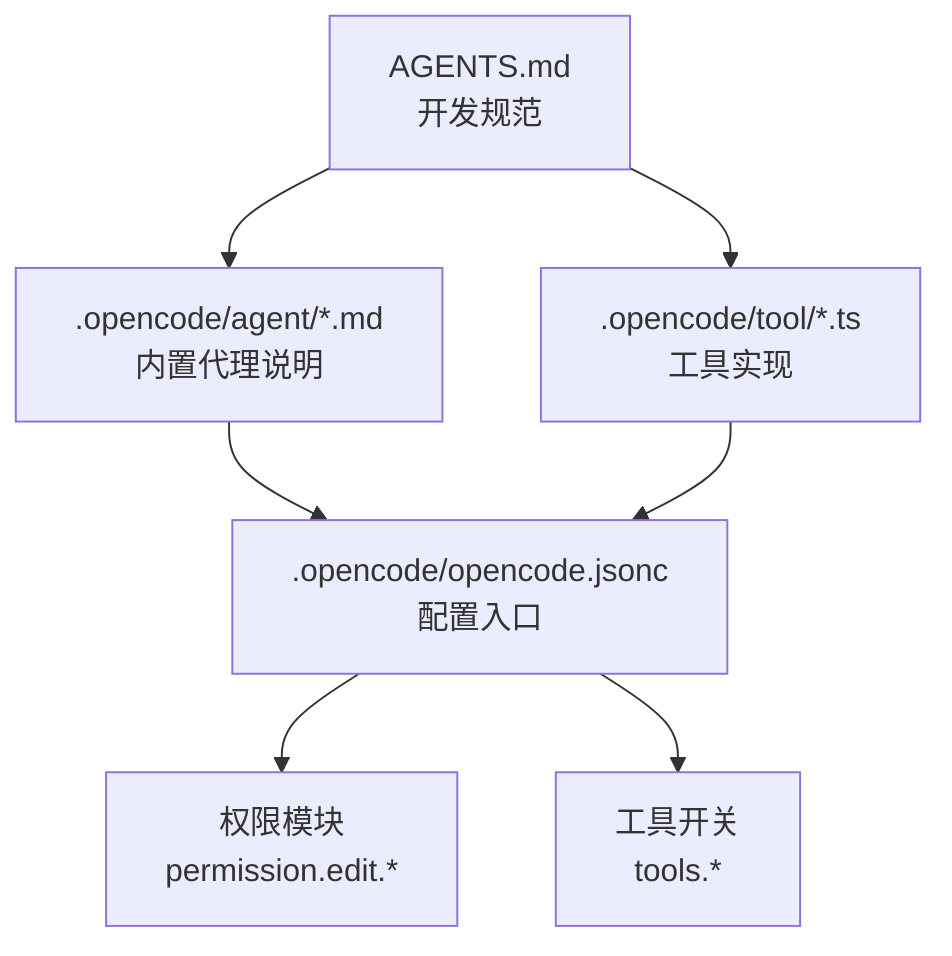
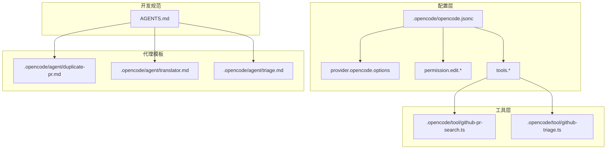
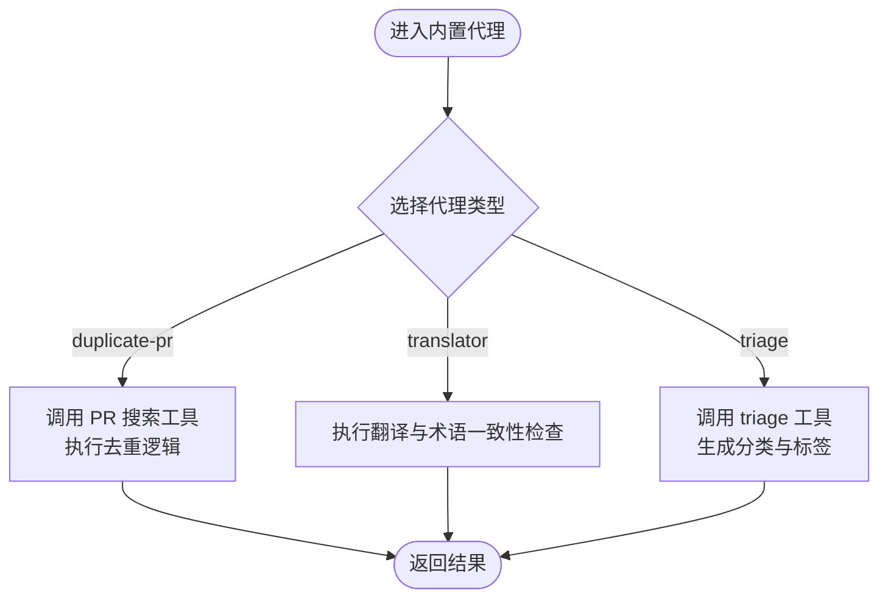
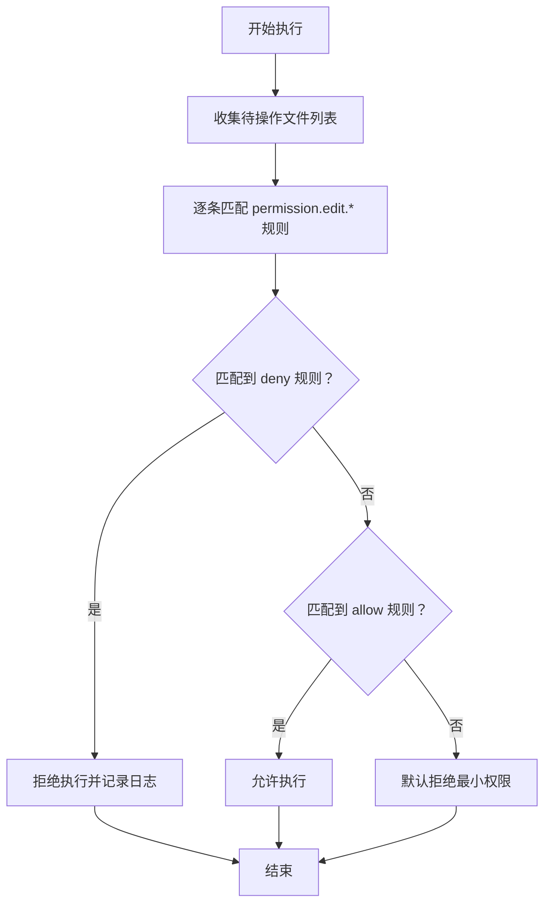
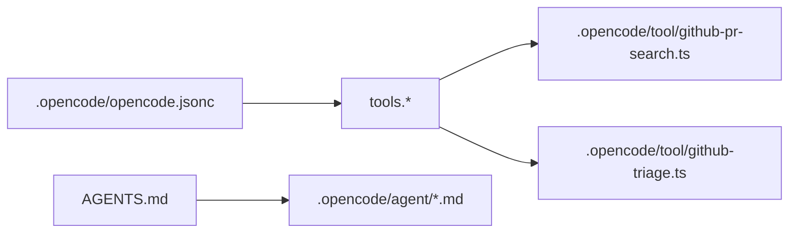

# 代理系统

<cite>
**本文引用的文件**
- [.opencode/opencode.jsonc](file://.opencode/opencode.jsonc)
- [AGENTS.md](file://AGENTS.md)
- [.opencode/agent/duplicate-pr.md](file://.opencode/agent/duplicate-pr.md)
- [.opencode/agent/translator.md](file://.opencode/agent/translator.md)
- [.opencode/agent/triage.md](file://.opencode/agent/triage.md)
- [.opencode/tool/github-pr-search.ts](file://.opencode/tool/github-pr-search.ts)
- [.opencode/tool/github-triage.ts](file://.opencode/tool/github-triage.ts)
</cite>

## 目录
1. [引言](#引言)
2. [项目结构](#项目结构)
3. [核心组件](#核心组件)
4. [架构总览](#架构总览)
5. [详细组件分析](#详细组件分析)
6. [依赖关系分析](#依赖关系分析)
7. [性能考虑](#性能考虑)
8. [故障排查指南](#故障排查指南)
9. [结论](#结论)
10. [附录](#附录)

## 引言
本文件面向 OpenCode 的代理系统，聚焦于代理服务的架构与实现要点，覆盖以下主题：
- 代理服务的实现机制与职责边界
- 代理信息的数据结构定义（Info 类型）
- 内置代理的功能差异与适用场景
- 权限控制系统（Permission 模块）的工作原理与合并机制
- 文件访问控制策略
- 代理配置选项（temperature、topP、mode、native 等）的作用说明
- 代理开发最佳实践（自定义代理创建流程、提示词工程、模型选择策略）
- 使用模式与扩展方法的示例路径

说明：当前仓库中未发现名为 Agent.Service 的具体实现文件；本文在“核心组件”与“详细组件分析”中对“Agent.Service”的讨论基于现有配置与工具文件进行合理推断，并以“概念性说明”形式呈现，不直接引用不存在的具体源码。

## 项目结构
OpenCode 的代理系统相关资产主要分布在以下位置：
- 配置层：.opencode/opencode.jsonc（提供 provider、permission、tools 等配置入口）
- 代理模板与说明：.opencode/agent/*.md（描述内置代理的用途与行为）
- 工具与技能：.opencode/tool/*.ts（封装可复用的外部交互能力）
- 代理开发规范：AGENTS.md（风格与测试建议）

**图表来源**
- [.opencode/opencode.jsonc:1-19](file://.opencode/opencode.jsonc#L1-L19)
- [.opencode/agent/duplicate-pr.md](file://.opencode/agent/duplicate-pr.md)
- [.opencode/agent/translator.md](file://.opencode/agent/translator.md)
- [.opencode/agent/triage.md](file://.opencode/agent/triage.md)
- [.opencode/tool/github-pr-search.ts](file://.opencode/tool/github-pr-search.ts)
- [.opencode/tool/github-triage.ts](file://.opencode/tool/github-triage.ts)
- [AGENTS.md:1-129](file://AGENTS.md#L1-L129)

**章节来源**
- [.opencode/opencode.jsonc:1-19](file://.opencode/opencode.jsonc#L1-L19)
- [.opencode/agent/duplicate-pr.md](file://.opencode/agent/duplicate-pr.md)
- [.opencode/agent/translator.md](file://.opencode/agent/translator.md)
- [.opencode/agent/triage.md](file://.opencode/agent/triage.md)
- [.opencode/tool/github-pr-search.ts](file://.opencode/tool/github-pr-search.ts)
- [.opencode/tool/github-triage.ts](file://.opencode/tool/github-triage.ts)
- [AGENTS.md:1-129](file://AGENTS.md#L1-L129)

## 核心组件
本节从“配置—工具—代理模板—开发规范”的维度，梳理代理系统的关键构件及其职责。

- 配置中心（.opencode/opencode.jsonc）
  - provider：声明底层推理服务提供方及选项
  - permission：定义文件访问控制规则（如 packages/opencode/migration/* deny）
  - tools：启用或禁用特定工具（如 github-triage、github-pr-search）
- 工具层（.opencode/tool/*.ts）
  - 封装对外部系统（如 GitHub）的查询与操作，供代理组合调用
- 代理模板（.opencode/agent/*.md）
  - 提供内置代理的行为说明与使用场景（duplicate-pr、translator、triage）
- 开发规范（AGENTS.md）
  - 规定变量命名、函数拆分、类型检查等开发约束，确保代理实现的一致性与可维护性

概念性说明：Agent.Service 在本仓库中未直接出现具体实现文件。根据配置与工具文件，可推断其职责应包括：
- 解析代理配置（provider、permission、tools）
- 组合工具与提示词，驱动推理与执行
- 执行前进行权限校验与文件访问控制
- 将结果输出到目标环境（如控制台、编辑器、CI）

由于缺乏具体源码，本文不对 Agent.Service 的类图、时序图进行映射。

**章节来源**
- [.opencode/opencode.jsonc:1-19](file://.opencode/opencode.jsonc#L1-L19)
- [.opencode/tool/github-pr-search.ts](file://.opencode/tool/github-pr-search.ts)
- [.opencode/tool/github-triage.ts](file://.opencode/tool/github-triage.ts)
- [AGENTS.md:1-129](file://AGENTS.md#L1-L129)

## 架构总览
下图展示了代理系统在配置、工具与代理模板之间的交互关系：

**图表来源**
- [.opencode/opencode.jsonc:1-19](file://.opencode/opencode.jsonc#L1-L19)
- [.opencode/tool/github-pr-search.ts](file://.opencode/tool/github-pr-search.ts)
- [.opencode/tool/github-triage.ts](file://.opencode/tool/github-triage.ts)
- [.opencode/agent/duplicate-pr.md](file://.opencode/agent/duplicate-pr.md)
- [.opencode/agent/translator.md](file://.opencode/agent/translator.md)
- [.opencode/agent/triage.md](file://.opencode/agent/triage.md)
- [AGENTS.md:1-129](file://AGENTS.md#L1-L129)

## 详细组件分析

### 代理信息的数据结构定义（Info 类型）
- 定义范围：本仓库未提供 Info 类型的具体实现文件。根据配置与工具文件，可推断 Info 结构至少包含以下字段族：
  - 推理配置：provider（含 provider 名称与 options）、temperature、topP、mode、native
  - 权限控制：permission.edit.*（文件路径匹配规则）
  - 工具开关：tools.*（布尔或枚举）
- 复杂度与性能：字段数量较少，读取与合并开销低；建议在启动阶段一次性加载并缓存，避免重复 IO。

概念性说明：Info 类型的职责是承载代理运行所需的全部元数据，作为 Agent.Service 的输入之一。

**章节来源**
- [.opencode/opencode.jsonc:1-19](file://.opencode/opencode.jsonc#L1-L19)
- [AGENTS.md:1-129](file://AGENTS.md#L1-L129)

### 内置代理的功能差异
- duplicate-pr 代理
  - 场景：识别与报告重复的 PR
  - 关键点：依赖 PR 搜索工具，结合提示词工程进行去重判断
- translator 代理
  - 场景：多语言翻译与本地化
  - 关键点：关注上下文一致性与术语表保持
- triage 代理
  - 场景：问题分类与优先级标记
  - 关键点：依赖外部 triage 能力，结合规则进行自动归档与标签化

**图表来源**
- [.opencode/agent/duplicate-pr.md](file://.opencode/agent/duplicate-pr.md)
- [.opencode/agent/translator.md](file://.opencode/agent/translator.md)
- [.opencode/agent/triage.md](file://.opencode/agent/triage.md)
- [.opencode/tool/github-pr-search.ts](file://.opencode/tool/github-pr-search.ts)
- [.opencode/tool/github-triage.ts](file://.opencode/tool/github-triage.ts)

**章节来源**
- [.opencode/agent/duplicate-pr.md](file://.opencode/agent/duplicate-pr.md)
- [.opencode/agent/translator.md](file://.opencode/agent/translator.md)
- [.opencode/agent/triage.md](file://.opencode/agent/triage.md)
- [.opencode/tool/github-pr-search.ts](file://.opencode/tool/github-pr-search.ts)
- [.opencode/tool/github-triage.ts](file://.opencode/tool/github-triage.ts)

### 权限控制系统（Permission 模块）
- 工作原理
  - 基于文件路径匹配的白/黑名单策略
  - 在执行前对目标路径进行匹配，决定是否允许写入/修改
- 合并机制
  - 多条规则按顺序合并，后匹配规则覆盖先前规则
  - 支持通配符（如 *），便于批量控制
- 文件访问控制策略
  - deny 优先：明确禁止的路径优先于允许
  - 最小权限原则：仅授予完成任务所必需的最小范围

**图表来源**
- [.opencode/opencode.jsonc:8-12](file://.opencode/opencode.jsonc#L8-L12)

**章节来源**
- [.opencode/opencode.jsonc:8-12](file://.opencode/opencode.jsonc#L8-L12)

### 代理配置选项
- temperature：控制采样随机性，值越低越稳定，越高越创造性
- topP：核采样阈值，影响候选词累积概率
- mode：推理模式（如 JSON、纯文本等）
- native：是否启用原生工具链或平台特性
- 作用说明：这些选项通过 provider.options 传递给推理服务，用于调整输出质量与稳定性

**章节来源**
- [.opencode/opencode.jsonc:3-7](file://.opencode/opencode.jsonc#L3-L7)

### 代理开发最佳实践
- 自定义代理创建流程
  - 明确任务域与边界，拆分为单一职责的小函数
  - 使用工具层能力（如 PR 搜索、triage）组合实现复杂流程
  - 在 AGENTS.md 规范下编写，保持一致的变量命名与类型检查
- 提示词工程
  - 采用“角色+任务+约束+格式”的结构化提示词模板
  - 对重复 PR、翻译一致性、triage 分类等场景分别设计提示词
- 模型选择策略
  - 根据任务稳定性需求选择较低 temperature
  - 对创造性任务适度提高 topP
  - 对结构化输出（JSON）启用 JSON mode

**章节来源**
- [AGENTS.md:1-129](file://AGENTS.md#L1-L129)
- [.opencode/tool/github-pr-search.ts](file://.opencode/tool/github-pr-search.ts)
- [.opencode/tool/github-triage.ts](file://.opencode/tool/github-triage.ts)

### 使用模式与扩展方法（示例路径）
- 使用内置代理
  - duplicate-pr：参考 [duplicate-pr 代理说明](file://.opencode/agent/duplicate-pr.md)
  - translator：参考 [translator 代理说明](file://.opencode/agent/translator.md)
  - triage：参考 [triage 代理说明](file://.opencode/agent/triage.md)
- 组合工具能力
  - PR 搜索：参考 [github-pr-search.ts](file://.opencode/tool/github-pr-search.ts)
  - triage 能力：参考 [github-triage.ts](file://.opencode/tool/github-triage.ts)
- 配置与权限
  - 全局配置：参考 [.opencode/opencode.jsonc:1-19](file://.opencode/opencode.jsonc#L1-L19)
  - 权限规则：参考 [.opencode/opencode.jsonc:8-12](file://.opencode/opencode.jsonc#L8-L12)

**章节来源**
- [.opencode/agent/duplicate-pr.md](file://.opencode/agent/duplicate-pr.md)
- [.opencode/agent/translator.md](file://.opencode/agent/translator.md)
- [.opencode/agent/triage.md](file://.opencode/agent/triage.md)
- [.opencode/tool/github-pr-search.ts](file://.opencode/tool/github-pr-search.ts)
- [.opencode/tool/github-triage.ts](file://.opencode/tool/github-triage.ts)
- [.opencode/opencode.jsonc:1-19](file://.opencode/opencode.jsonc#L1-L19)

## 依赖关系分析
- 配置依赖：.opencode/opencode.jsonc 是所有代理与工具的统一入口
- 工具依赖：内置代理通过 tools.* 间接依赖工具层实现
- 规范依赖：AGENTS.md 为代理开发提供风格与测试约束

**图表来源**
- [.opencode/opencode.jsonc:1-19](file://.opencode/opencode.jsonc#L1-L19)
- [.opencode/tool/github-pr-search.ts](file://.opencode/tool/github-pr-search.ts)
- [.opencode/tool/github-triage.ts](file://.opencode/tool/github-triage.ts)
- [AGENTS.md:1-129](file://AGENTS.md#L1-L129)
- [.opencode/agent/duplicate-pr.md](file://.opencode/agent/duplicate-pr.md)
- [.opencode/agent/translator.md](file://.opencode/agent/translator.md)
- [.opencode/agent/triage.md](file://.opencode/agent/triage.md)

**章节来源**
- [.opencode/opencode.jsonc:1-19](file://.opencode/opencode.jsonc#L1-L19)
- [.opencode/tool/github-pr-search.ts](file://.opencode/tool/github-pr-search.ts)
- [.opencode/tool/github-triage.ts](file://.opencode/tool/github-triage.ts)
- [AGENTS.md:1-129](file://AGENTS.md#L1-L129)

## 性能考虑
- 配置加载：一次性加载并缓存配置，减少重复 IO
- 工具调用：对高频外部请求进行并发控制与重试策略
- 权限判定：规则合并采用短路逻辑，避免全量扫描
- 输出格式：优先使用结构化输出（如 JSON），降低后处理成本

## 故障排查指南
- 配置错误
  - 症状：代理无法启动或工具不可用
  - 排查：检查 .opencode/opencode.jsonc 中 provider、tools、permission 字段
- 权限被拒
  - 症状：写入失败或操作被拒绝
  - 排查：确认 permission.edit.* 是否包含目标路径，deny 是否覆盖了 allow
- 工具不可用
  - 症状：调用 github-pr-search 或 github-triage 抛错
  - 排查：检查 tools.* 是否启用对应工具，网络连通性与凭据配置

**章节来源**
- [.opencode/opencode.jsonc:1-19](file://.opencode/opencode.jsonc#L1-L19)

## 结论
OpenCode 的代理系统以配置为中心，通过工具层能力与代理模板实现任务编排。权限控制与最小权限原则保障安全，开发规范提升可维护性。尽管 Agent.Service 的具体实现未在仓库中出现，但基于现有配置与工具文件，可以清晰地构建出代理系统的运行闭环。

## 附录
- 参考文件清单
  - .opencode/opencode.jsonc
  - .opencode/agent/*.md
  - .opencode/tool/*.ts
  - AGENTS.md