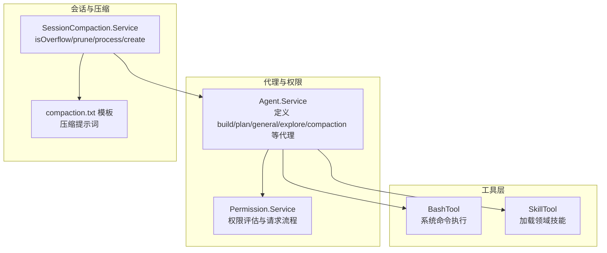
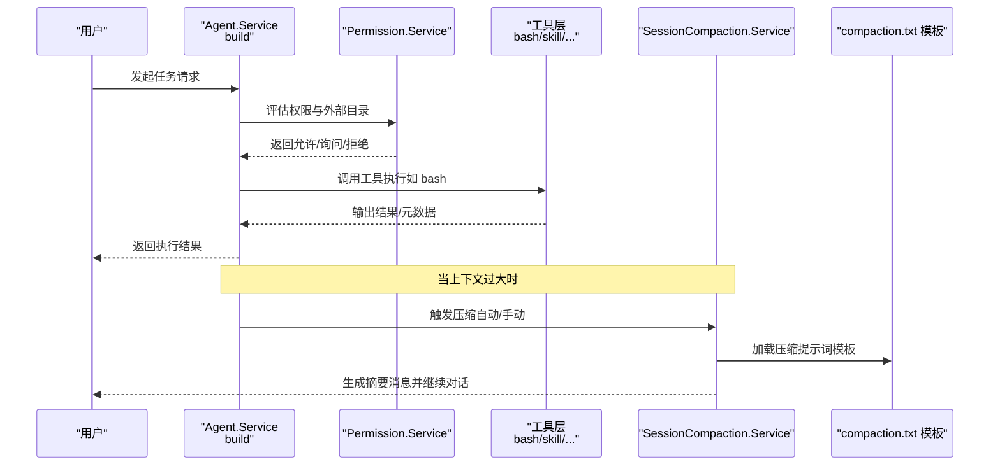
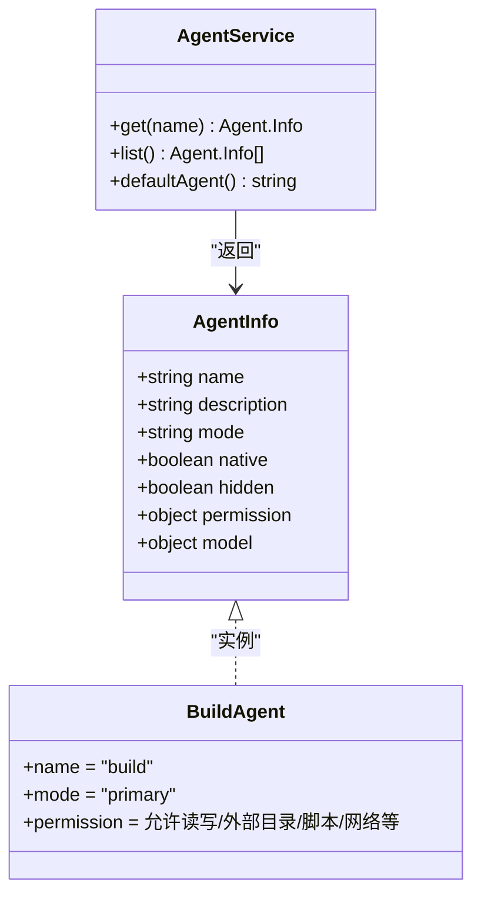
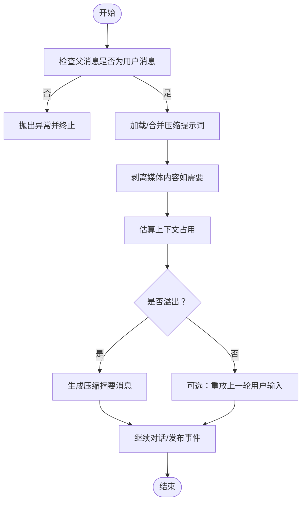
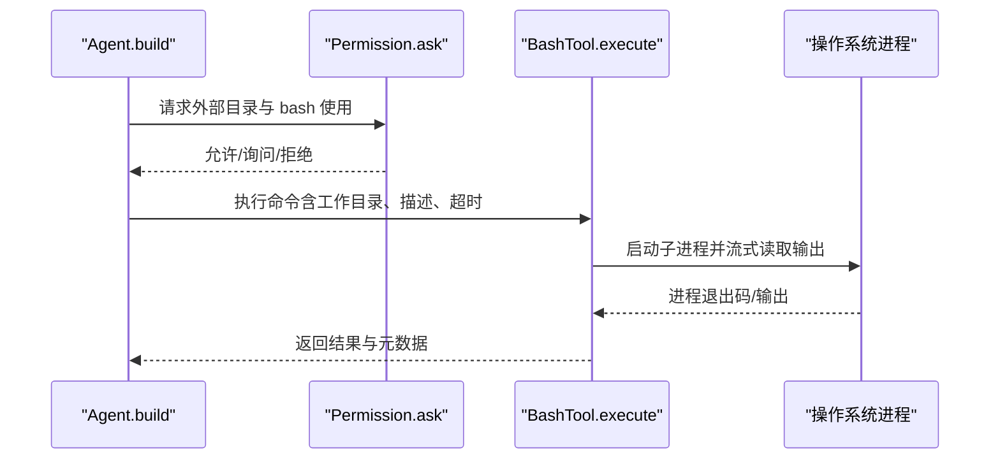
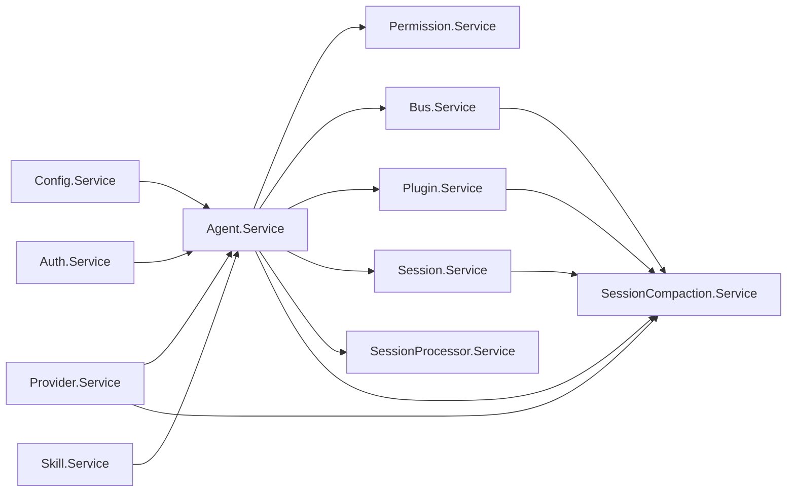

# Build 代理

<cite>
**本文引用的文件**
- [packages/opencode/src/agent/agent.ts](file://packages/opencode/src/agent/agent.ts)
- [packages/opencode/src/agent/prompt/compaction.txt](file://packages/opencode/src/agent/prompt/compaction.txt)
- [packages/opencode/src/session/compaction.ts](file://packages/opencode/src/session/compaction.ts)
- [packages/opencode/test/session/compaction.test.ts](file://packages/opencode/test/session/compaction.test.ts)
- [packages/opencode/src/tool/bash.ts](file://packages/opencode/src/tool/bash.ts)
- [packages/opencode/src/tool/skill.ts](file://packages/opencode/src/tool/skill.ts)
- [packages/opencode/src/permission/index.ts](file://packages/opencode/src/permission/index.ts)
- [.opencode/opencode.jsonc](file://.opencode/opencode.jsonc)
- [packages/web/src/content/docs/agents.mdx](file://packages/web/src/content/docs/agents.mdx)
- [packages/web/src/content/docs/plugins.mdx](file://packages/web/src/content/docs/plugins.mdx)
</cite>

## 目录
1. [简介](#简介)
2. [项目结构](#项目结构)
3. [核心组件](#核心组件)
4. [架构总览](#架构总览)
5. [详细组件分析](#详细组件分析)
6. [依赖关系分析](#依赖关系分析)
7. [性能考量](#性能考量)
8. [故障排查指南](#故障排查指南)
9. [结论](#结论)
10. [附录](#附录)

## 简介
本文件面向 OpenCode 的 Build 代理，系统性阐述其作为“默认主代理”的核心能力与执行边界，并结合会话压缩（compaction）机制，解释其在代码生成、文件操作、系统命令、项目构建等场景下的职责与优势。同时，本文深入解析 compaction.txt 提示词模板的设计原则与应用场景，给出可复用的最佳实践与使用范式，帮助开发者在不同开发阶段选择合适的代理与策略。

## 项目结构
围绕 Build 代理与会话压缩的关键文件分布如下：
- 代理定义与权限：packages/opencode/src/agent/agent.ts
- 会话压缩服务：packages/opencode/src/session/compaction.ts
- 压缩提示词模板：packages/opencode/src/agent/prompt/compaction.txt
- 测试用例：packages/opencode/test/session/compaction.test.ts
- 工具能力（bash、skill 等）：packages/opencode/src/tool/*.ts
- 权限系统：packages/opencode/src/permission/index.ts
- 配置样例：.opencode/opencode.jsonc
- 文档与插件扩展：packages/web/src/content/docs/*.mdx

**图表来源**
- [packages/opencode/src/agent/agent.ts:107-202](file://packages/opencode/src/agent/agent.ts#L107-L202)
- [packages/opencode/src/permission/index.ts:133-136](file://packages/opencode/src/permission/index.ts#L133-L136)
- [packages/opencode/src/session/compaction.ts:23-59](file://packages/opencode/src/session/compaction.ts#L23-L59)
- [packages/opencode/src/agent/prompt/compaction.txt:1-16](file://packages/opencode/src/agent/prompt/compaction.txt#L1-L16)
- [packages/opencode/src/tool/bash.ts:439-496](file://packages/opencode/src/tool/bash.ts#L439-L496)
- [packages/opencode/src/tool/skill.ts:9-28](file://packages/opencode/src/tool/skill.ts#L9-L28)

**章节来源**
- [packages/opencode/src/agent/agent.ts:107-202](file://packages/opencode/src/agent/agent.ts#L107-L202)
- [packages/opencode/src/session/compaction.ts:23-59](file://packages/opencode/src/session/compaction.ts#L23-L59)
- [packages/opencode/src/agent/prompt/compaction.txt:1-16](file://packages/opencode/src/agent/prompt/compaction.txt#L1-L16)
- [packages/opencode/src/tool/bash.ts:439-496](file://packages/opencode/src/tool/bash.ts#L439-L496)
- [packages/opencode/src/tool/skill.ts:9-28](file://packages/opencode/src/tool/skill.ts#L9-L28)
- [packages/opencode/src/permission/index.ts:133-136](file://packages/opencode/src/permission/index.ts#L133-L136)

## 核心组件
- Build 代理
  - 默认主代理，具备完整工具访问权限（除特定限制），适合需要直接进行文件编辑、系统命令、网络检索与多步骤任务编排的开发工作。
  - 在权限系统中，默认允许读取、写入、补丁、多文件编辑、外部目录访问（需授权）、bash 执行、网络检索等；同时保留“询问”策略以保护高风险操作。
- Plan 代理
  - 受限代理，禁用所有写入类工具，适合分析、规划与建议场景。
- General 代理
  - 通用代理，拥有接近 Build 的工具集（除 todo），支持并行执行多个工作单元。
- Explore 代理
  - 唯读代理，专注于快速搜索、文件定位与知识问答。
- Compaction 代理
  - 隐藏系统代理，负责将长上下文压缩为简洁摘要，自动触发并在 UI 中不可见。

**章节来源**
- [packages/web/src/content/docs/agents.mdx:48-93](file://packages/web/src/content/docs/agents.mdx#L48-L93)
- [packages/opencode/src/agent/agent.ts:107-202](file://packages/opencode/src/agent/agent.ts#L107-L202)

## 架构总览
Build 代理在权限许可范围内调用工具层完成具体任务；当会话上下文增长导致模型上下文溢出时，SessionCompaction 服务会自动或手动触发压缩流程，利用 compaction.txt 模板生成摘要并重写会话历史，从而维持对话连贯性与成本可控。

**图表来源**
- [packages/opencode/src/agent/agent.ts:107-202](file://packages/opencode/src/agent/agent.ts#L107-L202)
- [packages/opencode/src/permission/index.ts:167-202](file://packages/opencode/src/permission/index.ts#L167-L202)
- [packages/opencode/src/session/compaction.ts:141-347](file://packages/opencode/src/session/compaction.ts#L141-L347)
- [packages/opencode/src/agent/prompt/compaction.txt:1-16](file://packages/opencode/src/agent/prompt/compaction.txt#L1-L16)

## 详细组件分析

### Build 代理：默认主代理
- 职责与能力
  - 默认主代理，权限系统默认允许读写、补丁、多文件编辑、外部目录访问（需授权）、bash 执行、网络检索等。
  - 支持加载领域技能（skill），注入专用指令与资源，提升任务执行质量。
- 与 Plan/General/Explore 的区别
  - Plan 禁止写入类工具，适合纯分析与规划。
  - General 接近 Build 的工具集（除 todo），适合并行多任务。
  - Explore 仅唯读，专注搜索与问答。
- 与 Compaction 的协作
  - 当上下文过大时，由 SessionCompaction 自动或手动介入，避免超出模型上下文限制。

**图表来源**
- [packages/opencode/src/agent/agent.ts:107-202](file://packages/opencode/src/agent/agent.ts#L107-L202)

**章节来源**
- [packages/opencode/src/agent/agent.ts:107-202](file://packages/opencode/src/agent/agent.ts#L107-L202)
- [packages/web/src/content/docs/agents.mdx:48-93](file://packages/web/src/content/docs/agents.mdx#L48-L93)

### 会话压缩（SessionCompaction）：上下文管理与续写
- 功能要点
  - isOverflow：根据当前 tokens 与模型限制判断是否需要压缩。
  - prune：对早期已完成的工具输出进行压缩清理，释放上下文空间。
  - process：生成压缩摘要消息，必要时重放上一轮用户输入或插入“继续”提示，保持对话连续性。
  - create：创建压缩触发消息，标记自动/溢出状态。
- 提示词模板（compaction.txt）
  - 设计目标：聚焦“做了什么、正在做什么、修改了哪些文件、下一步做什么、关键约束与决策”，确保新代理能快速接手。
  - 插件扩展：可通过实验钩子注入上下文或完全替换提示词，满足多智能体会话的领域需求。
- 错误处理与事件
  - 当压缩后仍超限，标记摘要消息为错误并停止后续处理。
  - 成功时发布“已压缩”事件，便于 UI 或下游流程感知。

**图表来源**
- [packages/opencode/src/session/compaction.ts:141-347](file://packages/opencode/src/session/compaction.ts#L141-L347)
- [packages/opencode/src/agent/prompt/compaction.txt:1-16](file://packages/opencode/src/agent/prompt/compaction.txt#L1-L16)
- [packages/web/src/content/docs/plugins.mdx:364-389](file://packages/web/src/content/docs/plugins.mdx#L364-L389)

**章节来源**
- [packages/opencode/src/session/compaction.ts:23-59](file://packages/opencode/src/session/compaction.ts#L23-L59)
- [packages/opencode/src/session/compaction.ts:91-139](file://packages/opencode/src/session/compaction.ts#L91-L139)
- [packages/opencode/src/session/compaction.ts:141-347](file://packages/opencode/src/session/compaction.ts#L141-L347)
- [packages/opencode/src/agent/prompt/compaction.txt:1-16](file://packages/opencode/src/agent/prompt/compaction.txt#L1-L16)
- [packages/web/src/content/docs/plugins.mdx:364-389](file://packages/web/src/content/docs/plugins.mdx#L364-L389)

### 工具层：bash 与 skill
- BashTool
  - 解析命令树，识别路径与模式，向权限系统发起外部目录与 bash 使用请求，最终在受控环境中执行命令并返回输出与元数据。
  - 支持超时、中断、输出预览与跨平台（PowerShell/Bash）差异处理。
- SkillTool
  - 加载领域技能，注入专用指令与资源，提升复杂任务的执行质量与一致性。

**图表来源**
- [packages/opencode/src/tool/bash.ts:439-496](file://packages/opencode/src/tool/bash.ts#L439-L496)
- [packages/opencode/src/permission/index.ts:167-202](file://packages/opencode/src/permission/index.ts#L167-L202)

**章节来源**
- [packages/opencode/src/tool/bash.ts:439-496](file://packages/opencode/src/tool/bash.ts#L439-L496)
- [packages/opencode/src/tool/skill.ts:9-28](file://packages/opencode/src/tool/skill.ts#L9-L28)
- [packages/opencode/src/permission/index.ts:167-202](file://packages/opencode/src/permission/index.ts#L167-L202)

## 依赖关系分析
- Agent.Service 依赖 Config、Auth、Skill、Provider，组合默认权限规则与用户配置，形成各代理的权限集合。
- SessionCompaction.Service 依赖 Bus、Config、Session、Agent、Plugin、SessionProcessor、Provider，协调压缩流程与模型调用。
- 权限系统通过规则集与请求/回复机制，统一管理外部目录与工具使用。

**图表来源**
- [packages/opencode/src/agent/agent.ts:72-94](file://packages/opencode/src/agent/agent.ts#L72-L94)
- [packages/opencode/src/session/compaction.ts:63-82](file://packages/opencode/src/session/compaction.ts#L63-L82)

**章节来源**
- [packages/opencode/src/agent/agent.ts:72-94](file://packages/opencode/src/agent/agent.ts#L72-L94)
- [packages/opencode/src/session/compaction.ts:63-82](file://packages/opencode/src/session/compaction.ts#L63-L82)

## 性能考量
- 上下文估算与裁剪
  - 通过 Token.estimate 对工具输出进行估算，达到阈值后进行 prune 清理，优先保留最近交互与关键信息。
- 溢出检测
  - 结合模型上下文限制与输入/输出预算，动态判断是否需要压缩；测试覆盖了带/不带输入上限的场景差异。
- 媒体剥离
  - 在溢出场景下剥离媒体附件，减少上下文体积，同时保留“已附带文件”的提示，指导用户后续操作。
- 续写策略
  - 自动模式下插入“继续”提示，降低重复上下文开销，提高后续响应效率。

**章节来源**
- [packages/opencode/src/session/compaction.ts:91-139](file://packages/opencode/src/session/compaction.ts#L91-L139)
- [packages/opencode/test/session/compaction.test.ts:247-432](file://packages/opencode/test/session/compaction.test.ts#L247-L432)
- [packages/opencode/test/session/compaction.test.ts:674-758](file://packages/opencode/test/session/compaction.test.ts#L674-L758)

## 故障排查指南
- 压缩后仍超限
  - 现象：压缩摘要消息标记为错误并停止。
  - 处理：检查模型上下文限制与输入/输出预算设置，必要时减少一次性附带的媒体或拆分任务。
- 权限被拒绝
  - 现象：外部目录或 bash 调用被拒绝。
  - 处理：在权限请求界面选择“始终允许”或调整 .opencode/opencode.jsonc 中的权限配置。
- 自动压缩未触发
  - 现象：上下文增长但未压缩。
  - 处理：确认配置中 compaction.auto 是否启用；检查 isOverflow 判断逻辑与模型限制。
- 插件未生效
  - 现象：自定义压缩提示词未替换默认模板。
  - 处理：确保插件正确注册 experimental.session.compacting 钩子并设置 output.prompt。

**章节来源**
- [packages/opencode/src/session/compaction.ts:274-283](file://packages/opencode/src/session/compaction.ts#L274-L283)
- [packages/opencode/src/permission/index.ts:167-202](file://packages/opencode/src/permission/index.ts#L167-L202)
- [packages/web/src/content/docs/plugins.mdx:364-389](file://packages/web/src/content/docs/plugins.mdx#L364-L389)
- [.opencode/opencode.jsonc:8-18](file://.opencode/opencode.jsonc#L8-L18)

## 结论
Build 代理作为默认主代理，凭借完善的权限体系与工具链，能够高效完成从代码生成到系统命令执行的多样化任务。配合 SessionCompaction 的上下文压缩与续写机制，可在长对话与大规模媒体场景下保持稳定与高效。通过合理配置权限与插件扩展，开发者可以最大化 Build 代理在不同开发阶段的生产力。

## 附录

### 使用示例与最佳实践
- 何时选择 Build 代理
  - 需要直接修改代码、执行系统命令、并行处理多个任务时。
- 何时选择 Plan 代理
  - 仅做分析、规划与建议，避免无意修改代码库。
- 何时选择 General 代理
  - 并行执行多个工作单元，提升整体吞吐。
- 何时选择 Explore 代理
  - 快速搜索文件、关键词或回答关于代码库的问题。
- 何时触发压缩
  - 上下文接近模型限制或出现溢出错误时，优先尝试自动压缩；若失败，拆分任务或减少媒体附件。
- 插件扩展压缩提示词
  - 通过 experimental.session.compacting 注入领域上下文或完全替换提示词，确保多智能体会话的上下文完整性。

**章节来源**
- [packages/web/src/content/docs/agents.mdx:48-93](file://packages/web/src/content/docs/agents.mdx#L48-L93)
- [packages/web/src/content/docs/plugins.mdx:364-389](file://packages/web/src/content/docs/plugins.mdx#L364-L389)
- [packages/opencode/src/session/compaction.ts:183-188](file://packages/opencode/src/session/compaction.ts#L183-L188)