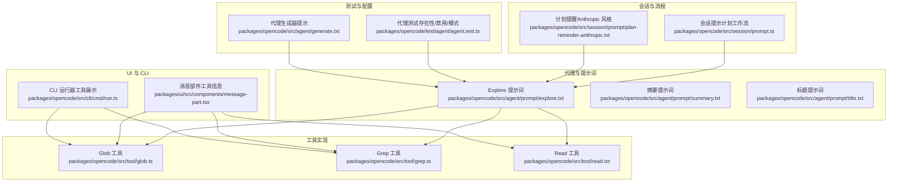
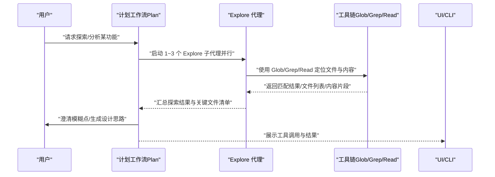
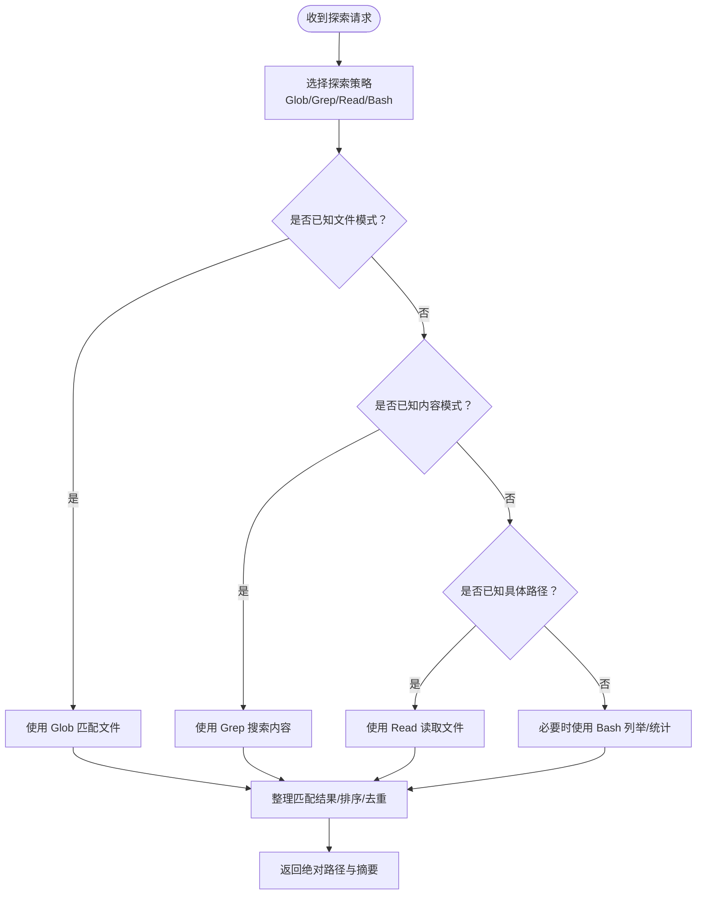
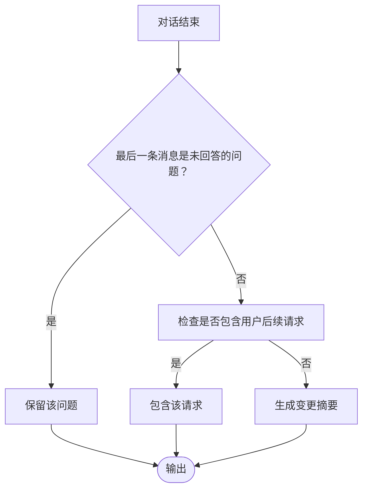
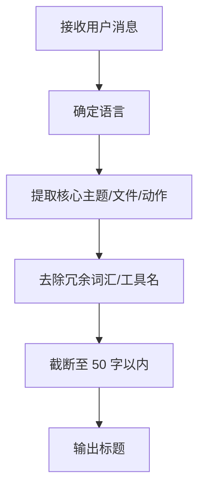
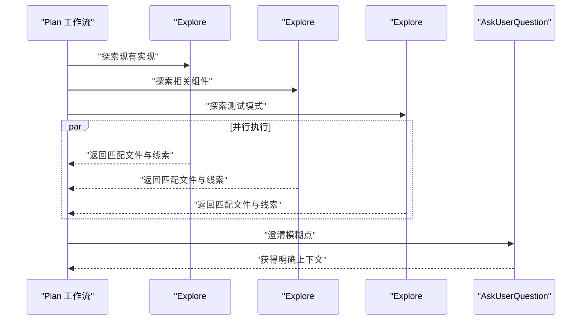
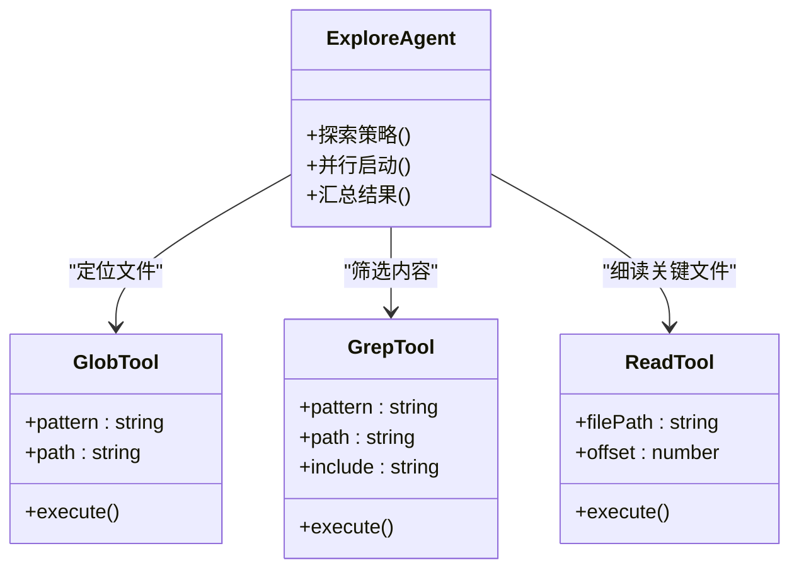
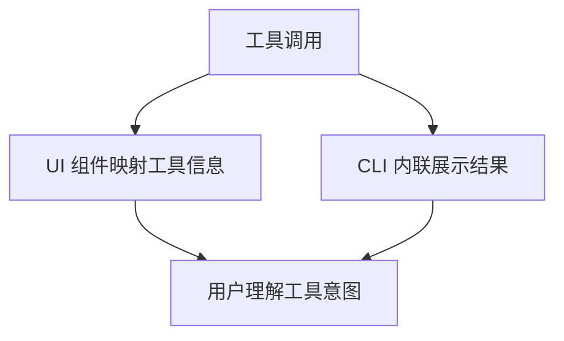
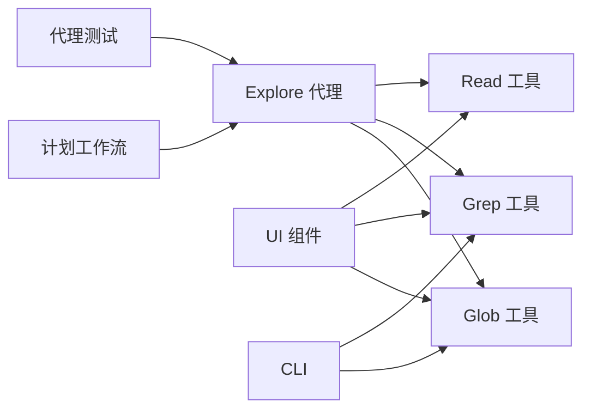

# Explore 代理

<cite>
**本文引用的文件**
- [README.md](file://README.md)
- [AGENTS.md](file://AGENTS.md)
- [explore.txt](file://packages/opencode/src/agent/prompt/explore.txt)
- [summary.txt](file://packages/opencode/src/agent/prompt/summary.txt)
- [title.txt](file://packages/opencode/src/agent/prompt/title.txt)
- [prompt.ts](file://packages/opencode/src/session/prompt.ts)
- [plan-reminder-anthropic.txt](file://packages/opencode/src/session/prompt/plan-reminder-anthropic.txt)
- [glob.ts](file://packages/opencode/src/tool/glob.ts)
- [glob.txt](file://packages/opencode/src/tool/glob.txt)
- [grep.ts](file://packages/opencode/src/tool/grep.ts)
- [grep.txt](file://packages/opencode/src/tool/grep.txt)
- [read.txt](file://packages/opencode/src/tool/read.txt)
- [task.txt](file://packages/opencode/src/tool/task.txt)
- [run.ts](file://packages/opencode/src/cli/cmd/run.ts)
- [message-part.tsx](file://packages/ui/src/components/message-part.tsx)
- [agent.test.ts](file://packages/opencode/test/agent/agent.test.ts)
- [generate.txt](file://packages/opencode/src/agent/generate.txt)
</cite>

## 目录
1. [简介](#简介)
2. [项目结构](#项目结构)
3. [核心组件](#核心组件)
4. [架构总览](#架构总览)
5. [详细组件分析](#详细组件分析)
6. [依赖分析](#依赖分析)
7. [性能考虑](#性能考虑)
8. [故障排查指南](#故障排查指南)
9. [结论](#结论)
10. [附录](#附录)

## 简介
本文件系统性阐述 OpenCode Explore 代理的代码库探索与分析能力，重点解析其在项目结构分析、代码理解、功能总结等方面的独特优势，并深入说明 explore.txt、summary.txt、title.txt 等提示词模板的设计理念与协作机制。通过 Explore 代理，用户可以并行启动多个子代理进行多维度探索，快速定位关键文件、理解上下文、生成标题与摘要，从而高效完成新项目接手、代码重构、技术调研等任务。

## 项目结构
OpenCode 的 Explore 代理位于 packages/opencode 子包中，围绕“代理提示词”“工具实现”“会话流程”“UI 展示”“测试与配置”五个方面组织：

- 代理提示词：包含 Explore、摘要、标题等专用提示词模板，用于约束代理行为与输出格式
- 工具实现：提供 glob、grep、read 等文件系统与内容搜索工具，支撑 Explore 的探索流程
- 会话流程：定义 Explore 在计划工作流中的阶段划分与并行策略
- UI 展示：在终端 UI 中对工具调用进行可视化呈现
- 测试与配置：验证 Explore 代理的存在性、可配置性与默认行为

图表来源
- [explore.txt:1-19](file://packages/opencode/src/agent/prompt/explore.txt#L1-L19)
- [summary.txt:1-12](file://packages/opencode/src/agent/prompt/summary.txt#L1-L12)
- [title.txt:1-45](file://packages/opencode/src/agent/prompt/title.txt#L1-L45)
- [glob.ts:1-34](file://packages/opencode/src/tool/glob.ts#L1-L34)
- [grep.ts:1-40](file://packages/opencode/src/tool/grep.ts#L1-L40)
- [read.txt:1-14](file://packages/opencode/src/tool/read.txt#L1-L14)
- [prompt.ts:319-339](file://packages/opencode/src/session/prompt.ts#L319-L339)
- [plan-reminder-anthropic.txt:24-43](file://packages/opencode/src/session/prompt/plan-reminder-anthropic.txt#L24-L43)
- [message-part.tsx:277-324](file://packages/ui/src/components/message-part.tsx#L277-L324)
- [run.ts:77-111](file://packages/opencode/src/cli/cmd/run.ts#L77-L111)
- [agent.test.ts:181-199](file://packages/opencode/test/agent/agent.test.ts#L181-L199)
- [generate.txt:1-76](file://packages/opencode/src/agent/generate.txt#L1-L76)

章节来源
- [README.md:100-114](file://README.md#L100-L114)
- [AGENTS.md:1-129](file://AGENTS.md#L1-L129)

## 核心组件
- Explore 代理提示词：定义 Explore 的专家身份、能力边界与执行原则，强调使用 Glob/Grep/Read/Bash 等工具进行高效探索，避免修改系统状态，返回绝对路径等
- 摘要提示词：规范对话摘要的写作风格与长度，强调以第一人称描述变更结果，不重复列出验证步骤
- 标题提示词：生成简洁自然的线程标题，聚焦用户核心问题或操作意图，避免冗余词汇与工具名
- 会话流程：在“计划工作流”中明确 Phase 1 仅使用 Explore 子代理类型，并建议最多并行启动 3 个 Explore 代理，分别聚焦不同方向
- 工具链：Glob 支持通配符匹配；Grep 支持正则检索；Read 支持按行读取与分段续读；Task 工具用于复杂多步任务编排

章节来源
- [explore.txt:1-19](file://packages/opencode/src/agent/prompt/explore.txt#L1-L19)
- [summary.txt:1-12](file://packages/opencode/src/agent/prompt/summary.txt#L1-L12)
- [title.txt:1-45](file://packages/opencode/src/agent/prompt/title.txt#L1-L45)
- [prompt.ts:319-339](file://packages/opencode/src/session/prompt.ts#L319-L339)
- [plan-reminder-anthropic.txt:24-43](file://packages/opencode/src/session/prompt/plan-reminder-anthropic.txt#L24-L43)
- [glob.ts:1-34](file://packages/opencode/src/tool/glob.ts#L1-L34)
- [grep.ts:1-40](file://packages/opencode/src/tool/grep.ts#L1-L40)
- [read.txt:1-14](file://packages/opencode/src/tool/read.txt#L1-L14)
- [task.txt:1-15](file://packages/opencode/src/tool/task.txt#L1-L15)

## 架构总览
Explore 代理在 OpenCode 体系中的定位是“只读型探索代理”，专用于在执行任何可能修改文件或运行命令之前，先对代码库进行系统化探索与上下文理解。其与 Plan/Build 等其他代理的关系如下：

图表来源
- [prompt.ts:319-339](file://packages/opencode/src/session/prompt.ts#L319-L339)
- [plan-reminder-anthropic.txt:24-43](file://packages/opencode/src/session/prompt/plan-reminder-anthropic.txt#L24-L43)
- [glob.ts:1-34](file://packages/opencode/src/tool/glob.ts#L1-L34)
- [grep.ts:1-40](file://packages/opencode/src/tool/grep.ts#L1-L40)
- [run.ts:77-111](file://packages/opencode/src/cli/cmd/run.ts#L77-L111)
- [message-part.tsx:277-324](file://packages/ui/src/components/message-part.tsx#L277-L324)

## 详细组件分析

### Explore 代理提示词（explore.txt）
- 角色定位：文件搜索专家，擅长使用 Glob/Grep/Read/Bash 探索代码库
- 行为约束：不创建/修改文件；返回绝对路径；根据调用方要求调整探索细致度
- 能力边界：专注文件发现与内容理解，不直接执行构建/编辑/部署等操作

图表来源
- [explore.txt:1-19](file://packages/opencode/src/agent/prompt/explore.txt#L1-L19)

章节来源
- [explore.txt:1-19](file://packages/opencode/src/agent/prompt/explore.txt#L1-L19)

### 摘要提示词（summary.txt）
- 输出风格：2–3 句，第一人称，聚焦“做了什么”，不重复列出验证步骤
- 特殊处理：保留未回答的问题或用户的后续请求

图表来源
- [summary.txt:1-12](file://packages/opencode/src/agent/prompt/summary.txt#L1-L12)

章节来源
- [summary.txt:1-12](file://packages/opencode/src/agent/prompt/summary.txt#L1-L12)

### 标题提示词（title.txt）
- 输出规范：≤50 字，单行，自然语言，避免工具名与冗余词汇
- 关键点：聚焦用户核心意图或操作对象，保持可检索性

图表来源
- [title.txt:1-45](file://packages/opencode/src/agent/prompt/title.txt#L1-L45)

章节来源
- [title.txt:1-45](file://packages/opencode/src/agent/prompt/title.txt#L1-L45)

### 会话流程与并行探索（prompt.ts 与 plan-reminder-anthropic.txt）
- Phase 1 仅使用 Explore 子代理类型
- 建议最多并行 3 个 Explore 代理，分别聚焦“现有实现”“相关组件”“测试模式”等方向
- 明确在探索后使用提问工具澄清模糊点

图表来源
- [prompt.ts:319-339](file://packages/opencode/src/session/prompt.ts#L319-L339)
- [plan-reminder-anthropic.txt:24-43](file://packages/opencode/src/session/prompt/plan-reminder-anthropic.txt#L24-L43)

章节来源
- [prompt.ts:319-339](file://packages/opencode/src/session/prompt.ts#L319-L339)
- [plan-reminder-anthropic.txt:24-43](file://packages/opencode/src/session/prompt/plan-reminder-anthropic.txt#L24-L43)

### 工具链：Glob/Grep/Read 的协作
- Glob：支持通配符模式，按修改时间排序返回文件路径，适合“按名称/目录”定位
- Grep：支持正则检索，返回含匹配的文件与行号，适合“按内容/关键词”定位
- Read：按行读取文件内容，支持偏移续读，适合“细读关键文件”
- Task：当探索是开放式的多轮迭代时，建议使用 Task 工具统一编排

图表来源
- [glob.ts:1-34](file://packages/opencode/src/tool/glob.ts#L1-L34)
- [grep.ts:1-40](file://packages/opencode/src/tool/grep.ts#L1-L40)
- [read.txt:1-14](file://packages/opencode/src/tool/read.txt#L1-L14)
- [explore.txt:1-19](file://packages/opencode/src/agent/prompt/explore.txt#L1-L19)

章节来源
- [glob.ts:1-34](file://packages/opencode/src/tool/glob.ts#L1-L34)
- [grep.ts:1-40](file://packages/opencode/src/tool/grep.ts#L1-L40)
- [read.txt:1-14](file://packages/opencode/src/tool/read.txt#L1-L14)
- [glob.txt:1-7](file://packages/opencode/src/tool/glob.txt#L1-L7)
- [grep.txt:1-9](file://packages/opencode/src/tool/grep.txt#L1-L9)
- [task.txt:1-15](file://packages/opencode/src/tool/task.txt#L1-L15)

### UI 与 CLI 展示
- UI 层：根据工具类型显示图标与副标题，便于用户快速理解工具调用意图
- CLI 层：对 Glob/Grep 结果进行内联展示，包含匹配数量与路径信息

图表来源
- [message-part.tsx:277-324](file://packages/ui/src/components/message-part.tsx#L277-L324)
- [run.ts:77-111](file://packages/opencode/src/cli/cmd/run.ts#L77-L111)

章节来源
- [message-part.tsx:277-324](file://packages/ui/src/components/message-part.tsx#L277-L324)
- [run.ts:77-111](file://packages/opencode/src/cli/cmd/run.ts#L77-L111)

## 依赖分析
- Explore 代理依赖于工具链（Glob/Grep/Read），并在会话流程中被 Plan 工作流调度
- UI/CLI 对工具调用进行可视化增强，提升可观测性
- 测试覆盖 Explore 代理的存在性、禁用与模式配置等关键行为

图表来源
- [prompt.ts:319-339](file://packages/opencode/src/session/prompt.ts#L319-L339)
- [message-part.tsx:277-324](file://packages/ui/src/components/message-part.tsx#L277-L324)
- [run.ts:77-111](file://packages/opencode/src/cli/cmd/run.ts#L77-L111)
- [agent.test.ts:181-199](file://packages/opencode/test/agent/agent.test.ts#L181-L199)

章节来源
- [agent.test.ts:181-199](file://packages/opencode/test/agent/agent.test.ts#L181-L199)

## 性能考虑
- 并行探索：在 Phase 1 启动 1–3 个 Explore 代理，充分利用多核资源，缩短探索时间
- 工具组合：优先使用 Glob 缩小范围，再用 Grep 精准定位，最后用 Read 细读关键文件
- 分段读取：Read 支持偏移续读，避免一次性读取大文件导致内存压力
- 外部目录校验：工具执行前进行外部目录访问校验，减少无效 IO

## 故障排查指南
- Explore 代理不可用
  - 检查配置是否禁用 Explore 代理
  - 确认默认代理不是 Explore 子代理（应为主代理）
- 工具权限不足
  - 确认调用 ask 权限流程已正确触发
  - 校验工具参数（如路径、模式）是否合法
- 结果不完整
  - 使用 Task 工具进行多轮探索编排
  - 对大文件采用分段读取策略
- UI/CLI 不显示工具信息
  - 检查 UI 组件对工具类型的映射
  - 确认 CLI 内联展示逻辑是否正确

章节来源
- [agent.test.ts:181-199](file://packages/opencode/test/agent/agent.test.ts#L181-L199)
- [glob.ts:1-34](file://packages/opencode/src/tool/glob.ts#L1-L34)
- [grep.ts:1-40](file://packages/opencode/src/tool/grep.ts#L1-L40)
- [read.txt:1-14](file://packages/opencode/src/tool/read.txt#L1-L14)
- [message-part.tsx:277-324](file://packages/ui/src/components/message-part.tsx#L277-L324)
- [run.ts:77-111](file://packages/opencode/src/cli/cmd/run.ts#L77-L111)

## 结论
Explore 代理通过“只读探索 + 并行分析 + 结构化输出”的方式，显著提升了代码库理解效率。结合 Explore、摘要、标题三类提示词与 Glob/Grep/Read 工具链，开发者可以在新项目接手、代码重构、技术调研等场景中快速建立上下文、定位关键文件、沉淀知识与成果。在实际使用中，建议遵循“先探索、后设计、再实现”的流程，并利用 UI/CLI 的可视化反馈优化探索体验。

## 附录
- 使用示例与最佳实践
  - 新项目接手：启动 1–3 个 Explore 代理，分别聚焦“入口/路由/配置”“核心模块/服务”“测试与文档”，随后生成标题与摘要
  - 代码重构：先用 Grep 定位相关调用点，再用 Read 读取关键函数上下文，最后用 Task 编排多步修改
  - 技术调研：用 Glob 快速扫描候选实现，用 Grep 筛选关键模式，用 Read 深入理解设计动机
- 与其他代理的协作
  - Explore 代理仅负责探索与理解，Plan 代理负责设计与合成，Build 代理负责实现与验证
  - 默认代理可配置为主代理（如 plan），但 Explore 子代理不可作为默认代理使用

章节来源
- [README.md:100-114](file://README.md#L100-L114)
- [generate.txt:1-76](file://packages/opencode/src/agent/generate.txt#L1-L76)