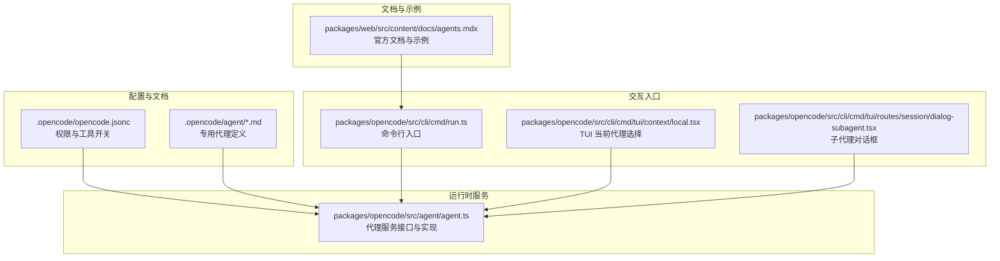
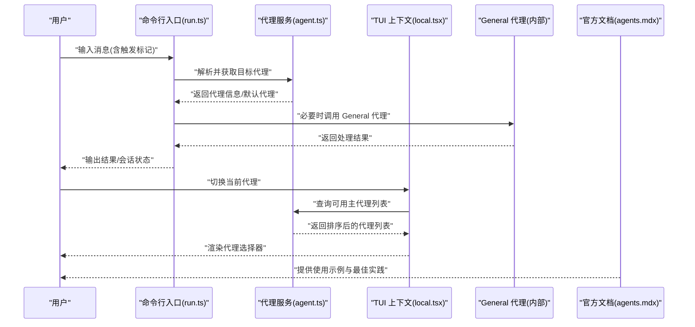
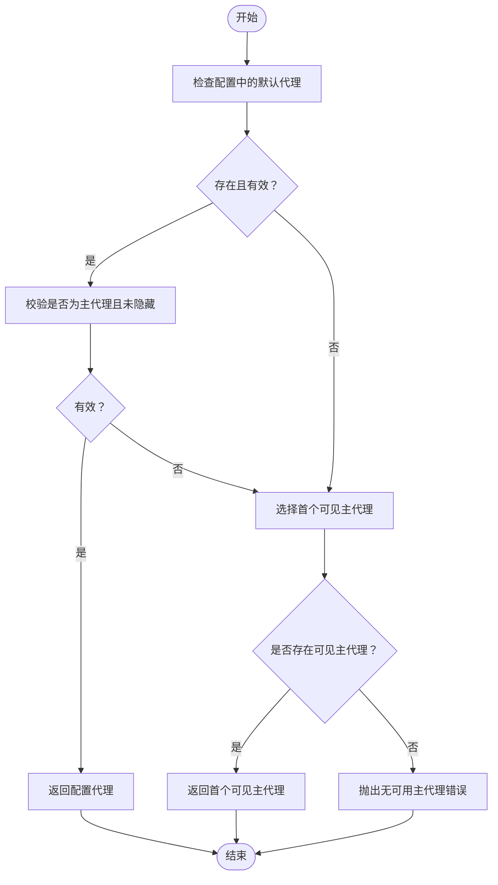
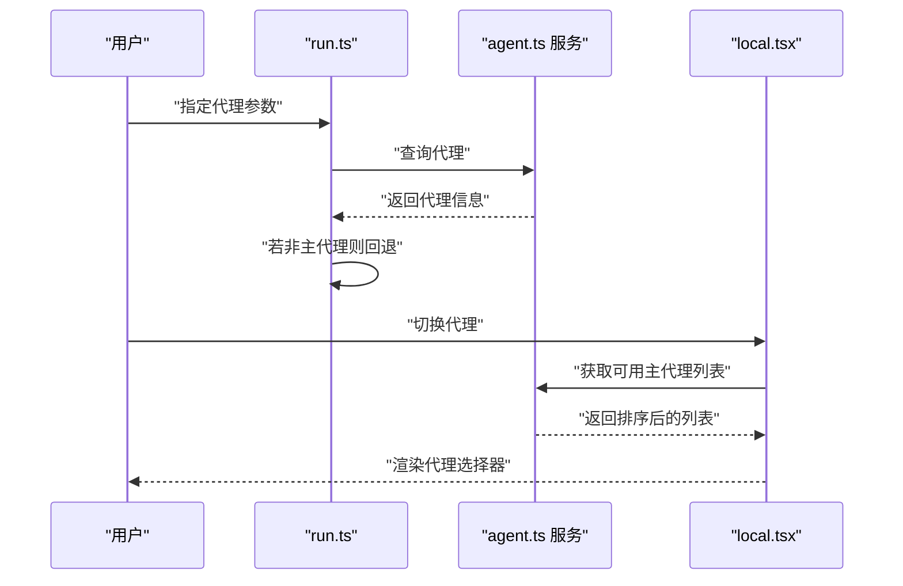
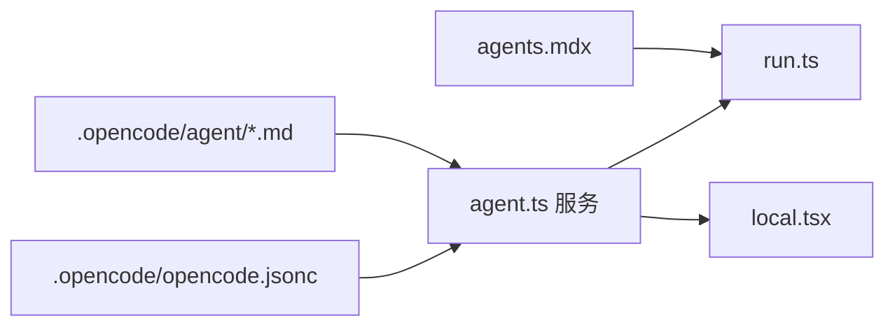

# General 代理

<cite>
**本文引用的文件**
- [README.md](file://README.md)
- [AGENTS.md](file://AGENTS.md)
- [.opencode/opencode.jsonc](file://.opencode/opencode.jsonc)
- [packages/opencode/src/agent/agent.ts](file://packages/opencode/src/agent/agent.ts)
- [packages/opencode/src/cli/cmd/run.ts](file://packages/opencode/src/cli/cmd/run.ts)
- [packages/opencode/src/cli/cmd/tui/context/local.tsx](file://packages/opencode/src/cli/cmd/tui/context/local.tsx)
- [packages/opencode/src/cli/cmd/tui/routes/session/dialog-subagent.tsx](file://packages/opencode/src/cli/cmd/tui/routes/session/dialog-subagent.tsx)
- [packages/web/src/content/docs/agents.mdx](file://packages/web/src/content/docs/agents.mdx)
- [.opencode/agent/duplicate-pr.md](file://.opencode/agent/duplicate-pr.md)
- [.opencode/agent/triage.md](file://.opencode/agent/triage.md)
- [.opencode/agent/translator.md](file://.opencode/agent/translator.md)
- [packages/opencode/test/agent/agent.test.ts](file://packages/opencode/test/agent/agent.test.ts)
</cite>

## 目录
1. [简介](#简介)
2. [项目结构](#项目结构)
3. [核心组件](#核心组件)
4. [架构总览](#架构总览)
5. [详细组件分析](#详细组件分析)
6. [依赖分析](#依赖分析)
7. [性能考虑](#性能考虑)
8. [故障排查指南](#故障排查指南)
9. [结论](#结论)
10. [附录](#附录)

## 简介
本文件面向 OpenCode 的 General 代理（子代理），系统性阐述其通用任务处理能力与灵活性，解释其在多场景下的适配性与实用性，并对比其与专用代理（如 build、plan、duplicate-pr、triage、translator 等）的关系。General 代理用于复杂搜索与多步任务，既可由系统内部调用，也可通过消息中的特定标记触发，是 OpenCode 提供的“通用型”智能助手能力的载体。

## 项目结构
OpenCode 将“代理”以配置与文档形式组织在 .opencode 目录下，同时在运行时通过服务层暴露统一接口；TUI 与命令行提供交互入口；Web 文档给出使用示例与最佳实践。

**图表来源**
- [.opencode/opencode.jsonc:1-19](file://.opencode/opencode.jsonc#L1-L19)
- [packages/opencode/src/agent/agent.ts:26-66](file://packages/opencode/src/agent/agent.ts#L26-L66)
- [packages/opencode/src/cli/cmd/run.ts:580-627](file://packages/opencode/src/cli/cmd/run.ts#L580-L627)
- [packages/opencode/src/cli/cmd/tui/context/local.tsx:37-83](file://packages/opencode/src/cli/cmd/tui/context/local.tsx#L37-L83)
- [packages/opencode/src/cli/cmd/tui/routes/session/dialog-subagent.tsx:1-26](file://packages/opencode/src/cli/cmd/tui/routes/session/dialog-subagent.tsx#L1-L26)
- [packages/web/src/content/docs/agents.mdx:119-119](file://packages/web/src/content/docs/agents.mdx#L119-L119)

**章节来源**
- [README.md:100-114](file://README.md#L100-L114)
- [.opencode/opencode.jsonc:1-19](file://.opencode/opencode.jsonc#L1-L19)

## 核心组件
- 代理服务接口与默认代理选择逻辑：提供获取、列举与默认代理选择能力，确保仅返回主代理（primary）且可见（非隐藏）。
- 命令行与 TUI 入口：支持在命令行指定代理或回退到默认代理；TUI 支持切换当前代理并渲染颜色标识。
- 子代理机制：子代理（subagent）不可直接作为主代理使用，但可通过内部流程或特定入口进行会话管理与动作选择。
- 专用代理示例：duplicate-pr、triage、translator 等，体现专用代理在特定领域的高内聚能力，与 General 代理形成互补。

**章节来源**
- [packages/opencode/src/agent/agent.ts:26-66](file://packages/opencode/src/agent/agent.ts#L26-L66)
- [packages/opencode/src/agent/agent.ts:297-317](file://packages/opencode/src/agent/agent.ts#L297-L317)
- [packages/opencode/src/cli/cmd/run.ts:580-627](file://packages/opencode/src/cli/cmd/run.ts#L580-L627)
- [packages/opencode/src/cli/cmd/tui/context/local.tsx:37-83](file://packages/opencode/src/cli/cmd/tui/context/local.tsx#L37-L83)
- [.opencode/agent/duplicate-pr.md:1-27](file://.opencode/agent/duplicate-pr.md#L1-L27)
- [.opencode/agent/triage.md:1-141](file://.opencode/agent/triage.md#L1-L141)
- [.opencode/agent/translator.md:1-800](file://.opencode/agent/translator.md#L1-L800)

## 架构总览
General 代理的调用路径通常如下：用户在消息中输入触发标记，系统解析后进入会话流程；若需要复杂检索或多步操作，则委托给 General 代理执行；最终结果返回给用户界面或命令行输出。

**图表来源**
- [packages/opencode/src/cli/cmd/run.ts:580-627](file://packages/opencode/src/cli/cmd/run.ts#L580-L627)
- [packages/opencode/src/agent/agent.ts:26-66](file://packages/opencode/src/agent/agent.ts#L26-L66)
- [packages/opencode/src/agent/agent.ts:297-317](file://packages/opencode/src/agent/agent.ts#L297-L317)
- [packages/opencode/src/cli/cmd/tui/context/local.tsx:37-83](file://packages/opencode/src/cli/cmd/tui/context/local.tsx#L37-L83)
- [packages/web/src/content/docs/agents.mdx:119-119](file://packages/web/src/content/docs/agents.mdx#L119-L119)

## 详细组件分析

### General 代理：定位与适用场景
- 定位：用于复杂搜索与多步任务，既可用于内部流程，也可通过消息中的触发标记调用。
- 适用场景举例：
  - 复杂检索：结合工具与上下文进行跨文件/跨模块搜索与关联分析。
  - 多步任务编排：将大任务拆解为若干步骤，逐步推进并汇总结果。
  - 通用问答与解释：对用户提出的问题提供结构化解释与演示思路。
- 与专用代理的互补关系：
  - duplicate-pr：专注重复 PR 检测，规则明确、工具专一。
  - triage：专注 Issue 分类与路由，具备标签与负责人映射。
  - translator：专注本地化翻译，保留技术术语与格式。
  - build/plan：专注开发工作流与只读分析，侧重安全与权限控制。
  - General 代理则在上述专用能力之外，提供更灵活的任务编排与通用解释能力，适合“兜底”的复杂任务。

**章节来源**
- [README.md:100-114](file://README.md#L100-L114)
- [.opencode/agent/duplicate-pr.md:1-27](file://.opencode/agent/duplicate-pr.md#L1-L27)
- [.opencode/agent/triage.md:1-141](file://.opencode/agent/triage.md#L1-L141)
- [.opencode/agent/translator.md:1-800](file://.opencode/agent/translator.md#L1-L800)

### 代理服务与默认代理选择
- 接口职责：
  - 获取指定代理信息
  - 列举可用代理（主代理优先）
  - 计算默认代理：优先使用配置中的默认代理，否则选择首个可见主代理
- 错误处理：
  - 默认代理指向隐藏代理或不存在时抛出错误
  - 当所有主代理均被禁用时抛出错误

**图表来源**
- [packages/opencode/src/agent/agent.ts:297-317](file://packages/opencode/src/agent/agent.ts#L297-L317)

**章节来源**
- [packages/opencode/src/agent/agent.ts:26-66](file://packages/opencode/src/agent/agent.ts#L26-L66)
- [packages/opencode/src/agent/agent.ts:297-317](file://packages/opencode/src/agent/agent.ts#L297-L317)
- [packages/opencode/test/agent/agent.test.ts:361-413](file://packages/opencode/test/agent/agent.test.ts#L361-L413)
- [packages/opencode/test/agent/agent.test.ts:655-717](file://packages/opencode/test/agent/agent.test.ts#L655-L717)

### 命令行与 TUI 中的代理选择
- 命令行入口：
  - 支持通过参数指定代理；若指定的是子代理或不存在，则回退到默认代理
- TUI 上下文：
  - 过滤出非子代理且未隐藏的代理
  - 维护当前代理状态，支持循环切换与颜色标识
  - 提供代理列表排序（默认代理置首）

**图表来源**
- [packages/opencode/src/cli/cmd/run.ts:580-627](file://packages/opencode/src/cli/cmd/run.ts#L580-L627)
- [packages/opencode/src/cli/cmd/tui/context/local.tsx:37-83](file://packages/opencode/src/cli/cmd/tui/context/local.tsx#L37-L83)
- [packages/opencode/src/agent/agent.ts:26-66](file://packages/opencode/src/agent/agent.ts#L26-L66)

**章节来源**
- [packages/opencode/src/cli/cmd/run.ts:580-627](file://packages/opencode/src/cli/cmd/run.ts#L580-L627)
- [packages/opencode/src/cli/cmd/tui/context/local.tsx:37-83](file://packages/opencode/src/cli/cmd/tui/context/local.tsx#L37-L83)

### 子代理对话框与动作
- 子代理不可直接作为主代理使用，但可在会话中以“子代理动作”打开其专属会话视图
- 该机制为 General 代理的内部协作提供了会话隔离与可视化入口

**章节来源**
- [packages/opencode/src/cli/cmd/tui/routes/session/dialog-subagent.tsx:1-26](file://packages/opencode/src/cli/cmd/tui/routes/session/dialog-subagent.tsx#L1-L26)

### 使用示例与最佳实践
- 在消息中使用触发标记调用 General 代理，例如在官方文档示例中展示的复杂搜索场景
- 结合工具与权限配置，确保 General 代理在需要时能访问必要的工具与资源
- 在 TUI 或命令行中切换代理，观察不同代理在相同任务上的差异表现

**章节来源**
- [packages/web/src/content/docs/agents.mdx:119-119](file://packages/web/src/content/docs/agents.mdx#L119-L119)
- [.opencode/opencode.jsonc:14-18](file://.opencode/opencode.jsonc#L14-L18)

## 依赖分析
- 配置与权限：
  - .opencode/opencode.jsonc 控制工具开关与权限策略，间接影响 General 代理可使用的工具集
- 代理定义：
  - .opencode/agent/*.md 定义专用代理的行为与工具授权，与 General 代理形成互补
- 运行时依赖：
  - 代理服务接口与默认代理选择逻辑为命令行与 TUI 提供统一的代理选择与校验
- 文档与示例：
  - 官方文档提供使用示例，指导用户在何种场景下选择 General 代理

**图表来源**
- [.opencode/opencode.jsonc:1-19](file://.opencode/opencode.jsonc#L1-L19)
- [.opencode/agent/duplicate-pr.md:1-27](file://.opencode/agent/duplicate-pr.md#L1-L27)
- [.opencode/agent/triage.md:1-141](file://.opencode/agent/triage.md#L1-L141)
- [.opencode/agent/translator.md:1-800](file://.opencode/agent/translator.md#L1-L800)
- [packages/opencode/src/agent/agent.ts:26-66](file://packages/opencode/src/agent/agent.ts#L26-L66)
- [packages/opencode/src/cli/cmd/run.ts:580-627](file://packages/opencode/src/cli/cmd/run.ts#L580-L627)
- [packages/opencode/src/cli/cmd/tui/context/local.tsx:37-83](file://packages/opencode/src/cli/cmd/tui/context/local.tsx#L37-L83)
- [packages/web/src/content/docs/agents.mdx:119-119](file://packages/web/src/content/docs/agents.mdx#L119-L119)

**章节来源**
- [.opencode/opencode.jsonc:1-19](file://.opencode/opencode.jsonc#L1-L19)
- [.opencode/agent/duplicate-pr.md:1-27](file://.opencode/agent/duplicate-pr.md#L1-L27)
- [.opencode/agent/triage.md:1-141](file://.opencode/agent/triage.md#L1-L141)
- [.opencode/agent/translator.md:1-800](file://.opencode/agent/translator.md#L1-L800)
- [packages/opencode/src/agent/agent.ts:26-66](file://packages/opencode/src/agent/agent.ts#L26-L66)
- [packages/opencode/src/cli/cmd/run.ts:580-627](file://packages/opencode/src/cli/cmd/run.ts#L580-L627)
- [packages/opencode/src/cli/cmd/tui/context/local.tsx:37-83](file://packages/opencode/src/cli/cmd/tui/context/local.tsx#L37-L83)
- [packages/web/src/content/docs/agents.mdx:119-119](file://packages/web/src/content/docs/agents.mdx#L119-L119)

## 性能考虑
- 代理选择与校验：在命令行与 TUI 中应避免频繁查询代理列表，建议缓存当前可用代理集合
- 工具与权限：合理配置工具开关与权限，减少不必要的外部调用与失败重试
- 会话管理：子代理会话与主代理会话分离，有助于降低耦合并提升响应速度
- 日志与可观测性：在复杂任务中记录关键步骤与耗时点，便于后续优化

## 故障排查指南
- 默认代理不可用：
  - 检查配置中的默认代理是否指向隐藏或不存在的代理
  - 若所有主代理均被禁用，将无法选择默认代理
- 指定代理无效：
  - 子代理不可作为主代理使用，需回退到默认代理
  - 代理名称拼写错误或大小写不一致也会导致查找失败
- 权限与工具：
  - 确认工具开关与权限策略已正确配置，避免因权限不足导致任务中断

**章节来源**
- [packages/opencode/src/agent/agent.ts:297-317](file://packages/opencode/src/agent/agent.ts#L297-L317)
- [packages/opencode/src/cli/cmd/run.ts:580-627](file://packages/opencode/src/cli/cmd/run.ts#L580-L627)
- [packages/opencode/test/agent/agent.test.ts:655-717](file://packages/opencode/test/agent/agent.test.ts#L655-L717)

## 结论
General 代理作为 OpenCode 的通用型子代理，适用于复杂搜索与多步任务场景，能够与专用代理形成互补：专用代理聚焦特定领域，而 General 代理提供灵活的任务编排与通用解释能力。通过合理的配置、权限与工具开关，以及在命令行与 TUI 中的正确使用，用户可以在日常开发工作中高效地利用 General 代理完成多样化任务。

## 附录
- 关键参考路径：
  - 代理服务接口与默认代理选择：[packages/opencode/src/agent/agent.ts:26-66](file://packages/opencode/src/agent/agent.ts#L26-L66), [packages/opencode/src/agent/agent.ts:297-317](file://packages/opencode/src/agent/agent.ts#L297-L317)
  - 命令行入口与代理选择回退：[packages/opencode/src/cli/cmd/run.ts:580-627](file://packages/opencode/src/cli/cmd/run.ts#L580-L627)
  - TUI 代理选择与颜色标识：[packages/opencode/src/cli/cmd/tui/context/local.tsx:37-83](file://packages/opencode/src/cli/cmd/tui/context/local.tsx#L37-L83)
  - 子代理会话入口：[packages/opencode/src/cli/cmd/tui/routes/session/dialog-subagent.tsx:1-26](file://packages/opencode/src/cli/cmd/tui/routes/session/dialog-subagent.tsx#L1-L26)
  - 官方使用示例：[packages/web/src/content/docs/agents.mdx:119-119](file://packages/web/src/content/docs/agents.mdx#L119-L119)
  - 专用代理示例：[.opencode/agent/duplicate-pr.md:1-27](file://.opencode/agent/duplicate-pr.md#L1-L27), [.opencode/agent/triage.md:1-141](file://.opencode/agent/triage.md#L1-L141), [.opencode/agent/translator.md:1-800](file://.opencode/agent/translator.md#L1-L800)
  - 配置与权限：[.opencode/opencode.jsonc:1-19](file://.opencode/opencode.jsonc#L1-L19)