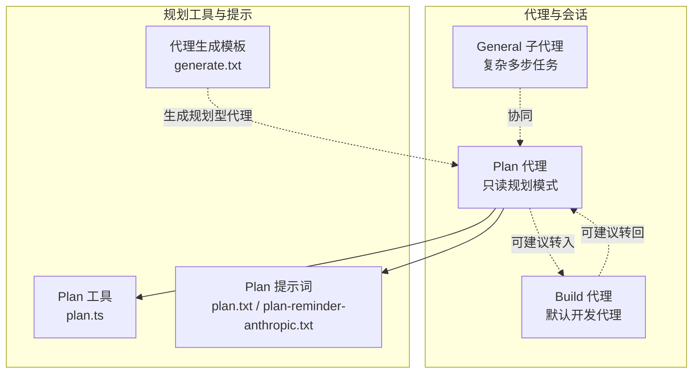
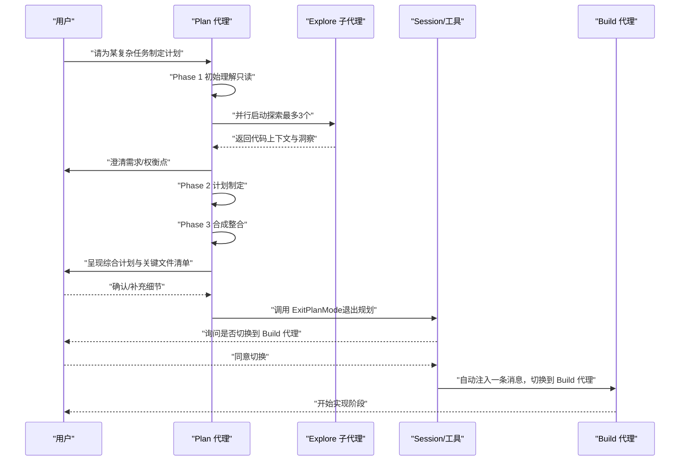
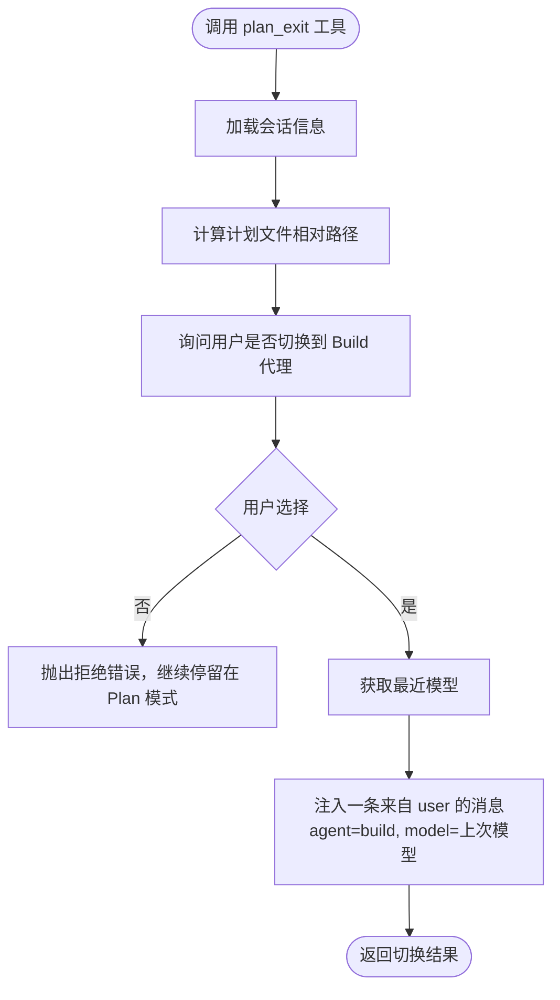
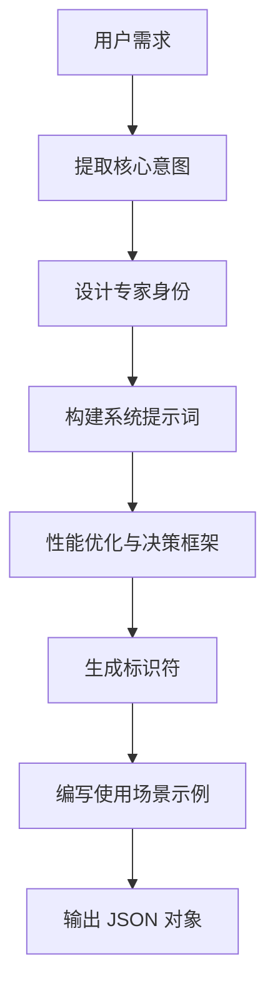
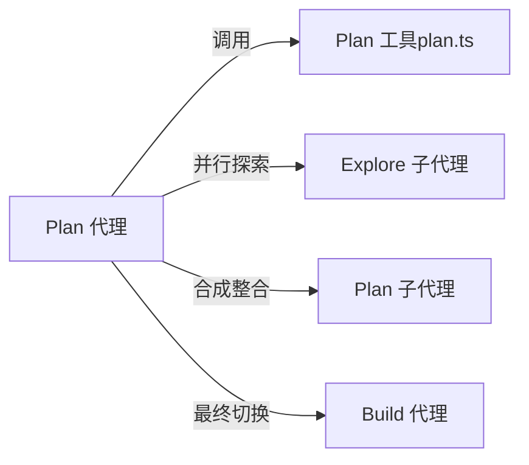

# Plan 代理

<cite>
**本文引用的文件**
- [README.md](file://README.md)
- [AGENTS.md](file://AGENTS.md)
- [generate.txt](file://packages/opencode/src/agent/generate.txt)
- [plan.txt](file://packages/opencode/src/session/prompt/plan.txt)
- [plan-reminder-anthropic.txt](file://packages/opencode/src/session/prompt/plan-reminder-anthropic.txt)
- [plan.ts](file://packages/opencode/src/tool/plan.ts)
- [plan-enter.txt](file://packages/opencode/src/tool/plan-enter.txt)
- [plan-exit.txt](file://packages/opencode/src/tool/plan-exit.txt)
</cite>

## 目录
1. [简介](#简介)
2. [项目结构](#项目结构)
3. [核心组件](#核心组件)
4. [架构总览](#架构总览)
5. [详细组件分析](#详细组件分析)
6. [依赖关系分析](#依赖关系分析)
7. [性能考量](#性能考量)
8. [故障排查指南](#故障排查指南)
9. [结论](#结论)
10. [附录](#附录)

## 简介
本文件系统性阐述 OpenCode Plan 代理的能力与使用方法，重点覆盖以下方面：
- 规划模式的限制与约束：只读、禁止修改文件与系统、必须先形成可执行计划再进入实现阶段。
- 专业能力：项目规划、任务分解、流程设计、跨视角协同（探索与合成）。
- generate.txt 模板在“规划型代理”生成中的作用与实现原理：如何将用户需求转化为可操作的系统提示词与使用场景。
- 实际规划案例与使用场景：从复杂重构到多模块变更的设计流程。
- 与其他代理的差异化：与 build 代理、general 子代理的边界与适用情境。

## 项目结构
OpenCode 提供两类内置代理：build（默认全权限开发代理）与 plan（只读规划代理）。Plan 代理通过会话提示词与工具链实现“先规划、后实施”的工作流，并以只读约束确保安全可控。

图表来源
- [plan.txt:1-27](file://packages/opencode/src/session/prompt/plan.txt#L1-L27)
- [plan-reminder-anthropic.txt:1-68](file://packages/opencode/src/session/prompt/plan-reminder-anthropic.txt#L1-L68)
- [plan.ts:1-132](file://packages/opencode/src/tool/plan.ts#L1-L132)
- [generate.txt:1-76](file://packages/opencode/src/agent/generate.txt#L1-L76)

章节来源
- [README.md:100-114](file://README.md#L100-L114)

## 核心组件
- 规划模式系统提醒与只读约束：明确禁止任何文件或系统修改，强调“观察、分析、规划”的职责边界。
- 规划工作流（Phase 1~5）：初始理解 → 计划制定 → 合成整合 → 最终计划 → 结束规划。
- Plan 工具链：提供“退出规划模式”工具，引导用户在完成计划后切换至 build 代理进行实现；保留“进入规划模式”的工具定义以便后续启用。
- 代理生成模板（generate.txt）：用于生成“规划型代理”的系统提示词与使用场景，确保代理具备独立、可执行的规划能力。

章节来源
- [plan.txt:1-27](file://packages/opencode/src/session/prompt/plan.txt#L1-L27)
- [plan-reminder-anthropic.txt:1-68](file://packages/opencode/src/session/prompt/plan-reminder-anthropic.txt#L1-L68)
- [plan.ts:1-132](file://packages/opencode/src/tool/plan.ts#L1-L132)
- [generate.txt:1-76](file://packages/opencode/src/agent/generate.txt#L1-L76)

## 架构总览
Plan 代理的运行时架构围绕“只读规划 + 工具驱动切换”展开。其核心流程如下：

图表来源
- [plan-reminder-anthropic.txt:18-67](file://packages/opencode/src/session/prompt/plan-reminder-anthropic.txt#L18-L67)
- [plan.ts:19-72](file://packages/opencode/src/tool/plan.ts#L19-L72)

## 详细组件分析

### 组件一：规划模式系统提醒与只读约束
- 职责边界：仅限“观察、分析、规划”，严禁任何文件/系统改动。
- 关键要点：
  - 明确禁止使用任何写入类命令或工具。
  - 用户若要求立即执行，Plan 代理必须拒绝并坚持只读。
  - 唯一允许编辑的文件是“最终推荐方案”的计划文件，且需遵循严格格式与内容要求。

章节来源
- [plan.txt:4-26](file://packages/opencode/src/session/prompt/plan.txt#L4-L26)

### 组件二：规划工作流（Phase 1~5）
- Phase 1：初始理解
  - 全面理解用户请求，必要时仅使用 Explore 子代理并行探索不同维度。
  - 使用 AskUserQuestion 工具澄清模糊点。
- Phase 2：计划制定
  - 基于背景与洞察，发起 Plan 子代理生成详细方案。
- Phase 3：合成整合
  - 汇总多视角方案，结合用户反馈，形成最终推荐方案。
- Phase 4：最终计划
  - 将推荐方案、理由、关键文件清单写入计划文件。
- Phase 5：结束规划
  - 调用 ExitPlanMode 并询问是否切换到 Build 代理进入实现。

章节来源
- [plan-reminder-anthropic.txt:20-67](file://packages/opencode/src/session/prompt/plan-reminder-anthropic.txt#L20-L67)

### 组件三：Plan 工具链（退出规划模式）
- 功能概述
  - 在完成计划后，向用户确认是否切换到 Build 代理。
  - 若用户同意，自动注入一条来自“user”角色的消息，指定 agent 为 “build”，并携带模型信息，触发会话状态切换。
- 行为细节
  - 读取最近一次使用的模型，保持上下文一致性。
  - 返回简洁的标题与输出，便于前端展示与用户确认。

图表来源
- [plan.ts:19-72](file://packages/opencode/src/tool/plan.ts#L19-L72)

章节来源
- [plan.ts:19-72](file://packages/opencode/src/tool/plan.ts#L19-L72)

### 组件四：代理生成模板（generate.txt）与规划型代理
- 目标：将用户需求转化为“可执行的规划型代理”，包含：
  - 核心意图提取、专家身份设定、系统提示词架构、性能优化策略、标识符设计、使用场景示例。
- 关键原则
  - 具体而非泛化；包含能澄清行为的具体示例。
  - 平衡完整性与清晰度；为代理提供处理变体所需的上下文。
  - 主动寻求澄清；内置质量保证与自我校验机制。
- 输出结构
  - identifier：唯一、描述性强、易记的标识符。
  - whenToUse：精确的触发条件与使用场景描述，包含示例。
  - systemPrompt：完整的第二人称系统提示词，结构化、高清晰度。

图表来源
- [generate.txt:5-76](file://packages/opencode/src/agent/generate.txt#L5-L76)

章节来源
- [generate.txt:1-76](file://packages/opencode/src/agent/generate.txt#L1-L76)

### 组件五：进入/退出规划模式的工具建议
- 进入规划模式（建议）
  - 当任务复杂、涉及多文件或多处架构决策时，建议先规划再实现。
  - 不适用于简单直接的任务。
- 退出规划模式（强制）
  - 必须在完成最终计划、澄清所有问题后方可退出。
  - 不可在未形成计划前切换。

章节来源
- [plan-enter.txt:1-15](file://packages/opencode/src/tool/plan-enter.txt#L1-L15)
- [plan-exit.txt:1-14](file://packages/opencode/src/tool/plan-exit.txt#L1-L14)

## 依赖关系分析
- Plan 代理依赖会话与工具链：通过 Session 与 MessageV2 更新消息，借助 Tool 定义实现“退出规划模式”的自动化切换。
- 与 Explore/Plan 子代理的协作：在规划阶段并行使用 Explore 子代理收集上下文，在合成阶段汇总多视角方案。
- 与 Build 代理的衔接：通过 plan_exit 工具自动注入“user”消息并指定 agent=build，实现平滑过渡。

图表来源
- [plan.ts:19-72](file://packages/opencode/src/tool/plan.ts#L19-L72)
- [plan-reminder-anthropic.txt:20-67](file://packages/opencode/src/session/prompt/plan-reminder-anthropic.txt#L20-L67)

章节来源
- [plan.ts:1-132](file://packages/opencode/src/tool/plan.ts#L1-L132)
- [plan-reminder-anthropic.txt:1-68](file://packages/opencode/src/session/prompt/plan-reminder-anthropic.txt#L1-L68)

## 性能考量
- 并行探索：在 Phase 1 中最多启动 3 个 Explore 子代理，聚焦不同维度，减少重复劳动，提升理解效率。
- 最小工具集：只在必要时调用工具，避免冗余交互；在只读模式下优先使用“只读工具”。
- 逐步细化：通过 AskUserQuestion 工具在早期澄清需求，降低后期返工概率。
- 自动切换：plan_exit 工具在确认后自动注入消息，减少手动操作与上下文丢失风险。

## 故障排查指南
- 症状：尝试在 Plan 模式中修改文件或运行非只读命令
  - 处理：严格遵守只读约束；如需实现，请先完成最终计划并通过 plan_exit 切换到 Build 代理。
  - 参考：[plan.txt:4-9](file://packages/opencode/src/session/prompt/plan.txt#L4-L9)
- 症状：提前退出规划模式
  - 处理：确保已形成最终计划、已澄清所有问题后再调用 ExitPlanMode；否则工具会拒绝切换。
  - 参考：[plan-exit.txt:10-14](file://packages/opencode/src/tool/plan-exit.txt#L10-L14)
- 症状：需要重新进入规划模式
  - 处理：当前仓库中提供“进入规划模式”的工具定义（注释保留），可按需启用；或通过对话引导再次进入只读规划。
  - 参考：[plan.ts:74-131](file://packages/opencode/src/tool/plan.ts#L74-L131)

章节来源
- [plan.txt:4-26](file://packages/opencode/src/session/prompt/plan.txt#L4-L26)
- [plan-exit.txt:10-14](file://packages/opencode/src/tool/plan-exit.txt#L10-L14)
- [plan.ts:74-131](file://packages/opencode/src/tool/plan.ts#L74-L131)

## 结论
Plan 代理通过严格的只读约束与结构化规划流程，将复杂项目管理拆解为“理解—探索—计划—合成—实现”的闭环。generate.txt 模板为生成“规划型代理”提供了标准化范式，确保代理具备独立、可执行的规划能力。在需要多模块协调、架构权衡与风险控制的场景中，Plan 代理尤为适用；而当需要快速落地实现时，则应通过 plan_exit 工具切换到 Build 代理。

## 附录

### 实际规划案例与使用场景
- 场景一：重构大型模块
  - 步骤：进入 Plan 模式 → 并行探索现有实现、测试模式、相关配置 → 明确重构目标与影响范围 → 形成最终计划 → 切换到 Build 实施。
  - 参考：[plan-reminder-anthropic.txt:20-67](file://packages/opencode/src/session/prompt/plan-reminder-anthropic.txt#L20-L67)
- 场景二：引入新特性但不确定实现路径
  - 步骤：进入 Plan 模式 → 探索相似实现与最佳实践 → 设计最小可行方案 → 征求用户意见 → 写入最终计划 → 切换到 Build。
  - 参考：[plan-reminder-anthropic.txt:35-50](file://packages/opencode/src/session/prompt/plan-reminder-anthropic.txt#L35-L50)
- 场景三：多文件联动变更
  - 步骤：进入 Plan 模式 → 分别探索接口层、服务层、持久化层 → 合成一致的变更方案 → 明确关键文件 → 写入计划 → 切换到 Build。
  - 参考：[plan-reminder-anthropic.txt:26-32](file://packages/opencode/src/session/prompt/plan-reminder-anthropic.txt#L26-L32)

### 与其他代理的差异化
- 与 Build 代理
  - Plan 代理：只读、禁止修改、专注规划；适合复杂任务的前期设计与风险评估。
  - Build 代理：默认全权限，负责实现与变更；适合在 Plan 代理产出可执行计划后进行落地。
  - 参考：[README.md:100-114](file://README.md#L100-L114)
- 与 General 子代理
  - Plan 代理：面向“规划—实现”的单次闭环，强调最终计划与文件清单。
  - General 子代理：面向复杂多步骤任务的内部协调，适合长链路任务编排。
  - 参考：[README.md:110-111](file://README.md#L110-L111)