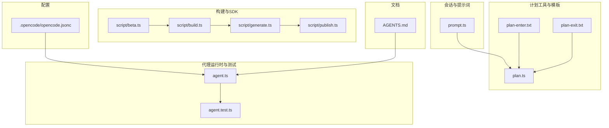
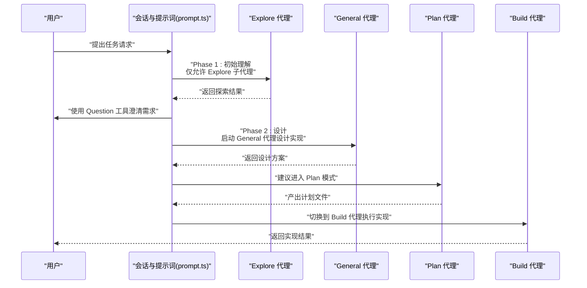
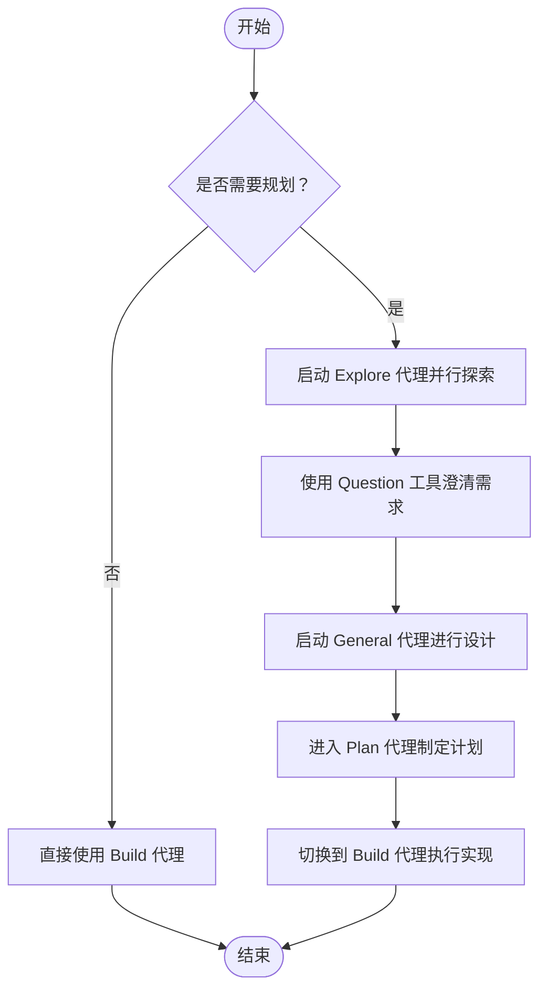
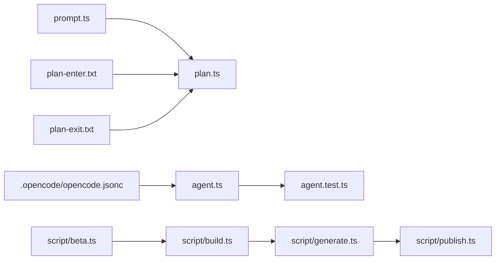

# 内置代理详解

<cite>
**本文引用的文件**
- [AGENTS.md](file://AGENTS.md)
- [.opencode/opencode.jsonc](file://.opencode/opencode.jsonc)
- [packages/opencode/src/session/prompt.ts](file://packages/opencode/src/session/prompt.ts)
- [packages/opencode/src/tool/plan-enter.txt](file://packages/opencode/src/tool/plan-enter.txt)
- [packages/opencode/src/tool/plan-exit.txt](file://packages/opencode/src/tool/plan-exit.txt)
- [packages/opencode/src/tool/plan.ts](file://packages/opencode/src/tool/plan.ts)
- [packages/opencode/src/agent/agent.ts](file://packages/opencode/src/agent/agent.ts)
- [packages/opencode/test/agent/agent.test.ts](file://packages/opencode/test/agent/agent.test.ts)
- [packages/opencode/script/build.ts](file://packages/opencode/script/build.ts)
- [script/beta.ts](file://script/beta.ts)
- [script/generate.ts](file://script/generate.ts)
- [script/publish.ts](file://script/publish.ts)
</cite>

## 目录
1. [简介](#简介)
2. [项目结构](#项目结构)
3. [核心组件](#核心组件)
4. [架构总览](#架构总览)
5. [详细组件分析](#详细组件分析)
6. [依赖关系分析](#依赖关系分析)
7. [性能考量](#性能考量)
8. [故障排查指南](#故障排查指南)
9. [结论](#结论)
10. [附录](#附录)

## 简介
本文件面向 OpenCode 的内置代理体系，系统性梳理四类核心代理的能力边界与使用策略，并结合提示词模板与工作流设计，帮助用户在不同任务场景中做出正确的代理选择与配置。重点覆盖以下主题：
- 四种内置代理的职责与典型用法：build 代理的默认执行能力、plan 代理的规划模式限制、general 代理的通用任务处理、explore 代理的代码库探索功能
- 提示词模板的设计原理与应用场景：compaction.txt、explore.txt、summary.txt、title.txt 等
- 代理之间的协作流程与切换策略
- 实际使用案例与最佳实践
- 常见问题与排障建议

## 项目结构
OpenCode 的代理相关代码主要集中在以下位置：
- 会话与提示词：packages/opencode/src/session/prompt.ts
- 计划工具与模板：packages/opencode/src/tool/plan.ts、packages/opencode/src/tool/plan-enter.txt、packages/opencode/src/tool/plan-exit.txt
- 代理运行时与测试：packages/opencode/src/agent/agent.ts、packages/opencode/test/agent/agent.test.ts
- 构建脚本与 SDK 生成：packages/opencode/script/build.ts、script/generate.ts、script/publish.ts、script/beta.ts
- 配置与权限：.opencode/opencode.jsonc
- 代理文档与风格指南：AGENTS.md

图表来源
- [packages/opencode/src/session/prompt.ts:319-339](file://packages/opencode/src/session/prompt.ts#L319-L339)
- [packages/opencode/src/tool/plan.ts:82-131](file://packages/opencode/src/tool/plan.ts#L82-L131)
- [packages/opencode/src/tool/plan-enter.txt:1-14](file://packages/opencode/src/tool/plan-enter.txt#L1-L14)
- [packages/opencode/src/tool/plan-exit.txt:1-13](file://packages/opencode/src/tool/plan-exit.txt#L1-L13)
- [packages/opencode/src/agent/agent.ts](file://packages/opencode/src/agent/agent.ts)
- [packages/opencode/test/agent/agent.test.ts:246-298](file://packages/opencode/test/agent/agent.test.ts#L246-L298)
- [packages/opencode/script/build.ts:24-28](file://packages/opencode/script/build.ts#L24-L28)
- [script/generate.ts:1](file://script/generate.ts#L1)
- [script/publish.ts:57](file://script/publish.ts#L57)
- [script/beta.ts:75](file://script/beta.ts#L75)
- [.opencode/opencode.jsonc:1-19](file://.opencode/opencode.jsonc#L1-L19)
- [AGENTS.md:1-129](file://AGENTS.md#L1-L129)

章节来源
- [AGENTS.md:1-129](file://AGENTS.md#L1-L129)
- [.opencode/opencode.jsonc:1-19](file://.opencode/opencode.jsonc#L1-L19)

## 核心组件
本节从“代理类型”“工作流角色”“配置与约束”三个维度，对四种内置代理进行概览式说明。

- build 代理
  - 角色定位：默认执行者，负责在获得明确计划后进行代码实现与变更。
  - 关键特性：支持通过配置项调整步数上限；可被其他代理触发进入实现阶段。
  - 典型场景：当 plan 代理产出可执行计划后，由 build 代理落地实现。

- plan 代理
  - 角色定位：规划与设计阶段的主导者，强调“先研究、再设计、后实现”的流程。
  - 关键特性：受“规划模式限制”，需在特定阶段使用；可通过工具引导进入/退出该模式。
  - 典型场景：复杂需求、多文件改动、架构决策前的充分探索与设计。

- general 代理
  - 角色定位：通用任务处理者，用于在规划阶段或实现阶段进行设计、澄清与辅助。
  - 关键特性：可并行启动，数量受工作流约束；适合在探索与设计之间穿插使用。
  - 典型场景：澄清需求、设计实现方案、生成文档片段等。

- explore 代理
  - 角色定位：代码库探索者，专注于快速理解现有代码、定位相关模块与模式。
  - 关键特性：在初始理解阶段必须使用；可并行启动多个以覆盖不同关注点。
  - 典型场景：新需求涉及未知领域、需要快速扫描与归纳现有实现。

章节来源
- [packages/opencode/src/session/prompt.ts:319-339](file://packages/opencode/src/session/prompt.ts#L319-L339)
- [packages/opencode/test/agent/agent.test.ts:246-298](file://packages/opencode/test/agent/agent.test.ts#L246-L298)

## 架构总览
下图展示了 OpenCode 代理在一次典型任务中的协作关系与切换路径。该流程基于会话提示词与计划工具的协同，确保“探索—设计—实现”的闭环。

图表来源
- [packages/opencode/src/session/prompt.ts:319-339](file://packages/opencode/src/session/prompt.ts#L319-L339)
- [packages/opencode/src/tool/plan-enter.txt:1-14](file://packages/opencode/src/tool/plan-enter.txt#L1-L14)
- [packages/opencode/src/tool/plan-exit.txt:1-13](file://packages/opencode/src/tool/plan-exit.txt#L1-L13)
- [packages/opencode/src/tool/plan.ts:82-131](file://packages/opencode/src/tool/plan.ts#L82-L131)

## 详细组件分析

### build 代理：默认执行能力
- 职责边界
  - 在获得明确计划后，承担代码实现与变更的执行职责。
  - 可通过配置项控制最大步数，避免无界执行。
- 关键实现点
  - 测试验证了配置项对步骤属性的影响，体现其作为默认执行者的可配置性。
- 使用建议
  - 当任务明确且计划完整时优先使用；若任务仍需探索或设计，应先切换到 plan 或 general。

章节来源
- [packages/opencode/test/agent/agent.test.ts:246-264](file://packages/opencode/test/agent/agent.test.ts#L246-L264)

### plan 代理：规划模式限制
- 职责边界
  - 专门负责“研究—设计—规划”，强调在实现前完成充分的探索与设计。
  - 受“规划模式限制”，不能直接进行代码实现。
- 关键实现点
  - 通过计划工具在合适时机引导用户进入/退出规划模式。
  - 会话提示词定义了规划阶段的两阶段流程与并行策略。
- 使用建议
  - 复杂任务、多文件改动、需要架构设计时使用；避免在规划未完成时直接进入实现。

图表来源
- [packages/opencode/src/session/prompt.ts:319-339](file://packages/opencode/src/session/prompt.ts#L319-L339)
- [packages/opencode/src/tool/plan-enter.txt:1-14](file://packages/opencode/src/tool/plan-enter.txt#L1-L14)
- [packages/opencode/src/tool/plan-exit.txt:1-13](file://packages/opencode/src/tool/plan-exit.txt#L1-L13)
- [packages/opencode/src/tool/plan.ts:82-131](file://packages/opencode/src/tool/plan.ts#L82-L131)

章节来源
- [packages/opencode/src/session/prompt.ts:319-339](file://packages/opencode/src/session/prompt.ts#L319-L339)
- [packages/opencode/src/tool/plan-enter.txt:1-14](file://packages/opencode/src/tool/plan-enter.txt#L1-L14)
- [packages/opencode/src/tool/plan-exit.txt:1-13](file://packages/opencode/src/tool/plan-exit.txt#L1-L13)
- [packages/opencode/src/tool/plan.ts:82-131](file://packages/opencode/src/tool/plan.ts#L82-L131)

### general 代理：通用任务处理
- 职责边界
  - 在探索与设计之间提供通用能力，如澄清意图、生成文档片段、辅助设计等。
  - 可并行启动，数量受工作流约束。
- 使用建议
  - 在探索阶段用于快速理解上下文，在设计阶段用于生成方案与文档草稿。

章节来源
- [packages/opencode/src/session/prompt.ts:319-339](file://packages/opencode/src/session/prompt.ts#L319-L339)

### explore 代理：代码库探索功能
- 职责边界
  - 在初始理解阶段必须使用，负责快速扫描与归纳现有实现，定位相关模块与模式。
  - 支持并行探索，覆盖不同关注点，但数量有限制。
- 使用建议
  - 新需求涉及未知领域时优先使用；与 general/plan 协作，形成“探索—设计—规划—实现”的闭环。

章节来源
- [packages/opencode/src/session/prompt.ts:319-339](file://packages/opencode/src/session/prompt.ts#L319-L339)

### 提示词模板与设计原理
- compaction.txt
  - 用途：在需要压缩或精简信息时，指导模型输出更紧凑、聚焦的描述。
  - 设计原则：强调“去冗余、突出要点”，适用于总结与提炼场景。
- explore.txt
  - 用途：驱动 explore 代理进行代码库探索，聚焦于理解现有实现与模式。
  - 设计原则：强调“并行探索、最小数量、最大覆盖”，避免过度分散。
- summary.txt
  - 用途：生成阶段性摘要，便于在探索与设计之间传递上下文。
  - 设计原则：强调“结构化、可读性强、便于后续检索”。
- title.txt
  - 用途：为计划或报告生成标题，确保命名清晰、语义明确。
  - 设计原则：强调“简洁、准确、可追溯”。

章节来源
- [packages/opencode/src/session/prompt.ts:319-339](file://packages/opencode/src/session/prompt.ts#L319-L339)

### 代理选择策略与最佳实践
- 何时使用 explore
  - 当任务涉及未知模块、需要快速理解现状时，优先启动 1–3 个 explore 代理并行探索。
- 何时使用 general
  - 在探索之后用于澄清需求、生成设计草案、准备计划文件。
- 何时使用 plan
  - 当任务复杂、需要多文件改动或架构设计时，进入规划模式，产出可执行计划。
- 何时使用 build
  - 当计划明确、目标单一且无需进一步探索时，切换到 build 代理执行实现。
- 最佳实践
  - 明确阶段边界：探索—设计—规划—实现，避免跨阶段混用。
  - 控制并行数量：探索阶段最多 3 个代理，设计阶段通常 1 个即可。
  - 使用工具引导：通过计划工具在合适时机进入/退出规划模式。

章节来源
- [packages/opencode/src/session/prompt.ts:319-339](file://packages/opencode/src/session/prompt.ts#L319-L339)
- [packages/opencode/src/tool/plan-enter.txt:1-14](file://packages/opencode/src/tool/plan-enter.txt#L1-L14)
- [packages/opencode/src/tool/plan-exit.txt:1-13](file://packages/opencode/src/tool/plan-exit.txt#L1-L13)

## 依赖关系分析
- 会话与提示词（prompt.ts）定义了代理的工作流与阶段划分，是代理协作的契约。
- 计划工具（plan.ts、plan-enter.txt、plan-exit.txt）提供了进入/退出规划模式的机制。
- 代理运行时（agent.ts）承载代理实例化与生命周期管理。
- 测试（agent.test.ts）验证了代理配置、默认代理选择与模式约束。
- 构建与 SDK 生成脚本（script/build.ts、script/generate.ts、script/publish.ts、script/beta.ts）支撑开发与发布流程，间接影响代理的可用性与稳定性。
- 配置（opencode.jsonc）定义了权限与工具开关，影响代理可使用的资源范围。

图表来源
- [packages/opencode/src/session/prompt.ts:319-339](file://packages/opencode/src/session/prompt.ts#L319-L339)
- [packages/opencode/src/tool/plan.ts:82-131](file://packages/opencode/src/tool/plan.ts#L82-L131)
- [packages/opencode/src/tool/plan-enter.txt:1-14](file://packages/opencode/src/tool/plan-enter.txt#L1-L14)
- [packages/opencode/src/tool/plan-exit.txt:1-13](file://packages/opencode/src/tool/plan-exit.txt#L1-L13)
- [packages/opencode/src/agent/agent.ts](file://packages/opencode/src/agent/agent.ts)
- [packages/opencode/test/agent/agent.test.ts:246-298](file://packages/opencode/test/agent/agent.test.ts#L246-L298)
- [packages/opencode/script/build.ts:24-28](file://packages/opencode/script/build.ts#L24-L28)
- [script/generate.ts:1](file://script/generate.ts#L1)
- [script/publish.ts:57](file://script/publish.ts#L57)
- [script/beta.ts:75](file://script/beta.ts#L75)
- [.opencode/opencode.jsonc:1-19](file://.opencode/opencode.jsonc#L1-L19)

章节来源
- [packages/opencode/src/session/prompt.ts:319-339](file://packages/opencode/src/session/prompt.ts#L319-L339)
- [packages/opencode/src/tool/plan.ts:82-131](file://packages/opencode/src/tool/plan.ts#L82-L131)
- [packages/opencode/src/agent/agent.ts](file://packages/opencode/src/agent/agent.ts)
- [packages/opencode/test/agent/agent.test.ts:246-298](file://packages/opencode/test/agent/agent.test.ts#L246-L298)
- [packages/opencode/script/build.ts:24-28](file://packages/opencode/script/build.ts#L24-L28)
- [script/generate.ts:1](file://script/generate.ts#L1)
- [script/publish.ts:57](file://script/publish.ts#L57)
- [script/beta.ts:75](file://script/beta.ts#L75)
- [.opencode/opencode.jsonc:1-19](file://.opencode/opencode.jsonc#L1-L19)

## 性能考量
- 并行探索的规模控制：探索阶段最多 3 个代理，避免资源争用与结果碎片化。
- 步骤上限与超时：通过配置限制 build 代理的最大步数，防止长时间无进展。
- 模板复用与缓存：合理使用提示词模板，减少重复计算与上下文膨胀。
- 构建链路优化：SDK 生成与发布脚本的自动化可降低开发成本，提升迭代效率。

## 故障排查指南
- 默认代理选择错误
  - 现象：默认代理指向子代理（如 explore），导致无法作为主代理使用。
  - 排查：检查配置中的默认代理设置，确保指向主代理而非子代理。
  - 参考：测试用例覆盖了默认代理行为与错误抛出场景。
- 代理模式约束
  - 现象：在不合适的阶段尝试进入/退出规划模式。
  - 排查：遵循会话提示词中的阶段划分，使用计划工具进行引导。
- 并发与资源
  - 现象：并行代理过多导致响应缓慢或冲突。
  - 排查：控制并行数量，优先使用最少必要的代理组合。

章节来源
- [packages/opencode/test/agent/agent.test.ts:606-653](file://packages/opencode/test/agent/agent.test.ts#L606-L653)
- [packages/opencode/src/session/prompt.ts:319-339](file://packages/opencode/src/session/prompt.ts#L319-L339)
- [packages/opencode/src/tool/plan-enter.txt:1-14](file://packages/opencode/src/tool/plan-enter.txt#L1-L14)
- [packages/opencode/src/tool/plan-exit.txt:1-13](file://packages/opencode/src/tool/plan-exit.txt#L1-L13)

## 结论
OpenCode 的内置代理体系围绕“探索—设计—规划—实现”的闭环工作流展开，通过明确的阶段划分与工具引导，确保复杂任务在可控范围内高效推进。实践中应根据任务复杂度与范围选择合适的代理组合，并严格遵守阶段边界与并发约束，以获得稳定、可预期的结果。

## 附录
- 实际使用案例与代码示例
  - 案例一：新增功能模块
    - 步骤：启动 1–3 个 explore 代理并行探索相关模块 → 使用 general 代理澄清需求与设计 → 进入 plan 代理制定计划 → 切换到 build 代理实现 → 返回结果。
  - 案例二：重构既有逻辑
    - 步骤：使用 explore 代理定位旧实现 → 使用 general 代理设计重构方案 → 进入 plan 代理形成可执行计划 → 切换到 build 代理实施重构。
  - 案例三：修复缺陷
    - 步骤：使用 explore 代理快速定位问题上下文 → 使用 general 代理生成修复思路 → 进入 plan 代理形成修复计划 → 切换到 build 代理提交修复。
- 代码示例路径
  - 代理配置与默认代理选择：[packages/opencode/test/agent/agent.test.ts:246-298](file://packages/opencode/test/agent/agent.test.ts#L246-L298)
  - 工作流阶段划分与并行策略：[packages/opencode/src/session/prompt.ts:319-339](file://packages/opencode/src/session/prompt.ts#L319-L339)
  - 计划模式引导工具：[packages/opencode/src/tool/plan-enter.txt:1-14](file://packages/opencode/src/tool/plan-enter.txt#L1-L14)、[packages/opencode/src/tool/plan-exit.txt:1-13](file://packages/opencode/src/tool/plan-exit.txt#L1-L13)
  - SDK 生成与发布脚本：[packages/opencode/script/build.ts:24-28](file://packages/opencode/script/build.ts#L24-L28)、[script/generate.ts:1](file://script/generate.ts#L1)、[script/publish.ts:57](file://script/publish.ts#L57)、[script/beta.ts:75](file://script/beta.ts#L75)