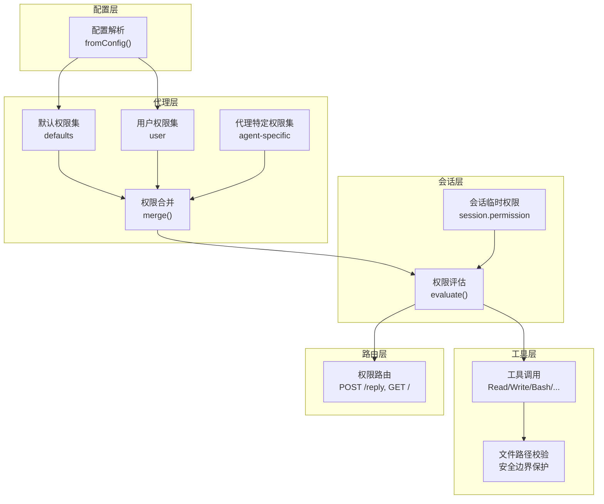
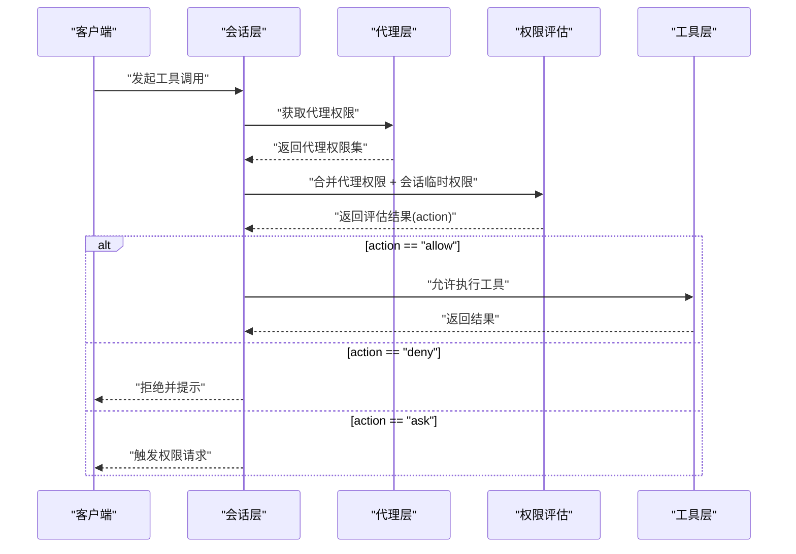
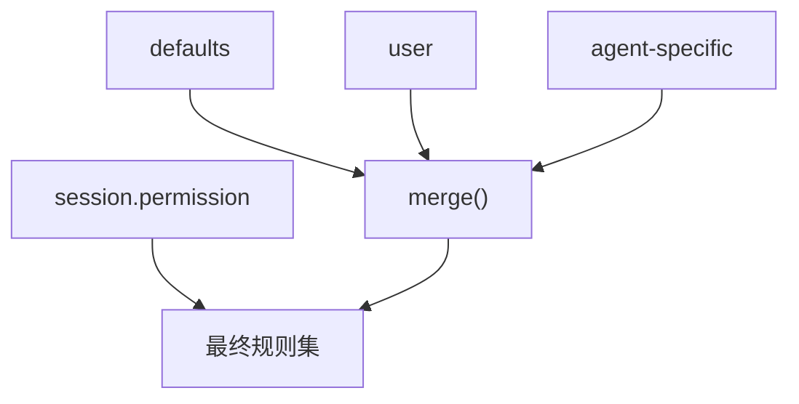
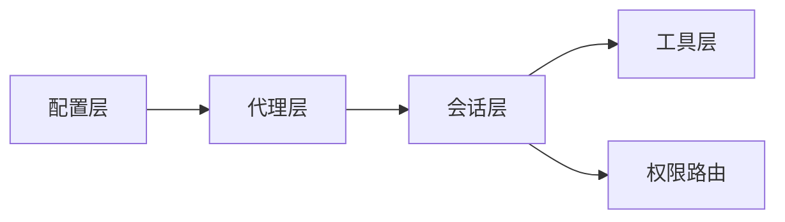

# 权限控制系统

<cite>
**本文引用的文件**
- [packages/opencode/src/agent/agent.ts](file://packages/opencode/src/agent/agent.ts)
- [packages/opencode/src/server/routes/permission.ts](file://packages/opencode/src/server/routes/permission.ts)
- [packages/opencode/test/agent/agent.test.ts](file://packages/opencode/test/agent/agent.test.ts)
- [packages/opencode/test/permission-task.test.ts](file://packages/opencode/test/permission-task.test.ts)
- [packages/opencode/test/file/path-traversal.test.ts](file://packages/opencode/test/file/path-traversal.test.ts)
- [packages/opencode/test/tool/external-directory.test.ts](file://packages/opencode/test/tool/external-directory.test.ts)
- [packages/opencode/src/cli/cmd/debug/agent.ts](file://packages/opencode/src/cli/cmd/debug/agent.ts)
- [packages/opencode/src/session/llm.ts](file://packages/opencode/src/session/llm.ts)
- [packages/opencode/src/session/prompt.ts](file://packages/opencode/src/session/prompt.ts)
</cite>

## 目录
1. [简介](#简介)
2. [项目结构](#项目结构)
3. [核心组件](#核心组件)
4. [架构总览](#架构总览)
5. [详细组件分析](#详细组件分析)
6. [依赖关系分析](#依赖关系分析)
7. [性能考量](#性能考量)
8. [故障排查指南](#故障排查指南)
9. [结论](#结论)
10. [附录](#附录)

## 简介
本文件系统性阐述 OpenCode 代理权限控制系统（Permission 模块）的设计与实现，覆盖以下主题：
- 权限规则的定义、验证机制与继承策略
- 默认权限、用户权限、项目权限的合并优先级与冲突解决
- 文件访问控制策略：路径白名单、黑名单与安全边界保护
- 不同代理中的权限应用差异与敏感操作防护
- 最小权限原则与安全审计最佳实践
- 结合测试用例的代码示例路径，帮助快速定位实现位置

## 项目结构
OpenCode 的权限控制贯穿“配置层 → 代理层 → 会话层 → 工具层”的多层协作：
- 配置层：从 opencode.jsonc 读取全局与代理级权限配置
- 代理层：构建默认权限集，并与用户配置、代理特定配置合并
- 会话层：在执行前对当前会话的临时权限与代理权限进行合并评估
- 工具层：具体工具调用时按规则进行许可判定
- 路由层：对外暴露权限请求列表与人工回复接口

图表来源
- [packages/opencode/src/agent/agent.ts](file://packages/opencode/src/agent/agent.ts)
- [packages/opencode/src/server/routes/permission.ts](file://packages/opencode/src/server/routes/permission.ts)

章节来源
- [packages/opencode/src/agent/agent.ts](file://packages/opencode/src/agent/agent.ts)
- [packages/opencode/src/server/routes/permission.ts](file://packages/opencode/src/server/routes/permission.ts)

## 核心组件
- 权限规则模型与合并器
  - 规则结构：permission（权限类型）、pattern（匹配模式）、action（allow/deny/ask）
  - 合并器：支持多层级合并，默认集、用户集、代理集、会话集
- 代理权限服务
  - 构建默认权限集（含 read、external_directory、question、plan_* 等）
  - 将用户配置与代理特定配置合并，形成最终代理权限
- 会话权限评估
  - 在工具调用前，将代理权限与会话临时权限合并后评估
- 路由接口
  - 列出待处理权限请求
  - 回复权限请求（批准/拒绝）

章节来源
- [packages/opencode/src/agent/agent.ts](file://packages/opencode/src/agent/agent.ts)
- [packages/opencode/src/server/routes/permission.ts](file://packages/opencode/src/server/routes/permission.ts)

## 架构总览
下图展示了从配置到工具调用的完整权限流：

图表来源
- [packages/opencode/src/agent/agent.ts](file://packages/opencode/src/agent/agent.ts)
- [packages/opencode/src/session/llm.ts](file://packages/opencode/src/session/llm.ts)
- [packages/opencode/src/session/prompt.ts](file://packages/opencode/src/session/prompt.ts)

## 详细组件分析

### 权限规则定义与验证
- 规则字段
  - permission：权限类别（如 task、read、bash、external_directory 等）
  - pattern：匹配模式（支持通配符），用于精确或范围匹配
  - action：动作（allow、deny、ask）
- 规则来源
  - fromConfig：从配置对象转换为规则集
  - evaluate：根据规则集与具体请求匹配，返回 action
- 测试验证
  - 任务权限（permission.task）：未匹配时默认 ask；显式 allow/deny/ask 分别生效
  - 全局权限对所有代理生效：在配置中设置 permission.bash=deny 后，所有代理均受此限制

章节来源
- [packages/opencode/test/permission-task.test.ts](file://packages/opencode/test/permission-task.test.ts)
- [packages/opencode/test/agent/agent.test.ts](file://packages/opencode/test/agent/agent.test.ts)

### 权限继承与合并策略
- 层级顺序（从低到高）
  1) 默认权限集（defaults）
  2) 用户权限集（user）
  3) 代理特定权限集（agent-specific）
  4) 会话临时权限（session.permission）
- 合并行为
  - merge：多集合合并，后出现的规则覆盖先前规则
  - 代理层在构建各代理权限时，先合并 defaults 与 agent-specific，再叠加 user
  - 会话层在工具调用前再次合并 session.permission，以实现“即时”权限变更
- 冲突解决
  - 同一 permission+pattern 的最后一条规则生效
  - 通过测试验证：代理特定 deny 可覆盖默认 allow；全局 deny 可覆盖代理 allow

图表来源
- [packages/opencode/src/agent/agent.ts](file://packages/opencode/src/agent/agent.ts)
- [packages/opencode/src/cli/cmd/debug/agent.ts](file://packages/opencode/src/cli/cmd/debug/agent.ts)
- [packages/opencode/src/session/llm.ts](file://packages/opencode/src/session/llm.ts)
- [packages/opencode/src/session/prompt.ts](file://packages/opencode/src/session/prompt.ts)

章节来源
- [packages/opencode/src/agent/agent.ts](file://packages/opencode/src/agent/agent.ts)
- [packages/opencode/src/cli/cmd/debug/agent.ts](file://packages/opencode/src/cli/cmd/debug/agent.ts)
- [packages/opencode/src/session/llm.ts](file://packages/opencode/src/session/llm.ts)
- [packages/opencode/src/session/prompt.ts](file://packages/opencode/src/session/prompt.ts)

### 文件访问控制策略
- 安全边界保护
  - File.read/list 对路径进行安全检查，拒绝越界访问（如 ../）
  - 集成测试覆盖了多种路径穿越场景，确保在 HTTP API 路径下同样受保护
- 外部目录访问
  - external_directory 权限用于控制对外部目录的访问
  - 默认允许 Truncate.GLOB，除非被显式 deny
  - 白名单策略：技能目录与特定路径可被允许访问
- 黑名单与白名单
  - 黑名单：deny 显式禁止的模式
  - 白名单：allow 显式允许的模式；未显式列出的默认为 ask

章节来源
- [packages/opencode/test/file/path-traversal.test.ts](file://packages/opencode/test/file/path-traversal.test.ts)
- [packages/opencode/test/tool/external-directory.test.ts](file://packages/opencode/test/tool/external-directory.test.ts)
- [packages/opencode/src/agent/agent.ts](file://packages/opencode/src/agent/agent.ts)

### 不同代理中的权限应用差异
- build：默认允许常见编辑与工具，计划相关入口允许
- plan：禁用 edit 工具，仅允许有限的计划相关操作，并对特定计划文件路径开放
- general/explore：探索型代理，开放更多搜索与读取能力，同时保留 ask/ask 的策略
- compaction/title/summary：隐藏代理，主要用于内部流程，统一 deny 为主
- 自定义代理：通过配置叠加权限，最终与 defaults 和 user 合并

章节来源
- [packages/opencode/src/agent/agent.ts](file://packages/opencode/src/agent/agent.ts)

### 敏感操作防护与人工确认
- ask 动作触发人工权限请求
  - 路由层提供 GET / 列出待处理请求
  - POST /:requestID/reply 接收人工审批/拒绝
- 会话层与调试命令
  - 会话在工具调用前评估权限，必要时弹出 ask
  - 调试命令在本地调试时同样使用相同的合并与评估逻辑

章节来源
- [packages/opencode/src/server/routes/permission.ts](file://packages/opencode/src/server/routes/permission.ts)
- [packages/opencode/src/session/llm.ts](file://packages/opencode/src/session/llm.ts)
- [packages/opencode/src/cli/cmd/debug/agent.ts](file://packages/opencode/src/cli/cmd/debug/agent.ts)

## 依赖关系分析
- 组件耦合
  - 代理层依赖配置层生成 defaults 与 user；随后与 agent-specific 合并
  - 会话层在工具调用前依赖代理层提供的权限集，并与 session.permission 合并
  - 工具层依赖权限评估结果决定是否放行
- 外部依赖
  - 配置解析与 Zod 校验
  - Effect 服务模型与运行时

图表来源
- [packages/opencode/src/agent/agent.ts](file://packages/opencode/src/agent/agent.ts)
- [packages/opencode/src/server/routes/permission.ts](file://packages/opencode/src/server/routes/permission.ts)

章节来源
- [packages/opencode/src/agent/agent.ts](file://packages/opencode/src/agent/agent.ts)
- [packages/opencode/src/server/routes/permission.ts](file://packages/opencode/src/server/routes/permission.ts)

## 性能考量
- 合并与评估复杂度
  - 合并：O(N)（N 为规则条目数），按顺序覆盖，避免重复扫描
  - 评估：线性扫描规则集，最坏 O(N)；可通过索引化优化（当前未见实现）
- 建议
  - 控制规则数量，优先使用更精确的 pattern 缩小匹配范围
  - 将高频 deny 放在前面，减少后续匹配成本
  - 使用 ask 降低交互频率，避免频繁的人工确认

## 故障排查指南
- 常见问题
  - 代理权限未生效：检查是否正确合并 defaults、user、agent-specific
  - ask 过多导致效率低：适当放宽 ask 为 allow/deny，或调整 pattern 精度
  - 路径访问失败：确认 external_directory 白名单是否包含目标路径
  - 路由无法处理权限请求：确认权限路由已注册且请求 ID 正确
- 定位方法
  - 使用测试用例作为参考：任务权限、代理权限合并、路径穿越保护、外部目录访问
  - 在会话层与调试命令中打印合并后的规则集，核对最终生效规则

章节来源
- [packages/opencode/test/permission-task.test.ts](file://packages/opencode/test/permission-task.test.ts)
- [packages/opencode/test/agent/agent.test.ts](file://packages/opencode/test/agent/agent.test.ts)
- [packages/opencode/test/file/path-traversal.test.ts](file://packages/opencode/test/file/path-traversal.test.ts)
- [packages/opencode/test/tool/external-directory.test.ts](file://packages/opencode/test/tool/external-directory.test.ts)
- [packages/opencode/src/server/routes/permission.ts](file://packages/opencode/src/server/routes/permission.ts)

## 结论
OpenCode 的权限控制系统通过“默认集 → 用户集 → 代理集 → 会话集”的分层合并，实现了灵活而可控的权限管理。配合 ask 动作与人工路由，系统在安全性与可用性之间取得平衡。文件访问控制通过安全边界保护与白/黑名单策略，有效防止路径穿越等风险。建议在实际部署中遵循最小权限原则，并结合审计日志与定期审查，持续优化权限配置。

## 附录
- 最小权限原则最佳实践
  - 为每个代理设定最小必要的权限集合
  - 使用通配符时尽量精确，避免过度宽泛
  - 将敏感操作（如 edit、bash）默认 deny，仅在明确需要时 allow
- 安全审计建议
  - 记录 ask 请求的触发原因与处理结果
  - 定期审查权限配置，移除不再使用的 allow 规则
  - 对 external_directory 的 allow 路径进行定期盘点