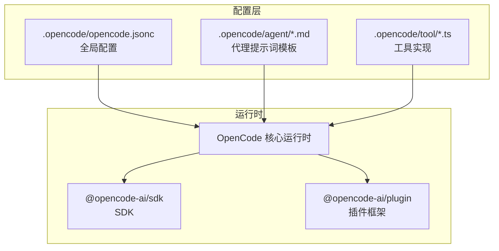
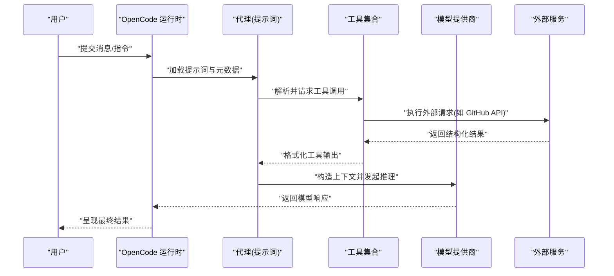
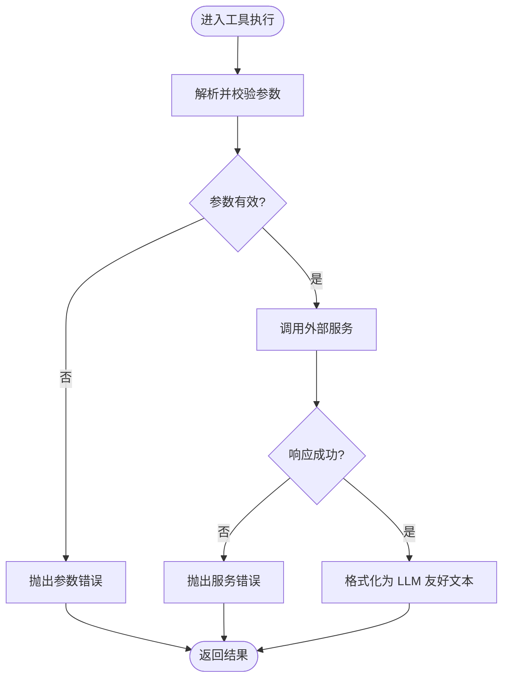
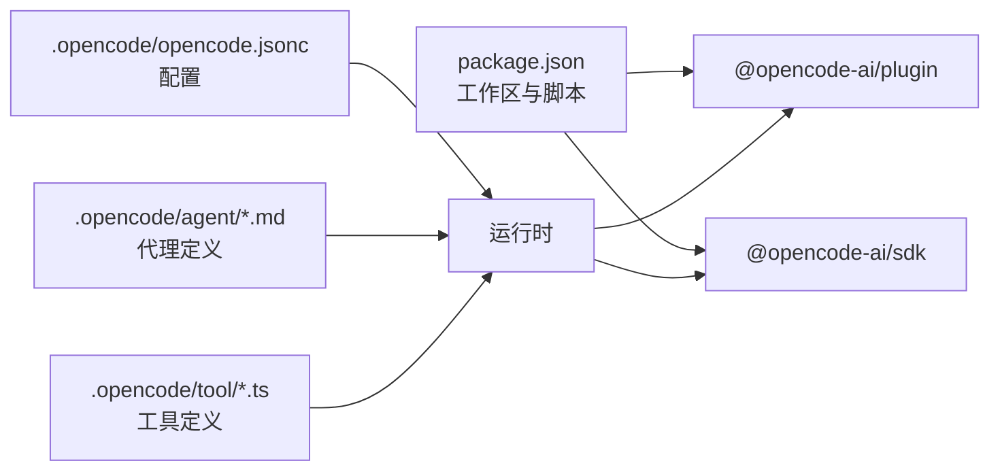

# 自定义代理开发

<cite>
**本文引用的文件**
- [README.md](file://README.md)
- [AGENTS.md](file://AGENTS.md)
- [.opencode/opencode.jsonc](file://.opencode/opencode.jsonc)
- [.opencode/agent/duplicate-pr.md](file://.opencode/agent/duplicate-pr.md)
- [.opencode/agent/translator.md](file://.opencode/agent/translator.md)
- [.opencode/agent/triage.md](file://.opencode/agent/triage.md)
- [.opencode/tool/github-pr-search.ts](file://.opencode/tool/github-pr-search.ts)
- [.opencode/tool/github-triage.ts](file://.opencode/tool/github-triage.ts)
- [package.json](file://package.json)
- [.opencode/env.d.ts](file://.opencode/env.d.ts)
</cite>

## 目录
1. [简介](#简介)
2. [项目结构](#项目结构)
3. [核心组件](#核心组件)
4. [架构总览](#架构总览)
5. [详细组件分析](#详细组件分析)
6. [依赖分析](#依赖分析)
7. [性能考量](#性能考量)
8. [故障排查指南](#故障排查指南)
9. [结论](#结论)
10. [附录](#附录)

## 简介
本指南面向希望在 OpenCode 平台上开发“自定义代理”的工程师与产品人员。OpenCode 提供了以“提示词驱动 + 工具调用 + 模型选择”为核心的代理体系：通过 YAML 风格的提示词文件（含头部元数据）定义代理行为，借助工具（Tool）扩展外部能力，结合多模型提供商进行推理与生成。本文将系统讲解如何创建自定义代理、提示词工程最佳实践、模型选择策略、测试与调试方法，并给出从简单到复杂的完整开发示例与生产部署建议。

## 项目结构
OpenCode 的代理与工具主要位于仓库根目录下的隐藏配置目录中，配合工作区包结构运行。关键位置如下：
- 代理定义：.opencode/agent/*.md（提示词 + 元数据）
- 工具定义：.opencode/tool/*.ts（基于 @opencode-ai/plugin 的工具封装）
- 全局配置：.opencode/opencode.jsonc（模型提供商、权限、工具开关等）
- 工作区脚本与包管理：package.json（多包工作区、脚本与依赖）

图表来源
- [.opencode/opencode.jsonc:1-19](file://.opencode/opencode.jsonc#L1-L19)
- [.opencode/agent/duplicate-pr.md:1-27](file://.opencode/agent/duplicate-pr.md#L1-L27)
- [.opencode/tool/github-pr-search.ts:1-65](file://.opencode/tool/github-pr-search.ts#L1-L65)
- [package.json:1-124](file://package.json#L1-L124)

章节来源
- [README.md:100-114](file://README.md#L100-L114)
- [.opencode/opencode.jsonc:1-19](file://.opencode/opencode.jsonc#L1-L19)
- [package.json:20-75](file://package.json#L20-L75)

## 核心组件
- 代理（Agent）
  - 定义方式：以 YAML 头部 + 文本正文构成的提示词文件，支持 mode、model、tools、color、hidden 等元数据字段。
  - 运行模式：primary（主代理）、subagent（子代理），用于组合复杂任务。
- 工具（Tool）
  - 基于 @opencode-ai/plugin 的工具封装，统一输入参数校验、执行与返回格式。
  - 可在代理中按通配或精确启用，控制访问范围与权限。
- 配置（Config）
  - 全局模型提供商、权限策略、工具开关、MCP 设置等集中于 .opencode/opencode.jsonc。
- SDK 与插件
  - @opencode-ai/sdk 提供运行时能力；@opencode-ai/plugin 提供工具与插件开发接口。

章节来源
- [.opencode/agent/duplicate-pr.md:1-27](file://.opencode/agent/duplicate-pr.md#L1-L27)
- [.opencode/agent/triage.md:1-141](file://.opencode/agent/triage.md#L1-L141)
- [.opencode/tool/github-pr-search.ts:1-65](file://.opencode/tool/github-pr-search.ts#L1-L65)
- [.opencode/tool/github-triage.ts:1-117](file://.opencode/tool/github-triage.ts#L1-L117)
- [.opencode/opencode.jsonc:1-19](file://.opencode/opencode.jsonc#L1-L19)
- [package.json:88-94](file://package.json#L88-L94)

## 架构总览
下图展示了从用户消息到代理执行、工具调用与模型推理的整体流程。

图表来源
- [.opencode/agent/duplicate-pr.md:1-27](file://.opencode/agent/duplicate-pr.md#L1-L27)
- [.opencode/tool/github-pr-search.ts:24-64](file://.opencode/tool/github-pr-search.ts#L24-L64)
- [.opencode/tool/github-triage.ts:40-116](file://.opencode/tool/github-triage.ts#L40-L116)

## 详细组件分析

### 代理提示词模板设计
- 元数据字段
  - mode：primary 或 subagent，决定代理在任务编排中的角色。
  - model：指定使用的模型标识符，如 opencode/claude-haiku-4-5。
  - tools：启用工具列表，支持 "*" 与具体 ID 组合；可设置默认禁用再按需开启。
  - color/hidden：外观与可见性控制。
- 正文内容
  - 明确角色定位、目标、约束与输出格式要求。
  - 对重复场景给出“无匹配则明确告知”的规范输出，便于上层逻辑处理。
- 上下文组织
  - 将“当前状态”“历史对话”“工具返回”三部分清晰分层，避免上下文污染。
  - 使用占位符与变量注入，确保每次会话的动态上下文被正确拼接。
- 输出格式约束
  - 固定输出格式（如仅列出标题与链接），减少后处理复杂度。
  - 对“无结果”场景给出标准短语，便于前端与自动化流程识别。

章节来源
- [.opencode/agent/duplicate-pr.md:1-27](file://.opencode/agent/duplicate-pr.md#L1-L27)
- [.opencode/agent/triage.md:1-141](file://.opencode/agent/triage.md#L1-L141)
- [.opencode/agent/translator.md:1-800](file://.opencode/agent/translator.md#L1-L800)

### 工具实现与调用
- 参数校验
  - 使用工具 schema 对输入进行类型与默认值约束，保证下游调用稳定。
- 错误处理
  - 对外部 API 返回码进行显式检查与异常抛出，便于上层捕获与重试。
- 结果格式化
  - 将原始响应转换为 LLM 友好的文本片段，包含必要字段与简洁描述。
- 权限与安全
  - 通过环境变量注入凭据，避免硬编码；严格限定工具可用范围。

图表来源
- [.opencode/tool/github-pr-search.ts:35-64](file://.opencode/tool/github-pr-search.ts#L35-L64)
- [.opencode/tool/github-triage.ts:47-116](file://.opencode/tool/github-triage.ts#L47-L116)

章节来源
- [.opencode/tool/github-pr-search.ts:1-65](file://.opencode/tool/github-pr-search.ts#L1-L65)
- [.opencode/tool/github-triage.ts:1-117](file://.opencode/tool/github-triage.ts#L1-L117)

### 模型选择策略
- 模型标识与命名
  - 采用统一前缀与版本号的命名风格，便于切换与追踪。
- 性能评估
  - 通过延迟、吞吐量、准确性与成本进行综合评估；对长上下文与多工具调用场景分别测试。
- 成本控制
  - 优先使用轻量模型处理检索与分类任务；对生成类任务采用更昂贵模型。
  - 利用缓存与上下文裁剪降低 token 消耗。
- 供应商与本地化
  - 支持多家模型提供商与本地模型；通过配置文件集中管理密钥与端点。

章节来源
- [.opencode/agent/duplicate-pr.md:4-4](file://.opencode/agent/duplicate-pr.md#L4-L4)
- [.opencode/agent/triage.md:4-4](file://.opencode/agent/triage.md#L4-L4)
- [.opencode/opencode.jsonc:1-19](file://.opencode/opencode.jsonc#L1-L19)

### 测试与调试
- 单元测试
  - 针对工具函数进行边界条件与错误路径覆盖；避免过度 mock，优先测试真实实现。
  - 在包目录内运行类型检查与测试，遵循工作区脚本约定。
- 集成测试
  - 通过真实会话与工具调用链路验证代理行为；关注上下文拼接与输出格式一致性。
- 调试技巧
  - 打印关键中间态（参数、请求、响应、格式化结果）；利用最小化复现问题。
  - 对外部服务调用增加超时与重试策略，记录失败原因以便回溯。

章节来源
- [AGENTS.md:120-129](file://AGENTS.md#L120-L129)
- [AGENTS.md:9-18](file://AGENTS.md#L9-L18)

### 开发示例（从简单到复杂）
- 示例一：重复 PR 检测代理
  - 目标：在 PR 打开时搜索可能的重复或相关 PR。
  - 关键点：启用 github-pr-search 工具；对“当前 PR 编号”进行排除；输出简洁可读。
  - 参考路径：[duplicate-pr.md:1-27](file://.opencode/agent/duplicate-pr.md#L1-L27)，[github-pr-search.ts:1-65](file://.opencode/tool/github-pr-search.ts#L1-L65)
- 示例二：工单分流代理
  - 目标：根据内容自动打标签与分配负责人。
  - 关键点：基于正则规则与团队映射进行判定；严格限制可分配范围与标签组合。
  - 参考路径：[triage.md:1-141](file://.opencode/agent/triage.md#L1-L141)，[github-triage.ts:1-117](file://.opencode/tool/github-triage.ts#L1-L117)
- 示例三：翻译代理
  - 目标：在保留技术术语与格式的前提下进行本地化翻译。
  - 关键点：使用术语表与本地化指南；输出仅翻译文本，不添加注释。
  - 参考路径：[translator.md:1-800](file://.opencode/agent/translator.md#L1-L800)

章节来源
- [.opencode/agent/duplicate-pr.md:1-27](file://.opencode/agent/duplicate-pr.md#L1-L27)
- [.opencode/agent/triage.md:1-141](file://.opencode/agent/triage.md#L1-L141)
- [.opencode/agent/translator.md:1-800](file://.opencode/agent/translator.md#L1-L800)
- [.opencode/tool/github-pr-search.ts:1-65](file://.opencode/tool/github-pr-search.ts#L1-L65)
- [.opencode/tool/github-triage.ts:1-117](file://.opencode/tool/github-triage.ts#L1-L117)

## 依赖分析
- 包管理与工作区
  - 多包工作区通过 workspaces 管理，统一脚本与依赖版本；@opencode-ai/* 作为核心依赖。
- 插件与 SDK
  - @opencode-ai/plugin 提供工具开发接口；@opencode-ai/sdk 提供运行时能力。
- 类型与工具链
  - 使用 TypeScript 与 Prettier 统一风格；Turbo 进行类型检查与构建。

图表来源
- [package.json:20-75](file://package.json#L20-L75)
- [package.json:88-94](file://package.json#L88-L94)
- [.opencode/opencode.jsonc:1-19](file://.opencode/opencode.jsonc#L1-L19)

章节来源
- [package.json:20-75](file://package.json#L20-L75)
- [package.json:88-94](file://package.json#L88-L94)

## 性能考量
- 上下文长度控制
  - 对历史消息与工具返回进行裁剪与摘要；避免一次性注入过长上下文。
- 工具调用批量化
  - 合并相似查询，减少外部请求次数；对可缓存结果进行本地缓存。
- 模型选择与并发
  - 对轻量任务使用轻量模型；对高并发场景引入队列与限流。
- I/O 优化
  - 使用 Bun 文件 API 与流式处理减少内存占用；合理设置超时与重试。

## 故障排查指南
- 常见问题
  - 工具调用失败：检查环境变量（如 GITHUB_TOKEN）是否正确注入；确认外部服务可达与配额充足。
  - 代理输出不符合预期：核对提示词中的输出格式约束与上下文组织；逐步缩小问题范围。
  - 模型响应异常：调整提示词结构与温度参数；必要时更换模型或降低上下文长度。
- 调试步骤
  - 在包目录运行类型检查与测试；打印关键中间态；对工具执行路径增加日志。
  - 使用最小化示例复现问题，隔离外部依赖。

章节来源
- [.opencode/tool/github-pr-search.ts:3-17](file://.opencode/tool/github-pr-search.ts#L3-L17)
- [.opencode/tool/github-triage.ts:24-38](file://.opencode/tool/github-triage.ts#L24-L38)
- [AGENTS.md:120-129](file://AGENTS.md#L120-L129)

## 结论
通过“提示词模板 + 工具 + 模型”的组合，OpenCode 为自定义代理提供了高可塑性与强扩展性的开发范式。遵循本文的提示词设计原则、工具实现规范、模型选择策略与测试调试方法，可以快速构建从简单检索到复杂编排的代理应用，并在生产环境中保持稳定与高效。

## 附录
- 快速开始清单
  - 创建代理提示词文件，设置 mode/model/tools 等元数据。
  - 实现或启用工具，确保参数校验与错误处理完备。
  - 在 .opencode/opencode.jsonc 中配置模型提供商与权限。
  - 在包目录内运行类型检查与测试，逐步集成到会话流程。
- 参考文件
  - 代理示例：[duplicate-pr.md:1-27](file://.opencode/agent/duplicate-pr.md#L1-L27)、[triage.md:1-141](file://.opencode/agent/triage.md#L1-L141)、[translator.md:1-800](file://.opencode/agent/translator.md#L1-L800)
  - 工具示例：[github-pr-search.ts:1-65](file://.opencode/tool/github-pr-search.ts#L1-L65)、[github-triage.ts:1-117](file://.opencode/tool/github-triage.ts#L1-L117)
  - 全局配置：[opencode.jsonc:1-19](file://.opencode/opencode.jsonc#L1-L19)
  - 工作区与依赖：[package.json:1-124](file://package.json#L1-L124)