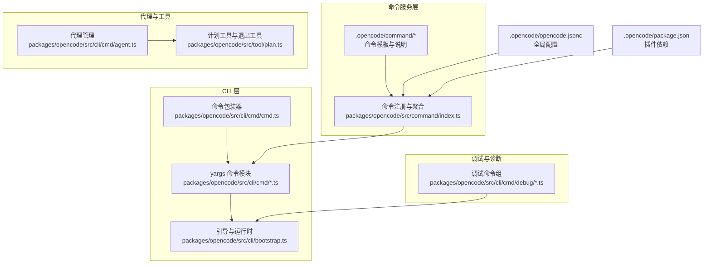
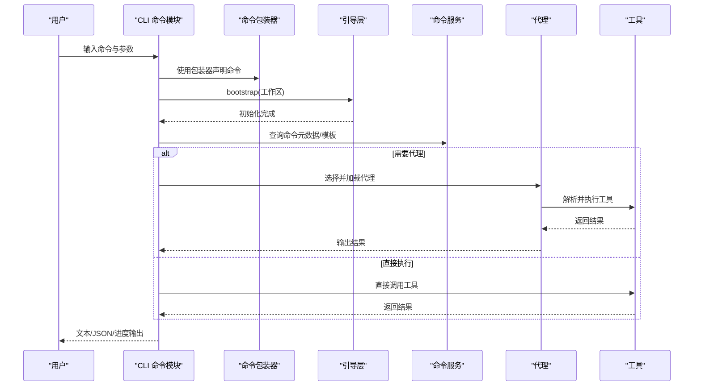
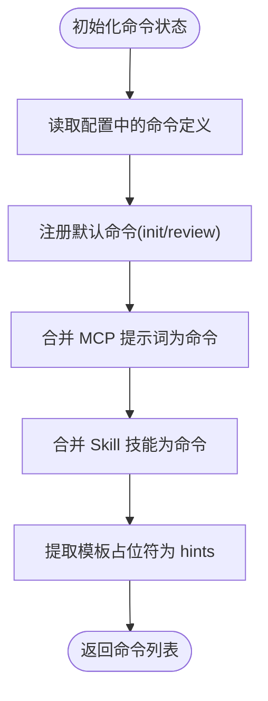
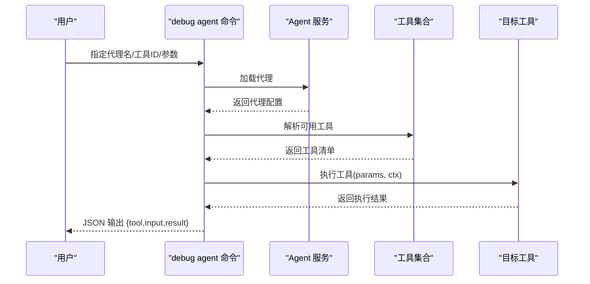
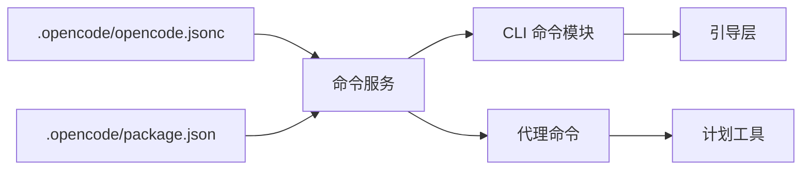

# 命令系统

<cite>
**本文引用的文件**
- [packages/opencode/src/command/index.ts](file://packages/opencode/src/command/index.ts)
- [packages/opencode/src/cli/cmd/cmd.ts](file://packages/opencode/src/cli/cmd/cmd.ts)
- [packages/opencode/src/cli/cmd/agent.ts](file://packages/opencode/src/cli/cmd/agent.ts)
- [packages/opencode/src/cli/cmd/debug/agent.ts](file://packages/opencode/src/cli/cmd/debug/agent.ts)
- [packages/opencode/src/cli/cmd/debug/config.ts](file://packages/opencode/src/cli/cmd/debug/config.ts)
- [packages/opencode/src/cli/cmd/debug/index.ts](file://packages/opencode/src/cli/cmd/debug/index.ts)
- [packages/opencode/src/cli/bootstrap.ts](file://packages/opencode/src/cli/bootstrap.ts)
- [packages/opencode/src/tool/plan.ts](file://packages/opencode/src/tool/plan.ts)
- [packages/opencode/src/session/prompt.ts](file://packages/opencode/src/session/prompt.ts)
- [packages/opencode/src/tool/plan-exit.txt](file://packages/opencode/src/tool/plan-exit.txt)
- [.opencode/opencode.jsonc](file://.opencode/opencode.jsonc)
- [.opencode/package.json](file://.opencode/package.json)
</cite>

## 目录
1. [简介](#简介)
2. [项目结构](#项目结构)
3. [核心组件](#核心组件)
4. [架构总览](#架构总览)
5. [详细组件分析](#详细组件分析)
6. [依赖分析](#依赖分析)
7. [性能考虑](#性能考虑)
8. [故障排查指南](#故障排查指南)
9. [结论](#结论)
10. [附录](#附录)

## 简介
本文件系统性梳理 OpenCode 的命令系统，覆盖命令注册机制、命令执行流程、参数解析体系、CLI 组织结构（含 run、init、config、agent、tool、plan 等）、参数校验与默认值策略、输出格式（文本/JSON/进度提示）以及与代理与工具系统的协作链路。同时提供扩展开发指南与常见问题排查建议。

## 项目结构
命令系统主要由以下部分组成：
- 命令服务层：负责命令元数据的收集、聚合与暴露（含内置命令、MCP 提示词、Skill 技能）
- CLI 层：基于 yargs 的命令模块定义与参数解析，封装统一的 cmd 包装器
- 调试命令组：提供诊断与排障能力，如查看配置、路径信息、等待调试等
- 工具与代理：命令在执行时可调用工具与代理，形成“命令 -> 代理 -> 工具”的执行链
- 配置与插件：通过配置文件与插件依赖驱动命令行为与可用性

图表来源
- [packages/opencode/src/command/index.ts:1-196](file://packages/opencode/src/command/index.ts#L1-L196)
- [packages/opencode/src/cli/cmd/cmd.ts:1-8](file://packages/opencode/src/cli/cmd/cmd.ts#L1-L8)
- [packages/opencode/src/cli/cmd/debug/index.ts:1-49](file://packages/opencode/src/cli/cmd/debug/index.ts#L1-L49)
- [packages/opencode/src/cli/bootstrap.ts](file://packages/opencode/src/cli/bootstrap.ts)
- [packages/opencode/src/cli/cmd/agent.ts:1-246](file://packages/opencode/src/cli/cmd/agent.ts#L1-L246)
- [packages/opencode/src/tool/plan.ts:1-44](file://packages/opencode/src/tool/plan.ts#L1-L44)
- [.opencode/opencode.jsonc:1-19](file://.opencode/opencode.jsonc#L1-L19)
- [.opencode/package.json:1-5](file://.opencode/package.json#L1-L5)

章节来源
- [packages/opencode/src/command/index.ts:1-196](file://packages/opencode/src/command/index.ts#L1-L196)
- [packages/opencode/src/cli/cmd/cmd.ts:1-8](file://packages/opencode/src/cli/cmd/cmd.ts#L1-L8)
- [packages/opencode/src/cli/cmd/debug/index.ts:1-49](file://packages/opencode/src/cli/cmd/debug/index.ts#L1-L49)
- [packages/opencode/src/cli/bootstrap.ts](file://packages/opencode/src/cli/bootstrap.ts)
- [packages/opencode/src/cli/cmd/agent.ts:1-246](file://packages/opencode/src/cli/cmd/agent.ts#L1-L246)
- [packages/opencode/src/tool/plan.ts:1-44](file://packages/opencode/src/tool/plan.ts#L1-L44)
- [.opencode/opencode.jsonc:1-19](file://.opencode/opencode.jsonc#L1-L19)
- [.opencode/package.json:1-5](file://.opencode/package.json#L1-L5)

## 核心组件
- 命令服务与事件
  - 提供命令元数据查询与列表能力，支持内置命令、MCP 提示词与 Skill 技能三类来源的聚合
  - 定义命令执行事件结构，便于追踪命令执行上下文
- 参数包装器
  - 对 yargs 的 CommandModule 进行轻量包装，统一命令声明风格
- CLI 引导
  - 在命令执行前完成工作区初始化与依赖注入，确保后续服务可用
- 调试命令组
  - 汇集配置查看、路径信息、等待调试等实用工具，辅助定位问题
- 代理与工具
  - 代理命令用于生成与列举代理；计划工具用于规划阶段与退出规划

章节来源
- [packages/opencode/src/command/index.ts:14-196](file://packages/opencode/src/command/index.ts#L14-L196)
- [packages/opencode/src/cli/cmd/cmd.ts:1-8](file://packages/opencode/src/cli/cmd/cmd.ts#L1-L8)
- [packages/opencode/src/cli/bootstrap.ts](file://packages/opencode/src/cli/bootstrap.ts)
- [packages/opencode/src/cli/cmd/debug/index.ts:1-49](file://packages/opencode/src/cli/cmd/debug/index.ts#L1-L49)
- [packages/opencode/src/cli/cmd/agent.ts:1-246](file://packages/opencode/src/cli/cmd/agent.ts#L1-L246)
- [packages/opencode/src/tool/plan.ts:1-44](file://packages/opencode/src/tool/plan.ts#L1-L44)

## 架构总览
命令系统采用“服务层 + CLI 层 + 执行链路”的分层设计：
- 服务层负责命令元数据的构建与暴露，支持多源聚合
- CLI 层负责参数解析与命令路由，通过引导层确保运行时环境就绪
- 执行链路由命令触发代理或工具，形成“命令 -> 代理 -> 工具”的闭环

图表来源
- [packages/opencode/src/cli/cmd/cmd.ts:1-8](file://packages/opencode/src/cli/cmd/cmd.ts#L1-L8)
- [packages/opencode/src/cli/bootstrap.ts](file://packages/opencode/src/cli/bootstrap.ts)
- [packages/opencode/src/command/index.ts:75-182](file://packages/opencode/src/command/index.ts#L75-L182)
- [packages/opencode/src/cli/cmd/agent.ts:19-246](file://packages/opencode/src/cli/cmd/agent.ts#L19-L246)
- [packages/opencode/src/tool/plan.ts:19-44](file://packages/opencode/src/tool/plan.ts#L19-L44)

## 详细组件分析

### 命令注册与聚合机制
- 来源一：内置命令
  - 默认命令包括初始化与变更评审，模板内容动态绑定工作区路径
- 来源二：MCP 提示词
  - 将 MCP 的提示词转换为命令模板，参数占位符映射到 $1..$N
- 来源三：Skill 技能
  - 将技能内容作为命令模板直接注册，无参数占位符
- 元数据字段
  - 名称、描述、代理名、模型、来源、模板、是否子任务、提示占位符集合
- 事件
  - 记录命令执行名称、会话 ID、参数字符串、消息 ID，便于审计与追踪

图表来源
- [packages/opencode/src/command/index.ts:75-182](file://packages/opencode/src/command/index.ts#L75-L182)

章节来源
- [packages/opencode/src/command/index.ts:14-196](file://packages/opencode/src/command/index.ts#L14-L196)

### CLI 命令组织与参数解析
- 命令包装器
  - 通过 cmd 包装 yargs 的 CommandModule，统一声明风格，支持双横线透传参数
- 代理命令
  - 子命令：create（创建代理）、list（列出代理）
  - 支持非交互式参数：路径、描述、模式、工具列表、模型
  - 交互式流程：选择作用域、输入描述、生成代理、选择工具、选择模式、写入文件
- 调试命令组
  - config：打印解析后的配置（JSON）
  - paths：打印全局路径（数据、配置、缓存、状态）
  - wait：无限等待（便于调试）
  - 其他：文件、LSP、ripgrep、抓取、技能、快照、agent 等诊断工具

章节来源
- [packages/opencode/src/cli/cmd/cmd.ts:1-8](file://packages/opencode/src/cli/cmd/cmd.ts#L1-L8)
- [packages/opencode/src/cli/cmd/agent.ts:19-246](file://packages/opencode/src/cli/cmd/agent.ts#L19-L246)
- [packages/opencode/src/cli/cmd/debug/config.ts:1-17](file://packages/opencode/src/cli/cmd/debug/config.ts#L1-L17)
- [packages/opencode/src/cli/cmd/debug/index.ts:1-49](file://packages/opencode/src/cli/cmd/debug/index.ts#L1-L49)

### 命令执行流程与输出格式
- 执行前引导
  - bootstrap 在命令执行前完成工作区初始化，确保后续服务可用
- 输出格式
  - 文本输出：适用于 list、路径打印等
  - JSON 输出：适用于 config 等需要结构化输出的场景
  - 进度与提示：通过 UI 与进度条提升交互体验
- 事件记录
  - 命令执行事件包含命令名、会话 ID、参数字符串、消息 ID，便于审计

章节来源
- [packages/opencode/src/cli/bootstrap.ts](file://packages/opencode/src/cli/bootstrap.ts)
- [packages/opencode/src/cli/cmd/debug/config.ts:10-16](file://packages/opencode/src/cli/cmd/debug/config.ts#L10-L16)
- [packages/opencode/src/command/index.ts:21-31](file://packages/opencode/src/command/index.ts#L21-L31)

### 与代理、工具系统的协作
- 代理命令
  - create：根据描述生成代理模板，结合工具选择与模式配置，最终写入文件
  - list：列出可用代理及其权限信息
- 计划工具
  - PlanExitTool：在完成计划后询问是否切换到构建代理，若否则拒绝执行
  - 触发条件：计划文件存在且已完善
- 代理调试
  - debug agent：可指定代理名、工具 ID 与参数，执行工具并以 JSON 输出结果

图表来源
- [packages/opencode/src/cli/cmd/debug/agent.ts:15-61](file://packages/opencode/src/cli/cmd/debug/agent.ts#L15-L61)
- [packages/opencode/src/tool/plan.ts:19-44](file://packages/opencode/src/tool/plan.ts#L19-L44)
- [packages/opencode/src/session/prompt.ts:302-319](file://packages/opencode/src/session/prompt.ts#L302-L319)
- [packages/opencode/src/tool/plan-exit.txt:1-13](file://packages/opencode/src/tool/plan-exit.txt#L1-L13)

章节来源
- [packages/opencode/src/cli/cmd/agent.ts:19-246](file://packages/opencode/src/cli/cmd/agent.ts#L19-L246)
- [packages/opencode/src/cli/cmd/debug/agent.ts:15-61](file://packages/opencode/src/cli/cmd/debug/agent.ts#L15-L61)
- [packages/opencode/src/tool/plan.ts:19-44](file://packages/opencode/src/tool/plan.ts#L19-L44)
- [packages/opencode/src/session/prompt.ts:302-319](file://packages/opencode/src/session/prompt.ts#L302-L319)
- [packages/opencode/src/tool/plan-exit.txt:1-13](file://packages/opencode/src/tool/plan-exit.txt#L1-L13)

### 参数系统与验证
- 必选参数
  - 通过 yargs 的 demandOption 或自定义校验函数保证参数存在
- 可选参数
  - 通过默认值或空值处理，避免强制要求
- 参数验证
  - 模型解析：对模型字符串进行解析与校验
  - 工具列表：对逗号分隔的工具字符串进行拆分与校验
  - 交互式校验：对空字符串进行即时反馈
- 默认值处理
  - 未提供时采用默认工具全开、模式为 all 等策略
- 双横线透传
  - 通过包装器支持 "--" 后的剩余参数透传，便于复杂场景

章节来源
- [packages/opencode/src/cli/cmd/agent.ts:22-45](file://packages/opencode/src/cli/cmd/agent.ts#L22-L45)
- [packages/opencode/src/cli/cmd/cmd.ts:3-7](file://packages/opencode/src/cli/cmd/cmd.ts#L3-L7)

### 命令使用示例
- 查看配置
  - 命令：debug config
  - 输出：结构化 JSON 配置
- 列出代理
  - 命令：agent list
  - 输出：代理名称与模式、权限信息
- 创建代理（非交互式）
  - 命令：agent create --path ./agents --description "描述" --mode all --tools bash,read --model openai/gpt-4
  - 输出：生成的代理文件路径
- 调试代理工具
  - 命令：debug agent <name> --tool <id> --params '{"k":"v"}'
  - 输出：JSON 结构的工具输入与结果

章节来源
- [packages/opencode/src/cli/cmd/debug/config.ts:6-16](file://packages/opencode/src/cli/cmd/debug/config.ts#L6-L16)
- [packages/opencode/src/cli/cmd/agent.ts:216-238](file://packages/opencode/src/cli/cmd/agent.ts#L216-L238)
- [packages/opencode/src/cli/cmd/agent.ts:19-46](file://packages/opencode/src/cli/cmd/agent.ts#L19-L46)
- [packages/opencode/src/cli/cmd/debug/agent.ts:15-61](file://packages/opencode/src/cli/cmd/debug/agent.ts#L15-L61)

### 扩展开发指南
- 添加新命令
  - 在 CLI 层新增命令模块，使用 cmd 包装器声明命令与参数
  - 在引导层确保必要服务可用
- 处理命令参数
  - 明确必选/可选参数，提供默认值与校验逻辑
  - 对复杂参数使用 JSON 字符串或对象字面量解析
- 实现命令异步执行
  - 在 handler 中使用 Effect 或 Promise，确保资源释放与错误处理
- 与代理/工具协作
  - 通过代理服务加载代理，解析工具列表，按需执行工具
  - 记录命令执行事件，便于审计与追踪

章节来源
- [packages/opencode/src/cli/cmd/cmd.ts:1-8](file://packages/opencode/src/cli/cmd/cmd.ts#L1-L8)
- [packages/opencode/src/cli/bootstrap.ts](file://packages/opencode/src/cli/bootstrap.ts)
- [packages/opencode/src/cli/cmd/debug/agent.ts:33-61](file://packages/opencode/src/cli/cmd/debug/agent.ts#L33-L61)

## 依赖分析
- 配置与插件
  - 全局配置文件控制工具开关与权限
  - 插件依赖提供扩展能力
- 命令服务依赖
  - 命令服务依赖配置、MCP 与 Skill 服务，形成多源聚合

图表来源
- [.opencode/opencode.jsonc:1-19](file://.opencode/opencode.jsonc#L1-L19)
- [.opencode/package.json:1-5](file://.opencode/package.json#L1-L5)
- [packages/opencode/src/command/index.ts:75-182](file://packages/opencode/src/command/index.ts#L75-L182)
- [packages/opencode/src/cli/cmd/agent.ts:19-246](file://packages/opencode/src/cli/cmd/agent.ts#L19-L246)
- [packages/opencode/src/tool/plan.ts:19-44](file://packages/opencode/src/tool/plan.ts#L19-L44)

章节来源
- [.opencode/opencode.jsonc:1-19](file://.opencode/opencode.jsonc#L1-L19)
- [.opencode/package.json:1-5](file://.opencode/package.json#L1-L5)
- [packages/opencode/src/command/index.ts:75-182](file://packages/opencode/src/command/index.ts#L75-L182)

## 性能考虑
- 延迟加载与懒计算
  - 命令模板采用 getter 形式延迟计算，减少不必要的字符串拼接
- 并发与资源复用
  - 在命令执行中尽量复用已初始化的服务实例，避免重复初始化
- 输出优化
  - 对于大体量输出优先使用 JSON，便于下游解析与缓存

## 故障排查指南
- 常见问题
  - 代理不存在：检查代理名称与路径，确认代理文件是否存在
  - 工具禁用：确认代理配置中工具开关状态
  - 模型解析失败：检查模型字符串格式
- 诊断工具
  - debug config：查看解析后的配置
  - debug paths：确认全局路径是否正确
  - debug wait：临时阻塞以便附加调试器

章节来源
- [packages/opencode/src/cli/cmd/debug/config.ts:6-16](file://packages/opencode/src/cli/cmd/debug/config.ts#L6-L16)
- [packages/opencode/src/cli/cmd/debug/index.ts:13-49](file://packages/opencode/src/cli/cmd/debug/index.ts#L13-L49)
- [packages/opencode/src/cli/cmd/debug/agent.ts:33-61](file://packages/opencode/src/cli/cmd/debug/agent.ts#L33-L61)

## 结论
OpenCode 的命令系统通过服务层聚合多源命令、CLI 层统一参数解析与路由、调试工具辅助排障，形成了清晰的执行链路。配合代理与工具系统，实现了从命令到执行的完整闭环。扩展新命令时，遵循参数包装器与引导层约定，即可快速集成到现有框架中。

## 附录
- 关键流程图与类图请参考上文各节中的可视化图示
- 示例命令与参数请参考“命令使用示例”章节