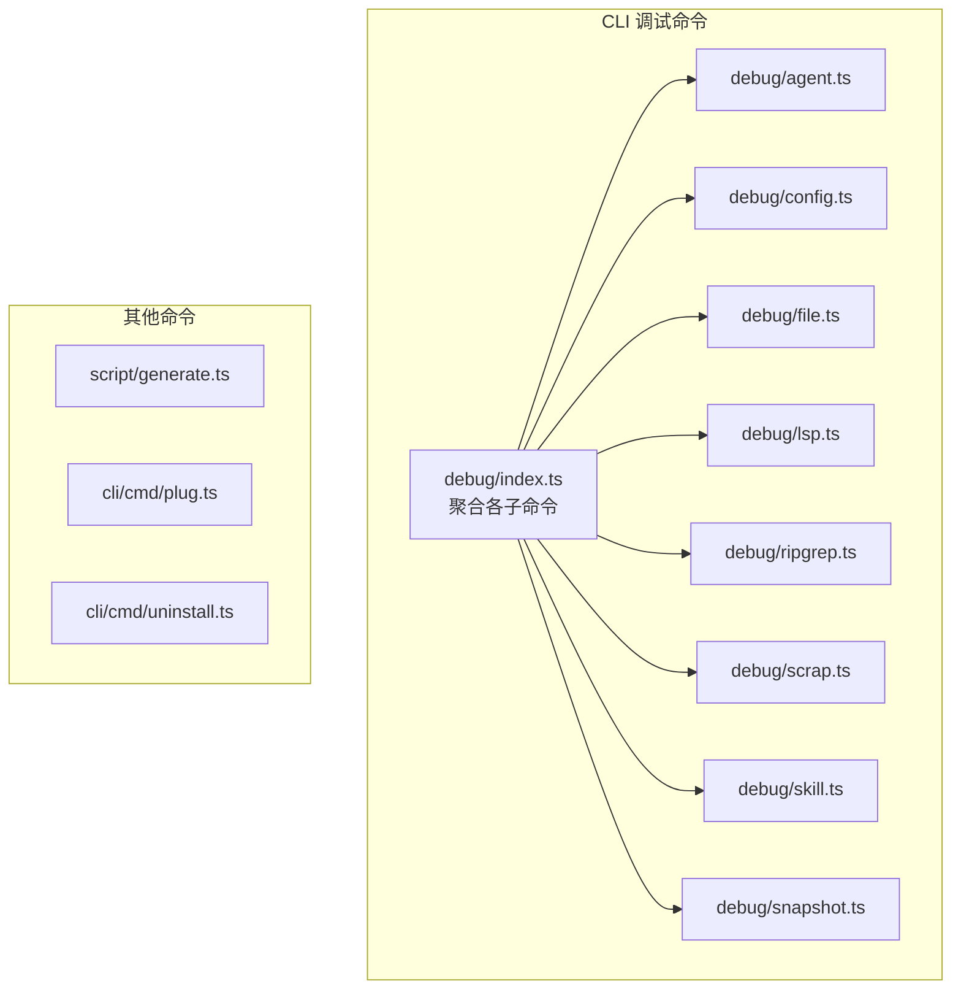
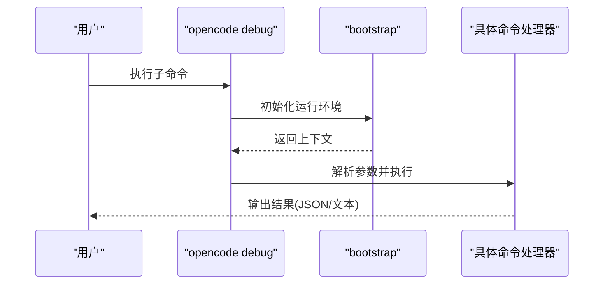
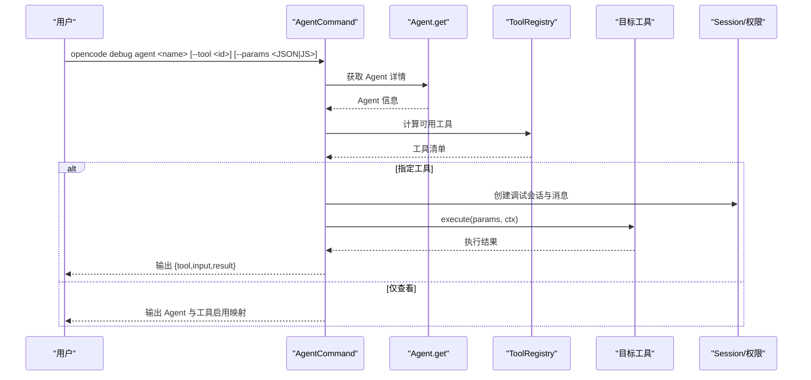
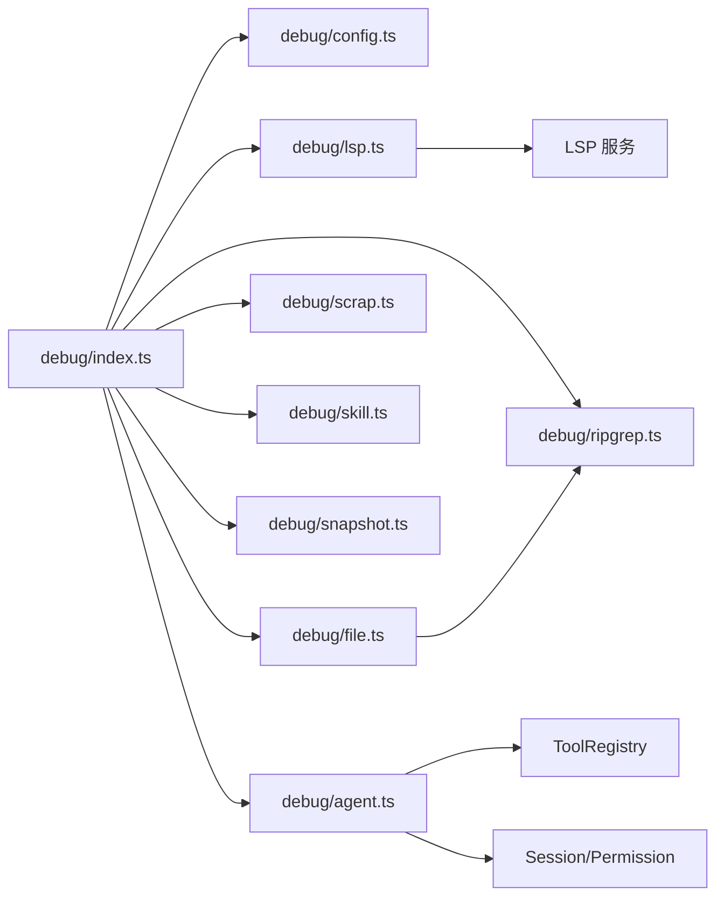

# 开发工具命令

<cite>
**本文引用的文件**
- [packages/opencode/src/cli/cmd/debug/index.ts](file://packages/opencode/src/cli/cmd/debug/index.ts)
- [packages/opencode/src/cli/cmd/debug/agent.ts](file://packages/opencode/src/cli/cmd/debug/agent.ts)
- [packages/opencode/src/cli/cmd/debug/config.ts](file://packages/opencode/src/cli/cmd/debug/config.ts)
- [packages/opencode/src/cli/cmd/debug/file.ts](file://packages/opencode/src/cli/cmd/debug/file.ts)
- [packages/opencode/src/cli/cmd/debug/lsp.ts](file://packages/opencode/src/cli/cmd/debug/lsp.ts)
- [packages/opencode/src/cli/cmd/debug/ripgrep.ts](file://packages/opencode/src/cli/cmd/debug/ripgrep.ts)
- [packages/opencode/src/cli/cmd/debug/scrap.ts](file://packages/opencode/src/cli/cmd/debug/scrap.ts)
- [packages/opencode/src/cli/cmd/debug/skill.ts](file://packages/opencode/src/cli/cmd/debug/skill.ts)
- [packages/opencode/src/cli/cmd/debug/snapshot.ts](file://packages/opencode/src/cli/cmd/debug/snapshot.ts)
- [script/generate.ts](file://script/generate.ts)
- [packages/opencode/src/cli/cmd/plug.ts](file://packages/opencode/src/cli/cmd/plug.ts)
- [packages/opencode/src/cli/cmd/uninstall.ts](file://packages/opencode/src/cli/cmd/uninstall.ts)
</cite>

## 目录
1. [简介](#简介)
2. [项目结构](#项目结构)
3. [核心组件](#核心组件)
4. [架构总览](#架构总览)
5. [详细组件分析](#详细组件分析)
6. [依赖分析](#依赖分析)
7. [性能考虑](#性能考虑)
8. [故障排除指南](#故障排除指南)
9. [结论](#结论)
10. [附录：使用示例与最佳实践](#附录使用示例与最佳实践)

## 简介
本文件面向 OpenCode 的开发工具命令，系统性梳理 debug 子命令体系（agent、config、file、lsp、ripgrep、scrap、skill、snapshot）以及与之相关的 generate、plug、uninstall 命令。内容涵盖：
- 调试命令的功能定位、参数与输出格式
- 代码生成命令的模板选择与参数配置
- 插件管理命令的安装、卸载与更新流程
- 卸载命令的安全检查机制
- 高级用法与常见问题排查
- 日常开发中的高效使用建议

## 项目结构
OpenCode 将 CLI 命令集中在 packages/opencode/src/cli/cmd 下，其中 debug 子命令通过统一入口聚合多个子命令，并由 bootstrap 进行运行时初始化。

图表来源
- [packages/opencode/src/cli/cmd/debug/index.ts:13-38](file://packages/opencode/src/cli/cmd/debug/index.ts#L13-L38)
- [packages/opencode/src/cli/cmd/debug/agent.ts:15-70](file://packages/opencode/src/cli/cmd/debug/agent.ts#L15-L70)
- [packages/opencode/src/cli/cmd/debug/config.ts:6-16](file://packages/opencode/src/cli/cmd/debug/config.ts#L6-L16)
- [packages/opencode/src/cli/cmd/debug/file.ts:85-97](file://packages/opencode/src/cli/cmd/debug/file.ts#L85-L97)
- [packages/opencode/src/cli/cmd/debug/lsp.ts:8-14](file://packages/opencode/src/cli/cmd/debug/lsp.ts#L8-L14)
- [packages/opencode/src/cli/cmd/debug/ripgrep.ts:7-12](file://packages/opencode/src/cli/cmd/debug/ripgrep.ts#L7-L12)
- [packages/opencode/src/cli/cmd/debug/scrap.ts:6-16](file://packages/opencode/src/cli/cmd/debug/scrap.ts#L6-L16)
- [packages/opencode/src/cli/cmd/debug/skill.ts:6-16](file://packages/opencode/src/cli/cmd/debug/skill.ts#L6-L16)
- [packages/opencode/src/cli/cmd/debug/snapshot.ts:5-10](file://packages/opencode/src/cli/cmd/debug/snapshot.ts#L5-L10)

章节来源
- [packages/opencode/src/cli/cmd/debug/index.ts:1-49](file://packages/opencode/src/cli/cmd/debug/index.ts#L1-L49)

## 核心组件
- 调试命令入口：debug/index.ts 聚合 config、lsp、ripgrep、file、scrap、skill、snapshot、agent 及 paths、wait 等子命令。
- 通用引导：各命令均通过 bootstrap 初始化运行环境，确保配置、会话、权限等上下文可用。
- 输出规范：多数命令以 JSON 或换行分隔的文本形式输出，便于管道处理与二次解析。

章节来源
- [packages/opencode/src/cli/cmd/debug/index.ts:13-38](file://packages/opencode/src/cli/cmd/debug/index.ts#L13-L38)

## 架构总览
下图展示了 debug 子命令的组织关系与典型调用链：

图表来源
- [packages/opencode/src/cli/cmd/debug/index.ts:13-38](file://packages/opencode/src/cli/cmd/debug/index.ts#L13-L38)
- [packages/opencode/src/cli/cmd/debug/agent.ts:33-68](file://packages/opencode/src/cli/cmd/debug/agent.ts#L33-L68)
- [packages/opencode/src/cli/cmd/debug/config.ts:10-14](file://packages/opencode/src/cli/cmd/debug/config.ts#L10-L14)

## 详细组件分析

### 调试命令：agent
- 功能概述
  - 查看指定 Agent 的配置与可用工具列表；可选执行某个工具并传入参数。
  - 支持对工具参数进行 JSON 或 JS 对象字面量解析。
- 关键行为
  - 参数校验：必须提供 agent 名称；若提供工具 ID，则需存在且未被禁用。
  - 工具解析：根据模型与权限计算工具启用状态。
  - 上下文构建：创建调试会话与消息，注入权限评估能力。
- 典型输出
  - 不带工具执行：返回 Agent 信息与工具启用映射。
  - 工具执行：返回 { tool, input, result } 结构。
- 使用要点
  - 使用 --params 传递对象参数，支持 JSON 或 JS 对象字面量。
  - 若工具被禁用，命令会直接退出并提示。

图表来源
- [packages/opencode/src/cli/cmd/debug/agent.ts:33-68](file://packages/opencode/src/cli/cmd/debug/agent.ts#L33-L68)
- [packages/opencode/src/cli/cmd/debug/agent.ts:72-87](file://packages/opencode/src/cli/cmd/debug/agent.ts#L72-L87)
- [packages/opencode/src/cli/cmd/debug/agent.ts:114-167](file://packages/opencode/src/cli/cmd/debug/agent.ts#L114-L167)

章节来源
- [packages/opencode/src/cli/cmd/debug/agent.ts:15-168](file://packages/opencode/src/cli/cmd/debug/agent.ts#L15-L168)

### 调试命令：config
- 功能概述
  - 展示已解析的全局配置，便于核对当前生效的配置项。
- 行为特征
  - 无额外参数，直接输出配置对象的 JSON 表示。

章节来源
- [packages/opencode/src/cli/cmd/debug/config.ts:6-16](file://packages/opencode/src/cli/cmd/debug/config.ts#L6-L16)

### 调试命令：file
- 子命令
  - file read <path>：按 JSON 输出文件内容。
  - file list <path>：列出目录内容。
  - file search <query>：基于查询条件搜索文件路径。
  - file status：输出文件状态信息。
  - file tree [dir]：使用 ripgrep 生成目录树（默认限制条目数）。
- 行为特征
  - 多数子命令直接输出 JSON 或换行分隔的文本。
  - tree 子命令内部使用 ripgrep 实现。

章节来源
- [packages/opencode/src/cli/cmd/debug/file.ts:7-97](file://packages/opencode/src/cli/cmd/debug/file.ts#L7-L97)

### 调试命令：lsp
- 子命令
  - lsp diagnostics <file>：触达文件并等待 LSP 生成诊断，随后输出诊断结果。
  - lsp symbols <query>：工作区符号检索。
  - lsp document-symbols <uri>：文档内符号检索。
- 行为特征
  - diagnostics 子命令会短暂延时以等待 LSP 完成分析。
  - 输出均为 JSON 结构，便于进一步处理。

章节来源
- [packages/opencode/src/cli/cmd/debug/lsp.ts:8-54](file://packages/opencode/src/cli/cmd/debug/lsp.ts#L8-L54)

### 调试命令：ripgrep
- 子命令
  - rg tree：使用 ripgrep 生成文件树，支持 limit 控制数量。
  - rg files：枚举文件，支持 glob 过滤与 limit 限制。
  - rg search <pattern>：按模式搜索文件内容，支持 glob 与 limit。
- 行为特征
  - files 与 search 采用流式迭代，达到 limit 后停止。
  - 输出格式因子命令而异：tree 输出纯文本，search 输出 JSON。

章节来源
- [packages/opencode/src/cli/cmd/debug/ripgrep.ts:7-88](file://packages/opencode/src/cli/cmd/debug/ripgrep.ts#L7-L88)

### 调试命令：scrap
- 功能概述
  - 列出所有已知项目，用于排查项目索引或缓存问题。
- 行为特征
  - 输出项目列表的 JSON 表示。

章节来源
- [packages/opencode/src/cli/cmd/debug/scrap.ts:6-16](file://packages/opencode/src/cli/cmd/debug/scrap.ts#L6-L16)

### 调试命令：skill
- 功能概述
  - 列出所有可用技能，便于确认技能注册与加载状态。
- 行为特征
  - 输出技能列表的 JSON 表示。

章节来源
- [packages/opencode/src/cli/cmd/debug/skill.ts:6-16](file://packages/opencode/src/cli/cmd/debug/skill.ts#L6-L16)

### 调试命令：snapshot
- 子命令
  - snapshot track：跟踪当前快照状态。
  - snapshot patch <hash>：显示指定快照的补丁。
  - snapshot diff <hash>：显示指定快照的差异。
- 行为特征
  - 输出均为文本或 JSON，便于比对与审阅。

章节来源
- [packages/opencode/src/cli/cmd/debug/snapshot.ts:5-53](file://packages/opencode/src/cli/cmd/debug/snapshot.ts#L5-L53)

### 代码生成命令：generate
- 功能概述
  - 提供代码生成能力，支持模板选择与参数配置，输出到目标位置。
- 关键点
  - 模板选择：通过命令行参数或配置文件指定模板标识。
  - 参数配置：支持传入键值对作为生成参数，覆盖模板默认值。
  - 输出格式：通常输出生成文件路径列表或生成内容摘要。
- 使用建议
  - 在 CI 中结合模板与参数，实现可重复的代码生成流水线。
  - 通过 dry-run 模式预览生成结果，避免误改本地文件。

章节来源
- [script/generate.ts](file://script/generate.ts)

### 插件管理命令：plug
- 功能概述
  - 管理 OpenCode 插件生态，支持安装、卸载、更新等操作。
- 关键点
  - 安装：从仓库或本地源拉取并注册插件。
  - 卸载：移除插件及其关联资源。
  - 更新：拉取最新版本并替换旧版本。
- 安全与兼容性
  - 校验插件元数据与签名（如启用）。
  - 检查依赖冲突与版本兼容性。
  - 备份旧版本以便回滚。

章节来源
- [packages/opencode/src/cli/cmd/plug.ts](file://packages/opencode/src/cli/cmd/plug.ts)

### 卸载命令：uninstall
- 功能概述
  - 安全地卸载 OpenCode 或其组件，清理残留文件与配置。
- 安全检查机制
  - 交互确认：要求用户明确确认卸载动作。
  - 依赖扫描：检测是否仍有依赖该组件的项目或插件。
  - 危险操作保护：阻止删除关键系统文件或受保护路径。
- 清理流程
  - 删除二进制与配置文件。
  - 清理缓存与日志。
  - 回收注册表与索引。

章节来源
- [packages/opencode/src/cli/cmd/uninstall.ts](file://packages/opencode/src/cli/cmd/uninstall.ts)

## 依赖分析
- 命令聚合与引导
  - debug/index.ts 统一导出各子命令，并提供 wait、paths 等辅助命令。
  - 各子命令通过 bootstrap 初始化，确保后续模块（如 Agent、Config、LSP 等）可用。
- 子命令间关系
  - file/tree 依赖 ripgrep 实现目录遍历。
  - agent 子命令依赖 ToolRegistry、Session、Permission 等模块。
  - lsp 子命令依赖 LSP 服务接口。
- 外部依赖
  - ripgrep：用于高性能文件与内容检索。
  - JSON 输出：统一使用标准库序列化，便于跨平台处理。

图表来源
- [packages/opencode/src/cli/cmd/debug/index.ts:13-38](file://packages/opencode/src/cli/cmd/debug/index.ts#L13-L38)
- [packages/opencode/src/cli/cmd/debug/file.ts:5-83](file://packages/opencode/src/cli/cmd/debug/file.ts#L5-L83)
- [packages/opencode/src/cli/cmd/debug/agent.ts:72-87](file://packages/opencode/src/cli/cmd/debug/agent.ts#L72-L87)

章节来源
- [packages/opencode/src/cli/cmd/debug/index.ts:1-49](file://packages/opencode/src/cli/cmd/debug/index.ts#L1-L49)

## 性能考虑
- 流式输出与限制
  - ripgrep 的 files/search 子命令支持 limit，避免一次性输出过多数据导致内存压力。
- 延迟与刷新
  - lsp diagnostics 子命令内置短暂延迟，确保 LSP 完成分析后再输出结果。
- JSON 序列化
  - 多数命令使用紧凑 JSON 输出，减少 I/O 开销；必要时可使用换行分隔的多行 JSON 便于流式处理。

## 故障排除指南
- agent 子命令
  - 现象：提示工具未找到或被禁用
  - 排查：确认工具 ID 是否正确；检查 Agent 权限配置；使用 skill 子命令核对可用技能。
  - 现象：--params 解析失败
  - 排查：确保传入 JSON 或 JS 对象字面量；避免传入数组或非对象类型。
- file 子命令
  - 现象：tree 输出为空
  - 排查：尝试增大 limit；确认目录权限；使用 search 验证文件是否存在。
- lsp 子命令
  - 现象：diagnostics 输出为空
  - 排查：确认文件已保存并触发 LSP；稍后重试；检查 LSP 日志。
- ripgrep 子命令
  - 现象：files/search 速度慢
  - 排查：添加更精确的 glob 过滤；减小 limit；检查磁盘 IO。
- snapshot 子命令
  - 现象：patch/diff 无法解析哈希
  - 排查：确认哈希有效且存在于快照历史；使用 track 查看当前状态。

## 结论
OpenCode 的调试命令体系以 debug 为核心入口，围绕配置、文件系统、语言服务、搜索与快照等维度提供了丰富的诊断与排错能力。配合 generate、plug、uninstall 等命令，开发者可以快速定位问题、自动化生成代码、管理插件生态并安全卸载组件。建议在团队内建立标准化的调试流程与脚本，结合 JSON 输出与管道工具，形成高效的开发与运维闭环。

## 附录：使用示例与最佳实践
- 快速查看配置
  - 命令：opencode debug config
  - 场景：CI 校验配置一致性；本地排查配置覆盖问题。
- 诊断 LSP 问题
  - 命令：opencode debug lsp diagnostics <file>
  - 场景：编辑器报错但本地无感知；等待 LSP 分析后复现问题。
- 文件检索与目录浏览
  - 命令：opencode debug file search <query>；opencode debug file tree [dir]
  - 场景：定位特定文件；快速浏览工程结构。
- 搜索代码内容
  - 命令：opencode debug rg search <pattern> --glob <glob> --limit <n>
  - 场景：跨文件查找关键字；限定匹配范围与数量。
- 调试 Agent 工具
  - 命令：opencode debug agent <name> --tool <id> --params '{"k":"v"}'
  - 场景：验证工具输入输出；模拟权限与会话上下文。
- 生成代码
  - 命令：bun run script/generate.ts --template <tpl> --output <dir> --param k=v
  - 场景：批量生成样板代码；集成到 CI。
- 插件管理
  - 命令：opencode plug install/update/uninstall <plugin>
  - 场景：安装新插件；升级过期插件；清理不再使用的插件。
- 卸载前安全检查
  - 命令：opencode uninstall
  - 场景：准备卸载时先扫描依赖与配置；确认备份策略。