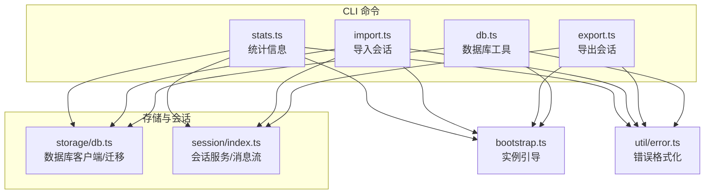
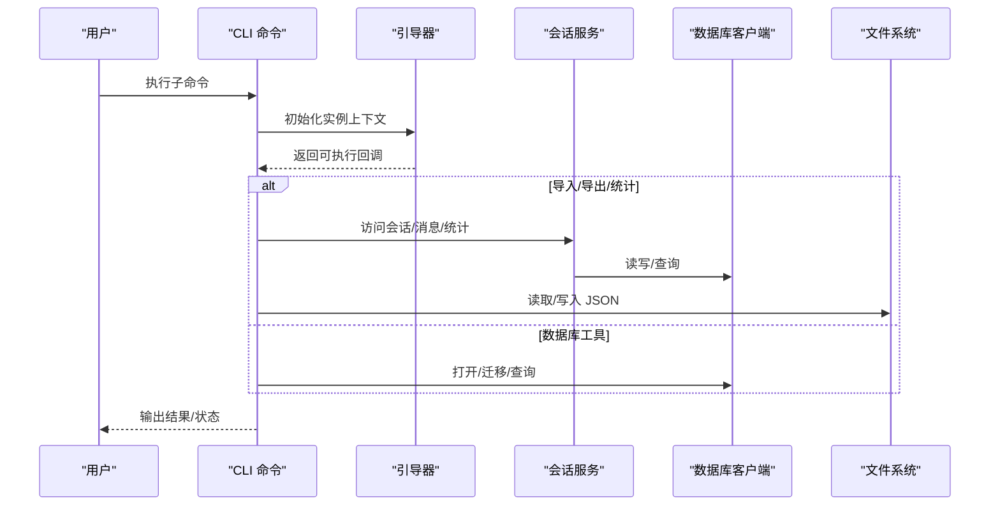
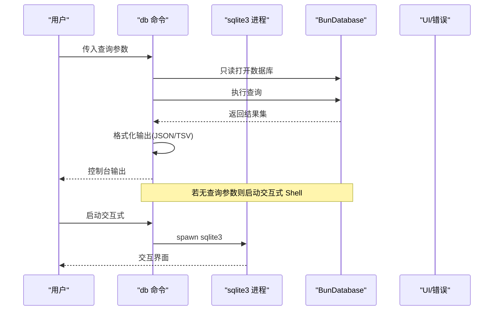
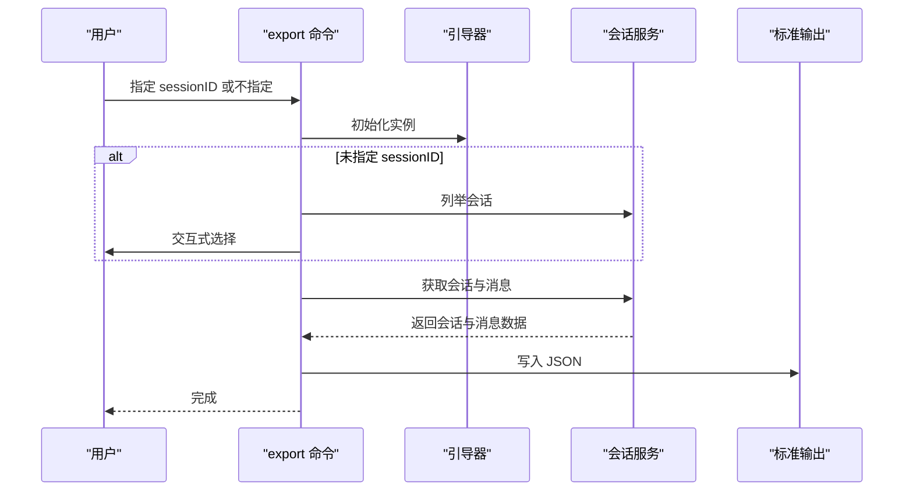
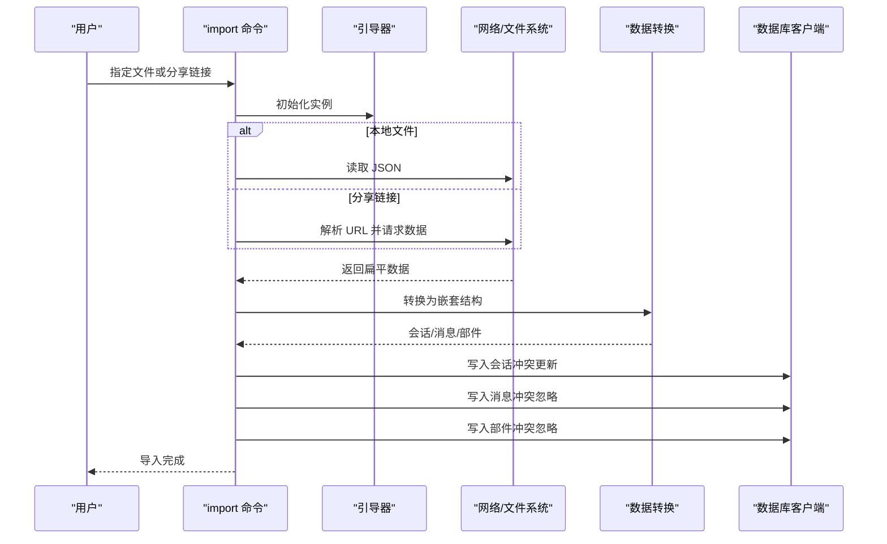
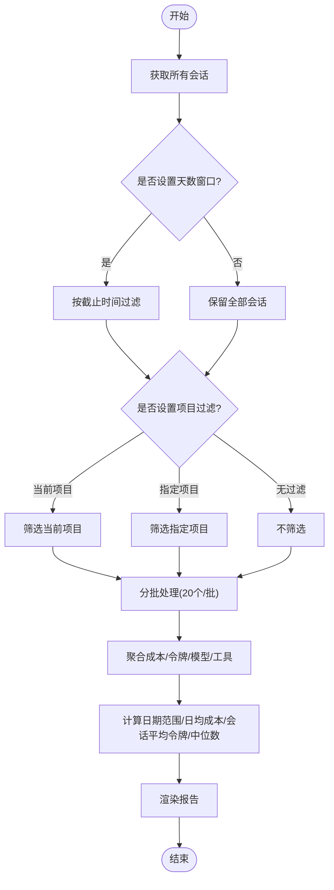
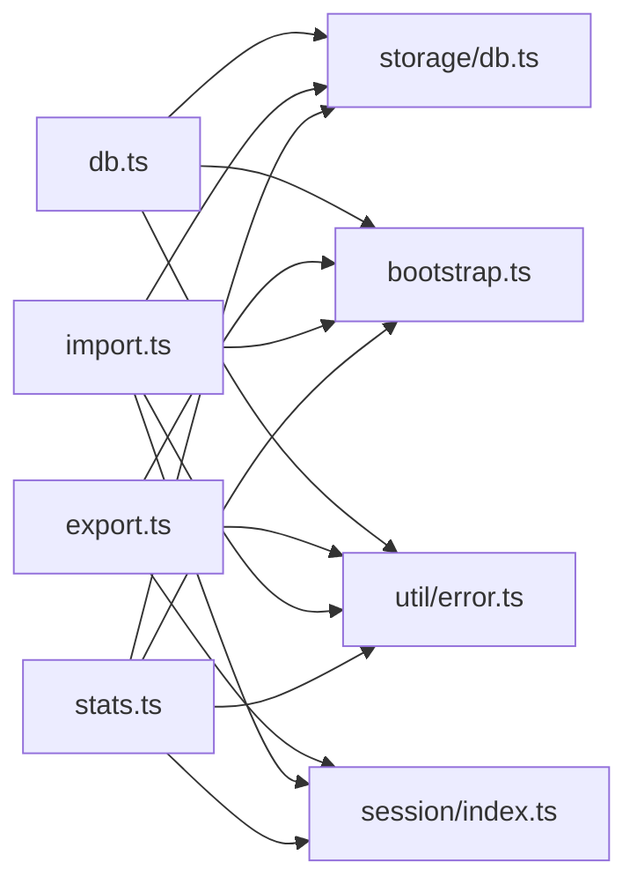

# 数据管理命令

<cite>
**本文引用的文件**
- [packages/opencode/src/cli/cmd/db.ts](file://packages/opencode/src/cli/cmd/db.ts)
- [packages/opencode/src/cli/cmd/export.ts](file://packages/opencode/src/cli/cmd/export.ts)
- [packages/opencode/src/cli/cmd/import.ts](file://packages/opencode/src/cli/cmd/import.ts)
- [packages/opencode/src/cli/cmd/stats.ts](file://packages/opencode/src/cli/cmd/stats.ts)
- [packages/opencode/src/storage/db.ts](file://packages/opencode/src/storage/db.ts)
- [packages/opencode/src/session/index.ts](file://packages/opencode/src/session/index.ts)
- [packages/opencode/src/cli/bootstrap.ts](file://packages/opencode/src/cli/bootstrap.ts)
- [packages/opencode/src/util/error.ts](file://packages/opencode/src/util/error.ts)
</cite>

## 目录
1. [简介](#简介)
2. [项目结构](#项目结构)
3. [核心组件](#核心组件)
4. [架构总览](#架构总览)
5. [详细组件分析](#详细组件分析)
6. [依赖关系分析](#依赖关系分析)
7. [性能考量](#性能考量)
8. [故障排查指南](#故障排查指南)
9. [结论](#结论)
10. [附录：使用示例与最佳实践](#附录使用示例与最佳实践)

## 简介
本文件面向 OpenCode 的数据管理命令，系统性梳理以下 CLI 子命令的能力边界与实现要点：
- db 命令：数据库工具，支持交互式 SQLite Shell、查询输出格式控制、数据库路径查看、JSON 到 SQLite 的迁移。
- export 命令：将会话（session）及其消息、部件（parts）导出为 JSON，支持交互式选择会话。
- import 命令：从本地 JSON 文件或分享链接导入会话数据，自动重建层级结构，执行去重写入策略。
- stats 命令：按时间窗口与项目维度聚合会话统计，输出总消耗、令牌分布、模型与工具使用排行。

同时给出数据备份、恢复、迁移的实操建议，以及数据完整性校验与错误处理的最佳实践。

## 项目结构
OpenCode 的数据管理命令位于 CLI 模块中，围绕会话与消息的持久化、统计与导入导出展开；底层通过统一的数据库客户端与迁移框架完成初始化与版本演进。

图表来源
- [packages/opencode/src/cli/cmd/db.ts:11-119](file://packages/opencode/src/cli/cmd/db.ts#L11-L119)
- [packages/opencode/src/cli/cmd/export.ts:10-89](file://packages/opencode/src/cli/cmd/export.ts#L10-L89)
- [packages/opencode/src/cli/cmd/import.ts:76-207](file://packages/opencode/src/cli/cmd/import.ts#L76-L207)
- [packages/opencode/src/cli/cmd/stats.ts:49-84](file://packages/opencode/src/cli/cmd/stats.ts#L49-L84)
- [packages/opencode/src/storage/db.ts:30-175](file://packages/opencode/src/storage/db.ts#L30-L175)
- [packages/opencode/src/session/index.ts:39-780](file://packages/opencode/src/session/index.ts#L39-L780)
- [packages/opencode/src/cli/bootstrap.ts:4-17](file://packages/opencode/src/cli/bootstrap.ts#L4-L17)
- [packages/opencode/src/util/error.ts:19-35](file://packages/opencode/src/util/error.ts#L19-L35)

章节来源
- [packages/opencode/src/cli/cmd/db.ts:11-119](file://packages/opencode/src/cli/cmd/db.ts#L11-L119)
- [packages/opencode/src/cli/cmd/export.ts:10-89](file://packages/opencode/src/cli/cmd/export.ts#L10-L89)
- [packages/opencode/src/cli/cmd/import.ts:76-207](file://packages/opencode/src/cli/cmd/import.ts#L76-L207)
- [packages/opencode/src/cli/cmd/stats.ts:49-84](file://packages/opencode/src/cli/cmd/stats.ts#L49-L84)
- [packages/opencode/src/storage/db.ts:30-175](file://packages/opencode/src/storage/db.ts#L30-L175)
- [packages/opencode/src/session/index.ts:39-780](file://packages/opencode/src/session/index.ts#L39-L780)
- [packages/opencode/src/cli/bootstrap.ts:4-17](file://packages/opencode/src/cli/bootstrap.ts#L4-L17)
- [packages/opencode/src/util/error.ts:19-35](file://packages/opencode/src/util/error.ts#L19-L35)

## 核心组件
- 数据库工具（db）
  - 支持交互式 sqlite3 Shell，或以 JSON/TSV 输出执行 SQL 查询结果。
  - 提供数据库路径查看与 JSON 迁移至 SQLite 的能力，并带进度反馈。
- 导出（export）
  - 将指定或最新会话及其消息、部件导出为 JSON，便于备份与分享。
- 导入（import）
  - 支持从本地 JSON 或分享链接导入，自动解析扁平数据为嵌套结构，写入数据库并采用“冲突时更新/忽略”策略。
- 统计（stats）
  - 聚合会话成本、令牌、模型与工具使用，支持按天数窗口与项目过滤，输出表格化报告。

章节来源
- [packages/opencode/src/cli/cmd/db.ts:11-119](file://packages/opencode/src/cli/cmd/db.ts#L11-L119)
- [packages/opencode/src/cli/cmd/export.ts:10-89](file://packages/opencode/src/cli/cmd/export.ts#L10-L89)
- [packages/opencode/src/cli/cmd/import.ts:76-207](file://packages/opencode/src/cli/cmd/import.ts#L76-L207)
- [packages/opencode/src/cli/cmd/stats.ts:49-84](file://packages/opencode/src/cli/cmd/stats.ts#L49-L84)

## 架构总览
下图展示数据管理命令与存储层、会话层及引导流程的关系：

图表来源
- [packages/opencode/src/cli/cmd/db.ts:27-53](file://packages/opencode/src/cli/cmd/db.ts#L27-L53)
- [packages/opencode/src/cli/cmd/export.ts:19-87](file://packages/opencode/src/cli/cmd/export.ts#L19-L87)
- [packages/opencode/src/cli/cmd/import.ts:86-206](file://packages/opencode/src/cli/cmd/import.ts#L86-L206)
- [packages/opencode/src/cli/cmd/stats.ts:70-82](file://packages/opencode/src/cli/cmd/stats.ts#L70-L82)
- [packages/opencode/src/session/index.ts:595-600](file://packages/opencode/src/session/index.ts#L595-L600)
- [packages/opencode/src/storage/db.ts:85-116](file://packages/opencode/src/storage/db.ts#L85-L116)
- [packages/opencode/src/cli/bootstrap.ts:4-17](file://packages/opencode/src/cli/bootstrap.ts#L4-L17)

## 详细组件分析

### 数据库工具（db）
- 功能要点
  - 交互式 Shell：当未提供查询参数时，启动 sqlite3 并继承标准输入输出。
  - SQL 查询执行：当提供查询参数时，使用只读模式连接数据库，支持 JSON/TSV 输出。
  - 路径查看：打印当前数据库文件路径。
  - 迁移：将历史 JSON 数据迁移到 SQLite，合并现有数据，显示进度与统计，失败时输出错误并退出。
- 关键实现位置
  - 查询与输出：[packages/opencode/src/cli/cmd/db.ts:27-53](file://packages/opencode/src/cli/cmd/db.ts#L27-L53)
  - 路径命令：[packages/opencode/src/cli/cmd/db.ts:56-62](file://packages/opencode/src/cli/cmd/db.ts#L56-L62)
  - 迁移命令：[packages/opencode/src/cli/cmd/db.ts:64-110](file://packages/opencode/src/cli/cmd/db.ts#L64-L110)
  - 底层数据库客户端与迁移：[packages/opencode/src/storage/db.ts:85-116](file://packages/opencode/src/storage/db.ts#L85-L116)

图表来源
- [packages/opencode/src/cli/cmd/db.ts:27-53](file://packages/opencode/src/cli/cmd/db.ts#L27-L53)
- [packages/opencode/src/cli/cmd/db.ts:49-52](file://packages/opencode/src/cli/cmd/db.ts#L49-L52)
- [packages/opencode/src/storage/db.ts:30-44](file://packages/opencode/src/storage/db.ts#L30-L44)

章节来源
- [packages/opencode/src/cli/cmd/db.ts:11-119](file://packages/opencode/src/cli/cmd/db.ts#L11-L119)
- [packages/opencode/src/storage/db.ts:30-116](file://packages/opencode/src/storage/db.ts#L30-L116)

### 导出（export）
- 功能要点
  - 支持直接传入会话 ID 或交互式选择最新会话。
  - 读取会话元信息与消息列表，仅保留必要字段，输出为 JSON。
  - 当无会话时提示并结束。
- 关键实现位置
  - 命令定义与参数：[packages/opencode/src/cli/cmd/export.ts:10-18](file://packages/opencode/src/cli/cmd/export.ts#L10-L18)
  - 交互式选择与导出逻辑：[packages/opencode/src/cli/cmd/export.ts:19-87](file://packages/opencode/src/cli/cmd/export.ts#L19-L87)
  - 会话读取与消息流：[packages/opencode/src/session/index.ts:595-600](file://packages/opencode/src/session/index.ts#L595-L600)

图表来源
- [packages/opencode/src/cli/cmd/export.ts:19-87](file://packages/opencode/src/cli/cmd/export.ts#L19-L87)
- [packages/opencode/src/session/index.ts:595-600](file://packages/opencode/src/session/index.ts#L595-L600)
- [packages/opencode/src/cli/bootstrap.ts:4-17](file://packages/opencode/src/cli/bootstrap.ts#L4-L17)

章节来源
- [packages/opencode/src/cli/cmd/export.ts:10-89](file://packages/opencode/src/cli/cmd/export.ts#L10-L89)
- [packages/opencode/src/session/index.ts:595-600](file://packages/opencode/src/session/index.ts#L595-L600)

### 导入（import）
- 功能要点
  - 支持本地 JSON 文件或分享链接导入。
  - 分享链接解析与数据拉取，兼容不同 API 路径。
  - 将扁平数据转换为嵌套结构（会话-消息-部件），写入数据库。
  - 使用冲突处理策略：会话按 ID 更新项目字段；消息与部件按 ID 忽略重复。
- 关键实现位置
  - 命令定义与参数：[packages/opencode/src/cli/cmd/import.ts:76-85](file://packages/opencode/src/cli/cmd/import.ts#L76-L85)
  - URL 解析与请求：[packages/opencode/src/cli/cmd/import.ts:98-139](file://packages/opencode/src/cli/cmd/import.ts#L98-L139)
  - 数据转换与写入：[packages/opencode/src/cli/cmd/import.ts:139-201](file://packages/opencode/src/cli/cmd/import.ts#L139-L201)
  - 数据库写入与冲突策略：[packages/opencode/src/cli/cmd/import.ts:156-167](file://packages/opencode/src/cli/cmd/import.ts#L156-L167)

图表来源
- [packages/opencode/src/cli/cmd/import.ts:76-201](file://packages/opencode/src/cli/cmd/import.ts#L76-L201)
- [packages/opencode/src/cli/bootstrap.ts:4-17](file://packages/opencode/src/cli/bootstrap.ts#L4-L17)

章节来源
- [packages/opencode/src/cli/cmd/import.ts:76-207](file://packages/opencode/src/cli/cmd/import.ts#L76-L207)

### 统计（stats）
- 功能要点
  - 支持按天数窗口与项目过滤，聚合会话总数、消息数、成本、令牌（含缓存读写）、模型与工具使用。
  - 输出表格化报告，包含概览、成本与令牌、模型使用、工具使用等板块。
  - 对大数据集给出提示，分批处理以平衡内存与性能。
- 关键实现位置
  - 命令定义与参数：[packages/opencode/src/cli/cmd/stats.ts:49-69](file://packages/opencode/src/cli/cmd/stats.ts#L49-L69)
  - 聚合函数与窗口计算：[packages/opencode/src/cli/cmd/stats.ts:95-307](file://packages/opencode/src/cli/cmd/stats.ts#L95-L307)
  - 报告渲染与格式化：[packages/opencode/src/cli/cmd/stats.ts:309-410](file://packages/opencode/src/cli/cmd/stats.ts#L309-L410)

图表来源
- [packages/opencode/src/cli/cmd/stats.ts:95-307](file://packages/opencode/src/cli/cmd/stats.ts#L95-L307)
- [packages/opencode/src/cli/cmd/stats.ts:309-410](file://packages/opencode/src/cli/cmd/stats.ts#L309-L410)

章节来源
- [packages/opencode/src/cli/cmd/stats.ts:49-411](file://packages/opencode/src/cli/cmd/stats.ts#L49-L411)

## 依赖关系分析
- 命令到存储
  - db 命令依赖数据库客户端与迁移框架，负责数据库初始化、WAL 模式、外键约束、迁移应用。
  - export/import/stats 命令依赖会话服务，通过会话层读取消息与部件。
- 引导与上下文
  - 所有命令通过引导器在实例上下文中运行，确保项目、工作区、配置等环境就绪。
- 错误处理
  - 统一使用错误格式化工具，保证错误消息一致且可诊断。

图表来源
- [packages/opencode/src/cli/cmd/db.ts:1-10](file://packages/opencode/src/cli/cmd/db.ts#L1-L10)
- [packages/opencode/src/cli/cmd/export.ts:1-8](file://packages/opencode/src/cli/cmd/export.ts#L1-L8)
- [packages/opencode/src/cli/cmd/import.ts:1-12](file://packages/opencode/src/cli/cmd/import.ts#L1-L12)
- [packages/opencode/src/cli/cmd/stats.ts:1-8](file://packages/opencode/src/cli/cmd/stats.ts#L1-L8)
- [packages/opencode/src/storage/db.ts:1-17](file://packages/opencode/src/storage/db.ts#L1-L17)
- [packages/opencode/src/session/index.ts:1-30](file://packages/opencode/src/session/index.ts#L1-L30)
- [packages/opencode/src/cli/bootstrap.ts:1-17](file://packages/opencode/src/cli/bootstrap.ts#L1-L17)
- [packages/opencode/src/util/error.ts:1-35](file://packages/opencode/src/util/error.ts#L1-L35)

章节来源
- [packages/opencode/src/cli/cmd/db.ts:1-10](file://packages/opencode/src/cli/cmd/db.ts#L1-L10)
- [packages/opencode/src/cli/cmd/export.ts:1-8](file://packages/opencode/src/cli/cmd/export.ts#L1-L8)
- [packages/opencode/src/cli/cmd/import.ts:1-12](file://packages/opencode/src/cli/cmd/import.ts#L1-L12)
- [packages/opencode/src/cli/cmd/stats.ts:1-8](file://packages/opencode/src/cli/cmd/stats.ts#L1-L8)
- [packages/opencode/src/storage/db.ts:1-17](file://packages/opencode/src/storage/db.ts#L1-L17)
- [packages/opencode/src/session/index.ts:1-30](file://packages/opencode/src/session/index.ts#L1-L30)
- [packages/opencode/src/cli/bootstrap.ts:1-17](file://packages/opencode/src/cli/bootstrap.ts#L1-L17)
- [packages/opencode/src/util/error.ts:1-35](file://packages/opencode/src/util/error.ts#L1-L35)

## 性能考量
- 大数据集处理
  - 统计命令对会话分批聚合（每批 20 个），避免一次性加载过多数据导致内存压力。
- 数据库优化
  - 默认启用 WAL 模式、NORMAL 同步、超时与缓存参数，开启外键约束，提升并发与一致性。
- I/O 与网络
  - 导入命令在写入前先进行数据转换与校验，减少无效写入；网络请求失败时给出明确提示。
- 输出格式
  - db 命令在大量结果时优先 TSV 以降低序列化开销；JSON 更适合小量结果与调试。

## 故障排查指南
- 常见问题与定位
  - 数据库无法打开：检查数据库路径与权限，确认迁移是否成功。
  - 导入失败：核对输入文件或分享链接格式；关注网络请求状态码与响应体。
  - 导出为空：确认是否存在会话记录，或会话是否被过滤掉。
  - 统计异常：检查天数窗口与项目过滤参数，确认会话数据是否完整。
- 错误输出
  - 统一使用错误格式化工具，优先返回简洁可读的消息；必要时输出堆栈以便定位。
- 退出码
  - 命令在遇到错误时返回非零退出码，便于脚本捕获与处理。

章节来源
- [packages/opencode/src/util/error.ts:19-35](file://packages/opencode/src/util/error.ts#L19-L35)
- [packages/opencode/src/cli/cmd/db.ts:42-44](file://packages/opencode/src/cli/cmd/db.ts#L42-L44)
- [packages/opencode/src/cli/cmd/import.ts:125-129](file://packages/opencode/src/cli/cmd/import.ts#L125-L129)
- [packages/opencode/src/cli/cmd/export.ts:35-42](file://packages/opencode/src/cli/cmd/export.ts#L35-L42)
- [packages/opencode/src/cli/cmd/stats.ts:151-153](file://packages/opencode/src/cli/cmd/stats.ts#L151-L153)

## 结论
OpenCode 的数据管理命令围绕“会话-消息-部件”的核心数据模型构建，提供了从数据库初始化、结构迁移、查询导出、导入写入到统计分析的完整链路。通过统一的引导与错误处理机制，命令具备良好的可用性与可维护性。建议在生产环境中结合备份与校验流程，确保数据安全与一致性。

## 附录：使用示例与最佳实践

- 数据库初始化与迁移
  - 查看数据库路径：db path
  - 进入交互式 Shell：db
  - 执行 SQL 查询并以 JSON/TSV 输出：db "SELECT ..." --format json|tsv
  - 迁移历史数据：db migrate
- 数据导出
  - 导出指定会话：export <sessionID>
  - 交互式选择并导出：export
  - 导出后可用于备份或分享给他人
- 数据导入
  - 从本地 JSON 导入：import <file.json>
  - 从分享链接导入：import https://opncd.ai/share/<slug>
  - 导入后会自动重建会话-消息-部件层级，重复项按策略处理
- 统计信息
  - 查看全部会话统计：stats
  - 按最近 N 天过滤：stats --days N
  - 按项目过滤：stats --project <projectID|空字符串=当前项目>
  - 显示前 M 个模型：stats --models M
  - 显示前 K 个工具：stats --tools K
- 备份与恢复
  - 备份：export 导出关键会话 JSON 至安全位置
  - 恢复：import 将备份 JSON 恢复到目标环境
  - 迁移：db migrate 合并历史数据到新数据库
- 数据完整性与错误处理最佳实践
  - 在导入前后进行校验：比对会话数量、消息数量与令牌总量
  - 使用事务与冲突策略：导入时采用“更新/忽略”策略，避免重复写入
  - 记录日志与错误：利用统一错误格式化工具，保留堆栈与上下文
  - 分批处理大数据：统计与导入均采用分批策略，降低内存峰值