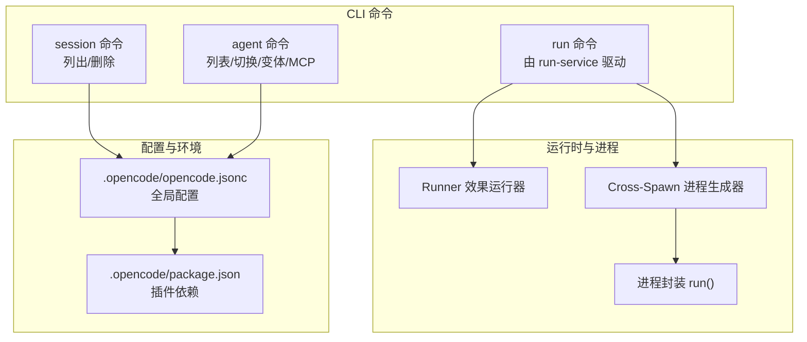
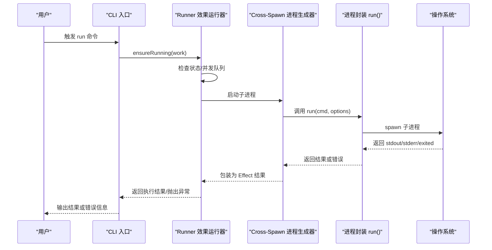
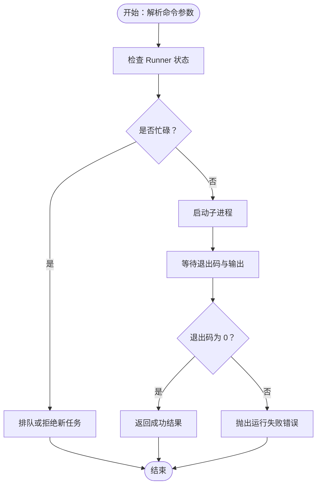
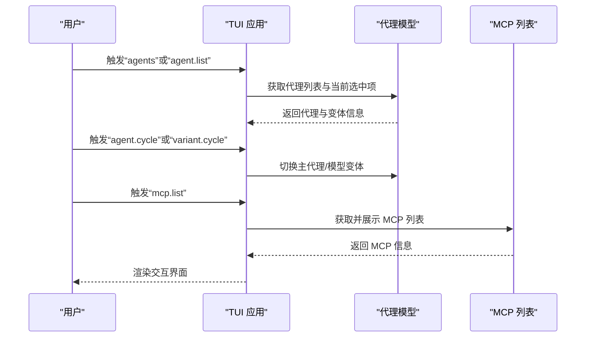
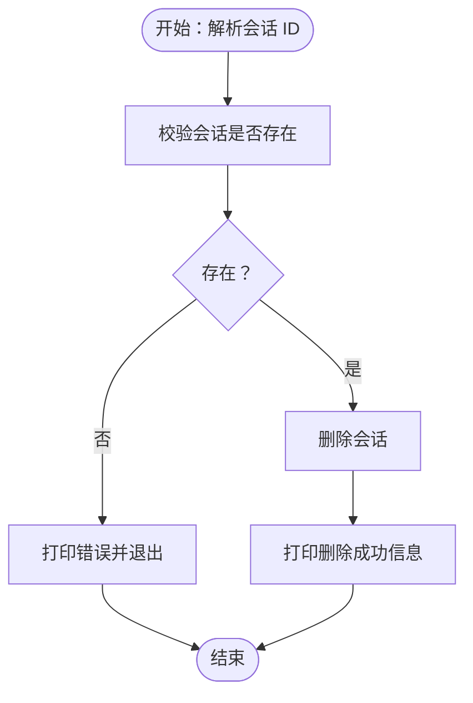
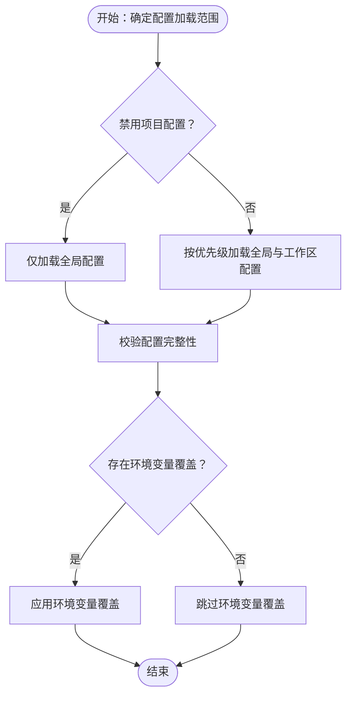
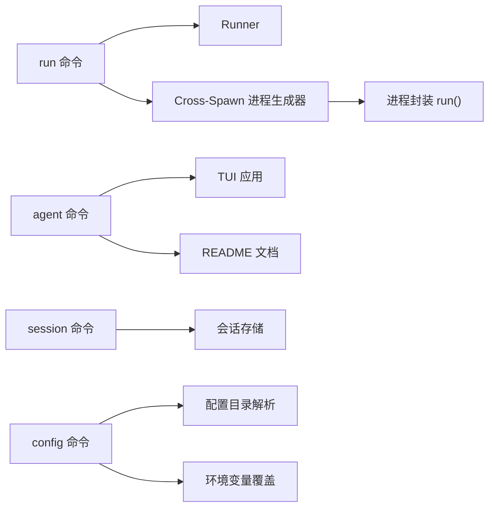

# 核心命令

<cite>
**本文引用的文件**
- [README.md](file://README.md)
- [.opencode/opencode.jsonc](file://.opencode/opencode.jsonc)
- [.opencode/package.json](file://.opencode/package.json)
- [packages/opencode/src/cli/cmd/session.ts](file://packages/opencode/src/cli/cmd/session.ts)
- [packages/opencode/src/cli/cmd/tui/app.tsx](file://packages/opencode/src/cli/cmd/tui/app.tsx)
- [packages/opencode/src/cli/cmd/tui/component/prompt/index.tsx](file://packages/opencode/src/cli/cmd/tui/component/prompt/index.tsx)
- [packages/opencode/src/effect/runner.ts](file://packages/opencode/src/effect/runner.ts)
- [packages/opencode/src/effect/cross-spawn-spawner.ts](file://packages/opencode/src/effect/cross-spawn-spawner.ts)
- [packages/opencode/src/util/process.ts](file://packages/opencode/src/util/process.ts)
- [packages/opencode/test/effect/runner.test.ts](file://packages/opencode/test/effect/runner.test.ts)
- [packages/opencode/test/config/config.test.ts](file://packages/opencode/test/config/config.test.ts)
</cite>

## 目录
1. [简介](#简介)
2. [项目结构](#项目结构)
3. [核心组件](#核心组件)
4. [架构总览](#架构总览)
5. [详细组件分析](#详细组件分析)
6. [依赖分析](#依赖分析)
7. [性能考虑](#性能考虑)
8. [故障排查指南](#故障排查指南)
9. [结论](#结论)
10. [附录](#附录)

## 简介
本文件面向 OpenCode 的核心命令，系统化梳理 run、agent、session、config 四类基础命令的功能特性与使用方法。重点覆盖以下方面：
- run 命令：代码生成与执行流程（参数解析、代理选择、工具调用、进程运行与错误处理）
- agent 命令：代理管理（代理列表、切换、模型变体、MCP 列表等）
- session 命令：会话管理（列出、删除、历史等）
- config 命令：配置管理（全局配置、工作区配置、环境变量、禁用项目配置等）

同时提供命令使用示例与最佳实践，帮助不同技术背景的用户快速上手。

## 项目结构
OpenCode 的核心命令主要分布在 CLI 与 TUI 组件中，并通过效果化运行器与进程封装层协同工作。下图给出与“核心命令”相关的模块关系概览：

图表来源
- [packages/opencode/src/effect/runner.ts:141-169](file://packages/opencode/src/effect/runner.ts#L141-L169)
- [packages/opencode/src/effect/cross-spawn-spawner.ts:462-502](file://packages/opencode/src/effect/cross-spawn-spawner.ts#L462-L502)
- [packages/opencode/src/util/process.ts:114-145](file://packages/opencode/src/util/process.ts#L114-L145)
- [.opencode/opencode.jsonc:1-19](file://.opencode/opencode.jsonc#L1-L19)
- [.opencode/package.json:1-5](file://.opencode/package.json#L1-L5)

章节来源
- [README.md:100-114](file://README.md#L100-L114)
- [.opencode/opencode.jsonc:1-19](file://.opencode/opencode.jsonc#L1-L19)
- [.opencode/package.json:1-5](file://.opencode/package.json#L1-L5)

## 核心组件
- run 命令：通过效果运行器与跨平台进程生成器协调执行外部命令，支持中断、并发排队、错误包装与返回码判定。
- agent 命令：在 TUI 中提供代理列表、循环切换、模型变体切换与 MCP 列表等交互入口。
- session 命令：基于会话 ID 对会话进行删除与存在性校验。
- config 命令：读取全局与工作区配置，支持禁用项目配置标志位以仅加载全局配置。

章节来源
- [packages/opencode/src/effect/runner.ts:141-169](file://packages/opencode/src/effect/runner.ts#L141-L169)
- [packages/opencode/src/effect/cross-spawn-spawner.ts:462-502](file://packages/opencode/src/effect/cross-spawn-spawner.ts#L462-L502)
- [packages/opencode/src/util/process.ts:114-145](file://packages/opencode/src/util/process.ts#L114-L145)
- [packages/opencode/src/cli/cmd/session.ts:42-72](file://packages/opencode/src/cli/cmd/session.ts#L42-L72)
- [packages/opencode/src/cli/cmd/tui/app.tsx:540-601](file://packages/opencode/src/cli/cmd/tui/app.tsx#L540-L601)
- [packages/opencode/test/effect/runner.test.ts:259-523](file://packages/opencode/test/effect/runner.test.ts#L259-L523)
- [packages/opencode/test/config/config.test.ts:2048-2106](file://packages/opencode/test/config/config.test.ts#L2048-L2106)

## 架构总览
下图展示 run 命令从触发到执行的关键路径，包括参数解析、代理选择、工具调用与进程运行的协作关系。

图表来源
- [packages/opencode/src/effect/runner.ts:141-169](file://packages/opencode/src/effect/runner.ts#L141-L169)
- [packages/opencode/src/effect/cross-spawn-spawner.ts:462-502](file://packages/opencode/src/effect/cross-spawn-spawner.ts#L462-L502)
- [packages/opencode/src/util/process.ts:114-145](file://packages/opencode/src/util/process.ts#L114-L145)

## 详细组件分析

### run 命令：代码生成与执行流程
- 参数解析与构建
  - run 命令通常接收命令行参数，解析为可执行的命令数组与选项（如工作目录、环境变量、超时、中断信号等）。
  - 通过效果运行器确保同一时间只有一个“运行”任务在执行；若已有运行或 shell，则进入排队或拒绝策略。
- 代理选择与工具调用
  - 在 OpenCode 的上下文中，“代理”用于驱动对话与任务执行。run 命令本身聚焦于“执行外部命令”，但其前置步骤可能由代理决定要执行的命令序列。
  - 工具调用通过进程生成器与进程封装层完成，支持标准输入输出管道、超时与中断控制。
- 执行过程与错误处理
  - run 封装了子进程的启动、缓冲输出、等待退出码，并根据返回码决定是否抛出错误。
  - Runner 提供“忙状态”与“排队”机制，避免并发冲突；支持在 shell 与 run 之间进行状态转换与取消。
- 并发与状态机
  - Runner 内部维护状态机（空闲、运行中、Shell、ShellThenRun），并在状态变化时触发回调或中断。

图表来源
- [packages/opencode/src/effect/runner.ts:141-169](file://packages/opencode/src/effect/runner.ts#L141-L169)
- [packages/opencode/src/util/process.ts:114-145](file://packages/opencode/src/util/process.ts#L114-L145)
- [packages/opencode/test/effect/runner.test.ts:259-523](file://packages/opencode/test/effect/runner.test.ts#L259-L523)

章节来源
- [packages/opencode/src/effect/runner.ts:141-169](file://packages/opencode/src/effect/runner.ts#L141-L169)
- [packages/opencode/src/effect/cross-spawn-spawner.ts:462-502](file://packages/opencode/src/effect/cross-spawn-spawner.ts#L462-L502)
- [packages/opencode/src/util/process.ts:114-145](file://packages/opencode/src/util/process.ts#L114-L145)
- [packages/opencode/test/effect/runner.test.ts:259-523](file://packages/opencode/test/effect/runner.test.ts#L259-L523)

### agent 命令：代理管理
- 功能概述
  - 列出可用代理与子代理，支持在会话中循环切换主代理与模型变体。
  - 支持 MCP（Model Configuration Provider）列表与开关。
- TUI 交互
  - 在 TUI 中提供“切换代理”“循环代理”“模型变体循环”“MCP 列表”等快捷键与菜单项。
  - 键盘绑定与模式切换（如 shell 模式）在提示组件中可见。
- 默认代理
  - README 文档指出内置两个默认代理，可通过 Tab 键在会话中切换。

图表来源
- [packages/opencode/src/cli/cmd/tui/app.tsx:540-601](file://packages/opencode/src/cli/cmd/tui/app.tsx#L540-L601)
- [packages/opencode/src/cli/cmd/tui/component/prompt/index.tsx:1233-1253](file://packages/opencode/src/cli/cmd/tui/component/prompt/index.tsx#L1233-L1253)
- [README.md:100-114](file://README.md#L100-L114)

章节来源
- [packages/opencode/src/cli/cmd/tui/app.tsx:540-601](file://packages/opencode/src/cli/cmd/tui/app.tsx#L540-L601)
- [packages/opencode/src/cli/cmd/tui/component/prompt/index.tsx:1233-1253](file://packages/opencode/src/cli/cmd/tui/component/prompt/index.tsx#L1233-L1253)
- [README.md:100-114](file://README.md#L100-L114)

### session 命令：会话管理
- 功能概述
  - 列出与删除会话：通过会话 ID 删除指定会话；删除前先校验会话是否存在。
- 使用场景
  - 清理历史会话、释放资源或修复异常会话。
- 实现要点
  - 解析会话 ID 并进行存在性检查，存在则删除并输出成功信息，否则输出错误并退出非零码。

图表来源
- [packages/opencode/src/cli/cmd/session.ts:42-72](file://packages/opencode/src/cli/cmd/session.ts#L42-L72)

章节来源
- [packages/opencode/src/cli/cmd/session.ts:42-72](file://packages/opencode/src/cli/cmd/session.ts#L42-L72)

### config 命令：配置管理
- 功能概述
  - 读取全局与工作区配置，支持通过环境变量禁用项目配置，仅加载全局配置。
  - 配置文件示例展示了 provider、permission、mcp、tools 等字段。
- 关键行为
  - 当设置禁用项目配置标志时，仍应能加载默认全局配置（用户名等）。
  - 若未设置配置目录且禁用项目配置，应跳过相对指令并发出警告。
- 依赖与扩展
  - 插件依赖通过 .opencode/package.json 声明，影响配置加载与能力。

图表来源
- [packages/opencode/test/config/config.test.ts:2048-2106](file://packages/opencode/test/config/config.test.ts#L2048-L2106)
- [.opencode/opencode.jsonc:1-19](file://.opencode/opencode.jsonc#L1-L19)
- [.opencode/package.json:1-5](file://.opencode/package.json#L1-L5)

章节来源
- [packages/opencode/test/config/config.test.ts:2048-2106](file://packages/opencode/test/config/config.test.ts#L2048-L2106)
- [.opencode/opencode.jsonc:1-19](file://.opencode/opencode.jsonc#L1-L19)
- [.opencode/package.json:1-5](file://.opencode/package.json#L1-L5)

## 依赖分析
- run 命令依赖
  - Runner：负责状态机与并发控制
  - Cross-Spawn 进程生成器：提供跨平台子进程启动能力
  - 进程封装 run()：统一处理输出缓冲、退出码与错误包装
- agent 命令依赖
  - TUI 应用：提供交互入口与键盘绑定
  - README 文档：定义默认代理与使用方式
- session 命令依赖
  - 会话存储与 ID 解析（由内部模块提供）
- config 命令依赖
  - 配置目录解析与环境变量覆盖
  - 测试用例验证禁用项目配置的行为

图表来源
- [packages/opencode/src/effect/runner.ts:141-169](file://packages/opencode/src/effect/runner.ts#L141-L169)
- [packages/opencode/src/effect/cross-spawn-spawner.ts:462-502](file://packages/opencode/src/effect/cross-spawn-spawner.ts#L462-L502)
- [packages/opencode/src/util/process.ts:114-145](file://packages/opencode/src/util/process.ts#L114-L145)
- [packages/opencode/src/cli/cmd/tui/app.tsx:540-601](file://packages/opencode/src/cli/cmd/tui/app.tsx#L540-L601)
- [README.md:100-114](file://README.md#L100-L114)
- [packages/opencode/src/cli/cmd/session.ts:42-72](file://packages/opencode/src/cli/cmd/session.ts#L42-L72)
- [packages/opencode/test/config/config.test.ts:2048-2106](file://packages/opencode/test/config/config.test.ts#L2048-L2106)

## 性能考虑
- 并发控制
  - Runner 的“忙状态”与“排队”机制避免了多个 run 或 shell 同时执行导致的资源竞争。
- I/O 缓冲
  - 进程输出采用缓冲聚合，减少频繁 I/O 操作对吞吐的影响。
- 取消与中断
  - 通过 AbortController 与 Effect 的中断链路，可在长时间运行的任务中及时响应取消请求。
- 最佳实践
  - 在需要批量执行外部命令时，尽量合并为单次 run，减少进程启动开销。
  - 对可能长时间运行的任务设置合理超时与中断回调。

章节来源
- [packages/opencode/src/effect/runner.ts:141-169](file://packages/opencode/src/effect/runner.ts#L141-L169)
- [packages/opencode/src/util/process.ts:114-145](file://packages/opencode/src/util/process.ts#L114-L145)
- [packages/opencode/test/effect/runner.test.ts:259-523](file://packages/opencode/test/effect/runner.test.ts#L259-L523)

## 故障排查指南
- run 命令失败
  - 检查返回码与错误输出，确认命令是否正确、权限是否足够、工作目录是否有效。
  - 若出现“Runner is busy”错误，等待当前任务完成后重试，或取消当前任务再试。
- agent 切换无效
  - 确认 TUI 中的快捷键绑定是否生效；检查 README 中默认代理是否已启用。
- session 删除失败
  - 确认会话 ID 是否正确；检查会话是否存在后再尝试删除。
- config 加载异常
  - 若设置了禁用项目配置标志，请确认全局配置目录与环境变量是否正确；必要时移除相关标志以恢复项目配置加载。

章节来源
- [packages/opencode/src/util/process.ts:114-145](file://packages/opencode/src/util/process.ts#L114-L145)
- [packages/opencode/src/effect/runner.ts:141-169](file://packages/opencode/src/effect/runner.ts#L141-L169)
- [packages/opencode/src/cli/cmd/session.ts:42-72](file://packages/opencode/src/cli/cmd/session.ts#L42-L72)
- [packages/opencode/test/config/config.test.ts:2048-2106](file://packages/opencode/test/config/config.test.ts#L2048-L2106)

## 结论
- run 命令通过效果运行器与进程封装层实现了稳定、可控的外部命令执行，具备并发控制、中断与错误处理能力。
- agent 命令在 TUI 中提供了便捷的代理与模型变体切换入口，配合 README 的默认代理设定，便于快速上手。
- session 命令提供了会话生命周期管理的基础能力，适合清理与维护会话历史。
- config 命令支持灵活的配置加载策略，尤其在禁用项目配置时仍能保证全局配置的可用性。

## 附录
- 使用示例与最佳实践（示例仅描述场景与步骤，不包含具体命令内容）
  - run 命令
    - 场景：在项目根目录执行构建脚本
      - 步骤：准备命令参数（如构建脚本路径与选项），调用 run 命令；若长时间运行，设置超时并监听中断信号
    - 场景：批量执行多条命令
      - 步骤：将多条命令合并为一个 run 调用，减少进程启动次数；对每条命令记录返回码与输出
  - agent 命令
    - 场景：在会话中快速切换代理
      - 步骤：使用快捷键在主代理间循环切换；必要时打开代理列表进行精确选择
    - 场景：调整模型变体
      - 步骤：使用变体循环快捷键在不同模型变体间切换，观察输出质量差异
  - session 命令
    - 场景：清理历史会话
      - 步骤：列出所有会话，确认目标会话 ID，执行删除操作
  - config 命令
    - 场景：在 CI 环境中仅使用全局配置
      - 步骤：设置禁用项目配置标志，确保配置来自全局目录；验证用户名等默认项加载成功