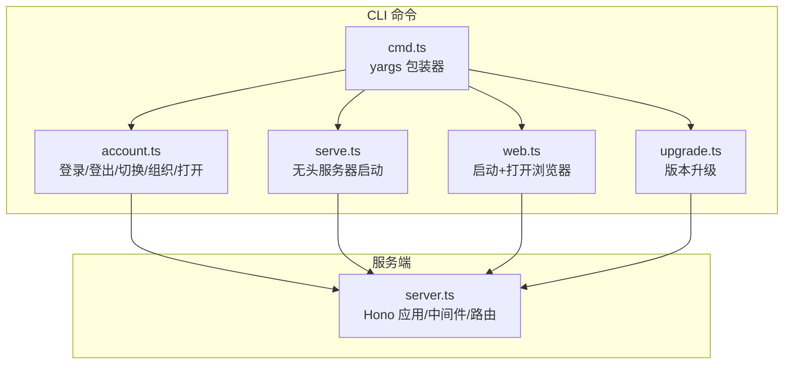
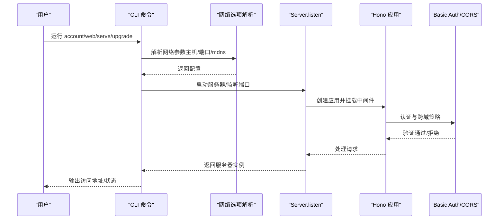
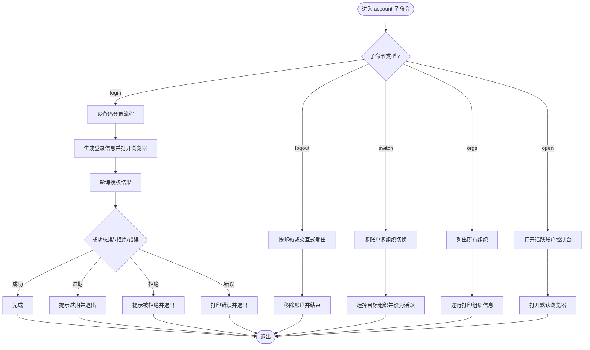
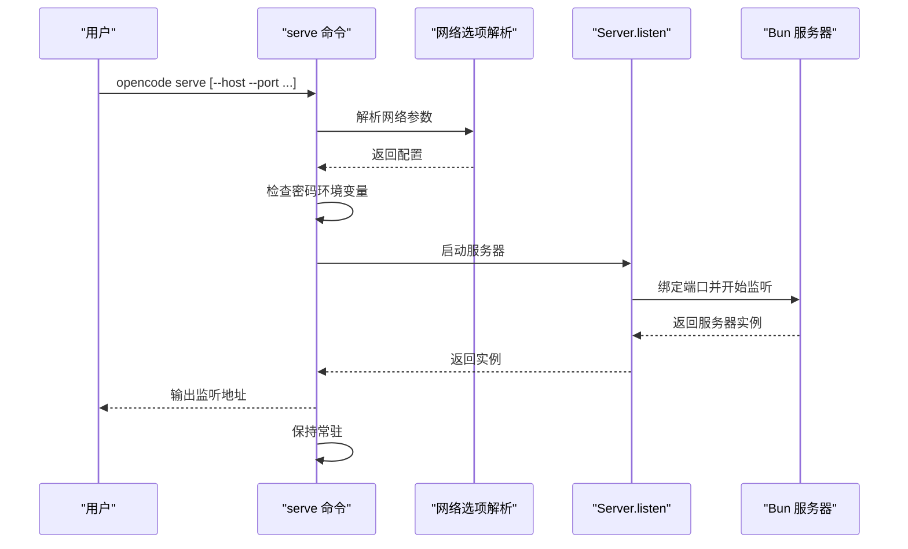
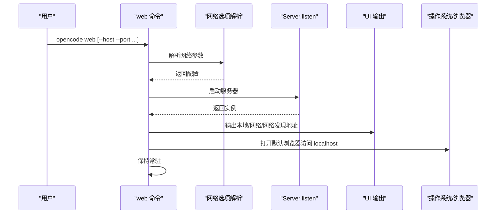
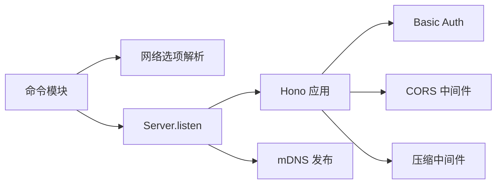

# 系统管理命令

<cite>
**本文引用的文件**
- [packages/opencode/src/cli/cmd/account.ts](file://packages/opencode/src/cli/cmd/account.ts)
- [packages/opencode/src/cli/cmd/serve.ts](file://packages/opencode/src/cli/cmd/serve.ts)
- [packages/opencode/src/cli/cmd/web.ts](file://packages/opencode/src/cli/cmd/web.ts)
- [packages/opencode/src/cli/cmd/upgrade.ts](file://packages/opencode/src/cli/cmd/upgrade.ts)
- [packages/opencode/src/server/server.ts](file://packages/opencode/src/server/server.ts)
- [packages/opencode/src/cli/cmd/cmd.ts](file://packages/opencode/src/cli/cmd/cmd.ts)
- [.opencode/opencode.jsonc](file://.opencode/opencode.jsonc)
</cite>

## 目录
1. [简介](#简介)
2. [项目结构](#项目结构)
3. [核心组件](#核心组件)
4. [架构总览](#架构总览)
5. [详细组件分析](#详细组件分析)
6. [依赖关系分析](#依赖关系分析)
7. [性能考虑](#性能考虑)
8. [故障排查指南](#故障排查指南)
9. [结论](#结论)
10. [附录：使用示例与最佳实践](#附录使用示例与最佳实践)

## 简介
本文件面向 OpenCode 的系统管理命令，围绕以下 CLI 子命令展开技术说明：
- account 命令族：登录认证、账户切换、组织选择、打开控制台、列出组织等
- serve 命令：以无头模式启动服务器，支持网络参数解析与安全校验
- web 命令：启动服务器并自动打开 Web 界面，同时输出本地与网络访问地址
- upgrade 命令：版本升级流程，支持指定目标版本与多种安装方式

文档将从系统架构、数据流、处理逻辑、错误处理与性能优化等方面进行深入剖析，并提供可操作的使用示例与安全配置建议。

## 项目结构
OpenCode 的系统管理命令位于 packages/opencode/src/cli/cmd 下，每个命令通过统一的 cmd 包装器注册到 yargs；服务端由 packages/opencode/src/server/server.ts 提供，采用 Hono 框架与 Bun 作为运行时，支持 Basic Auth、CORS、压缩与 mDNS 发布等能力。

图示来源
- [packages/opencode/src/cli/cmd/account.ts:1-258](file://packages/opencode/src/cli/cmd/account.ts#L1-L258)
- [packages/opencode/src/cli/cmd/serve.ts:1-25](file://packages/opencode/src/cli/cmd/serve.ts#L1-L25)
- [packages/opencode/src/cli/cmd/web.ts:1-82](file://packages/opencode/src/cli/cmd/web.ts#L1-L82)
- [packages/opencode/src/cli/cmd/upgrade.ts:1-74](file://packages/opencode/src/cli/cmd/upgrade.ts#L1-L74)
- [packages/opencode/src/server/server.ts:1-313](file://packages/opencode/src/server/server.ts#L1-L313)
- [packages/opencode/src/cli/cmd/cmd.ts:1-8](file://packages/opencode/src/cli/cmd/cmd.ts#L1-L8)

章节来源
- [packages/opencode/src/cli/cmd/account.ts:1-258](file://packages/opencode/src/cli/cmd/account.ts#L1-L258)
- [packages/opencode/src/cli/cmd/serve.ts:1-25](file://packages/opencode/src/cli/cmd/serve.ts#L1-L25)
- [packages/opencode/src/cli/cmd/web.ts:1-82](file://packages/opencode/src/cli/cmd/web.ts#L1-L82)
- [packages/opencode/src/cli/cmd/upgrade.ts:1-74](file://packages/opencode/src/cli/cmd/upgrade.ts#L1-L74)
- [packages/opencode/src/server/server.ts:1-313](file://packages/opencode/src/server/server.ts#L1-L313)
- [packages/opencode/src/cli/cmd/cmd.ts:1-8](file://packages/opencode/src/cli/cmd/cmd.ts#L1-L8)

## 核心组件
- 账户命令族（account）
  - 登录：设备码授权流程，轮询等待授权结果，超时/拒绝/错误分支处理
  - 登出：按邮箱或交互式选择登出，移除对应账户
  - 切换组织：在多账户多组织场景中选择活跃组织
  - 组织列表：打印当前所有账户及其组织信息
  - 打开控制台：使用默认浏览器打开当前活跃账户的控制台地址
- 服务器命令（serve/web）
  - serve：无头模式启动，输出监听地址，保持进程常驻
  - web：启动服务器并打开浏览器，输出本地/网络/网络发现地址
- 升级命令（upgrade）
  - 自动检测安装方式，支持指定版本或最新版本，失败时给出明确提示

章节来源
- [packages/opencode/src/cli/cmd/account.ts:38-77](file://packages/opencode/src/cli/cmd/account.ts#L38-L77)
- [packages/opencode/src/cli/cmd/account.ts:79-110](file://packages/opencode/src/cli/cmd/account.ts#L79-L110)
- [packages/opencode/src/cli/cmd/account.ts:118-145](file://packages/opencode/src/cli/cmd/account.ts#L118-L145)
- [packages/opencode/src/cli/cmd/account.ts:147-162](file://packages/opencode/src/cli/cmd/account.ts#L147-L162)
- [packages/opencode/src/cli/cmd/account.ts:164-172](file://packages/opencode/src/cli/cmd/account.ts#L164-L172)
- [packages/opencode/src/cli/cmd/serve.ts:9-24](file://packages/opencode/src/cli/cmd/serve.ts#L9-L24)
- [packages/opencode/src/cli/cmd/web.ts:31-81](file://packages/opencode/src/cli/cmd/web.ts#L31-L81)
- [packages/opencode/src/cli/cmd/upgrade.ts:6-73](file://packages/opencode/src/cli/cmd/upgrade.ts#L6-L73)

## 架构总览
下图展示了系统管理命令与服务端之间的交互关系，以及关键的认证与网络配置点。

图示来源
- [packages/opencode/src/cli/cmd/web.ts:35-79](file://packages/opencode/src/cli/cmd/web.ts#L35-L79)
- [packages/opencode/src/cli/cmd/serve.ts:13-23](file://packages/opencode/src/cli/cmd/serve.ts#L13-L23)
- [packages/opencode/src/server/server.ts:267-311](file://packages/opencode/src/server/server.ts#L267-L311)
- [packages/opencode/src/server/server.ts:42-99](file://packages/opencode/src/server/server.ts#L42-L99)

## 详细组件分析

### account 命令族
account 命令族基于 Effect 编排异步流程，结合 UI 与交互提示，实现登录、登出、切换组织、列出组织与打开控制台等功能。其核心流程如下：

图示来源
- [packages/opencode/src/cli/cmd/account.ts:38-77](file://packages/opencode/src/cli/cmd/account.ts#L38-L77)
- [packages/opencode/src/cli/cmd/account.ts:79-110](file://packages/opencode/src/cli/cmd/account.ts#L79-L110)
- [packages/opencode/src/cli/cmd/account.ts:118-145](file://packages/opencode/src/cli/cmd/account.ts#L118-L145)
- [packages/opencode/src/cli/cmd/account.ts:147-162](file://packages/opencode/src/cli/cmd/account.ts#L147-L162)
- [packages/opencode/src/cli/cmd/account.ts:164-172](file://packages/opencode/src/cli/cmd/account.ts#L164-L172)

章节来源
- [packages/opencode/src/cli/cmd/account.ts:1-258](file://packages/opencode/src/cli/cmd/account.ts#L1-L258)

### serve 命令
serve 命令负责以“无头”模式启动 OpenCode 服务器，支持网络参数注入与安全警告提示。其关键行为包括：
- 若未设置服务器密码，则输出安全警告
- 解析网络选项后调用 Server.listen 并打印监听地址
- 保持进程常驻，直到收到停止信号并优雅关闭

图示来源
- [packages/opencode/src/cli/cmd/serve.ts:9-24](file://packages/opencode/src/cli/cmd/serve.ts#L9-L24)
- [packages/opencode/src/server/server.ts:267-311](file://packages/opencode/src/server/server.ts#L267-L311)

章节来源
- [packages/opencode/src/cli/cmd/serve.ts:1-25](file://packages/opencode/src/cli/cmd/serve.ts#L1-L25)
- [packages/opencode/src/server/server.ts:267-311](file://packages/opencode/src/server/server.ts#L267-L311)

### web 命令
web 命令在启动服务器的同时，自动打开浏览器并输出本地与网络访问地址，便于远程调试与演示。其流程要点：
- 解析网络选项并启动服务器
- 当监听 0.0.0.0 时，输出 localhost 与本机 IPv4 地址列表
- 可选启用 mDNS 域名显示
- 打开默认浏览器访问本地地址

图示来源
- [packages/opencode/src/cli/cmd/web.ts:31-81](file://packages/opencode/src/cli/cmd/web.ts#L31-L81)
- [packages/opencode/src/server/server.ts:267-311](file://packages/opencode/src/server/server.ts#L267-L311)

章节来源
- [packages/opencode/src/cli/cmd/web.ts:1-82](file://packages/opencode/src/cli/cmd/web.ts#L1-L82)

### upgrade 命令
upgrade 命令负责版本升级，支持指定目标版本与多种安装方式。其流程如下：
- 检测当前安装方式，若无法识别则询问是否继续
- 计算目标版本（显式传入或查询最新）
- 若已是目标版本则跳过升级
- 使用安装方式执行升级，捕获错误并输出详细提示

图示来源
- [packages/opencode/src/cli/cmd/upgrade.ts:22-73](file://packages/opencode/src/cli/cmd/upgrade.ts#L22-L73)

章节来源
- [packages/opencode/src/cli/cmd/upgrade.ts:1-74](file://packages/opencode/src/cli/cmd/upgrade.ts#L1-L74)

## 依赖关系分析
- 命令注册与包装
  - 所有命令通过 cmd 包装器注册到 yargs，确保统一的参数与帮助信息格式
- 服务器与中间件
  - 服务器采用 Hono 应用，内置认证、CORS、压缩与日志中间件
  - Basic Auth 仅在设置了服务器密码时生效，默认用户名来自环境变量
- 网络与发布
  - 支持 mDNS 发布，仅在非回环地址且启用时生效
  - 端口冲突时尝试回退端口

图示来源
- [packages/opencode/src/cli/cmd/cmd.ts:5-7](file://packages/opencode/src/cli/cmd/cmd.ts#L5-L7)
- [packages/opencode/src/server/server.ts:42-99](file://packages/opencode/src/server/server.ts#L42-L99)
- [packages/opencode/src/server/server.ts:267-311](file://packages/opencode/src/server/server.ts#L267-L311)

章节来源
- [packages/opencode/src/cli/cmd/cmd.ts:1-8](file://packages/opencode/src/cli/cmd/cmd.ts#L1-L8)
- [packages/opencode/src/server/server.ts:1-313](file://packages/opencode/src/server/server.ts#L1-L313)

## 性能考虑
- 请求压缩策略
  - 对特定路径与方法跳过压缩以降低 CPU 开销，其余路径启用压缩
- 日志与计时
  - 非 /log 路径请求会记录耗时，有助于定位慢请求
- 服务器运行时
  - 使用 Bun 作为运行时，具备较低延迟与高吞吐特性
- mDNS 发布
  - 仅在满足条件时发布，避免不必要的网络开销

章节来源
- [packages/opencode/src/server/server.ts:29-35](file://packages/opencode/src/server/server.ts#L29-L35)
- [packages/opencode/src/server/server.ts:60-67](file://packages/opencode/src/server/server.ts#L60-L67)
- [packages/opencode/src/server/server.ts:292-302](file://packages/opencode/src/server/server.ts#L292-L302)

## 故障排查指南
- 服务器未设置密码
  - 现象：启动时出现安全警告
  - 建议：设置服务器密码与用户名（如需）以启用 Basic Auth
- Basic Auth 未生效
  - 现象：无需凭据即可访问
  - 排查：确认密码环境变量已正确设置
- CORS 跨域问题
  - 现象：浏览器跨域失败
  - 排查：检查允许的来源列表与本地开发环境
- 端口占用
  - 现象：启动失败
  - 排查：更换端口或释放占用端口；服务器会尝试回退端口
- mDNS 未发布
  - 现象：未显示网络发现域名
  - 排查：确认启用了 mDNS 且监听的是非回环地址
- 升级失败
  - 现象：升级报错
  - 排查：根据安装方式查看错误输出；部分包管理器需要管理员权限

章节来源
- [packages/opencode/src/cli/cmd/serve.ts:14-16](file://packages/opencode/src/cli/cmd/serve.ts#L14-L16)
- [packages/opencode/src/server/server.ts:47-51](file://packages/opencode/src/server/server.ts#L47-L51)
- [packages/opencode/src/server/server.ts:72-93](file://packages/opencode/src/server/server.ts#L72-L93)
- [packages/opencode/src/server/server.ts:282-290](file://packages/opencode/src/server/server.ts#L282-L290)
- [packages/opencode/src/server/server.ts:292-302](file://packages/opencode/src/server/server.ts#L292-L302)
- [packages/opencode/src/cli/cmd/upgrade.ts:56-69](file://packages/opencode/src/cli/cmd/upgrade.ts#L56-L69)

## 结论
OpenCode 的系统管理命令围绕账户管理、服务器启动与版本升级构建了完整的运维链路。通过统一的命令包装、灵活的网络配置与完善的安全策略，既保证了易用性也兼顾了安全性与可观测性。建议在生产环境中始终启用 Basic Auth，并结合日志与监控工具进行持续观察。

## 附录：使用示例与最佳实践
- 账户管理
  - 登录：在浏览器中完成授权后，系统会轮询等待授权结果
  - 登出：可按邮箱直接登出，或交互式选择账户登出
  - 切换组织：在多账户多组织场景中快速切换活跃组织
  - 打开控制台：一键打开当前活跃账户的控制台页面
- 服务器启动
  - 无头启动：适合 CI 或后台服务
  - Web 启动：适合本地开发与演示，自动打开浏览器并输出访问地址
- 版本升级
  - 指定版本：升级到指定版本号
  - 指定方式：通过 --method 指定安装方式（curl/npm/pnpm/bun/brew/choco/scoop）
- 安全配置
  - 设置服务器密码与用户名，启用 Basic Auth
  - 限制允许的 CORS 来源，避免跨域风险
  - 在公网暴露时谨慎开启 mDNS 发布
- 性能优化
  - 合理设置端口与并发，避免端口冲突
  - 利用压缩与日志中间件提升传输效率与可观测性
  - 对于高并发场景，结合反向代理与缓存策略

章节来源
- [packages/opencode/src/cli/cmd/account.ts:174-228](file://packages/opencode/src/cli/cmd/account.ts#L174-L228)
- [packages/opencode/src/cli/cmd/serve.ts:9-24](file://packages/opencode/src/cli/cmd/serve.ts#L9-L24)
- [packages/opencode/src/cli/cmd/web.ts:31-81](file://packages/opencode/src/cli/cmd/web.ts#L31-L81)
- [packages/opencode/src/cli/cmd/upgrade.ts:6-73](file://packages/opencode/src/cli/cmd/upgrade.ts#L6-L73)
- [packages/opencode/src/server/server.ts:47-51](file://packages/opencode/src/server/server.ts#L47-L51)
- [packages/opencode/src/server/server.ts:72-93](file://packages/opencode/src/server/server.ts#L72-L93)
- [packages/opencode/src/server/server.ts:292-302](file://packages/opencode/src/server/server.ts#L292-L302)