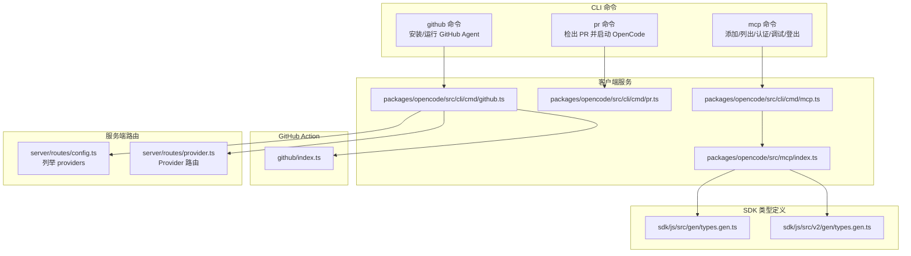
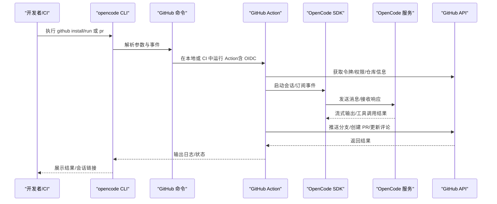
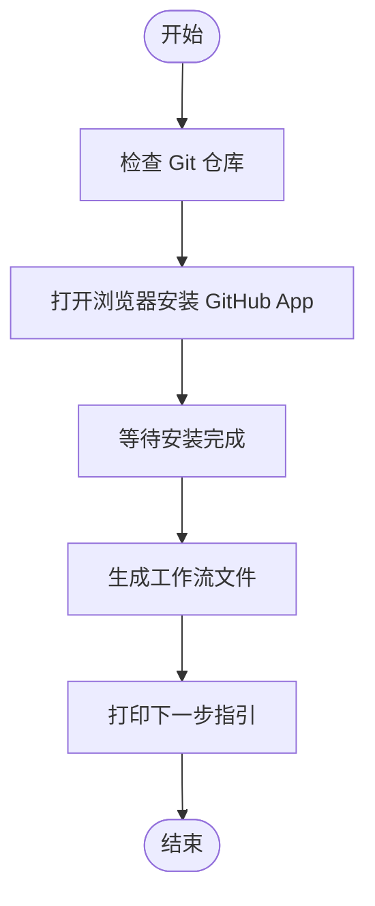
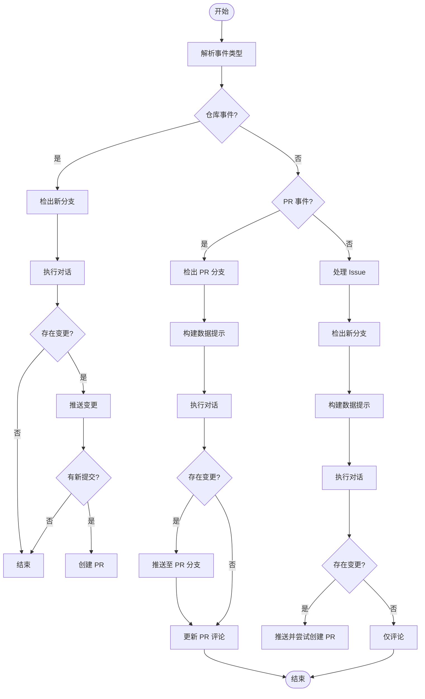
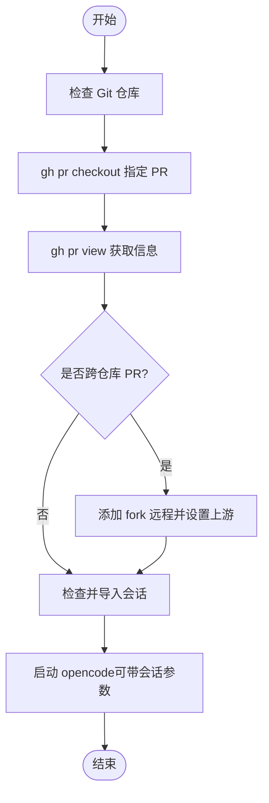
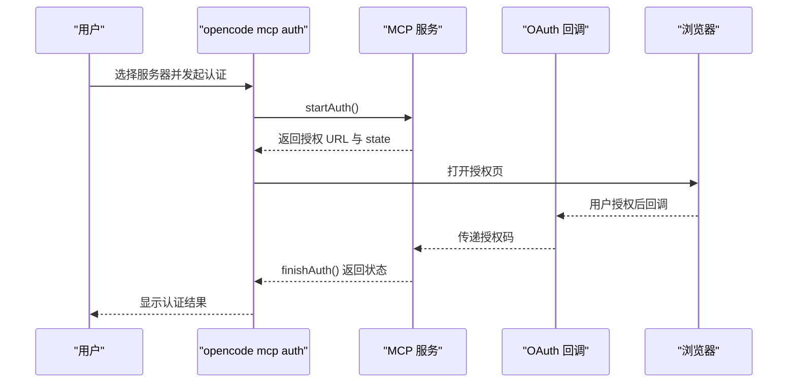
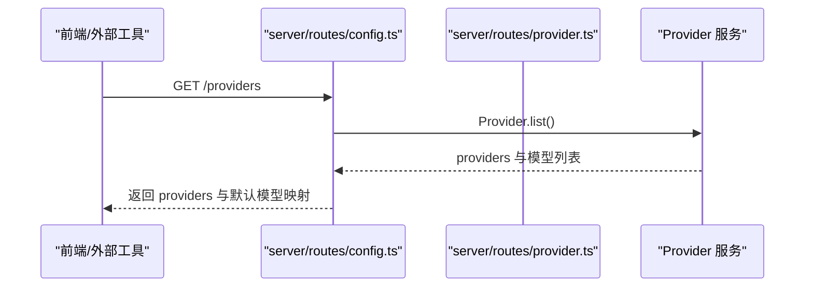
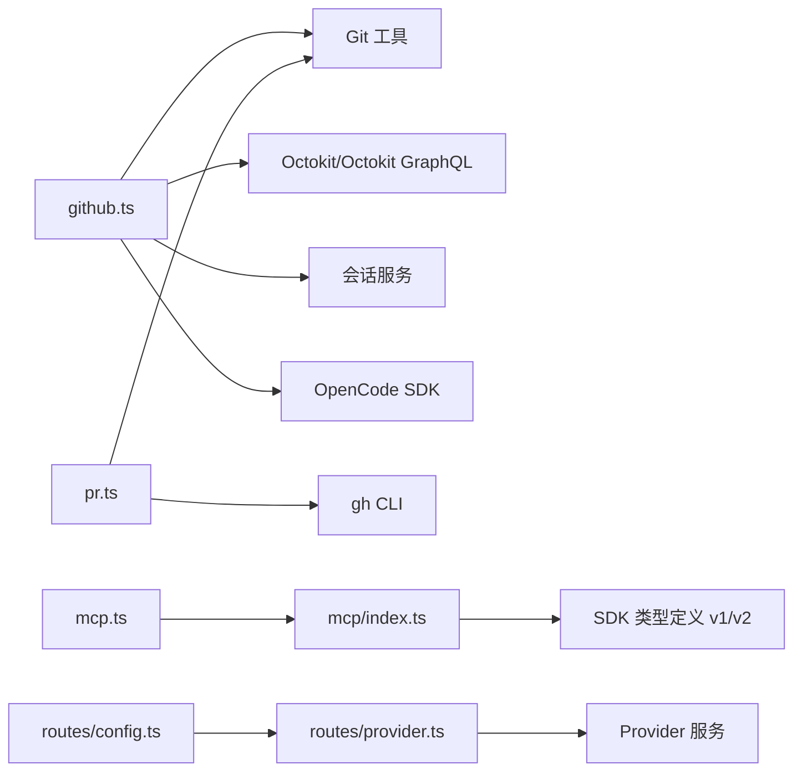

# 集成命令

<cite>
**本文引用的文件**
- [README.md](file://README.md)
- [.opencode/opencode.jsonc](file://.opencode/opencode.jsonc)
- [packages/opencode/src/cli/cmd/github.ts](file://packages/opencode/src/cli/cmd/github.ts)
- [packages/opencode/src/cli/cmd/pr.ts](file://packages/opencode/src/cli/cmd/pr.ts)
- [packages/opencode/src/cli/cmd/mcp.ts](file://packages/opencode/src/cli/cmd/mcp.ts)
- [packages/opencode/src/mcp/index.ts](file://packages/opencode/src/mcp/index.ts)
- [github/index.ts](file://github/index.ts)
- [packages/opencode/src/server/routes/config.ts](file://packages/opencode/src/server/routes/config.ts)
- [packages/opencode/src/server/routes/provider.ts](file://packages/opencode/src/server/routes/provider.ts)
- [packages/sdk/js/src/gen/types.gen.ts](file://packages/sdk/js/src/gen/types.gen.ts)
- [packages/sdk/js/src/v2/gen/types.gen.ts](file://packages/sdk/js/src/v2/gen/types.gen.ts)
- [packages/console/app/src/routes/workspace/[id]/provider-section.tsx](file://packages/console/app/src/routes/workspace/[id]/provider-section.tsx)
</cite>

## 目录
1. [简介](#简介)
2. [项目结构](#项目结构)
3. [核心组件](#核心组件)
4. [架构总览](#架构总览)
5. [详细组件分析](#详细组件分析)
6. [依赖关系分析](#依赖关系分析)
7. [性能考量](#性能考量)
8. [故障排除指南](#故障排除指南)
9. [结论](#结论)
10. [附录](#附录)

## 简介
本文件面向 OpenCode 的“集成命令”，系统性梳理以下能力：
- GitHub 命令：在本地或 CI 中安装与运行 GitHub Agent，支持仓库连接、分支检出、PR 操作、会话导入与推送等。
- PR 命令：从远程 PR 检出分支、处理 fork 场景、导入关联会话并启动 OpenCode。
- MCP 命令：管理 MCP（Model Context Protocol）服务器，支持本地/远程、OAuth 认证、调试与状态查看。
- Providers 命令：列举与切换模型提供商，管理 API 密钥与服务配置。

同时提供使用示例、认证配置与常见问题排查建议，帮助开发者将 OpenCode 与其他开发工具与服务顺畅集成。

## 项目结构
围绕“集成命令”的相关模块分布于 CLI、MCP 子系统、GitHub Action 以及服务端路由中，形成“命令行 → 客户端服务/SDK → 远程服务/工具”的链路。

图表来源
- [packages/opencode/src/cli/cmd/github.ts:192-420](file://packages/opencode/src/cli/cmd/github.ts#L192-L420)
- [packages/opencode/src/cli/cmd/pr.ts:1-128](file://packages/opencode/src/cli/cmd/pr.ts#L1-L128)
- [packages/opencode/src/cli/cmd/mcp.ts:53-136](file://packages/opencode/src/cli/cmd/mcp.ts#L53-L136)
- [packages/opencode/src/mcp/index.ts:33-120](file://packages/opencode/src/mcp/index.ts#L33-L120)
- [github/index.ts:116-230](file://github/index.ts#L116-L230)
- [packages/opencode/src/server/routes/config.ts:59-92](file://packages/opencode/src/server/routes/config.ts#L59-L92)
- [packages/opencode/src/server/routes/provider.ts:1-14](file://packages/opencode/src/server/routes/provider.ts#L1-L14)
- [packages/sdk/js/src/gen/types.gen.ts:1447-1537](file://packages/sdk/js/src/gen/types.gen.ts#L1447-L1537)
- [packages/sdk/js/src/v2/gen/types.gen.ts:1248-1307](file://packages/sdk/js/src/v2/gen/types.gen.ts#L1248-L1307)

章节来源
- [README.md:1-142](file://README.md#L1-L142)
- [.opencode/opencode.jsonc:1-19](file://.opencode/opencode.jsonc#L1-L19)

## 核心组件
- GitHub 命令（github）
  - 安装：引导安装 GitHub App，生成工作流文件，提示后续步骤。
  - 运行：根据事件类型（评论、PR、调度、分发）执行相应逻辑；支持 OIDC 获取应用令牌、权限校验、分支检出、提交与 PR 创建、会话分享链接等。
- PR 命令（pr）
  - 通过 gh CLI 检出指定 PR 分支；处理 fork 场景添加上游；解析 PR 描述中的会话链接并导入；随后以相同或新建会话启动 OpenCode。
- MCP 命令（mcp）
  - 添加：支持本地命令或远程 URL，并可选择是否启用 OAuth；自动写入配置文件。
  - 列表/状态：显示各服务器连接状态与 OAuth 支持情况。
  - 认证：触发浏览器打开授权页，完成回调后保存凭据；支持重新认证与过期提醒。
  - 登出：移除指定服务器的 OAuth 凭据。
  - 调试：探测服务器可达性、WWW-Authenticate 头、OAuth 元数据发现与动态注册可行性。
- Providers 命令（服务端）
  - 提供“列举配置的提供商及默认模型”接口，便于前端或外部工具查询当前可用的模型与默认值。

章节来源
- [packages/opencode/src/cli/cmd/github.ts:199-420](file://packages/opencode/src/cli/cmd/github.ts#L199-L420)
- [packages/opencode/src/cli/cmd/pr.ts:7-128](file://packages/opencode/src/cli/cmd/pr.ts#L7-L128)
- [packages/opencode/src/cli/cmd/mcp.ts:53-136](file://packages/opencode/src/cli/cmd/mcp.ts#L53-L136)
- [packages/opencode/src/mcp/index.ts:207-242](file://packages/opencode/src/mcp/index.ts#L207-L242)
- [packages/opencode/src/server/routes/config.ts:59-92](file://packages/opencode/src/server/routes/config.ts#L59-L92)

## 架构总览
下图展示了“命令行 → 客户端服务/SDK → 远程服务/工具”的交互路径，以及 GitHub Action 的端到端流程。

图表来源
- [packages/opencode/src/cli/cmd/github.ts:422-701](file://packages/opencode/src/cli/cmd/github.ts#L422-L701)
- [github/index.ts:116-230](file://github/index.ts#L116-L230)
- [packages/opencode/src/mcp/index.ts:273-378](file://packages/opencode/src/mcp/index.ts#L273-L378)

## 详细组件分析

### GitHub 命令（github）
- 功能要点
  - 安装：检测 Git 仓库，打开浏览器安装 GitHub App，生成工作流文件，提示后续步骤。
  - 运行：根据事件类型路由处理：
    - 仓库事件（调度/分发）：检出新分支，执行对话，若存在变更则推送并尝试创建 PR。
    - PR 事件（本地/派生）：检出对应分支，构建数据提示，执行对话，若存在变更则推送；在 PR 评论区更新回复。
    - Issue 事件：新建分支，构建数据提示，执行对话，若存在变更则推送并创建 PR。
  - 权限与安全：通过 OIDC 获取应用令牌，必要时回退到 PAT；对用户权限进行校验；配置 Git 凭据避免明文泄露。
  - 会话与分享：创建会话，订阅事件流，按需生成分享链接；在 PR/Issue 评论中嵌入链接。
- 关键流程（安装）

图表来源
- [packages/opencode/src/cli/cmd/github.ts:199-420](file://packages/opencode/src/cli/cmd/github.ts#L199-L420)

- 关键流程（运行）

图表来源
- [packages/opencode/src/cli/cmd/github.ts:567-678](file://packages/opencode/src/cli/cmd/github.ts#L567-L678)
- [github/index.ts:160-229](file://github/index.ts#L160-L229)

章节来源
- [packages/opencode/src/cli/cmd/github.ts:199-701](file://packages/opencode/src/cli/cmd/github.ts#L199-L701)
- [github/index.ts:116-230](file://github/index.ts#L116-L230)

### PR 命令（pr）
- 功能要点
  - 使用 gh CLI 检出指定 PR 分支，支持自定义本地分支名。
  - 处理 fork PR：添加上游远程，设置上游分支，确保推送目标正确。
  - 从 PR 描述中提取会话链接并导入，随后以该会话或新建会话启动 OpenCode。
- 关键流程

图表来源
- [packages/opencode/src/cli/cmd/pr.ts:16-127](file://packages/opencode/src/cli/cmd/pr.ts#L16-L127)

章节来源
- [packages/opencode/src/cli/cmd/pr.ts:7-128](file://packages/opencode/src/cli/cmd/pr.ts#L7-L128)

### MCP 命令（mcp）
- 功能要点
  - 添加：支持本地命令或远程 URL；可选启用 OAuth；自动写入配置文件。
  - 列表/状态：显示各服务器连接状态（已连接/未初始化/需要认证/失败等），并标注 OAuth 支持。
  - 认证：触发浏览器打开授权页，等待回调；支持手动复制 URL；处理过期与客户端注册需求。
  - 登出：移除指定服务器的 OAuth 凭据。
  - 调试：探测服务器可达性、WWW-Authenticate 头、OAuth 元数据发现与动态注册可行性。
- 关键流程（认证）

图表来源
- [packages/opencode/src/cli/cmd/mcp.ts:138-279](file://packages/opencode/src/cli/cmd/mcp.ts#L138-L279)
- [packages/opencode/src/mcp/index.ts:713-800](file://packages/opencode/src/mcp/index.ts#L713-L800)

章节来源
- [packages/opencode/src/cli/cmd/mcp.ts:53-755](file://packages/opencode/src/cli/cmd/mcp.ts#L53-L755)
- [packages/opencode/src/mcp/index.ts:33-120](file://packages/opencode/src/mcp/index.ts#L33-L120)

### Providers 命令（服务端）
- 功能要点
  - 提供“列举配置的提供商及默认模型”接口，返回 providers 数组与每个提供商的默认模型映射。
  - 用于前端或外部工具查询当前可用的模型与默认值，便于 UI 展示与选择。
- 关键流程

图表来源
- [packages/opencode/src/server/routes/config.ts:59-92](file://packages/opencode/src/server/routes/config.ts#L59-L92)
- [packages/opencode/src/server/routes/provider.ts:1-14](file://packages/opencode/src/server/routes/provider.ts#L1-L14)

章节来源
- [packages/opencode/src/server/routes/config.ts:59-92](file://packages/opencode/src/server/routes/config.ts#L59-L92)
- [packages/opencode/src/server/routes/provider.ts:1-14](file://packages/opencode/src/server/routes/provider.ts#L1-L14)

## 依赖关系分析
- 组件耦合
  - GitHub 命令依赖 Git、Octokit、会话服务与 SDK；在 CI 中通过 OIDC 获取令牌并与 GitHub API 交互。
  - PR 命令依赖 gh CLI 与 Git；与 OpenCode 会话导入与启动。
  - MCP 命令依赖 MCP 服务层，实现 OAuth 回调、传输层选择与工具转换。
  - Providers 路由依赖 Provider 服务，返回标准化的模型与提供商信息。
- 外部依赖
  - GitHub REST/GraphQL、OIDC、浏览器打开授权页、会话事件流（SSE）。
- 可能的循环依赖
  - 命令层与服务层通过 Effect 与 ServiceMap 解耦，避免直接循环引用。

图表来源
- [packages/opencode/src/cli/cmd/github.ts:1-100](file://packages/opencode/src/cli/cmd/github.ts#L1-L100)
- [packages/opencode/src/cli/cmd/pr.ts:1-20](file://packages/opencode/src/cli/cmd/pr.ts#L1-L20)
- [packages/opencode/src/cli/cmd/mcp.ts:1-20](file://packages/opencode/src/cli/cmd/mcp.ts#L1-L20)
- [packages/opencode/src/mcp/index.ts:1-40](file://packages/opencode/src/mcp/index.ts#L1-L40)
- [packages/opencode/src/server/routes/config.ts:1-20](file://packages/opencode/src/server/routes/config.ts#L1-L20)
- [packages/opencode/src/server/routes/provider.ts:1-14](file://packages/opencode/src/server/routes/provider.ts#L1-L14)
- [packages/sdk/js/src/gen/types.gen.ts:1447-1460](file://packages/sdk/js/src/gen/types.gen.ts#L1447-L1460)
- [packages/sdk/js/src/v2/gen/types.gen.ts:1248-1260](file://packages/sdk/js/src/v2/gen/types.gen.ts#L1248-L1260)

章节来源
- [packages/opencode/src/cli/cmd/github.ts:1-100](file://packages/opencode/src/cli/cmd/github.ts#L1-L100)
- [packages/opencode/src/cli/cmd/pr.ts:1-20](file://packages/opencode/src/cli/cmd/pr.ts#L1-L20)
- [packages/opencode/src/cli/cmd/mcp.ts:1-20](file://packages/opencode/src/cli/cmd/mcp.ts#L1-L20)
- [packages/opencode/src/mcp/index.ts:1-40](file://packages/opencode/src/mcp/index.ts#L1-L40)
- [packages/opencode/src/server/routes/config.ts:1-20](file://packages/opencode/src/server/routes/config.ts#L1-L20)
- [packages/opencode/src/server/routes/provider.ts:1-14](file://packages/opencode/src/server/routes/provider.ts#L1-L14)
- [packages/sdk/js/src/gen/types.gen.ts:1447-1460](file://packages/sdk/js/src/gen/types.gen.ts#L1447-L1460)
- [packages/sdk/js/src/v2/gen/types.gen.ts:1248-1260](file://packages/sdk/js/src/v2/gen/types.gen.ts#L1248-L1260)

## 性能考量
- 连接超时与重试
  - MCP 连接默认超时可配置，远程/本地传输分别尝试，失败时记录错误并返回“需要认证/失败”状态。
- 工具与资源枚举
  - 通过通知监听工具列表变化，避免频繁轮询；工具转换时附带输入模式约束，减少无效调用。
- 事件流与会话
  - 会话事件采用流式传输，按块解码与增量输出，降低延迟与内存占用。
- Git 操作
  - 仅在存在变更时执行提交与推送；PR 创建前检查是否存在新提交，避免浅克隆场景下的无意义请求。

章节来源
- [packages/opencode/src/mcp/index.ts:35-40](file://packages/opencode/src/mcp/index.ts#L35-L40)
- [packages/opencode/src/mcp/index.ts:466-478](file://packages/opencode/src/mcp/index.ts#L466-L478)
- [packages/opencode/src/cli/cmd/github.ts:580-600](file://packages/opencode/src/cli/cmd/github.ts#L580-L600)

## 故障排除指南
- GitHub 安装/运行
  - 确认已安装并授权 GitHub App；检查工作流文件是否存在于仓库；确认 OIDC 权限与令牌交换是否成功。
  - 若出现权限不足，检查用户在仓库中的权限级别；必要时改用 PAT 并设置 USE_GITHUB_TOKEN。
- PR 检出与推送
  - 若 gh CLI 未安装或未认证，请先安装并登录；fork PR 需要正确设置上游远程与分支。
- MCP 认证
  - 若无法自动打开浏览器，遵循提示手动打开 URL；若提示需要预注册客户端 ID，请在配置中添加 clientId。
  - 若提示状态异常，使用 debug 子命令检查服务器可达性与 OAuth 元数据。
- Providers 查询
  - 若前端或外部工具无法获取默认模型，请确认服务端路由正常，且 Provider 服务已加载配置。

章节来源
- [packages/opencode/src/cli/cmd/github.ts:520-535](file://packages/opencode/src/cli/cmd/github.ts#L520-L535)
- [packages/opencode/src/cli/cmd/pr.ts:38-41](file://packages/opencode/src/cli/cmd/pr.ts#L38-L41)
- [packages/opencode/src/cli/cmd/mcp.ts:242-279](file://packages/opencode/src/cli/cmd/mcp.ts#L242-L279)
- [packages/opencode/src/mcp/index.ts:323-354](file://packages/opencode/src/mcp/index.ts#L323-L354)

## 结论
OpenCode 的集成命令围绕“本地/CI 自动化 + 远程工具与服务”的理念设计，提供了从仓库连接、分支管理、PR 创建到 MCP 协议与提供商管理的完整闭环。通过标准化的命令与服务接口，开发者可以便捷地将 OpenCode 与现有开发流程与工具链集成，并在遇到问题时快速定位与修复。

## 附录

### 使用示例
- 安装 GitHub Agent
  - 在仓库根目录执行安装命令，按提示完成 App 安装与工作流文件生成。
- 运行 GitHub Agent
  - 在本地或 CI 中运行运行命令，根据事件类型自动处理 Issue/PR/调度/分发等场景。
- 检出并处理 PR
  - 使用 PR 命令检出指定 PR，处理 fork 场景，导入会话并启动 OpenCode。
- 管理 MCP 服务器
  - 添加本地/远程服务器，启用 OAuth；列出状态并进行认证/登出/调试。
- 查看 Providers
  - 通过服务端路由获取当前配置的提供商与默认模型，用于前端展示或外部工具集成。

章节来源
- [packages/opencode/src/cli/cmd/github.ts:199-420](file://packages/opencode/src/cli/cmd/github.ts#L199-L420)
- [packages/opencode/src/cli/cmd/pr.ts:16-127](file://packages/opencode/src/cli/cmd/pr.ts#L16-L127)
- [packages/opencode/src/cli/cmd/mcp.ts:418-580](file://packages/opencode/src/cli/cmd/mcp.ts#L418-L580)
- [packages/opencode/src/server/routes/config.ts:59-92](file://packages/opencode/src/server/routes/config.ts#L59-L92)