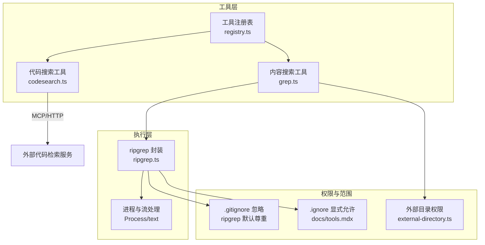
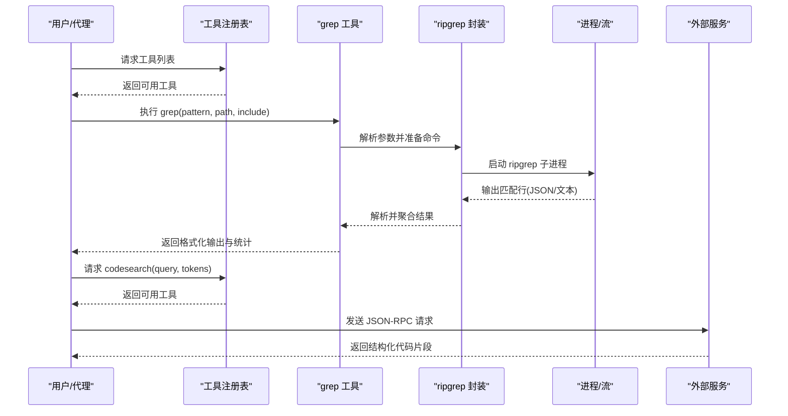
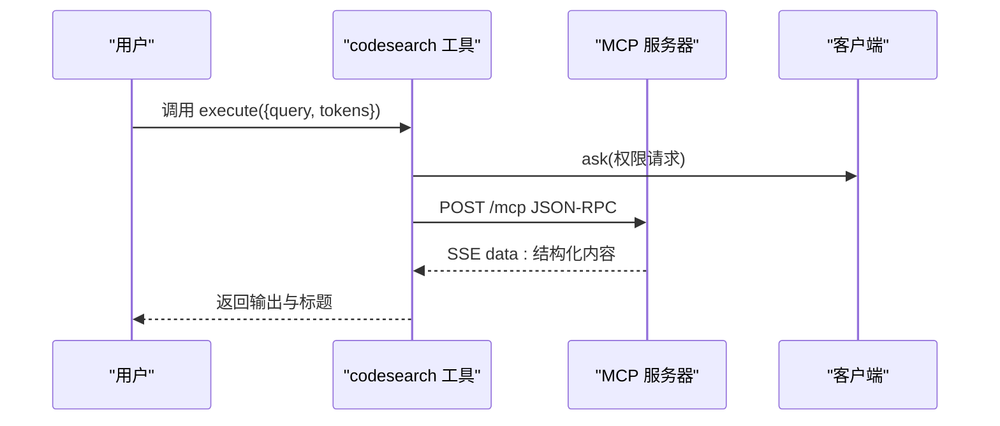
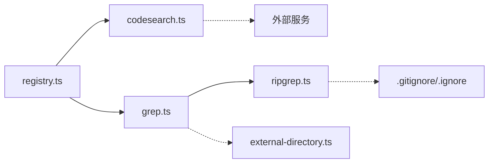

# 代码搜索工具

<cite>
**本文引用的文件**
- [packages/opencode/src/tool/codesearch.ts](file://packages/opencode/src/tool/codesearch.ts)
- [packages/opencode/src/tool/codesearch.txt](file://packages/opencode/src/tool/codesearch.txt)
- [packages/opencode/src/tool/grep.ts](file://packages/opencode/src/tool/grep.ts)
- [packages/opencode/src/tool/grep.txt](file://packages/opencode/src/tool/grep.txt)
- [packages/opencode/src/file/ripgrep.ts](file://packages/opencode/src/file/ripgrep.ts)
- [packages/opencode/src/tool/registry.ts](file://packages/opencode/src/tool/registry.ts)
- [packages/opencode/src/session/prompt/copilot-gpt-5.txt](file://packages/opencode/src/session/prompt/copilot-gpt-5.txt)
- [packages/web/src/content/docs/tools.mdx](file://packages/web/src/content/docs/tools.mdx)
- [packages/opencode/test/tool/grep.test.ts](file://packages/opencode/test/tool/grep.test.ts)
- [packages/opencode/test/file/ripgrep.test.ts](file://packages/opencode/test/file/ripgrep.test.ts)
- [packages/opencode/src/cli/cmd/debug/ripgrep.ts](file://packages/opencode/src/cli/cmd/debug/ripgrep.ts)
- [packages/opencode/src/tool/glob.ts](file://packages/opencode/src/tool/glob.ts)
- [packages/opencode/src/tool/ls.ts](file://packages/opencode/src/tool/ls.ts)
- [packages/opencode/src/tool/ls.txt](file://packages/opencode/src/tool/ls.txt)
- [packages/opencode/src/tool/external-directory.ts](file://packages/opencode/src/tool/external-directory.ts)
- [packages/web/src/content/docs/permissions.mdx](file://packages/web/src/content/docs/permissions.mdx)
- [packages/opencode/src/app/context/global-sync/session-prefetch.ts](file://packages/opencode/src/app/context/global-sync/session-prefetch.ts)
</cite>

## 目录
1. [简介](#简介)
2. [项目结构](#项目结构)
3. [核心组件](#核心组件)
4. [架构总览](#架构总览)
5. [详细组件分析](#详细组件分析)
6. [依赖关系分析](#依赖关系分析)
7. [性能考量](#性能考量)
8. [故障排查指南](#故障排查指南)
9. [结论](#结论)
10. [附录](#附录)

## 简介
本文件面向 OpenCode 的代码搜索能力，系统性梳理两类搜索工具：基于外部服务的“代码搜索工具（codesearch）”与基于本地文件系统的“内容搜索工具（grep）”。前者通过 MCP 协议调用外部代码检索服务，返回高质量上下文；后者使用 ripgrep 实现高性能正则表达式内容搜索，支持文件类型过滤、路径限制与结果截断。文档还覆盖搜索结果排序、高亮与上下文提取的实现方式，以及索引构建、缓存与并行处理等性能优化策略，并给出搜索范围控制与排除规则的配置方法与最佳实践。

## 项目结构
围绕代码搜索的关键模块组织如下：
- 工具定义与注册：在工具注册表中集中管理所有可用工具，包含 codesearch 与 grep 等。
- 搜索执行器：codesearch 调用外部服务，grep 基于 ripgrep 进程执行。
- 文件系统与进程抽象：ripgrep 封装了跨平台二进制下载、安装与命令行参数拼装。
- 权限与范围控制：通过 external_directory 权限与忽略模式控制可访问路径与被排除的文件。
- 结果呈现：输出文本格式化、统计信息与截断提示。



图表来源
- [packages/opencode/src/tool/registry.ts:177-216](file://packages/opencode/src/tool/registry.ts#L177-L216)
- [packages/opencode/src/tool/codesearch.ts:36-132](file://packages/opencode/src/tool/codesearch.ts#L36-L132)
- [packages/opencode/src/tool/grep.ts:15-157](file://packages/opencode/src/tool/grep.ts#L15-L157)
- [packages/opencode/src/file/ripgrep.ts:216-275](file://packages/opencode/src/file/ripgrep.ts#L216-L275)
- [packages/web/src/content/docs/tools.mdx:342-362](file://packages/web/src/content/docs/tools.mdx#L342-L362)

章节来源
- [packages/opencode/src/tool/registry.ts:1-249](file://packages/opencode/src/tool/registry.ts#L1-L249)
- [packages/opencode/src/tool/codesearch.ts:1-132](file://packages/opencode/src/tool/codesearch.ts#L1-L132)
- [packages/opencode/src/tool/grep.ts:1-157](file://packages/opencode/src/tool/grep.ts#L1-L157)
- [packages/opencode/src/file/ripgrep.ts:1-377](file://packages/opencode/src/file/ripgrep.ts#L1-L377)
- [packages/web/src/content/docs/tools.mdx:342-362](file://packages/web/src/content/docs/tools.mdx#L342-L362)

## 核心组件
- 代码搜索工具（codesearch）
  - 通过 MCP/JSON-RPC 调用外部代码检索服务，返回结构化的代码片段与文档。
  - 支持可调的 token 数量以平衡上下文长度与成本。
  - 需要特定模型或标志位才启用。
- 内容搜索工具（grep）
  - 使用 ripgrep 执行正则表达式内容搜索，支持 include 文件模式过滤。
  - 输出按文件最后修改时间倒序排列，限制最大展示数量并提供截断提示。
  - 支持权限请求与外部目录访问控制。
- ripgrep 封装
  - 自动检测/下载/解压跨平台二进制，封装文件枚举、树形视图与 JSON 行解析。
  - 提供 files/search/tree 等异步迭代接口，便于上层工具组合使用。

章节来源
- [packages/opencode/src/tool/codesearch.ts:36-132](file://packages/opencode/src/tool/codesearch.ts#L36-L132)
- [packages/opencode/src/tool/codesearch.txt:1-12](file://packages/opencode/src/tool/codesearch.txt#L1-L12)
- [packages/opencode/src/tool/grep.ts:15-157](file://packages/opencode/src/tool/grep.ts#L15-L157)
- [packages/opencode/src/tool/grep.txt:1-9](file://packages/opencode/src/tool/grep.txt#L1-L9)
- [packages/opencode/src/file/ripgrep.ts:216-377](file://packages/opencode/src/file/ripgrep.ts#L216-L377)

## 架构总览
下图展示了从工具调用到外部服务或本地进程的端到端流程，以及权限与忽略规则对搜索范围的影响。



图表来源
- [packages/opencode/src/tool/registry.ts:177-216](file://packages/opencode/src/tool/registry.ts#L177-L216)
- [packages/opencode/src/tool/grep.ts:42-61](file://packages/opencode/src/tool/grep.ts#L42-L61)
- [packages/opencode/src/file/ripgrep.ts:335-377](file://packages/opencode/src/file/ripgrep.ts#L335-L377)
- [packages/opencode/src/tool/codesearch.ts:53-114](file://packages/opencode/src/tool/codesearch.ts#L53-L114)

## 详细组件分析

### 代码搜索工具（codesearch）
- 功能特性
  - 通过 MCP/JSON-RPC 调用外部代码检索服务，返回结构化内容。
  - 参数包含查询词与 token 数量，用于控制上下文长度。
  - 在工具注册时根据模型或标志位决定是否启用。
- 执行流程
  - 先进行权限询问，再构造 JSON-RPC 请求体，设置超时与信号。
  - 以 SSE 文本流形式接收响应，解析第一条结果作为最终输出。
  - 对错误进行分类处理，区分超时与非超时异常。
- 适用场景
  - 需要高质量、最新代码示例与 API 参考的通用编程问题。
  - 无法直接定位具体文件时的“语义搜索”。



图表来源
- [packages/opencode/src/tool/codesearch.ts:53-114](file://packages/opencode/src/tool/codesearch.ts#L53-L114)
- [packages/opencode/src/tool/codesearch.ts:64-90](file://packages/opencode/src/tool/codesearch.ts#L64-L90)
- [packages/opencode/src/tool/codesearch.ts:101-114](file://packages/opencode/src/tool/codesearch.ts#L101-L114)

章节来源
- [packages/opencode/src/tool/codesearch.ts:36-132](file://packages/opencode/src/tool/codesearch.ts#L36-L132)
- [packages/opencode/src/tool/codesearch.txt:1-12](file://packages/opencode/src/tool/codesearch.txt#L1-L12)
- [packages/opencode/src/tool/registry.ts:184-186](file://packages/opencode/src/tool/registry.ts#L184-L186)

### 内容搜索工具（grep）
- 功能特性
  - 正则表达式内容搜索，支持 include 文件模式过滤。
  - 输出按文件最后修改时间降序排列，限制最大展示数量并提示截断。
  - 支持权限请求与外部目录访问控制。
- 执行流程
  - 参数校验与权限询问，解析搜索路径并断言外部目录权限。
  - 调用 ripgrep 进程，解析标准输出，按分隔符拆分字段。
  - 统计匹配总数，生成人类可读输出，包含截断与错误提示。
- 错误处理
  - exit code 1 表示无匹配；exit code 2 表示存在错误但可能仍有输出。
  - 仅当输出为空且 exit code 为 2 时抛出错误。

```mermaid
flowchart TD
Start(["开始"]) --> Check["校验 pattern 是否存在"]
Check --> |缺失| Err["抛出错误"]
Check --> |存在| Ask["权限询问"]
Ask --> ResolvePath["解析绝对路径"]
ResolvePath --> AssertExt["断言外部目录权限"]
AssertExt --> Spawn["启动 ripgrep 进程"]
Spawn --> ReadOut["读取 stdout/stderr 并等待退出"]
ReadOut --> ExitCode{"退出码"}
ExitCode --> |1 或 (2 且 无输出)| NoMatch["返回无匹配结果"]
ExitCode --> |其他非 0| Fail["抛出错误"]
ExitCode --> |0 或 2| Parse["解析输出为匹配项"]
Parse --> Sort["按修改时间倒序"]
Sort --> Limit["截断至上限并统计总数"]
Limit --> Format["格式化输出与元数据"]
Format --> Done(["结束"])
```

图表来源
- [packages/opencode/src/tool/grep.ts:22-76](file://packages/opencode/src/tool/grep.ts#L22-L76)
- [packages/opencode/src/tool/grep.ts:78-154](file://packages/opencode/src/tool/grep.ts#L78-L154)

章节来源
- [packages/opencode/src/tool/grep.ts:15-157](file://packages/opencode/src/tool/grep.ts#L15-L157)
- [packages/opencode/src/tool/grep.txt:1-9](file://packages/opencode/src/tool/grep.txt#L1-L9)
- [packages/opencode/test/tool/grep.test.ts:21-39](file://packages/opencode/test/tool/grep.test.ts#L21-L39)

### ripgrep 封装与性能要点
- 文件枚举与树形视图
  - files 接口支持隐藏文件、跟随符号链接、深度限制与多 glob 模式。
  - tree 接口基于文件列表构建目录树，支持截断。
- 内容搜索
  - search 接口以 JSON 行输出，解析匹配事件，过滤出匹配项。
  - 支持 follow、glob 与 max-count 限制。
- 跨平台二进制管理
  - 自动检测系统已安装 rg，否则按平台下载并解压到全局二进制目录。
  - 支持 tar.gz 与 zip 两种归档格式，必要时进行解压与权限修正。

章节来源
- [packages/opencode/src/file/ripgrep.ts:216-275](file://packages/opencode/src/file/ripgrep.ts#L216-L275)
- [packages/opencode/src/file/ripgrep.ts:277-333](file://packages/opencode/src/file/ripgrep.ts#L277-L333)
- [packages/opencode/src/file/ripgrep.ts:335-377](file://packages/opencode/src/file/ripgrep.ts#L335-L377)
- [packages/opencode/src/file/ripgrep.ts:130-209](file://packages/opencode/src/file/ripgrep.ts#L130-L209)

### 搜索结果排序、高亮与上下文提取
- 排序机制
  - grep 工具按文件最后修改时间降序排列，优先展示最近更新的文件。
- 高亮显示
  - UI 层通过引用位置切片与分段渲染实现高亮，支持文件与代理引用类型。
- 上下文提取
  - grep 工具输出每条匹配所在文件与行号，并截断过长行以提升可读性。
  - codesearch 工具返回结构化片段，由上层 UI 进一步高亮与导航。

章节来源
- [packages/opencode/src/tool/grep.ts:104-133](file://packages/opencode/src/tool/grep.ts#L104-L133)
- [packages/ui/src/components/message-part.tsx:1109-1146](file://packages/ui/src/components/message-part.tsx#L1109-L1146)
- [packages/opencode/src/tool/codesearch.ts:106-113](file://packages/opencode/src/tool/codesearch.ts#L106-L113)

### 搜索范围控制与排除规则
- 默认忽略
  - ripgrep 默认尊重 .gitignore 模式，避免在搜索与列举中包含忽略的文件与目录。
- 显式允许
  - 在项目根创建 .ignore 文件，使用前缀 ! 显式允许某些路径参与搜索。
- 外部目录权限
  - 通过 external_directory 权限控制工具访问工作区外路径的行为，支持通配符与覆盖规则。
- 工具使用建议
  - 在需要跨目录搜索时，先明确权限范围，再结合 include 模式缩小搜索域。

章节来源
- [packages/web/src/content/docs/tools.mdx:342-362](file://packages/web/src/content/docs/tools.mdx#L342-L362)
- [packages/opencode/src/tool/external-directory.ts](file://packages/opencode/src/tool/external-directory.ts)
- [packages/web/src/content/docs/permissions.mdx:89-130](file://packages/web/src/content/docs/permissions.mdx#L89-L130)

### 复杂搜索场景与最佳实践
- 场景一：定位特定关键字
  - 使用 grep 并指定 include 模式（如 *.ts）与更精确的正则表达式，减少噪声。
- 场景二：跨目录查找
  - 在 opencode.json 中为 external_directory 配置允许路径，确保工具具备访问权限。
- 场景三：获取上下文与示例
  - 使用 codesearch 输入领域相关查询（如框架/库名称），调整 tokens 控制上下文长度。
- 场景四：调试 ripgrep 行为
  - 使用 CLI 调试命令查看文件树、列出文件与执行内容搜索，验证 glob 与忽略规则。

章节来源
- [packages/opencode/src/cli/cmd/debug/ripgrep.ts:14-87](file://packages/opencode/src/cli/cmd/debug/ripgrep.ts#L14-L87)
- [packages/opencode/test/file/ripgrep.test.ts:40-54](file://packages/opencode/test/file/ripgrep.test.ts#L40-L54)

## 依赖关系分析
- 工具注册与筛选
  - registry 统一加载内置工具与插件工具，按模型与标志位决定是否启用 codesearch/websearch。
- 工具间协作
  - grep 与 ripgrep 强耦合，ripgrep 提供文件枚举、树形视图与 JSON 行解析。
  - codesearch 与外部服务交互，受模型/标志位约束。
- 权限与安全
  - external-directory 权限与忽略规则共同决定搜索范围，避免越权访问与无效扫描。



图表来源
- [packages/opencode/src/tool/registry.ts:177-216](file://packages/opencode/src/tool/registry.ts#L177-L216)
- [packages/opencode/src/tool/grep.ts:15-157](file://packages/opencode/src/tool/grep.ts#L15-L157)
- [packages/opencode/src/file/ripgrep.ts:216-275](file://packages/opencode/src/file/ripgrep.ts#L216-L275)
- [packages/opencode/src/tool/external-directory.ts](file://packages/opencode/src/tool/external-directory.ts)

章节来源
- [packages/opencode/src/tool/registry.ts:1-249](file://packages/opencode/src/tool/registry.ts#L1-L249)
- [packages/opencode/src/tool/grep.ts:15-157](file://packages/opencode/src/tool/grep.ts#L15-L157)
- [packages/opencode/src/file/ripgrep.ts:1-377](file://packages/opencode/src/file/ripgrep.ts#L1-L377)

## 性能考量
- 索引构建
  - 采用 ripgrep 的二进制预编译与缓存，避免重复下载与解压。
- 缓存机制
  - 会话级预取缓存与版本控制，降低重复请求开销。
- 并行处理
  - 工具定义阶段使用无界并发初始化工具，提高加载效率。
- 结果截断
  - grep 默认限制最大展示数量并提示截断，避免大结果集影响交互体验。
- 忽略规则
  - 利用 .gitignore 与 .ignore 减少无效扫描，显著提升性能。

章节来源
- [packages/opencode/src/app/context/global-sync/session-prefetch.ts:46-100](file://packages/opencode/src/app/context/global-sync/session-prefetch.ts#L46-L100)
- [packages/opencode/src/tool/registry.ts:214](file://packages/opencode/src/tool/registry.ts#L214)
- [packages/opencode/src/tool/grep.ts:106-140](file://packages/opencode/src/tool/grep.ts#L106-L140)
- [packages/web/src/content/docs/tools.mdx:342-362](file://packages/web/src/content/docs/tools.mdx#L342-L362)

## 故障排查指南
- codesearch 超时
  - 检查网络连通性与外部服务状态；确认请求超时设置与中断信号。
- grep 无匹配
  - 确认 pattern 正确、include 模式与搜索路径；检查 .gitignore 与 .ignore 规则。
- 权限不足
  - 为 external_directory 配置允许路径；必要时在 opencode.json 中添加覆盖规则。
- ripgrep 下载失败
  - 检查平台兼容性与网络；手动下载对应二进制并放置到全局二进制目录。

章节来源
- [packages/opencode/src/tool/codesearch.ts:77-130](file://packages/opencode/src/tool/codesearch.ts#L77-L130)
- [packages/opencode/src/tool/grep.ts:63-76](file://packages/opencode/src/tool/grep.ts#L63-L76)
- [packages/opencode/src/file/ripgrep.ts:130-209](file://packages/opencode/src/file/ripgrep.ts#L130-L209)
- [packages/web/src/content/docs/permissions.mdx:89-130](file://packages/web/src/content/docs/permissions.mdx#L89-L130)

## 结论
OpenCode 的代码搜索体系以工具注册表为核心，结合 ripgrep 的高效内容搜索与外部服务的语义检索，形成“本地精确 + 远端上下文”的双引擎搜索方案。通过权限与忽略规则控制搜索范围，配合会话缓存与并行初始化提升性能，满足从简单关键字到复杂场景的多样化需求。建议在实际使用中优先选择更精确的 include 模式与更具体的正则表达式，并合理设置 tokens 与截断阈值，以获得最佳的搜索体验与性能表现。

## 附录
- 相关工具与用途
  - glob：按模式快速发现文件路径，适合后续 grep。
  - ls：列出目录结构，辅助理解项目布局。
- 指南与参考
  - copilot-gpt-5.txt 中提供了工具使用顺序建议（语义搜索优先、精确标识符用符号搜索、关键字用 grep）。

章节来源
- [packages/opencode/src/tool/glob.ts:36-78](file://packages/opencode/src/tool/glob.ts#L36-L78)
- [packages/opencode/src/tool/ls.ts:57-99](file://packages/opencode/src/tool/ls.ts#L57-L99)
- [packages/opencode/src/tool/ls.txt:1](file://packages/opencode/src/tool/ls.txt#L1)
- [packages/opencode/src/session/prompt/copilot-gpt-5.txt:92-99](file://packages/opencode/src/session/prompt/copilot-gpt-5.txt#L92-L99)