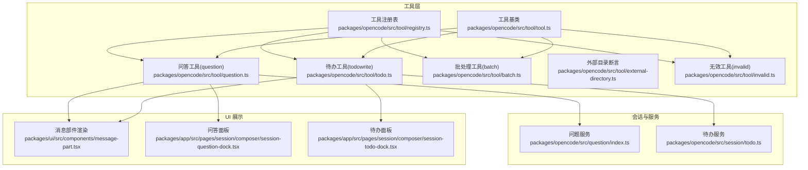
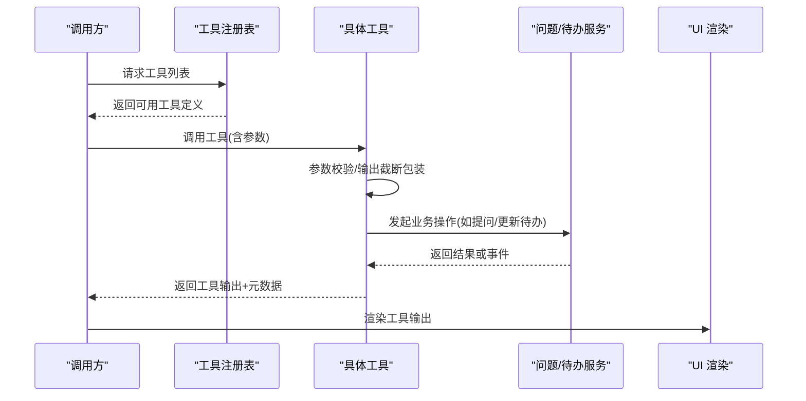
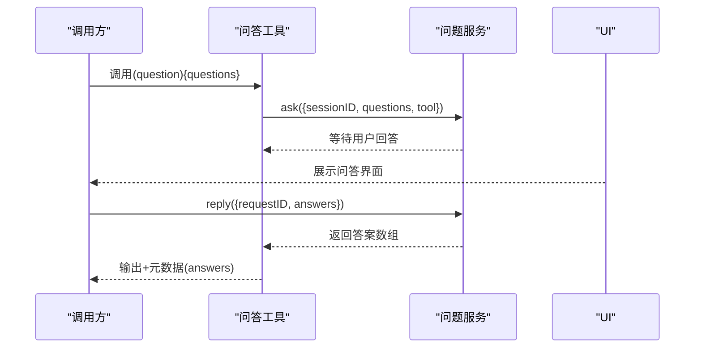
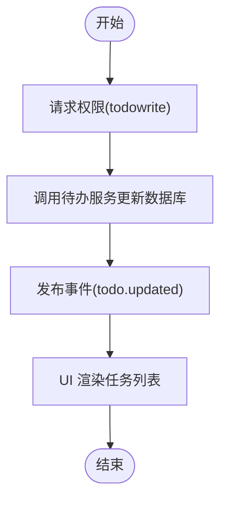
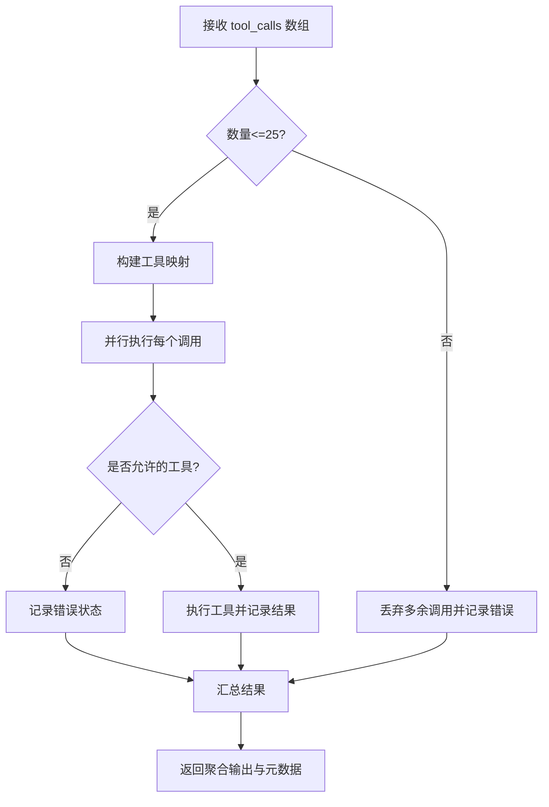
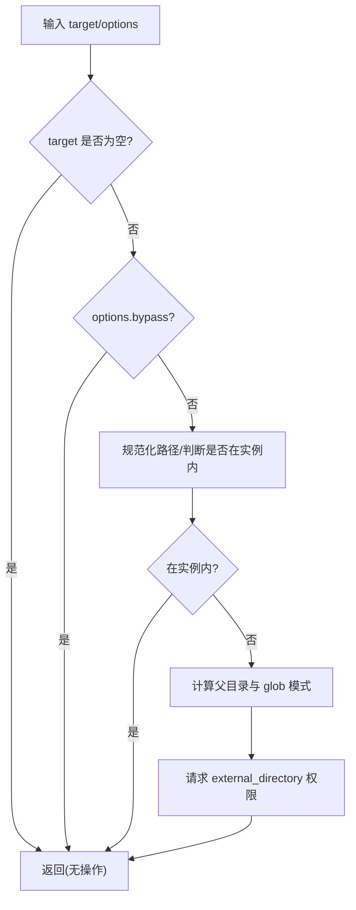
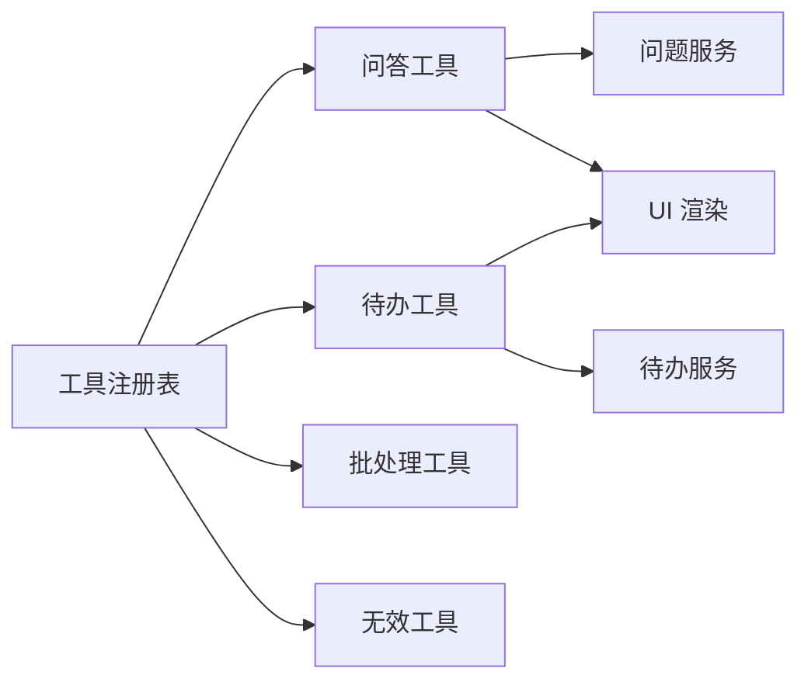

# 实用工具

<cite>
**本文引用的文件**
- [packages/opencode/src/tool/tool.ts](file://packages/opencode/src/tool/tool.ts)
- [packages/opencode/src/tool/question.ts](file://packages/opencode/src/tool/question.ts)
- [packages/opencode/src/question/index.ts](file://packages/opencode/src/question/index.ts)
- [packages/ui/src/components/message-part.tsx](file://packages/ui/src/components/message-part.tsx)
- [packages/opencode/src/tool/todo.ts](file://packages/opencode/src/tool/todo.ts)
- [packages/opencode/src/session/todo.ts](file://packages/opencode/src/session/todo.ts)
- [packages/opencode/src/tool/batch.ts](file://packages/opencode/src/tool/batch.ts)
- [packages/opencode/src/tool/external-directory.ts](file://packages/opencode/src/tool/external-directory.ts)
- [packages/opencode/src/tool/invalid.ts](file://packages/opencode/src/tool/invalid.ts)
- [packages/opencode/src/tool/registry.ts](file://packages/opencode/src/tool/registry.ts)
- [packages/app/src/pages/session/composer/session-question-dock.tsx](file://packages/app/src/pages/session/composer/session-question-dock.tsx)
- [packages/app/src/pages/session/composer/session-todo-dock.tsx](file://packages/app/src/pages/session/composer/session-todo-dock.tsx)
- [.opencode/opencode.jsonc](file://.opencode/opencode.jsonc)
</cite>

## 目录
1. [简介](#简介)
2. [项目结构](#项目结构)
3. [核心组件](#核心组件)
4. [架构总览](#架构总览)
5. [详细组件分析](#详细组件分析)
6. [依赖关系分析](#依赖关系分析)
7. [性能考量](#性能考量)
8. [故障排查指南](#故障排查指南)
9. [结论](#结论)
10. [附录](#附录)

## 简介
本文件面向 OpenCode 实用工具的使用者与集成者，系统性说明以下工具的能力边界与使用方式：
- 问答工具（question）：支持在会话中发起多轮、带上下文的对话，收集用户回答并回传给调用方。
- 待办事项工具（todowrite）：用于在当前会话中创建、更新任务列表，支持状态与优先级管理。
- 批处理工具（batch）：将多个工具调用并行执行，统一调度、并发控制与结果聚合。
- 外部目录工具（external-directory）：对跨工作区路径进行访问声明与权限校验。
- 无效工具（invalid）：用于参数校验失败时的兜底反馈，便于调试。

同时给出组合使用场景与最佳实践建议，帮助在复杂任务中提升效率与可追溯性。

## 项目结构
实用工具位于 .opencode/tool 与 packages/opencode/src/tool 下，围绕“工具注册表”统一暴露能力，并通过会话与服务层完成数据持久化与事件广播。UI 层负责渲染工具输出与交互。

图表来源
- [packages/opencode/src/tool/registry.ts:1-249](file://packages/opencode/src/tool/registry.ts#L1-L249)
- [packages/opencode/src/tool/tool.ts:1-113](file://packages/opencode/src/tool/tool.ts#L1-L113)
- [packages/opencode/src/tool/question.ts:1-47](file://packages/opencode/src/tool/question.ts#L1-L47)
- [packages/opencode/src/tool/todo.ts:1-49](file://packages/opencode/src/tool/todo.ts#L1-L49)
- [packages/opencode/src/tool/batch.ts:1-184](file://packages/opencode/src/tool/batch.ts#L1-L184)
- [packages/opencode/src/tool/external-directory.ts:1-38](file://packages/opencode/src/tool/external-directory.ts#L1-L38)
- [packages/opencode/src/tool/invalid.ts:1-18](file://packages/opencode/src/tool/invalid.ts#L1-L18)
- [packages/opencode/src/question/index.ts:1-225](file://packages/opencode/src/question/index.ts#L1-L225)
- [packages/opencode/src/session/todo.ts:1-96](file://packages/opencode/src/session/todo.ts#L1-L96)
- [packages/ui/src/components/message-part.tsx:2140-2189](file://packages/ui/src/components/message-part.tsx#L2140-L2189)
- [packages/app/src/pages/session/composer/session-question-dock.tsx:423-463](file://packages/app/src/pages/session/composer/session-question-dock.tsx#L423-L463)
- [packages/app/src/pages/session/composer/session-todo-dock.tsx:225-256](file://packages/app/src/pages/session/composer/session-todo-dock.tsx#L225-L256)

章节来源
- [packages/opencode/src/tool/registry.ts:1-249](file://packages/opencode/src/tool/registry.ts#L1-L249)
- [.opencode/opencode.jsonc:1-19](file://.opencode/opencode.jsonc#L1-L19)

## 核心组件
- 工具基类与上下文
  - 定义了工具的统一接口、参数校验包装、输出截断策略与上下文（会话ID、消息ID、调用链ID、权限请求等）。
- 问答工具（question）
  - 通过问题服务发起提问，等待用户回答；将答案以元数据形式回传，供后续推理使用。
- 待办工具（todowrite）
  - 在会话内写入/更新任务列表，支持状态与优先级；UI 展示已完成/进行中/待定比例。
- 批处理工具（batch）
  - 并行执行多个工具调用，统一记录每个子调用的生命周期与结果，聚合成功/失败统计。
- 外部目录工具（external-directory）
  - 对跨工作区路径进行权限声明，生成 glob 模式并触发权限请求。
- 无效工具（invalid）
  - 参数校验失败时返回标准化错误信息，便于调试。

章节来源
- [packages/opencode/src/tool/tool.ts:1-113](file://packages/opencode/src/tool/tool.ts#L1-L113)
- [packages/opencode/src/tool/question.ts:1-47](file://packages/opencode/src/tool/question.ts#L1-L47)
- [packages/opencode/src/tool/todo.ts:1-49](file://packages/opencode/src/tool/todo.ts#L1-L49)
- [packages/opencode/src/tool/batch.ts:1-184](file://packages/opencode/src/tool/batch.ts#L1-L184)
- [packages/opencode/src/tool/external-directory.ts:1-38](file://packages/opencode/src/tool/external-directory.ts#L1-L38)
- [packages/opencode/src/tool/invalid.ts:1-18](file://packages/opencode/src/tool/invalid.ts#L1-L18)

## 架构总览
工具体系由“注册表”集中暴露可用工具，按模型/代理能力过滤后下发到客户端；工具在执行前进行参数校验与输出截断，执行过程中通过会话部分（Part）记录状态；UI 侧根据工具输出与元数据进行渲染与交互。

图表来源
- [packages/opencode/src/tool/registry.ts:177-216](file://packages/opencode/src/tool/registry.ts#L177-L216)
- [packages/opencode/src/tool/tool.ts:58-94](file://packages/opencode/src/tool/tool.ts#L58-L94)
- [packages/opencode/src/tool/question.ts:23-44](file://packages/opencode/src/tool/question.ts#L23-L44)
- [packages/opencode/src/tool/todo.ts:23-46](file://packages/opencode/src/tool/todo.ts#L23-L46)
- [packages/ui/src/components/message-part.tsx:2140-2189](file://packages/ui/src/components/message-part.tsx#L2140-L2189)

## 详细组件分析

### 问答工具（question）
- 功能要点
  - 接收一组问题定义，通过问题服务发起提问，等待用户回答。
  - 将用户的答案作为元数据回传，便于后续推理结合上下文继续对话。
  - UI 支持多问题、进度指示与跳转。
- 上下文与历史
  - 使用会话ID与工具调用链ID关联一次提问请求，确保多轮对话可被正确追踪。
  - 问题服务维护“待回答”状态与事件总线，支持拒绝与回复流程。
- 输出与元数据
  - 工具输出包含汇总提示；元数据包含每道题目的答案数组，便于 UI 呈现与后续使用。

图表来源
- [packages/opencode/src/tool/question.ts:23-44](file://packages/opencode/src/tool/question.ts#L23-L44)
- [packages/opencode/src/question/index.ts:132-157](file://packages/opencode/src/question/index.ts#L132-L157)
- [packages/opencode/src/question/index.ts:159-174](file://packages/opencode/src/question/index.ts#L159-L174)
- [packages/ui/src/components/message-part.tsx:2191-2234](file://packages/ui/src/components/message-part.tsx#L2191-L2234)
- [packages/app/src/pages/session/composer/session-question-dock.tsx:423-463](file://packages/app/src/pages/session/composer/session-question-dock.tsx#L423-L463)

章节来源
- [packages/opencode/src/tool/question.ts:1-47](file://packages/opencode/src/tool/question.ts#L1-L47)
- [packages/opencode/src/question/index.ts:1-225](file://packages/opencode/src/question/index.ts#L1-L225)
- [packages/ui/src/components/message-part.tsx:2191-2234](file://packages/ui/src/components/message-part.tsx#L2191-L2234)
- [packages/app/src/pages/session/composer/session-question-dock.tsx:423-463](file://packages/app/src/pages/session/composer/session-question-dock.tsx#L423-L463)

### 待办事项工具（todowrite）
- 功能要点
  - 接收任务列表，先请求权限，再通过待办服务更新数据库并发布事件。
  - UI 展示任务清单，显示完成/进行中/待定的比例与内容。
- 数据模型
  - 任务包含内容、状态（待定/进行中/已完成/已取消）、优先级（高/中/低），按位置排序存储。
- 权限与安全
  - 调用前通过权限请求，确保对会话相关资源的操作得到授权。

图表来源
- [packages/opencode/src/tool/todo.ts:23-46](file://packages/opencode/src/tool/todo.ts#L23-L46)
- [packages/opencode/src/session/todo.ts:42-81](file://packages/opencode/src/session/todo.ts#L42-L81)
- [packages/ui/src/components/message-part.tsx:2140-2189](file://packages/ui/src/components/message-part.tsx#L2140-L2189)
- [packages/app/src/pages/session/composer/session-todo-dock.tsx:225-256](file://packages/app/src/pages/session/composer/session-todo-dock.tsx#L225-L256)

章节来源
- [packages/opencode/src/tool/todo.ts:1-49](file://packages/opencode/src/tool/todo.ts#L1-L49)
- [packages/opencode/src/session/todo.ts:1-96](file://packages/opencode/src/session/todo.ts#L1-L96)
- [packages/ui/src/components/message-part.tsx:2140-2189](file://packages/ui/src/components/message-part.tsx#L2140-L2189)
- [packages/app/src/pages/session/composer/session-todo-dock.tsx:225-256](file://packages/app/src/pages/session/composer/session-todo-dock.tsx#L225-L256)

### 批处理工具（batch）
- 功能要点
  - 接收工具调用数组，最多 25 个；并行执行，统一记录每个调用的生命周期与结果。
  - 对不允许的工具进行拦截；对外部工具（MCP/环境）明确不可批量，需直接调用。
  - 聚合成功/失败计数与详情，输出附件（仅成功调用的附件）。
- 并发与可观测性
  - 使用 Promise.all 并行执行；每个子调用独立记录开始/结束时间与状态。
  - 对超出上限的调用以错误形式补充到结果中，保证统计完整性。

图表来源
- [packages/opencode/src/tool/batch.ts:34-181](file://packages/opencode/src/tool/batch.ts#L34-L181)

章节来源
- [packages/opencode/src/tool/batch.ts:1-184](file://packages/opencode/src/tool/batch.ts#L1-L184)

### 外部目录工具（external-directory）
- 功能要点
  - 当目标路径不在当前实例范围内且未绕过校验时，计算父目录的 glob 模式，请求 external_directory 权限。
  - 支持声明“文件/目录”两种类型，Windows 平台自动规范化路径与模式。
- 安全与权限
  - 通过 ctx.ask 触发权限请求，确保对跨工作区访问的最小授权。

图表来源
- [packages/opencode/src/tool/external-directory.ts:13-37](file://packages/opencode/src/tool/external-directory.ts#L13-L37)

章节来源
- [packages/opencode/src/tool/external-directory.ts:1-38](file://packages/opencode/src/tool/external-directory.ts#L1-L38)

### 无效工具（invalid）
- 功能要点
  - 当参数校验失败时，返回标准化错误信息，便于前端展示与定位问题。
- 调试价值
  - 与工具基类的格式化错误机制配合，快速暴露参数不合法的具体路径与原因。

章节来源
- [packages/opencode/src/tool/invalid.ts:1-18](file://packages/opencode/src/tool/invalid.ts#L1-L18)
- [packages/opencode/src/tool/tool.ts:68-76](file://packages/opencode/src/tool/tool.ts#L68-L76)

## 依赖关系分析
- 注册表集中管理内置工具与插件扩展，按模型/特性开关过滤工具集，统一暴露给调用方。
- 工具基类提供参数校验与输出截断的横切逻辑，减少重复实现。
- 问答与待办工具分别依赖对应的服务层，实现业务闭环。
- UI 层通过工具注册表渲染工具输出，支持多问题与任务列表的可视化。

图表来源
- [packages/opencode/src/tool/registry.ts:143-169](file://packages/opencode/src/tool/registry.ts#L143-L169)
- [packages/opencode/src/tool/tool.ts:58-94](file://packages/opencode/src/tool/tool.ts#L58-L94)
- [packages/opencode/src/question/index.ts:109-199](file://packages/opencode/src/question/index.ts#L109-L199)
- [packages/opencode/src/session/todo.ts:37-83](file://packages/opencode/src/session/todo.ts#L37-L83)
- [packages/ui/src/components/message-part.tsx:2140-2189](file://packages/ui/src/components/message-part.tsx#L2140-L2189)

章节来源
- [packages/opencode/src/tool/registry.ts:1-249](file://packages/opencode/src/tool/registry.ts#L1-L249)
- [packages/opencode/src/tool/tool.ts:1-113](file://packages/opencode/src/tool/tool.ts#L1-L113)

## 性能考量
- 并发执行
  - 批处理工具采用 Promise.all 并行执行，适合 I/O 密集型任务；对 CPU 密集型任务应谨慎使用，避免过度竞争。
- 结果聚合
  - 统一记录每个子调用的生命周期与状态，便于监控与重试策略制定。
- 输出截断
  - 工具基类对输出进行截断与可选落盘，避免超长文本影响传输与渲染性能。
- UI 渲染
  - 问答与待办 UI 采用虚拟滚动与懒加载策略，保障历史消息与任务列表的流畅体验。

## 故障排查指南
- 参数校验失败
  - 工具基类会将 Zod 校验错误格式化为可读信息；若存在自定义格式化函数，优先使用工具提供的格式化输出。
- 无效工具调用
  - invalid 工具用于兜底参数错误，检查返回的错误信息定位具体字段。
- 权限不足
  - external-directory 会在跨工作区访问时触发权限请求；确认权限请求已通过且 glob 模式覆盖目标路径。
- 批处理异常
  - 关注失败计数与详情，逐项排查工具名是否在注册表中、是否被禁用或不允许批量执行。
- 问答未返回
  - 确认问题服务的“待回答”状态与事件总线正常；检查 UI 是否正确订阅并渲染。

章节来源
- [packages/opencode/src/tool/tool.ts:68-76](file://packages/opencode/src/tool/tool.ts#L68-L76)
- [packages/opencode/src/tool/invalid.ts:10-16](file://packages/opencode/src/tool/invalid.ts#L10-L16)
- [packages/opencode/src/tool/external-directory.ts:28-36](file://packages/opencode/src/tool/external-directory.ts#L28-L36)
- [packages/opencode/src/tool/batch.ts:164-181](file://packages/opencode/src/tool/batch.ts#L164-L181)
- [packages/opencode/src/question/index.ts:132-157](file://packages/opencode/src/question/index.ts#L132-L157)

## 结论
OpenCode 实用工具通过统一的工具基类与注册表，提供了参数校验、权限请求、输出截断与并行执行等横切能力；问答与待办工具分别覆盖对话式交互与任务管理两大场景；批处理工具提升多任务执行效率；外部目录工具强化跨工作区访问的安全性。结合 UI 的可视化呈现与事件驱动的会话机制，形成从“感知—决策—执行—反馈”的完整闭环。

## 附录
- 组合使用场景与最佳实践
  - 场景一：需求拆解与任务编排
    - 先用问答工具澄清需求，再用待办工具列出任务清单，最后用批处理工具并行执行若干文件读写/搜索等 I/O 任务，完成后统一汇总结果。
  - 场景二：跨目录批量处理
    - 使用 external-directory 对目标目录进行权限声明，随后在批处理中并行调用读取/编辑工具，确保最小权限与可审计性。
  - 最佳实践
    - 控制批处理规模（≤25），避免阻塞主流程。
    - 为复杂任务启用待办工具，保持任务状态清晰可见。
    - 参数校验失败时优先查看 invalid 工具返回的格式化错误，快速修复。
    - 在 Windows 平台注意路径与 glob 模式的规范化。